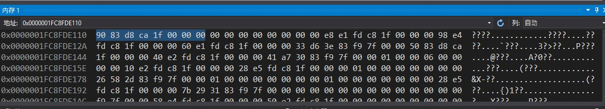

CoreCLR源码探索(一) Object是什么

.Net程序员们每天都在和Object在打交道
如果你问一个.Net程序员什么是Object，他可能会信誓旦旦的告诉你"Object还不简单吗，就是所有类型的基类"
这个答案是对的，但是不足以说明Object真正是什么

在这篇文章我们将会通过阅读CoreCLR的源代码了解Object在内存中的结构和实际到内存中瞧瞧Object

### 勘误

通过更多的测试我发现了以下的错误，在此做出纠正，请之前的读者见谅

- Object前面的不是指向ObjHeader的指针而是ObjHeader自身
- GC Pinned保存在ObjHeader(SyncBlock)而不是MethodTable

### Object在内存中的结构

为了便于理解后面的内容，我先用一张图说明Object在内存中的结构


.Net中的Object包含了这三个部分

- 对象头部(只包含了同步索引块)
- 指向类型信息的指针
- 字段内容

微软有一张更全的图（说明的是.Net Framework的结构，但是基本和.Net Core一样)


### Object的源代码解析

Object的定义(摘要)
源代码: https://github.com/dotnet/coreclr/blob/master/src/vm/object.h
``` c++
class Object
{
	PTR_MethodTable m_pMethTab;
}
```

PTR_MethodTable的定义，DPTR是一个指针的包装类，你可以先理解为MethodTable*的等价
源代码: https://github.com/dotnet/coreclr/blob/master/src/vm/common.h
``` c++
typedef DPTR(class MethodTable) PTR_MethodTable;
```

在Object的定义中我们只看到了一个成员，这个成员就是**指向类型信息的指针**，那其他两个部分呢？

这是获取**指向头部的指针**的函数，我们可以看到对象头部刚好放在了Object的前面
``` c++
PTR_ObjHeader GetHeader()
{
	LIMITED_METHOD_DAC_CONTRACT;
	return dac_cast<PTR_ObjHeader>(this) - 1;
}
```

这是获取**字段内容**的函数，我们可以看到字段内容刚好放在了Object的后面
``` c++
PTR_BYTE GetData(void)
{
	LIMITED_METHOD_CONTRACT;
	SUPPORTS_DAC;
	return dac_cast<PTR_BYTE>(this) + sizeof(Object);
}
```

我们可以看到Object中虽然只定义了**指向类型信息的指针**，但运行时候前面会带**对象头部**，并且后面会带**字段内容**
Object结构比较特殊，所以这个对象的生成也需要特殊的处理，关于Object的生成我将在后面的篇幅中介绍

Object中定义的`m_pMethTab`还保存了额外的信息，因为这是一个指针值，所以总会以4或者8对齐，这样最后两个bit会总是为0
.Net利用了最后一个闲置的bit，用于保存GC Marking(GC标记对象是否存活)，关于这里我也将在后面的篇幅中介绍

### ObjHeader的源代码解析

ObjHeader的定义(摘要)
源代码: https://github.com/dotnet/coreclr/blob/master/src/vm/syncblk.h
``` c++
class ObjHeader
{
// !!! Notice: m_SyncBlockValue *MUST* be the last field in ObjHeader.
#ifdef _WIN64
	DWORD    m_alignpad;
#endif // _WIN64
	
	Volatile<DWORD> m_SyncBlockValue;      // the Index and the Bits
}
```

`m_alignpad`是用于对齐的（让`m_SyncBlockValue`在后面4位），值应该为0
`m_SyncBlockValue`的前6位是标记，后面26位是对应的`SyncBlock`在`SyncBlockCache`中的索引
`SyncBlock`的作用简单的来说就是用于线程同步的，例如下面的代码会用到`SyncBlock`

``` c#
var obj = new object();
lock (obj) { }
```

`ObjHeader`只包含了`SyncBlock`，所以你可以看到有的讲解Object结构的文章中会用`SyncBlock`代替`ObjHeader`
关于`SyncBlock`更具体的讲解还可以[查看这篇文章](https://msdn.microsoft.com/zh-cn/library/aa686043.aspx)

### MethodTable的源代码解析

MethodTable的定义(摘要)
源代码: https://github.com/dotnet/coreclr/blob/master/src/vm/methodtable.h
``` c++
class MethodTable
{
	// Low WORD is component size for array and string types (HasComponentSize() returns true).
	// Used for flags otherwise.
	DWORD m_dwFlags;
	
	// Base size of instance of this class when allocated on the heap
	DWORD m_BaseSize;
	
	WORD m_wFlags2;
	
	// Class token if it fits into 16-bits. If this is (WORD)-1, the class token is stored in the TokenOverflow optional member.
	WORD m_wToken;
	
	// <NICE> In the normal cases we shouldn't need a full word for each of these </NICE>
	WORD m_wNumVirtuals;
	WORD m_wNumInterfaces;
	
#ifdef _DEBUG
	LPCUTF8 debug_m_szClassName;
#endif //_DEBUG
	
	// Parent PTR_MethodTable if enum_flag_HasIndirectParent is not set. Pointer to indirection cell
	// if enum_flag_enum_flag_HasIndirectParent is set. The indirection is offset by offsetof(MethodTable, m_pParentMethodTable).
	// It allows casting helpers to go through parent chain natually. Casting helper do not need need the explicit check
	// for enum_flag_HasIndirectParentMethodTable.
	TADDR m_pParentMethodTable;
	
	PTR_Module m_pLoaderModule;    // LoaderModule. It is equal to the ZapModule in ngened images
	
	PTR_MethodTableWriteableData m_pWriteableData;
	
	union {
		EEClass *   m_pEEClass;
		TADDR       m_pCanonMT;
	};
	
	// m_pPerInstInfo and m_pInterfaceMap have to be at fixed offsets because of performance sensitive 
	// JITed code and JIT helpers. However, they are frequently not present. The space is used by other
	// multipurpose slots on first come first served basis if the fixed ones are not present. The other 
	// multipurpose are DispatchMapSlot, NonVirtualSlots, ModuleOverride (see enum_flag_MultipurposeSlotsMask).
	// The multipurpose slots that do not fit are stored after vtable slots.
	union
	{
		PTR_Dictionary *    m_pPerInstInfo;
		TADDR               m_ElementTypeHnd;
		TADDR               m_pMultipurposeSlot1;
	};
	
	union
	{
		InterfaceInfo_t *   m_pInterfaceMap;
		TADDR               m_pMultipurposeSlot2;
	};
	
	// 接下来还有一堆OPTIONAL_MEMBERS，这里省去介绍
}
```

这里的字段非常多，我将会在后面的篇幅一一讲解，这里先说明MethodTable中大概有什么信息
- 类型的标记，例如`StaticsMask_Dynamic`和`StaticsMask_Generics`等 (m_dwFlags)
	- 如果类型是字符串或数组还会保存每个元素的大小(ComponentSize)，例如string是2 int[100]是4
- 类型需要分配的内存大小 (m_BaseSize)
- 类型信息，例如有哪些成员和是否接口等等 (m_pCanonMT)

可以看出这个类型就是用于保存类型信息的，反射和动态Cast都需要依赖它

### 实际查看内存中的Object

对Object的初步分析完了，可分析对了吗？让我们来实际检查一下内存中Object是什么样子的
VisualStudio有反编译和查看内存的功能，如下图


这里我定义了`MyClass`和`MyStruct`类型，先看`Console.WriteLine(myClass)`
这里把第一个参数设置到rcx并且调用`Console.WriteLine`函数，为什么是rcx请看查看参考链接中对`fastcall`的介绍
`rbp + 0x50 = 0x1fc8fde110`



跳到内存中以后可以看到选中的这8byte是指向对象的指针，让我们继续跳到0x1fcad88390


这里我们可以看到`MyClass`实例的真面目了，选中的8byte是指向`MethodTable`的指针
后面分别是指向StringMember的指针和IntMember的内容
在这里ObjHeader中的同步索引块值是0，这是正常的，微软在代码中有注释`This is often zero`


这里是StringMember指向的内容，分别是指向`MethodTable`的指针，字符串长度和字符串内容


这里是`MyClass`的`MethodTable`，`m_BaseSize`是32
有兴趣的可以去和`MethodTable`的成员一一对照，这里我就不跟下去了
让我们再看下struct是怎么处理的


可以看到只是简单的把值复制到了堆栈空间中（rbp是当前frame的堆栈基础地址)
让我们再来看下`Console.WriteLine`对于struct是怎么处理的，这里的处理相当有趣


因为需要装箱，首先会要来一个箱子，箱子放在了`rbp+30h`


把`MyStruct`中的值复制到了箱子中，`rax+8`的8是把值复制到`MethodTable`之后


复制后，接下来把这个箱子传给`Console.WriteLine`就和`MyClass`一样了

另外再附一张实际查看`ComponentSize`的图


### 彩蛋

看完了.Net中对Object的定义，让我们再看下Python中对Object的定义
源代码: https://github.com/python/cpython/blob/master/Include/object.h
``` c
#define PyObject_HEAD PyObject ob_base; // 每个子类都需要把这个放在最开头

typedef struct _object {
#ifdef Py_TRACE_REFS
	struct _object *_ob_next; // Heap中的前一个对象
	struct _object *_ob_prev; // Heap中的后一个对象
#endif
	Py_ssize_t ob_refcnt; // 引用计数
	struct _typeobject *ob_type; // 指向类型信息
} PyObject;
```

定义不一样，但是作用还是类似的

### 参考

http://stackoverflow.com/questions/20033353/clr-implementation-of-virtual-method-calls-via-pointer-to-base-class
http://stackoverflow.com/questions/9808982/clr-implementation-of-virtual-method-calls-to-interface-members
http://stackoverflow.com/questions/1589669/overhead-of-a-net-array
https://en.wikipedia.org/wiki/X86_calling_conventions
https://github.com/dotnet/coreclr/blob/master/src/vm/object.inl
https://github.com/dotnet/coreclr/blob/master/src/vm/object.h
https://github.com/dotnet/coreclr/blob/master/src/vm/object.cpp
https://github.com/dotnet/coreclr/blob/master/src/vm/syncblk.h
https://github.com/dotnet/coreclr/blob/master/src/vm/syncblk.cpp
https://github.com/dotnet/coreclr/blob/master/src/vm/methodtable.inl
https://github.com/dotnet/coreclr/blob/master/src/vm/methodtable.h
https://github.com/dotnet/coreclr/blob/master/src/vm/methodtable.cpp
https://github.com/dotnet/coreclr/blob/master/src/vm/class.h
https://github.com/dotnet/coreclr/blob/master/src/inc/daccess.h
https://github.com/dotnet/coreclr/blob/master/src/debug/daccess/dacfn.cpp

### 写在最后

因为是刚开始阅读coreclr的代码，如果有误请在留言中指出
接下来有时间我将会着重阅读和介绍这些内容

- Object的生成和销毁
- ~~Object继承的原理(MethodTable)~~
- ~~Object同步的原理(ObjHeader, SyncBlock)~~
- GC的工作方式
- ~~DACCESS~~

敬请期待

2017-11-03更新: 这个系列暂时会停止更新, 很可惜上面的3项不能介绍它们了