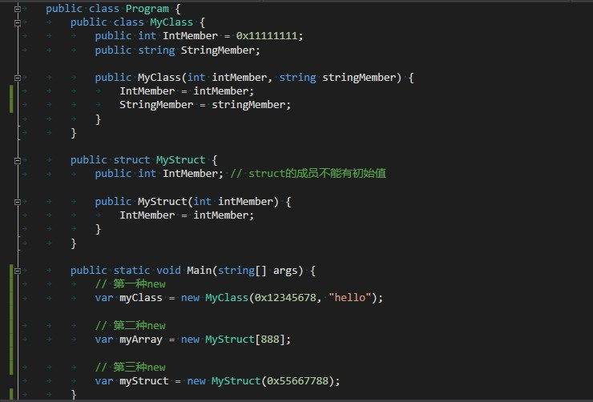

CoreCLR源码探索(二) new是什么

前一篇我们看到了CoreCLR中对Object的定义，这一篇我们将会看CoreCLR中对new的定义和处理
new对于.Net程序员们来说同样是耳熟能详的关键词，我们每天都会用到new，然而new究竟是什么？

因为篇幅限制和避免难度跳的太高，这一篇将不会详细讲解以下的内容，请耐心等待后续的文章

- GC如何分配内存
- JIT如何解析IL
- JIT如何生成机器码

### 使用到的名词和缩写

以下的内容将会使用到一些名词和缩写，如果碰到看不懂的可以到这里来对照

```plain
BasicBlock: 在同一个分支(Branch)的一群指令，使用双向链表连接
GenTree: 语句树，节点类型以GT开头
Importation: 从BasicBlock生成GenTree的过程
Lowering: 具体化语句树，让语句树的各个节点可以明确的转换到机器码
SSA: Static Single Assignment
R2R: Ready To Run
Phases: JIT编译IL到机器码经过的各个阶段
JIT: Just In Time
CEE: CLR Execute Engine
ee: Execute Engine
EH: Exception Handling
Cor: CoreCLR
comp: Compiler
fg: FlowGraph
imp: Import
LDLOCA: Load Local Variable
gt: Generate
hlp: Help
Ftn: Function
MP: Multi Process
CER: Constrained Execution Regions
TLS: Thread Local Storage
```

### .Net中的三种new

请看图中的代码和生成的IL，我们可以看到尽管同样是new，却生成了三种不同的IL代码




- 对class的new，IL指令是newobj
- 对array的new，IL指令是newarr
- 对struct的new，因为myStruct已经在本地变量里面了，new的时候仅仅是调用ldloca加载然后调用构造函数

我们先来看newobj和newarr这两个指令在coreclr中是怎么定义的
源代码: https://github.com/dotnet/coreclr/blob/release/1.1.0/src/inc/opcode.def#L153

``` c++
OPDEF(CEE_NEWOBJ, "newobj", VarPop, PushRef, InlineMethod, IObjModel, 1, 0xFF, 0x73, CALL)
OPDEF(CEE_NEWARR, "newarr", PopI, PushRef, InlineType, IObjModel, 1, 0xFF, 0x8D, NEXT)
```

我们可以看到这两个指令的定义，名称分别是CEE_NEWOBJ和CEE_NEWARR，请记住这两个名称

### 第一种new(对class的new)生成了什么机器码

接下来我们将看看coreclr是如何把CEE_NEWOBJ指令变为机器码的
在讲解之前请先大概了解JIT的工作流程，JIT编译按函数为单位，当调用函数时会自动触发JIT编译

- 把函数的IL转换为BasicBlock(基本代码块)
- 从BasicBlock(基本代码块)生成GenTree(语句树)
- 对GenTree(语句树)进行Morph(变形)
- 对GenTree(语句树)进行Lowering(具体化)
- 根据GenTree(语句树)生成机器码

下面的代码虽然进过努力的提取，但仍然比较长，请耐心阅读

我们从JIT的入口函数开始看，这个函数会被EE(运行引擎)调用
源代码: https://github.com/dotnet/coreclr/blob/release/1.1.0/src/inc/corjit.h#L350
源代码: https://github.com/dotnet/coreclr/blob/release/1.1.0/src/jit/ee_il_dll.cpp#L279
注: 按微软文档中说CILJit是32位上的实现，PreJit是64位上的实现，但实际我找不到PreJit在哪里
``` c++
CorJitResult CILJit::compileMethod(
    ICorJitInfo* compHnd, CORINFO_METHOD_INFO* methodInfo, unsigned flags, BYTE** entryAddress, ULONG* nativeSizeOfCode)
{
    // 省略部分代码......
    assert(methodInfo->ILCode);
    result = jitNativeCode(methodHandle, methodInfo->scope, compHnd, methodInfo, &methodCodePtr, nativeSizeOfCode,
                           &jitFlags, nullptr);
    // 省略部分代码......
    return CorJitResult(result);
}
```

jitNativeCode是一个负责使用JIT编译单个函数的静态函数，会在内部为编译的函数创建单独的Compiler实例
源代码: https://github.com/dotnet/coreclr/blob/release/1.1.0/src/jit/compiler.cpp#L6075
``` c++
int jitNativeCode(CORINFO_METHOD_HANDLE methodHnd,
                  CORINFO_MODULE_HANDLE classPtr,
                  COMP_HANDLE           compHnd,
                  CORINFO_METHOD_INFO*  methodInfo,
                  void**                methodCodePtr,
                  ULONG*                methodCodeSize,
                  JitFlags*             compileFlags,
                  void*                 inlineInfoPtr)
{
    // 省略部分代码......
    pParam->pComp->compInit(pParam->pAlloc, pParam->inlineInfo);
    pParam->pComp->jitFallbackCompile = pParam->jitFallbackCompile;
    // Now generate the code
    pParam->result =
        pParam->pComp->compCompile(pParam->methodHnd, pParam->classPtr, pParam->compHnd, pParam->methodInfo,
                                   pParam->methodCodePtr, pParam->methodCodeSize, pParam->compileFlags);
    // 省略部分代码......
    return result;
}
```

Compiler::compCompile是Compiler类提供的入口函数，作用同样是编译函数
注意这个函数有7个参数，等一会还会有一个同名但只有3个参数的函数
这个函数主要调用了Compiler::compCompileHelper函数
源代码: https://github.com/dotnet/coreclr/blob/release/1.1.0/src/jit/compiler.cpp#L4693
``` c++
int Compiler::compCompile(CORINFO_METHOD_HANDLE methodHnd,
                          CORINFO_MODULE_HANDLE classPtr,
                          COMP_HANDLE           compHnd,
                          CORINFO_METHOD_INFO*  methodInfo,
                          void**                methodCodePtr,
                          ULONG*                methodCodeSize,
                          JitFlags*             compileFlags)
{
    // 省略部分代码......
    pParam->result = pParam->pThis->compCompileHelper(pParam->classPtr, pParam->compHnd, pParam->methodInfo,
                                                      pParam->methodCodePtr, pParam->methodCodeSize,
                                                      pParam->compileFlags, pParam->instVerInfo);
    // 省略部分代码......
    return param.result;
}
```

让我们继续看Compiler::compCompileHelper
源代码: https://github.com/dotnet/coreclr/blob/release/1.1.0/src/jit/compiler.cpp#L5294
``` c++
int Compiler::compCompileHelper(CORINFO_MODULE_HANDLE            classPtr,
                                COMP_HANDLE                      compHnd,
                                CORINFO_METHOD_INFO*             methodInfo,
                                void**                           methodCodePtr,
                                ULONG*                           methodCodeSize,
                                JitFlags*                        compileFlags,
                                CorInfoInstantiationVerification instVerInfo)
{
    // 省略部分代码......
    // 初始化本地变量表
    lvaInitTypeRef();
    
    // 省略部分代码......
    // 查找所有BasicBlock
    fgFindBasicBlocks();

    // 省略部分代码......
    // 调用3个参数的compCompile函数，注意不是7个函数的compCompile函数
    compCompile(methodCodePtr, methodCodeSize, compileFlags);

    // 省略部分代码......
    return CORJIT_OK;
}
```

现在到了3个参数的compCompile，这个函数被微软认为是JIT最被感兴趣的入口函数
你可以额外阅读一下微软的[JIT介绍文档](https://github.com/dotnet/coreclr/blob/master/Documentation/botr/ryujit-overview.md)
源代码: https://github.com/dotnet/coreclr/blob/release/1.1.0/src/jit/compiler.cpp#L4078
``` c++
//*********************************************************************************************
// #Phases
//
// This is the most interesting 'toplevel' function in the JIT.  It goes through the operations of
// importing, morphing, optimizations and code generation.  This is called from the EE through the
// code:CILJit::compileMethod function.
//
// For an overview of the structure of the JIT, see:
//   https://github.com/dotnet/coreclr/blob/master/Documentation/botr/ryujit-overview.md
//
void Compiler::compCompile(void** methodCodePtr, ULONG* methodCodeSize, JitFlags* compileFlags)
{
    // 省略部分代码......
    // 转换BasicBlock(基本代码块)到GenTree(语句树)
    fgImport();

    // 省略部分代码......
    // 这里会进行各个处理步骤(Phases)，如Inline和优化等
    
    // 省略部分代码......
    // 转换GT_ALLOCOBJ节点到GT_CALL节点(分配内存=调用帮助函数)
    ObjectAllocator objectAllocator(this);
    objectAllocator.Run();

    // 省略部分代码......
    // 创建本地变量表和计算各个变量的引用计数
    lvaMarkLocalVars();

    // 省略部分代码......
    // 具体化语句树
    Lowering lower(this, m_pLinearScan); // PHASE_LOWERING
    lower.Run();

    // 省略部分代码......
    // 生成机器码
    codeGen->genGenerateCode(methodCodePtr, methodCodeSize);
}
```

到这里你应该大概知道JIT在总体上做了什么事情
接下来我们来看Compiler::fgImport函数，这个函数负责把BasicBlock(基本代码块)转换到GenTree(语句树)
源代码: https://github.com/dotnet/coreclr/blob/release/1.1.0/src/jit/flowgraph.cpp#L6663
``` c++
void Compiler::fgImport()
{
    // 省略部分代码......
    impImport(fgFirstBB);
    // 省略部分代码......
}
```

再看Compiler::impImport
源代码: https://github.com/dotnet/coreclr/blob/release/1.1.0/src/jit/importer.cpp#L9207
``` c++
void Compiler::impImport(BasicBlock* method)
{
    // 省略部分代码......
    /* Import blocks in the worker-list until there are no more */
    while (impPendingList)
    {
        PendingDsc* dsc = impPendingList;
        impPendingList  = impPendingList->pdNext;
        // 省略部分代码......
        /* Now import the block */
        impImportBlock(dsc->pdBB);
    }
}
```

再看Compiler::impImportBlock
源代码: https://github.com/dotnet/coreclr/blob/release/1.1.0/src/jit/importer.cpp#L15321
``` c++
//***************************************************************
// Import the instructions for the given basic block.  Perform
// verification, throwing an exception on failure.  Push any successor blocks that are enabled for the first
// time, or whose verification pre-state is changed.
void Compiler::impImportBlock(BasicBlock* block)
{
    // 省略部分代码......
    pParam->pThis->impImportBlockCode(pParam->block);

}
```

在接下来的Compiler::impImportBlockCode函数里面我们终于可以看到对CEE_NEWOBJ指令的处理了
这个函数有5000多行，推荐直接搜索case CEE_NEWOBJ来看以下的部分
源代码: https://github.com/dotnet/coreclr/blob/release/1.1.0/src/jit/importer.cpp#L9207
``` c++
/*****************************************************************************
 *  Import the instr for the given basic block
 */
void Compiler::impImportBlockCode(BasicBlock* block)
{
    // 省略部分代码......
    // 处理CEE_NEWOBJ指令
    case CEE_NEWOBJ:
        // 在这里微软给出了有三种情况
        // 一种是对象是array，一种是对象有活动的长度（例如string），一种是普通的class
        // 在这里我们只分析第三种情况
        // There are three different cases for new
        // Object size is variable (depends on arguments)
        //      1) Object is an array (arrays treated specially by the EE)
        //      2) Object is some other variable sized object (e.g. String)
        //      3) Class Size can be determined beforehand (normal case)
        // In the first case, we need to call a NEWOBJ helper (multinewarray)
        // in the second case we call the constructor with a '0' this pointer
        // In the third case we alloc the memory, then call the constuctor
        
        // 省略部分代码......
        // 创建一个GT_ALLOCOBJ类型的GenTree(语句树)节点，用于分配内存
        op1 = gtNewAllocObjNode(info.compCompHnd->getNewHelper(&resolvedToken, info.compMethodHnd),
                                resolvedToken.hClass, TYP_REF, op1);
        
        // 省略部分代码......
        // 因为GT_ALLOCOBJ仅负责分配内存，我们还需要调用构造函数
        // 这里复用了CEE_CALL指令的处理
        goto CALL;

        // 省略部分代码......
        CALL: // memberRef should be set.
        
            // 省略部分代码......
            // 创建一个GT_CALL类型的GenTree(语句树)节点，用于调用构造函数
            callTyp = impImportCall(opcode, &resolvedToken, constraintCall ? &constrainedResolvedToken : nullptr,
                                    newObjThisPtr, prefixFlags, &callInfo, opcodeOffs);
```

请记住上面代码中新建的两个GenTree(语句树)节点
- 节点GT_ALLOCOBJ用于分配内存
- 节点GT_CALL用于调用构造函数

在上面的代码我们可以看到在生成GT_ALLOCOBJ类型的节点时还传入了一个newHelper参数，这个newHelper正是分配内存函数的一个标识(索引值)
在CoreCLR中有很多HelperFunc(帮助函数)供JIT生成的代码调用
源代码: https://github.com/dotnet/coreclr/blob/release/1.1.0/src/vm/jitinterface.cpp#L5894
``` c++
CorInfoHelpFunc CEEInfo::getNewHelper(CORINFO_RESOLVED_TOKEN * pResolvedToken, CORINFO_METHOD_HANDLE callerHandle)
{
    // 省略部分代码......
    MethodTable* pMT = VMClsHnd.AsMethodTable();
    
    // 省略部分代码......
    result = getNewHelperStatic(pMT);
    
    // 省略部分代码......
    return result;
}
```

看CEEInfo::getNewHelperStatic
源代码: https://github.com/dotnet/coreclr/blob/release/1.1.0/src/vm/jitinterface.cpp#L5941
``` c++
CorInfoHelpFunc CEEInfo::getNewHelperStatic(MethodTable * pMT)
{
    // 省略部分代码......
    // 这里有很多判断，例如是否是Com对象或拥有析构函数，默认会返回CORINFO_HELP_NEWFAST
    // Slow helper is the default
    CorInfoHelpFunc helper = CORINFO_HELP_NEWFAST;
    
    // 省略部分代码......
    return helper;
}
```

到这里，我们可以知道新建的两个节点带有以下的信息

- GT_ALLOCOBJ节点
    - 分配内存的帮助函数标识，默认是CORINFO_HELP_NEWFAST
- GT_CALL节点
    - 构造函数的句柄

在使用fgImport生成了GenTree(语句树)以后，还不能直接用这个树来生成机器代码，需要经过很多步的变换
其中的一步变换会把GT_ALLOCOBJ节点转换为GT_CALL节点，因为分配内存实际上是一个对JIT专用的帮助函数的调用
这个变换在ObjectAllocator中实现，ObjectAllocator是JIT编译过程中的一个阶段(Phase)
源代码: https://github.com/dotnet/coreclr/blob/release/1.1.0/src/jit/objectalloc.cpp#L27
``` c++
void ObjectAllocator::DoPhase()
{
    // 省略部分代码......
    MorphAllocObjNodes();
}
```

MorphAllocObjNodes用于查找所有节点，如果是GT_ALLOCOBJ则进行转换
源代码: https://github.com/dotnet/coreclr/blob/release/1.1.0/src/jit/objectalloc.cpp#L63
``` c++
void ObjectAllocator::MorphAllocObjNodes()
{
    // 省略部分代码......
    for (GenTreeStmt* stmt = block->firstStmt(); stmt; stmt = stmt->gtNextStmt)
    {
        // 省略部分代码......
        bool canonicalAllocObjFound = false;

        // 省略部分代码......
        if (op2->OperGet() == GT_ALLOCOBJ)
            canonicalAllocObjFound = true;
        
        // 省略部分代码......
        if (canonicalAllocObjFound)
        {
            // 省略部分代码......
            op2 = MorphAllocObjNodeIntoHelperCall(asAllocObj);
        }
    }
}
```

MorphAllocObjNodeIntoHelperCall的定义
源代码: https://github.com/dotnet/coreclr/blob/release/1.1.0/src/jit/objectalloc.cpp#L152
``` c++
// MorphAllocObjNodeIntoHelperCall: Morph a GT_ALLOCOBJ node into an
//                                  allocation helper call.
GenTreePtr ObjectAllocator::MorphAllocObjNodeIntoHelperCall(GenTreeAllocObj* allocObj)
{
    // 省略部分代码......
    GenTreePtr helperCall = comp->fgMorphIntoHelperCall(allocObj, allocObj->gtNewHelper, comp->gtNewArgList(op1));
    return helperCall;
}
```

fgMorphIntoHelperCall的定义
这个函数转换GT_ALLOCOBJ节点到GT_CALL节点，并且获取指向分配内存的函数的指针
源代码: https://github.com/dotnet/coreclr/blob/release/1.1.0/src/jit/morph.cpp#L61
``` c++
GenTreePtr Compiler::fgMorphIntoHelperCall(GenTreePtr tree, int helper, GenTreeArgList* args)
{
    tree->ChangeOper(GT_CALL);
    tree->gtFlags |= GTF_CALL;
    
    // 省略部分代码......
    // 如果GT_ALLOCOBJ中帮助函数的标识是CORINFO_HELP_NEWFAST，这里就是eeFindHelper(CORINFO_HELP_NEWFAST)
    // eeFindHelper会把帮助函数的表示转换为帮助函数的句柄
    tree->gtCall.gtCallType            = CT_HELPER;
    tree->gtCall.gtCallMethHnd         = eeFindHelper(helper);
    
    // 省略部分代码......
    tree = fgMorphArgs(tree->AsCall());
    return tree;
}
```

到这里，我们可以知道新建的两个节点变成了这样

- GT_CALL节点 (调用帮助函数)
    - 分配内存的帮助函数的句柄
- GT_CALL节点 (调用Managed函数)
    - 构造函数的句柄

接下来JIT还会对GenTree(语句树)做出大量处理，这里省略说明，接下来我们来看机器码的生成
函数CodeGen::genCallInstruction负责把GT_CALL节点转换为汇编
源代码: https://github.com/dotnet/coreclr/blob/release/1.1.0/src/jit/codegenxarch.cpp#L5934
``` c++
// Produce code for a GT_CALL node
void CodeGen::genCallInstruction(GenTreePtr node)
{
    // 省略部分代码......
    if (callType == CT_HELPER)
    {
        // 把句柄转换为帮助函数的句柄，默认是CORINFO_HELP_NEWFAST
        helperNum = compiler->eeGetHelperNum(methHnd);
        // 获取指向帮助函数的指针
        // 这里等于调用compiler->compGetHelperFtn(CORINFO_HELP_NEWFAST, ...)
        addr = compiler->compGetHelperFtn(helperNum, (void**)&pAddr);
    }
    else
    {
        // 调用普通函数
        // Direct call to a non-virtual user function.
        addr = call->gtDirectCallAddress;
    }
}
```

我们来看下compGetHelperFtn究竟把CORINFO_HELP_NEWFAST转换到了什么函数
compGetHelperFtn的定义
源代码: https://github.com/dotnet/coreclr/blob/release/1.1.0/src/jit/compiler.hpp#L1907
``` c++
void* Compiler::compGetHelperFtn(CorInfoHelpFunc ftnNum,        /* IN  */
                                 void**          ppIndirection) /* OUT */
{
    // 省略部分代码......
    addr = info.compCompHnd->getHelperFtn(ftnNum, ppIndirection);
    return addr;
}
```

getHelperFtn的定义
这里我们可以看到获取了hlpDynamicFuncTable这个函数表中的函数
源代码: https://github.com/dotnet/coreclr/blob/release/1.1.0/src/vm/jitinterface.cpp#L10369
``` c++
void* CEEJitInfo::getHelperFtn(CorInfoHelpFunc    ftnNum,         /* IN  */
                               void **            ppIndirection)  /* OUT */
{
    // 省略部分代码......
    pfnHelper = hlpDynamicFuncTable[dynamicFtnNum].pfnHelper;

    // 省略部分代码......
    result = (LPVOID)GetEEFuncEntryPoint(pfnHelper);
    return result;
}
```

hlpDynamicFuncTable函数表使用了jithelpers.h中的定义，其中CORINFO_HELP_NEWFAST对应的函数如下
源代码: https://github.com/dotnet/coreclr/blob/release/1.1.0/src/inc/jithelpers.h#L78
``` c++
JITHELPER(CORINFO_HELP_NEWFAST,                     JIT_New,    CORINFO_HELP_SIG_REG_ONLY)
```

可以看到对应了JIT_New，这个就是JIT生成的代码调用分配内存的函数了，JIT_New的定义如下
需要注意的是函数表中的JIT_New在满足一定条件时会被替换为更快的实现，但作用和JIT_New是一样的，这一块将在后面提及
源代码: https://github.com/dotnet/coreclr/blob/release/1.1.0/src/vm/jithelpers.cpp#L2908
``` c++
HCIMPL1(Object*, JIT_New, CORINFO_CLASS_HANDLE typeHnd_)
{
    // 省略部分代码......
    MethodTable *pMT = typeHnd.AsMethodTable();
    
    // 省略部分代码......
    // AllocateObject是分配内存的函数，这个函数供CoreCLR的内部代码或非托管代码调用
    // JIT_New是对这个函数的一个包装，仅供JIT生成的代码调用
    newobj = AllocateObject(pMT);
    
    // 省略部分代码......
    return(OBJECTREFToObject(newobj));
}
HCIMPLEND
```

**总结:**
JIT从CEE_NEWOBJ生成了两段代码，一段是调用JIT_New函数分配内存的代码，一段是调用构造函数的代码

### 第二种new(对array的new)生成了什么机器码

我们来看一下CEE_NEWARR指令是怎样处理的，因为前面已经花了很大篇幅介绍对CEE_NEWOBJ的处理，这里仅列出不同的部分
源代码: https://github.com/dotnet/coreclr/blob/release/1.1.0/src/jit/importer.cpp#L13334
``` c++
/*****************************************************************************
 *  Import the instr for the given basic block
 */
void Compiler::impImportBlockCode(BasicBlock* block)
{
    // 省略部分代码......
    // 处理CEE_NEWARR指令
    case CEE_NEWARR:

        // 省略部分代码......
        args = gtNewArgList(op1, op2);

        // 生成GT_CALL类型的节点调用帮助函数
        /* Create a call to 'new' */
        // Note that this only works for shared generic code because the same helper is used for all
        // reference array types
        op1 = gtNewHelperCallNode(info.compCompHnd->getNewArrHelper(resolvedToken.hClass), TYP_REF, 0, args);
}
```

我们可以看到CEE_NEWARR直接生成了GT_CALL节点，不像CEE_NEWOBJ需要进一步的转换
getNewArrHelper返回了调用的帮助函数，我们来看一下getNewArrHelper
源代码: https://github.com/dotnet/coreclr/blob/release/1.1.0/src/vm/jitinterface.cpp#L6035
``` c++
/***********************************************************************/
// <REVIEW> this only works for shared generic code because all the
// helpers are actually the same. If they were different then things might
// break because the same helper would end up getting used for different but
// representation-compatible arrays (e.g. one with a default constructor
// and one without) </REVIEW>
CorInfoHelpFunc CEEInfo::getNewArrHelper (CORINFO_CLASS_HANDLE arrayClsHnd)
{
    // 省略部分代码......
    TypeHandle arrayType(arrayClsHnd);
    result = getNewArrHelperStatic(arrayType);
    
    // 省略部分代码......
    return result;
}
```

再看getNewArrHelperStatic，我们可以看到一般情况下会返回CORINFO_HELP_NEWARR_1_OBJ
源代码: https://github.com/dotnet/coreclr/blob/release/1.1.0/src/vm/jitinterface.cpp#L6060
``` c++
CorInfoHelpFunc CEEInfo::getNewArrHelperStatic(TypeHandle clsHnd)
{
    // 省略部分代码......
    if (CorTypeInfo::IsGenericVariable(elemType))
    {
        result = CORINFO_HELP_NEWARR_1_OBJ;
    }
    else if (CorTypeInfo::IsObjRef(elemType))
    {
        // It is an array of object refs
        result = CORINFO_HELP_NEWARR_1_OBJ;
    }
    else
    {
        // These cases always must use the slow helper
        // 省略部分代码......
    }
    return result;
{
```

CORINFO_HELP_NEWARR_1_OBJ对应的函数如下
源代码: https://github.com/dotnet/coreclr/blob/release/1.1.0/src/inc/jithelpers.h#L86
``` c++
DYNAMICJITHELPER(CORINFO_HELP_NEWARR_1_OBJ, JIT_NewArr1,CORINFO_HELP_SIG_REG_ONLY)
```

可以看到对应了JIT_NewArr1这个包装给JIT调用的帮助函数
和JIT_New一样，在满足一定条件时会被替换为更快的实现
源代码: https://github.com/dotnet/coreclr/blob/release/1.1.0/src/vm/jithelpers.cpp#L3303
``` c++
HCIMPL2(Object*, JIT_NewArr1, CORINFO_CLASS_HANDLE arrayTypeHnd_, INT_PTR size)
{
    // 省略部分代码......
    CorElementType elemType = pArrayClassRef->GetArrayElementTypeHandle().GetSignatureCorElementType();
    
    if (CorTypeInfo::IsPrimitiveType(elemType)
    {
        // 省略部分代码......
        // 如果类型是基元类型(int, double等)则使用更快的FastAllocatePrimitiveArray函数
        newArray = FastAllocatePrimitiveArray(pArrayClassRef->GetMethodTable(), static_cast<DWORD>(size), bAllocateInLargeHeap);
    }
    else
    {
        // 省略部分代码......
        // 默认使用AllocateArrayEx函数
        INT32 size32 = (INT32)size;
        newArray = AllocateArrayEx(typeHnd, &size32, 1);
    }
    
    // 省略部分代码......
    return(OBJECTREFToObject(newArray));
}
HCIMPLEND
```

**总结:**
JIT从CEE_NEWARR只生成了一段代码，就是调用JIT_NewArr1函数的代码

### 第三种new(对struct的new)生成了什么机器码

这种new会在栈(stack)分配内存，所以不需要调用任何分配内存的函数
在一开始的例子中，myStruct在编译时就已经定义为一个本地变量，对本地变量的需要的内存会在函数刚进入的时候一并分配
这里我们先来看本地变量所需要的内存是怎么计算的

先看Compiler::lvaAssignVirtualFrameOffsetsToLocals
源代码: https://github.com/dotnet/coreclr/blob/release/1.1.0/src/jit/lclvars.cpp#L4863
``` c++
/*****************************************************************************
 *  lvaAssignVirtualFrameOffsetsToLocals() : Assign virtual stack offsets to
 *  locals, temps, and anything else.  These will all be negative offsets
 *  (stack grows down) relative to the virtual '0'/return address
 */
void Compiler::lvaAssignVirtualFrameOffsetsToLocals()
{
    // 省略部分代码......
    for (cur = 0; alloc_order[cur]; cur++)
    {
        // 省略部分代码......
        for (lclNum = 0, varDsc = lvaTable; lclNum < lvaCount; lclNum++, varDsc++)
        {
            // 省略部分代码......
            // Reserve the stack space for this variable
            stkOffs = lvaAllocLocalAndSetVirtualOffset(lclNum, lvaLclSize(lclNum), stkOffs);
        }
    }
}
```

再看Compiler::lvaAllocLocalAndSetVirtualOffset
源代码: https://github.com/dotnet/coreclr/blob/release/1.1.0/src/jit/lclvars.cpp#L5537
``` c++
int Compiler::lvaAllocLocalAndSetVirtualOffset(unsigned lclNum, unsigned size, int stkOffs)
{
    // 省略部分代码......
    /* Reserve space on the stack by bumping the frame size */
    lvaIncrementFrameSize(size);
    stkOffs -= size;
    lvaTable[lclNum].lvStkOffs = stkOffs;

    // 省略部分代码......
    return stkOffs;
}
```

再看Compiler::lvaIncrementFrameSize
我们可以看到最终会加到compLclFrameSize这个变量中，这个变量就是当前函数总共需要在栈(Stack)分配的内存大小
源代码: https://github.com/dotnet/coreclr/blob/release/1.1.0/src/jit/lclvars.cpp#L3528
``` c++
inline void Compiler::lvaIncrementFrameSize(unsigned size)
{
    if (size > MAX_FrameSize || compLclFrameSize + size > MAX_FrameSize)
    {
        BADCODE("Frame size overflow");
    }
    compLclFrameSize += size;
}
```

现在来看生成机器码的代码，在栈分配内存的代码会在CodeGen::genFnProlog生成
源代码: https://github.com/dotnet/coreclr/blob/release/1.1.0/src/jit/codegencommon.cpp#L8140
``` c++
void CodeGen::genFnProlog()
{
    // 省略部分代码......
    // ARM64和其他平台的调用时机不一样，但是参数一样
    genAllocLclFrame(compiler->compLclFrameSize, initReg, &initRegZeroed, intRegState.rsCalleeRegArgMaskLiveIn);
}
```

再看CodeGen::genAllocLclFrame，这里就是分配栈内存的代码了，简单的rsp(esp)减去了frameSize
源代码: https://github.com/dotnet/coreclr/blob/release/1.1.0/src/jit/codegencommon.cpp#L5846
``` c++
/*-----------------------------------------------------------------------------
 *
 *  Probe the stack and allocate the local stack frame: subtract from SP.
 *  On ARM64, this only does the probing; allocating the frame is done when callee-saved registers are saved.
 */
void CodeGen::genAllocLclFrame(unsigned frameSize, regNumber initReg, bool* pInitRegZeroed, regMaskTP maskArgRegsLiveIn)
{
    // 省略部分代码......
    //      sub esp, frameSize   6
    inst_RV_IV(INS_sub, REG_SPBASE, frameSize, EA_PTRSIZE);
}
```

**总结:**
JIT对struct的new会生成统一在栈分配内存的代码，所以你在IL中看不到new struct的指令
调用构造函数的代码会从后面的call指令生成

### 第一种new(对class的new)做了什么

从上面的分析我们可以知道第一种new先调用JIT_New分配内存，然后调用构造函数
在上面JIT_New的源代码中可以看到，JIT_New内部调用了AllocateObject

先看AllocateObject函数
源代码: https://github.com/dotnet/coreclr/blob/release/1.1.0/src/vm/gchelpers.cpp#L931
``` c++
// AllocateObject will throw OutOfMemoryException so don't need to check
// for NULL return value from it.
OBJECTREF AllocateObject(MethodTable *pMT
#ifdef FEATURE_COMINTEROP
                         , bool fHandleCom
#endif
    )
{
    // 省略部分代码......
    Object     *orObject = NULL;
    
    // 如果类型有重要的析构函数，预编译所有相关的函数(详细可以搜索CER)
    // 同一个类型只会处理一次
    if (pMT->HasCriticalFinalizer())
        PrepareCriticalFinalizerObject(pMT);

    // 省略部分代码......
    DWORD baseSize = pMT->GetBaseSize();

    // 调用gc的帮助函数分配内存，如果需要向8对齐则调用AllocAlign8，否则调用Alloc
    if (pMT->RequiresAlign8())
    {
        // 省略部分代码......
        orObject = (Object *) AllocAlign8(baseSize,
                                          pMT->HasFinalizer(),
                                          pMT->ContainsPointers(),
                                          pMT->IsValueType());
    }
    else
    {
        orObject = (Object *) Alloc(baseSize,
                                    pMT->HasFinalizer(),
                                    pMT->ContainsPointers());
    }

    // 检查同步块索引(SyncBlock)是否为0
    // verify zero'd memory (at least for sync block)
    _ASSERTE( orObject->HasEmptySyncBlockInfo() );

    // 设置类型信息(MethodTable)
    if ((baseSize >= LARGE_OBJECT_SIZE))
    {
        orObject->SetMethodTableForLargeObject(pMT);
        GCHeap::GetGCHeap()->PublishObject((BYTE*)orObject);
    }
    else
    {
        orObject->SetMethodTable(pMT);
    }
    
    // 省略部分代码......
    return UNCHECKED_OBJECTREF_TO_OBJECTREF(oref);
}
```

再看Alloc函数
源代码: 
``` c++
// There are only three ways to get into allocate an object.
//     * Call optimized helpers that were generated on the fly. This is how JIT compiled code does most
//         allocations, however they fall back code:Alloc, when for all but the most common code paths. These
//         helpers are NOT used if profiler has asked to track GC allocation (see code:TrackAllocations)
//     * Call code:Alloc - When the jit helpers fall back, or we do allocations within the runtime code
//         itself, we ultimately call here.
//     * Call code:AllocLHeap - Used very rarely to force allocation to be on the large object heap.
//     
// While this is a choke point into allocating an object, it is primitive (it does not want to know about
// MethodTable and thus does not initialize that poitner. It also does not know if the object is finalizable
// or contains pointers. Thus we quickly wrap this function in more user-friendly ones that know about
// MethodTables etc. (see code:FastAllocatePrimitiveArray code:AllocateArrayEx code:AllocateObject)
// 
// You can get an exhaustive list of code sites that allocate GC objects by finding all calls to
// code:ProfilerObjectAllocatedCallback (since the profiler has to hook them all).
inline Object* Alloc(size_t size, BOOL bFinalize, BOOL bContainsPointers )
{
    // 省略部分代码......
    // We don't want to throw an SO during the GC, so make sure we have plenty
    // of stack before calling in.
    INTERIOR_STACK_PROBE_FOR(GetThread(), static_cast<unsigned>(DEFAULT_ENTRY_PROBE_AMOUNT * 1.5));
    if (GCHeapUtilities::UseAllocationContexts())
        retVal = GCHeapUtilities::GetGCHeap()->Alloc(GetThreadAllocContext(), size, flags);
    else
        retVal = GCHeapUtilities::GetGCHeap()->Alloc(size, flags);

    if (!retVal)
    {
        ThrowOutOfMemory();
    }

    END_INTERIOR_STACK_PROBE;
    return retVal;
}
```

**总结:**
第一种new做的事情主要有
- 调用JIT_New
    - 从GCHeap中申请一块内存
    - 设置类型信息(MethodTable)
    - 同步块索引默认为0，不需要设置
- 调用构造函数

### 第二种new(对array的new)做了什么

第二种new只调用了JIT_NewArr1，从上面JIT_NewArr1的源代码可以看到
如果元素的类型是基元类型(int, double等)则会调用FastAllocatePrimitiveArray，否则会调用AllocateArrayEx

先看FastAllocatePrimitiveArray函数
源代码: https://github.com/dotnet/coreclr/blob/release/1.1.0/src/vm/gchelpers.cpp#L563
``` c++
/*
 * Allocates a single dimensional array of primitive types.
 */
OBJECTREF   FastAllocatePrimitiveArray(MethodTable* pMT, DWORD cElements, BOOL bAllocateInLargeHeap)
{
    // 省略部分代码......
    // 检查元素数量不能大于一个硬性限制
    SIZE_T componentSize = pMT->GetComponentSize();
    if (cElements > MaxArrayLength(componentSize))
        ThrowOutOfMemory();

    // 检查总大小不能溢出
    S_SIZE_T safeTotalSize = S_SIZE_T(cElements) * S_SIZE_T(componentSize) + S_SIZE_T(pMT->GetBaseSize());
    if (safeTotalSize.IsOverflow())
        ThrowOutOfMemory();

    size_t totalSize = safeTotalSize.Value();

    // 省略部分代码......
    // 调用gc的帮助函数分配内存
    ArrayBase* orObject;
    if (bAllocateInLargeHeap)
    {
        orObject = (ArrayBase*) AllocLHeap(totalSize, FALSE, FALSE);
    }
    else 
    {
        ArrayTypeDesc *pArrayR8TypeDesc = g_pPredefinedArrayTypes[ELEMENT_TYPE_R8];
        if (DATA_ALIGNMENT < sizeof(double) && pArrayR8TypeDesc != NULL && pMT == pArrayR8TypeDesc->GetMethodTable() && totalSize < LARGE_OBJECT_SIZE - MIN_OBJECT_SIZE) 
        {
            // Creation of an array of doubles, not in the large object heap.
            // We want to align the doubles to 8 byte boundaries, but the GC gives us pointers aligned
            // to 4 bytes only (on 32 bit platforms). To align, we ask for 12 bytes more to fill with a
            // dummy object.
            // If the GC gives us a 8 byte aligned address, we use it for the array and place the dummy
            // object after the array, otherwise we put the dummy object first, shifting the base of
            // the array to an 8 byte aligned address.
            // Note: on 64 bit platforms, the GC always returns 8 byte aligned addresses, and we don't
            // execute this code because DATA_ALIGNMENT < sizeof(double) is false.

            _ASSERTE(DATA_ALIGNMENT == sizeof(double)/2);
            _ASSERTE((MIN_OBJECT_SIZE % sizeof(double)) == DATA_ALIGNMENT);   // used to change alignment
            _ASSERTE(pMT->GetComponentSize() == sizeof(double));
            _ASSERTE(g_pObjectClass->GetBaseSize() == MIN_OBJECT_SIZE);
            _ASSERTE(totalSize < totalSize + MIN_OBJECT_SIZE);
            orObject = (ArrayBase*) Alloc(totalSize + MIN_OBJECT_SIZE, FALSE, FALSE);

            Object *orDummyObject;
            if((size_t)orObject % sizeof(double))
            {
                orDummyObject = orObject;
                orObject = (ArrayBase*) ((size_t)orObject + MIN_OBJECT_SIZE);
            }
            else
            {
                orDummyObject = (Object*) ((size_t)orObject + totalSize);
            }
            _ASSERTE(((size_t)orObject % sizeof(double)) == 0);
            orDummyObject->SetMethodTable(g_pObjectClass);
        }
        else
        {
            orObject = (ArrayBase*) Alloc(totalSize, FALSE, FALSE);
            bPublish = (totalSize >= LARGE_OBJECT_SIZE);
        }
    }

    // 设置类型信息(MethodTable)
    // Initialize Object
    orObject->SetMethodTable( pMT );
    _ASSERTE(orObject->GetMethodTable() != NULL);
    
    // 设置数组长度
    orObject->m_NumComponents = cElements;

    // 省略部分代码......
    return( ObjectToOBJECTREF((Object*)orObject) );
}
```

再看AllocateArrayEx函数，这个函数比起上面的函数多出了对多维数组的处理
JIT_NewArr1调用AllocateArrayEx时传了3个参数，剩下2个参数是可选参数
源代码: https://github.com/dotnet/coreclr/blob/release/1.1.0/src/vm/gchelpers.cpp#L282
``` c++
// Handles arrays of arbitrary dimensions
//
// If dwNumArgs is set to greater than 1 for a SZARRAY this function will recursively 
// allocate sub-arrays and fill them in.  
//
// For arrays with lower bounds, pBounds is <lower bound 1>, <count 1>, <lower bound 2>, ...
OBJECTREF AllocateArrayEx(TypeHandle arrayType, INT32 *pArgs, DWORD dwNumArgs, BOOL bAllocateInLargeHeap 
                          DEBUG_ARG(BOOL bDontSetAppDomain))
{
    // 省略部分代码......
    ArrayBase * orArray = NULL;

    // 省略部分代码......
    // 调用gc的帮助函数分配内存
    if (bAllocateInLargeHeap)
    {
        orArray = (ArrayBase *) AllocLHeap(totalSize, FALSE, pArrayMT->ContainsPointers());
        // 设置类型信息(MethodTable)
        orArray->SetMethodTableForLargeObject(pArrayMT);
    }
    else
    {
#ifdef FEATURE_64BIT_ALIGNMENT
        MethodTable *pElementMT = arrayDesc->GetTypeParam().GetMethodTable();
        if (pElementMT->RequiresAlign8() && pElementMT->IsValueType())
        {
            // This platform requires that certain fields are 8-byte aligned (and the runtime doesn't provide
            // this guarantee implicitly, e.g. on 32-bit platforms). Since it's the array payload, not the
            // header that requires alignment we need to be careful. However it just so happens that all the
            // cases we care about (single and multi-dim arrays of value types) have an even number of DWORDs
            // in their headers so the alignment requirements for the header and the payload are the same.
            _ASSERTE(((pArrayMT->GetBaseSize() - SIZEOF_OBJHEADER) & 7) == 0);
            orArray = (ArrayBase *) AllocAlign8(totalSize, FALSE, pArrayMT->ContainsPointers(), FALSE);
        }
        else
#endif
        {
            orArray = (ArrayBase *) Alloc(totalSize, FALSE, pArrayMT->ContainsPointers());
        }
        // 设置类型信息(MethodTable)
        orArray->SetMethodTable(pArrayMT);
    }
    
    // 设置数组长度
    // Initialize Object
    orArray->m_NumComponents = cElements;

    // 省略部分代码......
    return ObjectToOBJECTREF((Object *) orArray);
}
```

**总结:**
第二种new做的事情主要有
- 调用JIT_NewArr1
    - 从GCHeap中申请一块内存
    - 设置类型信息(MethodTable)
    - 设置数组长度(m_NumComponents)
    - 不会调用构造函数，所以所有内容都会为0（所有成员都会为默认值）

### 第三种new(对struct的new)做了什么

对struct的new不会从GCHeap申请内存，也不会设置类型信息(MethodTable)，所以可以直接进入总结

**总结:**
第三种new做的事情主要有
- 在进入函数时统一从栈(Stack)分配内存
	- 分配的内存不会包含同步块索引(SyncBlock)和类型信息(MethodTable)
- 调用构造函数

### 验证第一种new(对class的new)

打开VS反汇编和内存窗口，让我们来看看第一种new实际做了什么事情


第一种new的反汇编结果如下，一共有两个call
``` asm
00007FF919570B53  mov         rcx,7FF9194161A0h  // 设置第一个参数(指向MethodTable的指针)
00007FF919570B5D  call        00007FF97905E350  // 调用分配内存的函数，默认是JIT_New
00007FF919570B62  mov         qword ptr [rbp+38h],rax  // 把地址设置到临时变量(rbp+38)
00007FF919570B66  mov         r8,37BFC73068h  
00007FF919570B70  mov         r8,qword ptr [r8]  // 设置第三个参数("hello")
00007FF919570B73  mov         rcx,qword ptr [rbp+38h]  // 设置第一个参数(this)
00007FF919570B77  mov         edx,12345678h  // 设置第二个参数(0x12345678)
00007FF919570B7C  call        00007FF9195700B8  // 调用构造函数
00007FF919570B81  mov         rcx,qword ptr [rbp+38h]  
00007FF919570B85  mov         qword ptr [rbp+50h],rcx  // 把临时变量复制到myClass变量中
```

第一个call是分配内存使用的帮助函数，默认调用JIT_New
但是这里实际调用的不是JIT_New而是JIT_TrialAllocSFastMP_InlineGetThread函数，这是一个优化版本允许分配上下文中快速分配内存
我们来看一下JIT_TrialAllocSFastMP_InlineGetThread函数的定义


源代码: https://github.com/dotnet/coreclr/blob/release/1.1.0/src/vm/amd64/JitHelpers_InlineGetThread.asm#L59
``` asm
; IN: rcx: MethodTable*
; OUT: rax: new object
LEAF_ENTRY JIT_TrialAllocSFastMP_InlineGetThread, _TEXT
        mov     edx, [rcx + OFFSET__MethodTable__m_BaseSize] // 从MethodTable获取需要分配的内存大小，放到edx

        ; m_BaseSize is guaranteed to be a multiple of 8.
        PATCHABLE_INLINE_GETTHREAD r11, JIT_TrialAllocSFastMP_InlineGetThread__PatchTLSOffset
        mov     r10, [r11 + OFFSET__Thread__m_alloc_context__alloc_limit] // 获取分配上下文的限制地址，放到r10
        mov     rax, [r11 + OFFSET__Thread__m_alloc_context__alloc_ptr] // 获取分配上下文的当前地址，放到rax

        add     rdx, rax // 地址 + 需要分配的内存大小，放到rdx

        cmp     rdx, r10 // 判断是否可以从分配上下文分配内存
        ja      AllocFailed // if (rdx > r10)

        mov     [r11 + OFFSET__Thread__m_alloc_context__alloc_ptr], rdx // 设置新的当前地址
        mov     [rax], rcx // 给刚刚分配到的内存设置MethodTable

ifdef _DEBUG
        call    DEBUG_TrialAllocSetAppDomain_NoScratchArea
endif ; _DEBUG

        ret // 分配成功，返回

    AllocFailed:
        jmp     JIT_NEW // 分配失败，调用默认的JIT_New函数
LEAF_END JIT_TrialAllocSFastMP_InlineGetThread, _TEXT
```

可以当分配上下文未用完时会从分配上下文中分配，但用完时会调用JIT_New做更多的处理
第二个call调用构造函数，call的地址和下面的地址不一致可能是因为中间有一层包装，目前还未解明包装中的处理


最后一个call调用的是JIT_WriteBarrier

### 验证第二种new(对array的new)

反汇编可以看到第二种new只有一个call


``` asm
00007FF919570B93  mov         rcx,7FF9195B4CFAh  // 设置第一个参数(指向MethodTable的指针)
00007FF919570B9D  mov         edx,378h  // 设置第二个参数(数组的大小)
00007FF919570BA2  call        00007FF97905E440  // 调用分配内存的函数，默认是JIT_NewArr1
00007FF919570BA7  mov         qword ptr [rbp+30h],rax  // 设置到临时变量(rbp+30)
00007FF919570BAB  mov         rcx,qword ptr [rbp+30h]  
00007FF919570BAF  mov         qword ptr [rbp+48h],rcx  // 把临时变量复制到myArray变量中
```

call实际调用的是JIT_NewArr1VC_MP_InlineGetThread这个函数
和JIT_TrialAllocSFastMP_InlineGetThread一样，同样是从分配上下文中快速分配内存的函数
源代码: https://github.com/dotnet/coreclr/blob/release/1.1.0/src/vm/amd64/JitHelpers_InlineGetThread.asm#L207
具体代码这里就不再分析，有兴趣的可以去阅读上面的源代码

### 验证第三种new(对struct的new)

对struct的new会在函数进入的时候从栈分配内存，这里是减少rsp寄存器(栈顶)的值


```
00007FF919570B22  push        rsi  // 保存原rsi
00007FF919570B23  sub         rsp,60h  // 从栈分配内存
00007FF919570B27  mov         rbp,rsp  // 复制值到rbp
00007FF919570B2A  mov         rsi,rcx  // 保存原rcx到rsi
00007FF919570B2D  lea         rdi,[rbp+28h]  // rdi = rbp+28，有28个字节需要清零
00007FF919570B31  mov         ecx,0Eh  // rcx = 14 (计数)
00007FF919570B36  xor         eax,eax  // eax = 0
00007FF919570B38  rep stos    dword ptr [rdi]  // 把eax的值(short)设置到rdi直到rcx为0，总共清空14*2=28个字节
00007FF919570B3A  mov         rcx,rsi  // 恢复原rcx
```

因为分配的内存已经在栈里面，后面只需要直接调构造函数


```
00007FF919570BBD  lea         rcx,[rbp+40h]  // 第一个参数 (this)
00007FF919570BC1  mov         edx,55667788h  // 第二个参数 (0x55667788)
00007FF919570BC6  call        00007FF9195700A0 // 调用构造函数
```

构造函数的反编译


中间有一个call 00007FF97942E260调用的是JIT_DbgIsJustMyCode

在函数结束时会自动释放从栈分配的内存，在最后会让rsp = rbp + 0x60，这样rsp就恢复原值了


### 参考

http://stackoverflow.com/questions/1255803/does-the-net-clr-jit-compile-every-method-every-time
https://github.com/dotnet/coreclr/blob/release/1.1.0/src/vm/gchelpers.h
https://github.com/dotnet/coreclr/blob/release/1.1.0/src/vm/gchelpers.cpp#L986
https://github.com/dotnet/coreclr/blob/release/1.1.0/src/vm/jithelpers.cpp#L2908
https://github.com/dotnet/coreclr/blob/release/1.1.0/src/vm/jitinterface.cpp
https://github.com/dotnet/coreclr/blob/release/1.1.0/src/vm/jitinterfacegen.cpp
https://github.com/dotnet/coreclr/blob/release/1.1.0/src/vm/amd64/JitHelpers_InlineGetThread.asm
https://github.com/dotnet/coreclr/blob/release/1.1.0/src/gc/gcinterface.h#L230
https://github.com/dotnet/coreclr/blob/release/1.1.0/src/gc/gc.h
https://github.com/dotnet/coreclr/blob/release/1.1.0/src/gc/gc.cpp
https://github.com/dotnet/coreclr/blob/release/1.1.0/src/inc/opcode.def#L153
https://github.com/dotnet/coreclr/blob/release/1.1.0/src/inc/readytorunhelpers.h#L46
https://github.com/dotnet/coreclr/blob/release/1.1.0/src/inc/readytorun.h#L236
https://github.com/dotnet/coreclr/blob/release/1.1.0/src/inc/corinfo.h##L1147
https://github.com/dotnet/coreclr/blob/release/1.1.0/src/inc/corjit.h#L350
https://github.com/dotnet/coreclr/blob/release/1.1.0/src/jit/ee_il_dll.cpp#L279
https://github.com/dotnet/coreclr/blob/release/1.1.0/src/inc/jithelpers.h
https://github.com/dotnet/coreclr/blob/release/1.1.0/src/jit/compiler.hpp
https://github.com/dotnet/coreclr/blob/release/1.1.0/src/jit/compiler.h
https://github.com/dotnet/coreclr/blob/release/1.1.0/src/jit/compiler.cpp
https://github.com/dotnet/coreclr/blob/release/1.1.0/src/jit/flowgraph.cpp
https://github.com/dotnet/coreclr/blob/release/1.1.0/src/jit/importer.cpp
https://github.com/dotnet/coreclr/blob/release/1.1.0/src/jit/gentree.cpp
https://github.com/dotnet/coreclr/blob/release/1.1.0/src/jit/objectalloc.cpp
https://github.com/dotnet/coreclr/blob/release/1.1.0/src/jit/morph.cpp
https://github.com/dotnet/coreclr/blob/release/1.1.0/src/jit/codegenxarch.cpp#L8404
https://github.com/dotnet/coreclr/blob/release/1.1.0/Documentation/botr/ryujit-overview.md
https://github.com/dotnet/coreclr/blob/master/Documentation/building/viewing-jit-dumps.md
https://github.com/dotnet/coreclr/blob/master/Documentation/building/linux-instructions.md
https://en.wikipedia.org/wiki/Basic_block
https://en.wikipedia.org/wiki/Control_flow_graph
https://en.wikipedia.org/wiki/Static_single_assignment_form
https://msdn.microsoft.com/en-us/library/windows/hardware/ff561499(v=vs.85).aspx
https://msdn.microsoft.com/en-us/library/ms228973(v=vs.110).aspx
https://msdn.microsoft.com/en-us/library/system.runtime.constrainedexecution.criticalfinalizerobject(v=vs.110).aspx
https://msdn.microsoft.com/en-us/library/system.runtime.interopservices.safehandle(v=vs.110).aspx
https://msdn.microsoft.com/en-us/library/system.runtime.interopservices.criticalhandle(v=vs.110).aspx
https://dotnet.myget.org/feed/dotnet-core/package/nuget/runtime.win7-x64.Microsoft.NETCore.Runtime.CoreCLR
http://www.codemachine.com/article_x64deepdive.html

这一篇相对前一篇多了很多c++和汇编代码，也在表面上涉及到了JIT，你们可能会说看不懂
这是正常的，我也不是完全看懂这篇提到的所有处理
欢迎大神们勘误，也欢迎小白们提问

接下来我会重点分析GC分配内存的算法，敬请期待