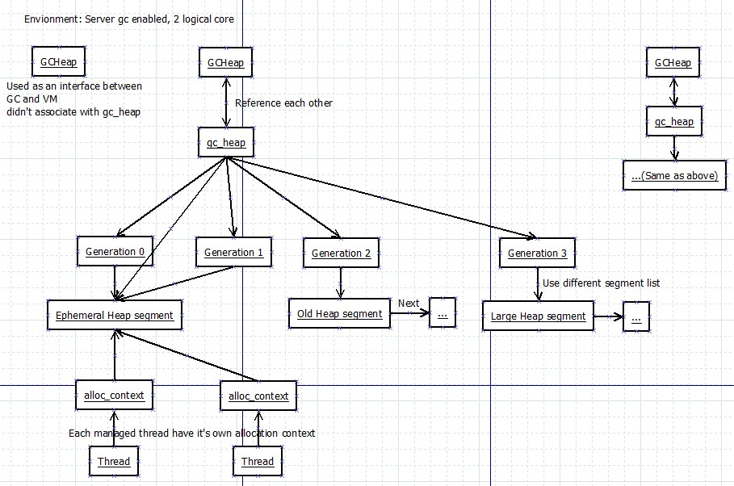
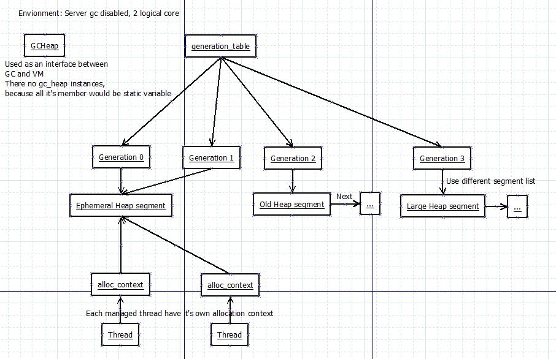
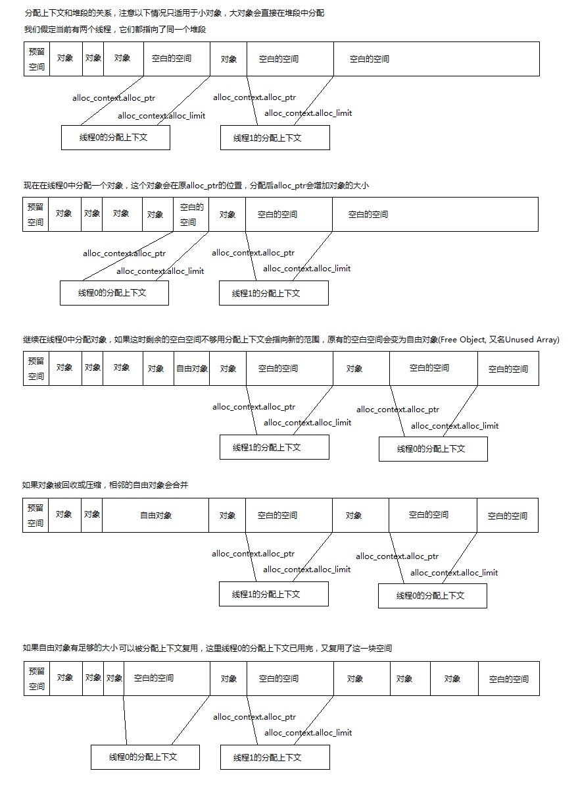
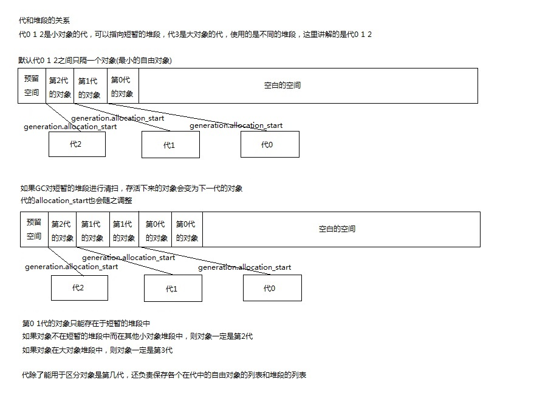
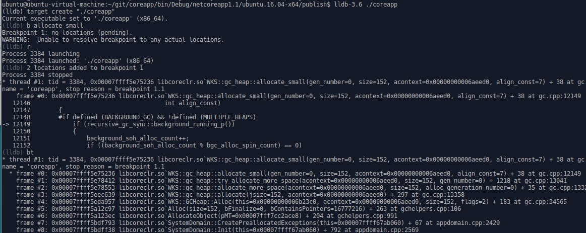
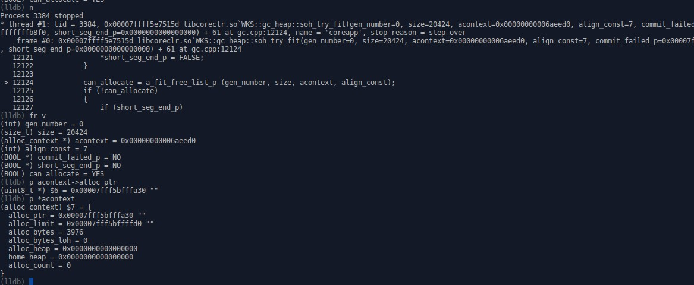
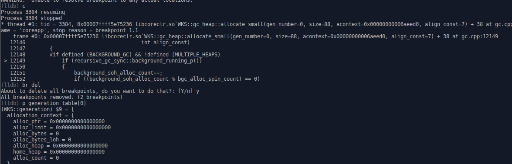
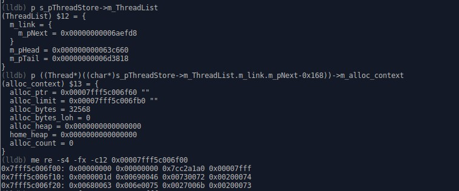
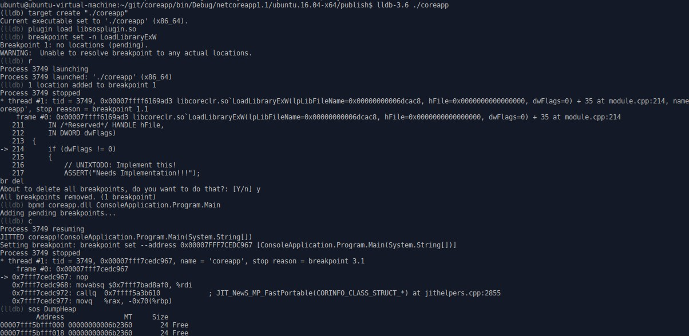

CoreCLR源码探索(三) GC内存分配器的内部实现

在前一篇中我讲解了new是怎么工作的, 但是却一笔跳过了内存分配相关的部分.
在这一篇中我将详细讲解GC内存分配器的内部实现.
在看这一篇之前请必须先看完微软BOTR文档中的"Garbage Collection Design",
原文地址是: https://github.com/dotnet/coreclr/blob/master/Documentation/botr/garbage-collection.md
译文可以看[知平软件的译文](http://www.cnblogs.com/vowei/p/5493051.html)或[我后来的译文](http://www.cnblogs.com/zkweb/p/6288457.html)
请务必先看完"Garbage Collection Design", 否则以下内容你很可能会无法理解

### 服务器GC和工作站GC

关于服务器GC和工作站GC的区别, 网上已经有很多资料讲解这篇就不再说明了. 
我们来看服务器GC和工作站GC的代码是怎么区别开来的.
默认编译CoreCLR会对同一份代码以使用服务器GC还是工作站GC的区别编译两次, 分别在SVR和WKS命名空间中:

源代码: https://github.com/dotnet/coreclr/blob/release/1.1.0/src/gc/gcsvr.cpp
``` c
#define SERVER_GC 1

namespace SVR { 
#include "gcimpl.h"
#include "gc.cpp"
}
```

源代码: https://github.com/dotnet/coreclr/blob/release/1.1.0/src/gc/gcwks.cpp
``` c
#ifdef SERVER_GC
#undef SERVER_GC
#endif

namespace WKS { 
#include "gcimpl.h"
#include "gc.cpp"
}
```

当定义了SERVER_GC时, MULTIPLE_HEAPS和会被同时定义.
定义了MULTIPLE_HEAPS会使用多个堆(Heap), 服务器GC每个cpu核心都会对应一个堆(默认), 工作站GC则全局使用同一个堆.

源代码: https://github.com/dotnet/coreclr/blob/release/1.1.0/src/gc/gcimpl.h
``` c
#ifdef SERVER_GC
#define MULTIPLE_HEAPS 1
#endif // SERVER_GC
```

后台GC无论是服务器GC还是工作站GC都会默认支持, 但运行时不一定会启用.

源代码: https://github.com/dotnet/coreclr/blob/release/1.1.0/src/gc/gcpriv.h
``` c
#define BACKGROUND_GC //concurrent background GC (requires WRITE_WATCH)
```

我们从https://www.microsoft.com/net下回来的CoreCLR安装包中已经包含了服务器GC和后台GC的支持，但默认不会开启.
开启它们可以修改project.json中的·runtimeOptions·节, 例子如下:
``` json
{
  "runtimeOptions": {
    "configProperties": {
      "System.GC.Server": true,
      "System.GC.Concurrent": true
    }
  }
}
```
设置后发布项目可以看到coreapp.runtimeconfig.json, 运行时会只看这个文件.
微软官方的文档: https://docs.microsoft.com/en-us/dotnet/articles/core/tools/project-json

### GC相关的类和它们的关系

我先用两张图来解释服务器GC和工作站GC下GC相关的类的关系



图中一共有5个类型
- GCHeap
	- **实现了IGCHeap接口, 公开GC层的接口给EE(运行引擎)层调用**
	- 在工作站GC下只有一个实例, 不会关联gc_heap对象, 因为工作站GC下gc_heap的所有成员都会被定义为静态变量
	- 在服务器GC下有1+cpu核心数个实例(默认), 第一个实例用于当接口, 其它对应cpu核心的实例都会各关联一个gc_heap实例
- gc_heap
	- **内部的使用的堆类型, 用于负责内存的分配和回收**
	- 在工作站GC下无实例, 所有成员都会定义为静态变量
	- 在工作站GC下generation_table这个成员不会被定义, 而是使用全局变量generation_table
	- 在服务器GC下有cpu核心数个实例(默认), 各关联一个GCHeap实例
- generation
	- **储存各个代的信息, 例如地址范围和使用的段**
	- 储存在generation_table中, 一个generation_table包含了5个generation, 前面的是0 1 2 3代, 最后一个不会被初始化和使用
	- 在工作站GC下只有1个generation_table, 就是全局变量generation_table
	- 在服务器GC下generation_table是gc_heap的成员, 有多少个gc_heap就有多少个generation_table
- heap_segment
	- **堆段, 供分配器使用的一段内存, 用链表形式保存**
	- 每个gc_heap中都有一个或一个以上的segment
	- 每个gc_heap中都有一个ephemeral heap segment(用于存放最年轻对象)
	- 每个gc_heap中都有一个large heap segment(用于存放大对象)
	- 在工作站GC下segment的默认大小是256M(0x10000000字节)
	- 在服务器GC下segment的默认大小是4G(0x100000000字节)
- alloc_context
	- **分配上下文, 指向segment中的一个范围, 用于实际分配对象**
	- 每个线程都有自己的分配上下文, 因为指向的范围不一样所以只要当前范围还有足够空间, 分配对象时不需要线程锁
	- 分配上下文的默认范围是8K, 也叫分配单位(Allocation Quantum)
	- 分配小对象时会从这8K中分配, 分配大对象时则会直接从段(segment)中分配
	- 代0(gen 0)还有一个默认的分配上下文供内部使用, 和线程无关

GCHeap的源代码摘要:

GCHeap的定义: https://github.com/dotnet/coreclr/blob/release/1.1.0/src/gc/gcimpl.h#L61
这里我只列出这篇文章涉及到的成员
``` c++
// WKS::GCHeap或SVR::GCHeap继承全局命名空间下的GCHeap
class GCHeap : public ::GCHeap
{
#ifdef MULTIPLE_HEAPS
    // 服务器GC每个GCHeap实例都会和一个gc_heap实例互相关联
    gc_heap*    pGenGCHeap;
#else
    // 工作站GC下gc_heap所有字段和函数都是静态的, 所以可以用((gc_heap*)nullptr)->xxx来访问
    // 严格来说是UB(未定义动作), 但是实际可以工作
    #define pGenGCHeap ((gc_heap*)0)
#endif //MULTIPLE_HEAPS
};
```

全局的GCHeap实例: https://github.com/dotnet/coreclr/blob/release/1.1.0/src/gc/gc.h#L105
这里是1.1.0的代码, 1.2.0全局GCHeap会分别保存到gcheaputilities.h(g_pGCHeap)和gc.cpp(g_theGCHeap), 两处地方都指向同一个实例.
```
// 相当于extern GCHeap* g_pGCHeap;
GPTR_DECL(GCHeap, g_pGCHeap);
```

gc_heap的源代码摘要:

gc_heap的定义: https://github.com/dotnet/coreclr/blob/release/1.1.0/src/gc/gcpriv.h#L1079
这个类有300多个成员(从ephemeral_low开始), 这里我只列出这篇文章涉及到的成员
``` c++
class gc_heap
{
#ifdef MULTIPLE_HEAPS
    // 对应的GCHeap实例
    PER_HEAP GCHeap* vm_heap;
    // 序号
    PER_HEAP int heap_number;
    // 给分配上下文设置内存范围的次数
    PER_HEAP VOLATILE(int) alloc_context_count;
#else //MULTIPLE_HEAPS
    // 工作站GC时对应全局的GCHeap实例
    #define vm_heap ((GCHeap*) g_pGCHeap)
    // 工作站GC时序号为0
    #define heap_number (0)
#endif //MULTIPLE_HEAPS

#ifndef MULTIPLE_HEAPS
    // 当前使用的短暂的堆段(用于分配新对象的堆段)
    SPTR_DECL(heap_segment,ephemeral_heap_segment);
#else
    // 同上
    PER_HEAP heap_segment* ephemeral_heap_segment;
#endif // !MULTIPLE_HEAPS

    // 全局GC线程锁, 静态变量
    PER_HEAP_ISOLATED GCSpinLock gc_lock; //lock while doing GC
    // 分配上下文用完, 需要为分配上下文指定新的范围时使用的线程锁
    PER_HEAP GCSpinLock more_space_lock; //lock while allocating more space

#ifdef MULTIPLE_HEAPS
    // 储存各个代的信息
    // NUMBERGENERATIONS+1=5, 代分别有0 1 2 3, 最后一个元素不会被使用
    // 工作站GC时不会定义, 而是使用全局变量generation_table
    PER_HEAP generation generation_table [NUMBERGENERATIONS+1];
#endif

#ifdef MULTIPLE_HEAPS
    // 全局gc_heap的数量, 静态变量
    // 服务器GC默认是cpu核心数, 工作站GC是0
    SVAL_DECL(int, n_heaps);
    // 全局gc_heap的数组, 静态变量
    SPTR_DECL(PTR_gc_heap, g_heaps);
#endif
};
```

generation的源代码摘要:

generation的定义: https://github.com/dotnet/coreclr/blob/release/1.1.0/src/gc/gcpriv.h#L754
这里我只列出这篇文章涉及到的成员
``` c++
class generation
{
public:
    // 默认的分配上下文
    alloc_context   allocation_context;
    // 用于分配的最新的堆段
    heap_segment*   allocation_segment;
    // 开始的堆段
    PTR_heap_segment start_segment;
    // 用于区分对象在哪个代的指针, 在此之后的对象都属于这个代, 或比这个代更年轻的代
    uint8_t*        allocation_start;
    // 用于储存和分配自由对象（Free Object, 又名Unused Array, 可以理解为碎片空间)的分配器
    allocator       free_list_allocator;
    // 这个代是第几代
    int gen_num;
};
```

heap_segment的源代码摘要:

heap_segment的定义: https://github.com/dotnet/coreclr/blob/release/1.1.0/src/gc/gcpriv.h#L4166
这里我只列出这篇文章涉及到的成员
``` c++
class heap_segment
{
public:
    // 已实际分配地址 (mem + 已分配大小)
    // 更新有可能会延迟
    uint8_t*        allocated;
    // 已提交到物理内存的地址 (this + SEGMENT_INITIAL_COMMIT)
    uint8_t*        committed;
    // 预留到的分配地址 (this + size)
    uint8_t*        reserved;
    // 已使用地址 (mem + 已分配大小 - 对象头大小)
    uint8_t*        used;
    // 初始分配地址 (服务器gc开启时: this + OS_PAGE_SIZE, 否则: this + sizeof(*this) + alignment)
    uint8_t*        mem;
    // 下一个堆段
    PTR_heap_segment next;
    // 属于的gc_heap实例
    gc_heap*        heap;
};
```

alloc_context的源代码摘要:

alloc_context的定义: https://github.com/dotnet/coreclr/blob/release/1.1.0/src/gc/gc.h#L162
这里是1.1.0的代码, 1.2.0这些成员移动到了gcinterface.h的gc_alloc_context, 但是成员还是一样的
``` c++
struct alloc_context 
{
    // 下一次分配对象的开始地址
    uint8_t*       alloc_ptr;
    // 可以分配到的最终地址
    uint8_t*       alloc_limit;
    // 历史分配的小对象大小合计
    int64_t        alloc_bytes; //Number of bytes allocated on SOH by this context
    // 历史分配的大对象大小合计
    int64_t        alloc_bytes_loh; //Number of bytes allocated on LOH by this context
#if defined(FEATURE_SVR_GC)
    // 空间不够需要获取更多空间时使用的GCHeap
    // 分alloc_heap和home_heap的作用是平衡各个heap的使用量，这样并行回收时可以减少处理各个heap的时间差异
    SVR::GCHeap*   alloc_heap;
    // 原来的GCHeap
    SVR::GCHeap*   home_heap;
#endif // defined(FEATURE_SVR_GC)
    // 历史分配对象次数
    int            alloc_count;
};
```

### 堆段的物理结构

为了更好理解下面即将讲解的代码，请先看这两张图片



### 分配对象内存的代码流程

还记得上篇我提到过的AllocateObject函数吗? 这个函数由JIT_New调用, 负责分配一个普通的对象.
让我们来继续跟踪这个函数的内部吧:

AllocateObject函数的内容: https://github.com/dotnet/coreclr/blob/release/1.1.0/src/vm/gchelpers.cpp#L931
AllocateObject的其他版本同样也会调用AllocAlign8或Alloc函数, 下面就不再贴出其他版本的函数代码了.
```c++
OBJECTREF AllocateObject(MethodTable *pMT
#ifdef FEATURE_COMINTEROP
                         , bool fHandleCom
#endif
    )
{
    // 省略部分代码......
    Object     *orObject = NULL;
    
    // 调用gc的帮助函数分配内存，如果需要向8对齐则调用AllocAlign8，否则调用Alloc
    if (pMT->RequiresAlign8())
    {
        // 省略部分代码......
        orObject = (Object *) AllocAlign8(baseSize,
                                          pMT->HasFinalizer(),
                                          pMT->ContainsPointers(),
                                          pMT->IsValueType());
    }
    else
    {
        orObject = (Object *) Alloc(baseSize,
                                    pMT->HasFinalizer(),
                                    pMT->ContainsPointers());
    }
    
    // 省略部分代码......
    return UNCHECKED_OBJECTREF_TO_OBJECTREF(oref);
}
```

Alloc函数的内容: https://github.com/dotnet/coreclr/blob/release/1.1.0/src/vm/gchelpers.cpp#L931
``` c++
inline Object* Alloc(size_t size, BOOL bFinalize, BOOL bContainsPointers )
{
    // 省略部分代码......
    // 如果启用分配上下文，则使用当前线程的分配上下文进行分配
    // 否则使用代(generation)中默认的分配上下文进行分配
    // 按官方的说法绝大部分情况下都会启用分配上下文
    // 实测的机器上UseAllocationContexts函数会不经过判断直接返回true
    if (GCHeap::UseAllocationContexts())
        retVal = GCHeap::GetGCHeap()->Alloc(GetThreadAllocContext(), size, flags);
    else
        retVal = GCHeap::GetGCHeap()->Alloc(size, flags);
    // 省略部分代码......
    return retVal;
}
```

GetGCHeap函数的内容: https://github.com/dotnet/coreclr/blob/release/1.1.0/src/gc/gc.h#L377
``` c++
static GCHeap *GetGCHeap()
{
    LIMITED_METHOD_CONTRACT;
    // 返回全局的GCHeap实例
    // 注意这个实例只作为接口使用，不和具体的gc_heap实例关联
    _ASSERTE(g_pGCHeap != NULL);
    return g_pGCHeap;
}
```

GetThreadAllocContext函数的内容: https://github.com/dotnet/coreclr/blob/release/1.1.0/src/vm/gchelpers.cpp#L54
``` c++
inline alloc_context* GetThreadAllocContext()
{
    WRAPPER_NO_CONTRACT;
    
    assert(GCHeap::UseAllocationContexts());
    // 获取当前线程并返回m_alloc_context成员的地址
    return & GetThread()->m_alloc_context;
}
```

GCHeap::Alloc函数的内容: https://raw.githubusercontent.com/dotnet/coreclr/release/1.1.0/src/gc/gc.cpp
``` c++
Object*
GCHeap::Alloc(alloc_context* acontext, size_t size, uint32_t flags REQD_ALIGN_DCL)
{
    // 省略部分代码......
    Object* newAlloc = NULL;

    // 如果分配上下文是第一次使用，使用AssignHeap函数先给它对应一个GCHeap实例
#ifdef MULTIPLE_HEAPS
    if (acontext->alloc_heap == 0)
    {
        AssignHeap (acontext);
        assert (acontext->alloc_heap);
    }
#endif //MULTIPLE_HEAPS

    // 必要时触发GC
#ifndef FEATURE_REDHAWK
    GCStress<gc_on_alloc>::MaybeTrigger(acontext);
#endif // FEATURE_REDHAWK

    // 服务器GC使用GCHeap对应的gc_heap, 工作站GC使用nullptr
#ifdef MULTIPLE_HEAPS
    gc_heap* hp = acontext->alloc_heap->pGenGCHeap;
#else
    gc_heap* hp = pGenGCHeap;
    // 省略部分代码......
#endif //MULTIPLE_HEAPS

    // 分配小对象时使用allocate函数, 分配大对象时使用allocate_large_object函数
    if (size < LARGE_OBJECT_SIZE)
    {

#ifdef TRACE_GC
        AllocSmallCount++;
#endif //TRACE_GC
        // 分配小对象内存
        newAlloc = (Object*) hp->allocate (size + ComputeMaxStructAlignPad(requiredAlignment), acontext);
#ifdef FEATURE_STRUCTALIGN
        // 对齐指针
        newAlloc = (Object*) hp->pad_for_alignment ((uint8_t*) newAlloc, requiredAlignment, size, acontext);
#endif // FEATURE_STRUCTALIGN
//        ASSERT (newAlloc);
    }
    else 
    {
        // 分配大对象内存
        newAlloc = (Object*) hp->allocate_large_object (size + ComputeMaxStructAlignPadLarge(requiredAlignment), acontext->alloc_bytes_loh);
#ifdef FEATURE_STRUCTALIGN
        // 对齐指针
        newAlloc = (Object*) hp->pad_for_alignment_large ((uint8_t*) newAlloc, requiredAlignment, size);
#endif // FEATURE_STRUCTALIGN
    }

    // 省略部分代码......
    return newAlloc;
}
```

### 分配小对象内存的代码流程

让我们来看一下小对象的内存是如何分配的

allocate函数的内容: https://raw.githubusercontent.com/dotnet/coreclr/release/1.1.0/src/gc/gc.cpp
这个函数尝试从分配上下文分配内存, 失败时调用allocate_more_space为分配上下文指定新的空间
这里的前半部分的处理还有汇编版本, 可以看上一篇分析的`JIT_TrialAllocSFastMP_InlineGetThread`函数
``` c++
inline
CObjectHeader* gc_heap::allocate (size_t jsize, alloc_context* acontext)
{
    size_t size = Align (jsize);
    assert (size >= Align (min_obj_size));
    {
    retry:
        // 尝试把对象分配到alloc_ptr
        uint8_t*  result = acontext->alloc_ptr;
        acontext->alloc_ptr+=size;
        // 如果alloc_ptr + 对象大小 > alloc_limit, 则表示这个分配上下文是第一次使用或者剩余空间已经不够用了
        if (acontext->alloc_ptr <= acontext->alloc_limit)
        {
            // 分配成功, 这里返回的地址就是+=size之前的alloc_ptr
            CObjectHeader* obj = (CObjectHeader*)result;
            assert (obj != 0);
            return obj;
        }
        else
        {
            // 分配失败, 把size减回去
            acontext->alloc_ptr -= size;

#ifdef _MSC_VER
#pragma inline_depth(0)
#endif //_MSC_VER
            // 尝试为分配上下文重新指定一块范围
            if (! allocate_more_space (acontext, size, 0))
                return 0;

#ifdef _MSC_VER
#pragma inline_depth(20)
#endif //_MSC_VER
            // 重试
            goto retry;
        }
    }
}
```

allocate_more_space函数的内容: https://raw.githubusercontent.com/dotnet/coreclr/release/1.1.0/src/gc/gc.cpp
这个函数会在有多个heap时调用balance_heaps平衡各个heap的使用量, 然后再调用try_allocate_more_space函数
``` c++
BOOL gc_heap::allocate_more_space(alloc_context* acontext, size_t size,
                                  int alloc_generation_number)
{
    int status;
    do
    { 
        // 如果有多个heap需要先平衡它们的使用量以减少并行回收时的处理时间差
#ifdef MULTIPLE_HEAPS
        if (alloc_generation_number == 0)
        {
            // 平衡各个heap的使用量
            balance_heaps (acontext);
            // 调用try_allocate_more_space函数
            status = acontext->alloc_heap->pGenGCHeap->try_allocate_more_space (acontext, size, alloc_generation_number);
        }
        else
        {
            // 平衡各个heap的使用量(大对象)
            gc_heap* alloc_heap = balance_heaps_loh (acontext, size);
            // 调用try_allocate_more_space函数
            status = alloc_heap->try_allocate_more_space (acontext, size, alloc_generation_number);
        }
#else
        // 只有一个heap时直接调用try_allocate_more_space函数
        status = try_allocate_more_space (acontext, size, alloc_generation_number);
#endif //MULTIPLE_HEAPS
    }
    while (status == -1);
    
    return (status != 0);
}
```

try_allocate_more_space函数的内容: https://raw.githubusercontent.com/dotnet/coreclr/release/1.1.0/src/gc/gc.cpp
这个函数会获取MSL锁, 检查是否有必要触发GC, 然后根据gen_number参数调用allocate_small或allocate_large函数
``` c++
int gc_heap::try_allocate_more_space (alloc_context* acontext, size_t size,
                                   int gen_number)
{
    // gc已经开始时等待gc完成并重试
    // allocate函数会跑到retry再调用这个函数
    if (gc_heap::gc_started)
    {
        wait_for_gc_done();
        return -1;
    }

    // 获取more_space_lock锁
    // 并且统计获取锁需要的时间是否多或者少
#ifdef SYNCHRONIZATION_STATS
    unsigned int msl_acquire_start = GetCycleCount32();
#endif //SYNCHRONIZATION_STATS
    enter_spin_lock (&more_space_lock);
    add_saved_spinlock_info (me_acquire, mt_try_alloc);
    dprintf (SPINLOCK_LOG, ("[%d]Emsl for alloc", heap_number));
#ifdef SYNCHRONIZATION_STATS
    unsigned int msl_acquire = GetCycleCount32() - msl_acquire_start;
    total_msl_acquire += msl_acquire;
    num_msl_acquired++;
    if (msl_acquire > 200)
    {
        num_high_msl_acquire++;
    }
    else
    {
        num_low_msl_acquire++;
    }
#endif //SYNCHRONIZATION_STATS

    // 这部分的代码被注释了
    // 因为获取msl(more space lock)锁已经可以防止问题出现
    /*
    // We are commenting this out 'cause we don't see the point - we already
    // have checked gc_started when we were acquiring the msl - no need to check
    // again. This complicates the logic in bgc_suspend_EE 'cause that one would
    // need to release msl which causes all sorts of trouble.
    if (gc_heap::gc_started)
    {
#ifdef SYNCHRONIZATION_STATS
        good_suspension++;
#endif //SYNCHRONIZATION_STATS
        BOOL fStress = (g_pConfig->GetGCStressLevel() & EEConfig::GCSTRESS_TRANSITION) != 0;
        if (!fStress)
        {
            //Rendez vous early (MP scaling issue)
            //dprintf (1, ("[%d]waiting for gc", heap_number));
            wait_for_gc_done();
#ifdef MULTIPLE_HEAPS
            return -1;
#endif //MULTIPLE_HEAPS
        }
    }
    */

    dprintf (3, ("requested to allocate %d bytes on gen%d", size, gen_number));
    // 获取对齐使用的值
    // 小对象3(0b11)或者7(0b111), 大对象7(0b111)
    int align_const = get_alignment_constant (gen_number != (max_generation+1));

    // 必要时触发GC
    if (fgn_maxgen_percent)
    {
        check_for_full_gc (gen_number, size);
    }

    // 再次检查必要时触发GC
    if (!(new_allocation_allowed (gen_number)))
    {
        if (fgn_maxgen_percent && (gen_number == 0))
        {
            // We only check gen0 every so often, so take this opportunity to check again.
            check_for_full_gc (gen_number, size);
        }

        // 后台GC运行中并且物理内存占用率在95%以上时等待后台GC完成
#ifdef BACKGROUND_GC
        wait_for_bgc_high_memory (awr_gen0_alloc);
#endif //BACKGROUND_GC

#ifdef SYNCHRONIZATION_STATS
        bad_suspension++;
#endif //SYNCHRONIZATION_STATS
        dprintf (/*100*/ 2, ("running out of budget on gen%d, gc", gen_number));

        // 必要时原地触发GC
        if (!settings.concurrent || (gen_number == 0))
        {
            vm_heap->GarbageCollectGeneration (0, ((gen_number == 0) ? reason_alloc_soh : reason_alloc_loh));
#ifdef MULTIPLE_HEAPS
            // 触发GC后会释放MSL锁, 需要重新获取
            enter_spin_lock (&more_space_lock);
            add_saved_spinlock_info (me_acquire, mt_try_budget);
            dprintf (SPINLOCK_LOG, ("[%d]Emsl out budget", heap_number));
#endif //MULTIPLE_HEAPS
        }
    }

    // 根据是第几代调用不同的函数, 函数里面会给分配上下文指定新的范围
    // 参数gen_number只能是0或者3
    BOOL can_allocate = ((gen_number == 0) ?
        allocate_small (gen_number, size, acontext, align_const) :
        allocate_large (gen_number, size, acontext, align_const));
   
    // 成功时检查是否要触发ETW(Event Tracing for Windows)事件
    if (can_allocate)
    {
        // 记录给了分配上下文多少字节
        //ETW trace for allocation tick
        size_t alloc_context_bytes = acontext->alloc_limit + Align (min_obj_size, align_const) - acontext->alloc_ptr;
        int etw_allocation_index = ((gen_number == 0) ? 0 : 1);

        etw_allocation_running_amount[etw_allocation_index] += alloc_context_bytes;

        // 超过一定量时触发ETW事件
        if (etw_allocation_running_amount[etw_allocation_index] > etw_allocation_tick)
        {
#ifdef FEATURE_REDHAWK
            FireEtwGCAllocationTick_V1((uint32_t)etw_allocation_running_amount[etw_allocation_index], 
                                    ((gen_number == 0) ? ETW::GCLog::ETW_GC_INFO::AllocationSmall : ETW::GCLog::ETW_GC_INFO::AllocationLarge), 
                                    GetClrInstanceId());
#else
            // Unfortunately some of the ETW macros do not check whether the ETW feature is enabled.
            // The ones that do are much less efficient.
#if defined(FEATURE_EVENT_TRACE)
            if (EventEnabledGCAllocationTick_V2())
            {
                fire_etw_allocation_event (etw_allocation_running_amount[etw_allocation_index], gen_number, acontext->alloc_ptr);
            }
#endif //FEATURE_EVENT_TRACE
#endif //FEATURE_REDHAWK
            // 重置量
            etw_allocation_running_amount[etw_allocation_index] = 0;
        }
    }

    return (int)can_allocate;
}
```

allocate_small函数的内容: https://raw.githubusercontent.com/dotnet/coreclr/release/1.1.0/src/gc/gc.cpp
循环尝试进行各种回收内存的处理和调用soh_try_fit函数, soh_try_fit函数分配成功或手段已经用尽时跳出循环
``` c++
BOOL gc_heap::allocate_small (int gen_number,
                              size_t size, 
                              alloc_context* acontext,
                              int align_const)
{
    // 工作站GC且后台GC运行时140次(bgc_alloc_spin_count)休眠1次, 休眠时间2ms(bgc_alloc_spin)
#if defined (BACKGROUND_GC) && !defined (MULTIPLE_HEAPS)
    if (recursive_gc_sync::background_running_p())
    {
        background_soh_alloc_count++;
        if ((background_soh_alloc_count % bgc_alloc_spin_count) == 0)
        {
            Thread* current_thread = GetThread();
            add_saved_spinlock_info (me_release, mt_alloc_small);
            dprintf (SPINLOCK_LOG, ("[%d]spin Lmsl", heap_number));
            leave_spin_lock (&more_space_lock);
            BOOL cooperative_mode = enable_preemptive (current_thread);
            GCToOSInterface::Sleep (bgc_alloc_spin);
            disable_preemptive (current_thread, cooperative_mode);
            enter_spin_lock (&more_space_lock);
            add_saved_spinlock_info (me_acquire, mt_alloc_small);
            dprintf (SPINLOCK_LOG, ("[%d]spin Emsl", heap_number));
        }
        else
        {
            //GCToOSInterface::YieldThread (0);
        }
    }
#endif //BACKGROUND_GC && !MULTIPLE_HEAPS

    gc_reason gr = reason_oos_soh;
    oom_reason oom_r = oom_no_failure;

    // No variable values should be "carried over" from one state to the other. 
    // That's why there are local variable for each state

    allocation_state soh_alloc_state = a_state_start;

    // 开始循环切换状态, 请关注soh_alloc_state
    // If we can get a new seg it means allocation will succeed.
    while (1)
    {
        dprintf (3, ("[h%d]soh state is %s", heap_number, allocation_state_str[soh_alloc_state]));
        switch (soh_alloc_state)
        {
            // 成功或失败时跳出循环
            case a_state_can_allocate:
            case a_state_cant_allocate:
            {
                goto exit;
            }
            // 开始时切换状态到a_state_try_fit
            case a_state_start:
            {
                soh_alloc_state = a_state_try_fit;
                break;
            }
            // 调用soh_try_fit函数
            // 成功时切换状态到a_state_can_allocate
            // 失败时切换状态到a_state_trigger_full_compact_gc或a_state_trigger_ephemeral_gc
            case a_state_try_fit:
            {
                BOOL commit_failed_p = FALSE;
                BOOL can_use_existing_p = FALSE;

                can_use_existing_p = soh_try_fit (gen_number, size, acontext,
                                                  align_const, &commit_failed_p,
                                                  NULL);
                soh_alloc_state = (can_use_existing_p ?
                                        a_state_can_allocate : 
                                        (commit_failed_p ? 
                                            a_state_trigger_full_compact_gc :
                                            a_state_trigger_ephemeral_gc));
                break;
            }
            // 后台GC完成后调用soh_try_fit函数
            // 成功时切换状态到a_state_can_allocate
            // 失败时切换状态到a_state_trigger_2nd_ephemeral_gc或a_state_trigger_full_compact_gc
            case a_state_try_fit_after_bgc:
            {
                BOOL commit_failed_p = FALSE;
                BOOL can_use_existing_p = FALSE;
                BOOL short_seg_end_p = FALSE;

                can_use_existing_p = soh_try_fit (gen_number, size, acontext,
                                                  align_const, &commit_failed_p,
                                                  &short_seg_end_p);
                soh_alloc_state = (can_use_existing_p ? 
                                        a_state_can_allocate : 
                                        (short_seg_end_p ? 
                                            a_state_trigger_2nd_ephemeral_gc : 
                                            a_state_trigger_full_compact_gc));
                break;
            }
            // 压缩GC完成后调用soh_try_fit函数
            // 如果压缩后仍分配失败则切换状态到a_state_cant_allocate
            // 成功时切换状态到a_state_can_allocate
            case a_state_try_fit_after_cg:
            {
                BOOL commit_failed_p = FALSE;
                BOOL can_use_existing_p = FALSE;
                BOOL short_seg_end_p = FALSE;

                can_use_existing_p = soh_try_fit (gen_number, size, acontext,
                                                  align_const, &commit_failed_p,
                                                  &short_seg_end_p);
                if (short_seg_end_p)
                {
                    soh_alloc_state = a_state_cant_allocate;
                    oom_r = oom_budget;
                }
                else
                {
                    if (can_use_existing_p)
                    {
                        soh_alloc_state = a_state_can_allocate;
                    }
                    else
                    {
#ifdef MULTIPLE_HEAPS
                        if (!commit_failed_p)
                        {
                            // some other threads already grabbed the more space lock and allocated
                            // so we should attemp an ephemeral GC again.
                            assert (heap_segment_allocated (ephemeral_heap_segment) < alloc_allocated);
                            soh_alloc_state = a_state_trigger_ephemeral_gc; 
                        }
                        else
#endif //MULTIPLE_HEAPS
                        {
                            assert (commit_failed_p);
                            soh_alloc_state = a_state_cant_allocate;
                            oom_r = oom_cant_commit;
                        }
                    }
                }
                break;
            }
            // 等待后台GC完成
            // 如果执行了压缩则切换状态到a_state_try_fit_after_cg
            // 否则切换状态到a_state_try_fit_after_bgc
            case a_state_check_and_wait_for_bgc:
            {
                BOOL bgc_in_progress_p = FALSE;
                BOOL did_full_compacting_gc = FALSE;

                bgc_in_progress_p = check_and_wait_for_bgc (awr_gen0_oos_bgc, &did_full_compacting_gc);
                soh_alloc_state = (did_full_compacting_gc ? 
                                        a_state_try_fit_after_cg : 
                                        a_state_try_fit_after_bgc);
                break;
            }
            // 触发第0和1代的GC
            // 如果有压缩则切换状态到a_state_try_fit_after_cg
            // 否则重试soh_try_fit, 成功时切换状态到a_state_can_allocate, 失败时切换状态到等待后台GC或触发其他GC
            case a_state_trigger_ephemeral_gc:
            {
                BOOL commit_failed_p = FALSE;
                BOOL can_use_existing_p = FALSE;
                BOOL short_seg_end_p = FALSE;
                BOOL bgc_in_progress_p = FALSE;
                BOOL did_full_compacting_gc = FALSE;

                did_full_compacting_gc = trigger_ephemeral_gc (gr);
                if (did_full_compacting_gc)
                {
                    soh_alloc_state = a_state_try_fit_after_cg;
                }
                else
                {
                    can_use_existing_p = soh_try_fit (gen_number, size, acontext,
                                                      align_const, &commit_failed_p,
                                                      &short_seg_end_p);
#ifdef BACKGROUND_GC
                    bgc_in_progress_p = recursive_gc_sync::background_running_p();
#endif //BACKGROUND_GC

                    if (short_seg_end_p)
                    {
                        soh_alloc_state = (bgc_in_progress_p ? 
                                                a_state_check_and_wait_for_bgc : 
                                                a_state_trigger_full_compact_gc);

                        if (fgn_maxgen_percent)
                        {
                            dprintf (2, ("FGN: doing last GC before we throw OOM"));
                            send_full_gc_notification (max_generation, FALSE);
                        }
                    }
                    else
                    {
                        if (can_use_existing_p)
                        {
                            soh_alloc_state = a_state_can_allocate;
                        }
                        else
                        {
#ifdef MULTIPLE_HEAPS
                            if (!commit_failed_p)
                            {
                                // some other threads already grabbed the more space lock and allocated
                                // so we should attemp an ephemeral GC again.
                                assert (heap_segment_allocated (ephemeral_heap_segment) < alloc_allocated);
                                soh_alloc_state = a_state_trigger_ephemeral_gc;
                            }
                            else
#endif //MULTIPLE_HEAPS
                            {
                                soh_alloc_state = a_state_trigger_full_compact_gc;
                                if (fgn_maxgen_percent)
                                {
                                    dprintf (2, ("FGN: failed to commit, doing full compacting GC"));
                                    send_full_gc_notification (max_generation, FALSE);
                                }
                            }
                        }
                    }
                }
                break;
            }
            // 第二次触发第0和1代的GC
            // 如果有压缩则切换状态到a_state_try_fit_after_cg
            // 否则重试soh_try_fit, 成功时切换状态到a_state_can_allocate, 失败时切换状态到a_state_trigger_full_compact_gc
            case a_state_trigger_2nd_ephemeral_gc:
            {
                BOOL commit_failed_p = FALSE;
                BOOL can_use_existing_p = FALSE;
                BOOL short_seg_end_p = FALSE;
                BOOL did_full_compacting_gc = FALSE;


                did_full_compacting_gc = trigger_ephemeral_gc (gr);
                
                if (did_full_compacting_gc)
                {
                    soh_alloc_state = a_state_try_fit_after_cg;
                }
                else
                {
                    can_use_existing_p = soh_try_fit (gen_number, size, acontext,
                                                      align_const, &commit_failed_p,
                                                      &short_seg_end_p);
                    if (short_seg_end_p || commit_failed_p)
                    {
                        soh_alloc_state = a_state_trigger_full_compact_gc;
                    }
                    else
                    {
                        assert (can_use_existing_p);
                        soh_alloc_state = a_state_can_allocate;
                    }
                }
                break;
            }
            // 触发第0和1和2代的压缩GC
            // 成功时切换状态到a_state_try_fit_after_cg, 失败时切换状态到a_state_cant_allocate
            case a_state_trigger_full_compact_gc:
            {
                BOOL got_full_compacting_gc = FALSE;

                got_full_compacting_gc = trigger_full_compact_gc (gr, &oom_r);
                soh_alloc_state = (got_full_compacting_gc ? a_state_try_fit_after_cg : a_state_cant_allocate);
                break;
            }
            default:
            {
                assert (!"Invalid state!");
                break;
            }
        }
    }

exit:
    // 分配失败时处理OOM(Out Of Memory)
    if (soh_alloc_state == a_state_cant_allocate)
    {
        assert (oom_r != oom_no_failure);
        handle_oom (heap_number, 
                    oom_r, 
                    size,
                    heap_segment_allocated (ephemeral_heap_segment),
                    heap_segment_reserved (ephemeral_heap_segment));

        dprintf (SPINLOCK_LOG, ("[%d]Lmsl for oom", heap_number));
        add_saved_spinlock_info (me_release, mt_alloc_small_cant);
        leave_spin_lock (&more_space_lock);
    }

    return (soh_alloc_state == a_state_can_allocate);
}
```

soh_try_fit函数的内容: https://raw.githubusercontent.com/dotnet/coreclr/release/1.1.0/src/gc/gc.cpp
这个函数会先尝试调用a_fit_free_list_p从自由对象列表中分配, 然后尝试调用a_fit_segment_end_p从堆段结尾分配
``` c++
BOOL gc_heap::soh_try_fit (int gen_number,
                           size_t size, 
                           alloc_context* acontext,
                           int align_const,
                           BOOL* commit_failed_p, // 返回参数, 把虚拟内存提交到物理内存是否失败(物理内存不足)
                           BOOL* short_seg_end_p) // 返回参数, 堆段的结尾是否不够用
{
    BOOL can_allocate = TRUE;
    // 有传入short_seg_end_p时先设置它的值为false
    if (short_seg_end_p)
    {
        *short_seg_end_p = FALSE;
    }

    // 先尝试从自由对象列表中分配
    can_allocate = a_fit_free_list_p (gen_number, size, acontext, align_const);
    if (!can_allocate)
    {
        // 不能从自由对象列表中分配, 尝试从堆段的结尾分配
        // 检查ephemeral_heap_segment的结尾空间是否足够
        if (short_seg_end_p)
        {
            *short_seg_end_p = short_on_end_of_seg (gen_number, ephemeral_heap_segment, align_const);
        }
        // 如果空间足够, 或者调用时不传入short_seg_end_p参数(传入nullptr), 则调用a_fit_segment_end_p函数
        // If the caller doesn't care, we always try to fit at the end of seg;
        // otherwise we would only try if we are actually not short at end of seg.
        if (!short_seg_end_p || !(*short_seg_end_p))
        {
            can_allocate = a_fit_segment_end_p (gen_number, ephemeral_heap_segment, size, 
                                                acontext, align_const, commit_failed_p);
        }
    }

    return can_allocate;
}
```

a_fit_free_list_p函数的内容: https://raw.githubusercontent.com/dotnet/coreclr/release/1.1.0/src/gc/gc.cpp
这个函数会尝试从自由对象列表中找到足够大小的空间, 如果找到则把分配上下文指向这个空间
``` c++
inline
BOOL gc_heap::a_fit_free_list_p (int gen_number, 
                                 size_t size, 
                                 alloc_context* acontext,
                                 int align_const)
{
    BOOL can_fit = FALSE;
    // 获取指定的代中的自由对象列表
    generation* gen = generation_of (gen_number);
    allocator* gen_allocator = generation_allocator (gen);
    // 列表会按大小分为多个bucket(用链表形式链接)
    // 大小会*2递增, 例如first_bucket的大小是256那第二个bucket的大小则为512
    size_t sz_list = gen_allocator->first_bucket_size();
    for (unsigned int a_l_idx = 0; a_l_idx < gen_allocator->number_of_buckets(); a_l_idx++)
    {
        if ((size < sz_list) || (a_l_idx == (gen_allocator->number_of_buckets()-1)))
        {
            uint8_t* free_list = gen_allocator->alloc_list_head_of (a_l_idx);
            uint8_t* prev_free_item = 0;

            while (free_list != 0)
            {
                dprintf (3, ("considering free list %Ix", (size_t)free_list));
                size_t free_list_size = unused_array_size (free_list);
                if ((size + Align (min_obj_size, align_const)) <= free_list_size)
                {
                    dprintf (3, ("Found adequate unused area: [%Ix, size: %Id",
                                 (size_t)free_list, free_list_size));

                    // 大小足够时从该bucket的链表中pop出来
                    gen_allocator->unlink_item (a_l_idx, free_list, prev_free_item, FALSE);
                    // We ask for more Align (min_obj_size)
                    // to make sure that we can insert a free object
                    // in adjust_limit will set the limit lower
                    size_t limit = limit_from_size (size, free_list_size, gen_number, align_const);

                    uint8_t*  remain = (free_list + limit);
                    size_t remain_size = (free_list_size - limit);
                    // 如果分配完还有剩余空间, 在剩余空间生成一个自由对象并塞回自由对象列表
                    if (remain_size >= Align(min_free_list, align_const))
                    {
                        make_unused_array (remain, remain_size);
                        gen_allocator->thread_item_front (remain, remain_size);
                        assert (remain_size >= Align (min_obj_size, align_const));
                    }
                    else
                    {
                        //absorb the entire free list
                        limit += remain_size;
                    }
                    generation_free_list_space (gen) -= limit;

                    // 给分配上下文设置新的范围
                    adjust_limit_clr (free_list, limit, acontext, 0, align_const, gen_number);

                    // 分配成功跳出循环
                    can_fit = TRUE;
                    goto end;
                }
                else if (gen_allocator->discard_if_no_fit_p())
                {
                    assert (prev_free_item == 0);
                    dprintf (3, ("couldn't use this free area, discarding"));
                    generation_free_obj_space (gen) += free_list_size;

                    gen_allocator->unlink_item (a_l_idx, free_list, prev_free_item, FALSE);
                    generation_free_list_space (gen) -= free_list_size;
                }
                else
                {
                    prev_free_item = free_list;
                }
                // 同一bucket的下一个自由对象
                free_list = free_list_slot (free_list); 
            }
        }
        // 当前bucket的大小不够, 下一个bucket的大小会是当前bucket的两倍
        sz_list = sz_list * 2;
    }
end:
    return can_fit;
}
```

a_fit_segment_end_p函数的内容: https://raw.githubusercontent.com/dotnet/coreclr/release/1.1.0/src/gc/gc.cpp
这个函数会尝试在堆段的结尾找到一块足够大小的空间, 如果找到则把分配上下文指向这个空间
``` c++
BOOL gc_heap::a_fit_segment_end_p (int gen_number,
                                   heap_segment* seg,
                                   size_t size, 
                                   alloc_context* acontext,
                                   int align_const,
                                   BOOL* commit_failed_p)
{
    *commit_failed_p = FALSE;
    size_t limit = 0;
#ifdef BACKGROUND_GC
    int cookie = -1;
#endif //BACKGROUND_GC

    // 开始分配的地址
    uint8_t*& allocated = ((gen_number == 0) ?
                        alloc_allocated : 
                        heap_segment_allocated(seg));

    size_t pad = Align (min_obj_size, align_const);

#ifdef FEATURE_LOH_COMPACTION
    if (gen_number == (max_generation + 1))
    {
        pad += Align (loh_padding_obj_size, align_const);
    }
#endif //FEATURE_LOH_COMPACTION

    // 最多能分配到的地址 = 已提交到物理内存的地址 - 对齐大小
    uint8_t* end = heap_segment_committed (seg) - pad;

    // 如果空间足够则跳到found_fit
    if (a_size_fit_p (size, allocated, end, align_const))
    {
        limit = limit_from_size (size, 
                                 (end - allocated), 
                                 gen_number, align_const);
        goto found_fit;
    }

    // 已提交到物理内存的地址不够用, 需要提交新的地址
    // 最多能分配到的地址 = 堆段预留的末尾地址 - 对齐大小
    end = heap_segment_reserved (seg) - pad;

    // 如果空间足够则调用grow_heap_segment
    // 调用grow_heap_segment成功则跳到found_fit, 否则设置commit_failed_p的值等于true
    if (a_size_fit_p (size, allocated, end, align_const))
    {
        limit = limit_from_size (size, 
                                 (end - allocated), 
                                 gen_number, align_const);
        if (grow_heap_segment (seg, allocated + limit))
        {
            goto found_fit;
        }
        else
        {
            dprintf (2, ("can't grow segment, doing a full gc"));
            *commit_failed_p = TRUE;
        }
    }
    goto found_no_fit;

found_fit:

    // 如果启用了后台GC, 并且正在分配大对象, 需要检测后台GC是否正在标记对象
#ifdef BACKGROUND_GC
    if (gen_number != 0)
    {
        cookie = bgc_alloc_lock->loh_alloc_set (allocated);
    }
#endif //BACKGROUND_GC

    uint8_t* old_alloc;
    old_alloc = allocated;
    // 如果是第3代(大对象)则往对齐的空间添加一个自由对象
#ifdef FEATURE_LOH_COMPACTION
    if (gen_number == (max_generation + 1))
    {
        size_t loh_pad = Align (loh_padding_obj_size, align_const);
        make_unused_array (old_alloc, loh_pad);
        old_alloc += loh_pad;
        allocated += loh_pad;
        limit -= loh_pad;
    }
#endif //FEATURE_LOH_COMPACTION

    // 清空SyncBlock
    // 正常不需要, 因为前一个对象已经清零并预留好空间
#if defined (VERIFY_HEAP) && defined (_DEBUG)
        ((void**) allocated)[-1] = 0;     //clear the sync block
#endif //VERIFY_HEAP && _DEBUG
    // 增加开始分配的地址, 下一次将会从这里分配
    // 注意这个不是本地变量而是引用
    allocated += limit;

    dprintf (3, ("found fit at end of seg: %Ix", old_alloc));

#ifdef BACKGROUND_GC
    if (cookie != -1)
    {
        // 如果后台GC正在标记对象需要调用bgc_loh_alloc_clr给分配上下文设置新的范围
        // 这个函数会在下一节(分配大对象内存的代码流程)解释
        bgc_loh_alloc_clr (old_alloc, limit, acontext, align_const, cookie, TRUE, seg);
    }
    else
#endif //BACKGROUND_GC
    {
        // 给分配上下文设置新的范围
        adjust_limit_clr (old_alloc, limit, acontext, seg, align_const, gen_number);
    }

    return TRUE;

found_no_fit:

    return FALSE;
}
```

adjust_limit_clr函数的内容: https://raw.githubusercontent.com/dotnet/coreclr/release/1.1.0/src/gc/gc.cpp
这个函数会给分配上下文设置新的范围
不管是从自由列表还是堆段的结尾分配都会调用这个函数, 从自由列表分配时seg参数会是nullptr
调用完这个函数以后分配上下文就有足够的空间了, 回到gc_heap::allocate的retry就可以成功的分配到对象的内存
``` c++
void gc_heap::adjust_limit_clr (uint8_t* start, size_t limit_size,
                                alloc_context* acontext, heap_segment* seg,
                                int align_const, int gen_number)
{
    size_t aligned_min_obj_size = Align(min_obj_size, align_const);

    //probably should pass seg==0 for free lists.
    if (seg)
    {
        assert (heap_segment_used (seg) <= heap_segment_committed (seg));
    }

    dprintf (3, ("Expanding segment allocation [%Ix, %Ix[", (size_t)start,
               (size_t)start + limit_size - aligned_min_obj_size));

    // 如果分配上下文的开始地址改变了, 并且原来的空间未用完(只是不够用), 应该在这个空间创建一个自由对象
    // 这里就是BOTR中说的如果剩下30bytes但是要分配40bytes时会在原来的30bytes创建一个自由对象
    // 但如果只是结束地址改变了, 开始地址未改变则不需要
    if ((acontext->alloc_limit != start) &&
        (acontext->alloc_limit + aligned_min_obj_size)!= start)
    {
        uint8_t*  hole = acontext->alloc_ptr;
        if (hole != 0)
        {
            size_t  size = (acontext->alloc_limit - acontext->alloc_ptr);
            dprintf (3, ("filling up hole [%Ix, %Ix[", (size_t)hole, (size_t)hole + size + Align (min_obj_size, align_const)));
            // when we are finishing an allocation from a free list
            // we know that the free area was Align(min_obj_size) larger
            acontext->alloc_bytes -= size;
            size_t free_obj_size = size + aligned_min_obj_size;
            make_unused_array (hole, free_obj_size);
            generation_free_obj_space (generation_of (gen_number)) += free_obj_size;
        }
        // 设置新的开始地址
        acontext->alloc_ptr = start;
    }
    // 设置新的结束地址
    acontext->alloc_limit = (start + limit_size - aligned_min_obj_size);
    // 添加已分配的字节数
    acontext->alloc_bytes += limit_size - ((gen_number < max_generation + 1) ? aligned_min_obj_size : 0);

#ifdef FEATURE_APPDOMAIN_RESOURCE_MONITORING
    if (g_fEnableARM)
    {
        AppDomain* alloc_appdomain = GetAppDomain();
        alloc_appdomain->RecordAllocBytes (limit_size, heap_number);
    }
#endif //FEATURE_APPDOMAIN_RESOURCE_MONITORING

    uint8_t* saved_used = 0;

    if (seg)
    {
        saved_used = heap_segment_used (seg);
    }

    // 如果传入了seg参数, 调整heap_segment::used的位置
    if (seg == ephemeral_heap_segment)
    {
        //Sometimes the allocated size is advanced without clearing the
        //memory. Let's catch up here
        if (heap_segment_used (seg) < (alloc_allocated - plug_skew))
        {
#ifdef MARK_ARRAY
#ifndef BACKGROUND_GC
            clear_mark_array (heap_segment_used (seg) + plug_skew, alloc_allocated);
#endif //BACKGROUND_GC
#endif //MARK_ARRAY
            heap_segment_used (seg) = alloc_allocated - plug_skew;
        }
    }
#ifdef BACKGROUND_GC
    else if (seg)
    {
        uint8_t* old_allocated = heap_segment_allocated (seg) - plug_skew - limit_size;
#ifdef FEATURE_LOH_COMPACTION
        old_allocated -= Align (loh_padding_obj_size, align_const);
#endif //FEATURE_LOH_COMPACTION

        assert (heap_segment_used (seg) >= old_allocated);
    }
#endif //BACKGROUND_GC

    // 对设置的空间进行清0
    // plug_skew其实就是SyncBlock的大小, 这里会把start前面的一个SyncBlock也清0
    // 对大块内存的清0会比较耗费时间, 清0之前会释放掉MSL锁
    if ((seg == 0) ||
        (start - plug_skew + limit_size) <= heap_segment_used (seg))
    {
        dprintf (SPINLOCK_LOG, ("[%d]Lmsl to clear memory(1)", heap_number));
        add_saved_spinlock_info (me_release, mt_clr_mem);
        leave_spin_lock (&more_space_lock);
        dprintf (3, ("clearing memory at %Ix for %d bytes", (start - plug_skew), limit_size));
        memclr (start - plug_skew, limit_size);
    }
    else
    {
        uint8_t* used = heap_segment_used (seg);
        heap_segment_used (seg) = start + limit_size - plug_skew;

        dprintf (SPINLOCK_LOG, ("[%d]Lmsl to clear memory", heap_number));
        add_saved_spinlock_info (me_release, mt_clr_mem);
        leave_spin_lock (&more_space_lock);
        if ((start - plug_skew) < used)
        {
            if (used != saved_used)
            {
                FATAL_GC_ERROR ();
            }

            dprintf (2, ("clearing memory before used at %Ix for %Id bytes", 
                (start - plug_skew), (plug_skew + used - start)));
            memclr (start - plug_skew, used - (start - plug_skew));
        }
    }

    // 设置BrickTable
    // BrickTable中属于start的块会设置为alloc_ptr距离块开始地址的大小
    // 之后一直到start + limit的块会设置为-1
    //this portion can be done after we release the lock
    if (seg == ephemeral_heap_segment)
    {
#ifdef FFIND_OBJECT
        if (gen0_must_clear_bricks > 0)
        {
            //set the brick table to speed up find_object
            size_t b = brick_of (acontext->alloc_ptr);
            set_brick (b, acontext->alloc_ptr - brick_address (b));
            b++;
            dprintf (3, ("Allocation Clearing bricks [%Ix, %Ix[",
                         b, brick_of (align_on_brick (start + limit_size))));
            volatile short* x = &brick_table [b];
            short* end_x = &brick_table [brick_of (align_on_brick (start + limit_size))];

            for (;x < end_x;x++)
                *x = -1;
        }
        else
#endif //FFIND_OBJECT
        {
            gen0_bricks_cleared = FALSE;
        }
    }

    // verifying the memory is completely cleared.
    //verify_mem_cleared (start - plug_skew, limit_size);
}
```

总结小对象内存的代码流程
- allocate: 尝试从分配上下文分配内存, 失败时调用allocate_more_space为分配上下文指定新的空间
	- allocate_more_space: 调用try_allocate_more_space函数
		- try_allocate_more_space: 检查是否有必要触发GC, 然后根据gen_number参数调用allocate_small或allocate_large函数
			- allocate_small: 循环尝试进行各种回收内存的处理和调用soh_try_fit函数
				- soh_try_fit: 先尝试调用a_fit_free_list_p从自由对象列表中分配, 然后尝试调用a_fit_segment_end_p从堆段结尾分配
					- a_fit_free_list_p: 尝试从自由对象列表中找到足够大小的空间, 如果找到则把分配上下文指向这个空间
						- adjust_limit_clr: 给分配上下文设置新的范围
					- a_fit_segment_end_p: 尝试在堆段的结尾找到一块足够大小的空间, 如果找到则把分配上下文指向这个空间
						- adjust_limit_clr: 给分配上下文设置新的范围

### 分配大对象内存的代码流程

让我们来看一下大对象的内存是如何分配的
分配小对象我们从gc_heap::allocate开始跟踪, 这里我们从gc_heap::allocate_large_object开始跟踪

allocate_large_object函数的内容: https://raw.githubusercontent.com/dotnet/coreclr/release/1.1.0/src/gc/gc.cpp
这个函数和allocate函数不同的是它不会尝试从分配上下文中分配, 而是直接从堆段中分配
``` c++
CObjectHeader* gc_heap::allocate_large_object (size_t jsize, int64_t& alloc_bytes)
{
    // 创建一个空的分配上下文
    //create a new alloc context because gen3context is shared.
    alloc_context acontext;
    acontext.alloc_ptr = 0;
    acontext.alloc_limit = 0;
    acontext.alloc_bytes = 0;
#ifdef MULTIPLE_HEAPS
    acontext.alloc_heap = vm_heap;
#endif //MULTIPLE_HEAPS

#ifdef MARK_ARRAY
    uint8_t* current_lowest_address = lowest_address;
    uint8_t* current_highest_address = highest_address;
#ifdef BACKGROUND_GC
    if (recursive_gc_sync::background_running_p())
    {
        current_lowest_address = background_saved_lowest_address;
        current_highest_address = background_saved_highest_address;
    }
#endif //BACKGROUND_GC
#endif // MARK_ARRAY

    // 检查对象大小是否超过了最大允许的对象大小
    // 超过时分配失败
    size_t maxObjectSize = (INT32_MAX - 7 - Align(min_obj_size));

#ifdef BIT64
    if (g_pConfig->GetGCAllowVeryLargeObjects())
    {
        maxObjectSize = (INT64_MAX - 7 - Align(min_obj_size));
    }
#endif

    if (jsize >= maxObjectSize)
    {
        if (g_pConfig->IsGCBreakOnOOMEnabled())
        {
            GCToOSInterface::DebugBreak();
        }

#ifndef FEATURE_REDHAWK
        ThrowOutOfMemoryDimensionsExceeded();
#else
        return 0;
#endif
    }

    // 计算对齐
    size_t size = AlignQword (jsize);
    int align_const = get_alignment_constant (FALSE);
#ifdef FEATURE_LOH_COMPACTION
    size_t pad = Align (loh_padding_obj_size, align_const);
#else
    size_t pad = 0;
#endif //FEATURE_LOH_COMPACTION

    // 调用allocate_more_space函数
    // 因为分配上下文是空的, 这里我们给分配上下文指定的空间就是这个大对象使用的空间
    assert (size >= Align (min_obj_size, align_const));
#ifdef _MSC_VER
#pragma inline_depth(0)
#endif //_MSC_VER
    if (! allocate_more_space (&acontext, (size + pad), max_generation+1))
    {
        return 0;
    }

#ifdef _MSC_VER
#pragma inline_depth(20)
#endif //_MSC_VER

#ifdef FEATURE_LOH_COMPACTION
    // The GC allocator made a free object already in this alloc context and
    // adjusted the alloc_ptr accordingly.
#endif //FEATURE_LOH_COMPACTION

    // 对象分配到刚才获取到的空间的开始地址
    uint8_t*  result = acontext.alloc_ptr;

    // 空间大小应该等于对象大小
    assert ((size_t)(acontext.alloc_limit - acontext.alloc_ptr) == size);

    // 返回结果
    CObjectHeader* obj = (CObjectHeader*)result;

#ifdef MARK_ARRAY
    if (recursive_gc_sync::background_running_p())
    {
        // 如果对象不在扫描范围中清掉标记的bit
        if ((result < current_highest_address) && (result >= current_lowest_address))
        {
            dprintf (3, ("Clearing mark bit at address %Ix",
                     (size_t)(&mark_array [mark_word_of (result)])));

            mark_array_clear_marked (result);
        }
#ifdef BACKGROUND_GC
        //the object has to cover one full mark uint32_t
        assert (size > mark_word_size);
        if (current_c_gc_state == c_gc_state_marking)
        {
            dprintf (3, ("Concurrent allocation of a large object %Ix",
                        (size_t)obj));
            // 如果对象在扫描范围中则设置标记bit防止它被回收
            //mark the new block specially so we know it is a new object
            if ((result < current_highest_address) && (result >= current_lowest_address))
            {
                dprintf (3, ("Setting mark bit at address %Ix",
                            (size_t)(&mark_array [mark_word_of (result)])));
    
                mark_array_set_marked (result);
            }
        }
#endif //BACKGROUND_GC
    }
#endif //MARK_ARRAY

    assert (obj != 0);
    assert ((size_t)obj == Align ((size_t)obj, align_const));

    alloc_bytes += acontext.alloc_bytes;
    return obj;
}
```

allocate_more_space这个函数我们在之前已经看过了, 忘掉的可以向前翻
这个函数会调用try_allocate_more_space函数
try_allocate_more_space函数在分配大对象时会调用allocate_large函数

allocate_large函数的内容: https://raw.githubusercontent.com/dotnet/coreclr/release/1.1.0/src/gc/gc.cpp
这个函数的结构和alloc_small相似但是内部处理的细节不一样
``` c++
BOOL gc_heap::allocate_large (int gen_number,
                              size_t size, 
                              alloc_context* acontext,
                              int align_const)
{
    // 后台GC运行时且不在计划阶段
    // 原来是16次处理1次但是现在if被注释了
#ifdef BACKGROUND_GC
    if (recursive_gc_sync::background_running_p() && (current_c_gc_state != c_gc_state_planning))
    {
        background_loh_alloc_count++;
        //if ((background_loh_alloc_count % bgc_alloc_spin_count_loh) == 0)
        {
            // 如果合适在后台GC完成前分配对象
            if (bgc_loh_should_allocate())
            {
                // 如果记录的LOH(Large Object Heap)增长比较大则这个线程需要暂停一下, 先安排其他线程工作
                // 释放MSL锁并调用YieldThread, 如果switchCount参数(bgc_alloc_spin_loh)较大还有可能休眠1ms
                if (!bgc_alloc_spin_loh)
                {
                    Thread* current_thread = GetThread();
                    add_saved_spinlock_info (me_release, mt_alloc_large);
                    dprintf (SPINLOCK_LOG, ("[%d]spin Lmsl loh", heap_number));
                    leave_spin_lock (&more_space_lock);
                    BOOL cooperative_mode = enable_preemptive (current_thread);
                    GCToOSInterface::YieldThread (bgc_alloc_spin_loh);
                    disable_preemptive (current_thread, cooperative_mode);
                    enter_spin_lock (&more_space_lock);
                    add_saved_spinlock_info (me_acquire, mt_alloc_large);
                    dprintf (SPINLOCK_LOG, ("[%d]spin Emsl loh", heap_number));
                }
            }
            // 不合适时等待后台GC完成
            else
            {
                wait_for_background (awr_loh_alloc_during_bgc);
            }
        }
    }
#endif //BACKGROUND_GC

    gc_reason gr = reason_oos_loh;
    generation* gen = generation_of (gen_number);
    oom_reason oom_r = oom_no_failure;
    size_t current_full_compact_gc_count = 0;

    // No variable values should be "carried over" from one state to the other. 
    // That's why there are local variable for each state
    allocation_state loh_alloc_state = a_state_start;
#ifdef RECORD_LOH_STATE
    EEThreadId current_thread_id;
    current_thread_id.SetToCurrentThread();
#endif //RECORD_LOH_STATE

    // 开始循环切换状态, 请关注loh_alloc_state
    // If we can get a new seg it means allocation will succeed.
    while (1)
    {
        dprintf (3, ("[h%d]loh state is %s", heap_number, allocation_state_str[loh_alloc_state]));

#ifdef RECORD_LOH_STATE
        add_saved_loh_state (loh_alloc_state, current_thread_id);
#endif //RECORD_LOH_STATE
        switch (loh_alloc_state)
        {
            // 成功或失败时跳出循环
            case a_state_can_allocate:
            case a_state_cant_allocate:
            {
                goto exit;
            }
            // 开始时切换状态到a_state_try_fit
            case a_state_start:
            {
                loh_alloc_state = a_state_try_fit;
                break;
            }
            // 调用loh_try_fit函数
            // 成功时切换状态到a_state_can_allocate
            // 失败时切换状态到a_state_trigger_full_compact_gc或a_state_acquire_seg
            case a_state_try_fit:
            {
                BOOL commit_failed_p = FALSE;
                BOOL can_use_existing_p = FALSE;

                can_use_existing_p = loh_try_fit (gen_number, size, acontext, 
                                                  align_const, &commit_failed_p, &oom_r);
                loh_alloc_state = (can_use_existing_p ?
                                        a_state_can_allocate : 
                                        (commit_failed_p ? 
                                            a_state_trigger_full_compact_gc :
                                            a_state_acquire_seg));
                assert ((loh_alloc_state == a_state_can_allocate) == (acontext->alloc_ptr != 0));
                break;
            }
            // 在创建了一个新的堆段以后调用loh_try_fit函数
            // 成功时切换状态到a_state_can_allocate
            // 失败时切换状态到a_state_try_fit
            case a_state_try_fit_new_seg:
            {
                BOOL commit_failed_p = FALSE;
                BOOL can_use_existing_p = FALSE;

                can_use_existing_p = loh_try_fit (gen_number, size, acontext, 
                                                  align_const, &commit_failed_p, &oom_r);
                // 即使我们创建了一个新的堆段也不代表分配一定会成功，例如被其他线程抢走了，如果这样我们需要重试
                // Even after we got a new seg it doesn't necessarily mean we can allocate,
                // another LOH allocating thread could have beat us to acquire the msl so 
                // we need to try again.
                loh_alloc_state = (can_use_existing_p ? a_state_can_allocate : a_state_try_fit);
                assert ((loh_alloc_state == a_state_can_allocate) == (acontext->alloc_ptr != 0));
                break;
            }
            // 在压缩GC后创建一个新的堆段成功, 调用loh_try_fit函数在这个堆段上分配
            // 成功时切换状态到a_state_can_allocate
            // 失败时如果提交到物理内存失败(物理内存不足)则切换状态到a_state_cant_allocate
            // 否则再尝试一次创建一个新的堆段
            case a_state_try_fit_new_seg_after_cg:
            {
                BOOL commit_failed_p = FALSE;
                BOOL can_use_existing_p = FALSE;

                can_use_existing_p = loh_try_fit (gen_number, size, acontext, 
                                                  align_const, &commit_failed_p, &oom_r);
                // Even after we got a new seg it doesn't necessarily mean we can allocate,
                // another LOH allocating thread could have beat us to acquire the msl so 
                // we need to try again. However, if we failed to commit, which means we 
                // did have space on the seg, we bail right away 'cause we already did a 
                // full compacting GC.
                loh_alloc_state = (can_use_existing_p ? 
                                        a_state_can_allocate : 
                                        (commit_failed_p ? 
                                            a_state_cant_allocate :
                                            a_state_acquire_seg_after_cg));
                assert ((loh_alloc_state == a_state_can_allocate) == (acontext->alloc_ptr != 0));
                break;
            }
            // 这个状态目前不会被其他状态切换到
            // 简单的调用loh_try_fit函数成功则切换到a_state_can_allocate失败则切换到a_state_cant_allocate
            case a_state_try_fit_no_seg:
            {
                BOOL commit_failed_p = FALSE;
                BOOL can_use_existing_p = FALSE;

                can_use_existing_p = loh_try_fit (gen_number, size, acontext, 
                                                  align_const, &commit_failed_p, &oom_r);
                loh_alloc_state = (can_use_existing_p ? a_state_can_allocate : a_state_cant_allocate);
                assert ((loh_alloc_state == a_state_can_allocate) == (acontext->alloc_ptr != 0));
                assert ((loh_alloc_state != a_state_cant_allocate) || (oom_r != oom_no_failure));
                break;
            }
            // 压缩GC完成后调用loh_try_fit函数
            // 成功时切换状态到a_state_can_allocate
            // 如果压缩后仍分配失败, 并且提交内存到物理内存失败(物理内存不足)则切换状态到a_state_cant_allocate
            // 如果压缩后仍分配失败, 但是提交内存到物理内存并无失败则尝试再次创建一个新的堆段
            case a_state_try_fit_after_cg:
            {
                BOOL commit_failed_p = FALSE;
                BOOL can_use_existing_p = FALSE;

                can_use_existing_p = loh_try_fit (gen_number, size, acontext, 
                                                  align_const, &commit_failed_p, &oom_r);
                loh_alloc_state = (can_use_existing_p ?
                                        a_state_can_allocate : 
                                        (commit_failed_p ? 
                                            a_state_cant_allocate :
                                            a_state_acquire_seg_after_cg));
                assert ((loh_alloc_state == a_state_can_allocate) == (acontext->alloc_ptr != 0));
                break;
            }
            // 在后台GC完成后调用loh_try_fit函数
            // 成功时切换状态到a_state_can_allocate
            // 如果提交内存到物理内存失败(物理内存不足)则切换状态到a_state_trigger_full_compact_gc
            // 如果提交内存到物理内存并无失败则尝试创建一个新的堆段
            case a_state_try_fit_after_bgc:
            {
                BOOL commit_failed_p = FALSE;
                BOOL can_use_existing_p = FALSE;

                can_use_existing_p = loh_try_fit (gen_number, size, acontext, 
                                                  align_const, &commit_failed_p, &oom_r);
                loh_alloc_state = (can_use_existing_p ?
                                        a_state_can_allocate : 
                                        (commit_failed_p ? 
                                            a_state_trigger_full_compact_gc :
                                            a_state_acquire_seg_after_bgc));
                assert ((loh_alloc_state == a_state_can_allocate) == (acontext->alloc_ptr != 0));
                break;
            }
            // 尝试创建一个新的堆段
            // 成功时切换状态到a_state_try_fit_new_seg
            // 失败时如果已执行了压缩则切换状态到a_state_check_retry_seg, 否则切换状态到a_state_check_and_wait_for_bgc
            case a_state_acquire_seg:
            {
                BOOL can_get_new_seg_p = FALSE;
                BOOL did_full_compacting_gc = FALSE;

                current_full_compact_gc_count = get_full_compact_gc_count();

                can_get_new_seg_p = loh_get_new_seg (gen, size, align_const, &did_full_compacting_gc, &oom_r);
                loh_alloc_state = (can_get_new_seg_p ? 
                                        a_state_try_fit_new_seg : 
                                        (did_full_compacting_gc ? 
                                            a_state_check_retry_seg :
                                            a_state_check_and_wait_for_bgc));
                break;
            }
            // 尝试在压缩GC后创建一个新的堆段
            // 成功时切换状态到a_state_try_fit_new_seg_after_cg
            // 失败时切换状态到a_state_check_retry_seg
            case a_state_acquire_seg_after_cg:
            {
                BOOL can_get_new_seg_p = FALSE;
                BOOL did_full_compacting_gc = FALSE;

                current_full_compact_gc_count = get_full_compact_gc_count();

                can_get_new_seg_p = loh_get_new_seg (gen, size, align_const, &did_full_compacting_gc, &oom_r);
                // Since we release the msl before we try to allocate a seg, other
                // threads could have allocated a bunch of segments before us so
                // we might need to retry.
                loh_alloc_state = (can_get_new_seg_p ? 
                                        a_state_try_fit_new_seg_after_cg : 
                                        a_state_check_retry_seg);
                break;
            }
            // 后台GC完成后尝试创建一个新的堆段
            // 成功时切换状态到a_state_try_fit_new_seg
            // 失败时如果已执行了压缩则切换状态到a_state_check_retry_seg, 否则切换状态到a_state_trigger_full_compact_gc
            case a_state_acquire_seg_after_bgc:
            {
                BOOL can_get_new_seg_p = FALSE;
                BOOL did_full_compacting_gc = FALSE;
             
                current_full_compact_gc_count = get_full_compact_gc_count();

                can_get_new_seg_p = loh_get_new_seg (gen, size, align_const, &did_full_compacting_gc, &oom_r); 
                loh_alloc_state = (can_get_new_seg_p ? 
                                        a_state_try_fit_new_seg : 
                                        (did_full_compacting_gc ? 
                                            a_state_check_retry_seg :
                                            a_state_trigger_full_compact_gc));
                assert ((loh_alloc_state != a_state_cant_allocate) || (oom_r != oom_no_failure));
                break;
            }
            // 等待后台GC完成
            // 如果后台GC不在运行状态中则切换状态到a_state_trigger_full_compact_gc
            // 如果执行了压缩则切换状态到a_state_try_fit_after_cg, 否则切换状态到a_state_try_fit_after_bgc
            case a_state_check_and_wait_for_bgc:
            {
                BOOL bgc_in_progress_p = FALSE;
                BOOL did_full_compacting_gc = FALSE;

                if (fgn_maxgen_percent)
                {
                    dprintf (2, ("FGN: failed to acquire seg, may need to do a full blocking GC"));
                    send_full_gc_notification (max_generation, FALSE);
                }

                bgc_in_progress_p = check_and_wait_for_bgc (awr_loh_oos_bgc, &did_full_compacting_gc);
                loh_alloc_state = (!bgc_in_progress_p ?
                                        a_state_trigger_full_compact_gc : 
                                        (did_full_compacting_gc ? 
                                            a_state_try_fit_after_cg :
                                            a_state_try_fit_after_bgc));
                break;
            }
            // 触发第0和1和2代的压缩GC
            // 成功时切换状态到a_state_try_fit_after_cg, 失败时切换状态到a_state_cant_allocate
            case a_state_trigger_full_compact_gc:
            {
                BOOL got_full_compacting_gc = FALSE;

                got_full_compacting_gc = trigger_full_compact_gc (gr, &oom_r);
                loh_alloc_state = (got_full_compacting_gc ? a_state_try_fit_after_cg : a_state_cant_allocate);
                assert ((loh_alloc_state != a_state_cant_allocate) || (oom_r != oom_no_failure));
                break;
            }
            // 检查是否应该重试GC或申请新的堆段
            // 应该重试GC时切换状态到a_state_trigger_full_compact_gc
            // 应该重试申请新的堆段时切换状态到a_state_acquire_seg_after_cg
            // 否则切换状态到a_state_cant_allocate
            // 如果不能获取一个新的堆段, 但是对原来的堆段执行了压缩GC那就应该重试
            case a_state_check_retry_seg:
            {
                BOOL should_retry_gc = retry_full_compact_gc (size);
                BOOL should_retry_get_seg = FALSE;
                if (!should_retry_gc)
                {
                    size_t last_full_compact_gc_count = current_full_compact_gc_count;
                    current_full_compact_gc_count = get_full_compact_gc_count();

                    if (current_full_compact_gc_count > (last_full_compact_gc_count + 1))
                    {
                        should_retry_get_seg = TRUE;
                    }
                }
    
                loh_alloc_state = (should_retry_gc ? 
                                        a_state_trigger_full_compact_gc : 
                                        (should_retry_get_seg ?
                                            a_state_acquire_seg_after_cg :
                                            a_state_cant_allocate));
                assert ((loh_alloc_state != a_state_cant_allocate) || (oom_r != oom_no_failure));
                break;
            }
            default:
            {
                assert (!"Invalid state!");
                break;
            }
        }
    }

exit:
    // 分配失败时处理OOM(Out Of Memory)
    if (loh_alloc_state == a_state_cant_allocate)
    {
        assert (oom_r != oom_no_failure);
        handle_oom (heap_number, 
                    oom_r, 
                    size,
                    0,
                    0);

        add_saved_spinlock_info (me_release, mt_alloc_large_cant);
        dprintf (SPINLOCK_LOG, ("[%d]Lmsl for loh oom", heap_number));
        leave_spin_lock (&more_space_lock);
    }

    return (loh_alloc_state == a_state_can_allocate);
}
```

loh_try_fit函数的内容: https://raw.githubusercontent.com/dotnet/coreclr/release/1.1.0/src/gc/gc.cpp
处理和soh_try_fit差不多, 先尝试调用a_fit_free_list_large_p从自由对象列表中分配, 然后尝试调用loh_a_fit_segment_end_p从堆段结尾分配
``` c++
BOOL gc_heap::loh_try_fit (int gen_number,
                           size_t size, 
                           alloc_context* acontext,
                           int align_const,
                           BOOL* commit_failed_p,
                           oom_reason* oom_r)
{
    BOOL can_allocate = TRUE;

    // 尝试从自由对象列表分配
    if (!a_fit_free_list_large_p (size, acontext, align_const))
    {
        // 尝试从堆段结尾分配
        can_allocate = loh_a_fit_segment_end_p (gen_number, size, 
                                                acontext, align_const, 
                                                commit_failed_p, oom_r);

        // 后台GC运行时, 统计在堆段结尾分配的大小
#ifdef BACKGROUND_GC
        if (can_allocate && recursive_gc_sync::background_running_p())
        {
            bgc_loh_size_increased += size;
        }
#endif //BACKGROUND_GC
    }
#ifdef BACKGROUND_GC
    else
    {
        // 后台GC运行时, 统计在自由对象列表分配的大小
        if (recursive_gc_sync::background_running_p())
        {
            bgc_loh_allocated_in_free += size;
        }
    }
#endif //BACKGROUND_GC

    return can_allocate;
}
```

a_fit_free_list_large_p函数的内容: https://raw.githubusercontent.com/dotnet/coreclr/release/1.1.0/src/gc/gc.cpp
和a_fit_free_list_p的处理基本相同, 但是在支持LOH压缩时会生成填充对象, 并且有可能会调用bgc_loh_alloc_clr函数
``` c++
BOOL gc_heap::a_fit_free_list_large_p (size_t size, 
                                       alloc_context* acontext,
                                       int align_const)
{
    // 如果后台GC在计划阶段, 等待计划完成
#ifdef BACKGROUND_GC
    wait_for_background_planning (awr_loh_alloc_during_plan);
#endif //BACKGROUND_GC

    // 获取第3代的自由对象列表
    BOOL can_fit = FALSE;
    int gen_number = max_generation + 1;
    generation* gen = generation_of (gen_number);
    allocator* loh_allocator = generation_allocator (gen); 

    // 支持LOH压缩时需要在大对象前塞一个填充对象
#ifdef FEATURE_LOH_COMPACTION
    size_t loh_pad = Align (loh_padding_obj_size, align_const);
#endif //FEATURE_LOH_COMPACTION

#ifdef BACKGROUND_GC
    int cookie = -1;
#endif //BACKGROUND_GC
    // 列表会按大小分为多个bucket(用链表形式链接)
    // 大小会*2递增, 例如first_bucket的大小是256那第二个bucket的大小则为512
    size_t sz_list = loh_allocator->first_bucket_size();
    for (unsigned int a_l_idx = 0; a_l_idx < loh_allocator->number_of_buckets(); a_l_idx++)
    {
        if ((size < sz_list) || (a_l_idx == (loh_allocator->number_of_buckets()-1)))
        {
            uint8_t* free_list = loh_allocator->alloc_list_head_of (a_l_idx);
            uint8_t* prev_free_item = 0;
            while (free_list != 0)
            {
                dprintf (3, ("considering free list %Ix", (size_t)free_list));

                size_t free_list_size = unused_array_size(free_list);

#ifdef FEATURE_LOH_COMPACTION
                if ((size + loh_pad) <= free_list_size)
#else
                if (((size + Align (min_obj_size, align_const)) <= free_list_size)||
                    (size == free_list_size))
#endif //FEATURE_LOH_COMPACTION
                {
                    // 如果启用了后台GC, 并且正在分配大对象, 需要检测后台GC是否正在标记对象
#ifdef BACKGROUND_GC
                    cookie = bgc_alloc_lock->loh_alloc_set (free_list);
#endif //BACKGROUND_GC

                    // 大小足够时从该bucket的链表中pop出来
                    //unlink the free_item
                    loh_allocator->unlink_item (a_l_idx, free_list, prev_free_item, FALSE);

                    // Substract min obj size because limit_from_size adds it. Not needed for LOH
                    size_t limit = limit_from_size (size - Align(min_obj_size, align_const), free_list_size, 
                                                    gen_number, align_const);

                    // 支持LOH压缩时需要在大对象前塞一个填充对象
#ifdef FEATURE_LOH_COMPACTION
                    make_unused_array (free_list, loh_pad);
                    limit -= loh_pad;
                    free_list += loh_pad;
                    free_list_size -= loh_pad;
#endif //FEATURE_LOH_COMPACTION

                    // 如果分配完还有剩余空间, 在剩余空间生成一个自由对象并塞回自由对象列表
                    uint8_t*  remain = (free_list + limit);
                    size_t remain_size = (free_list_size - limit);
                    if (remain_size != 0)
                    {
                        assert (remain_size >= Align (min_obj_size, align_const));
                        make_unused_array (remain, remain_size);
                    }
                    if (remain_size >= Align(min_free_list, align_const))
                    {
                        loh_thread_gap_front (remain, remain_size, gen);
                        assert (remain_size >= Align (min_obj_size, align_const));
                    }
                    else
                    {
                        generation_free_obj_space (gen) += remain_size;
                    }
                    generation_free_list_space (gen) -= free_list_size;
                    dprintf (3, ("found fit on loh at %Ix", free_list));
#ifdef BACKGROUND_GC
                    if (cookie != -1)
                    {
                        // 如果后台GC正在标记对象需要调用bgc_loh_alloc_clr给分配上下文设置新的范围
                        bgc_loh_alloc_clr (free_list, limit, acontext, align_const, cookie, FALSE, 0);
                    }
                    else
#endif //BACKGROUND_GC
                    {
                        // 给分配上下文设置新的范围
                        adjust_limit_clr (free_list, limit, acontext, 0, align_const, gen_number);
                    }

                    //fix the limit to compensate for adjust_limit_clr making it too short 
                    acontext->alloc_limit += Align (min_obj_size, align_const);
                    can_fit = TRUE;
                    goto exit;
                }
                // 同一bucket的下一个自由对象
                prev_free_item = free_list;
                free_list = free_list_slot (free_list); 
            }
        }
        // 当前bucket的大小不够, 下一个bucket的大小会是当前bucket的两倍
        sz_list = sz_list * 2;
    }
exit:
    return can_fit;
}
```

adjust_limit_clr这个函数我们在看小对象的代码流程时已经看过
这里看bgc_loh_alloc_clr函数的内容: https://raw.githubusercontent.com/dotnet/coreclr/release/1.1.0/src/gc/gc.cpp
这个函数是在后台GC运行时分配大对象使用的, 需要照顾到运行中的后台GC
``` c++
#ifdef BACKGROUND_GC
void gc_heap::bgc_loh_alloc_clr (uint8_t* alloc_start,
                                 size_t size, 
                                 alloc_context* acontext,
                                 int align_const, 
                                 int lock_index,
                                 BOOL check_used_p,
                                 heap_segment* seg)
{
    // 一开始就在这片空间创建一个自由对象
    // 因为等会要释放在bgc_alloc_lock中的锁再清0内存所以要先创建一个自由对象防止GC使用这块空间
    // 这个自由对象在最后重新上锁后会被重置回空白的空间
    make_unused_array (alloc_start, size);

#ifdef FEATURE_APPDOMAIN_RESOURCE_MONITORING
    if (g_fEnableARM)
    {
        AppDomain* alloc_appdomain = GetAppDomain();
        alloc_appdomain->RecordAllocBytes (size, heap_number);
    }
#endif //FEATURE_APPDOMAIN_RESOURCE_MONITORING

    size_t size_of_array_base = sizeof(ArrayBase);

    // 释放cookie对应的锁 (设置数组中lock_index位置的值为0)
    bgc_alloc_lock->loh_alloc_done_with_index (lock_index);

    // 开始对内存进行清0
    // 计算清0的的范围
    // clear memory while not holding the lock. 
    size_t size_to_skip = size_of_array_base;
    size_t size_to_clear = size - size_to_skip - plug_skew;
    size_t saved_size_to_clear = size_to_clear;
    if (check_used_p)
    {
        uint8_t* end = alloc_start + size - plug_skew;
        uint8_t* used = heap_segment_used (seg);
        if (used < end)
        {
            if ((alloc_start + size_to_skip) < used)
            {
                size_to_clear = used - (alloc_start + size_to_skip);
            }
            else
            {
                size_to_clear = 0;
            }
            // 调整heap_segment::used的位置
            dprintf (2, ("bgc loh: setting used to %Ix", end));
            heap_segment_used (seg) = end;
        }

        dprintf (2, ("bgc loh: used: %Ix, alloc: %Ix, end of alloc: %Ix, clear %Id bytes",
                     used, alloc_start, end, size_to_clear));
    }
    else
    {
        dprintf (2, ("bgc loh: [%Ix-[%Ix(%Id)", alloc_start, alloc_start+size, size));
    }

#ifdef VERIFY_HEAP
    // since we filled in 0xcc for free object when we verify heap,
    // we need to make sure we clear those bytes.
    if (g_pConfig->GetHeapVerifyLevel() & EEConfig::HEAPVERIFY_GC)
    {
        if (size_to_clear < saved_size_to_clear)
        {
            size_to_clear = saved_size_to_clear;
        }
    }
#endif //VERIFY_HEAP
    
    // 释放MSL锁并清0内存
    dprintf (SPINLOCK_LOG, ("[%d]Lmsl to clear large obj", heap_number));
    add_saved_spinlock_info (me_release, mt_clr_large_mem);
    leave_spin_lock (&more_space_lock);
    memclr (alloc_start + size_to_skip, size_to_clear);

    // 重新找一个锁锁上
    // 这里的锁会在PublishObject时释放
    bgc_alloc_lock->loh_alloc_set (alloc_start);

    // 设置分配上下文指向的范围
    acontext->alloc_ptr = alloc_start;
    acontext->alloc_limit = (alloc_start + size - Align (min_obj_size, align_const));

    // 把自由对象重新变回一块空白的空间
    // need to clear the rest of the object before we hand it out.
    clear_unused_array(alloc_start, size);
}
#endif //BACKGROUND_GC
```

loh_a_fit_segment_end_p函数的内容: https://raw.githubusercontent.com/dotnet/coreclr/release/1.1.0/src/gc/gc.cpp
这个函数会遍历第3代的堆段链表逐个调用a_fit_segment_end_p函数尝试分配
``` c++
BOOL gc_heap::loh_a_fit_segment_end_p (int gen_number,
                                       size_t size, 
                                       alloc_context* acontext,
                                       int align_const,
                                       BOOL* commit_failed_p,
                                       oom_reason* oom_r)
{
    *commit_failed_p = FALSE;
    // 获取代中第一个堆段节点用于接下来的分配
    heap_segment* seg = generation_allocation_segment (generation_of (gen_number));
    BOOL can_allocate_p = FALSE;

    while (seg)
    {
        // 调用a_fit_segment_end_p尝试在这个堆段的结尾分配
        if (a_fit_segment_end_p (gen_number, seg, (size - Align (min_obj_size, align_const)), 
                                 acontext, align_const, commit_failed_p))
        {
            acontext->alloc_limit += Align (min_obj_size, align_const);
            can_allocate_p = TRUE;
            break;
        }
        else
        {
            if (*commit_failed_p)
            {
                // 如果堆段还有剩余空间但不能提交到物理内存, 则返回内存不足错误
                *oom_r = oom_cant_commit;
                break;
            }
            else
            {
                // 如果堆段已无剩余空间, 看链表中的下一个堆段
                seg = heap_segment_next_rw (seg);
            }
        }
    }

    return can_allocate_p;
}
```

总结大对象内存的代码流程
- allocate_large_object: 调用allocate_more_space为一个空的分配上下文指定新的空间, 空间大小会等于对象的大小
	- allocate_more_space: 调用try_allocate_more_space函数
		- try_allocate_more_space: 检查是否有必要触发GC, 然后根据gen_number参数调用allocate_small或allocate_large函数
			- allocate_large: 循环尝试进行各种回收内存的处理和调用soh_try_fit函数
				- loh_try_fit: 先尝试调用a_fit_free_list_large_p从自由对象列表中分配, 然后尝试调用loh_a_fit_segment_end_p从堆段结尾分配
					- a_fit_free_list_large_p: 尝试从自由对象列表中找到足够大小的空间, 如果找到则把分配上下文指向这个空间
						- bgc_loh_alloc_clr: 给分配上下文设置新的范围, 照顾到后台GC
						- adjust_limit_clr: 给分配上下文设置新的范围
					- loh_a_fit_segment_end_p: 遍历第3代的堆段链表逐个调用a_fit_segment_end_p函数尝试分配
						- a_fit_segment_end_p: 尝试在堆段的结尾找到一块足够大小的空间, 如果找到则把分配上下文指向这个空间
							- bgc_loh_alloc_clr: 给分配上下文设置新的范围, 照顾到后台GC
							- adjust_limit_clr: 给分配上下文设置新的范围

### CoreCLR如何管理系统内存 (windows, linux)

看到这里我们应该知道分配上下文, 小对象, 大对象的内存都是来源于堆段, 那堆段的内存来源于哪里呢?
GC在程序启动时会创建默认的堆段, 调用流程是init_gc_heap => get_initial_segment => make_heap_segment
如果默认的堆段不够用会创建新的堆段
小对象的堆段会通过`gc1 => plan_phase => soh_get_segment_to_expand => get_segment => make_heap_segment`创建
大对象的堆段会通过`allocate_large => loh_get_new_seg => get_large_segment => get_segment_for_loh => get_segment => make_heap_segment`创建

默认的堆段会通过next_initial_memory分配内存, 这一块内存在程序启动时从reserve_initial_memory函数申请
reserve_initial_memory函数和make_heap_segment函数都会调用virtual_alloc函数

因为调用流程很长我这里就不一个个函数贴代码了, 有兴趣的可以自己去跟踪
virtual_alloc函数的调用流程是
```
virtual_alloc => GCToOSInterface::VirtualReserve => ClrVirtualAllocAligned => ClrVirtualAlloc =>
CExecutionEngine::ClrVirtualAlloc => EEVirtualAlloc => VirtualAlloc
```
如果是windows, VirtualAlloc就是同名的windows api
如果是linux或者macosx, 调用流程是VirtualAlloc => VIRTUALReserveMemory => ReserveVirtualMemory
ReserveVirtualMemory函数会调用mmap函数

ReserveVirtualMemory函数的内容: https://github.com/dotnet/coreclr/blob/release/1.1.0/src/pal/src/map/virtual.cpp#L894
``` c++
static LPVOID ReserveVirtualMemory(
                IN CPalThread *pthrCurrent, /* Currently executing thread */
                IN LPVOID lpAddress,        /* Region to reserve or commit */
                IN SIZE_T dwSize)           /* Size of Region */
{
    UINT_PTR StartBoundary = (UINT_PTR)lpAddress;
    SIZE_T MemSize = dwSize;

    TRACE( "Reserving the memory now.\n");

    // Most platforms will only commit memory if it is dirtied,
    // so this should not consume too much swap space.
    int mmapFlags = 0;

#if HAVE_VM_ALLOCATE
    // Allocate with vm_allocate first, then map at the fixed address.
    int result = vm_allocate(mach_task_self(),
                             &StartBoundary,
                             MemSize,
                             ((LPVOID) StartBoundary != nullptr) ? FALSE : TRUE);

    if (result != KERN_SUCCESS)
    {
        ERROR("vm_allocate failed to allocated the requested region!\n");
        pthrCurrent->SetLastError(ERROR_INVALID_ADDRESS);
        return nullptr;
    }

    mmapFlags |= MAP_FIXED;
#endif // HAVE_VM_ALLOCATE

    mmapFlags |= MAP_ANON | MAP_PRIVATE;

    LPVOID pRetVal = mmap((LPVOID) StartBoundary,
                          MemSize,
                          PROT_NONE,
                          mmapFlags,
                          -1 /* fd */,
                          0  /* offset */);

    if (pRetVal == MAP_FAILED)
    {
        ERROR( "Failed due to insufficient memory.\n" );

#if HAVE_VM_ALLOCATE
        vm_deallocate(mach_task_self(), StartBoundary, MemSize);
#endif // HAVE_VM_ALLOCATE

        pthrCurrent->SetLastError(ERROR_NOT_ENOUGH_MEMORY);
        return nullptr;
    }

    /* Check to see if the region is what we asked for. */
    if (lpAddress != nullptr && StartBoundary != (UINT_PTR)pRetVal)
    {
        ERROR("We did not get the region we asked for from mmap!\n");
        pthrCurrent->SetLastError(ERROR_INVALID_ADDRESS);
        munmap(pRetVal, MemSize);
        return nullptr;
    }

#if MMAP_ANON_IGNORES_PROTECTION
    if (mprotect(pRetVal, MemSize, PROT_NONE) != 0)
    {
        ERROR("mprotect failed to protect the region!\n");
        pthrCurrent->SetLastError(ERROR_INVALID_ADDRESS);
        munmap(pRetVal, MemSize);
        return nullptr;
    }
#endif  // MMAP_ANON_IGNORES_PROTECTION

    return pRetVal;
}
```

CoreCLR在从系统申请内存时会使用VirtualAlloc或mmap模拟的VirtualAlloc
申请后会得到一块尚未完全提交到物理内存的虚拟内存(注意保护模式是PROT_NONE, 表示该块内存不能读写执行, 内核无需设置它的PageTable)
如果你有兴趣可以看一下CoreCLR的虚拟内存占用, 工作站GC启动时就占了1G多, 服务器GC启动时就占用了20G

之后CoreCLR会根据使用慢慢的把使用的部分提交到物理内存, 流程是
```
GCToOSInterface::VirtualCommit => ClrVirtualAlloc => CExecutionEngine::ClrVirtualAlloc =>
EEVirtualAlloc => VirtualAlloc
```
如果是windows, VirtualAlloc是同名的windowsapi, 地址会被显式指定且页保护模式为可读写(PAGE_READWRITE)
如果是linux或者macosx, VirtualAlloc会调用VIRTUALCommitMemory, 且内部会调用mprotect来设置该页为可读写(PROT_READ|PROT_WRITE)

当GC回收了垃圾对象, 不再需要部分内存时会把内存还给系统, 例如回收小对象后的流程是
```
gc1 => decommit_ephemeral_segment_pages => decommit_heap_segment_pages => GCToOSInterface::VirtualDecommit
```
GCToOSInterface::VirtualDecommit的调用流程是
```
GCToOSInterface::VirtualDecommit => ClrVirtualFree => CExecutionEngine::ClrVirtualFree =>
EEVirtualFree => VirtualFree
```
如果是windows, VirtualFree是同名的windowsapi, 表示该部分虚拟内存已经不再使用内核可以重置它们的PageTable
如果是linux或者macosx, VirtualFree通过mprotect模拟, 设置该页的保护模式为PROT_NONE

VirtualFree函数的内容: https://github.com/dotnet/coreclr/blob/release/1.1.0/src/pal/src/map/virtual.cpp#L1291
``` c++
BOOL
PALAPI
VirtualFree(
        IN LPVOID lpAddress,    /* Address of region. */
        IN SIZE_T dwSize,       /* Size of region. */
        IN DWORD dwFreeType )   /* Operation type. */
{
    BOOL bRetVal = TRUE;
    CPalThread *pthrCurrent;

    PERF_ENTRY(VirtualFree);
    ENTRY("VirtualFree(lpAddress=%p, dwSize=%u, dwFreeType=%#x)\n",
          lpAddress, dwSize, dwFreeType);

    pthrCurrent = InternalGetCurrentThread();
    InternalEnterCriticalSection(pthrCurrent, &virtual_critsec);

    /* Sanity Checks. */
    if ( !lpAddress )
    {
        ERROR( "lpAddress cannot be NULL. You must specify the base address of\
               regions to be de-committed. \n" );
        pthrCurrent->SetLastError( ERROR_INVALID_ADDRESS );
        bRetVal = FALSE;
        goto VirtualFreeExit;
    }

    if ( !( dwFreeType & MEM_RELEASE ) && !(dwFreeType & MEM_DECOMMIT ) )
    {
        ERROR( "dwFreeType must contain one of the following: \
               MEM_RELEASE or MEM_DECOMMIT\n" );
        pthrCurrent->SetLastError( ERROR_INVALID_PARAMETER );
        bRetVal = FALSE;
        goto VirtualFreeExit;
    }
    /* You cannot release and decommit in one call.*/
    if ( dwFreeType & MEM_RELEASE && dwFreeType & MEM_DECOMMIT )
    {
        ERROR( "MEM_RELEASE cannot be combined with MEM_DECOMMIT.\n" );
        bRetVal = FALSE;
        goto VirtualFreeExit;
    }

    if ( dwFreeType & MEM_DECOMMIT )
    {
        UINT_PTR StartBoundary  = 0;
        SIZE_T MemSize        = 0;

        if ( dwSize == 0 )
        {
            ERROR( "dwSize cannot be 0. \n" );
            pthrCurrent->SetLastError( ERROR_INVALID_PARAMETER );
            bRetVal = FALSE;
            goto VirtualFreeExit;
        }
        /* 
         * A two byte range straddling 2 pages caues both pages to be either
         * released or decommitted. So round the dwSize up to the next page 
         * boundary and round the lpAddress down to the next page boundary.
         */
        MemSize = (((UINT_PTR)(dwSize) + ((UINT_PTR)(lpAddress) & VIRTUAL_PAGE_MASK) 
                    + VIRTUAL_PAGE_MASK) & ~VIRTUAL_PAGE_MASK);

        StartBoundary = (UINT_PTR)lpAddress & ~VIRTUAL_PAGE_MASK;

        PCMI pUnCommittedMem;
        pUnCommittedMem = VIRTUALFindRegionInformation( StartBoundary );
        if (!pUnCommittedMem)
        {
            ASSERT( "Unable to locate the region information.\n" );
            pthrCurrent->SetLastError( ERROR_INTERNAL_ERROR );
            bRetVal = FALSE;
            goto VirtualFreeExit;
        }

        TRACE( "Un-committing the following page(s) %d to %d.\n", 
               StartBoundary, MemSize );

        // Explicitly calling mmap instead of mprotect here makes it
        // that much more clear to the operating system that we no
        // longer need these pages.
        if ( mmap( (LPVOID)StartBoundary, MemSize, PROT_NONE,
                   MAP_FIXED | MAP_ANON | MAP_PRIVATE, -1, 0 ) != MAP_FAILED )
        {
#if (MMAP_ANON_IGNORES_PROTECTION)
            if (mprotect((LPVOID) StartBoundary, MemSize, PROT_NONE) != 0)
            {
                ASSERT("mprotect failed to protect the region!\n");
                pthrCurrent->SetLastError(ERROR_INTERNAL_ERROR);
                munmap((LPVOID) StartBoundary, MemSize);
                bRetVal = FALSE;
                goto VirtualFreeExit;
            }
#endif  // MMAP_ANON_IGNORES_PROTECTION

            SIZE_T index = 0;
            SIZE_T nNumOfPagesToChange = 0;

            /* We can now commit this memory by calling VirtualAlloc().*/
            index = (StartBoundary - pUnCommittedMem->startBoundary) / VIRTUAL_PAGE_SIZE;
            
            nNumOfPagesToChange = MemSize / VIRTUAL_PAGE_SIZE;
            VIRTUALSetAllocState( MEM_RESERVE, index, 
                                  nNumOfPagesToChange, pUnCommittedMem );

            goto VirtualFreeExit;
        }
        else
        {
            ASSERT( "mmap() returned an abnormal value.\n" );
            bRetVal = FALSE;
            pthrCurrent->SetLastError( ERROR_INTERNAL_ERROR );
            goto VirtualFreeExit;
        }
    }
    
    if ( dwFreeType & MEM_RELEASE )
    {
        PCMI pMemoryToBeReleased = 
            VIRTUALFindRegionInformation( (UINT_PTR)lpAddress );
        
        if ( !pMemoryToBeReleased )
        {
            ERROR( "lpAddress must be the base address returned by VirtualAlloc.\n" );
            pthrCurrent->SetLastError( ERROR_INVALID_ADDRESS );
            bRetVal = FALSE;
            goto VirtualFreeExit;
        }
        if ( dwSize != 0 )
        {
            ERROR( "dwSize must be 0 if you are releasing the memory.\n" );
            pthrCurrent->SetLastError( ERROR_INVALID_PARAMETER );
            bRetVal = FALSE;
            goto VirtualFreeExit;
        }

        TRACE( "Releasing the following memory %d to %d.\n", 
               pMemoryToBeReleased->startBoundary, pMemoryToBeReleased->memSize );

        if ( munmap( (LPVOID)pMemoryToBeReleased->startBoundary, 
                     pMemoryToBeReleased->memSize ) == 0 )
        {
            if ( VIRTUALReleaseMemory( pMemoryToBeReleased ) == FALSE )
            {
                ASSERT( "Unable to remove the PCMI entry from the list.\n" );
                pthrCurrent->SetLastError( ERROR_INTERNAL_ERROR );
                bRetVal = FALSE;
                goto VirtualFreeExit;
            }
            pMemoryToBeReleased = NULL;
        }
        else
        {
            ASSERT( "Unable to unmap the memory, munmap() returned an abnormal value.\n" );
            pthrCurrent->SetLastError( ERROR_INTERNAL_ERROR );
            bRetVal = FALSE;
            goto VirtualFreeExit;
        }
    }

VirtualFreeExit:

    LogVaOperation(
        (dwFreeType & MEM_DECOMMIT) ? VirtualMemoryLogging::VirtualOperation::Decommit 
                                    : VirtualMemoryLogging::VirtualOperation::Release,
        lpAddress,
        dwSize,
        dwFreeType,
        0,
        NULL,
        bRetVal);

    InternalLeaveCriticalSection(pthrCurrent, &virtual_critsec);
    LOGEXIT( "VirtualFree returning %s.\n", bRetVal == TRUE ? "TRUE" : "FALSE" );
    PERF_EXIT(VirtualFree);
    return bRetVal;
}
```

我们可以看出, CoreCLR管理系统内存的方式比较底层
在windows上使用了VirtualAlloc和VirtualFree
在linux上使用了mmap和mprotect
而不是使用传统的malloc和new
这样会带来更好的性能但同时增加了移植到其他平台的成本

### 动态调试GC分配对象内存的过程

要深入学习CoreCLR光看代码是很难做到的, 比如这次大部分来源的gc.cpp有接近37000行的代码, 
为了很好的了解CoreCLR的工作原理这次我自己编译了CoreCLR并在本地用lldb进行了调试, 这里我分享一下编译和调试的过程
这里我使用了ubuntu 16.04 LTS, 因为linux上部署编译环境比windows要简单很多

下载CORECLR:
```
git clone https://github.com/dotnet/coreclr.git
```

切换到你正在使用的版本, 请务必切换不要直接去编译master分支
```
git checkout v1.1.0
```

参考微软的帮助安装好需要的包
```
# https://github.com/dotnet/coreclr/blob/master/Documentation/building/linux-instructions.md
echo "deb http://llvm.org/apt/trusty/ llvm-toolchain-trusty-3.6 main" | sudo tee /etc/apt/sources.list.d/llvm.list
wget -O - http://llvm.org/apt/llvm-snapshot.gpg.key | sudo apt-key add -
sudo apt-get update
sudo apt-get install cmake llvm-3.5 clang-3.5 lldb-3.6 lldb-3.6-dev libunwind8 libunwind8-dev gettext libicu-dev liblttng-ust-dev libcurl4-openssl-dev libssl-dev uuid-dev
cd coreclr
./build.sh
```

执行build.sh会从微软的网站下载一些东西, 如果很长时间都下载不成功你应该考虑挂点什么东西
编译过程需要几十分钟, 完成以后可以在`coreclr/bin/Product/Linux.x64.Debug`下看到编译结果

完成以后用dotnet创建一个新的可执行项目, 在project.json中添加runtimes节
```
{
	"runtimes": {
		"ubuntu.16.04-x64": {}
	}
}
```

Program.cs的代码可以随意写, 想测哪部分就写哪部分的代码，我这里写的是多线程分配内存然后释放的代码
```
using System;
using System.Threading;
using System.Collections.Generic;

namespace ConsoleApplication
{
    public class A
    {
        public int a;
        public byte[] padding;
    }
    
    public class Program
    {
        public static void ThreadBody()
        {
            Thread.Sleep(1000);
            var list = new List<A>();
            for (long x = 0; x < 1000000; ++x) {
                list.Add(new A());
            }
        }
        
        public static void Main(string[] args)
        {
            var threads = new List<Thread>();
            for (var x = 0; x < 100; ++x)
            {
                var thread = new Thread(ThreadBody);
                threads.Add(thread);
                thread.Start();
            }
            foreach (var thread in threads)
            {
                thread.Join();
            }
            GC.Collect();
            Console.WriteLine("memory released");
            Console.ReadLine();
        }
    }
}
```

写完以后编译并发布
```
dotnet restore
dotnet publish
```

发布后`bin/Debug/netcoreapp1.1/ubuntu16.04-x64/publish`会多出最终发布的文件
把刚才CoreCLR编译出来的`coreclr/bin/Product/Linux.x64.Debug`下的所有文件复制到`publish`目录下, 并覆盖原有文件
微软官方的调试文档可见 https://github.com/dotnet/coreclr/blob/release/1.1.0/Documentation/building/debugging-instructions.md

使用lldb启动进程, 这里我项目名称是coreapp所以publish下的可执行文件名称也是coreapp
```
lldb-3.6 ./coreapp
```

启动进程后可以打命令来调试, 需要中断(暂停)程序运行可以按下ctrl+c

这张图中的命令
```
b allocate_small
给函数下断点, 这里的allocate_small虽然全名是SVR::gc_heap::allocate_small或WKS::gc_heap::allocate_small
但是lldb允许用短名称下断点, 碰到多个符合的函数会一并截取

r
运行程序, 之前在pending中的断点如果在程序运行后可以确定内存位置则实际的添加断点

bt
查看当前的堆栈调用树, 可以看当前被调用的函数的来源是哪些函数
```


这张图中的命令
```
n
步过, 遇到函数不会进去, 如果需要步进可以用s
另外步过汇编和步进汇编是ni和si

fr v
查看当前堆栈帧中的变量
也就是传入的参数和本地变量

p acontext->alloc_ptr
p *acontext
打印全局或本地变量的值, 这个命令是调试中必用的命令, 不仅支持查看变量还支持计算表达式
```


这张图中的命令
```
c
继续中断进程直到退出或下一个断点

br del
删除之前设置的所有断点
```


这张图显示的是线程列表中的第一个线程的分配上下文内容, 0x168可以通过`p &((Thread*)nullptr)->m_Link`计算得出(就是offsetof)
这张图中的命令
```
me re -s4 -fx -c12 0x00007fff5c006f00
读取0x00007fff5c006f00开始的内存, 单位是4byte, 表现形式是hex, 显示12个单位
```


lldb不仅能调试CoreCLR自身的代码
还能用来调试用户写的程序代码, 需要微软的SOS插件支持
详细可以看微软的官方文档 https://github.com/dotnet/coreclr/blob/release/1.1.0/Documentation/building/debugging-instructions.md

最后附上在这次分析中我常用的lldb命令
学习lldb可以查看官方的[Tutorial](http://lldb.llvm.org/tutorial.html)和[GDB and LLDB command examples](http://lldb.llvm.org/lldb-gdb.html)
``` text
plugin load libsosplugin.so
process launch -s
process handle -s false SIGUSR1 SIGUSR2
breakpoint set -n LoadLibraryExW
c
sos DumpHeap

bpmd coreapp.dll ConsoleApplication.Program.Main

p g_pGCHeap
p n_heaps
p g_heaps[0]
p *WKS::gc_heap::ephemeral_heap_segment
p g_heaps[0]->ephemeral_heap_segment

p s_pThreadStore->m_ThreadList
p &((Thread*)nullptr)->m_Link
p ((Thread*)((char*)s_pThreadStore->m_ThreadList.m_link.m_pNext-0x168))->m_alloc_context
p ((Thread*)((char*)s_pThreadStore->m_ThreadList.m_link.m_pNext->m_pNext-0x168))->m_alloc_context

me re -s4 -fx -c100 0x00007fff5c027fe0

p generation_table
p generation_table[0]
p generation_table[2].free_list_allocator
p generation_table[2].free_list_allocator.first_bucket.head
p (generation_table[2].free_list_allocator.buckets)->head
p (generation_table[2].free_list_allocator.buckets+1)->head
p *generation_table[2].free_list_allocator.buckets

wa s v generation_table[2].free_list_allocator.first_bucket.head
me re -s8 -fx -c3 0x00007fff5bfff018
```

### 参考链接
https://github.com/dotnet/coreclr/blob/master/Documentation/botr/garbage-collection.md
https://github.com/dotnet/coreclr/blob/release/1.1.0/src/gc/gcsvr.cpp
https://github.com/dotnet/coreclr/blob/release/1.1.0/src/gc/gcwks.cpp
https://github.com/dotnet/coreclr/blob/release/1.1.0/src/gc/gcimpl.h
https://github.com/dotnet/coreclr/blob/release/1.1.0/src/gc/gcpriv.h
https://github.com/dotnet/coreclr/blob/release/1.1.0/src/gc/gc.h#L162
https://github.com/dotnet/coreclr/blob/release/1.1.0/src/vm/gchelpers.cpp#L931
https://raw.githubusercontent.com/dotnet/coreclr/release/1.1.0/src/gc/gc.cpp
https://github.com/dotnet/coreclr/blob/release/1.1.0/src/pal/src/map/virtual.cpp#L894
https://github.com/dotnet/coreclr/blob/master/Documentation/building/linux-instructions.md
https://github.com/dotnet/coreclr/blob/release/1.1.0/Documentation/building/debugging-instructions.md
https://docs.microsoft.com/en-us/dotnet/articles/core/tools/project-json
https://github.com/dotnet/coreclr/issues/8959
https://github.com/dotnet/coreclr/issues/8995
https://github.com/dotnet/coreclr/issues/9053

因为gc的代码实在庞大并且注释少, 这次的分析我不仅在官方的github上提问了还动用到lldb才能做到初步的理解
下一篇我将讲解GC内存回收器的内部实现, 可能需要的时间更长, 请耐心等待吧