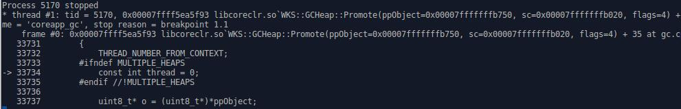
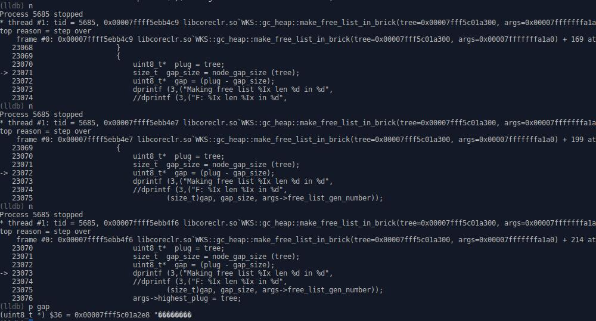
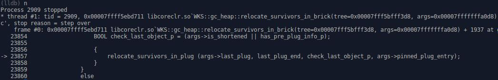

CoreCLR源码探索(五) GC内存收集器的内部实现 调试篇

在上一篇中我分析了CoreCLR中GC的内部处理，
在这一篇我将使用LLDB实际跟踪CoreCLR中GC，关于如何使用LLDB调试CoreCLR的介绍可以看:

- 微软官方的文档，[地址](https://github.com/dotnet/coreclr/blob/release/1.1.0/Documentation/building/debugging-instructions.md)
- 我在第3篇中的介绍，[地址](http://www.cnblogs.com/zkweb/p/6379080.html)
- LLDB官方的入门文档，[地址](http://lldb.llvm.org/tutorial.html)

# 源代码

本篇跟踪程序的源代码如下:

``` csharp
using System;
using System.Runtime.InteropServices;

namespace ConsoleApplication
{
    public class Program
    {
        public class ClassA { }
        public class ClassB { }
        public class ClassC { }
        
        public static void Main(string[] args)
        {
            var a = new ClassA();
            { var b = new ClassB(); }
            var c = new ClassC();
            
            GCHandle handle = GCHandle.Alloc(c, GCHandleType.Pinned);
            IntPtr address = handle.AddrOfPinnedObject();
            Console.WriteLine((long)address);
            
            GC.Collect();
            Console.WriteLine("first collect completed");
            
            c = null;
            GC.Collect();
            Console.WriteLine("second collect completed");
            
            GC.Collect();
            Console.WriteLine("third collect completed");
        }
    }
}
```

# 准备调试

环境和我的第三篇文章一样，都是ubuntu 16.04 LTS，首先需要发布程序:

``` shell
dotnet publish
```

发布程序后，把自己编译的coreclr文件覆盖到发布目录中:
复制`coreclr/bin/Product/Linux.x64.Debug`下的文件到`程序目录/bin/Debug/netcoreapp1.1/ubuntu.16.04-x64/publish`下。
请不要设置开启服务器GC，一来是这篇文章分析的是工作站GC的处理，二来开启服务器GC很容易导致调试时死锁。

# 进入调试

准备工作完成以后就可以进入调试了

``` shell
cd 程序目录/bin/Debug/netcoreapp1.1/ubuntu.16.04-x64/publish
lldb-3.6 程序名称
```


首先设置gc主函数的断点，然后运行程序

``` shell
b gc1
r
```


我们停在了gc1函数，现在可以用`bt`来看调用来源


这次是手动触发GC，调用来源中包含了`GCInterface::Collect`和JIT生成的函数

需要显示当前的本地变量可以用`fr v`，需要打印变量或者表达式可以用`p`


现在用`n`来步过，用`s`来步进继续跟踪代码


# 进入标记阶段

在上图的位置中用`s`命令即可进入`mark_phase`，继续步过到下图的位置


这时先让我们看下堆中的对象，加载CoreCLR提供的LLDB插件

``` shell
plugin load libsosplugin.so
```

插件提供的命令可以查看[这里的文档](https://github.com/dotnet/coreclr/blob/master/Documentation/building/debugging-instructions.md)

执行`dumpheap`查看堆中的状态


执行`dso`查看堆和寄存器中引用的对象


执行`dumpobj`查看对象的信息


在这一轮gc中对象a b c都会存活下来，
可能你会对为什么b能存活下来感到惊讶，对象b的引用分配在栈上，即时生命周期过了也不一定会失效(rsp不会移回去)

``` shell
br s -n Promote -c "(long)*ppObject == 0x00007fff5c01a2b8" # -n 名称 -c 条件
c # 继续执行
```



接下来步进`mark_object_simple`函数，然后步进`gc_mark1`函数


``` shell
me re -s8 -c3 -fx o # 显示地址中的内存，8个字节一组，3组，hex格式，地址是o
p ((CObjectHeader*)o)->IsMarked() # 显示对象是否标记存活
```

我们可以清楚的看到标记对象存活设置了MethodTable的指针`|= 1`

现在给`PinObject`下断点

``` shell
br s -n PinObject -c "(long)*pObjRef == 0x00007fff5c01a1a0"
c
```


可以看到只是调用`Promote`然后传入`GC_CALL_PINNED`

继续步进到`if (flags & GC_CALL_PINNED)`下的`pin_object`


可以看到pinned标记设置在同步索引块中

# 进入计划阶段

进入计划阶段后首先打印一下各个代的状态

``` shell
p generation_table
```

使用这个命令可以看到gen 0 ~ gen 3的状态，最后一个元素是空元素不用在意


继续步过下去到下图的这一段


在这里我们找到了一个plug的开始，然后枚举已标记的对象，下图是擦除marked和pinned标记的代码


在这里我们找到了一个plug的结束


如果是Full GC或者不升代，在处理第一个plug之前就会设置gen 2的计划代边界


模拟压缩的地址


如果x越过原来的gen 0的边界，设置gen 1的计划代边界(原gen 1的对象变gen 2)，
如果不升代这里也会设置gen 0的计划代边界


模拟压缩后把原地址与压缩到的地址的偏移值存到plug信息(plug前的一块内存)中


构建plug树


设置brick表，这个plug树跨了6个brick


如果升代，模拟压缩全部完成后设置gen 0的计划代边界


接下来如果不动里面的变量，将会进入清扫阶段(不满足进入压缩阶段的条件)

# 进入清扫阶段

这次为了观察对象c如何被清扫，我们进入第二次gc的`make_free_lists`

``` shell
b make_free_lists
c
```

处理当前brick中的plug树


前面看到的对象c的地址是0x00007fff5c01a2e8，这里我们就看对象c后面的plug是如何处理的

``` shell
br s -f gc.cpp -l 23070 -c "(long)tree > 0x00007fff5c01a2e8"
c
```

我们可以看到plug 0x00007fff5c01a300前面的空余空间中包含了对象c，空余空间的开始地址就是对象c



接下来就是在这片空余空间中创建free object和加到free list了，
这里的大小不足(< min_free_list)所以只会创建free object不会加到free list中


设置代边界，之前计划阶段模拟的计划代边界不会被使用


清扫阶段完成后这次的gc的主要工作就完成了，接下来让我们看重定位阶段和压缩阶段

# 进入重定位阶段

使用上面的程序让计划阶段选择压缩，需要修改变量，这里重新运行程序并使用以下命令

```
b gc.cpp:22489
c
expr should_compact = true
```


`n`步过到下图的位置，`s`步进到`relocate_phase`函数


到这个位置可以看到用了和标记阶段一样的`GcScanRoots`函数，但是传入的不是`Promote`而是`Relocate`函数


接下来下断点进入`Relocate`函数

```
b Relocate
c
```

`GCHeap::Relocate`函数不会重定位子对象，只是用来重定位来源于根对象的引用


一直走到这个位置然后进入`gc_heap::relocate_address`函数


根据原地址和brick table找到对应的plug树


搜索plug树中old_address所属的plug


根据plug中的reloc修改指针地址


现在再来看relocate_survivors函数，这个函数用于重定位存活下来的对象中的引用

```
b relocate_survivors
c
```


接下来会枚举并处理brick，走到这里进入`relocate_survivors_in_brick`函数，这个函数处理单个brick中的plug树


递归处理plug树种的各个节点


走到这里进入`relocate_survivors_in_plug`函数，这个函数处理单个plug中的对象



图中的这个plug结尾被下一个plug覆盖过，需要特殊处理，这里继续进入`relocate_shortened_survivor_helper`函数


当前是unpinned plug，下一个plug是pinned plug


枚举处理plug中的各个对象


如果这个对象结尾未被覆盖，则调用`relocate_obj_helper`重定位对象中的各个成员


如果对象结尾被覆盖了，则调用`relocate_shortened_obj_helper`重定位对象中的各个成员
在这里成员如果被覆盖会调用reloc_ref_in_shortened_obj修改备份数据中的成员，但是因为`go_through_object_nostart`是一个macro这里无法调试内部的代码


接下来我们观察对象a的地址是否改变了

重新运行并修改`should_compact`变量

```
b gc.cpp:22489
r
expr should_compact = true
plugin load libsosplugin.so
dso
```

我们可以看到对象a的地址在0x00007fff5c01a2b8，接下来给`relocate_address`函数下断点


```
br s -n relocate_address -c "(long)(*pold_address) == 0x00007fff5c01a2b8"
c
```


我们可以看到地址由0x00007fff5c01a2b8变成了0x00007fff5c0091b8


接下来一直跳回plan_phase，下图可以看到重定位阶段完成以后新的地址上仍无对象，重定位阶段只是修改了地址并未复制内存，直到压缩阶段完成以后对象才会在新的地址


接下来看压缩阶段

# 进入压缩阶段

在重定位阶段完成以后走到下图的位置，步进即可进入压缩阶段


枚举brick table


处理单个brick table中的plug树


根据下一个tree的gap计算last_plug的大小


处理单个plug中的对象


上面的last_plug是pinned plug所以不移动，这里找了另外一个会移动的plug


下图可以看到整个plug都被复制到新的地址


这里再找一个结尾被覆盖过的plug看看是怎么处理的


首先把被覆盖的结尾大小加回去


然后把被覆盖的内容临时恢复回去


复制完再把覆盖的内容交换回来，因为下一个plug还需要用


最终在recover_saved_pinned_info会全部恢复回去

# 参考链接

https://github.com/dotnet/coreclr/blob/master/Documentation/botr/garbage-collection.md
https://github.com/dotnet/coreclr/blob/release/1.1.0/Documentation/building/linux-instructions.md
https://github.com/dotnet/coreclr/blob/release/1.1.0/Documentation/building/debugging-instructions.md
http://lldb.llvm.org/tutorial.html
http://lldb.llvm.org/lldb-gdb.html

# 写在最后

这一篇中我列出了几个gc中比较关键的部分，但是还有成千上百处可以探讨的部分，
如果你有兴趣可以自己试着用lldb调试CoreCLR，可以学到很多文档和书籍之外的知识，
特别是对于CoreCLR这种文档少注释也少的项目，掌握调试工具可以大幅减少理解代码所需的时间

写完这一篇我将暂停研究GC，下一篇开始会介绍JIT相关的内容，敬请期待