CoreCLR源码探索(八) JIT的工作原理(详解篇)

在[上一篇](http://www.cnblogs.com/zkweb/p/7687737.html)我们对CoreCLR中的JIT有了一个基础的了解,
这一篇我们将更详细分析JIT的实现.

JIT的实现代码主要在[https://github.com/dotnet/coreclr/tree/master/src/jit](https://github.com/dotnet/coreclr/tree/master/src/jit)下,
要对一个的函数的JIT过程进行详细分析, 最好的办法是查看JitDump.
查看JitDump需要自己编译一个Debug版本的CoreCLR, windows可以[看这里](https://github.com/dotnet/coreclr/blob/master/Documentation/building/windows-instructions.md), linux可以[看这里](https://github.com/dotnet/coreclr/blob/master/Documentation/building/linux-instructions.md),
编译完以后定义环境变量`COMPlus_JitDump=Main`, Main可以换成其他函数的名称, 然后使用该Debug版本的CoreCLR执行程序即可.

JitDump的例子可以[看这里](https://gist.github.com/303248153/f15f3a6a2013a411e770d72c16c2f633), 包含了Debug模式和Release模式的输出.

接下来我们来结合代码一步步的看JIT中的各个过程.
以下的代码基于CoreCLR 1.1.0和x86/x64分析, 新版本可能会有变化.
(为什么是1.1.0? 因为JIT部分我看了半年时间, 开始看的时候2.0还未出来)

# JIT的触发

在上一篇中我提到了, 触发JIT编译会在第一次调用函数时, 会从桩(Stub)触发:

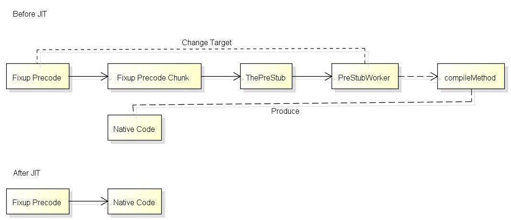

这就是JIT Stub实际的样子, 函数第一次调用前[Fixup Precode](https://github.com/dotnet/coreclr/blob/release/1.1.0/Documentation/botr/method-descriptor.md)的状态:

``` text
Fixup Precode:

(lldb) di --frame --bytes
-> 0x7fff7c21f5a8: e8 2b 6c fe ff     callq  0x7fff7c2061d8
   0x7fff7c21f5ad: 5e                 popq   %rsi
   0x7fff7c21f5ae: 19 05 e8 23 6c fe  sbbl   %eax, -0x193dc18(%rip)
   0x7fff7c21f5b4: ff 5e a8           lcalll *-0x58(%rsi)
   0x7fff7c21f5b7: 04 e8              addb   $-0x18, %al
   0x7fff7c21f5b9: 1b 6c fe ff        sbbl   -0x1(%rsi,%rdi,8), %ebp
   0x7fff7c21f5bd: 5e                 popq   %rsi
   0x7fff7c21f5be: 00 03              addb   %al, (%rbx)
   0x7fff7c21f5c0: e8 13 6c fe ff     callq  0x7fff7c2061d8
   0x7fff7c21f5c5: 5e                 popq   %rsi
   0x7fff7c21f5c6: b0 02              movb   $0x2, %al
(lldb) di --frame --bytes 
-> 0x7fff7c2061d8: e9 13 3f 9d 79                 jmp    0x7ffff5bda0f0            ; PrecodeFixupThunk
   0x7fff7c2061dd: cc                             int3   
   0x7fff7c2061de: cc                             int3   
   0x7fff7c2061df: cc                             int3   
   0x7fff7c2061e0: 49 ba 00 da d0 7b ff 7f 00 00  movabsq $0x7fff7bd0da00, %r10
   0x7fff7c2061ea: 40 e9 e0 ff ff ff              jmp    0x7fff7c2061d0
```

这两段代码只有第一条指令是相关的, 注意callq后面的`5e 19 05`, 这些并不是汇编指令而是函数的信息, 下面会提到.
接下来跳转到`Fixup Precode Chunk`, 从这里开始的代码所有函数都会共用:

``` text
Fixup Precode Chunk:

(lldb) di --frame --bytes
-> 0x7ffff5bda0f0 <PrecodeFixupThunk>: 58              popq   %rax                         ; rax = 0x7fff7c21f5ad
   0x7ffff5bda0f1 <PrecodeFixupThunk+1>: 4c 0f b6 50 02  movzbq 0x2(%rax), %r10            ; r10 = 0x05 (precode chunk index)
   0x7ffff5bda0f6 <PrecodeFixupThunk+6>: 4c 0f b6 58 01  movzbq 0x1(%rax), %r11            ; r11 = 0x19 (methoddesc chunk index)
   0x7ffff5bda0fb <PrecodeFixupThunk+11>: 4a 8b 44 d0 03  movq   0x3(%rax,%r10,8), %rax    ; rax = 0x7fff7bdd5040 (methoddesc chunk)
   0x7ffff5bda100 <PrecodeFixupThunk+16>: 4e 8d 14 d8     leaq   (%rax,%r11,8), %r10       ; r10 = 0x7fff7bdd5108 (methoddesc)
   0x7ffff5bda104 <PrecodeFixupThunk+20>: e9 37 ff ff ff  jmp    0x7ffff5bda040            ; ThePreStub
```

这段代码的源代码在[vm\amd64\unixasmhelpers.S](https://github.com/dotnet/coreclr/blob/v1.1.0/src/vm/amd64/unixasmhelpers.S):

``` text
LEAF_ENTRY PrecodeFixupThunk, _TEXT

        pop     rax         // Pop the return address. It points right after the call instruction in the precode.

        // Inline computation done by FixupPrecode::GetMethodDesc()
        movzx   r10,byte ptr [rax+2]    // m_PrecodeChunkIndex
        movzx   r11,byte ptr [rax+1]    // m_MethodDescChunkIndex
        mov     rax,qword ptr [rax+r10*8+3]
        lea     METHODDESC_REGISTER,[rax+r11*8]

        // Tail call to prestub
        jmp C_FUNC(ThePreStub)

LEAF_END PrecodeFixupThunk, _TEXT
```

`popq %rax`后rax会指向刚才callq后面的地址, 再根据后面储存的索引值可以得到编译函数的`MethodDesc`, 接下来跳转到`The PreStub`:

``` text
ThePreStub:

(lldb) di --frame --bytes
-> 0x7ffff5bda040 <ThePreStub>: 55                       pushq  %rbp
   0x7ffff5bda041 <ThePreStub+1>: 48 89 e5                 movq   %rsp, %rbp
   0x7ffff5bda044 <ThePreStub+4>: 53                       pushq  %rbx
   0x7ffff5bda045 <ThePreStub+5>: 41 57                    pushq  %r15
   0x7ffff5bda047 <ThePreStub+7>: 41 56                    pushq  %r14
   0x7ffff5bda049 <ThePreStub+9>: 41 55                    pushq  %r13
   0x7ffff5bda04b <ThePreStub+11>: 41 54                    pushq  %r12
   0x7ffff5bda04d <ThePreStub+13>: 41 51                    pushq  %r9
   0x7ffff5bda04f <ThePreStub+15>: 41 50                    pushq  %r8
   0x7ffff5bda051 <ThePreStub+17>: 51                       pushq  %rcx
   0x7ffff5bda052 <ThePreStub+18>: 52                       pushq  %rdx
   0x7ffff5bda053 <ThePreStub+19>: 56                       pushq  %rsi
   0x7ffff5bda054 <ThePreStub+20>: 57                       pushq  %rdi
   0x7ffff5bda055 <ThePreStub+21>: 48 8d a4 24 78 ff ff ff  leaq   -0x88(%rsp), %rsp         ; allocate transition block
   0x7ffff5bda05d <ThePreStub+29>: 66 0f 7f 04 24           movdqa %xmm0, (%rsp)             ; fill transition block
   0x7ffff5bda062 <ThePreStub+34>: 66 0f 7f 4c 24 10        movdqa %xmm1, 0x10(%rsp)         ; fill transition block
   0x7ffff5bda068 <ThePreStub+40>: 66 0f 7f 54 24 20        movdqa %xmm2, 0x20(%rsp)         ; fill transition block
   0x7ffff5bda06e <ThePreStub+46>: 66 0f 7f 5c 24 30        movdqa %xmm3, 0x30(%rsp)         ; fill transition block
   0x7ffff5bda074 <ThePreStub+52>: 66 0f 7f 64 24 40        movdqa %xmm4, 0x40(%rsp)         ; fill transition block
   0x7ffff5bda07a <ThePreStub+58>: 66 0f 7f 6c 24 50        movdqa %xmm5, 0x50(%rsp)         ; fill transition block
   0x7ffff5bda080 <ThePreStub+64>: 66 0f 7f 74 24 60        movdqa %xmm6, 0x60(%rsp)         ; fill transition block
   0x7ffff5bda086 <ThePreStub+70>: 66 0f 7f 7c 24 70        movdqa %xmm7, 0x70(%rsp)         ; fill transition block
   0x7ffff5bda08c <ThePreStub+76>: 48 8d bc 24 88 00 00 00  leaq   0x88(%rsp), %rdi          ; arg 1 = transition block*
   0x7ffff5bda094 <ThePreStub+84>: 4c 89 d6                 movq   %r10, %rsi                ; arg 2 = methoddesc
   0x7ffff5bda097 <ThePreStub+87>: e8 44 7e 11 00           callq  0x7ffff5cf1ee0            ; PreStubWorker at prestub.cpp:958
   0x7ffff5bda09c <ThePreStub+92>: 66 0f 6f 04 24           movdqa (%rsp), %xmm0
   0x7ffff5bda0a1 <ThePreStub+97>: 66 0f 6f 4c 24 10        movdqa 0x10(%rsp), %xmm1
   0x7ffff5bda0a7 <ThePreStub+103>: 66 0f 6f 54 24 20        movdqa 0x20(%rsp), %xmm2
   0x7ffff5bda0ad <ThePreStub+109>: 66 0f 6f 5c 24 30        movdqa 0x30(%rsp), %xmm3
   0x7ffff5bda0b3 <ThePreStub+115>: 66 0f 6f 64 24 40        movdqa 0x40(%rsp), %xmm4
   0x7ffff5bda0b9 <ThePreStub+121>: 66 0f 6f 6c 24 50        movdqa 0x50(%rsp), %xmm5
   0x7ffff5bda0bf <ThePreStub+127>: 66 0f 6f 74 24 60        movdqa 0x60(%rsp), %xmm6
   0x7ffff5bda0c5 <ThePreStub+133>: 66 0f 6f 7c 24 70        movdqa 0x70(%rsp), %xmm7
   0x7ffff5bda0cb <ThePreStub+139>: 48 8d a4 24 88 00 00 00  leaq   0x88(%rsp), %rsp
   0x7ffff5bda0d3 <ThePreStub+147>: 5f                       popq   %rdi
   0x7ffff5bda0d4 <ThePreStub+148>: 5e                       popq   %rsi
   0x7ffff5bda0d5 <ThePreStub+149>: 5a                       popq   %rdx
   0x7ffff5bda0d6 <ThePreStub+150>: 59                       popq   %rcx
   0x7ffff5bda0d7 <ThePreStub+151>: 41 58                    popq   %r8
   0x7ffff5bda0d9 <ThePreStub+153>: 41 59                    popq   %r9
   0x7ffff5bda0db <ThePreStub+155>: 41 5c                    popq   %r12
   0x7ffff5bda0dd <ThePreStub+157>: 41 5d                    popq   %r13
   0x7ffff5bda0df <ThePreStub+159>: 41 5e                    popq   %r14
   0x7ffff5bda0e1 <ThePreStub+161>: 41 5f                    popq   %r15
   0x7ffff5bda0e3 <ThePreStub+163>: 5b                       popq   %rbx
   0x7ffff5bda0e4 <ThePreStub+164>: 5d                       popq   %rbp
   0x7ffff5bda0e5 <ThePreStub+165>: 48 ff e0                 jmpq   *%rax
   %rax should be patched fixup precode = 0x7fff7c21f5a8
   (%rsp) should be the return address before calling "Fixup Precode"
```

看上去相当长但做的事情很简单, 它的源代码在[vm\amd64\theprestubamd64.S](https://github.com/dotnet/coreclr/blob/v1.1.0/src/vm/amd64/theprestubamd64.S):

``` text
NESTED_ENTRY ThePreStub, _TEXT, NoHandler
        PROLOG_WITH_TRANSITION_BLOCK 0, 0, 0, 0, 0

        //
        // call PreStubWorker
        //
        lea             rdi, [rsp + __PWTB_TransitionBlock]     // pTransitionBlock*
        mov             rsi, METHODDESC_REGISTER
        call            C_FUNC(PreStubWorker)

        EPILOG_WITH_TRANSITION_BLOCK_TAILCALL
        TAILJMP_RAX

NESTED_END ThePreStub, _TEXT
```

它会备份寄存器到栈, 然后调用PreStubWorker这个函数, 调用完毕以后恢复栈上的寄存器,
再**跳转到PreStubWorker的返回结果**, 也就是**打完补丁后的Fixup Precode的地址(0x7fff7c21f5a8)**.

[PreStubWorker](https://github.com/dotnet/coreclr/blob/v1.1.0/src/vm/prestub.cpp#L957)是C编写的函数, 它会调用JIT的编译函数, 然后对Fixup Precode打补丁.
打补丁时会读取前面的`5e`, `5e`代表precode的类型是`PRECODE_FIXUP`, 打补丁的函数是[FixupPrecode::SetTargetInterlocked](https://github.com/dotnet/coreclr/blob/v1.1.0/src/vm/i386/stublinkerx86.cpp#L6658).
打完补丁以后的Fixup Precode如下:

```
Fixup Precode:

(lldb) di --bytes -s 0x7fff7c21f5a8
   0x7fff7c21f5a8: e9 a3 87 3a 00     jmp    0x7fff7c5c7d50
   0x7fff7c21f5ad: 5f                 popq   %rdi
   0x7fff7c21f5ae: 19 05 e8 23 6c fe  sbbl   %eax, -0x193dc18(%rip)
   0x7fff7c21f5b4: ff 5e a8           lcalll *-0x58(%rsi)
   0x7fff7c21f5b7: 04 e8              addb   $-0x18, %al
   0x7fff7c21f5b9: 1b 6c fe ff        sbbl   -0x1(%rsi,%rdi,8), %ebp
   0x7fff7c21f5bd: 5e                 popq   %rsi
   0x7fff7c21f5be: 00 03              addb   %al, (%rbx)
   0x7fff7c21f5c0: e8 13 6c fe ff     callq  0x7fff7c2061d8
   0x7fff7c21f5c5: 5e                 popq   %rsi
   0x7fff7c21f5c6: b0 02              movb   $0x2, %al
```

下次再调用函数时就可以直接jmp到编译结果了.
JIT Stub的实现可以让运行时只编译实际会运行的函数, 这样可以大幅减少程序的启动时间, 第二次调用时的消耗(1个jmp)也非常的小.

注意调用虚方法时的流程跟上面的流程有一点不同, 虚方法的地址会保存在函数表中,
打补丁时会对函数表而不是Precode打补丁, 下次调用时函数表中指向的地址是编译后的地址, 有兴趣可以自己试试分析.

接下来我们看看[PreStubWorker](https://github.com/dotnet/coreclr/blob/v1.1.0/src/vm/prestub.cpp#L957)的内部处理.

# JIT的入口点

[PreStubWorker](https://github.com/dotnet/coreclr/blob/v1.1.0/src/vm/prestub.cpp#L957)的源代码如下:

``` c++
extern "C" PCODE STDCALL PreStubWorker(TransitionBlock * pTransitionBlock, MethodDesc * pMD)
{
    PCODE pbRetVal = NULL;

    BEGIN_PRESERVE_LAST_ERROR;

    STATIC_CONTRACT_THROWS;
    STATIC_CONTRACT_GC_TRIGGERS;
    STATIC_CONTRACT_MODE_COOPERATIVE;
    STATIC_CONTRACT_ENTRY_POINT;

    MAKE_CURRENT_THREAD_AVAILABLE();

#ifdef _DEBUG
    Thread::ObjectRefFlush(CURRENT_THREAD);
#endif

    FrameWithCookie<PrestubMethodFrame> frame(pTransitionBlock, pMD);
    PrestubMethodFrame * pPFrame = &frame;

    pPFrame->Push(CURRENT_THREAD);

    INSTALL_MANAGED_EXCEPTION_DISPATCHER;
    INSTALL_UNWIND_AND_CONTINUE_HANDLER;

    ETWOnStartup (PrestubWorker_V1,PrestubWorkerEnd_V1);

    _ASSERTE(!NingenEnabled() && "You cannot invoke managed code inside the ngen compilation process.");

    // Running the PreStubWorker on a method causes us to access its MethodTable
    g_IBCLogger.LogMethodDescAccess(pMD);

    // Make sure the method table is restored, and method instantiation if present
    pMD->CheckRestore();

    CONSISTENCY_CHECK(GetAppDomain()->CheckCanExecuteManagedCode(pMD));

    // Note this is redundant with the above check but we do it anyway for safety
    //
    // This has been disabled so we have a better chance of catching these.  Note that this check is
    // NOT sufficient for domain neutral and ngen cases.
    //
    // pMD->EnsureActive();

    MethodTable *pDispatchingMT = NULL;

    if (pMD->IsVtableMethod())
    {
        OBJECTREF curobj = pPFrame->GetThis();

        if (curobj != NULL) // Check for virtual function called non-virtually on a NULL object
        {
            pDispatchingMT = curobj->GetTrueMethodTable();

#ifdef FEATURE_ICASTABLE
            if (pDispatchingMT->IsICastable())
            {
                MethodTable *pMDMT = pMD->GetMethodTable();
                TypeHandle objectType(pDispatchingMT);
                TypeHandle methodType(pMDMT);

                GCStress<cfg_any>::MaybeTrigger();
                INDEBUG(curobj = NULL); // curobj is unprotected and CanCastTo() can trigger GC
                if (!objectType.CanCastTo(methodType)) 
                {
                    // Apperantly ICastable magic was involved when we chose this method to be called
                    // that's why we better stick to the MethodTable it belongs to, otherwise 
                    // DoPrestub() will fail not being able to find implementation for pMD in pDispatchingMT.

                    pDispatchingMT = pMDMT;
                }
            }
#endif // FEATURE_ICASTABLE

            // For value types, the only virtual methods are interface implementations.
            // Thus pDispatching == pMT because there
            // is no inheritance in value types.  Note the BoxedEntryPointStubs are shared
            // between all sharable generic instantiations, so the == test is on
            // canonical method tables.
#ifdef _DEBUG 
            MethodTable *pMDMT = pMD->GetMethodTable(); // put this here to see what the MT is in debug mode
            _ASSERTE(!pMD->GetMethodTable()->IsValueType() ||
                     (pMD->IsUnboxingStub() && (pDispatchingMT->GetCanonicalMethodTable() == pMDMT->GetCanonicalMethodTable())));
#endif // _DEBUG
        }
    }

    GCX_PREEMP_THREAD_EXISTS(CURRENT_THREAD);
    pbRetVal = pMD->DoPrestub(pDispatchingMT);

    UNINSTALL_UNWIND_AND_CONTINUE_HANDLER;
    UNINSTALL_MANAGED_EXCEPTION_DISPATCHER;

    {
        HardwareExceptionHolder

        // Give debugger opportunity to stop here
        ThePreStubPatch();
    }

    pPFrame->Pop(CURRENT_THREAD);

    POSTCONDITION(pbRetVal != NULL);

    END_PRESERVE_LAST_ERROR;

    return pbRetVal;
}
```

这个函数接收了两个参数,
第一个是`TransitionBlock`, 其实就是一个指向栈的指针, 里面保存了备份的寄存器,
第二个是`MethodDesc`, 是当前编译函数的信息, lldb中使用`dumpmd pMD`即可看到具体信息.

之后会调用`MethodDesc::DoPrestub`, 如果函数是虚方法则传入this对象类型的`MethodTable`.
[MethodDesc::DoPrestub](https://github.com/dotnet/coreclr/blob/v1.1.0/src/vm/prestub.cpp#L1112)的源代码如下:

``` c++
PCODE MethodDesc::DoPrestub(MethodTable *pDispatchingMT)
{
    CONTRACT(PCODE)
    {
        STANDARD_VM_CHECK;
        POSTCONDITION(RETVAL != NULL);
    }
    CONTRACT_END;

    Stub *pStub = NULL;
    PCODE pCode = NULL;

    Thread *pThread = GetThread();

    MethodTable *pMT = GetMethodTable();

    // Running a prestub on a method causes us to access its MethodTable
    g_IBCLogger.LogMethodDescAccess(this);

    // A secondary layer of defense against executing code in inspection-only assembly.
    // This should already have been taken care of by not allowing inspection assemblies
    // to be activated. However, this is a very inexpensive piece of insurance in the name
    // of security.
    if (IsIntrospectionOnly())
    {
        _ASSERTE(!"A ReflectionOnly assembly reached the prestub. This should not have happened.");
        COMPlusThrow(kInvalidOperationException, IDS_EE_CODEEXECUTION_IN_INTROSPECTIVE_ASSEMBLY);
    }

    if (ContainsGenericVariables())
    {
        COMPlusThrow(kInvalidOperationException, IDS_EE_CODEEXECUTION_CONTAINSGENERICVAR);
    }

    /**************************   DEBUG CHECKS  *************************/
    /*-----------------------------------------------------------------
    // Halt if needed, GC stress, check the sharing count etc.
    */

#ifdef _DEBUG 
    static unsigned ctr = 0;
    ctr++;

    if (g_pConfig->ShouldPrestubHalt(this))
    {
        _ASSERTE(!"PreStubHalt");
    }

    LOG((LF_CLASSLOADER, LL_INFO10000, "In PreStubWorker for %s::%s\n",
                m_pszDebugClassName, m_pszDebugMethodName));

    // This is a nice place to test out having some fatal EE errors. We do this only in a checked build, and only
    // under the InjectFatalError key.
    if (g_pConfig->InjectFatalError() == 1)
    {
        EEPOLICY_HANDLE_FATAL_ERROR(COR_E_EXECUTIONENGINE);
    }
    else if (g_pConfig->InjectFatalError() == 2)
    {
        EEPOLICY_HANDLE_FATAL_ERROR(COR_E_STACKOVERFLOW);
    }
    else if (g_pConfig->InjectFatalError() == 3)
    {
        TestSEHGuardPageRestore();
    }

    // Useful to test GC with the prestub on the call stack
    if (g_pConfig->ShouldPrestubGC(this))
    {
        GCX_COOP();
        GCHeap::GetGCHeap()->GarbageCollect(-1);
    }
#endif // _DEBUG

    STRESS_LOG1(LF_CLASSLOADER, LL_INFO10000, "Prestubworker: method %pM\n", this);


    GCStress<cfg_any, EeconfigFastGcSPolicy, CoopGcModePolicy>::MaybeTrigger();

    // Are we in the prestub because of a rejit request?  If so, let the ReJitManager
    // take it from here.
    pCode = ReJitManager::DoReJitIfNecessary(this);
    if (pCode != NULL)
    {
        // A ReJIT was performed, so nothing left for DoPrestub() to do. Return now.
        // 
        // The stable entrypoint will either be a pointer to the original JITted code
        // (with a jmp at the top to jump to the newly-rejitted code) OR a pointer to any
        // stub code that must be executed first (e.g., a remoting stub), which in turn
        // will call the original JITted code (which then jmps to the newly-rejitted
        // code).
        RETURN GetStableEntryPoint();
    }

#ifdef FEATURE_PREJIT 
    // If this method is the root of a CER call graph and we've recorded this fact in the ngen image then we're in the prestub in
    // order to trip any runtime level preparation needed for this graph (P/Invoke stub generation/library binding, generic
    // dictionary prepopulation etc.).
    GetModule()->RestoreCer(this);
#endif // FEATURE_PREJIT

#ifdef FEATURE_COMINTEROP 
    /**************************   INTEROP   *************************/
    /*-----------------------------------------------------------------
    // Some method descriptors are COMPLUS-to-COM call descriptors
    // they are not your every day method descriptors, for example
    // they don't have an IL or code.
    */
    if (IsComPlusCall() || IsGenericComPlusCall())
    {
        pCode = GetStubForInteropMethod(this);
        
        GetPrecode()->SetTargetInterlocked(pCode);

        RETURN GetStableEntryPoint();
    }
#endif // FEATURE_COMINTEROP

    // workaround: This is to handle a punted work item dealing with a skipped module constructor
    //       due to appdomain unload. Basically shared code was JITted in domain A, and then
    //       this caused a link to another shared module with a module CCTOR, which was skipped
    //       or aborted in another appdomain we were trying to propagate the activation to.
    //
    //       Note that this is not a fix, but that it just minimizes the window in which the
    //       issue can occur.
    if (pThread->IsAbortRequested())
    {
        pThread->HandleThreadAbort();
    }

    /**************************   CLASS CONSTRUCTOR   ********************/
    // Make sure .cctor has been run

    if (IsClassConstructorTriggeredViaPrestub())
    {
        pMT->CheckRunClassInitThrowing();
    }

    /**************************   BACKPATCHING   *************************/
    // See if the addr of code has changed from the pre-stub
#ifdef FEATURE_INTERPRETER
    if (!IsReallyPointingToPrestub())
#else
    if (!IsPointingToPrestub())
#endif
    {
        LOG((LF_CLASSLOADER, LL_INFO10000,
                "    In PreStubWorker, method already jitted, backpatching call point\n"));

        RETURN DoBackpatch(pMT, pDispatchingMT, TRUE);
    }

    // record if remoting needs to intercept this call
    BOOL  fRemotingIntercepted = IsRemotingInterceptedViaPrestub();

    BOOL  fReportCompilationFinished = FALSE;
    
    /**************************   CODE CREATION  *************************/
    if (IsUnboxingStub())
    {
        pStub = MakeUnboxingStubWorker(this);
    }
#ifdef FEATURE_REMOTING
    else if (pMT->IsInterface() && !IsStatic() && !IsFCall())
    {
        pCode = CRemotingServices::GetDispatchInterfaceHelper(this);
        GetOrCreatePrecode();
    }
#endif // FEATURE_REMOTING
#if defined(FEATURE_SHARE_GENERIC_CODE) 
    else if (IsInstantiatingStub())
    {
        pStub = MakeInstantiatingStubWorker(this);
    }
#endif // defined(FEATURE_SHARE_GENERIC_CODE)
    else if (IsIL() || IsNoMetadata())
    {
        // remember if we need to backpatch the MethodTable slot
        BOOL  fBackpatch           = !fRemotingIntercepted
                                    && !IsEnCMethod();

#ifdef FEATURE_PREJIT 
        //
        // See if we have any prejitted code to use.
        //

        pCode = GetPreImplementedCode();

#ifdef PROFILING_SUPPORTED
        if (pCode != NULL)
        {
            BOOL fShouldSearchCache = TRUE;

            {
                BEGIN_PIN_PROFILER(CORProfilerTrackCacheSearches());
                g_profControlBlock.pProfInterface->
                    JITCachedFunctionSearchStarted((FunctionID) this,
                                                   &fShouldSearchCache);
                END_PIN_PROFILER();
            }

            if (!fShouldSearchCache)
            {
#ifdef FEATURE_INTERPRETER
                SetNativeCodeInterlocked(NULL, pCode, FALSE);
#else
                SetNativeCodeInterlocked(NULL, pCode);
#endif
                _ASSERTE(!IsPreImplemented());
                pCode = NULL;
            }
        }
#endif // PROFILING_SUPPORTED

        if (pCode != NULL)
        {
            LOG((LF_ZAP, LL_INFO10000,
                "ZAP: Using code" FMT_ADDR "for %s.%s sig=\"%s\" (token %x).\n",
                    DBG_ADDR(pCode),
                    m_pszDebugClassName,
                    m_pszDebugMethodName,
                    m_pszDebugMethodSignature,
                    GetMemberDef()));

            TADDR pFixupList = GetFixupList();
            if (pFixupList != NULL)
            {
                Module *pZapModule = GetZapModule();
                _ASSERTE(pZapModule != NULL);
                if (!pZapModule->FixupDelayList(pFixupList))
                {
                    _ASSERTE(!"FixupDelayList failed");
                    ThrowHR(COR_E_BADIMAGEFORMAT);
                }
            }

#ifdef HAVE_GCCOVER
            if (GCStress<cfg_instr_ngen>::IsEnabled())
                SetupGcCoverage(this, (BYTE*) pCode);
#endif // HAVE_GCCOVER

#ifdef PROFILING_SUPPORTED 
            /*
                * This notifies the profiler that a search to find a
                * cached jitted function has been made.
                */
            {
                BEGIN_PIN_PROFILER(CORProfilerTrackCacheSearches());
                g_profControlBlock.pProfInterface->
                    JITCachedFunctionSearchFinished((FunctionID) this, COR_PRF_CACHED_FUNCTION_FOUND);
                END_PIN_PROFILER();
            }
#endif // PROFILING_SUPPORTED
        }

        //
        // If not, try to jit it
        //

#endif // FEATURE_PREJIT

#ifdef FEATURE_READYTORUN
        if (pCode == NULL)
        {
            Module * pModule = GetModule();
            if (pModule->IsReadyToRun())
            {
                pCode = pModule->GetReadyToRunInfo()->GetEntryPoint(this);
                if (pCode != NULL)
                    fReportCompilationFinished = TRUE;
            }
        }
#endif // FEATURE_READYTORUN

        if (pCode == NULL)
        {
            NewHolder<COR_ILMETHOD_DECODER> pHeader(NULL);
            // Get the information on the method
            if (!IsNoMetadata())
            {
                COR_ILMETHOD* ilHeader = GetILHeader(TRUE);
                if(ilHeader == NULL)
                {
#ifdef FEATURE_COMINTEROP
                    // Abstract methods can be called through WinRT derivation if the deriving type
                    // is not implemented in managed code, and calls through the CCW to the abstract
                    // method. Throw a sensible exception in that case.
                    if (pMT->IsExportedToWinRT() && IsAbstract())
                    {
                        COMPlusThrowHR(E_NOTIMPL);
                    }
#endif // FEATURE_COMINTEROP

                    COMPlusThrowHR(COR_E_BADIMAGEFORMAT, BFA_BAD_IL);
                }

                COR_ILMETHOD_DECODER::DecoderStatus status = COR_ILMETHOD_DECODER::FORMAT_ERROR;

                {
                    // Decoder ctor can AV on a malformed method header
                    AVInRuntimeImplOkayHolder AVOkay;
                    pHeader = new COR_ILMETHOD_DECODER(ilHeader, GetMDImport(), &status);
                    if(pHeader == NULL)
                        status = COR_ILMETHOD_DECODER::FORMAT_ERROR;
                }

                if (status == COR_ILMETHOD_DECODER::VERIFICATION_ERROR &&
                    Security::CanSkipVerification(GetModule()->GetDomainAssembly()))
                {
                    status = COR_ILMETHOD_DECODER::SUCCESS;
                }

                if (status != COR_ILMETHOD_DECODER::SUCCESS)
                {
                    if (status == COR_ILMETHOD_DECODER::VERIFICATION_ERROR)
                    {
                        // Throw a verification HR
                        COMPlusThrowHR(COR_E_VERIFICATION);
                    }
                    else
                    {
                        COMPlusThrowHR(COR_E_BADIMAGEFORMAT, BFA_BAD_IL);
                    }
                }

#ifdef _VER_EE_VERIFICATION_ENABLED 
                static ConfigDWORD peVerify;

                if (peVerify.val(CLRConfig::EXTERNAL_PEVerify))
                    Verify(pHeader, TRUE, FALSE);   // Throws a VerifierException if verification fails
#endif // _VER_EE_VERIFICATION_ENABLED
            } // end if (!IsNoMetadata())

            // JIT it
            LOG((LF_CLASSLOADER, LL_INFO1000000,
                    "    In PreStubWorker, calling MakeJitWorker\n"));

            // Create the precode eagerly if it is going to be needed later.
            if (!fBackpatch)
            {
                GetOrCreatePrecode();
            }

            // Mark the code as hot in case the method ends up in the native image
            g_IBCLogger.LogMethodCodeAccess(this);

            pCode = MakeJitWorker(pHeader, 0, 0);

#ifdef FEATURE_INTERPRETER
            if ((pCode != NULL) && !HasStableEntryPoint())
            {
                // We don't yet have a stable entry point, so don't do backpatching yet.
                // But we do have to handle some extra cases that occur in backpatching.
                // (Perhaps I *should* get to the backpatching code, but in a mode where we know
                // we're not dealing with the stable entry point...)
                if (HasNativeCodeSlot())
                {
                    // We called "SetNativeCodeInterlocked" in MakeJitWorker, which updated the native
                    // code slot, but I think we also want to update the regular slot...
                    PCODE tmpEntry = GetTemporaryEntryPoint();
                    PCODE pFound = FastInterlockCompareExchangePointer(GetAddrOfSlot(), pCode, tmpEntry);
                    // Doesn't matter if we failed -- if we did, it's because somebody else made progress.
                    if (pFound != tmpEntry) pCode = pFound;
                }

                // Now we handle the case of a FuncPtrPrecode.  
                FuncPtrStubs * pFuncPtrStubs = GetLoaderAllocator()->GetFuncPtrStubsNoCreate();
                if (pFuncPtrStubs != NULL)
                {
                    Precode* pFuncPtrPrecode = pFuncPtrStubs->Lookup(this);
                    if (pFuncPtrPrecode != NULL)
                    {
                        // If there is a funcptr precode to patch, attempt to patch it.  If we lose, that's OK,
                        // somebody else made progress.
                        pFuncPtrPrecode->SetTargetInterlocked(pCode);
                    }
                }
            }
#endif // FEATURE_INTERPRETER
        } // end if (pCode == NULL)
    } // end else if (IsIL() || IsNoMetadata())
    else if (IsNDirect())
    {
        if (!GetModule()->GetSecurityDescriptor()->CanCallUnmanagedCode())
            Security::ThrowSecurityException(g_SecurityPermissionClassName, SPFLAGSUNMANAGEDCODE);

        pCode = GetStubForInteropMethod(this);
        GetOrCreatePrecode();
    }
    else if (IsFCall())
    {
        // Get the fcall implementation
        BOOL fSharedOrDynamicFCallImpl;
        pCode = ECall::GetFCallImpl(this, &fSharedOrDynamicFCallImpl);

        if (fSharedOrDynamicFCallImpl)
        {
            // Fake ctors share one implementation that has to be wrapped by prestub
            GetOrCreatePrecode();
        }
    }
    else if (IsArray())
    {
        pStub = GenerateArrayOpStub((ArrayMethodDesc*)this);
    }
    else if (IsEEImpl())
    {
        _ASSERTE(GetMethodTable()->IsDelegate());
        pCode = COMDelegate::GetInvokeMethodStub((EEImplMethodDesc*)this);
        GetOrCreatePrecode();
    }
    else
    {
        // This is a method type we don't handle yet
        _ASSERTE(!"Unknown Method Type");
    }

    /**************************   POSTJIT *************************/
#ifndef FEATURE_INTERPRETER
    _ASSERTE(pCode == NULL || GetNativeCode() == NULL || pCode == GetNativeCode());
#else // FEATURE_INTERPRETER
    // Interpreter adds a new possiblity == someone else beat us to installing an intepreter stub.
    _ASSERTE(pCode == NULL || GetNativeCode() == NULL || pCode == GetNativeCode()
             || Interpreter::InterpretationStubToMethodInfo(pCode) == this);
#endif // FEATURE_INTERPRETER

    // At this point we must have either a pointer to managed code or to a stub. All of the above code
    // should have thrown an exception if it couldn't make a stub.
    _ASSERTE((pStub != NULL) ^ (pCode != NULL));

    /**************************   SECURITY   *************************/

    // Lets check to see if we need declarative security on this stub, If we have
    // security checks on this method or class then we need to add an intermediate
    // stub that performs declarative checks prior to calling the real stub.
    // record if security needs to intercept this call (also depends on whether we plan to use stubs for declarative security)

#if !defined( HAS_REMOTING_PRECODE) && defined (FEATURE_REMOTING)
    /**************************   REMOTING   *************************/

    // check for MarshalByRef scenarios ... we need to intercept
    // Non-virtual calls on MarshalByRef types
    if (fRemotingIntercepted)
    {
        // let us setup a remoting stub to intercept all the calls
        Stub *pRemotingStub = CRemotingServices::GetStubForNonVirtualMethod(this, 
            (pStub != NULL) ? (LPVOID)pStub->GetEntryPoint() : (LPVOID)pCode, pStub);
        
        if (pRemotingStub != NULL)
        {
            pStub = pRemotingStub;
            pCode = NULL;
        }
    }
#endif // HAS_REMOTING_PRECODE

    _ASSERTE((pStub != NULL) ^ (pCode != NULL));

#if defined(_TARGET_X86_) || defined(_TARGET_AMD64_)
    //
    // We are seeing memory reordering race around fixups (see DDB 193514 and related bugs). We get into
    // situation where the patched precode is visible by other threads, but the resolved fixups 
    // are not. IT SHOULD NEVER HAPPEN according to our current understanding of x86/x64 memory model.
    // (see email thread attached to the bug for details).
    //
    // We suspect that there may be bug in the hardware or that hardware may have shortcuts that may be 
    // causing grief. We will try to avoid the race by executing an extra memory barrier.
    //
    MemoryBarrier();
#endif

    if (pCode != NULL)
    {
        if (HasPrecode())
            GetPrecode()->SetTargetInterlocked(pCode);
        else
        if (!HasStableEntryPoint())
        {
            // Is the result an interpreter stub?
#ifdef FEATURE_INTERPRETER
            if (Interpreter::InterpretationStubToMethodInfo(pCode) == this)
            {
                SetEntryPointInterlocked(pCode);
            }
            else
#endif // FEATURE_INTERPRETER
            {
                SetStableEntryPointInterlocked(pCode);
            }
        }
    }
    else
    {
        if (!GetOrCreatePrecode()->SetTargetInterlocked(pStub->GetEntryPoint()))
        {
            pStub->DecRef();
        }
        else
        if (pStub->HasExternalEntryPoint())
        {
            // If the Stub wraps code that is outside of the Stub allocation, then we
            // need to free the Stub allocation now.
            pStub->DecRef();
        }
    }

#ifdef FEATURE_INTERPRETER
    _ASSERTE(!IsReallyPointingToPrestub());
#else // FEATURE_INTERPRETER
    _ASSERTE(!IsPointingToPrestub());
    _ASSERTE(HasStableEntryPoint());
#endif // FEATURE_INTERPRETER

    if (fReportCompilationFinished)
        DACNotifyCompilationFinished(this);

    RETURN DoBackpatch(pMT, pDispatchingMT, FALSE);
}
```

这个函数比较长, 我们只需要关注两个地方:

``` c++
pCode = MakeJitWorker(pHeader, 0, 0);
```

`MakeJitWorker`会调用JIT编译函数, pCode是编译后的机器代码地址.

``` c++
if (HasPrecode())
    GetPrecode()->SetTargetInterlocked(pCode);
```

`SetTargetInterlocked`会对Precode打补丁, 第二次调用函数时会直接跳转到编译结果.

[MakeJitWorker](https://github.com/dotnet/coreclr/blob/v1.1.0/src/vm/prestub.cpp#L259)的源代码如下:

``` c++
PCODE MethodDesc::MakeJitWorker(COR_ILMETHOD_DECODER* ILHeader, DWORD flags, DWORD flags2)
{
    STANDARD_VM_CONTRACT;

    BOOL fIsILStub = IsILStub();        // @TODO: understand the need for this special case

    LOG((LF_JIT, LL_INFO1000000,
         "MakeJitWorker(" FMT_ADDR ", %s) for %s:%s\n",
         DBG_ADDR(this),
         fIsILStub               ? " TRUE" : "FALSE",
         GetMethodTable()->GetDebugClassName(),
         m_pszDebugMethodName));

    PCODE pCode = NULL;
    ULONG sizeOfCode = 0;
#ifdef FEATURE_INTERPRETER
    PCODE pPreviousInterpStub = NULL;
    BOOL fInterpreted = FALSE;
    BOOL fStable = TRUE;  // True iff the new code address (to be stored in pCode), is a stable entry point.
#endif

#ifdef FEATURE_MULTICOREJIT
    MulticoreJitManager & mcJitManager = GetAppDomain()->GetMulticoreJitManager();

    bool fBackgroundThread = (flags & CORJIT_FLG_MCJIT_BACKGROUND) != 0;
#endif

    {
        // Enter the global lock which protects the list of all functions being JITd
        ListLockHolder pJitLock (GetDomain()->GetJitLock());

        // It is possible that another thread stepped in before we entered the global lock for the first time.
        pCode = GetNativeCode();
        if (pCode != NULL)
        {
#ifdef FEATURE_INTERPRETER
            if (Interpreter::InterpretationStubToMethodInfo(pCode) == this)
            {
                pPreviousInterpStub = pCode;
            }
            else
#endif // FEATURE_INTERPRETER
            goto Done;
        }

        const char *description = "jit lock";
        INDEBUG(description = m_pszDebugMethodName;)
        ListLockEntryHolder pEntry(ListLockEntry::Find(pJitLock, this, description));

        // We have an entry now, we can release the global lock
        pJitLock.Release();

        // Take the entry lock
        {
            ListLockEntryLockHolder pEntryLock(pEntry, FALSE);

            if (pEntryLock.DeadlockAwareAcquire())
            {
                if (pEntry->m_hrResultCode == S_FALSE)
                {
                    // Nobody has jitted the method yet
                }
                else
                {
                    // We came in to jit but someone beat us so return the
                    // jitted method!

                    // We can just fall through because we will notice below that
                    // the method has code.

                    // @todo: Note that we may have a failed HRESULT here -
                    // we might want to return an early error rather than
                    // repeatedly failing the jit.
                }
            }
            else
            {
                // Taking this lock would cause a deadlock (presumably because we
                // are involved in a class constructor circular dependency.)  For
                // instance, another thread may be waiting to run the class constructor
                // that we are jitting, but is currently jitting this function.
                //
                // To remedy this, we want to go ahead and do the jitting anyway.
                // The other threads contending for the lock will then notice that
                // the jit finished while they were running class constructors, and abort their
                // current jit effort.
                //
                // We don't have to do anything special right here since we
                // can check HasNativeCode() to detect this case later.
                //
                // Note that at this point we don't have the lock, but that's OK because the
                // thread which does have the lock is blocked waiting for us.
            }

            // It is possible that another thread stepped in before we entered the lock.
            pCode = GetNativeCode();
#ifdef FEATURE_INTERPRETER
            if (pCode != NULL && (pCode != pPreviousInterpStub))
#else
            if (pCode != NULL)
#endif // FEATURE_INTERPRETER
            {
                goto Done;
            }

            SString namespaceOrClassName, methodName, methodSignature;

            PCODE pOtherCode = NULL; // Need to move here due to 'goto GotNewCode'
            
#ifdef FEATURE_MULTICOREJIT

            bool fCompiledInBackground = false;

            // If not called from multi-core JIT thread, 
            if (! fBackgroundThread)
            {
                // Quick check before calling expensive out of line function on this method's domain has code JITted by background thread
                if (mcJitManager.GetMulticoreJitCodeStorage().GetRemainingMethodCount() > 0)
                {
                    if (MulticoreJitManager::IsMethodSupported(this))
                    {
                        pCode = mcJitManager.RequestMethodCode(this); // Query multi-core JIT manager for compiled code

                        // Multicore JIT manager starts background thread to pre-compile methods, but it does not back-patch it/notify profiler/notify DAC,
                        // Jumtp to GotNewCode to do so
                        if (pCode != NULL)
                        {
                            fCompiledInBackground = true;
                    
#ifdef DEBUGGING_SUPPORTED
                            // Notify the debugger of the jitted function
                            if (g_pDebugInterface != NULL)
                            {
                                g_pDebugInterface->JITComplete(this, pCode);
                            }
#endif

                            goto GotNewCode;
                        }
                    }
                }
            }
#endif

            if (fIsILStub)
            {
                // we race with other threads to JIT the code for an IL stub and the
                // IL header is released once one of the threads completes.  As a result
                // we must be inside the lock to reliably get the IL header for the
                // stub.

                ILStubResolver* pResolver = AsDynamicMethodDesc()->GetILStubResolver();
                ILHeader = pResolver->GetILHeader();
            }

#ifdef MDA_SUPPORTED 
            MdaJitCompilationStart* pProbe = MDA_GET_ASSISTANT(JitCompilationStart);
            if (pProbe)
                pProbe->NowCompiling(this);
#endif // MDA_SUPPORTED

#ifdef PROFILING_SUPPORTED 
            // If profiling, need to give a chance for a tool to examine and modify
            // the IL before it gets to the JIT.  This allows one to add probe calls for
            // things like code coverage, performance, or whatever.
            {
                BEGIN_PIN_PROFILER(CORProfilerTrackJITInfo());

                // Multicore JIT should be disabled when CORProfilerTrackJITInfo is on
                // But there could be corner case in which profiler is attached when multicore background thread is calling MakeJitWorker
                // Disable this block when calling from multicore JIT background thread
                if (!IsNoMetadata()
#ifdef FEATURE_MULTICOREJIT

                    && (! fBackgroundThread)
#endif
                    )
                {
                    g_profControlBlock.pProfInterface->JITCompilationStarted((FunctionID) this, TRUE);
                    // The profiler may have changed the code on the callback.  Need to
                    // pick up the new code.  Note that you have to be fully trusted in
                    // this mode and the code will not be verified.
                    COR_ILMETHOD *pilHeader = GetILHeader(TRUE);
                    new (ILHeader) COR_ILMETHOD_DECODER(pilHeader, GetMDImport(), NULL);
                }
                END_PIN_PROFILER();
            }
#endif // PROFILING_SUPPORTED
#ifdef FEATURE_INTERPRETER
            // We move the ETW event for start of JITting inward, after we make the decision
            // to JIT rather than interpret.
#else  // FEATURE_INTERPRETER
            // Fire an ETW event to mark the beginning of JIT'ing
            ETW::MethodLog::MethodJitting(this, &namespaceOrClassName, &methodName, &methodSignature);
#endif  // FEATURE_INTERPRETER

#ifdef FEATURE_STACK_SAMPLING
#ifdef FEATURE_MULTICOREJIT
            if (!fBackgroundThread)
#endif // FEATURE_MULTICOREJIT
            {
                StackSampler::RecordJittingInfo(this, flags, flags2);
            }
#endif // FEATURE_STACK_SAMPLING

            EX_TRY
            {
                pCode = UnsafeJitFunction(this, ILHeader, flags, flags2, &sizeOfCode);
            }
            EX_CATCH
            {
                // If the current thread threw an exception, but a competing thread
                // somehow succeeded at JITting the same function (e.g., out of memory
                // encountered on current thread but not competing thread), then go ahead
                // and swallow this current thread's exception, since we somehow managed
                // to successfully JIT the code on the other thread.
                // 
                // Note that if a deadlock cycle is broken, that does not result in an
                // exception--the thread would just pass through the lock and JIT the
                // function in competition with the other thread (with the winner of the
                // race decided later on when we do SetNativeCodeInterlocked). This
                // try/catch is purely to deal with the (unusual) case where a competing
                // thread succeeded where we aborted.
                
                pOtherCode = GetNativeCode();
                
                if (pOtherCode == NULL)
                {
                    pEntry->m_hrResultCode = E_FAIL;
                    EX_RETHROW;
                }
            }
            EX_END_CATCH(RethrowTerminalExceptions)

            if (pOtherCode != NULL)
            {
                // Somebody finished jitting recursively while we were jitting the method.
                // Just use their method & leak the one we finished. (Normally we hope
                // not to finish our JIT in this case, as we will abort early if we notice
                // a reentrant jit has occurred.  But we may not catch every place so we
                // do a definitive final check here.
                pCode = pOtherCode;
                goto Done;
            }

            _ASSERTE(pCode != NULL);

#ifdef HAVE_GCCOVER
            if (GCStress<cfg_instr_jit>::IsEnabled())
            {
                SetupGcCoverage(this, (BYTE*) pCode);
            }
#endif // HAVE_GCCOVER

#ifdef FEATURE_INTERPRETER
            // Determine whether the new code address is "stable"...= is not an interpreter stub.
            fInterpreted = (Interpreter::InterpretationStubToMethodInfo(pCode) == this);
            fStable = !fInterpreted;
#endif // FEATURE_INTERPRETER

#ifdef FEATURE_MULTICOREJIT
            
            // If called from multi-core JIT background thread, store code under lock, delay patching until code is queried from application threads
            if (fBackgroundThread)
            {
                // Fire an ETW event to mark the end of JIT'ing
                ETW::MethodLog::MethodJitted(this, &namespaceOrClassName, &methodName, &methodSignature, pCode, 0 /* ReJITID */);

#ifdef FEATURE_PERFMAP
                // Save the JIT'd method information so that perf can resolve JIT'd call frames.
                PerfMap::LogJITCompiledMethod(this, pCode, sizeOfCode);
#endif
                
                mcJitManager.GetMulticoreJitCodeStorage().StoreMethodCode(this, pCode);
                
                goto Done;
            }

GotNewCode:
#endif
            // If this function had already been requested for rejit (before its original
            // code was jitted), then give the rejit manager a chance to jump-stamp the
            // code we just compiled so the first thread entering the function will jump
            // to the prestub and trigger the rejit. Note that the PublishMethodHolder takes
            // a lock to avoid a particular kind of rejit race. See
            // code:ReJitManager::PublishMethodHolder::PublishMethodHolder#PublishCode for
            // details on the rejit race.
            // 
            // Aside from rejit, performing a SetNativeCodeInterlocked at this point
            // generally ensures that there is only one winning version of the native
            // code. This also avoid races with profiler overriding ngened code (see
            // matching SetNativeCodeInterlocked done after
            // JITCachedFunctionSearchStarted)
#ifdef FEATURE_INTERPRETER
            PCODE pExpected = pPreviousInterpStub;
            if (pExpected == NULL) pExpected = GetTemporaryEntryPoint();
#endif
            {
                ReJitPublishMethodHolder publishWorker(this, pCode);
                if (!SetNativeCodeInterlocked(pCode
#ifdef FEATURE_INTERPRETER
                    , pExpected, fStable
#endif
                    ))
                {
                    // Another thread beat us to publishing its copy of the JITted code.
                    pCode = GetNativeCode();
                    goto Done;
                }
            }

#ifdef FEATURE_INTERPRETER
            // State for dynamic methods cannot be freed if the method was ever interpreted,
            // since there is no way to ensure that it is not in use at the moment.
            if (IsDynamicMethod() && !fInterpreted && (pPreviousInterpStub == NULL))
            {
                AsDynamicMethodDesc()->GetResolver()->FreeCompileTimeState();
            }
#endif // FEATURE_INTERPRETER

            // We succeeded in jitting the code, and our jitted code is the one that's going to run now.
            pEntry->m_hrResultCode = S_OK;

 #ifdef PROFILING_SUPPORTED 
            // Notify the profiler that JIT completed.
            // Must do this after the address has been set.
            // @ToDo: Why must we set the address before notifying the profiler ??
            //        Note that if IsInterceptedForDeclSecurity is set no one should access the jitted code address anyway.
            {
                BEGIN_PIN_PROFILER(CORProfilerTrackJITInfo());
                if (!IsNoMetadata())
                {
                    g_profControlBlock.pProfInterface->
                        JITCompilationFinished((FunctionID) this,
                                                pEntry->m_hrResultCode, 
                                                TRUE);
                }
                END_PIN_PROFILER();
            }
#endif // PROFILING_SUPPORTED

#ifdef FEATURE_MULTICOREJIT
            if (! fCompiledInBackground)
#endif
#ifdef FEATURE_INTERPRETER
            // If we didn't JIT, but rather, created an interpreter stub (i.e., fStable is false), don't tell ETW that we did.
            if (fStable)
#endif // FEATURE_INTERPRETER
            {
                // Fire an ETW event to mark the end of JIT'ing
                ETW::MethodLog::MethodJitted(this, &namespaceOrClassName, &methodName, &methodSignature, pCode, 0 /* ReJITID */);

#ifdef FEATURE_PERFMAP
                // Save the JIT'd method information so that perf can resolve JIT'd call frames.
                PerfMap::LogJITCompiledMethod(this, pCode, sizeOfCode);
#endif
            }
 

#ifdef FEATURE_MULTICOREJIT

            // If not called from multi-core JIT thread, not got code from storage, quick check before calling out of line function
            if (! fBackgroundThread && ! fCompiledInBackground && mcJitManager.IsRecorderActive())
            {
                if (MulticoreJitManager::IsMethodSupported(this))
                {
                    mcJitManager.RecordMethodJit(this); // Tell multi-core JIT manager to record method on successful JITting
                }
            }
#endif

            if (!fIsILStub)
            {
                // The notification will only occur if someone has registered for this method.
                DACNotifyCompilationFinished(this);
            }
        }
    }

Done:

    // We must have a code by now.
    _ASSERTE(pCode != NULL);

    LOG((LF_CORDB, LL_EVERYTHING, "MethodDesc::MakeJitWorker finished. Stub is" FMT_ADDR "\n",
         DBG_ADDR(pCode)));

    return pCode;
}
```

这个函数是**线程安全**的JIT函数,
如果多个线程编译同一个函数, 其中一个线程会执行编译, 其他线程会等待编译完成.
每个AppDomain会有一个锁的集合,  一个正在编译的函数拥有一个`ListLockEntry`对象,
函数首先会对集合上锁, 获取或者创建函数对应的`ListLockEntry`, 然后释放对集合的锁,
这个时候所有线程对同一个函数都会获取到同一个`ListLockEntry`, 然后再对`ListLockEntry`上锁.
上锁后调用非线程安全的JIT函数:

``` c++
pCode = UnsafeJitFunction(this, ILHeader, flags, flags2, &sizeOfCode)
````

接下来还有几层调用才会到JIT主函数, 我只简单说明他们的处理:

[UnsafeJitFunction](https://github.com/dotnet/coreclr/blob/v1.1.0/src/vm/jitinterface.cpp#L12347)

这个函数会创建CEEJitInfo(JIT层给EE层反馈使用的类)的实例, 从函数信息中获取编译标志(是否以Debug模式编译),
调用`CallCompileMethodWithSEHWrapper`, 并且在相对地址溢出时禁止使用相对地址(fAllowRel32)然后重试编译.

[CallCompileMethodWithSEHWrapper](https://github.com/dotnet/coreclr/blob/v1.1.0/src/vm/jitinterface.cpp#L11863)

这个函数会在try中调用`invokeCompileMethod`.

[invokeCompileMethod](https://github.com/dotnet/coreclr/blob/v1.1.0/src/vm/jitinterface.cpp#L11825)

这个函数让当前线程进入Preemptive模式(GC可以不用挂起当前线程), 然后调用`invokeCompileMethodHelper`.

[invokeCompileMethodHelper](https://github.com/dotnet/coreclr/blob/v1.1.0/src/vm/jitinterface.cpp#L11677)

这个函数一般情况下会调用`jitMgr->m_jit->compileMethod`.

[CILJit::compileMethod](https://github.com/dotnet/coreclr/blob/v1.1.0/src/jit/ee_il_dll.cpp#L279)

这个函数一般情况下会调用`jitNativeCode`.

[jitNativeCode](https://github.com/dotnet/coreclr/blob/v1.1.0/src/jit/compiler.cpp#L6075)

创建和初始化`Compiler`的实例, 并调用`pParam->pComp->compCompile`(7参数版).
内联时也会从这个函数开始调用, 如果是内联则`Compiler`实例会在第一次创建后复用.
`Compiler`负责单个函数的整个JIT过程.

[Compiler::compCompile(7参数版)](https://github.com/dotnet/coreclr/blob/v1.1.0/src/jit/compiler.cpp#L4693)

这个函数会对`Compiler`实例做出一些初始化处理, 然后调用`Compiler::compCompileHelper`.

[compCompileHelper](https://github.com/dotnet/coreclr/blob/v1.1.0/src/jit/compiler.cpp#L5294)

这个函数会先创建本地变量表`lvaTable`和`BasicBlock`的链表,
必要时添加一个内部使用的block(BB01), 然后解析IL代码添加更多的block, 具体将在下面说明.
然后调用`compCompile`(3参数版).

[compCompile(3参数版)](https://github.com/dotnet/coreclr/blob/v1.1.0/src/jit/compiler.cpp#L4078)

这就是JIT的主函数, 这个函数负责调用JIT各个阶段的工作, 具体将在下面说明.

# 创建本地变量表

`compCompileHelper`会调用`lvaInitTypeRef`,
[lvaInitTypeRef](https://github.com/dotnet/coreclr/blob/v1.1.0/src/jit/lclvars.cpp#L86)会创建本地变量表, 源代码如下:

``` c++
void Compiler::lvaInitTypeRef()
{

    /* x86 args look something like this:
        [this ptr] [hidden return buffer] [declared arguments]* [generic context] [var arg cookie]

       x64 is closer to the native ABI:
        [this ptr] [hidden return buffer] [generic context] [var arg cookie] [declared arguments]*
        (Note: prior to .NET Framework 4.5.1 for Windows 8.1 (but not .NET Framework 4.5.1 "downlevel"),
        the "hidden return buffer" came before the "this ptr". Now, the "this ptr" comes first. This
        is different from the C++ order, where the "hidden return buffer" always comes first.)

       ARM and ARM64 are the same as the current x64 convention:
        [this ptr] [hidden return buffer] [generic context] [var arg cookie] [declared arguments]*

       Key difference:
           The var arg cookie and generic context are swapped with respect to the user arguments
    */

    /* Set compArgsCount and compLocalsCount */

    info.compArgsCount = info.compMethodInfo->args.numArgs;

    // Is there a 'this' pointer

    if (!info.compIsStatic)
    {
        info.compArgsCount++;
    }
    else
    {
        info.compThisArg = BAD_VAR_NUM;
    }

    info.compILargsCount = info.compArgsCount;

#ifdef FEATURE_SIMD
    if (featureSIMD && (info.compRetNativeType == TYP_STRUCT))
    {
        var_types structType = impNormStructType(info.compMethodInfo->args.retTypeClass);
        info.compRetType     = structType;
    }
#endif // FEATURE_SIMD

    // Are we returning a struct using a return buffer argument?
    //
    const bool hasRetBuffArg = impMethodInfo_hasRetBuffArg(info.compMethodInfo);

    // Possibly change the compRetNativeType from TYP_STRUCT to a "primitive" type
    // when we are returning a struct by value and it fits in one register
    //
    if (!hasRetBuffArg && varTypeIsStruct(info.compRetNativeType))
    {
        CORINFO_CLASS_HANDLE retClsHnd = info.compMethodInfo->args.retTypeClass;

        Compiler::structPassingKind howToReturnStruct;
        var_types                   returnType = getReturnTypeForStruct(retClsHnd, &howToReturnStruct);

        if (howToReturnStruct == SPK_PrimitiveType)
        {
            assert(returnType != TYP_UNKNOWN);
            assert(returnType != TYP_STRUCT);

            info.compRetNativeType = returnType;

            // ToDo: Refactor this common code sequence into its own method as it is used 4+ times
            if ((returnType == TYP_LONG) && (compLongUsed == false))
            {
                compLongUsed = true;
            }
            else if (((returnType == TYP_FLOAT) || (returnType == TYP_DOUBLE)) && (compFloatingPointUsed == false))
            {
                compFloatingPointUsed = true;
            }
        }
    }

    // Do we have a RetBuffArg?

    if (hasRetBuffArg)
    {
        info.compArgsCount++;
    }
    else
    {
        info.compRetBuffArg = BAD_VAR_NUM;
    }

    /* There is a 'hidden' cookie pushed last when the
       calling convention is varargs */

    if (info.compIsVarArgs)
    {
        info.compArgsCount++;
    }

    // Is there an extra parameter used to pass instantiation info to
    // shared generic methods and shared generic struct instance methods?
    if (info.compMethodInfo->args.callConv & CORINFO_CALLCONV_PARAMTYPE)
    {
        info.compArgsCount++;
    }
    else
    {
        info.compTypeCtxtArg = BAD_VAR_NUM;
    }

    lvaCount = info.compLocalsCount = info.compArgsCount + info.compMethodInfo->locals.numArgs;

    info.compILlocalsCount = info.compILargsCount + info.compMethodInfo->locals.numArgs;

    /* Now allocate the variable descriptor table */

    if (compIsForInlining())
    {
        lvaTable    = impInlineInfo->InlinerCompiler->lvaTable;
        lvaCount    = impInlineInfo->InlinerCompiler->lvaCount;
        lvaTableCnt = impInlineInfo->InlinerCompiler->lvaTableCnt;

        // No more stuff needs to be done.
        return;
    }

    lvaTableCnt = lvaCount * 2;

    if (lvaTableCnt < 16)
    {
        lvaTableCnt = 16;
    }

    lvaTable         = (LclVarDsc*)compGetMemArray(lvaTableCnt, sizeof(*lvaTable), CMK_LvaTable);
    size_t tableSize = lvaTableCnt * sizeof(*lvaTable);
    memset(lvaTable, 0, tableSize);
    for (unsigned i = 0; i < lvaTableCnt; i++)
    {
        new (&lvaTable[i], jitstd::placement_t()) LclVarDsc(this); // call the constructor.
    }

    //-------------------------------------------------------------------------
    // Count the arguments and initialize the respective lvaTable[] entries
    //
    // First the implicit arguments
    //-------------------------------------------------------------------------

    InitVarDscInfo varDscInfo;
    varDscInfo.Init(lvaTable, hasRetBuffArg);

    lvaInitArgs(&varDscInfo);

    //-------------------------------------------------------------------------
    // Finally the local variables
    //-------------------------------------------------------------------------

    unsigned                varNum    = varDscInfo.varNum;
    LclVarDsc*              varDsc    = varDscInfo.varDsc;
    CORINFO_ARG_LIST_HANDLE localsSig = info.compMethodInfo->locals.args;

    for (unsigned i = 0; i < info.compMethodInfo->locals.numArgs;
         i++, varNum++, varDsc++, localsSig = info.compCompHnd->getArgNext(localsSig))
    {
        CORINFO_CLASS_HANDLE typeHnd;
        CorInfoTypeWithMod   corInfoType =
            info.compCompHnd->getArgType(&info.compMethodInfo->locals, localsSig, &typeHnd);
        lvaInitVarDsc(varDsc, varNum, strip(corInfoType), typeHnd, localsSig, &info.compMethodInfo->locals);

        varDsc->lvPinned  = ((corInfoType & CORINFO_TYPE_MOD_PINNED) != 0);
        varDsc->lvOnFrame = true; // The final home for this local variable might be our local stack frame
    }

    if ( // If there already exist unsafe buffers, don't mark more structs as unsafe
        // as that will cause them to be placed along with the real unsafe buffers,
        // unnecessarily exposing them to overruns. This can affect GS tests which
        // intentionally do buffer-overruns.
        !getNeedsGSSecurityCookie() &&
        // GS checks require the stack to be re-ordered, which can't be done with EnC
        !opts.compDbgEnC && compStressCompile(STRESS_UNSAFE_BUFFER_CHECKS, 25))
    {
        setNeedsGSSecurityCookie();
        compGSReorderStackLayout = true;

        for (unsigned i = 0; i < lvaCount; i++)
        {
            if ((lvaTable[i].lvType == TYP_STRUCT) && compStressCompile(STRESS_GENERIC_VARN, 60))
            {
                lvaTable[i].lvIsUnsafeBuffer = true;
            }
        }
    }

    if (getNeedsGSSecurityCookie())
    {
        // Ensure that there will be at least one stack variable since
        // we require that the GSCookie does not have a 0 stack offset.
        unsigned dummy         = lvaGrabTempWithImplicitUse(false DEBUGARG("GSCookie dummy"));
        lvaTable[dummy].lvType = TYP_INT;
    }

#ifdef DEBUG
    if (verbose)
    {
        lvaTableDump(INITIAL_FRAME_LAYOUT);
    }
#endif
}
```

初始的本地变量数量是`info.compArgsCount + info.compMethodInfo->locals.numArgs`, 也就是IL中的参数数量+IL中的本地变量数量.
因为后面可能会添加更多的临时变量, 本地变量表的储存采用了length+capacity的方式,
本地变量表的指针是`lvaTable`, 当前长度是`lvaCount`, 最大长度是`lvaTableCnt`.
本地变量表的开头部分会先保存IL中的参数变量, 随后才是IL中的本地变量,
例如有3个参数, 2个本地变量时, 本地变量表是`[参数0, 参数1, 参数2, 变量0, 变量1, 空, 空, 空, ... ]`.

此外如果对当前函数的编译是为了内联, 本地变量表会使用调用端(callsite)的对象.

# 根据IL创建BasicBlock

在进入JIT的主函数之前, `compCompileHelper`会先解析IL并且根据指令创建[BasicBlock](https://en.wikipedia.org/wiki/Basic_block).
在[上一篇](http://www.cnblogs.com/zkweb/p/7687737.html)中也提到过,
`BasicBlock`是内部不包含跳转的逻辑块, 跳转指令原则只出现在block的最后, 同时跳转目标只能是block的开头.

创建`BasicBlock`的逻辑在函数`fgFindBasicBlocks`, 我们来看看它的源代码:

``` c++
/*****************************************************************************
 *
 *  Main entry point to discover the basic blocks for the current function.
 */

void Compiler::fgFindBasicBlocks()
{
#ifdef DEBUG
    if (verbose)
    {
        printf("*************** In fgFindBasicBlocks() for %s\n", info.compFullName);
    }
#endif

    /* Allocate the 'jump target' vector
     *
     *  We need one extra byte as we mark
     *  jumpTarget[info.compILCodeSize] with JT_ADDR
     *  when we need to add a dummy block
     *  to record the end of a try or handler region.
     */
    BYTE* jumpTarget = new (this, CMK_Unknown) BYTE[info.compILCodeSize + 1];
    memset(jumpTarget, JT_NONE, info.compILCodeSize + 1);
    noway_assert(JT_NONE == 0);

    /* Walk the instrs to find all jump targets */

    fgFindJumpTargets(info.compCode, info.compILCodeSize, jumpTarget);
    if (compDonotInline())
    {
        return;
    }

    unsigned XTnum;

    /* Are there any exception handlers? */

    if (info.compXcptnsCount > 0)
    {
        noway_assert(!compIsForInlining());

        /* Check and mark all the exception handlers */

        for (XTnum = 0; XTnum < info.compXcptnsCount; XTnum++)
        {
            DWORD             tmpOffset;
            CORINFO_EH_CLAUSE clause;
            info.compCompHnd->getEHinfo(info.compMethodHnd, XTnum, &clause);
            noway_assert(clause.HandlerLength != (unsigned)-1);

            if (clause.TryLength <= 0)
            {
                BADCODE("try block length <=0");
            }

            /* Mark the 'try' block extent and the handler itself */

            if (clause.TryOffset > info.compILCodeSize)
            {
                BADCODE("try offset is > codesize");
            }
            if (jumpTarget[clause.TryOffset] == JT_NONE)
            {
                jumpTarget[clause.TryOffset] = JT_ADDR;
            }

            tmpOffset = clause.TryOffset + clause.TryLength;
            if (tmpOffset > info.compILCodeSize)
            {
                BADCODE("try end is > codesize");
            }
            if (jumpTarget[tmpOffset] == JT_NONE)
            {
                jumpTarget[tmpOffset] = JT_ADDR;
            }

            if (clause.HandlerOffset > info.compILCodeSize)
            {
                BADCODE("handler offset > codesize");
            }
            if (jumpTarget[clause.HandlerOffset] == JT_NONE)
            {
                jumpTarget[clause.HandlerOffset] = JT_ADDR;
            }

            tmpOffset = clause.HandlerOffset + clause.HandlerLength;
            if (tmpOffset > info.compILCodeSize)
            {
                BADCODE("handler end > codesize");
            }
            if (jumpTarget[tmpOffset] == JT_NONE)
            {
                jumpTarget[tmpOffset] = JT_ADDR;
            }

            if (clause.Flags & CORINFO_EH_CLAUSE_FILTER)
            {
                if (clause.FilterOffset > info.compILCodeSize)
                {
                    BADCODE("filter offset > codesize");
                }
                if (jumpTarget[clause.FilterOffset] == JT_NONE)
                {
                    jumpTarget[clause.FilterOffset] = JT_ADDR;
                }
            }
        }
    }

#ifdef DEBUG
    if (verbose)
    {
        bool anyJumpTargets = false;
        printf("Jump targets:\n");
        for (unsigned i = 0; i < info.compILCodeSize + 1; i++)
        {
            if (jumpTarget[i] == JT_NONE)
            {
                continue;
            }

            anyJumpTargets = true;
            printf("  IL_%04x", i);

            if (jumpTarget[i] & JT_ADDR)
            {
                printf(" addr");
            }
            if (jumpTarget[i] & JT_MULTI)
            {
                printf(" multi");
            }
            printf("\n");
        }
        if (!anyJumpTargets)
        {
            printf("  none\n");
        }
    }
#endif // DEBUG

    /* Now create the basic blocks */

    fgMakeBasicBlocks(info.compCode, info.compILCodeSize, jumpTarget);

    if (compIsForInlining())
    {
        if (compInlineResult->IsFailure())
        {
            return;
        }

        bool hasReturnBlocks           = false;
        bool hasMoreThanOneReturnBlock = false;

        for (BasicBlock* block = fgFirstBB; block != nullptr; block = block->bbNext)
        {
            if (block->bbJumpKind == BBJ_RETURN)
            {
                if (hasReturnBlocks)
                {
                    hasMoreThanOneReturnBlock = true;
                    break;
                }

                hasReturnBlocks = true;
            }
        }

        if (!hasReturnBlocks && !compInlineResult->UsesLegacyPolicy())
        {
            //
            // Mark the call node as "no return". The inliner might ignore CALLEE_DOES_NOT_RETURN and
            // fail inline for a different reasons. In that case we still want to make the "no return"
            // information available to the caller as it can impact caller's code quality.
            //

            impInlineInfo->iciCall->gtCallMoreFlags |= GTF_CALL_M_DOES_NOT_RETURN;
        }

        compInlineResult->NoteBool(InlineObservation::CALLEE_DOES_NOT_RETURN, !hasReturnBlocks);

        if (compInlineResult->IsFailure())
        {
            return;
        }

        noway_assert(info.compXcptnsCount == 0);
        compHndBBtab = impInlineInfo->InlinerCompiler->compHndBBtab;
        compHndBBtabAllocCount =
            impInlineInfo->InlinerCompiler->compHndBBtabAllocCount; // we probably only use the table, not add to it.
        compHndBBtabCount    = impInlineInfo->InlinerCompiler->compHndBBtabCount;
        info.compXcptnsCount = impInlineInfo->InlinerCompiler->info.compXcptnsCount;

        if (info.compRetNativeType != TYP_VOID && hasMoreThanOneReturnBlock)
        {
            // The lifetime of this var might expand multiple BBs. So it is a long lifetime compiler temp.
            lvaInlineeReturnSpillTemp = lvaGrabTemp(false DEBUGARG("Inline candidate multiple BBJ_RETURN spill temp"));
            lvaTable[lvaInlineeReturnSpillTemp].lvType = info.compRetNativeType;
        }
        return;
    }

    /* Mark all blocks within 'try' blocks as such */

    if (info.compXcptnsCount == 0)
    {
        return;
    }

    if (info.compXcptnsCount > MAX_XCPTN_INDEX)
    {
        IMPL_LIMITATION("too many exception clauses");
    }

    /* Allocate the exception handler table */

    fgAllocEHTable();

    /* Assume we don't need to sort the EH table (such that nested try/catch
     * appear before their try or handler parent). The EH verifier will notice
     * when we do need to sort it.
     */

    fgNeedToSortEHTable = false;

    verInitEHTree(info.compXcptnsCount);
    EHNodeDsc* initRoot = ehnNext; // remember the original root since
                                   // it may get modified during insertion

    // Annotate BBs with exception handling information required for generating correct eh code
    // as well as checking for correct IL

    EHblkDsc* HBtab;

    for (XTnum = 0, HBtab = compHndBBtab; XTnum < compHndBBtabCount; XTnum++, HBtab++)
    {
        CORINFO_EH_CLAUSE clause;
        info.compCompHnd->getEHinfo(info.compMethodHnd, XTnum, &clause);
        noway_assert(clause.HandlerLength != (unsigned)-1); // @DEPRECATED

#ifdef DEBUG
        if (verbose)
        {
            dispIncomingEHClause(XTnum, clause);
        }
#endif // DEBUG

        IL_OFFSET tryBegOff    = clause.TryOffset;
        IL_OFFSET tryEndOff    = tryBegOff + clause.TryLength;
        IL_OFFSET filterBegOff = 0;
        IL_OFFSET hndBegOff    = clause.HandlerOffset;
        IL_OFFSET hndEndOff    = hndBegOff + clause.HandlerLength;

        if (clause.Flags & CORINFO_EH_CLAUSE_FILTER)
        {
            filterBegOff = clause.FilterOffset;
        }

        if (tryEndOff > info.compILCodeSize)
        {
            BADCODE3("end of try block beyond end of method for try", " at offset %04X", tryBegOff);
        }
        if (hndEndOff > info.compILCodeSize)
        {
            BADCODE3("end of hnd block beyond end of method for try", " at offset %04X", tryBegOff);
        }

        HBtab->ebdTryBegOffset    = tryBegOff;
        HBtab->ebdTryEndOffset    = tryEndOff;
        HBtab->ebdFilterBegOffset = filterBegOff;
        HBtab->ebdHndBegOffset    = hndBegOff;
        HBtab->ebdHndEndOffset    = hndEndOff;

        /* Convert the various addresses to basic blocks */

        BasicBlock* tryBegBB = fgLookupBB(tryBegOff);
        BasicBlock* tryEndBB =
            fgLookupBB(tryEndOff); // note: this can be NULL if the try region is at the end of the function
        BasicBlock* hndBegBB = fgLookupBB(hndBegOff);
        BasicBlock* hndEndBB = nullptr;
        BasicBlock* filtBB   = nullptr;
        BasicBlock* block;

        //
        // Assert that the try/hnd beginning blocks are set up correctly
        //
        if (tryBegBB == nullptr)
        {
            BADCODE("Try Clause is invalid");
        }

        if (hndBegBB == nullptr)
        {
            BADCODE("Handler Clause is invalid");
        }

        tryBegBB->bbFlags |= BBF_HAS_LABEL;
        hndBegBB->bbFlags |= BBF_HAS_LABEL | BBF_JMP_TARGET;

#if HANDLER_ENTRY_MUST_BE_IN_HOT_SECTION
        // This will change the block weight from 0 to 1
        // and clear the rarely run flag
        hndBegBB->makeBlockHot();
#else
        hndBegBB->bbSetRunRarely();   // handler entry points are rarely executed
#endif

        if (hndEndOff < info.compILCodeSize)
        {
            hndEndBB = fgLookupBB(hndEndOff);
        }

        if (clause.Flags & CORINFO_EH_CLAUSE_FILTER)
        {
            filtBB = HBtab->ebdFilter = fgLookupBB(clause.FilterOffset);

            filtBB->bbCatchTyp = BBCT_FILTER;
            filtBB->bbFlags |= BBF_HAS_LABEL | BBF_JMP_TARGET;

            hndBegBB->bbCatchTyp = BBCT_FILTER_HANDLER;

#if HANDLER_ENTRY_MUST_BE_IN_HOT_SECTION
            // This will change the block weight from 0 to 1
            // and clear the rarely run flag
            filtBB->makeBlockHot();
#else
            filtBB->bbSetRunRarely(); // filter entry points are rarely executed
#endif

            // Mark all BBs that belong to the filter with the XTnum of the corresponding handler
            for (block = filtBB; /**/; block = block->bbNext)
            {
                if (block == nullptr)
                {
                    BADCODE3("Missing endfilter for filter", " at offset %04X", filtBB->bbCodeOffs);
                    return;
                }

                // Still inside the filter
                block->setHndIndex(XTnum);

                if (block->bbJumpKind == BBJ_EHFILTERRET)
                {
                    // Mark catch handler as successor.
                    block->bbJumpDest = hndBegBB;
                    assert(block->bbJumpDest->bbCatchTyp == BBCT_FILTER_HANDLER);
                    break;
                }
            }

            if (!block->bbNext || block->bbNext != hndBegBB)
            {
                BADCODE3("Filter does not immediately precede handler for filter", " at offset %04X",
                         filtBB->bbCodeOffs);
            }
        }
        else
        {
            HBtab->ebdTyp = clause.ClassToken;

            /* Set bbCatchTyp as appropriate */

            if (clause.Flags & CORINFO_EH_CLAUSE_FINALLY)
            {
                hndBegBB->bbCatchTyp = BBCT_FINALLY;
            }
            else
            {
                if (clause.Flags & CORINFO_EH_CLAUSE_FAULT)
                {
                    hndBegBB->bbCatchTyp = BBCT_FAULT;
                }
                else
                {
                    hndBegBB->bbCatchTyp = clause.ClassToken;

                    // These values should be non-zero value that will
                    // not collide with real tokens for bbCatchTyp
                    if (clause.ClassToken == 0)
                    {
                        BADCODE("Exception catch type is Null");
                    }

                    noway_assert(clause.ClassToken != BBCT_FAULT);
                    noway_assert(clause.ClassToken != BBCT_FINALLY);
                    noway_assert(clause.ClassToken != BBCT_FILTER);
                    noway_assert(clause.ClassToken != BBCT_FILTER_HANDLER);
                }
            }
        }

        /* Mark the initial block and last blocks in the 'try' region */

        tryBegBB->bbFlags |= BBF_TRY_BEG | BBF_HAS_LABEL;

        /*  Prevent future optimizations of removing the first block   */
        /*  of a TRY block and the first block of an exception handler */

        tryBegBB->bbFlags |= BBF_DONT_REMOVE;
        hndBegBB->bbFlags |= BBF_DONT_REMOVE;
        hndBegBB->bbRefs++; // The first block of a handler gets an extra, "artificial" reference count.

        if (clause.Flags & CORINFO_EH_CLAUSE_FILTER)
        {
            filtBB->bbFlags |= BBF_DONT_REMOVE;
            filtBB->bbRefs++; // The first block of a filter gets an extra, "artificial" reference count.
        }

        tryBegBB->bbFlags |= BBF_DONT_REMOVE;
        hndBegBB->bbFlags |= BBF_DONT_REMOVE;

        //
        // Store the info to the table of EH block handlers
        //

        HBtab->ebdHandlerType = ToEHHandlerType(clause.Flags);

        HBtab->ebdTryBeg  = tryBegBB;
        HBtab->ebdTryLast = (tryEndBB == nullptr) ? fgLastBB : tryEndBB->bbPrev;

        HBtab->ebdHndBeg  = hndBegBB;
        HBtab->ebdHndLast = (hndEndBB == nullptr) ? fgLastBB : hndEndBB->bbPrev;

        //
        // Assert that all of our try/hnd blocks are setup correctly.
        //
        if (HBtab->ebdTryLast == nullptr)
        {
            BADCODE("Try Clause is invalid");
        }

        if (HBtab->ebdHndLast == nullptr)
        {
            BADCODE("Handler Clause is invalid");
        }

        //
        // Verify that it's legal
        //

        verInsertEhNode(&clause, HBtab);

    } // end foreach handler table entry

    fgSortEHTable();

    // Next, set things related to nesting that depend on the sorting being complete.

    for (XTnum = 0, HBtab = compHndBBtab; XTnum < compHndBBtabCount; XTnum++, HBtab++)
    {
        /* Mark all blocks in the finally/fault or catch clause */

        BasicBlock* tryBegBB = HBtab->ebdTryBeg;
        BasicBlock* hndBegBB = HBtab->ebdHndBeg;

        IL_OFFSET tryBegOff = HBtab->ebdTryBegOffset;
        IL_OFFSET tryEndOff = HBtab->ebdTryEndOffset;

        IL_OFFSET hndBegOff = HBtab->ebdHndBegOffset;
        IL_OFFSET hndEndOff = HBtab->ebdHndEndOffset;

        BasicBlock* block;

        for (block = hndBegBB; block && (block->bbCodeOffs < hndEndOff); block = block->bbNext)
        {
            if (!block->hasHndIndex())
            {
                block->setHndIndex(XTnum);
            }

            // All blocks in a catch handler or filter are rarely run, except the entry
            if ((block != hndBegBB) && (hndBegBB->bbCatchTyp != BBCT_FINALLY))
            {
                block->bbSetRunRarely();
            }
        }

        /* Mark all blocks within the covered range of the try */

        for (block = tryBegBB; block && (block->bbCodeOffs < tryEndOff); block = block->bbNext)
        {
            /* Mark this BB as belonging to a 'try' block */

            if (!block->hasTryIndex())
            {
                block->setTryIndex(XTnum);
            }

#ifdef DEBUG
            /* Note: the BB can't span the 'try' block */

            if (!(block->bbFlags & BBF_INTERNAL))
            {
                noway_assert(tryBegOff <= block->bbCodeOffs);
                noway_assert(tryEndOff >= block->bbCodeOffsEnd || tryEndOff == tryBegOff);
            }
#endif
        }

/*  Init ebdHandlerNestingLevel of current clause, and bump up value for all
 *  enclosed clauses (which have to be before it in the table).
 *  Innermost try-finally blocks must precede outermost
 *  try-finally blocks.
 */

#if !FEATURE_EH_FUNCLETS
        HBtab->ebdHandlerNestingLevel = 0;
#endif // !FEATURE_EH_FUNCLETS

        HBtab->ebdEnclosingTryIndex = EHblkDsc::NO_ENCLOSING_INDEX;
        HBtab->ebdEnclosingHndIndex = EHblkDsc::NO_ENCLOSING_INDEX;

        noway_assert(XTnum < compHndBBtabCount);
        noway_assert(XTnum == ehGetIndex(HBtab));

        for (EHblkDsc* xtab = compHndBBtab; xtab < HBtab; xtab++)
        {
#if !FEATURE_EH_FUNCLETS
            if (jitIsBetween(xtab->ebdHndBegOffs(), hndBegOff, hndEndOff))
            {
                xtab->ebdHandlerNestingLevel++;
            }
#endif // !FEATURE_EH_FUNCLETS

            /* If we haven't recorded an enclosing try index for xtab then see
             *  if this EH region should be recorded.  We check if the
             *  first offset in the xtab lies within our region.  If so,
             *  the last offset also must lie within the region, due to
             *  nesting rules. verInsertEhNode(), below, will check for proper nesting.
             */
            if (xtab->ebdEnclosingTryIndex == EHblkDsc::NO_ENCLOSING_INDEX)
            {
                bool begBetween = jitIsBetween(xtab->ebdTryBegOffs(), tryBegOff, tryEndOff);
                if (begBetween)
                {
                    // Record the enclosing scope link
                    xtab->ebdEnclosingTryIndex = (unsigned short)XTnum;
                }
            }

            /* Do the same for the enclosing handler index.
             */
            if (xtab->ebdEnclosingHndIndex == EHblkDsc::NO_ENCLOSING_INDEX)
            {
                bool begBetween = jitIsBetween(xtab->ebdTryBegOffs(), hndBegOff, hndEndOff);
                if (begBetween)
                {
                    // Record the enclosing scope link
                    xtab->ebdEnclosingHndIndex = (unsigned short)XTnum;
                }
            }
        }

    } // end foreach handler table entry

#if !FEATURE_EH_FUNCLETS

    EHblkDsc* HBtabEnd;
    for (HBtab = compHndBBtab, HBtabEnd = compHndBBtab + compHndBBtabCount; HBtab < HBtabEnd; HBtab++)
    {
        if (ehMaxHndNestingCount <= HBtab->ebdHandlerNestingLevel)
            ehMaxHndNestingCount = HBtab->ebdHandlerNestingLevel + 1;
    }

#endif // !FEATURE_EH_FUNCLETS

#ifndef DEBUG
    if (tiVerificationNeeded)
#endif
    {
        // always run these checks for a debug build
        verCheckNestingLevel(initRoot);
    }

#ifndef DEBUG
    // fgNormalizeEH assumes that this test has been passed.  And Ssa assumes that fgNormalizeEHTable
    // has been run.  So do this unless we're in minOpts mode (and always in debug).
    if (tiVerificationNeeded || !opts.MinOpts())
#endif
    {
        fgCheckBasicBlockControlFlow();
    }

#ifdef DEBUG
    if (verbose)
    {
        JITDUMP("*************** After fgFindBasicBlocks() has created the EH table\n");
        fgDispHandlerTab();
    }

    // We can't verify the handler table until all the IL legality checks have been done (above), since bad IL
    // (such as illegal nesting of regions) will trigger asserts here.
    fgVerifyHandlerTab();
#endif

    fgNormalizeEH();
}
```

`fgFindBasicBlocks`首先创建了一个byte数组, 长度跟IL长度一样(也就是一个IL偏移值会对应一个byte),
然后调用`fgFindJumpTargets`查找跳转目标, 以这段IL为例:

``` text
IL_0000  00                nop         
IL_0001  16                ldc.i4.0    
IL_0002  0a                stloc.0     
IL_0003  2b 0d             br.s         13 (IL_0012)
IL_0005  00                nop         
IL_0006  06                ldloc.0     
IL_0007  28 0c 00 00 0a    call         0xA00000C
IL_000c  00                nop         
IL_000d  00                nop         
IL_000e  06                ldloc.0     
IL_000f  17                ldc.i4.1    
IL_0010  58                add         
IL_0011  0a                stloc.0     
IL_0012  06                ldloc.0     
IL_0013  19                ldc.i4.3    
IL_0014  fe 04             clt         
IL_0016  0b                stloc.1     
IL_0017  07                ldloc.1     
IL_0018  2d eb             brtrue.s     -21 (IL_0005)
IL_001a  2a                ret         
```

这段IL可以找到两个跳转目标:

``` text
Jump targets:
  IL_0005
  IL_0012
```

然后`fgFindBasicBlocks`会根据函数的例外信息找到更多的跳转目标, 例如try的开始和catch的开始都会被视为跳转目标.
注意`fgFindJumpTargets`在解析IL的后会判断是否值得内联, 内联相关的处理将在下面说明.

之后调用`fgMakeBasicBlocks`创建`BasicBlock`, `fgMakeBasicBlocks`在遇到**跳转指令**或者**跳转目标**时会开始一个新的block.
调用`fgMakeBasicBlocks`后, compiler中就有了`BasicBlock`的链表(从fgFirstBB开始), 每个节点对应IL中的一段范围.

在创建完`BasicBlock`后还会根据例外信息创建一个例外信息表`compHndBBtab`(也称EH表), 长度是`compHndBBtabCount`.
表中每条记录都有`try`开始的block, `handler(catch, finally, fault)`开始的block, 和外层的try序号(如果try嵌套了).

如下图所示:

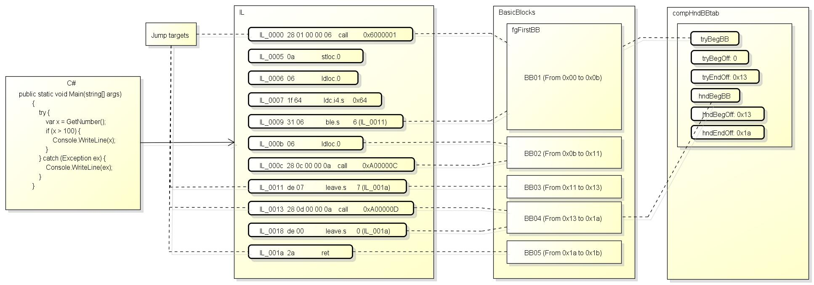

# JIT主函数

`compCompileHelper`把`BasicBlock`划分好以后, 就会调用3参数版的`Compiler::compCompile`, 这个函数就是JIT的主函数.

[Compiler::compCompile](https://github.com/dotnet/coreclr/blob/v1.1.0/src/jit/compiler.cpp#L4078)的源代码如下:

``` c++
//*********************************************************************************************
// #Phases
//
// This is the most interesting 'toplevel' function in the JIT.  It goes through the operations of
// importing, morphing, optimizations and code generation.  This is called from the EE through the
// code:CILJit::compileMethod function.
//
// For an overview of the structure of the JIT, see:
//   https://github.com/dotnet/coreclr/blob/master/Documentation/botr/ryujit-overview.md
//
void Compiler::compCompile(void** methodCodePtr, ULONG* methodCodeSize, CORJIT_FLAGS* compileFlags)
{
    if (compIsForInlining())
    {
        // Notify root instance that an inline attempt is about to import IL
        impInlineRoot()->m_inlineStrategy->NoteImport();
    }

    hashBv::Init(this);

    VarSetOps::AssignAllowUninitRhs(this, compCurLife, VarSetOps::UninitVal());

    /* The temp holding the secret stub argument is used by fgImport() when importing the intrinsic. */

    if (info.compPublishStubParam)
    {
        assert(lvaStubArgumentVar == BAD_VAR_NUM);
        lvaStubArgumentVar                  = lvaGrabTempWithImplicitUse(false DEBUGARG("stub argument"));
        lvaTable[lvaStubArgumentVar].lvType = TYP_I_IMPL;
    }

    EndPhase(PHASE_PRE_IMPORT);

    compFunctionTraceStart();

    /* Convert the instrs in each basic block to a tree based intermediate representation */

    fgImport();

    assert(!fgComputePredsDone);
    if (fgCheapPredsValid)
    {
        // Remove cheap predecessors before inlining; allowing the cheap predecessor lists to be inserted
        // with inlined blocks causes problems.
        fgRemovePreds();
    }

    if (compIsForInlining())
    {
        /* Quit inlining if fgImport() failed for any reason. */

        if (compDonotInline())
        {
            return;
        }

        /* Filter out unimported BBs */

        fgRemoveEmptyBlocks();

        return;
    }

    assert(!compDonotInline());

    EndPhase(PHASE_IMPORTATION);

    // Maybe the caller was not interested in generating code
    if (compIsForImportOnly())
    {
        compFunctionTraceEnd(nullptr, 0, false);
        return;
    }

#if !FEATURE_EH
    // If we aren't yet supporting EH in a compiler bring-up, remove as many EH handlers as possible, so
    // we can pass tests that contain try/catch EH, but don't actually throw any exceptions.
    fgRemoveEH();
#endif // !FEATURE_EH

    if (compileFlags->corJitFlags & CORJIT_FLG_BBINSTR)
    {
        fgInstrumentMethod();
    }

    // We could allow ESP frames. Just need to reserve space for
    // pushing EBP if the method becomes an EBP-frame after an edit.
    // Note that requiring a EBP Frame disallows double alignment.  Thus if we change this
    // we either have to disallow double alignment for E&C some other way or handle it in EETwain.

    if (opts.compDbgEnC)
    {
        codeGen->setFramePointerRequired(true);

        // Since we need a slots for security near ebp, its not possible
        // to do this after an Edit without shifting all the locals.
        // So we just always reserve space for these slots in case an Edit adds them
        opts.compNeedSecurityCheck = true;

        // We don't care about localloc right now. If we do support it,
        // EECodeManager::FixContextForEnC() needs to handle it smartly
        // in case the localloc was actually executed.
        //
        // compLocallocUsed            = true;
    }

    EndPhase(PHASE_POST_IMPORT);

    /* Initialize the BlockSet epoch */

    NewBasicBlockEpoch();

    /* Massage the trees so that we can generate code out of them */

    fgMorph();
    EndPhase(PHASE_MORPH);

    /* GS security checks for unsafe buffers */
    if (getNeedsGSSecurityCookie())
    {
#ifdef DEBUG
        if (verbose)
        {
            printf("\n*************** -GS checks for unsafe buffers \n");
        }
#endif

        gsGSChecksInitCookie();

        if (compGSReorderStackLayout)
        {
            gsCopyShadowParams();
        }

#ifdef DEBUG
        if (verbose)
        {
            fgDispBasicBlocks(true);
            printf("\n");
        }
#endif
    }
    EndPhase(PHASE_GS_COOKIE);

    /* Compute bbNum, bbRefs and bbPreds */

    JITDUMP("\nRenumbering the basic blocks for fgComputePred\n");
    fgRenumberBlocks();

    noway_assert(!fgComputePredsDone); // This is the first time full (not cheap) preds will be computed.
    fgComputePreds();
    EndPhase(PHASE_COMPUTE_PREDS);

    /* If we need to emit GC Poll calls, mark the blocks that need them now.  This is conservative and can
     * be optimized later. */
    fgMarkGCPollBlocks();
    EndPhase(PHASE_MARK_GC_POLL_BLOCKS);

    /* From this point on the flowgraph information such as bbNum,
     * bbRefs or bbPreds has to be kept updated */

    // Compute the edge weights (if we have profile data)
    fgComputeEdgeWeights();
    EndPhase(PHASE_COMPUTE_EDGE_WEIGHTS);

#if FEATURE_EH_FUNCLETS

    /* Create funclets from the EH handlers. */

    fgCreateFunclets();
    EndPhase(PHASE_CREATE_FUNCLETS);

#endif // FEATURE_EH_FUNCLETS

    if (!opts.MinOpts() && !opts.compDbgCode)
    {
        optOptimizeLayout();
        EndPhase(PHASE_OPTIMIZE_LAYOUT);

        // Compute reachability sets and dominators.
        fgComputeReachability();
    }

    // Transform each GT_ALLOCOBJ node into either an allocation helper call or
    // local variable allocation on the stack.
    ObjectAllocator objectAllocator(this);
    objectAllocator.Run();

    if (!opts.MinOpts() && !opts.compDbgCode)
    {
        /*  Perform loop inversion (i.e. transform "while" loops into
            "repeat" loops) and discover and classify natural loops
            (e.g. mark iterative loops as such). Also marks loop blocks
            and sets bbWeight to the loop nesting levels
        */

        optOptimizeLoops();
        EndPhase(PHASE_OPTIMIZE_LOOPS);

        // Clone loops with optimization opportunities, and
        // choose the one based on dynamic condition evaluation.
        optCloneLoops();
        EndPhase(PHASE_CLONE_LOOPS);

        /* Unroll loops */
        optUnrollLoops();
        EndPhase(PHASE_UNROLL_LOOPS);
    }

#ifdef DEBUG
    fgDebugCheckLinks();
#endif

    /* Create the variable table (and compute variable ref counts) */

    lvaMarkLocalVars();
    EndPhase(PHASE_MARK_LOCAL_VARS);

    // IMPORTANT, after this point, every place where trees are modified or cloned
    // the local variable reference counts must be updated
    // You can test the value of the following variable to see if
    // the local variable ref counts must be updated
    //
    assert(lvaLocalVarRefCounted == true);

    if (!opts.MinOpts() && !opts.compDbgCode)
    {
        /* Optimize boolean conditions */

        optOptimizeBools();
        EndPhase(PHASE_OPTIMIZE_BOOLS);

        // optOptimizeBools() might have changed the number of blocks; the dominators/reachability might be bad.
    }

    /* Figure out the order in which operators are to be evaluated */
    fgFindOperOrder();
    EndPhase(PHASE_FIND_OPER_ORDER);

    // Weave the tree lists. Anyone who modifies the tree shapes after
    // this point is responsible for calling fgSetStmtSeq() to keep the
    // nodes properly linked.
    // This can create GC poll calls, and create new BasicBlocks (without updating dominators/reachability).
    fgSetBlockOrder();
    EndPhase(PHASE_SET_BLOCK_ORDER);

    // IMPORTANT, after this point, every place where tree topology changes must redo evaluation
    // order (gtSetStmtInfo) and relink nodes (fgSetStmtSeq) if required.
    CLANG_FORMAT_COMMENT_ANCHOR;

#ifdef DEBUG
    // Now  we have determined the order of evaluation and the gtCosts for every node.
    // If verbose, dump the full set of trees here before the optimization phases mutate them
    //
    if (verbose)
    {
        fgDispBasicBlocks(true); // 'true' will call fgDumpTrees() after dumping the BasicBlocks
        printf("\n");
    }
#endif

    // At this point we know if we are fully interruptible or not
    if (!opts.MinOpts() && !opts.compDbgCode)
    {
        bool doSsa           = true;
        bool doEarlyProp     = true;
        bool doValueNum      = true;
        bool doLoopHoisting  = true;
        bool doCopyProp      = true;
        bool doAssertionProp = true;
        bool doRangeAnalysis = true;

#ifdef DEBUG
        doSsa           = (JitConfig.JitDoSsa() != 0);
        doEarlyProp     = doSsa && (JitConfig.JitDoEarlyProp() != 0);
        doValueNum      = doSsa && (JitConfig.JitDoValueNumber() != 0);
        doLoopHoisting  = doValueNum && (JitConfig.JitDoLoopHoisting() != 0);
        doCopyProp      = doValueNum && (JitConfig.JitDoCopyProp() != 0);
        doAssertionProp = doValueNum && (JitConfig.JitDoAssertionProp() != 0);
        doRangeAnalysis = doAssertionProp && (JitConfig.JitDoRangeAnalysis() != 0);
#endif

        if (doSsa)
        {
            fgSsaBuild();
            EndPhase(PHASE_BUILD_SSA);
        }

        if (doEarlyProp)
        {
            /* Propagate array length and rewrite getType() method call */
            optEarlyProp();
            EndPhase(PHASE_EARLY_PROP);
        }

        if (doValueNum)
        {
            fgValueNumber();
            EndPhase(PHASE_VALUE_NUMBER);
        }

        if (doLoopHoisting)
        {
            /* Hoist invariant code out of loops */
            optHoistLoopCode();
            EndPhase(PHASE_HOIST_LOOP_CODE);
        }

        if (doCopyProp)
        {
            /* Perform VN based copy propagation */
            optVnCopyProp();
            EndPhase(PHASE_VN_COPY_PROP);
        }

#if FEATURE_ANYCSE
        /* Remove common sub-expressions */
        optOptimizeCSEs();
#endif // FEATURE_ANYCSE

#if ASSERTION_PROP
        if (doAssertionProp)
        {
            /* Assertion propagation */
            optAssertionPropMain();
            EndPhase(PHASE_ASSERTION_PROP_MAIN);
        }

        if (doRangeAnalysis)
        {
            /* Optimize array index range checks */
            RangeCheck rc(this);
            rc.OptimizeRangeChecks();
            EndPhase(PHASE_OPTIMIZE_INDEX_CHECKS);
        }
#endif // ASSERTION_PROP

        /* update the flowgraph if we modified it during the optimization phase*/
        if (fgModified)
        {
            fgUpdateFlowGraph();
            EndPhase(PHASE_UPDATE_FLOW_GRAPH);

            // Recompute the edge weight if we have modified the flow graph
            fgComputeEdgeWeights();
            EndPhase(PHASE_COMPUTE_EDGE_WEIGHTS2);
        }
    }

#ifdef _TARGET_AMD64_
    //  Check if we need to add the Quirk for the PPP backward compat issue
    compQuirkForPPPflag = compQuirkForPPP();
#endif

    fgDetermineFirstColdBlock();
    EndPhase(PHASE_DETERMINE_FIRST_COLD_BLOCK);

#ifdef DEBUG
    fgDebugCheckLinks(compStressCompile(STRESS_REMORPH_TREES, 50));

    // Stash the current estimate of the function's size if necessary.
    if (verbose)
    {
        compSizeEstimate  = 0;
        compCycleEstimate = 0;
        for (BasicBlock* block = fgFirstBB; block != nullptr; block = block->bbNext)
        {
            for (GenTreeStmt* stmt = block->firstStmt(); stmt != nullptr; stmt = stmt->getNextStmt())
            {
                compSizeEstimate += stmt->GetCostSz();
                compCycleEstimate += stmt->GetCostEx();
            }
        }
    }
#endif

#ifndef LEGACY_BACKEND
    // rationalize trees
    Rationalizer rat(this); // PHASE_RATIONALIZE
    rat.Run();
#endif // !LEGACY_BACKEND

    // Here we do "simple lowering".  When the RyuJIT backend works for all
    // platforms, this will be part of the more general lowering phase.  For now, though, we do a separate
    // pass of "final lowering."  We must do this before (final) liveness analysis, because this creates
    // range check throw blocks, in which the liveness must be correct.
    fgSimpleLowering();
    EndPhase(PHASE_SIMPLE_LOWERING);

#ifdef LEGACY_BACKEND
    /* Local variable liveness */
    fgLocalVarLiveness();
    EndPhase(PHASE_LCLVARLIVENESS);
#endif // !LEGACY_BACKEND

#ifdef DEBUG
    fgDebugCheckBBlist();
    fgDebugCheckLinks();
#endif

    /* Enable this to gather statistical data such as
     * call and register argument info, flowgraph and loop info, etc. */

    compJitStats();

#ifdef _TARGET_ARM_
    if (compLocallocUsed)
    {
        // We reserve REG_SAVED_LOCALLOC_SP to store SP on entry for stack unwinding
        codeGen->regSet.rsMaskResvd |= RBM_SAVED_LOCALLOC_SP;
    }
#endif // _TARGET_ARM_
#ifdef _TARGET_ARMARCH_
    if (compRsvdRegCheck(PRE_REGALLOC_FRAME_LAYOUT))
    {
        // We reserve R10/IP1 in this case to hold the offsets in load/store instructions
        codeGen->regSet.rsMaskResvd |= RBM_OPT_RSVD;
        assert(REG_OPT_RSVD != REG_FP);
    }

#ifdef DEBUG
    //
    // Display the pre-regalloc frame offsets that we have tentatively decided upon
    //
    if (verbose)
        lvaTableDump();
#endif
#endif // _TARGET_ARMARCH_

    /* Assign registers to variables, etc. */
    CLANG_FORMAT_COMMENT_ANCHOR;

#ifndef LEGACY_BACKEND
    ///////////////////////////////////////////////////////////////////////////////
    // Dominator and reachability sets are no longer valid. They haven't been
    // maintained up to here, and shouldn't be used (unless recomputed).
    ///////////////////////////////////////////////////////////////////////////////
    fgDomsComputed = false;

    /* Create LSRA before Lowering, this way Lowering can initialize the TreeNode Map */
    m_pLinearScan = getLinearScanAllocator(this);

    /* Lower */
    Lowering lower(this, m_pLinearScan); // PHASE_LOWERING
    lower.Run();

    assert(lvaSortAgain == false); // We should have re-run fgLocalVarLiveness() in lower.Run()
    lvaTrackedFixed = true;        // We can not add any new tracked variables after this point.

    /* Now that lowering is completed we can proceed to perform register allocation */
    m_pLinearScan->doLinearScan();
    EndPhase(PHASE_LINEAR_SCAN);

    // Copied from rpPredictRegUse()
    genFullPtrRegMap = (codeGen->genInterruptible || !codeGen->isFramePointerUsed());
#else  // LEGACY_BACKEND

    lvaTrackedFixed = true; // We cannot add any new tracked variables after this point.
    // For the classic JIT32 at this point lvaSortAgain can be set and raAssignVars() will call lvaSortOnly()

    // Now do "classic" register allocation.
    raAssignVars();
    EndPhase(PHASE_RA_ASSIGN_VARS);
#endif // LEGACY_BACKEND

#ifdef DEBUG
    fgDebugCheckLinks();
#endif

    /* Generate code */

    codeGen->genGenerateCode(methodCodePtr, methodCodeSize);

#ifdef FEATURE_JIT_METHOD_PERF
    if (pCompJitTimer)
        pCompJitTimer->Terminate(this, CompTimeSummaryInfo::s_compTimeSummary);
#endif

    RecordStateAtEndOfCompilation();

#ifdef FEATURE_TRACELOGGING
    compJitTelemetry.NotifyEndOfCompilation();
#endif

#if defined(DEBUG)
    ++Compiler::jitTotalMethodCompiled;
#endif // defined(DEBUG)

    compFunctionTraceEnd(*methodCodePtr, *methodCodeSize, false);

#if FUNC_INFO_LOGGING
    if (compJitFuncInfoFile != nullptr)
    {
        assert(!compIsForInlining());
#ifdef DEBUG // We only have access to info.compFullName in DEBUG builds.
        fprintf(compJitFuncInfoFile, "%s\n", info.compFullName);
#elif FEATURE_SIMD
        fprintf(compJitFuncInfoFile, " %s\n", eeGetMethodFullName(info.compMethodHnd));
#endif
        fprintf(compJitFuncInfoFile, ""); // in our logic this causes a flush
    }
#endif // FUNC_INFO_LOGGING
}
```

JIT主函数中包含了对各个阶段的调用, 例如`EndPhase(PHASE_PRE_IMPORT)`表示这个阶段的结束.

这里的阶段比微软列出的阶段要多出来一些:

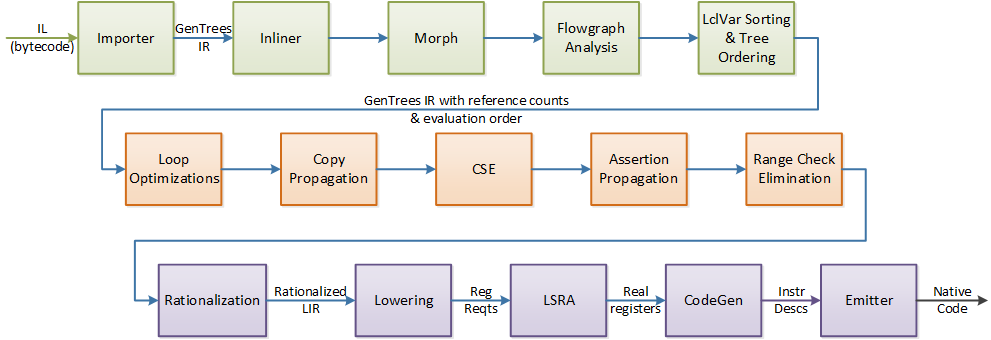

接下来我们逐个分析这些阶段.

# PHASE_PRE_IMPORT

这个阶段负责从IL导入HIR(GenTree)前的一些工作, 包含以下的代码:

``` c++
if (compIsForInlining())
{
    // Notify root instance that an inline attempt is about to import IL
    impInlineRoot()->m_inlineStrategy->NoteImport();
}

hashBv::Init(this);

VarSetOps::AssignAllowUninitRhs(this, compCurLife, VarSetOps::UninitVal());

/* The temp holding the secret stub argument is used by fgImport() when importing the intrinsic. */

if (info.compPublishStubParam)
{
    assert(lvaStubArgumentVar == BAD_VAR_NUM);
    lvaStubArgumentVar                  = lvaGrabTempWithImplicitUse(false DEBUGARG("stub argument"));
    lvaTable[lvaStubArgumentVar].lvType = TYP_I_IMPL;
}

EndPhase(PHASE_PRE_IMPORT);
```

执行了import前的一些初始化工作,
`hashBv::Init`为`Compiler`创建一个bitvector的分配器(allocator),
`VarSetOps::AssignAllowUninitRhs`设置`compCurLife`的值为未初始化(这个变量会用于保存当前活动的本地变量集合),
`compPublishStubParam`选项开启时会添加一个额外的本地变量(这个变量会保存函数进入时的rax值).

# PHASE_IMPORTATION

这个阶段负责从IL导入HIR(GenTree), 包含以下的代码:

``` c++
compFunctionTraceStart();

/* Convert the instrs in each basic block to a tree based intermediate representation */

fgImport();

assert(!fgComputePredsDone);
if (fgCheapPredsValid)
{
    // Remove cheap predecessors before inlining; allowing the cheap predecessor lists to be inserted
    // with inlined blocks causes problems.
    fgRemovePreds();
}

if (compIsForInlining())
{
    /* Quit inlining if fgImport() failed for any reason. */

    if (compDonotInline())
    {
        return;
    }

    /* Filter out unimported BBs */

    fgRemoveEmptyBlocks();

    return;
}

assert(!compDonotInline());

EndPhase(PHASE_IMPORTATION);
```

`compFunctionTraceStart`会打印一些除错信息.

`fgImport`会解析IL并添加`GenTree`节点, 因为此前已经创建了`BasicBlock`, 根据IL创建的`GenTree`会分别添加到对应的`BasicBlock`中.
`BasicBlock` + `GenTree`就是我们通常说的`IR`, `IR`有两种形式, 树形式的叫`HIR`(用于JIT前端), 列表形式的叫`LIR`(用于JIT后端), 这里构建的是`HIR`.

[fgImport](https://github.com/dotnet/coreclr/blob/v1.1.0/src/jit/flowgraph.cpp#L6663)的源代码如下:

``` c++
void Compiler::fgImport()
{
    fgHasPostfix = false;

    impImport(fgFirstBB);

    if (!(opts.eeFlags & CORJIT_FLG_SKIP_VERIFICATION))
    {
        CorInfoMethodRuntimeFlags verFlag;
        verFlag = tiIsVerifiableCode ? CORINFO_FLG_VERIFIABLE : CORINFO_FLG_UNVERIFIABLE;
        info.compCompHnd->setMethodAttribs(info.compMethodHnd, verFlag);
    }
}
```

对第一个`BasicBlock`调用了`impImport`.

[impImport](https://github.com/dotnet/coreclr/blob/v1.1.0/src/jit/importer.cpp#L16373)的源代码如下:

``` c++
/*****************************************************************************
 *
 *  Convert the instrs ("import") into our internal format (trees). The
 *  basic flowgraph has already been constructed and is passed in.
 */

void Compiler::impImport(BasicBlock* method)
{
#ifdef DEBUG
    if (verbose)
    {
        printf("*************** In impImport() for %s\n", info.compFullName);
    }
#endif

    /* Allocate the stack contents */

    if (info.compMaxStack <= sizeof(impSmallStack) / sizeof(impSmallStack[0]))
    {
        /* Use local variable, don't waste time allocating on the heap */

        impStkSize              = sizeof(impSmallStack) / sizeof(impSmallStack[0]);
        verCurrentState.esStack = impSmallStack;
    }
    else
    {
        impStkSize              = info.compMaxStack;
        verCurrentState.esStack = new (this, CMK_ImpStack) StackEntry[impStkSize];
    }

    // initialize the entry state at start of method
    verInitCurrentState();

    // Initialize stuff related to figuring "spill cliques" (see spec comment for impGetSpillTmpBase).
    Compiler* inlineRoot = impInlineRoot();
    if (this == inlineRoot) // These are only used on the root of the inlining tree.
    {
        // We have initialized these previously, but to size 0.  Make them larger.
        impPendingBlockMembers.Init(getAllocator(), fgBBNumMax * 2);
        impSpillCliquePredMembers.Init(getAllocator(), fgBBNumMax * 2);
        impSpillCliqueSuccMembers.Init(getAllocator(), fgBBNumMax * 2);
    }
    inlineRoot->impPendingBlockMembers.Reset(fgBBNumMax * 2);
    inlineRoot->impSpillCliquePredMembers.Reset(fgBBNumMax * 2);
    inlineRoot->impSpillCliqueSuccMembers.Reset(fgBBNumMax * 2);
    impBlockListNodeFreeList = nullptr;

#ifdef DEBUG
    impLastILoffsStmt   = nullptr;
    impNestedStackSpill = false;
#endif
    impBoxTemp = BAD_VAR_NUM;

    impPendingList = impPendingFree = nullptr;

    /* Add the entry-point to the worker-list */

    // Skip leading internal blocks. There can be one as a leading scratch BB, and more
    // from EH normalization.
    // NOTE: It might be possible to always just put fgFirstBB on the pending list, and let everything else just fall
    // out.
    for (; method->bbFlags & BBF_INTERNAL; method = method->bbNext)
    {
        // Treat these as imported.
        assert(method->bbJumpKind == BBJ_NONE); // We assume all the leading ones are fallthrough.
        JITDUMP("Marking leading BBF_INTERNAL block BB%02u as BBF_IMPORTED\n", method->bbNum);
        method->bbFlags |= BBF_IMPORTED;
    }

    impImportBlockPending(method);

    /* Import blocks in the worker-list until there are no more */

    while (impPendingList)
    {
        /* Remove the entry at the front of the list */

        PendingDsc* dsc = impPendingList;
        impPendingList  = impPendingList->pdNext;
        impSetPendingBlockMember(dsc->pdBB, 0);

        /* Restore the stack state */

        verCurrentState.thisInitialized = dsc->pdThisPtrInit;
        verCurrentState.esStackDepth    = dsc->pdSavedStack.ssDepth;
        if (verCurrentState.esStackDepth)
        {
            impRestoreStackState(&dsc->pdSavedStack);
        }

        /* Add the entry to the free list for reuse */

        dsc->pdNext    = impPendingFree;
        impPendingFree = dsc;

        /* Now import the block */

        if (dsc->pdBB->bbFlags & BBF_FAILED_VERIFICATION)
        {

#ifdef _TARGET_64BIT_
            // On AMD64, during verification we have to match JIT64 behavior since the VM is very tighly
            // coupled with the JIT64 IL Verification logic.  Look inside verHandleVerificationFailure
            // method for further explanation on why we raise this exception instead of making the jitted
            // code throw the verification exception during execution.
            if (tiVerificationNeeded && (opts.eeFlags & CORJIT_FLG_IMPORT_ONLY) != 0)
            {
                BADCODE("Basic block marked as not verifiable");
            }
            else
#endif // _TARGET_64BIT_
            {
                verConvertBBToThrowVerificationException(dsc->pdBB DEBUGARG(true));
                impEndTreeList(dsc->pdBB);
            }
        }
        else
        {
            impImportBlock(dsc->pdBB);

            if (compDonotInline())
            {
                return;
            }
            if (compIsForImportOnly() && !tiVerificationNeeded)
            {
                return;
            }
        }
    }

#ifdef DEBUG
    if (verbose && info.compXcptnsCount)
    {
        printf("\nAfter impImport() added block for try,catch,finally");
        fgDispBasicBlocks();
        printf("\n");
    }

    // Used in impImportBlockPending() for STRESS_CHK_REIMPORT
    for (BasicBlock* block = fgFirstBB; block; block = block->bbNext)
    {
        block->bbFlags &= ~BBF_VISITED;
    }
#endif

    assert(!compIsForInlining() || !tiVerificationNeeded);
}
```

首先初始化运行堆栈(execution stack)`verCurrentState.esStack`, maxstack小于16时使用SmallStack, 否则new.
然后初始化记录"Spill Cliques"(Spill Temps的群体, 用于保存从运行堆栈spill出来的值的临时变量)所需的成员.
之后标记内部添加的(BBF_INTERNAL)`BasicBlock`为已导入(BBF_IMPORTED), 因为这些block并无对应的IL范围.
接下来会添加第一个非内部的`BasicBlock`到队列`impPendingList`, 然后一直处理这个队列直到它为空.
处理队列中的`BasicBlock`会调用函数`impImportBlock(dsc->pdBB)`.

[impImportBlock](https://github.com/dotnet/coreclr/blob/v1.1.0/src/jit/importer.cpp#L15321)的源代码如下:

``` c++
//***************************************************************
// Import the instructions for the given basic block.  Perform
// verification, throwing an exception on failure.  Push any successor blocks that are enabled for the first
// time, or whose verification pre-state is changed.

#ifdef _PREFAST_
#pragma warning(push)
#pragma warning(disable : 21000) // Suppress PREFast warning about overly large function
#endif
void Compiler::impImportBlock(BasicBlock* block)
{
    // BBF_INTERNAL blocks only exist during importation due to EH canonicalization. We need to
    // handle them specially. In particular, there is no IL to import for them, but we do need
    // to mark them as imported and put their successors on the pending import list.
    if (block->bbFlags & BBF_INTERNAL)
    {
        JITDUMP("Marking BBF_INTERNAL block BB%02u as BBF_IMPORTED\n", block->bbNum);
        block->bbFlags |= BBF_IMPORTED;

        for (unsigned i = 0; i < block->NumSucc(); i++)
        {
            impImportBlockPending(block->GetSucc(i));
        }

        return;
    }

    bool markImport;

    assert(block);

    /* Make the block globaly available */

    compCurBB = block;

#ifdef DEBUG
    /* Initialize the debug variables */
    impCurOpcName = "unknown";
    impCurOpcOffs = block->bbCodeOffs;
#endif

    /* Set the current stack state to the merged result */
    verResetCurrentState(block, &verCurrentState);

    /* Now walk the code and import the IL into GenTrees */

    struct FilterVerificationExceptionsParam
    {
        Compiler*   pThis;
        BasicBlock* block;
    };
    FilterVerificationExceptionsParam param;

    param.pThis = this;
    param.block = block;

    PAL_TRY(FilterVerificationExceptionsParam*, pParam, &param)
    {
        /* @VERIFICATION : For now, the only state propagation from try
           to it's handler is "thisInit" state (stack is empty at start of try).
           In general, for state that we track in verification, we need to
           model the possibility that an exception might happen at any IL
           instruction, so we really need to merge all states that obtain
           between IL instructions in a try block into the start states of
           all handlers.

           However we do not allow the 'this' pointer to be uninitialized when
           entering most kinds try regions (only try/fault are allowed to have
           an uninitialized this pointer on entry to the try)

           Fortunately, the stack is thrown away when an exception
           leads to a handler, so we don't have to worry about that.
           We DO, however, have to worry about the "thisInit" state.
           But only for the try/fault case.

           The only allowed transition is from TIS_Uninit to TIS_Init.

           So for a try/fault region for the fault handler block
           we will merge the start state of the try begin
           and the post-state of each block that is part of this try region
        */

        // merge the start state of the try begin
        //
        if (pParam->block->bbFlags & BBF_TRY_BEG)
        {
            pParam->pThis->impVerifyEHBlock(pParam->block, true);
        }

        pParam->pThis->impImportBlockCode(pParam->block);

        // As discussed above:
        // merge the post-state of each block that is part of this try region
        //
        if (pParam->block->hasTryIndex())
        {
            pParam->pThis->impVerifyEHBlock(pParam->block, false);
        }
    }
    PAL_EXCEPT_FILTER(FilterVerificationExceptions)
    {
        verHandleVerificationFailure(block DEBUGARG(false));
    }
    PAL_ENDTRY

    if (compDonotInline())
    {
        return;
    }

    assert(!compDonotInline());

    markImport = false;

SPILLSTACK:

    unsigned    baseTmp             = NO_BASE_TMP; // input temps assigned to successor blocks
    bool        reimportSpillClique = false;
    BasicBlock* tgtBlock            = nullptr;

    /* If the stack is non-empty, we might have to spill its contents */

    if (verCurrentState.esStackDepth != 0)
    {
        impBoxTemp = BAD_VAR_NUM; // if a box temp is used in a block that leaves something
                                  // on the stack, its lifetime is hard to determine, simply
                                  // don't reuse such temps.

        GenTreePtr addStmt = nullptr;

        /* Do the successors of 'block' have any other predecessors ?
           We do not want to do some of the optimizations related to multiRef
           if we can reimport blocks */

        unsigned multRef = impCanReimport ? unsigned(~0) : 0;

        switch (block->bbJumpKind)
        {
            case BBJ_COND:

                /* Temporarily remove the 'jtrue' from the end of the tree list */

                assert(impTreeLast);
                assert(impTreeLast->gtOper == GT_STMT);
                assert(impTreeLast->gtStmt.gtStmtExpr->gtOper == GT_JTRUE);

                addStmt     = impTreeLast;
                impTreeLast = impTreeLast->gtPrev;

                /* Note if the next block has more than one ancestor */

                multRef |= block->bbNext->bbRefs;

                /* Does the next block have temps assigned? */

                baseTmp  = block->bbNext->bbStkTempsIn;
                tgtBlock = block->bbNext;

                if (baseTmp != NO_BASE_TMP)
                {
                    break;
                }

                /* Try the target of the jump then */

                multRef |= block->bbJumpDest->bbRefs;
                baseTmp  = block->bbJumpDest->bbStkTempsIn;
                tgtBlock = block->bbJumpDest;
                break;

            case BBJ_ALWAYS:
                multRef |= block->bbJumpDest->bbRefs;
                baseTmp  = block->bbJumpDest->bbStkTempsIn;
                tgtBlock = block->bbJumpDest;
                break;

            case BBJ_NONE:
                multRef |= block->bbNext->bbRefs;
                baseTmp  = block->bbNext->bbStkTempsIn;
                tgtBlock = block->bbNext;
                break;

            case BBJ_SWITCH:

                BasicBlock** jmpTab;
                unsigned     jmpCnt;

                /* Temporarily remove the GT_SWITCH from the end of the tree list */

                assert(impTreeLast);
                assert(impTreeLast->gtOper == GT_STMT);
                assert(impTreeLast->gtStmt.gtStmtExpr->gtOper == GT_SWITCH);

                addStmt     = impTreeLast;
                impTreeLast = impTreeLast->gtPrev;

                jmpCnt = block->bbJumpSwt->bbsCount;
                jmpTab = block->bbJumpSwt->bbsDstTab;

                do
                {
                    tgtBlock = (*jmpTab);

                    multRef |= tgtBlock->bbRefs;

                    // Thanks to spill cliques, we should have assigned all or none
                    assert((baseTmp == NO_BASE_TMP) || (baseTmp == tgtBlock->bbStkTempsIn));
                    baseTmp = tgtBlock->bbStkTempsIn;
                    if (multRef > 1)
                    {
                        break;
                    }
                } while (++jmpTab, --jmpCnt);

                break;

            case BBJ_CALLFINALLY:
            case BBJ_EHCATCHRET:
            case BBJ_RETURN:
            case BBJ_EHFINALLYRET:
            case BBJ_EHFILTERRET:
            case BBJ_THROW:
                NO_WAY("can't have 'unreached' end of BB with non-empty stack");
                break;

            default:
                noway_assert(!"Unexpected bbJumpKind");
                break;
        }

        assert(multRef >= 1);

        /* Do we have a base temp number? */

        bool newTemps = (baseTmp == NO_BASE_TMP);

        if (newTemps)
        {
            /* Grab enough temps for the whole stack */
            baseTmp = impGetSpillTmpBase(block);
        }

        /* Spill all stack entries into temps */
        unsigned level, tempNum;

        JITDUMP("\nSpilling stack entries into temps\n");
        for (level = 0, tempNum = baseTmp; level < verCurrentState.esStackDepth; level++, tempNum++)
        {
            GenTreePtr tree = verCurrentState.esStack[level].val;

            /* VC generates code where it pushes a byref from one branch, and an int (ldc.i4 0) from
               the other. This should merge to a byref in unverifiable code.
               However, if the branch which leaves the TYP_I_IMPL on the stack is imported first, the
               successor would be imported assuming there was a TYP_I_IMPL on
               the stack. Thus the value would not get GC-tracked. Hence,
               change the temp to TYP_BYREF and reimport the successors.
               Note: We should only allow this in unverifiable code.
            */
            if (tree->gtType == TYP_BYREF && lvaTable[tempNum].lvType == TYP_I_IMPL && !verNeedsVerification())
            {
                lvaTable[tempNum].lvType = TYP_BYREF;
                impReimportMarkSuccessors(block);
                markImport = true;
            }

#ifdef _TARGET_64BIT_
            if (genActualType(tree->gtType) == TYP_I_IMPL && lvaTable[tempNum].lvType == TYP_INT)
            {
                if (tiVerificationNeeded && tgtBlock->bbEntryState != nullptr &&
                    (tgtBlock->bbFlags & BBF_FAILED_VERIFICATION) == 0)
                {
                    // Merge the current state into the entry state of block;
                    // the call to verMergeEntryStates must have changed
                    // the entry state of the block by merging the int local var
                    // and the native-int stack entry.
                    bool changed = false;
                    if (verMergeEntryStates(tgtBlock, &changed))
                    {
                        impRetypeEntryStateTemps(tgtBlock);
                        impReimportBlockPending(tgtBlock);
                        assert(changed);
                    }
                    else
                    {
                        tgtBlock->bbFlags |= BBF_FAILED_VERIFICATION;
                        break;
                    }
                }

                // Some other block in the spill clique set this to "int", but now we have "native int".
                // Change the type and go back to re-import any blocks that used the wrong type.
                lvaTable[tempNum].lvType = TYP_I_IMPL;
                reimportSpillClique      = true;
            }
            else if (genActualType(tree->gtType) == TYP_INT && lvaTable[tempNum].lvType == TYP_I_IMPL)
            {
                // Spill clique has decided this should be "native int", but this block only pushes an "int".
                // Insert a sign-extension to "native int" so we match the clique.
                verCurrentState.esStack[level].val = gtNewCastNode(TYP_I_IMPL, tree, TYP_I_IMPL);
            }

            // Consider the case where one branch left a 'byref' on the stack and the other leaves
            // an 'int'. On 32-bit, this is allowed (in non-verifiable code) since they are the same
            // size. JIT64 managed to make this work on 64-bit. For compatibility, we support JIT64
            // behavior instead of asserting and then generating bad code (where we save/restore the
            // low 32 bits of a byref pointer to an 'int' sized local). If the 'int' side has been
            // imported already, we need to change the type of the local and reimport the spill clique.
            // If the 'byref' side has imported, we insert a cast from int to 'native int' to match
            // the 'byref' size.
            if (!tiVerificationNeeded)
            {
                if (genActualType(tree->gtType) == TYP_BYREF && lvaTable[tempNum].lvType == TYP_INT)
                {
                    // Some other block in the spill clique set this to "int", but now we have "byref".
                    // Change the type and go back to re-import any blocks that used the wrong type.
                    lvaTable[tempNum].lvType = TYP_BYREF;
                    reimportSpillClique      = true;
                }
                else if (genActualType(tree->gtType) == TYP_INT && lvaTable[tempNum].lvType == TYP_BYREF)
                {
                    // Spill clique has decided this should be "byref", but this block only pushes an "int".
                    // Insert a sign-extension to "native int" so we match the clique size.
                    verCurrentState.esStack[level].val = gtNewCastNode(TYP_I_IMPL, tree, TYP_I_IMPL);
                }
            }
#endif // _TARGET_64BIT_

#if FEATURE_X87_DOUBLES
            // X87 stack doesn't differentiate between float/double
            // so promoting is no big deal.
            // For everybody else keep it as float until we have a collision and then promote
            // Just like for x64's TYP_INT<->TYP_I_IMPL

            if (multRef > 1 && tree->gtType == TYP_FLOAT)
            {
                verCurrentState.esStack[level].val = gtNewCastNode(TYP_DOUBLE, tree, TYP_DOUBLE);
            }

#else // !FEATURE_X87_DOUBLES

            if (tree->gtType == TYP_DOUBLE && lvaTable[tempNum].lvType == TYP_FLOAT)
            {
                // Some other block in the spill clique set this to "float", but now we have "double".
                // Change the type and go back to re-import any blocks that used the wrong type.
                lvaTable[tempNum].lvType = TYP_DOUBLE;
                reimportSpillClique      = true;
            }
            else if (tree->gtType == TYP_FLOAT && lvaTable[tempNum].lvType == TYP_DOUBLE)
            {
                // Spill clique has decided this should be "double", but this block only pushes a "float".
                // Insert a cast to "double" so we match the clique.
                verCurrentState.esStack[level].val = gtNewCastNode(TYP_DOUBLE, tree, TYP_DOUBLE);
            }

#endif // FEATURE_X87_DOUBLES

            /* If addStmt has a reference to tempNum (can only happen if we
               are spilling to the temps already used by a previous block),
               we need to spill addStmt */

            if (addStmt && !newTemps && gtHasRef(addStmt->gtStmt.gtStmtExpr, tempNum, false))
            {
                GenTreePtr addTree = addStmt->gtStmt.gtStmtExpr;

                if (addTree->gtOper == GT_JTRUE)
                {
                    GenTreePtr relOp = addTree->gtOp.gtOp1;
                    assert(relOp->OperIsCompare());

                    var_types type = genActualType(relOp->gtOp.gtOp1->TypeGet());

                    if (gtHasRef(relOp->gtOp.gtOp1, tempNum, false))
                    {
                        unsigned temp = lvaGrabTemp(true DEBUGARG("spill addStmt JTRUE ref Op1"));
                        impAssignTempGen(temp, relOp->gtOp.gtOp1, level);
                        type              = genActualType(lvaTable[temp].TypeGet());
                        relOp->gtOp.gtOp1 = gtNewLclvNode(temp, type);
                    }

                    if (gtHasRef(relOp->gtOp.gtOp2, tempNum, false))
                    {
                        unsigned temp = lvaGrabTemp(true DEBUGARG("spill addStmt JTRUE ref Op2"));
                        impAssignTempGen(temp, relOp->gtOp.gtOp2, level);
                        type              = genActualType(lvaTable[temp].TypeGet());
                        relOp->gtOp.gtOp2 = gtNewLclvNode(temp, type);
                    }
                }
                else
                {
                    assert(addTree->gtOper == GT_SWITCH && genActualType(addTree->gtOp.gtOp1->gtType) == TYP_I_IMPL);

                    unsigned temp = lvaGrabTemp(true DEBUGARG("spill addStmt SWITCH"));
                    impAssignTempGen(temp, addTree->gtOp.gtOp1, level);
                    addTree->gtOp.gtOp1 = gtNewLclvNode(temp, TYP_I_IMPL);
                }
            }

            /* Spill the stack entry, and replace with the temp */

            if (!impSpillStackEntry(level, tempNum
#ifdef DEBUG
                                    ,
                                    true, "Spill Stack Entry"
#endif
                                    ))
            {
                if (markImport)
                {
                    BADCODE("bad stack state");
                }

                // Oops. Something went wrong when spilling. Bad code.
                verHandleVerificationFailure(block DEBUGARG(true));

                goto SPILLSTACK;
            }
        }

        /* Put back the 'jtrue'/'switch' if we removed it earlier */

        if (addStmt)
        {
            impAppendStmt(addStmt, (unsigned)CHECK_SPILL_NONE);
        }
    }

    // Some of the append/spill logic works on compCurBB

    assert(compCurBB == block);

    /* Save the tree list in the block */
    impEndTreeList(block);

    // impEndTreeList sets BBF_IMPORTED on the block
    // We do *NOT* want to set it later than this because
    // impReimportSpillClique might clear it if this block is both a
    // predecessor and successor in the current spill clique
    assert(block->bbFlags & BBF_IMPORTED);

    // If we had a int/native int, or float/double collision, we need to re-import
    if (reimportSpillClique)
    {
        // This will re-import all the successors of block (as well as each of their predecessors)
        impReimportSpillClique(block);

        // For blocks that haven't been imported yet, we still need to mark them as pending import.
        for (unsigned i = 0; i < block->NumSucc(); i++)
        {
            BasicBlock* succ = block->GetSucc(i);
            if ((succ->bbFlags & BBF_IMPORTED) == 0)
            {
                impImportBlockPending(succ);
            }
        }
    }
    else // the normal case
    {
        // otherwise just import the successors of block

        /* Does this block jump to any other blocks? */
        for (unsigned i = 0; i < block->NumSucc(); i++)
        {
            impImportBlockPending(block->GetSucc(i));
        }
    }
}
#ifdef _PREFAST_
#pragma warning(pop)
#endif
```

这个函数首先会调用`impImportBlockCode`, `impImportBlockCode`负责根据IL生成`GenTree`的主要处理.
导入block后, 如果运行堆栈不为空(跳转后的指令需要跳转前push进去的参数), 需要把运行堆栈中的值spill到临时变量.
block结束后spill的临时变量的索引开始值会保存在`bbStkTempsOut`, block开始时需要读取的临时变量的索引开始值保存在`bbStkTempsIn`.
因为运行堆栈中的值基本上不会跨越`BasicBlock`(从C#编译出来的IL), 就不详细分析这里的逻辑了.
接下来看`impImportBlockCode`.

[impImportBlockCode](https://github.com/dotnet/coreclr/blob/v1.1.0/src/jit/importer.cpp#L9207)的源代码如下:
这个函数有5000多行, 这里我只截取一部分.

``` c++
#ifdef _PREFAST_
#pragma warning(push)
#pragma warning(disable : 21000) // Suppress PREFast warning about overly large function
#endif
/*****************************************************************************
 *  Import the instr for the given basic block
 */
void Compiler::impImportBlockCode(BasicBlock* block)
{
#define _impResolveToken(kind) impResolveToken(codeAddr, &resolvedToken, kind)

#ifdef DEBUG

    if (verbose)
    {
        printf("\nImporting BB%02u (PC=%03u) of '%s'", block->bbNum, block->bbCodeOffs, info.compFullName);
    }
#endif

    unsigned  nxtStmtIndex = impInitBlockLineInfo();
    IL_OFFSET nxtStmtOffs;

    GenTreePtr                   arrayNodeFrom, arrayNodeTo, arrayNodeToIndex;
    bool                         expandInline;
    CorInfoHelpFunc              helper;
    CorInfoIsAccessAllowedResult accessAllowedResult;
    CORINFO_HELPER_DESC          calloutHelper;
    const BYTE*                  lastLoadToken = nullptr;

    // reject cyclic constraints
    if (tiVerificationNeeded)
    {
        Verify(!info.hasCircularClassConstraints, "Method parent has circular class type parameter constraints.");
        Verify(!info.hasCircularMethodConstraints, "Method has circular method type parameter constraints.");
    }

    /* Get the tree list started */

    impBeginTreeList();

    /* Walk the opcodes that comprise the basic block */

    const BYTE* codeAddr = info.compCode + block->bbCodeOffs;
    const BYTE* codeEndp = info.compCode + block->bbCodeOffsEnd;

    IL_OFFSET opcodeOffs    = block->bbCodeOffs;
    IL_OFFSET lastSpillOffs = opcodeOffs;

    signed jmpDist;

    /* remember the start of the delegate creation sequence (used for verification) */
    const BYTE* delegateCreateStart = nullptr;

    int  prefixFlags = 0;
    bool explicitTailCall, constraintCall, readonlyCall;

    bool     insertLdloc = false; // set by CEE_DUP and cleared by following store
    typeInfo tiRetVal;

    unsigned numArgs = info.compArgsCount;

    /* Now process all the opcodes in the block */

    var_types callTyp    = TYP_COUNT;
    OPCODE    prevOpcode = CEE_ILLEGAL;

    if (block->bbCatchTyp)
    {
        if (info.compStmtOffsetsImplicit & ICorDebugInfo::CALL_SITE_BOUNDARIES)
        {
            impCurStmtOffsSet(block->bbCodeOffs);
        }

        // We will spill the GT_CATCH_ARG and the input of the BB_QMARK block
        // to a temp. This is a trade off for code simplicity
        impSpillSpecialSideEff();
    }

    while (codeAddr < codeEndp)
    {
        bool                   usingReadyToRunHelper = false;
        CORINFO_RESOLVED_TOKEN resolvedToken;
        CORINFO_RESOLVED_TOKEN constrainedResolvedToken;
        CORINFO_CALL_INFO      callInfo;
        CORINFO_FIELD_INFO     fieldInfo;

        tiRetVal = typeInfo(); // Default type info

        //---------------------------------------------------------------------

        /* We need to restrict the max tree depth as many of the Compiler
           functions are recursive. We do this by spilling the stack */

        if (verCurrentState.esStackDepth)
        {
            /* Has it been a while since we last saw a non-empty stack (which
               guarantees that the tree depth isnt accumulating. */

            if ((opcodeOffs - lastSpillOffs) > 200)
            {
                impSpillStackEnsure();
                lastSpillOffs = opcodeOffs;
            }
        }
        else
        {
            lastSpillOffs   = opcodeOffs;
            impBoxTempInUse = false; // nothing on the stack, box temp OK to use again
        }

        /* Compute the current instr offset */

        opcodeOffs = (IL_OFFSET)(codeAddr - info.compCode);

#if defined(DEBUGGING_SUPPORT) || defined(DEBUG)

#ifndef DEBUG
        if (opts.compDbgInfo)
#endif
        {
            if (!compIsForInlining())
            {
                nxtStmtOffs =
                    (nxtStmtIndex < info.compStmtOffsetsCount) ? info.compStmtOffsets[nxtStmtIndex] : BAD_IL_OFFSET;

                /* Have we reached the next stmt boundary ? */

                if (nxtStmtOffs != BAD_IL_OFFSET && opcodeOffs >= nxtStmtOffs)
                {
                    assert(nxtStmtOffs == info.compStmtOffsets[nxtStmtIndex]);

                    if (verCurrentState.esStackDepth != 0 && opts.compDbgCode)
                    {
                        /* We need to provide accurate IP-mapping at this point.
                           So spill anything on the stack so that it will form
                           gtStmts with the correct stmt offset noted */

                        impSpillStackEnsure(true);
                    }

                    // Has impCurStmtOffs been reported in any tree?

                    if (impCurStmtOffs != BAD_IL_OFFSET && opts.compDbgCode)
                    {
                        GenTreePtr placeHolder = new (this, GT_NO_OP) GenTree(GT_NO_OP, TYP_VOID);
                        impAppendTree(placeHolder, (unsigned)CHECK_SPILL_NONE, impCurStmtOffs);

                        assert(impCurStmtOffs == BAD_IL_OFFSET);
                    }

                    if (impCurStmtOffs == BAD_IL_OFFSET)
                    {
                        /* Make sure that nxtStmtIndex is in sync with opcodeOffs.
                           If opcodeOffs has gone past nxtStmtIndex, catch up */

                        while ((nxtStmtIndex + 1) < info.compStmtOffsetsCount &&
                               info.compStmtOffsets[nxtStmtIndex + 1] <= opcodeOffs)
                        {
                            nxtStmtIndex++;
                        }

                        /* Go to the new stmt */

                        impCurStmtOffsSet(info.compStmtOffsets[nxtStmtIndex]);

                        /* Update the stmt boundary index */

                        nxtStmtIndex++;
                        assert(nxtStmtIndex <= info.compStmtOffsetsCount);

                        /* Are there any more line# entries after this one? */

                        if (nxtStmtIndex < info.compStmtOffsetsCount)
                        {
                            /* Remember where the next line# starts */

                            nxtStmtOffs = info.compStmtOffsets[nxtStmtIndex];
                        }
                        else
                        {
                            /* No more line# entries */

                            nxtStmtOffs = BAD_IL_OFFSET;
                        }
                    }
                }
                else if ((info.compStmtOffsetsImplicit & ICorDebugInfo::STACK_EMPTY_BOUNDARIES) &&
                         (verCurrentState.esStackDepth == 0))
                {
                    /* At stack-empty locations, we have already added the tree to
                       the stmt list with the last offset. We just need to update
                       impCurStmtOffs
                     */

                    impCurStmtOffsSet(opcodeOffs);
                }
                else if ((info.compStmtOffsetsImplicit & ICorDebugInfo::CALL_SITE_BOUNDARIES) &&
                         impOpcodeIsCallSiteBoundary(prevOpcode))
                {
                    /* Make sure we have a type cached */
                    assert(callTyp != TYP_COUNT);

                    if (callTyp == TYP_VOID)
                    {
                        impCurStmtOffsSet(opcodeOffs);
                    }
                    else if (opts.compDbgCode)
                    {
                        impSpillStackEnsure(true);
                        impCurStmtOffsSet(opcodeOffs);
                    }
                }
                else if ((info.compStmtOffsetsImplicit & ICorDebugInfo::NOP_BOUNDARIES) && (prevOpcode == CEE_NOP))
                {
                    if (opts.compDbgCode)
                    {
                        impSpillStackEnsure(true);
                    }

                    impCurStmtOffsSet(opcodeOffs);
                }

                assert(impCurStmtOffs == BAD_IL_OFFSET || nxtStmtOffs == BAD_IL_OFFSET ||
                       jitGetILoffs(impCurStmtOffs) <= nxtStmtOffs);
            }
        }

#endif // defined(DEBUGGING_SUPPORT) || defined(DEBUG)

        CORINFO_CLASS_HANDLE clsHnd       = DUMMY_INIT(NULL);
        CORINFO_CLASS_HANDLE ldelemClsHnd = DUMMY_INIT(NULL);
        CORINFO_CLASS_HANDLE stelemClsHnd = DUMMY_INIT(NULL);

        var_types       lclTyp, ovflType = TYP_UNKNOWN;
        GenTreePtr      op1           = DUMMY_INIT(NULL);
        GenTreePtr      op2           = DUMMY_INIT(NULL);
        GenTreeArgList* args          = nullptr; // What good do these "DUMMY_INIT"s do?
        GenTreePtr      newObjThisPtr = DUMMY_INIT(NULL);
        bool            uns           = DUMMY_INIT(false);

        /* Get the next opcode and the size of its parameters */

        OPCODE opcode = (OPCODE)getU1LittleEndian(codeAddr);
        codeAddr += sizeof(__int8);

#ifdef DEBUG
        impCurOpcOffs = (IL_OFFSET)(codeAddr - info.compCode - 1);
        JITDUMP("\n    [%2u] %3u (0x%03x) ", verCurrentState.esStackDepth, impCurOpcOffs, impCurOpcOffs);
#endif

    DECODE_OPCODE:

        // Return if any previous code has caused inline to fail.
        if (compDonotInline())
        {
            return;
        }

        /* Get the size of additional parameters */

        signed int sz = opcodeSizes[opcode];

#ifdef DEBUG
        clsHnd  = NO_CLASS_HANDLE;
        lclTyp  = TYP_COUNT;
        callTyp = TYP_COUNT;

        impCurOpcOffs = (IL_OFFSET)(codeAddr - info.compCode - 1);
        impCurOpcName = opcodeNames[opcode];

        if (verbose && (opcode != CEE_PREFIX1))
        {
            printf("%s", impCurOpcName);
        }

        /* Use assertImp() to display the opcode */

        op1 = op2 = nullptr;
#endif

        /* See what kind of an opcode we have, then */

        unsigned mflags   = 0;
        unsigned clsFlags = 0;

        switch (opcode)
        {
            unsigned  lclNum;
            var_types type;

            GenTreePtr op3;
            genTreeOps oper;
            unsigned   size;

            int val;

            CORINFO_SIG_INFO     sig;
            unsigned             flags;
            IL_OFFSET            jmpAddr;
            bool                 ovfl, unordered, callNode;
            bool                 ldstruct;
            CORINFO_CLASS_HANDLE tokenType;

            union {
                int     intVal;
                float   fltVal;
                __int64 lngVal;
                double  dblVal;
            } cval;

            case CEE_PREFIX1:
                opcode = (OPCODE)(getU1LittleEndian(codeAddr) + 256);
                codeAddr += sizeof(__int8);
                opcodeOffs = (IL_OFFSET)(codeAddr - info.compCode);
                goto DECODE_OPCODE;

            SPILL_APPEND:

                /* Append 'op1' to the list of statements */
                impAppendTree(op1, (unsigned)CHECK_SPILL_ALL, impCurStmtOffs);
                goto DONE_APPEND;

            APPEND:

                /* Append 'op1' to the list of statements */

                impAppendTree(op1, (unsigned)CHECK_SPILL_NONE, impCurStmtOffs);
                goto DONE_APPEND;

            DONE_APPEND:

#ifdef DEBUG
                // Remember at which BC offset the tree was finished
                impNoteLastILoffs();
#endif
                break;

            case CEE_LDNULL:
                impPushNullObjRefOnStack();
                break;

            case CEE_LDC_I4_M1:
            case CEE_LDC_I4_0:
            case CEE_LDC_I4_1:
            case CEE_LDC_I4_2:
            case CEE_LDC_I4_3:
            case CEE_LDC_I4_4:
            case CEE_LDC_I4_5:
            case CEE_LDC_I4_6:
            case CEE_LDC_I4_7:
            case CEE_LDC_I4_8:
                cval.intVal = (opcode - CEE_LDC_I4_0);
                assert(-1 <= cval.intVal && cval.intVal <= 8);
                goto PUSH_I4CON;

            case CEE_LDC_I4_S:
                cval.intVal = getI1LittleEndian(codeAddr);
                goto PUSH_I4CON;
            case CEE_LDC_I4:
                cval.intVal = getI4LittleEndian(codeAddr);
                goto PUSH_I4CON;
            PUSH_I4CON:
                JITDUMP(" %d", cval.intVal);
                impPushOnStack(gtNewIconNode(cval.intVal), typeInfo(TI_INT));
                break;

            case CEE_LDC_I8:
                cval.lngVal = getI8LittleEndian(codeAddr);
                JITDUMP(" 0x%016llx", cval.lngVal);
                impPushOnStack(gtNewLconNode(cval.lngVal), typeInfo(TI_LONG));
                break;

            case CEE_LDC_R8:
                cval.dblVal = getR8LittleEndian(codeAddr);
                JITDUMP(" %#.17g", cval.dblVal);
                impPushOnStack(gtNewDconNode(cval.dblVal), typeInfo(TI_DOUBLE));
                break;

            case CEE_LDC_R4:
                cval.dblVal = getR4LittleEndian(codeAddr);
                JITDUMP(" %#.17g", cval.dblVal);
                {
                    GenTreePtr cnsOp = gtNewDconNode(cval.dblVal);
#if !FEATURE_X87_DOUBLES
                    // X87 stack doesn't differentiate between float/double
                    // so R4 is treated as R8, but everybody else does
                    cnsOp->gtType = TYP_FLOAT;
#endif // FEATURE_X87_DOUBLES
                    impPushOnStack(cnsOp, typeInfo(TI_DOUBLE));
                }
                break;

            case CEE_LDSTR:

                if (compIsForInlining())
                {
                    if (impInlineInfo->inlineCandidateInfo->dwRestrictions & INLINE_NO_CALLEE_LDSTR)
                    {
                        compInlineResult->NoteFatal(InlineObservation::CALLSITE_HAS_LDSTR_RESTRICTION);
                        return;
                    }
                }

                val = getU4LittleEndian(codeAddr);
                JITDUMP(" %08X", val);
                if (tiVerificationNeeded)
                {
                    Verify(info.compCompHnd->isValidStringRef(info.compScopeHnd, val), "bad string");
                    tiRetVal = typeInfo(TI_REF, impGetStringClass());
                }
                impPushOnStack(gtNewSconNode(val, info.compScopeHnd), tiRetVal);

                break;

            case CEE_LDARG:
                lclNum = getU2LittleEndian(codeAddr);
                JITDUMP(" %u", lclNum);
                impLoadArg(lclNum, opcodeOffs + sz + 1);
                break;

            case CEE_LDARG_S:
                lclNum = getU1LittleEndian(codeAddr);
                JITDUMP(" %u", lclNum);
                impLoadArg(lclNum, opcodeOffs + sz + 1);
                break;

            case CEE_LDARG_0:
            case CEE_LDARG_1:
            case CEE_LDARG_2:
            case CEE_LDARG_3:
                lclNum = (opcode - CEE_LDARG_0);
                assert(lclNum >= 0 && lclNum < 4);
                impLoadArg(lclNum, opcodeOffs + sz + 1);
                break;

            case CEE_LDLOC:
                lclNum = getU2LittleEndian(codeAddr);
                JITDUMP(" %u", lclNum);
                impLoadLoc(lclNum, opcodeOffs + sz + 1);
                break;

            case CEE_LDLOC_S:
                lclNum = getU1LittleEndian(codeAddr);
                JITDUMP(" %u", lclNum);
                impLoadLoc(lclNum, opcodeOffs + sz + 1);
                break;

            case CEE_LDLOC_0:
            case CEE_LDLOC_1:
            case CEE_LDLOC_2:
            case CEE_LDLOC_3:
                lclNum = (opcode - CEE_LDLOC_0);
                assert(lclNum >= 0 && lclNum < 4);
                impLoadLoc(lclNum, opcodeOffs + sz + 1);
                break;

            case CEE_STARG:
                lclNum = getU2LittleEndian(codeAddr);
                goto STARG;

            case CEE_STARG_S:
                lclNum = getU1LittleEndian(codeAddr);
            STARG:
                JITDUMP(" %u", lclNum);

                if (tiVerificationNeeded)
                {
                    Verify(lclNum < info.compILargsCount, "bad arg num");
                }

                if (compIsForInlining())
                {
                    op1 = impInlineFetchArg(lclNum, impInlineInfo->inlArgInfo, impInlineInfo->lclVarInfo);
                    noway_assert(op1->gtOper == GT_LCL_VAR);
                    lclNum = op1->AsLclVar()->gtLclNum;

                    goto VAR_ST_VALID;
                }

                lclNum = compMapILargNum(lclNum); // account for possible hidden param
                assertImp(lclNum < numArgs);

                if (lclNum == info.compThisArg)
                {
                    lclNum = lvaArg0Var;
                }
                lvaTable[lclNum].lvArgWrite = 1;

                if (tiVerificationNeeded)
                {
                    typeInfo& tiLclVar = lvaTable[lclNum].lvVerTypeInfo;
                    Verify(tiCompatibleWith(impStackTop().seTypeInfo, NormaliseForStack(tiLclVar), true),
                           "type mismatch");

                    if (verTrackObjCtorInitState && (verCurrentState.thisInitialized != TIS_Init))
                    {
                        Verify(!tiLclVar.IsThisPtr(), "storing to uninit this ptr");
                    }
                }

                goto VAR_ST;

            case CEE_STLOC:
                lclNum = getU2LittleEndian(codeAddr);
                JITDUMP(" %u", lclNum);
                goto LOC_ST;

            case CEE_STLOC_S:
                lclNum = getU1LittleEndian(codeAddr);
                JITDUMP(" %u", lclNum);
                goto LOC_ST;

            case CEE_STLOC_0:
            case CEE_STLOC_1:
            case CEE_STLOC_2:
            case CEE_STLOC_3:
                lclNum = (opcode - CEE_STLOC_0);
                assert(lclNum >= 0 && lclNum < 4);

            LOC_ST:
                if (tiVerificationNeeded)
                {
                    Verify(lclNum < info.compMethodInfo->locals.numArgs, "bad local num");
                    Verify(tiCompatibleWith(impStackTop().seTypeInfo,
                                            NormaliseForStack(lvaTable[lclNum + numArgs].lvVerTypeInfo), true),
                           "type mismatch");
                }

                if (compIsForInlining())
                {
                    lclTyp = impInlineInfo->lclVarInfo[lclNum + impInlineInfo->argCnt].lclTypeInfo;

                    /* Have we allocated a temp for this local? */

                    lclNum = impInlineFetchLocal(lclNum DEBUGARG("Inline stloc first use temp"));

                    goto _PopValue;
                }

                lclNum += numArgs;

            VAR_ST:

                if (lclNum >= info.compLocalsCount && lclNum != lvaArg0Var)
                {
                    assert(!tiVerificationNeeded); // We should have thrown the VerificationException before.
                    BADCODE("Bad IL");
                }

            VAR_ST_VALID:

                /* if it is a struct assignment, make certain we don't overflow the buffer */
                assert(lclTyp != TYP_STRUCT || lvaLclSize(lclNum) >= info.compCompHnd->getClassSize(clsHnd));

                if (lvaTable[lclNum].lvNormalizeOnLoad())
                {
                    lclTyp = lvaGetRealType(lclNum);
                }
                else
                {
                    lclTyp = lvaGetActualType(lclNum);
                }

            _PopValue:
                /* Pop the value being assigned */

                {
                    StackEntry se = impPopStack(clsHnd);
                    op1           = se.val;
                    tiRetVal      = se.seTypeInfo;
                }

#ifdef FEATURE_SIMD
                if (varTypeIsSIMD(lclTyp) && (lclTyp != op1->TypeGet()))
                {
                    assert(op1->TypeGet() == TYP_STRUCT);
                    op1->gtType = lclTyp;
                }
#endif // FEATURE_SIMD

                op1 = impImplicitIorI4Cast(op1, lclTyp);

#ifdef _TARGET_64BIT_
                // Downcast the TYP_I_IMPL into a 32-bit Int for x86 JIT compatiblity
                if (varTypeIsI(op1->TypeGet()) && (genActualType(lclTyp) == TYP_INT))
                {
                    assert(!tiVerificationNeeded); // We should have thrown the VerificationException before.
                    op1 = gtNewCastNode(TYP_INT, op1, TYP_INT);
                }
#endif // _TARGET_64BIT_

                // We had better assign it a value of the correct type
                assertImp(
                    genActualType(lclTyp) == genActualType(op1->gtType) ||
                    genActualType(lclTyp) == TYP_I_IMPL && op1->IsVarAddr() ||
                    (genActualType(lclTyp) == TYP_I_IMPL && (op1->gtType == TYP_BYREF || op1->gtType == TYP_REF)) ||
                    (genActualType(op1->gtType) == TYP_I_IMPL && lclTyp == TYP_BYREF) ||
                    (varTypeIsFloating(lclTyp) && varTypeIsFloating(op1->TypeGet())) ||
                    ((genActualType(lclTyp) == TYP_BYREF) && genActualType(op1->TypeGet()) == TYP_REF));

                /* If op1 is "&var" then its type is the transient "*" and it can
                   be used either as TYP_BYREF or TYP_I_IMPL */

                if (op1->IsVarAddr())
                {
                    assertImp(genActualType(lclTyp) == TYP_I_IMPL || lclTyp == TYP_BYREF);

                    /* When "&var" is created, we assume it is a byref. If it is
                       being assigned to a TYP_I_IMPL var, change the type to
                       prevent unnecessary GC info */

                    if (genActualType(lclTyp) == TYP_I_IMPL)
                    {
                        op1->gtType = TYP_I_IMPL;
                    }
                }

                /* Filter out simple assignments to itself */

                if (op1->gtOper == GT_LCL_VAR && lclNum == op1->gtLclVarCommon.gtLclNum)
                {
                    if (insertLdloc)
                    {
                        // This is a sequence of (ldloc, dup, stloc).  Can simplify
                        // to (ldloc, stloc).  Goto LDVAR to reconstruct the ldloc node.
                        CLANG_FORMAT_COMMENT_ANCHOR;

#ifdef DEBUG
                        if (tiVerificationNeeded)
                        {
                            assert(
                                typeInfo::AreEquivalent(tiRetVal, NormaliseForStack(lvaTable[lclNum].lvVerTypeInfo)));
                        }
#endif

                        op1         = nullptr;
                        insertLdloc = false;

                        impLoadVar(lclNum, opcodeOffs + sz + 1);
                        break;
                    }
                    else if (opts.compDbgCode)
                    {
                        op1 = gtNewNothingNode();
                        goto SPILL_APPEND;
                    }
                    else
                    {
                        break;
                    }
                }

                /* Create the assignment node */

                op2 = gtNewLclvNode(lclNum, lclTyp, opcodeOffs + sz + 1);

                /* If the local is aliased, we need to spill calls and
                   indirections from the stack. */

                if ((lvaTable[lclNum].lvAddrExposed || lvaTable[lclNum].lvHasLdAddrOp) &&
                    verCurrentState.esStackDepth > 0)
                {
                    impSpillSideEffects(false, (unsigned)CHECK_SPILL_ALL DEBUGARG("Local could be aliased"));
                }

                /* Spill any refs to the local from the stack */

                impSpillLclRefs(lclNum);

#if !FEATURE_X87_DOUBLES
                // We can generate an assignment to a TYP_FLOAT from a TYP_DOUBLE
                // We insert a cast to the dest 'op2' type
                //
                if ((op1->TypeGet() != op2->TypeGet()) && varTypeIsFloating(op1->gtType) &&
                    varTypeIsFloating(op2->gtType))
                {
                    op1 = gtNewCastNode(op2->TypeGet(), op1, op2->TypeGet());
                }
#endif // !FEATURE_X87_DOUBLES

                if (varTypeIsStruct(lclTyp))
                {
                    op1 = impAssignStruct(op2, op1, clsHnd, (unsigned)CHECK_SPILL_ALL);
                }
                else
                {
                    // The code generator generates GC tracking information
                    // based on the RHS of the assignment.  Later the LHS (which is
                    // is a BYREF) gets used and the emitter checks that that variable
                    // is being tracked.  It is not (since the RHS was an int and did
                    // not need tracking).  To keep this assert happy, we change the RHS
                    if (lclTyp == TYP_BYREF && !varTypeIsGC(op1->gtType))
                    {
                        op1->gtType = TYP_BYREF;
                    }
                    op1 = gtNewAssignNode(op2, op1);
                }

                /* If insertLdloc is true, then we need to insert a ldloc following the
                   stloc.  This is done when converting a (dup, stloc) sequence into
                   a (stloc, ldloc) sequence. */

                if (insertLdloc)
                {
                    // From SPILL_APPEND
                    impAppendTree(op1, (unsigned)CHECK_SPILL_ALL, impCurStmtOffs);

#ifdef DEBUG
                    // From DONE_APPEND
                    impNoteLastILoffs();
#endif
                    op1         = nullptr;
                    insertLdloc = false;

                    impLoadVar(lclNum, opcodeOffs + sz + 1, tiRetVal);
                    break;
                }

                goto SPILL_APPEND;

            // 省略了一堆case...

            case CEE_NOP:
                if (opts.compDbgCode)
                {
                    op1 = new (this, GT_NO_OP) GenTree(GT_NO_OP, TYP_VOID);
                    goto SPILL_APPEND;
                }
                break;

            /******************************** NYI *******************************/

            case 0xCC:
                OutputDebugStringA("CLR: Invalid x86 breakpoint in IL stream\n");

            case CEE_ILLEGAL:
            case CEE_MACRO_END:

            default:
                BADCODE3("unknown opcode", ": %02X", (int)opcode);
        }

        codeAddr += sz;
        prevOpcode = opcode;

        prefixFlags = 0;
        assert(!insertLdloc || opcode == CEE_DUP);
    }

    assert(!insertLdloc);

    return;
#undef _impResolveToken
}
#ifdef _PREFAST_
#pragma warning(pop)
#endif
```

首先`codeAddr`和`codeEndp`是block对应的IL的开始和结束地址, `opcode`是当前地址对应的byte,
以`ldloc.0`为例, 这个指令的二进制是`06`, `06`是opcode CEE_LDLOC_0,
以`ldc.i4.s 100`为例, 这个指令的二进制是`1f 64`, `1f`是opcode CEE_LDC_I4_S, `64`是参数也就是100的16进制.
这个函数会用一个循环来解析属于当前block的IL范围内的IL指令, 因为IL指令有很多, 我只能挑几个典型的来解释.

IL指令`ldc.i4.s`会向运行堆栈推入一个常量int, 常量的范围在1 byte以内, 解析的代码如下:

``` c++
case CEE_LDC_I4_S:
    cval.intVal = getI1LittleEndian(codeAddr);
    goto PUSH_I4CON;
case CEE_LDC_I4:
    cval.intVal = getI4LittleEndian(codeAddr);
    goto PUSH_I4CON;
PUSH_I4CON:
    JITDUMP(" %d", cval.intVal);
    impPushOnStack(gtNewIconNode(cval.intVal), typeInfo(TI_INT));
    break;
```

我们可以看到它会读取指令后的1 byte(无s的指令会读取4 byte), 然后调用`impPushOnStack(gtNewIconNode(cval.intVal), typeInfo(TI_INT))`.
`gtNewIconNode`函数(Icon是int constant的缩写)会创建一个`GT_CNS_INT`类型的`GenTree`, 表示int常量的节点.
创建节点后会把这个节点推到`运行堆栈`里, [impPushOnStack](https://github.com/dotnet/coreclr/blob/v1.1.0/src/jit/importer.cpp#L82)的源代码如下:

``` c++
/*****************************************************************************
 *
 *  Pushes the given tree on the stack.
 */

void Compiler::impPushOnStack(GenTreePtr tree, typeInfo ti)
{
    /* Check for overflow. If inlining, we may be using a bigger stack */

    if ((verCurrentState.esStackDepth >= info.compMaxStack) &&
        (verCurrentState.esStackDepth >= impStkSize || ((compCurBB->bbFlags & BBF_IMPORTED) == 0)))
    {
        BADCODE("stack overflow");
    }

#ifdef DEBUG
    // If we are pushing a struct, make certain we know the precise type!
    if (tree->TypeGet() == TYP_STRUCT)
    {
        assert(ti.IsType(TI_STRUCT));
        CORINFO_CLASS_HANDLE clsHnd = ti.GetClassHandle();
        assert(clsHnd != NO_CLASS_HANDLE);
    }

    if (tiVerificationNeeded && !ti.IsDead())
    {
        assert(typeInfo::AreEquivalent(NormaliseForStack(ti), ti)); // types are normalized

        // The ti type is consistent with the tree type.
        //

        // On 64-bit systems, nodes whose "proper" type is "native int" get labeled TYP_LONG.
        // In the verification type system, we always transform "native int" to "TI_INT".
        // Ideally, we would keep track of which nodes labeled "TYP_LONG" are really "native int", but
        // attempts to do that have proved too difficult.  Instead, we'll assume that in checks like this,
        // when there's a mismatch, it's because of this reason -- the typeInfo::AreEquivalentModuloNativeInt
        // method used in the last disjunct allows exactly this mismatch.
        assert(ti.IsDead() || ti.IsByRef() && (tree->TypeGet() == TYP_I_IMPL || tree->TypeGet() == TYP_BYREF) ||
               ti.IsUnboxedGenericTypeVar() && tree->TypeGet() == TYP_REF ||
               ti.IsObjRef() && tree->TypeGet() == TYP_REF || ti.IsMethod() && tree->TypeGet() == TYP_I_IMPL ||
               ti.IsType(TI_STRUCT) && tree->TypeGet() != TYP_REF ||
               typeInfo::AreEquivalentModuloNativeInt(NormaliseForStack(ti),
                                                      NormaliseForStack(typeInfo(tree->TypeGet()))));

        // If it is a struct type, make certain we normalized the primitive types
        assert(!ti.IsType(TI_STRUCT) ||
               info.compCompHnd->getTypeForPrimitiveValueClass(ti.GetClassHandle()) == CORINFO_TYPE_UNDEF);
    }

#if VERBOSE_VERIFY
    if (VERBOSE && tiVerificationNeeded)
    {
        printf("\n");
        printf(TI_DUMP_PADDING);
        printf("About to push to stack: ");
        ti.Dump();
    }
#endif // VERBOSE_VERIFY

#endif // DEBUG

    verCurrentState.esStack[verCurrentState.esStackDepth].seTypeInfo = ti;
    verCurrentState.esStack[verCurrentState.esStackDepth++].val      = tree;

    if ((tree->gtType == TYP_LONG) && (compLongUsed == false))
    {
        compLongUsed = true;
    }
    else if (((tree->gtType == TYP_FLOAT) || (tree->gtType == TYP_DOUBLE)) && (compFloatingPointUsed == false))
    {
        compFloatingPointUsed = true;
    }
}
```

`impPushOnStack`会把`GenTree`节点添加到运行堆栈`verCurrentState.esStack`, 包含类型信息和刚才建立的`GT_CNS_INT`节点.

假设`ldc.i4.s 100`后面的指令是`stloc.0`, 表示给本地变量0赋值100, 那么后面的`stloc.0`指令需要使用前面的值,
我们来看看`CEE_STLOC_0`是怎么处理的:

``` c++
case CEE_STLOC_0:
case CEE_STLOC_1:
case CEE_STLOC_2:
case CEE_STLOC_3:
    lclNum = (opcode - CEE_STLOC_0);
    assert(lclNum >= 0 && lclNum < 4);

LOC_ST:
    if (tiVerificationNeeded)
    {
        Verify(lclNum < info.compMethodInfo->locals.numArgs, "bad local num");
        Verify(tiCompatibleWith(impStackTop().seTypeInfo,
                                NormaliseForStack(lvaTable[lclNum + numArgs].lvVerTypeInfo), true),
               "type mismatch");
    }

    if (compIsForInlining())
    {
        lclTyp = impInlineInfo->lclVarInfo[lclNum + impInlineInfo->argCnt].lclTypeInfo;

        /* Have we allocated a temp for this local? */

        lclNum = impInlineFetchLocal(lclNum DEBUGARG("Inline stloc first use temp"));

        goto _PopValue;
    }

    lclNum += numArgs;

VAR_ST:

    if (lclNum >= info.compLocalsCount && lclNum != lvaArg0Var)
    {
        assert(!tiVerificationNeeded); // We should have thrown the VerificationException before.
        BADCODE("Bad IL");
    }

VAR_ST_VALID:

    /* if it is a struct assignment, make certain we don't overflow the buffer */
    assert(lclTyp != TYP_STRUCT || lvaLclSize(lclNum) >= info.compCompHnd->getClassSize(clsHnd));

    if (lvaTable[lclNum].lvNormalizeOnLoad())
    {
        lclTyp = lvaGetRealType(lclNum);
    }
    else
    {
        lclTyp = lvaGetActualType(lclNum);
    }

_PopValue:
    /* Pop the value being assigned */

    {
        StackEntry se = impPopStack(clsHnd);
        op1           = se.val;
        tiRetVal      = se.seTypeInfo;
    }

#ifdef FEATURE_SIMD
    if (varTypeIsSIMD(lclTyp) && (lclTyp != op1->TypeGet()))
    {
        assert(op1->TypeGet() == TYP_STRUCT);
        op1->gtType = lclTyp;
    }
#endif // FEATURE_SIMD

    op1 = impImplicitIorI4Cast(op1, lclTyp);

#ifdef _TARGET_64BIT_
    // Downcast the TYP_I_IMPL into a 32-bit Int for x86 JIT compatiblity
    if (varTypeIsI(op1->TypeGet()) && (genActualType(lclTyp) == TYP_INT))
    {
        assert(!tiVerificationNeeded); // We should have thrown the VerificationException before.
        op1 = gtNewCastNode(TYP_INT, op1, TYP_INT);
    }
#endif // _TARGET_64BIT_

    // We had better assign it a value of the correct type
    assertImp(
        genActualType(lclTyp) == genActualType(op1->gtType) ||
        genActualType(lclTyp) == TYP_I_IMPL && op1->IsVarAddr() ||
        (genActualType(lclTyp) == TYP_I_IMPL && (op1->gtType == TYP_BYREF || op1->gtType == TYP_REF)) ||
        (genActualType(op1->gtType) == TYP_I_IMPL && lclTyp == TYP_BYREF) ||
        (varTypeIsFloating(lclTyp) && varTypeIsFloating(op1->TypeGet())) ||
        ((genActualType(lclTyp) == TYP_BYREF) && genActualType(op1->TypeGet()) == TYP_REF));

    /* If op1 is "&var" then its type is the transient "*" and it can
       be used either as TYP_BYREF or TYP_I_IMPL */

    if (op1->IsVarAddr())
    {
        assertImp(genActualType(lclTyp) == TYP_I_IMPL || lclTyp == TYP_BYREF);

        /* When "&var" is created, we assume it is a byref. If it is
           being assigned to a TYP_I_IMPL var, change the type to
           prevent unnecessary GC info */

        if (genActualType(lclTyp) == TYP_I_IMPL)
        {
            op1->gtType = TYP_I_IMPL;
        }
    }

    /* Filter out simple assignments to itself */

    if (op1->gtOper == GT_LCL_VAR && lclNum == op1->gtLclVarCommon.gtLclNum)
    {
        if (insertLdloc)
        {
            // This is a sequence of (ldloc, dup, stloc).  Can simplify
            // to (ldloc, stloc).  Goto LDVAR to reconstruct the ldloc node.
            CLANG_FORMAT_COMMENT_ANCHOR;

#ifdef DEBUG
            if (tiVerificationNeeded)
            {
                assert(
                    typeInfo::AreEquivalent(tiRetVal, NormaliseForStack(lvaTable[lclNum].lvVerTypeInfo)));
            }
#endif

            op1         = nullptr;
            insertLdloc = false;

            impLoadVar(lclNum, opcodeOffs + sz + 1);
            break;
        }
        else if (opts.compDbgCode)
        {
            op1 = gtNewNothingNode();
            goto SPILL_APPEND;
        }
        else
        {
            break;
        }
    }

    /* Create the assignment node */

    op2 = gtNewLclvNode(lclNum, lclTyp, opcodeOffs + sz + 1);

    /* If the local is aliased, we need to spill calls and
       indirections from the stack. */

    if ((lvaTable[lclNum].lvAddrExposed || lvaTable[lclNum].lvHasLdAddrOp) &&
        verCurrentState.esStackDepth > 0)
    {
        impSpillSideEffects(false, (unsigned)CHECK_SPILL_ALL DEBUGARG("Local could be aliased"));
    }

    /* Spill any refs to the local from the stack */

    impSpillLclRefs(lclNum);

#if !FEATURE_X87_DOUBLES
    // We can generate an assignment to a TYP_FLOAT from a TYP_DOUBLE
    // We insert a cast to the dest 'op2' type
    //
    if ((op1->TypeGet() != op2->TypeGet()) && varTypeIsFloating(op1->gtType) &&
        varTypeIsFloating(op2->gtType))
    {
        op1 = gtNewCastNode(op2->TypeGet(), op1, op2->TypeGet());
    }
#endif // !FEATURE_X87_DOUBLES

    if (varTypeIsStruct(lclTyp))
    {
        op1 = impAssignStruct(op2, op1, clsHnd, (unsigned)CHECK_SPILL_ALL);
    }
    else
    {
        // The code generator generates GC tracking information
        // based on the RHS of the assignment.  Later the LHS (which is
        // is a BYREF) gets used and the emitter checks that that variable
        // is being tracked.  It is not (since the RHS was an int and did
        // not need tracking).  To keep this assert happy, we change the RHS
        if (lclTyp == TYP_BYREF && !varTypeIsGC(op1->gtType))
        {
            op1->gtType = TYP_BYREF;
        }
        op1 = gtNewAssignNode(op2, op1);
    }

    /* If insertLdloc is true, then we need to insert a ldloc following the
       stloc.  This is done when converting a (dup, stloc) sequence into
       a (stloc, ldloc) sequence. */

    if (insertLdloc)
    {
        // From SPILL_APPEND
        impAppendTree(op1, (unsigned)CHECK_SPILL_ALL, impCurStmtOffs);

#ifdef DEBUG
        // From DONE_APPEND
        impNoteLastILoffs();
#endif
        op1         = nullptr;
        insertLdloc = false;

        impLoadVar(lclNum, opcodeOffs + sz + 1, tiRetVal);
        break;
    }

    goto SPILL_APPEND;

SPILL_APPEND:

    /* Append 'op1' to the list of statements */
    impAppendTree(op1, (unsigned)CHECK_SPILL_ALL, impCurStmtOffs);
    goto DONE_APPEND;

DONE_APPEND:

#ifdef DEBUG
    // Remember at which BC offset the tree was finished
    impNoteLastILoffs();
#endif
    break;
```

处理`CEE_STLOC_0`的代码有点长, 请耐心看:
首先0~3的指令会共用处理, `stloc.0`是`0a`, `stloc.1`是`0b`, `stloc.2`是`0c`, `stloc.3`是`0d`.
得到保存的本地变量序号后还要知道它在本地变量表`lvaTable`中的索引值是多少, 因为本地变量表开头存的是参数, 所以这里的索引值是`lclNum += numArgs`.
然后创建赋值(GT_ASG)的节点, 赋值的节点有两个参数, 第一个是`lclVar 0`, 第二个是`const 100`(类型一致所以不需要cast), 如下:

``` text
   /--*  const     int    100
\--*  =         int
   \--*  lclVar    int    V01
```

现在我们创建了一颗`GenTree`树, 这个树是一个单独的语句, 我们可以把这个语句添加到`BasicBlock`中,
添加到`BasicBlock`使用的代码是`impAppendTree(op1, (unsigned)CHECK_SPILL_ALL, impCurStmtOffs)`:

``` c++
/*****************************************************************************
 *
 *  Append the given expression tree to the current block's tree list.
 *  Return the newly created statement.
 */

GenTreePtr Compiler::impAppendTree(GenTreePtr tree, unsigned chkLevel, IL_OFFSETX offset)
{
    assert(tree);

    /* Allocate an 'expression statement' node */

    GenTreePtr expr = gtNewStmt(tree, offset);

    /* Append the statement to the current block's stmt list */

    impAppendStmt(expr, chkLevel);

    return expr;
}

/*****************************************************************************
 *
 *  Append the given GT_STMT node to the current block's tree list.
 *  [0..chkLevel) is the portion of the stack which we will check for
 *    interference with stmt and spill if needed.
 */

inline void Compiler::impAppendStmt(GenTreePtr stmt, unsigned chkLevel)
{
    assert(stmt->gtOper == GT_STMT);
    noway_assert(impTreeLast != nullptr);

    /* If the statement being appended has any side-effects, check the stack
       to see if anything needs to be spilled to preserve correct ordering. */

    GenTreePtr expr  = stmt->gtStmt.gtStmtExpr;
    unsigned   flags = expr->gtFlags & GTF_GLOB_EFFECT;

    // Assignment to (unaliased) locals don't count as a side-effect as
    // we handle them specially using impSpillLclRefs(). Temp locals should
    // be fine too.
    // TODO-1stClassStructs: The check below should apply equally to struct assignments,
    // but previously the block ops were always being marked GTF_GLOB_REF, even if
    // the operands could not be global refs.

    if ((expr->gtOper == GT_ASG) && (expr->gtOp.gtOp1->gtOper == GT_LCL_VAR) &&
        !(expr->gtOp.gtOp1->gtFlags & GTF_GLOB_REF) && !gtHasLocalsWithAddrOp(expr->gtOp.gtOp2) &&
        !varTypeIsStruct(expr->gtOp.gtOp1))
    {
        unsigned op2Flags = expr->gtOp.gtOp2->gtFlags & GTF_GLOB_EFFECT;
        assert(flags == (op2Flags | GTF_ASG));
        flags = op2Flags;
    }

    if (chkLevel == (unsigned)CHECK_SPILL_ALL)
    {
        chkLevel = verCurrentState.esStackDepth;
    }

    if (chkLevel && chkLevel != (unsigned)CHECK_SPILL_NONE)
    {
        assert(chkLevel <= verCurrentState.esStackDepth);

        if (flags)
        {
            // If there is a call, we have to spill global refs
            bool spillGlobEffects = (flags & GTF_CALL) ? true : false;

            if (expr->gtOper == GT_ASG)
            {
                GenTree* lhs = expr->gtGetOp1();
                // If we are assigning to a global ref, we have to spill global refs on stack.
                // TODO-1stClassStructs: Previously, spillGlobEffects was set to true for
                // GT_INITBLK and GT_COPYBLK, but this is overly conservative, and should be
                // revisited. (Note that it was NOT set to true for GT_COPYOBJ.)
                if (!expr->OperIsBlkOp())
                {
                    // If we are assigning to a global ref, we have to spill global refs on stack
                    if ((lhs->gtFlags & GTF_GLOB_REF) != 0)
                    {
                        spillGlobEffects = true;
                    }
                }
                else if ((lhs->OperIsBlk() && !lhs->AsBlk()->HasGCPtr()) ||
                         ((lhs->OperGet() == GT_LCL_VAR) &&
                          (lvaTable[lhs->AsLclVarCommon()->gtLclNum].lvStructGcCount == 0)))
                {
                    spillGlobEffects = true;
                }
            }

            impSpillSideEffects(spillGlobEffects, chkLevel DEBUGARG("impAppendStmt"));
        }
        else
        {
            impSpillSpecialSideEff();
        }
    }

    impAppendStmtCheck(stmt, chkLevel);

    /* Point 'prev' at the previous node, so that we can walk backwards */

    stmt->gtPrev = impTreeLast;

    /* Append the expression statement to the list */

    impTreeLast->gtNext = stmt;
    impTreeLast         = stmt;

#ifdef FEATURE_SIMD
    impMarkContiguousSIMDFieldAssignments(stmt);
#endif

#ifdef DEBUGGING_SUPPORT

    /* Once we set impCurStmtOffs in an appended tree, we are ready to
       report the following offsets. So reset impCurStmtOffs */

    if (impTreeLast->gtStmt.gtStmtILoffsx == impCurStmtOffs)
    {
        impCurStmtOffsSet(BAD_IL_OFFSET);
    }

#endif

#ifdef DEBUG
    if (impLastILoffsStmt == nullptr)
    {
        impLastILoffsStmt = stmt;
    }

    if (verbose)
    {
        printf("\n\n");
        gtDispTree(stmt);
    }
#endif
}
```

这段代码会添加一个`GT_STMT`节点到当前的`impTreeLast`链表中, 这个链表后面会在`impEndTreeList`分配给`block->bbTreeList`.
`GT_STMT`节点的内容如下:

``` text
*  stmtExpr  void
|  /--*  const     int    100
\--*  =         int
   \--*  lclVar    int    V01
```

可以看到是把原来的分配节点`GT_ASG`放到了`GT_STMT`的下面.
微软提供了一张`Compiler`, `BasicBlock`, `GenTree`的结构图(HIR版):

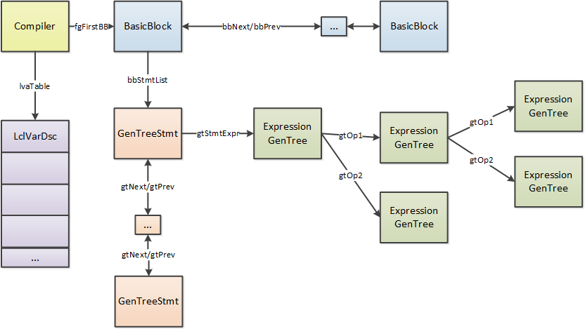

这里给出了最简单的两个指令`ldc.i4.s`和`stloc.0`的解析例子, 有兴趣可以自己分析更多类型的指令.
现在我们可以知道`运行堆栈`在JIT中用于关联各个指令, 让它们构建成一棵`GenTree`树, 实际生成的代码将不会有运行堆栈这个概念.

在处理完当前block后, 会添加block的后继block`successors`到队列`impPendingList`中:

``` c++
for (unsigned i = 0; i < block->NumSucc(); i++)
{
    impImportBlockPending(block->GetSucc(i));
}
```

处理完所有block后, 每个BasicBlock中就有了语句(GT_STMT)的链表, 每条语句下面都会有一个`GenTree`树.

`fgImport`的例子如下:

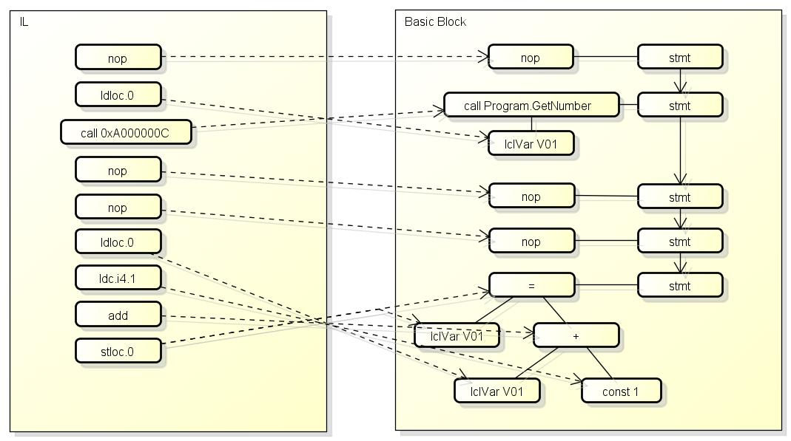

# PHASE_POST_IMPORT

这个阶段负责从IL导入HIR(GenTree)后的一些工作, 包含以下的代码:

``` c++
// Maybe the caller was not interested in generating code
if (compIsForImportOnly())
{
    compFunctionTraceEnd(nullptr, 0, false);
    return;
}

#if !FEATURE_EH
// If we aren't yet supporting EH in a compiler bring-up, remove as many EH handlers as possible, so
// we can pass tests that contain try/catch EH, but don't actually throw any exceptions.
fgRemoveEH();
#endif // !FEATURE_EH

if (compileFlags->corJitFlags & CORJIT_FLG_BBINSTR)
{
    fgInstrumentMethod();
}

// We could allow ESP frames. Just need to reserve space for
// pushing EBP if the method becomes an EBP-frame after an edit.
// Note that requiring a EBP Frame disallows double alignment.  Thus if we change this
// we either have to disallow double alignment for E&C some other way or handle it in EETwain.

if (opts.compDbgEnC)
{
    codeGen->setFramePointerRequired(true);

    // Since we need a slots for security near ebp, its not possible
    // to do this after an Edit without shifting all the locals.
    // So we just always reserve space for these slots in case an Edit adds them
    opts.compNeedSecurityCheck = true;

    // We don't care about localloc right now. If we do support it,
    // EECodeManager::FixContextForEnC() needs to handle it smartly
    // in case the localloc was actually executed.
    //
    // compLocallocUsed            = true;
}

EndPhase(PHASE_POST_IMPORT);
```

这个阶段负责`import`之后的一些零碎的处理.
如果只需要检查函数的IL是否合法, 那么编译时会带`CORJIT_FLG_IMPORT_ONLY`, 在经过import阶段后就不需要再继续了.
`fgInstrumentMethod`用于插入profiler需要的语句, 这里不详细分析.
`opts.compDbgEnC`启用时代表编译IL程序集时用的是`Debug`配置, 这里会标记需要使用`frame pointer`和需要安全检查.
(x64允许函数不使用rbp寄存器保存进入函数前堆栈地址, 这样可以多出一个空余的寄存器以生成更高效的代码, 但是会让debug更困难)

# PHASE_MORPH

因为import阶段只是简单的把IL转换成HIR, 转换出来的HIR还需要进行加工.
这个阶段负责了HIR的加工, 包含以下的代码:

``` c++
/* Initialize the BlockSet epoch */

NewBasicBlockEpoch();

/* Massage the trees so that we can generate code out of them */

fgMorph();
EndPhase(PHASE_MORPH);
```

`NewBasicBlockEpoch`更新了当前BasicBlock集合的epoch(fgCurBBEpoch), 这个值用于标识当前BasicBlock集合的版本.

[fgMorph](https://github.com/dotnet/coreclr/blob/v1.1.0/src/jit/morph.cpp#L16715)包含了这个阶段主要的处理, 源代码如下:

``` c++
/*****************************************************************************
 *
 *  Transform all basic blocks for codegen.
 */

void Compiler::fgMorph()
{
    noway_assert(!compIsForInlining()); // Inlinee's compiler should never reach here.

    fgOutgoingArgTemps = nullptr;

#ifdef DEBUG
    if (verbose)
    {
        printf("*************** In fgMorph()\n");
    }
    if (verboseTrees)
    {
        fgDispBasicBlocks(true);
    }
#endif // DEBUG

    // Insert call to class constructor as the first basic block if
    // we were asked to do so.
    if (info.compCompHnd->initClass(nullptr /* field */, info.compMethodHnd /* method */,
                                    impTokenLookupContextHandle /* context */) &
        CORINFO_INITCLASS_USE_HELPER)
    {
        fgEnsureFirstBBisScratch();
        fgInsertStmtAtBeg(fgFirstBB, fgInitThisClass());
    }

#ifdef DEBUG
    if (opts.compGcChecks)
    {
        for (unsigned i = 0; i < info.compArgsCount; i++)
        {
            if (lvaTable[i].TypeGet() == TYP_REF)
            {
                // confirm that the argument is a GC pointer (for debugging (GC stress))
                GenTreePtr      op   = gtNewLclvNode(i, TYP_REF);
                GenTreeArgList* args = gtNewArgList(op);
                op                   = gtNewHelperCallNode(CORINFO_HELP_CHECK_OBJ, TYP_VOID, 0, args);

                fgEnsureFirstBBisScratch();
                fgInsertStmtAtEnd(fgFirstBB, op);
            }
        }
    }

    if (opts.compStackCheckOnRet)
    {
        lvaReturnEspCheck                  = lvaGrabTempWithImplicitUse(false DEBUGARG("ReturnEspCheck"));
        lvaTable[lvaReturnEspCheck].lvType = TYP_INT;
    }

    if (opts.compStackCheckOnCall)
    {
        lvaCallEspCheck                  = lvaGrabTempWithImplicitUse(false DEBUGARG("CallEspCheck"));
        lvaTable[lvaCallEspCheck].lvType = TYP_INT;
    }
#endif // DEBUG

    /* Filter out unimported BBs */

    fgRemoveEmptyBlocks();

    /* Add any internal blocks/trees we may need */

    fgAddInternal();

#if OPT_BOOL_OPS
    fgMultipleNots = false;
#endif

#ifdef DEBUG
    /* Inliner could add basic blocks. Check that the flowgraph data is up-to-date */
    fgDebugCheckBBlist(false, false);
#endif // DEBUG

    /* Inline */
    fgInline();
#if 0
    JITDUMP("trees after inlining\n");
    DBEXEC(VERBOSE, fgDispBasicBlocks(true));
#endif

    RecordStateAtEndOfInlining(); // Record "start" values for post-inlining cycles and elapsed time.

#ifdef DEBUG
    /* Inliner could add basic blocks. Check that the flowgraph data is up-to-date */
    fgDebugCheckBBlist(false, false);
#endif // DEBUG

    /* For x64 and ARM64 we need to mark irregular parameters early so that they don't get promoted */
    fgMarkImplicitByRefArgs();

    /* Promote struct locals if necessary */
    fgPromoteStructs();

    /* Now it is the time to figure out what locals have address-taken. */
    fgMarkAddressExposedLocals();

#ifdef DEBUG
    /* Now that locals have address-taken marked, we can safely apply stress. */
    lvaStressLclFld();
    fgStress64RsltMul();
#endif // DEBUG

    /* Morph the trees in all the blocks of the method */

    fgMorphBlocks();

#if 0
    JITDUMP("trees after fgMorphBlocks\n");
    DBEXEC(VERBOSE, fgDispBasicBlocks(true));
#endif

    /* Decide the kind of code we want to generate */

    fgSetOptions();

    fgExpandQmarkNodes();

#ifdef DEBUG
    compCurBB = nullptr;
#endif // DEBUG
}
```

函数中的处理如下:

`fgInsertStmtAtBeg(fgFirstBB, fgInitThisClass());`
如果类型需要动态初始化(泛型并且有静态构造函数), 在第一个block插入调用JIT_ClassInitDynamicClass的代码

[fgRemoveEmptyBlocks](https://github.com/dotnet/coreclr/blob/v1.1.0/src/jit/flowgraph.cpp#L9105)
枚举所有未import(也就是说这个block中的代码无法到达)的block,
如果有则更新block的序号和epoch.

[fgAddInternal](https://github.com/dotnet/coreclr/blob/v1.1.0/src/jit/flowgraph.cpp#L7984):
添加内部的BasicBlock和GenTree.
首先如果函数不是静态的, 且this变量需要传出地址(ref)或者修改, 则需要一个内部的本地变量(lvaArg0Var)储存this的值.
如果函数需要安全检查(compNeedSecurityCheck), 则添加一个临时变量(lvaSecurityObject).
如果当前平台不是x86(32位), 则为同步方法生成代码, 进入时调用JIT_MonEnterWorker, 退出时调用JIT_MonExitWorker.
判断是否要只生成一个return block(例如包含pinvoke的函数, 调用了非托管代码的函数, 或者同步函数),
如果需要只生成一个return block, 则添加一个合并用的BasicBlock和储存返回值用的本地变量, 这里还不会把其他return block重定向到新block.
如果函数有调用非托管函数, 则添加一个临时变量(lvaInlinedPInvokeFrameVar).
如果启用了JustMyCode, 则添加`if (*pFlag != 0) { JIT_DbgIsJustMyCode() }`到第一个block, 注意这里的节点是QMARK(?:).
如果tiRuntimeCalloutNeeded成立则添加`verificationRuntimeCheck(MethodHnd)`到第一个block.

[fgInline](https://github.com/dotnet/coreclr/blob/v1.1.0/src/jit/flowgraph.cpp#L20864)
这个函数负责内联函数中的call,
虽然在微软的文档和我前一篇文章都把inline当作一个单独的阶段, 但在coreclr内部inline是属于PHASE_MORPH的.
首先会创建一个根内联上下文(rootContext), 然后把它分配到当前的所有语句(stmt)节点中, 内联上下文用于标记语句来源于哪里和组织一个树结构.
然后枚举所有语句(stmt), 判断是否call并且是内联候选(GTF_CALL_INLINE_CANDIDATE), 如果是则尝试内联(fgMorphCallInline).

前面的`PHASE_IMPORTATION`在导入call时会判断是否内联候选(impMarkInlineCandidate), 判断的条件包含:
注意以下条件不一定正确, 可能会根据clr的版本或者运行环境(设置的内联策略)不同而不同.

- 未开启优化时不内联
- 函数是尾调用则不内联
- 函数的gtFlags & GTF_CALL_VIRT_KIND_MASK不等于GTF_CALL_NONVIRT时不内联
- 函数是helper call时不内联
- 函数是indirect call时不内联
- 环境设置了COMPlus_AggressiveInlining时, 设置 CORINFO_FLG_FORCEINLINE
- 未设置CORINFO_FLG_FORCEINLINE且函数在catch或者filter中时不内联
- 之前尝试内联失败, 标记了CORINFO_FLG_DONT_INLINE时不内联
- 同步函数(CORINFO_FLG_SYNCH)不内联
- 函数需要安全检查(CORINFO_FLG_SECURITYCHECK)则不内联
- 如果函数有例外处理器则不内联
- 函数无内容(大小=0)则不内联
- 函数参数是vararg时不内联
- methodInfo中的本地变量数量大于MAX_INL_LCLS(32)时不内联
- methodInfo中的参数数量大于MAX_INL_LCLS时不内联
- 判断IL代码大小
    - 如果codesize <= CALLEE_IL_CODE_SIZE(16)则标记CALLEE_BELOW_ALWAYS_INLINE_SIZE
    - 如果force inline则标记CALLEE_IS_FORCE_INLINE(例如标记了MethodImpl属性)
    - 如果codesize <= DEFAULT_MAX_INLINE_SIZE(100)则标记CALLEE_IS_DISCRETIONARY_INLINE, 后面根据利益判断
    - 标记CALLEE_TOO_MUCH_IL, 表示代码过长不内联
- 尝试初始化函数所在的class
    - 如果函数属于generic definition, 则不能内联
    - 如果类型需要在访问任何字段前初始化(IsBeforeFieldInit), 则不能内联
    - 如果未满足其他early out条件, 尝试了初始化class, 且失败了则不能内联
- 其他判断
    - Boundary method的定义:
        - 会创建StackCrawlMark查找它的caller的函数
        - 调用满足以上条件的函数的函数 (标记为IsMdRequireSecObject)
        - 调用虚方法的函数 (虚方法可能满足以上的条件)
    - 调用Boundary method的函数不内联
    - 如果caller和callee的grant set或refuse set不一致则不内联
    - 判断是否跨程序集
        - 同一程序集的则判断可内联
        - 不同程序集时, 要求以下任意一项成立
            - caller是full trust, refused set为空
            - appdomain的IsHomogenous成立, 且caller和callee的refused set都为空
        - 如果callee和caller所在的module不一样, 且callee的string pool基于module
            - 则标记dwRestrictions |= INLINE_NO_CALLEE_LDSTR (callee中不能有ldstr)

以上条件都满足了就会标记call为内联候选, 并实际尝试内联(fgMorphCallInline), 尝试内联的步骤如下:

- 检测是否相互内联(a inline b, b inline a), 如果是则标记内联失败
- 通过内联上下文检测内联层数是否过多, 超过DEFAULT_MAX_INLINE_DEPTH(20)则标记内联失败
- 针对callee调用`jitNativeCode`, 导入的BasicBlock和GenTree会在`InlineeCompiler`中
    - 针对inline函数的利益分析(DetermineProfitability)将会在这里进行(fgFindJumpTargets), 如果判断不值得内联则会返回失败
    - DetermineProfitability的算法:
        - m_CalleeNativeSizeEstimate = DetermineNativeSizeEstimate() // 使用statemachine估算的机器代码大小
        - m_CallsiteNativeSizeEstimate = DetermineCallsiteNativeSizeEstimate(methodInfo) // 估算调用此函数的指令花费的机器代码大小
        - m_Multiplier = DetermineMultiplier() // 系数, 值越大越容易内联, 详见[DetermineMultiplier](https://github.com/dotnet/coreclr/blob/v1.1.0/src/jit/inlinepolicy.cpp#L539)
        - threshold = (int)(m_CallsiteNativeSizeEstimate * m_Multiplier) // 阈值
        - 如果 m_CalleeNativeSizeEstimate > threshold 则设置不内联, 也就是callee的机器代码越大则越不容易内联, 系数越大则越容易内联
    - 内联最多处理到`PHASE_IMPORTATION`, 可以参考上面`compCompile`函数的代码

如果编译callee成功, 并且是否内联的判断也通过则可以把callee中的HIR嵌入到caller的HIR中:

- 如果InlineeCompiler中只有一个BasicBlock, 把该BasicBlock中的所有stmt插入到原stmt后面, 标记原来的stmt为空
- 如果InlineeCompiler中有多个BasicBlock
    - 按原stmt的位置分割所在的BasicBlock到topBlock和bottomBlock
    - 插入callee的BasicBlock到topBlock和bottomBlock 之间
    - 标记原stmt为空, 原stmt还在topBlock中
- 原stmt下的call会被替换为inline后的返回表达式

如果编译callee失败, 或者是否内联的判断不通过, 则需要恢复被修改的状态:

- 清理新创建的本地变量, 恢复原有的本地变量数量(lvaCount)
- 如果调用结果不是void
    - 把stmt中的expr设为空, 原来的stmt仍会被retExpr引用, 后面会替换回来
- 取消原expr(call)的内联候选标记(GTF_CALL_INLINE_CANDIDATE)

到最后会再一次的遍历函数中引用了返回结果(retExpr)的树, 如果内联成功则替换节点到lclVar或者lclFld.

[fgMarkImplicitByRefArgs](https://github.com/dotnet/coreclr/blob/v1.1.0/src/jit/morph.cpp#L17285)

标记本地变量非标准大小的结构体为BY_REF, 标记后结构体将不能被promote.
结构体的promote简单的来说就是把结构体中的字段当作一个单独的本地变量,
例如`struct X { int a; int b; int c }`,
如果有本地变量`X x`, 则可以替换这个变量为三个本地变量`int a; int b; int c;`.
在x86下非标准大小是3, 5, 6, 7, >8, arm64下是>16.

[fgPromoteStructs](https://github.com/dotnet/coreclr/blob/v1.1.0/src/jit/morph.cpp#L16843)

提升struct中的变量作为本地变量.
首先遍历本地变量中的struct变量, 判断是否应该提升, 依据包括(可能根据环境不同而不同):

- 如果本地变量总计有512个以上则不提升
- 如果变量在SIMD指令中使用则不提升
- 如果变量是HFA(homogeneous floating-point aggregate)类型则不提升
- 如果struct大小比sizeof(double) * 4更大则不提升
- 如果struct有4个以上的字段则不提升
- 如果struct有字段地址是重叠的(例如union)则不提升
- 如果struct有自定义layout并且是HFA类型则不提升
- 如果struct包含非primitive类型的字段则不提升
- 如果struct包含有特殊对齐的字段(fldOffset % fldSize) != 0)则不提升

如果判断应该提升, 则会添加struct的所有成员到本地变量表(lvaTable)中,
原来的struct变量仍然会保留, 新添加的本地变量的lvParentLcl会指向原来的struct变量.

[fgMarkAddressExposedLocals](https://github.com/dotnet/coreclr/blob/v1.1.0/src/jit/morph.cpp#L17907)

标记所有地址被导出(通过ref传给了其他函数, 或者设到了全局变量)的本地变量, 这些本地变量将不能优化到寄存器中.
同时遍历GenTree, 如果节点类型是`GT_FIELD`并且对应的struct变量已经promoted, 则修改节点为`lclVar`.

[fgMorphBlocks](https://github.com/dotnet/coreclr/blob/v1.1.0/src/jit/morph.cpp#L15612)

这个函数也是个大头, 里面包含了各种对GenTree的变形处理, 因为处理相当多这里我只列出几个.
更多的处理可以参考我的[JIT笔记](https://gist.github.com/303248153/2ca436a0e44e5da1c711de050fa3c13f#file-gistfile1-txt-L2778).

**断言创建(optAssertionGen)**

根据一些GenTree模式可以创建断言(Assertion), 例如`a = 1`后可以断言a的值是1, `b.abc()`后可以断言b不等于null(已经检查过一次null).
断言可以用于优化代码, 例如归并节点, 减少null检查和减少边界检查.

**断言传播(optAssertionProp)**

根据创建的断言可以进行优化, 例如确定本地变量等于常量时修改为该常量, 确定对象不为null时标记不需要null检查等.
在`PHASE_MORPH`阶段`optAssertionProp`只能做一些简单的优化,
后面创建了SSA和VN以后的`PHASE_ASSERTION_PROP_MAIN`阶段会再次调用这个函数进行更多优化.

**转换部分cpu不支持的操作到函数调用**

例如在32位上对long(64bit)做除法时, 因为cpu不支持, 需要转换为jit helper call.

**添加隐式抛出例外的BasicBlock**

如果代码中需要检查数值是否溢出或者数组是否越界访问, 则需要添加一个抛出例外的BasicBlock.
同一种类型的例外只会添加一个BasicBlock.
注意针对null的检查不会添加BasicBlock, null检查的实现机制是硬件异常, 详见[之前的文章](http://www.cnblogs.com/zkweb/p/6898627.html).

**转换到效率更高的等价模式**

一些模式, 例如`x+产量1==常量2`可以转换为`x==常量2-常量1`=>`x==常量3`, 转换后可以减少计算的步骤.
其他会转换的模式还包括:

- `x >= y == 0` => `x < y`
- `x >= 1` => `x > 0` (x是int)
- `x < 1` => `x <= 0` (x是int)
- `(x+常量1)+(y+常量2)` => `(x+y)+常量3`
- `x + 0` => `x`
- 等等

[fgSetOptions](https://github.com/dotnet/coreclr/blob/v1.1.0/src/jit/morph.cpp#L15966)

这个函数用于设置CodeGen(生成机器代码的模块)使用的选项, 包括:

- genInterruptible: 是否生成完全可中断的代码, 用于debugger
- setFramePointerRequired: 是否要求保存frame pointer(rbp)
- setFramePointerRequiredEH: EH表有内容时要求frame pointer, 变量跟上面一样
- setFramePointerRequiredGCInfo: 如果参数太多, 要安全检查或者有动态长度参数则要求frame pointer, 同上

[fgExpandQmarkNodes](https://github.com/dotnet/coreclr/blob/v1.1.0/src/jit/morph.cpp#L16669)

这个函数用于分解QMark节点， QMark其实就是三元表达式, 例如`x?123:321`.
本来这样的判断会分为三个BasicBlock, 但前面为了方便就使用了QMark节点而不去修改BasicBlock.
这个函数会查找树中的QMark节点, 转换为jTrue和添加BasicBlock.

# PHASE_GS_COOKIE

如果函数中有unsafe buffer, 则会添加一个内部变量(GS Cookie)来检测是否发生栈溢出.
这个阶段负责了添加内部变量和添加设置内部变量的值的语句, 包含以下的代码:

``` c++
/* GS security checks for unsafe buffers */
if (getNeedsGSSecurityCookie())
{
#ifdef DEBUG
    if (verbose)
    {
        printf("\n*************** -GS checks for unsafe buffers \n");
    }
#endif

    gsGSChecksInitCookie();

    if (compGSReorderStackLayout)
    {
        gsCopyShadowParams();
    }

#ifdef DEBUG
    if (verbose)
    {
        fgDispBasicBlocks(true);
        printf("\n");
    }
#endif
}
EndPhase(PHASE_GS_COOKIE);
```

[gsGSChecksInitCookie](https://github.com/dotnet/coreclr/blob/v1.1.0/src/jit/gschecks.cpp#L23)函数添加了一个新的本地变量(GS Cookie), 它的值是一个magic number, 在linux上它的值会是程序启动时的`GetTickCount()`.
后面CodeGen会在函数返回前检查GS Cookie的值, 如果和预设的magic number不一致则调用`CORINFO_HELP_FAIL_FAST`函数.

# PHASE_COMPUTE_PREDS

因为前面的morph阶段可能会添加新的BasicBlock(内联或者QMark),
这个阶段会重新分配BasicBlock的序号并且计算preds(前继block), 包含以下的代码:

``` c++
/* Compute bbNum, bbRefs and bbPreds */

JITDUMP("\nRenumbering the basic blocks for fgComputePred\n");
fgRenumberBlocks();

noway_assert(!fgComputePredsDone); // This is the first time full (not cheap) preds will be computed.
fgComputePreds();
EndPhase(PHASE_COMPUTE_PREDS);
```

[fgRenumberBlocks](https://github.com/dotnet/coreclr/blob/v1.1.0/src/jit/flowgraph.cpp#L10769)函数对block的序号进行重排, 序号从1开始递增.
[fgComputePreds](https://github.com/dotnet/coreclr/blob/v1.1.0/src/jit/flowgraph.cpp#L3003)函数会重新计算各个block的preds(前继block), 关于preds可以参考[前一篇文章](http://www.cnblogs.com/zkweb/p/7687737.html)中对`Flowgraph Analysis`的说明.

fgComputePreds的算法如下:

- 枚举 BasicBlock
    - block->bbRefs = 0
- 调用 fgRemovePreds, 删除所有 BasicBlock 的 bbPreds
- 设置第一个 BasicBlock 的 fgFirstBB->bbRefs = 1
- 枚举 BasicBlock
    - 如果类型是 BBJ_LEAVE, BBJ_COND, BBJ_ALWAYS, BBJ_EHCATCHRET
        - 调用 fgAddRefPred(block->bbJumpDest, block, nullptr, true)
    - 如果类型是 BBJ_NONE
        - 调用 fgAddRefPred(block->bbNext, block, nullptr, true)
    - 如果类型是 BBJ_EHFILTERRET
        - 调用 fgAddRefPred(block->bbJumpDest, block, nullptr, true)
    - 如果类型是 BBJ_EHFINALLYRET
        - 查找调用 finally funclet 的 block, 如果找到则 (调用完以后返回到bcall->bbNext)
        - fgAddRefPred(bcall->bbNext, block, nullptr, true)
    - 如果类型是 BBJ_THROW, BBJ_RETURN
        - 不做处理
    - 如果类型是 BBJ_SWITCH
        - 设置所有跳转目标的 fgAddRefPred(*jumpTab, block, nullptr, true)

# PHASE_MARK_GC_POLL_BLOCKS

这个阶段判断哪些block需要检查是否正在运行gc, 包含以下的代码:

``` c++
/* If we need to emit GC Poll calls, mark the blocks that need them now.  This is conservative and can
 * be optimized later. */
fgMarkGCPollBlocks();
EndPhase(PHASE_MARK_GC_POLL_BLOCKS);
```

[fgMarkGCPollBlocks](https://github.com/dotnet/coreclr/blob/v1.1.0/src/jit/flowgraph.cpp#L3436)函数会枚举BasicBlock,
如果block会向前跳转(例如循环), 或者block是返回block, 则标记`block->bbFlags |= BBF_NEEDS_GCPOLL`.
标记了`BBF_NEEDS_GCPOLL`的block会在后面插入调用`CORINFO_HELP_POLL_GC`函数的代码, 用于在运行gc时暂停当前的线程.

# PHASE_COMPUTE_EDGE_WEIGHTS

这个阶段会计算block和block edge的权重(weight), 包含以下的代码:

``` c++
/* From this point on the flowgraph information such as bbNum,
 * bbRefs or bbPreds has to be kept updated */

// Compute the edge weights (if we have profile data)
fgComputeEdgeWeights();
EndPhase(PHASE_COMPUTE_EDGE_WEIGHTS);
```

block的权重(BasicBlock::bbWeight)用于表示block中的代码是否容易被运行, 权重值默认为1, 越高代表block越容易被运行.
`edge`是一个表示block之间的跳转的术语, `edge weight`越大表示两个block之间的跳转越容易发生,
`edge weight`保存在`BasicBlock::bbPreds`链表的元素(类型是flowList)中, 分别有两个值`flEdgeWeightMin`和`flEdgeWeightMax`.
`edge weight`的计算非常复杂, 具体请看[fgAddRefPred](https://github.com/dotnet/coreclr/blob/v1.1.0/src/jit/flowgraph.cpp#L1001)和[fgComputeEdgeWeights](https://github.com/dotnet/coreclr/blob/v1.1.0/src/jit/flowgraph.cpp#L12410)函数.
对于较少运行block会标记`BBF_RUN_RARELY`,
这个标记会在后面用于分析哪些block是热(hot)的, 哪些block是冷(cold)的, cold block有可能会排到后面并使用不同的heap块.

# PHASE_CREATE_FUNCLETS

这个阶段会为例外处理器(例如catch和finally)创建小函数(funclet), 包含以下的代码:

``` c++
#if FEATURE_EH_FUNCLETS

/* Create funclets from the EH handlers. */

fgCreateFunclets();
EndPhase(PHASE_CREATE_FUNCLETS);

#endif // FEATURE_EH_FUNCLETS
```

小函数(funclet)是x64(64位)上调用例外处理器的方式, x86(32位)上不会采用这种方式.
例如代码是:

``` c++
int x = GetX();
try {
    Console.WriteLine(x);
    throw new Exception("abc");
} catch (Exception ex) {
    Console.WriteLine(ex);
    Console.WriteLine(x);
}
```

在x64上会生成以下的汇编代码:

``` text
生成的主函数
00007FFF0FEC0480 55                   push        rbp // 备份原rbp
00007FFF0FEC0481 56                   push        rsi // 备份原rsi
00007FFF0FEC0482 48 83 EC 38          sub         rsp,38h // 预留本地变量空间, 大小0x38
00007FFF0FEC0486 48 8D 6C 24 40       lea         rbp,[rsp+40h] // rbp等于push rbp之前rsp的地址(0x38+0x8)
00007FFF0FEC048B 48 89 65 E0          mov         qword ptr [rbp-20h],rsp // 保存预留本地变量后的rsp, 到本地变量[rbp-0x20], 也就是PSPSym
00007FFF0FEC048F E8 24 FC FF FF       call        00007FFF0FEC00B8 // 调用GetX()
00007FFF0FEC0494 89 45 F4             mov         dword ptr [rbp-0Ch],eax // 返回结果存本地变量[rbp-0x0c], 也就是x
   185:             try {
   186:                 Console.WriteLine(x);
00007FFF0FEC0497 8B 4D F4             mov         ecx,dword ptr [rbp-0Ch] // x => 第一个参数
00007FFF0FEC049A E8 B9 FE FF FF       call        00007FFF0FEC0358 // 调用Console.WriteLine
   187:                 throw new Exception("abc");
00007FFF0FEC049F 48 B9 B8 58 6C 6E FF 7F 00 00 mov         rcx,7FFF6E6C58B8h // Exception的MethodTable => 第一个参数
00007FFF0FEC04A9 E8 A2 35 B1 5F       call        00007FFF6F9D3A50 // 调用CORINFO_HELP_NEWFAST(JIT_New, 或汇编版本)
00007FFF0FEC04AE 48 8B F0             mov         rsi,rax // 例外对象存rsi
00007FFF0FEC04B1 B9 12 02 00 00       mov         ecx,212h // rid => 第一个参数
00007FFF0FEC04B6 48 BA 78 4D D6 0F FF 7F 00 00 mov         rdx,7FFF0FD64D78h // module handle => 第二个参数
00007FFF0FEC04C0 E8 6B 20 AF 5F       call        00007FFF6F9B2530 // 调用CORINFO_HELP_STRCNS(JIT_StrCns), 用于lazy load字符串常量对象
00007FFF0FEC04C5 48 8B D0             mov         rdx,rax // 常量字符串对象 => 第二个参数
00007FFF0FEC04C8 48 8B CE             mov         rcx,rsi // 例外对象 => 第一个参数
00007FFF0FEC04CB E8 20 07 43 5E       call        00007FFF6E2F0BF0 // 调用System.Exception:.ctor
00007FFF0FEC04D0 48 8B CE             mov         rcx,rsi // 例外对象 => 第一个参数
00007FFF0FEC04D3 E8 48 FC A0 5F       call        00007FFF6F8D0120 // 调用CORINFO_HELP_THROW(IL_Throw)
00007FFF0FEC04D8 CC                   int         3 // unreachable
00007FFF0FEC04D9 48 8D 65 F8          lea         rsp,[rbp-8] // 恢复到备份rbp和rsi后的地址
00007FFF0FEC04DD 5E                   pop         rsi // 恢复rsi
00007FFF0FEC04DE 5D                   pop         rbp // 恢复rbp
00007FFF0FEC04DF C3                   ret
生成的funclet
00007FFF0FEC04E0 55                   push        rbp // 备份rbp
00007FFF0FEC04E1 56                   push        rsi // 备份rsi
00007FFF0FEC04E2 48 83 EC 28          sub         rsp,28h // 本地的rsp预留0x28(PSP slot 0x8 + Outgoing arg space 0x20(如果funclet会调用其他函数))
00007FFF0FEC04E6 48 8B 69 20          mov         rbp,qword ptr [rcx+20h] // rcx是InitialSP(预留本地变量后的rsp)
                                                                        // 原函数的rbp跟rsp差40, 所以[InitialSP+20h]等于[rbp-20h], 也就是PSPSym
                                                                        // 这个例子中因为只有一层, PSPSym里面保存的值跟传入的rcx一样(InitialSP)
00007FFF0FEC04EA 48 89 6C 24 20       mov         qword ptr [rsp+20h],rbp // 复制PSPSym到funclet自己的frame
00007FFF0FEC04EF 48 8D 6D 40          lea         rbp,[rbp+40h] // 原函数的rbp跟rsp差40, 计算得出原函数的rbp
   188:             } catch (Exception ex) {
   189:                 Console.WriteLine(ex);
00007FFF0FEC04F3 48 8B CA             mov         rcx,rdx // rdx例外对象, 移动到第一个参数
00007FFF0FEC04F6 E8 7D FE FF FF       call        00007FFF0FEC0378 // 调用Console.WriteLine
   190:                 Console.WriteLine(x);
00007FFF0FEC04FB 8B 4D F4             mov         ecx,dword ptr [rbp-0Ch] // [rbp-0xc]就是变量x, 移动到第一个参数
00007FFF0FEC04FE E8 55 FE FF FF       call        00007FFF0FEC0358 // 调用Console.WriteLine
00007FFF0FEC0503 48 8D 05 CF FF FF FF lea         rax,[7FFF0FEC04D9h] // 恢复执行的地址
00007FFF0FEC050A 48 83 C4 28          add         rsp,28h // 释放本地的rsp预留的空间
00007FFF0FEC050E 5E                   pop         rsi // 恢复rsi
00007FFF0FEC050F 5D                   pop         rbp // 恢复rbp
00007FFF0FEC0510 C3                   ret
```

我们可以看到在x64上实质上会为例外处理器单独生成一个小函数(00007FFF0FEC04E0~00007FFF0FEC0510),
发生例外时将会调用这个小函数进行处理, 处理完返回主函数.

[fgCreateFunclets](https://github.com/dotnet/coreclr/blob/v1.1.0/src/jit/flowgraph.cpp#L11978)负责创建funclet, 源代码如下:

``` c++
/*****************************************************************************
 *
 *  Function to create funclets out of all EH catch/finally/fault blocks.
 *  We only move filter and handler blocks, not try blocks.
 */

void Compiler::fgCreateFunclets()
{
    assert(!fgFuncletsCreated);

#ifdef DEBUG
    if (verbose)
    {
        printf("*************** In fgCreateFunclets()\n");
    }
#endif

    fgCreateFuncletPrologBlocks();

    unsigned           XTnum;
    EHblkDsc*          HBtab;
    const unsigned int funcCnt = ehFuncletCount() + 1;

    if (!FitsIn<unsigned short>(funcCnt))
    {
        IMPL_LIMITATION("Too many funclets");
    }

    FuncInfoDsc* funcInfo = new (this, CMK_BasicBlock) FuncInfoDsc[funcCnt];

    unsigned short funcIdx;

    // Setup the root FuncInfoDsc and prepare to start associating
    // FuncInfoDsc's with their corresponding EH region
    memset((void*)funcInfo, 0, funcCnt * sizeof(FuncInfoDsc));
    assert(funcInfo[0].funKind == FUNC_ROOT);
    funcIdx = 1;

    // Because we iterate from the top to the bottom of the compHndBBtab array, we are iterating
    // from most nested (innermost) to least nested (outermost) EH region. It would be reasonable
    // to iterate in the opposite order, but the order of funclets shouldn't matter.
    //
    // We move every handler region to the end of the function: each handler will become a funclet.
    //
    // Note that fgRelocateEHRange() can add new entries to the EH table. However, they will always
    // be added *after* the current index, so our iteration here is not invalidated.
    // It *can* invalidate the compHndBBtab pointer itself, though, if it gets reallocated!

    for (XTnum = 0; XTnum < compHndBBtabCount; XTnum++)
    {
        HBtab = ehGetDsc(XTnum); // must re-compute this every loop, since fgRelocateEHRange changes the table
        if (HBtab->HasFilter())
        {
            assert(funcIdx < funcCnt);
            funcInfo[funcIdx].funKind    = FUNC_FILTER;
            funcInfo[funcIdx].funEHIndex = (unsigned short)XTnum;
            funcIdx++;
        }
        assert(funcIdx < funcCnt);
        funcInfo[funcIdx].funKind    = FUNC_HANDLER;
        funcInfo[funcIdx].funEHIndex = (unsigned short)XTnum;
        HBtab->ebdFuncIndex          = funcIdx;
        funcIdx++;
        fgRelocateEHRange(XTnum, FG_RELOCATE_HANDLER);
    }

    // We better have populated all of them by now
    assert(funcIdx == funcCnt);

    // Publish
    compCurrFuncIdx   = 0;
    compFuncInfos     = funcInfo;
    compFuncInfoCount = (unsigned short)funcCnt;

    fgFuncletsCreated = true;

#if DEBUG
    if (verbose)
    {
        JITDUMP("\nAfter fgCreateFunclets()");
        fgDispBasicBlocks();
        fgDispHandlerTab();
    }

    fgVerifyHandlerTab();
    fgDebugCheckBBlist();
#endif // DEBUG
}
```

首先[fgCreateFuncletPrologBlocks](https://github.com/dotnet/coreclr/blob/v1.1.0/src/jit/flowgraph.cpp#L11914)函数枚举EH表,
如果handler对应的第一个block可能从handler中的其他block跳转(第一个block在循环中),
那么这个block可能会运行多次, funclet的prolog代码将不能插入到这个block, 遇到这种情况需要在handler的第一个block前插入一个新的block.
然后分配一个保存函数信息的数组保存到compFuncInfos, 第0个元素是主函数, 后面的元素都是funclet.
最后枚举EH表, 填充compFuncInfos中的元素, 并且调用`fgRelocateEHRange`函数.

[fgRelocateEHRange](https://github.com/dotnet/coreclr/blob/v1.1.0/src/jit/flowgraph.cpp#L11293)函数把handler范围内的block移动到BasicBlock列表的最后面, CodeGen生成代码时也会遵从这个布局, 把funclet生成在主函数的后面.
例如移动前的block是这样的:

``` text
-------------------------------------------------------------------------------------------------------------------------------------
BBnum         descAddr ref try hnd preds           weight   [IL range]      [jump]      [EH region]         [flags]
-------------------------------------------------------------------------------------------------------------------------------------
BB01 [000000000137BC60]  1                              1   [000..006)                                     i label target gcsafe 
BB02 [000000000137BD70]  1  0    BB01                   0   [006..017)        (throw ) T0      try { }     keep i try rare label gcsafe newobj 
BB03 [000000000137BE80]  0     0                        1   [017..024)-> BB04 ( cret )    H0   catch { }   keep i label target gcsafe 
BB04 [000000000137BF90]  1       BB03                   1   [024..025)        (return)                     i label target 
-------------------------------------------------------------------------------------------------------------------------------------
```

移动后就会变成这样:

``` text
-------------------------------------------------------------------------------------------------------------------------------------
BBnum         descAddr ref try hnd preds           weight   [IL range]      [jump]      [EH region]         [flags]
-------------------------------------------------------------------------------------------------------------------------------------
BB01 [000000000137BC60]  1                              1   [000..006)                                     i label target gcsafe 
BB02 [000000000137BD70]  1  0    BB01                   0   [006..017)        (throw ) T0      try { }     keep i try rare label gcsafe newobj 
BB04 [000000000137BF90]  1       BB03                   1   [024..025)        (return)                     i label target 
+++++++++++++++++++++++++++++++++++++++++++++++++++++++++++++++++++++++++++++++++++++++++++++++++++++++++++++++++++++++++++++++++++++ funclets follow
BB03 [000000000137BE80]  0     0                        1   [017..024)-> BB04 ( cret )    H0 F catch { }   keep i label target gcsafe flet 
-------------------------------------------------------------------------------------------------------------------------------------
```

# PHASE_OPTIMIZE_LAYOUT

这个阶段会优化BasicBlock的布局(顺序), 包含以下的代码:

``` c++
if (!opts.MinOpts() && !opts.compDbgCode)
{
    optOptimizeLayout();
    EndPhase(PHASE_OPTIMIZE_LAYOUT);

    // Compute reachability sets and dominators.
    fgComputeReachability();
}
```

[optOptimizeLayout](https://github.com/dotnet/coreclr/blob/v1.1.0/src/jit/optimizer.cpp#L3731)的源代码如下:

``` c++
/*****************************************************************************
 *
 *  Optimize the BasicBlock layout of the method
 */

void Compiler::optOptimizeLayout()
{
    noway_assert(!opts.MinOpts() && !opts.compDbgCode);

#ifdef DEBUG
    if (verbose)
    {
        printf("*************** In optOptimizeLayout()\n");
        fgDispHandlerTab();
    }

    /* Check that the flowgraph data (bbNum, bbRefs, bbPreds) is up-to-date */
    fgDebugCheckBBlist();
#endif

    noway_assert(fgModified == false);

    for (BasicBlock* block = fgFirstBB; block; block = block->bbNext)
    {
        /* Make sure the appropriate fields are initialized */

        if (block->bbWeight == BB_ZERO_WEIGHT)
        {
            /* Zero weighted block can't have a LOOP_HEAD flag */
            noway_assert(block->isLoopHead() == false);
            continue;
        }

        assert(block->bbLoopNum == 0);

        if (compCodeOpt() != SMALL_CODE)
        {
            /* Optimize "while(cond){}" loops to "cond; do{}while(cond);" */

            fgOptWhileLoop(block);
        }
    }

    if (fgModified)
    {
        // Recompute the edge weight if we have modified the flow graph in fgOptWhileLoop
        fgComputeEdgeWeights();
    }

    fgUpdateFlowGraph(true);
    fgReorderBlocks();
    fgUpdateFlowGraph();
}
```

[fgOptWhileLoop](https://github.com/dotnet/coreclr/blob/v1.1.0/src/jit/optimizer.cpp#L3418)函数会优化while结构, 如里面的注释,
优化前的结构如下:

``` text
        jmp test
loop:
        ...
        ...
test:
        cond
        jtrue   loop
```

优化后的结构如下, 加了一个事前的检测:

``` text
        cond
        jfalse done
        // else fall-through
loop:
        ...
        ...
test:
        cond
        jtrue   loop
done:
```

如果`fgOptWhileLoop`有更新则调用`fgComputeEdgeWeights`重新计算权重.

[fgUpdateFlowGraph](https://github.com/dotnet/coreclr/blob/v1.1.0/src/jit/flowgraph.cpp#L15709)函数会删除空block, 无法到达的block和多余的跳转.
如果传给`fgUpdateFlowGraph`的参数`doTailDuplication`是true还会执行以下的优化:
优化前的代码:

``` text
block:
    jmp target
target:
    cond
    jtrue succ
fallthrough:
    ...
succ:
    ...
```

优化后的代码:
优化后target可能会变得多余, 所以下面还会执行一次参数是false的`fgUpdateFlowGraph`来删除它.

``` text
block:
    cond
    jtrue succ
new:
    jmp fallthrough
target:
    cond
    jtrue succ
fallthrough:
    ...
succ:
    ...
```

[fgReorderBlocks](https://github.com/dotnet/coreclr/blob/v1.1.0/src/jit/flowgraph.cpp#L14296)函数根据之前计算的权重(bbWeight)把比较少运行的block排到后面, 到后面这些block可能会变成cold code并且与hot code分开写入.

# fgComputeReachability

这个函数负责计算可以到达block的block集合和DOM树, 没有标记所属的阶段, 包含以下的代码:

``` c++
// Compute reachability sets and dominators.
fgComputeReachability();
```

[fgComputeReachability](https://github.com/dotnet/coreclr/blob/v1.1.0/src/jit/flowgraph.cpp#L1778)的源代码如下:

``` c++
/*****************************************************************************
 *
 *  Function called to compute the dominator and reachable sets.
 *
 *  Assumes the predecessor lists are computed and correct.
 */

void Compiler::fgComputeReachability()
{
#ifdef DEBUG
    if (verbose)
    {
        printf("*************** In fgComputeReachability\n");
    }

    fgVerifyHandlerTab();

    // Make sure that the predecessor lists are accurate
    assert(fgComputePredsDone);
    fgDebugCheckBBlist();
#endif // DEBUG

    /* Create a list of all BBJ_RETURN blocks. The head of the list is 'fgReturnBlocks'. */
    fgReturnBlocks = nullptr;

    for (BasicBlock* block = fgFirstBB; block != nullptr; block = block->bbNext)
    {
        // If this is a BBJ_RETURN block, add it to our list of all BBJ_RETURN blocks. This list is only
        // used to find return blocks.
        if (block->bbJumpKind == BBJ_RETURN)
        {
            fgReturnBlocks = new (this, CMK_Reachability) BasicBlockList(block, fgReturnBlocks);
        }
    }

    // Compute reachability and then delete blocks determined to be unreachable. If we delete blocks, we
    // need to loop, as that might have caused more blocks to become unreachable. This can happen in the
    // case where a call to a finally is unreachable and deleted (maybe the call to the finally is
    // preceded by a throw or an infinite loop), making the blocks following the finally unreachable.
    // However, all EH entry blocks are considered global entry blocks, causing the blocks following the
    // call to the finally to stay rooted, until a second round of reachability is done.
    // The dominator algorithm expects that all blocks can be reached from the fgEnterBlks set.
    unsigned passNum = 1;
    bool     changed;
    do
    {
        // Just to be paranoid, avoid infinite loops; fall back to minopts.
        if (passNum > 10)
        {
            noway_assert(!"Too many unreachable block removal loops");
        }

        /* Walk the flow graph, reassign block numbers to keep them in ascending order */
        JITDUMP("\nRenumbering the basic blocks for fgComputeReachability pass #%u\n", passNum);
        passNum++;
        fgRenumberBlocks();

        //
        // Compute fgEnterBlks
        //

        fgComputeEnterBlocksSet();

        //
        // Compute bbReach
        //

        fgComputeReachabilitySets();

        //
        // Use reachability information to delete unreachable blocks.
        // Also, determine if the flow graph has loops and set 'fgHasLoops' accordingly.
        // Set the BBF_LOOP_HEAD flag on the block target of backwards branches.
        //

        changed = fgRemoveUnreachableBlocks();

    } while (changed);

#ifdef DEBUG
    if (verbose)
    {
        printf("\nAfter computing reachability:\n");
        fgDispBasicBlocks(verboseTrees);
        printf("\n");
    }

    fgVerifyHandlerTab();
    fgDebugCheckBBlist(true);
#endif // DEBUG

    //
    // Now, compute the dominators
    //

    fgComputeDoms();
}
```

首先这个函数会把所有返回的block添加到`fgReturnBlocks`链表,
然后调用[fgRenumberBlocks](https://github.com/dotnet/coreclr/blob/v1.1.0/src/jit/flowgraph.cpp#L10769)重新给block分配序号(下面的处理要求block的序号是整理过的),
然后调用[fgComputeEnterBlocksSet](https://github.com/dotnet/coreclr/blob/v1.1.0/src/jit/flowgraph.cpp#L1862)把进入函数或者funclet的block(fgFirstBB和各个例外处理器的第一个block)加到`fgEnterBlks`集合中.
然后调用[fgComputeReachabilitySets](https://github.com/dotnet/coreclr/blob/v1.1.0/src/jit/flowgraph.cpp#L1778)计算哪些block可以到达block(block自身和所有preds的bbReach的union)并保存到`BasicBlock::bbReach`.
然后调用[fgRemoveUnreachableBlocks](https://github.com/dotnet/coreclr/blob/v1.1.0/src/jit/flowgraph.cpp#L1931)把不可从函数入口(fgEnterBlks)到达的block(fgEnterBlks | bbReach为空)删除.
最后调用[fgComputeDoms](https://github.com/dotnet/coreclr/blob/v1.1.0/src/jit/flowgraph.cpp#L2348)计算DOM树.

关于DOM(dominator)树请参考[前一篇文章](http://www.cnblogs.com/zkweb/p/7687737.html)中对Flowgraph Analysis的介绍,
一句话来说如果进入Block B必须经过Block A, 则称A是B的Dominator, 最近的Dominator会保存在`BasicBlock::bbIDom`中.
CoreCLR中计算DOM树的算法跟[这篇论文](https://www.cs.rice.edu/~keith/EMBED/dom.pdf)中的算法一样.

# PHASE_ALLOCATE_OBJECTS

这个阶段负责把`GT_ALLOCOBJ`节点转换为`GT_CALL`节点, 包含以下的代码:

``` c++
// Transform each GT_ALLOCOBJ node into either an allocation helper call or
// local variable allocation on the stack.
ObjectAllocator objectAllocator(this);
objectAllocator.Run();
```

在[之前分析new的文章](http://www.cnblogs.com/zkweb/p/6266117.html)中提到过,
[ObjectAllocator::Run](https://github.com/dotnet/coreclr/blob/v1.1.0/src/jit/objectalloc.cpp#L27)会把allocobj节点转换为具体的jit helper call.
转换为call以后就和普通的函数调用一样了, 参数接收MethodTable的指针, 返回新创建的对象(构造函数未调用, 字段值全是0).

# PHASE_OPTIMIZE_LOOPS

这个阶段负责识别和标记函数中的循环, 包含以下的代码:

``` c++
optOptimizeLoops();
EndPhase(PHASE_OPTIMIZE_LOOPS);
```

[optOptimizeLoops](https://github.com/dotnet/coreclr/blob/v1.1.0/src/jit/optimizer.cpp#L3785)的处理如下:

首先调用[optSetBlockWeights](https://github.com/dotnet/coreclr/blob/v1.1.0/src/jit/optimizer.cpp#L59), 根据DOM树设置不能到达return block的block的权重(bbWeight) /= 2.
然后调用[optFindNaturalLoops](https://github.com/dotnet/coreclr/blob/v1.1.0/src/jit/optimizer.cpp#L1399), 根据DOM树识别出循环并保存循环的信息到`optLoopTable`.

一个循环包含以下的组成部分(来源于optFindNaturalLoops的注释):

``` text
/* We will use the following terminology:
 * HEAD    - the basic block that flows into the loop ENTRY block (Currently MUST be lexically before entry).
             Not part of the looping of the loop.
 * FIRST   - the lexically first basic block (in bbNext order) within this loop.  (May be part of a nested loop,
 *           but not the outer loop. ???)
 * TOP     - the target of the backward edge from BOTTOM. In most cases FIRST and TOP are the same.
 * BOTTOM  - the lexically last block in the loop (i.e. the block from which we jump to the top)
 * EXIT    - the loop exit or the block right after the bottom
 * ENTRY   - the entry in the loop (not necessarly the TOP), but there must be only one entry
 *
 * We (currently) require the body of a loop to be a contiguous (in bbNext order) sequence of basic blocks.
        |
        v
      head
        |
        |    top/beg <--+
        |       |       |
        |      ...      |
        |       |       |
        |       v       |
        +---> entry     |
                |       |
               ...      |
                |       |
                v       |
         +-- exit/tail  |
         |      |       |
         |     ...      |
         |      |       |
         |      v       |
         |    bottom ---+
         |
         +------+
                |
                v
 */
```

最后枚举循环中(top~bottom)的block并调用[optMarkLoopBlocks](https://github.com/dotnet/coreclr/blob/v1.1.0/src/jit/optimizer.cpp#L135).
[optMarkLoopBlocks](https://github.com/dotnet/coreclr/blob/v1.1.0/src/jit/optimizer.cpp#L135)会增加循环中的block的权重(bbWeight),
对于backedge block(block的preds是比它更后的block, 例如循环的第一个block)的dominator, 权重会乘以BB_LOOP_WEIGHT(8), 否则乘以BB_LOOP_WEIGHT/2(4).

# PHASE_CLONE_LOOPS

这个阶段用于执行复制循环的优化, 包含以下的代码:

``` c++
// Clone loops with optimization opportunities, and
// choose the one based on dynamic condition evaluation.
optCloneLoops();
EndPhase(PHASE_CLONE_LOOPS);
```

上一个阶段`PHASE_OPTIMIZE_LOOPS`找出了函数中的循环信息,
[optCloneLoops](https://github.com/dotnet/coreclr/blob/v1.1.0/src/jit/optimizer.cpp#L4420)会判断哪些循环可以执行复制循环的优化并执行.
复制循环的优化具体如下(来源于optCloneLoop的注释):

``` text
// We're going to make

// Head --> Entry
// First
// Top
// Entry
// Bottom  ?-> Top
// X
//
//   become
//
// Head ?-> Entry2
// Head2--> Entry    (Optional; if Entry == Top == First, let Head fall through to F/T/E)
// First
// Top
// Entry
// Bottom  ?-> Top
// X2--> X
// First2
// Top2
// Entry2
// Bottom2 ?-> Top2
// X
```

更具体的例子:

``` c++
for (var x = 0; x < a.Length; ++x) {
    b[x] = a[x];
}
```

(optCloneLoop)[https://github.com/dotnet/coreclr/blob/v1.1.0/src/jit/optimizer.cpp#L4420]前:

``` c++
if (x < a.Length) {
    do {
        var tmp = a[x];
        b[x] = tmp;
        x = x + 1;
    } while (x < a.Length);
}
```

(optCloneLoop)[https://github.com/dotnet/coreclr/blob/v1.1.0/src/jit/optimizer.cpp#L4420]后:

``` c++
if (x < a.Length) {
    if ((a != null && b != null) && (a.Length <= b.Length)) {
        do {
            var tmp = a[x]; // no bounds check
            b[x] = tmp; // no bounds check
            x = x + 1;
        } while (x < a.Length);
    } else {
        do {
            var tmp = a[x];
            b[x] = tmp;
            x = x + 1;
        } while (x < a.Length);
    }
}
```

这个优化的目的是在确保不会越界的情况(运行时)下, 可以省略掉循环中的边界检查.

# PHASE_UNROLL_LOOPS

这个阶段用于执行展开循环的优化, 包含以下的代码:

``` c++
/* Unroll loops */
optUnrollLoops();
EndPhase(PHASE_UNROLL_LOOPS);
```

[optUnrollLoops](https://github.com/dotnet/coreclr/blob/v1.1.0/src/jit/optimizer.cpp#L2782)会尝试展开循环, 展开循环的条件有:

- 循环次数在编译时可以确定
- 当前编译模式不是debug, 也不需要小代码优化
- 循环中代码体积不超过`UNROLL_LIMIT_SZ`(值参考代码)
- 循环次数不超过`ITER_LIMIT`(值参考代码)

满足时将会把循环体按次数进行复制, 例如`for (var x = 0; x < 3; ++x) { abc(); }`会优化成`abc(); abc(); abc();`.

# PHASE_MARK_LOCAL_VARS

这个阶段会更新本地变量表`lvaTable`中的信息, 包含以下的代码:

``` c++
/* Create the variable table (and compute variable ref counts) */

lvaMarkLocalVars();
EndPhase(PHASE_MARK_LOCAL_VARS);
```

[lvaMarkLocalVars](https://github.com/dotnet/coreclr/blob/v1.1.0/src/jit/lclvars.cpp#L3287)的处理如下:

- 调用[lvaAllocOutgoingArgSpace](https://github.com/dotnet/coreclr/blob/v1.1.0/src/jit/lclvars.cpp#L3490)
    - 添加本地变量`lvaOutgoingArgSpaceVar`
    - 在x86上通过栈传递参数的时候会使用push, 在其他平台上可以直接复制值到这个变量完成栈参数的传递
    - 参考[这个文档](https://github.com/dotnet/coreclr/blob/release/1.1.0/Documentation/design-docs/jit-call-morphing.md)中对`FEATURE_FIXED_OUT_ARGS`的说明
- 如果平台是x86(需要ShadowSP slots)
    - 添加本地变量`lvaShadowSPslotsVar`
    - 因为x86不会生成funclet, 例外处理机制需要使用额外的变量
    - 参考[这个文档](https://github.com/dotnet/coreclr/blob/release/1.1.0/Documentation/botr/clr-abi.md)中对`ShadowSP slots`的说明
- 如果平台不是x86(需要使用funclet)
    - 添加本地变量`lvaPSPSym`
    - PSPSym的全称是Previous Stack Pointer Symbol, 是一个指针大小的值, 保存上一个函数的堆栈地址
    - 调用eh funclet的时候恢复rsp到main function的rsp值, funclet就可以访问到原来的本地变量
    - 参考[这个文档](https://github.com/dotnet/coreclr/blob/release/1.1.0/Documentation/botr/clr-abi.md)中对`PSPSym`的说明
    - 还可以参考上面funclet的例子中的汇编代码
- 如果使用了localloc(stackalloc)
    - 添加本地变量`lvaLocAllocSPvar`
    - 用于保存修改后的rsp地址(genLclHeap)
- 如果当前是除错模式则给各个本地变量分配序号
    - `varDsc->lvSlotNum = lclNum` (从0开始递增)
- 枚举BasicBlock, 调用[lvaMarkLocalVars](https://github.com/dotnet/coreclr/blob/v1.1.0/src/jit/lclvars.cpp#L3287)
    - 枚举block中的树更新本地变量的引用计数
- 如果本地变量用于储存来源于寄存器的引用参数, 则添加两次引用次数
- 如果`lvaKeepAliveAndReportThis`成立(例如同步函数需要unlock this)
    - 并且如果该函数中无其他部分使用this, 则设置this的引用计数为1
- 如果`lvaReportParamTypeArg`成立
    - 并且如果该函数中无其他部分使用这个变量, 则设置这个变量的引用计数为1
    - paramTypeArg(Generic Context)的作用是调用时传入MethodDesc
    - 例如`new A<string>().Generic<int>(123)`时会传入`Generic<int>`对应的MethodDesc
- 调用[lvaSortByRefCount](https://github.com/dotnet/coreclr/blob/v1.1.0/src/jit/lclvars.cpp#L2695)
    - 判断各个本地变量是否可以跟踪(lvTracked), 和是否可以存到寄存器(lvDoNotEnregister)
    - 生成小代码时按`lvRefCnt`, 否则按`lvRefCntWtd`从大到小排序本地变量
    - 排序后生成新的`lvaCurEpoch`

# PHASE_OPTIMIZE_BOOLS

这个阶段用于合并相邻的两个根据条件跳转的BasicBlock, 包含以下的代码:

``` c++
/* Optimize boolean conditions */

optOptimizeBools();
EndPhase(PHASE_OPTIMIZE_BOOLS);

// optOptimizeBools() might have changed the number of blocks; the dominators/reachability might be bad.
```

[optOptimizeBools](https://github.com/dotnet/coreclr/blob/v1.1.0/src/jit/optimizer.cpp#L8177)会做以下的优化:

如果block的结构如下, 且B2中只有单条指令:

``` text
B1: brtrue(t1, BX)
B2: brtrue(t2, BX)
B3
```

则转换为以下的结构:

``` text
B1: brtrue(t1|t2, BX)
B3:
```

如果block的结构如下, 且B2中只有单条指令:

``` text
B1: brtrue(t1, B3)
B2: brtrue(t2, BX)
B3:
...
BX:
```

则转换为以下的结构:

``` text
B1: brtrue((!t1)&&t2, BX)
B3:
...
BX:
```

# PHASE_FIND_OPER_ORDER

这个阶段用于判断各个节点(GenTree)的评价顺序并设置它们的运行和体积成本, 包含以下的代码:

``` c++
/* Figure out the order in which operators are to be evaluated */
fgFindOperOrder();
EndPhase(PHASE_FIND_OPER_ORDER);
```

[fgFindOperOrder](https://github.com/dotnet/coreclr/blob/v1.1.0/src/jit/flowgraph.cpp#L8910)对每个BasicBlock中的语句调用[gtSetStmtInfo](https://github.com/dotnet/coreclr/blob/v1.1.0/src/jit/compiler.hpp#L1218).
[gtSetStmtInfo](https://github.com/dotnet/coreclr/blob/v1.1.0/src/jit/compiler.hpp#L1218)针对GenTree递归调用[gtSetEvalOrder](https://github.com/dotnet/coreclr/blob/v1.1.0/src/jit/gentree.cpp#L3604).
[gtSetEvalOrder](https://github.com/dotnet/coreclr/blob/v1.1.0/src/jit/gentree.cpp#L3604)函数会设置GenTree的运行成本(gtCostEx)和体积成本(gtCostSz),
且如果一个满足交换律的二元运算符的第二个参数成本比第一个参数高时, 标记这个运算需要先评价第二个参数.
运行成本(gtCostEx)和体积成本(gtCostSz)在后面用于判断是否值得执行CSE优化.

# PHASE_SET_BLOCK_ORDER

这个阶段用于按各个节点(GenTree)的评价顺序把它们连成一个链表(LIR格式), 包含以下的代码:

``` c++
// Weave the tree lists. Anyone who modifies the tree shapes after
// this point is responsible for calling fgSetStmtSeq() to keep the
// nodes properly linked.
// This can create GC poll calls, and create new BasicBlocks (without updating dominators/reachability).
fgSetBlockOrder();
EndPhase(PHASE_SET_BLOCK_ORDER);

// IMPORTANT, after this point, every place where tree topology changes must redo evaluation
// order (gtSetStmtInfo) and relink nodes (fgSetStmtSeq) if required.
CLANG_FORMAT_COMMENT_ANCHOR;
```

[fgSetBlockOrder](https://github.com/dotnet/coreclr/blob/v1.1.0/src/jit/flowgraph.cpp#L18065)会做以下的事情:

- 判断是否要生成可中断的代码(例如有循环时需要生成), 如果要则设置`genInterruptible = true`
- 调用[fgCreateGCPolls](https://github.com/dotnet/coreclr/blob/v1.1.0/src/jit/flowgraph.cpp#L3521)
    - 枚举BasicBlock, 如果block标记为BBF_NEEDS_GCPOLL则插入调用CORINFO_HELP_POLL_GC(JIT_PollGC)的代码
    - JIT_PollGC会在运行GC时暂停当前的线程
- 枚举BasicBlock, 调用[fgSetBlockOrder](https://github.com/dotnet/coreclr/blob/v1.1.0/src/jit/flowgraph.cpp#L18065)
    - 枚举block中的语句, 调用[fgSetStmtSeq](https://github.com/dotnet/coreclr/blob/v1.1.0/src/jit/flowgraph.cpp#L18201)
        - 对于语句中的节点(GenTree)递归调用[fgSetTreeSeqHelper](https://github.com/dotnet/coreclr/blob/v1.1.0/src/jit/flowgraph.cpp#L17705)
            - 例如 a + b 会分别对 a, b, + 这3个节点调用[fgSetTreeSeqFinish](https://github.com/dotnet/coreclr/blob/v1.1.0/src/jit/flowgraph.cpp#L18019)
            - fgSetTreeSeqFinish调用时会增加fgTreeSeqNum, 并且添加节点到链表fgTreeSeqLst
            - 全部完成后链表fgTreeSeqLst保存了所有GenTree节点, 这就是LIR的结构, 但正式使用LIR还要再经过几个阶段

# PHASE_BUILD_SSA

这个阶段负责对访问本地变量的GenTree标记[SSA版本](https://en.wikipedia.org/wiki/Static_single_assignment_form), 包含以下的代码:

``` c++
if (doSsa)
{
    fgSsaBuild();
    EndPhase(PHASE_BUILD_SSA);
}
```

[fgSsaBuild](https://github.com/dotnet/coreclr/blob/v1.1.0/src/jit/ssabuilder.cpp#L155)会给访问本地变量的节点(例如lclvar)分配SSA版本,
访问的形式有USE(读取了变量), DEF(写入了变量), USEASG(读取然后写入了变量, 例如+=),
变量的值写入一次SSA版本会加1, 同时读取的节点也会标记读取的是哪个版本的值, SSA版本保存在节点的`GenTreeLclVarCommon::_gtSsaNum`成员中.
如果读取的值来源于不同的block, 需要在运行时确定则在block的开头添加phi节点.
[前一篇文章](http://www.cnblogs.com/zkweb/p/7687737.html)介绍了标记SSA的例子, 如下:

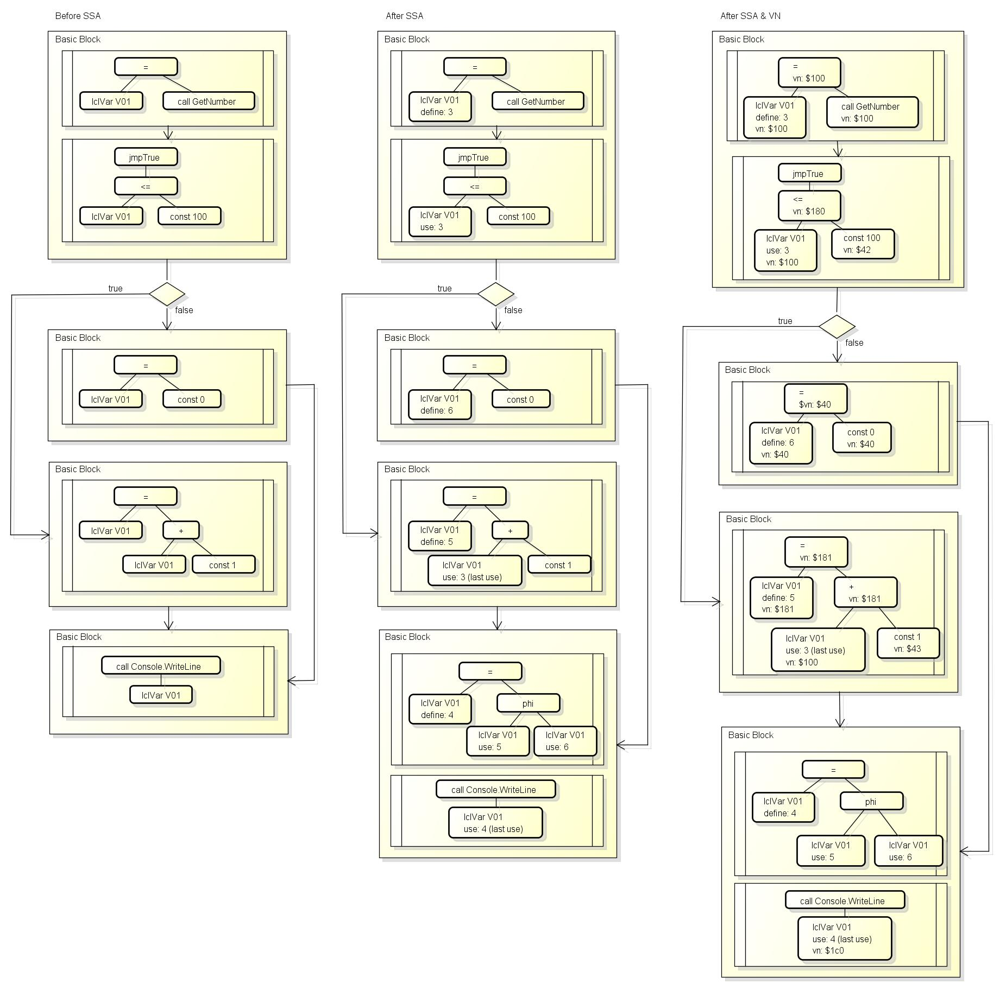

[fgSsaBuild](https://github.com/dotnet/coreclr/blob/v1.1.0/src/jit/ssabuilder.cpp#L155)的具体算法比较复杂, 请参考我的[JIT笔记](https://gist.github.com/303248153/2ca436a0e44e5da1c711de050fa3c13f#file-gistfile1-txt-L3453)中的信息或者源代码.

# PHASE_EARLY_PROP

这个阶段会根据SSA追踪本地变量并做出简单的优化, 包含以下的代码:

``` c++
if (doEarlyProp)
{
    /* Propagate array length and rewrite getType() method call */
    optEarlyProp();
    EndPhase(PHASE_EARLY_PROP);
}
```

[optEarlyProp](https://github.com/dotnet/coreclr/blob/v1.1.0/src/jit/earlyprop.cpp#L158)的处理如下:

- 枚举BasicBlock和BasicBlock中的语句
    - 按执行顺序枚举语句中的tree, 调用[optEarlyPropRewriteTree](https://github.com/dotnet/coreclr/blob/v1.1.0/src/jit/earlyprop.cpp#L231)
        - 对于GT_ARR_LENGTH节点(获取数组长度的节点), 基于SSA跟踪数组的来源, 如果跟踪到`new 数组[常量]`, 则把该节点替换为常量
        - 对于使用GT_INDIR获取MethodTable(vtable)的节点, 基于SSA追踪对象的来源, 和上面一样找到则把节点替换为常量
        - 对于获取对象成员并且需要检查null的节点, 如果成员的offset不超过一定值则可以去除nullcheck(因为一定会发生页错误), 在[之前的文章](http://www.cnblogs.com/zkweb/p/6898627.html)中有提到过这个机制
        - 如果节点有修改则调用[gtSetStmtInfo](https://github.com/dotnet/coreclr/blob/v1.1.0/src/jit/compiler.hpp#L1218)重新计算运行和体积成本
        - 如果节点有修改则调用[fgSetStmtSeq](https://github.com/dotnet/coreclr/blob/v1.1.0/src/jit/flowgraph.cpp#L18201)更新GenTree的链表

# PHASE_VALUE_NUMBER

这个阶段会为GenTree分配[VN(Value Number)](https://en.wikipedia.org/wiki/Global_value_numbering), 包含以下的代码:

``` c++
if (doValueNum)
{
    fgValueNumber();
    EndPhase(PHASE_VALUE_NUMBER);
}
```

前面的SSA是针对访问本地变量的节点(GenTree)分配一个唯一的版本号, 版本号一致则值一致,
这里的VN则是针对所有节点(GenTree)分配一个唯一的标识, 标识相同则值相同.

[fgValueNumber](https://github.com/dotnet/coreclr/blob/v1.1.0/src/jit/valuenum.cpp#L4147)会调用[fgValueNumberBlock](https://github.com/dotnet/coreclr/blob/v1.1.0/src/jit/valuenum.cpp#L4330)和[fgValueNumberTree](https://github.com/dotnet/coreclr/blob/v1.1.0/src/jit/valuenum.cpp#L5136)标记各个节点的VN.
VN有两种类型, `Liberal`假定其他线程只有在同步点才会修改heap中的内容, `Conservative`假定其他线程在任意两次访问之间都有可能修改heap中的内容.
VN会从`ValueNumStore`中分配, `ValueNumStore`包含以下类型的VN集合:

- m_intCnsMap: int常量的VN集合
- m_longCnsMap: long常量的VN集合
- m_handleMap: field或者class handle的VN集合
- m_floatCnsMap: float常量的VN集合
- m_doubleCnsMap: double常量的VN集合
- m_byrefCnsMap: byref常量的VN集合
- m_VNFunc0Map: 带0个参数的操作符的VN集合
- m_VNFunc1Map: 带1个参数的操作符(unary)的VN集合, 例如`-x`
- m_VNFunc2Map: 带2个参数的操作符(binary)的VN集合, 例如`a + b`
- m_VNFunc3Map: 带3个参数的操作符的VN集合

例如`a = 1; b = GetNum(); c = a + b; d = a + b;`,
`a`的VN是常量1, 储存在`m_intCnsMap`中,
`b`的VN因为无法确定值, 会调用[VNForExpr](https://github.com/dotnet/coreclr/blob/v1.1.0/src/jit/valuenum.cpp#L2277)分配一个新的VN,
`c`的VN是a+b的组合, 储存在`m_VNFunc2Map`中,
`d`的VN是a+b的组合, 因为之前已经生成过, 会从`m_VNFunc2Map`获取一个现有的VN,
这时我们可以确定c和d的值是相同的.

生成VN的具体算法请参考我的[JIT笔记](https://gist.github.com/303248153/2ca436a0e44e5da1c711de050fa3c13f#file-gistfile1-txt-L3564)或者源代码.

# PHASE_HOIST_LOOP_CODE

这个阶段会把循环中和循环无关的表达式提到循环外面, 包含以下的代码:

``` c++
if (doLoopHoisting)
{
    /* Hoist invariant code out of loops */
    optHoistLoopCode();
    EndPhase(PHASE_HOIST_LOOP_CODE);
}
```

[optHoistLoopCode](https://github.com/dotnet/coreclr/blob/v1.1.0/src/jit/optimizer.cpp#L5650)会枚举循环中的表达式,
获取表达式的VN, 并调用[optVNIsLoopInvariant](https://github.com/dotnet/coreclr/blob/v1.1.0/src/jit/optimizer.cpp#L6345)判断表达式的值是否和循环无关,
如果和循环无关, 并且表达式无副作用, 并且表达式的节点拥有足够的成本(gtCostEx)则把表达式提到循环外面.

例如优化前的代码:

``` c++
var a = SomeFunction();
for (var x = 0; x < 3; ++x) {
    Console.WriteLine(a * 3);
}
```

优化后可以把`a * 3`提到外面:

``` c++
var a = SomeFunction();
var tmp = a * 3;
for (var x = 0; x < 3; ++x) {
    Console.WriteLine(tmp);
}
```

判断表达式的值和循环无关的依据有:

- 如果VN是phi, 则phi的来源需要在循环外部(例如上面如果是x * 3则来源是循环内部)
- 如果表达式访问了heap上的变量(class的成员)则不能判断无关
- 表达式中访问的本地变量的SSA版本的定义需要在循环外部(例如上面的a的定义在循环外部)

# PHASE_VN_COPY_PROP

这个阶段会替换具有相同VN的本地变量, 包含以下的代码:

``` c++
if (doCopyProp)
{
    /* Perform VN based copy propagation */
    optVnCopyProp();
    EndPhase(PHASE_VN_COPY_PROP);
}
```

[optVnCopyProp](https://github.com/dotnet/coreclr/blob/v1.1.0/src/jit/copyprop.cpp#L390)会枚举所有读取(USE)本地变量的节点,
调用[optCopyProp](https://github.com/dotnet/coreclr/blob/v1.1.0/src/jit/copyprop.cpp#L120), 查找当前是否有VN相同并存活的其他变量, 如果有则替换读取的变量到该变量.

例如优化前的代码:

``` c++
var a = GetNum();
var b = a;
var c = b + 123;
```

优化后可以把`b`替换为`a`:

``` c++
var a = GetNum();
var b = a;
var c = a + 123;
```

后面如果`b`的引用计数为0则我们可以安全的删掉变量`b`.
这项优化可以减少多余的变量复制.

# PHASE_OPTIMIZE_VALNUM_CSES

这个阶段会替换具有相同VN的表达式, 俗称[CSE优化](https://en.wikipedia.org/wiki/Common_subexpression_elimination), 包含以下的代码:

``` c++
#if FEATURE_ANYCSE
/* Remove common sub-expressions */
optOptimizeCSEs();
#endif // FEATURE_ANYCSE
```

[optOptimizeCSEs](https://github.com/dotnet/coreclr/blob/v1.1.0/src/jit/optcse.cpp#L2487)会枚举所有节点,
调用[optIsCSEcandidate](https://github.com/dotnet/coreclr/blob/v1.1.0/src/jit/optcse.cpp#L2222)判断是否应该对节点进行CSE优化, 判断依据包括表达式的成本(小代码时gtCostSz否则gtCostEx),
如果判断通过则调用[optValnumCSE_Index](https://github.com/dotnet/coreclr/blob/v1.1.0/src/jit/optcse.cpp#L512), 对于拥有相同VN的节点,
第一次仅仅添加节点到`optCSEhash`索引中,
第二次因为节点已经在`optCSEhash`索引中, 会给该索引中的元素分配一个新的`csdIndex`(自增值), 然后设置节点的`gtCSEnum`等于`csdIndex`,
第三次之后节点已经在`optCSEhash`索引中, 也已经分配过`csdIndex`, 后面的节点的`gtCSEnum`都会指向同一个`csdIndex`.
完成后如果`optCSEhash`中有任意的元素有`csdIndex`, 则调用以下的函数执行CSE优化:

- [optValnumCSE_InitDataFlow](https://github.com/dotnet/coreclr/blob/v1.1.0/src/jit/optcse.cpp#L747)
- [optValnumCSE_DataFlow](https://github.com/dotnet/coreclr/blob/v1.1.0/src/jit/optcse.cpp#L891)
- [optValnumCSE_Availablity](https://github.com/dotnet/coreclr/blob/v1.1.0/src/jit/optcse.cpp#L932)
- [optValnumCSE_Heuristic](https://github.com/dotnet/coreclr/blob/v1.1.0/src/jit/optcse.cpp#L2133)

例如优化前的代码:

``` c++
var a = SomeFunction();
var b = (a + 5) * a;
var c = (a + 5) + a;
```

优化后可以把`a + 5`提取出来:

``` c++
var a = SomeFunction();
var tmp = a + 5;
var b = tmp * a;
var c = tmp + a;
```

这项优化可以减少重复的计算, 但会增加本地变量的数量.

# PHASE_ASSERTION_PROP_MAIN

这个阶段会根据SSA和VN再次传播断言, 包含以下的代码:

``` c++
if (doAssertionProp)
{
    /* Assertion propagation */
    optAssertionPropMain();
    EndPhase(PHASE_ASSERTION_PROP_MAIN);
}
```

[optAssertionPropMain](https://github.com/dotnet/coreclr/blob/v1.1.0/src/jit/assertionprop.cpp#L4930)包含以下的处理:

- 遍历节点调用[optVNAssertionPropCurStmtVisitor](https://github.com/dotnet/coreclr/blob/v1.1.0/src/jit/assertionprop.cpp#L4874)
    - 调用[optVnNonNullPropCurStmt](https://github.com/dotnet/coreclr/blob/v1.1.0/src/jit/assertionprop.cpp#L4839)
        - 针对call节点, 如果可以通过VN确定this不为null, 则标记可以省略null检查
        - 针对indir(deref)节点, 如果可以通过VN确定变量不为null, 则标记可以省略null检查
    - 调用[optVNConstantPropCurStmt](https://github.com/dotnet/coreclr/blob/v1.1.0/src/jit/assertionprop.cpp#L4733)
        - 如果节点的VN是常量, 替换节点到该常量
- 再次调用[optAssertionGen](https://github.com/dotnet/coreclr/blob/v1.1.0/src/jit/assertionprop.cpp#L2016)根据当前的状态创建断言
- 调用[optComputeAssertionGen](https://github.com/dotnet/coreclr/blob/v1.1.0/src/jit/assertionprop.cpp#L4433)按跳转条件创建断言
    - 例如 `if (a > 3) { /* block a */ } else { /* block b */ }`, 可以断言block a中`a > 3`和block b中`a <= 3`
- 再次调用[optAssertionProp]按传播后的断言优化节点
    - [optAssertionProp_LclVar](https://github.com/dotnet/coreclr/blob/v1.1.0/src/jit/assertionprop.cpp#L2828)
        - 如果确定本地变量等于常量，修改为该常量
        - 如果确定本地变量等于另一本地变量，修改为另一本地变量
    - [optAssertionProp_Ind](https://github.com/dotnet/coreclr/blob/v1.1.0/src/jit/assertionprop.cpp#L3420)
        - 如果indir(deref)左边的节点是lclVar, 并且该节点确定不为null, 则标记可以省略null检查
    - [optAssertionProp_BndsChk](https://github.com/dotnet/coreclr/blob/v1.1.0/src/jit/assertionprop.cpp#L3694)
        - 如果数组的位置是常量并且确定不会溢出, 则标记不需要检查边界
    - [optAssertionProp_Comma](https://github.com/dotnet/coreclr/blob/v1.1.0/src/jit/assertionprop.cpp#L3397)
        - 如果前面标记了不需要检查边界, 则删除边界检查(comma bound_check, expr) => (expr)
    - [optAssertionProp_Cast](https://github.com/dotnet/coreclr/blob/v1.1.0/src/jit/assertionprop.cpp#L3300)
        - 如果是小范围类型转换为大范围类型, 则标记不会溢出
        - 如果是大范围类型转换为小范围类型, 且确定不会溢出则去除cast
    - [optAssertionProp_Call](https://github.com/dotnet/coreclr/blob/v1.1.0/src/jit/assertionprop.cpp#L3635)
        - 如果可以确定this不为null, 则标记可以省略null检查
    - [optAssertionProp_RelOp](https://github.com/dotnet/coreclr/blob/v1.1.0/src/jit/assertionprop.cpp#L2991)
        - 替换等于或者不等于的表达式, 例如`x == const`, `x`的值确定是可以替换成true或false

# PHASE_OPTIMIZE_INDEX_CHECKS

这个阶段会根据VN和断言删除多余的数组边界检查, 包含以下的代码:

``` c++
if (doRangeAnalysis)
{
    /* Optimize array index range checks */
    RangeCheck rc(this);
    rc.OptimizeRangeChecks();
    EndPhase(PHASE_OPTIMIZE_INDEX_CHECKS);
}
```

[OptimizeRangeChecks](https://github.com/dotnet/coreclr/blob/v1.1.0/src/jit/rangecheck.cpp#L1358)会枚举检查边界的节点(COMMA且左参数是ARR_BOUNDS_CHECK)并调用[OptimizeRangeCheck](https://github.com/dotnet/coreclr/blob/v1.1.0/src/jit/rangecheck.cpp#L201),
如果可以通过VN确定访问的序号小于数组长度, 则可以去掉边界检查(COMMA左边只留副作用),

# PHASE_UPDATE_FLOW_GRAPH

如果优化过程中做出了修改, 这个阶段会再次调用[fgUpdateFlowGraph](https://github.com/dotnet/coreclr/blob/v1.1.0/src/jit/flowgraph.cpp#L15709)删除空block, 无法到达的block和多余的跳转:

``` c++
/* update the flowgraph if we modified it during the optimization phase*/
if (fgModified)
{
    fgUpdateFlowGraph();
    EndPhase(PHASE_UPDATE_FLOW_GRAPH);
    
    ...
}
```

# PHASE_COMPUTE_EDGE_WEIGHTS2

如果优化过程中做出了修改, 这个阶段会再次调用[fgComputeEdgeWeights](https://github.com/dotnet/coreclr/blob/v1.1.0/src/jit/flowgraph.cpp#L12410)计算block和block edge的权重(weight):
从阶段的名字也可以看出来这个阶段的处理跟前面的`PHASE_COMPUTE_EDGE_WEIGHTS`阶段一样.

``` c++
/* update the flowgraph if we modified it during the optimization phase*/
if (fgModified)
{
    ...
    
    // Recompute the edge weight if we have modified the flow graph
    fgComputeEdgeWeights();
    EndPhase(PHASE_COMPUTE_EDGE_WEIGHTS2);
}
```

# PHASE_DETERMINE_FIRST_COLD_BLOCK

这个阶段负责标记第一个冷(cold)的BasicBlock, 包含以下的代码:

``` c++
fgDetermineFirstColdBlock();
EndPhase(PHASE_DETERMINE_FIRST_COLD_BLOCK);
```

因为前面的[fgReorderBlocks](https://github.com/dotnet/coreclr/blob/v1.1.0/src/jit/flowgraph.cpp#L14296)已经把权重较小的block排到链表的后面,
[fgDetermineFirstColdBlock](https://github.com/dotnet/coreclr/blob/v1.1.0/src/jit/flowgraph.cpp#L15461)会查找BasicBlock链表的最后连续标记了`BBF_RUN_RARELY`的部分,
设置第一个标记的block到`fgFirstColdBlock`, 然后标记这些block为`BBF_COLD`, 如果找不到则`fgFirstColdBlock`会等于null.

CodeGen会根据`fgFirstColdBlock`把代码分为两部分, 热(hot)的部分和冷(cold)的部分分别写入到不同的位置.

# PHASE_RATIONALIZE

这个阶段是JIT后端的第一个阶段, 解决LIR中需要上下文判断的节点并正式开始使用LIR, 包含以下的代码:

``` c++
#ifndef LEGACY_BACKEND
// rationalize trees
Rationalizer rat(this); // PHASE_RATIONALIZE
rat.Run();
#endif // !LEGACY_BACKEND
```

[Rationalizer::Run](https://github.com/dotnet/coreclr/blob/v1.1.0/src/jit/rationalize.cpp#L951)包含以下的处理:

- 枚举BasicBlock中的语句(stmt)
    - 如果当前的平台不支持`GT_INTRINSIC`节点的操作(例如abs, round, sqrt)则替换为helper call
    - 设置上一个语句的最后一个节点的下一个节点是下一个语句的第一个节点
    - 设置下一个语句的第一个节点的上一个节点是上一个语句的最后一个节点
- 标记BasicBlock的第一个节点和最后一个节点
- 标记BasicBlock的格式已经是LIR(BBF_IS_LIR)
- 枚举BasicBlock中的语句(stmt)
    - 把语句节点(GT_STMT)转换为IL偏移值节点(GT_IL_OFFSET), 用于标记哪些节点属于哪行IL语句
    - 针对语句中的节点调用[Rationalizer::RewriteNode](https://github.com/dotnet/coreclr/blob/v1.1.0/src/jit/rationalize.cpp#L685)
        - 把修改变量的`GT_LCL_VAR, GT_LCL_FLD, GT_REG_VAR, GT_PHI_ARG`节点转换为`GT_STORE_LCL_VAR, GT_STORE_LCL_FLD`
        - 把修改地址值的`GT_IND`节点转换为`GT_STOREIND`
        - 把修改类字段的`GT_CLS_VAR`节点转换为`GT_CLS_VAR_ADDR`+`GT_STOREIND`
        - 把修改块值的`GT_BLK, GT_OBJ, GT_DYN_BLK`节点转换为`GT_STORE_BLK, GT_STORE_OBJ, GT_STORE_DYN_BLK`
        - 删除`GT_BOX`节点(因为已经转换为call)
        - 对于`GT_ADDR`节点
            - 如果目标是本地变量则修改节点为`GT_LCL_VAR_ADDR`或者`GT_LCL_FLD_ADDR`
            - 如果目标是类字段则修改节点为`GT_CLS_VAR_ADDR`
            - 如果对象是indir则可以同时删除indir和addr(&*someVar => someVar)
        - 对于`GT_NOP`节点, 如果有参数则替换为参数并删除
        - 对于`GT_COMMA`节点
            - 如果第一个参数无副作用, 则删除第一个参数的所有节点
            - 如果第二个参数无副作用且值未被使用, 则删除第二个参数的所有节点
            - 删除`GT_COMMA`节点(第一个和第二个参数已经按顺序连接起来)
        - 删除`GT_ARGPLACE`节点(后面会添加`GT_PUTARG_REG`或`GT_PUTARG_STK`节点)
        - 把读取类字段的`GT_CLS_VAR`节点转换为`GT_CLS_VAR_ADDR`+`GT_IND`
        - 确保当前cpu支持`GT_INTRINSIC`节点对应的操作(例如abs, round, sqrt)
- 设置正式开始使用LIR `Compiler::compRationalIRForm = true`

# PHASE_SIMPLE_LOWERING

这个阶段会做一些简单的Lowering(使LIR更接近机器代码)工作, 包含以下的代码:

``` c++
// Here we do "simple lowering".  When the RyuJIT backend works for all
// platforms, this will be part of the more general lowering phase.  For now, though, we do a separate
// pass of "final lowering."  We must do this before (final) liveness analysis, because this creates
// range check throw blocks, in which the liveness must be correct.
fgSimpleLowering();
EndPhase(PHASE_SIMPLE_LOWERING);
```

[fgSimpleLowering](https://github.com/dotnet/coreclr/blob/v1.1.0/src/jit/flowgraph.cpp#L8939)包含以下的处理:

- 按LIR顺序枚举节点
    - 如果节点是`GT_ARR_LENGTH`, 转换为`GT_IND(arr + ArrLenOffset)`
        - 例如数组对象在x64下0~8是指向MethodTable的指针, 8~12是数组长度, 则转换为`indir(lclVar +(ref) const 8)`
    - 如果节点是`GT_ARR_BOUNDS_CHECK`
        - 确保抛出`IndexOutOfRangeException`的BasicBlock存在, 不存在则添加

# PHASE_LCLVARLIVENESS

这个阶段会设置各个`BasicBlock`进入和离开时存活的变量集合, 包含以下的代码:
这个阶段仅在使用旧的JIT后端(JIT32)时会启用, 也就是一般的CoreCLR不会执行这个阶段.

``` c++
#ifdef LEGACY_BACKEND
/* Local variable liveness */
fgLocalVarLiveness();
EndPhase(PHASE_LCLVARLIVENESS);
#endif // !LEGACY_BACKEND
```

[fgLocalVarLiveness](https://github.com/dotnet/coreclr/blob/v1.1.0/src/jit/liveness.cpp#L181)会设置`BasicBlock`的以下成员:

- bbVarUse 使用过的本地变量集合
- bbVarDef 修改过的本地变量集合
- bbVarTmp 临时变量
- bbLiveIn 进入block时存活的变量集合
- bbLiveOut 离开block后存活的变量集合
- bbHeapUse 是否使用过全局heap
- bbHeapDef 是否修改过全局heap
- bbHeapLiveIn 进入blob时全局heap是否存活
- bbHeapLiveOut 离开blob后全局heap是否存活
- bbHeapHavoc 是否会让全局heap进入未知的状态

# PHASE_LOWERING

这个阶段会做主要的Lowering(使LIR更接近机器代码)工作, 确定各个节点需要的寄存器数量, 包含以下的代码:

``` c++
///////////////////////////////////////////////////////////////////////////////
// Dominator and reachability sets are no longer valid. They haven't been
// maintained up to here, and shouldn't be used (unless recomputed).
///////////////////////////////////////////////////////////////////////////////
fgDomsComputed = false;

/* Create LSRA before Lowering, this way Lowering can initialize the TreeNode Map */
m_pLinearScan = getLinearScanAllocator(this);

/* Lower */
Lowering lower(this, m_pLinearScan); // PHASE_LOWERING
lower.Run();
```

[Lowering::Run](https://github.com/dotnet/coreclr/blob/v1.1.0/src/jit/lower.cpp#L3605)包含以下的处理:

- 按LIR顺序枚举节点
    - 如果是x86(32位)则分解long节点到两个int节点(loResult => hiResult => long)
    - GT_IND: 判断是否可以替换为LEA节点(可以使用CPU中的LEA指令)
        - 例如`*(((v07 << 2) + v01) + 16)`可以替换为`*(lea(v01 + v07*4 + 16))`
    - GT_STOREIND: 判断是否可以替换为LEA节点, 同上
    - GT_ADD: 判断是否可以替换为LEA节点, 同上
    - GT_UDIV: 判断是否可以替换到RSZ节点
        - 例如`16/2`可以替换为`16>>1`
    - GT_UMOD: 判断是否可以替换到AND节点
        - 例如`17/2`可以替换为`17&(2-1)`
    - GT_DIV, GT_MOD:
        - 如果divisor是`int.MinValue`或者`long.MinValue`, 转换到EQ(只有自己除自己可以得到1)
        - 如果divisor是power of 2
            - 转换DIV到RSH, 例如`16/-2`转换到`-(16>>1)`
            - 转换MOD, 例如`31%8`转换到`31-8*(31/8)`转换到`31-((31>>3)<<3)`转换到`31-(31& ~(8-1))`
    - GT_SWITCH
        - 替换switch下的节点到一个本地变量
            - 例如`switch v01 - 100`替换到`tmp = v01 - 100; switch tmp`
        - 添加判断并跳到default case的节点
            - 例如`if (tmp > jumpTableLength - 2) { goto jumpTable[jumpTableLength - 1]; }`
        - 创建一个新的BasicBlock, 把原来的BBJ_SWITCH转移到这个block
            - 转移后的结构:
                - 原block (BBJ_COND, 条件成立时跳转到default case)
                - 新block (包含转移后的switch)
                - 剩余的block
        - 如果剩余的跳转目标都是同一个block, 可以省略掉switch, 直接跳过去
        - 否则如果跳转个数小于`minSwitchTabJumpCnt`则转换switch到多个jtrue(if ... else if ... else)
        - 否则转换switch到`GT_SWITCH_TABLE`节点(后面会生成一个包含偏移值的索引表, 按索引来跳转)
    - GT_CALL
        - 针对参数添加`GT_PUTARG_REG`或者`GT_PUTARG_STK`节点
        - 如果是调用委托则转换到具体的取值+调用
            - 例如把`call originalThis`转换到`call indir(lea(originalThis+24)) with indir(lea(originalThis+8))`
            - `indir(lea(originalThis+24))`是函数的地址
            - `indir(lea(originalThis+8))`是真正的this, 会替换掉原有的this式
        - 否则如果是`GTF_CALL_VIRT_STUB`则替换到`call ind(函数地址的地址)`
        - 否则如果是`GTF_CALL_VIRT_VTABLE`则替换到`call ind(vtable中函数的地址)`
            - 例如`ind(lea(ind(lea(ind(lea(this+0))+72))+32))`
        - 否则如果是`GTF_CALL_NONVIRT`
            - 如果是helper call则获取具体的函数地址(例如JIT_New的函数地址)
            - 如果函数地址已知则生成`call addr`
            - 如果函数地址的地址已知则生成`call ind(addr)`
            - 如果函数地址的地址的地址已知则生成`call ind(ind(addr))`
    - GT_JMP, GT_RETURN
        - 如果调用了非托管函数则在前面插入PME(pinvoke method epilog)
    - GT_CAST
        - 转换`GT_CAST(small, float/double)`到`GT_CAST(GT_CAST(small, int), float/double)`
        - 转换`GT_CAST(float/double, small)`到`GT_CAST(GT_CAST(float/double, int), small)`
    - GT_ARR_ELEM: 转换到获取元素地址并且IND的节点(例如IND(LEA))
    - GT_STORE_BLK, GT_STORE_OBJ, GT_STORE_DYN_BLK: 判断计算地址的节点是否可以替换为LEA节点, 同上
- 按LIR顺序枚举节点
    - 计算节点需要的寄存器数量
    - 设置哪些节点是contained(contained节点是其他节点的指令的一部分)

可以参考[上一篇文章](http://www.cnblogs.com/zkweb/p/7687737.html)关于Lowering的例子:

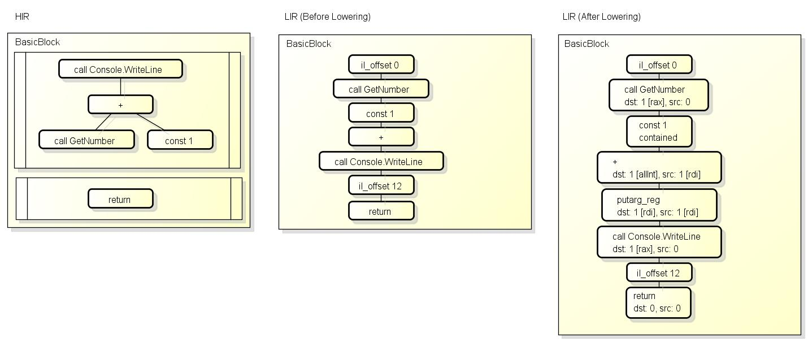

# PHASE_LINEAR_SCAN

这个阶段负责给各个节点分配寄存器, 使用的是[LSRA算法](https://www.usenix.org/legacy/events/vee05/full_papers/p132-wimmer.pdf), 包含以下的代码:

``` c++
assert(lvaSortAgain == false); // We should have re-run fgLocalVarLiveness() in lower.Run()
lvaTrackedFixed = true;        // We can not add any new tracked variables after this point.

/* Now that lowering is completed we can proceed to perform register allocation */
m_pLinearScan->doLinearScan();
EndPhase(PHASE_LINEAR_SCAN);
```

LSRA算法可以看[这一篇论文](https://www.usenix.org/legacy/events/vee05/full_papers/p132-wimmer.pdf)中的说明, 但CoreCLR中使用的算法和论文中的算法不完全一样.
LSRA算法要求根据LIR生成以下数据:

**Interval**

Interval表示同一个变量(本地L, 内部T, 其他I)对应的使用期间, 包含多个RefPosition,
本地变量的Interval会在一开始创建好, 其他(临时)的Interval会在需要使用寄存器(例如call返回值)时使用,
Interval有激活(activate)和未激活(inactive)状态, 未激活状态代表在当前位置该变量不会被使用(不占用寄存器).

**LocationInfo**

LocationInfo表示代码位置, 在构建时会对LIR中的GenTree分配位置, 位置总会+2.

**RefPosition**

RefPosition有以下的类型:

- Def: 记录写入变量的位置, 有对应的Interval
- Use: 记录读取变量的位置, 有对应的Interval
- Kill: 记录寄存器值会被覆盖的位置, 常见于call时标记caller save registers被覆盖
- BB: 记录BasicBlock的位置
- FixedReg: 记录当前位置使用了固定的寄存器
- ExpUse: 记录离开当前block时存活且进入后继block时也存活的变量(exposed use)
- ParamDef: 记录函数开头传入(定义)的参数变量
- DummyDef: 记录函数开头未定义的参数变量
- ZeroInit: 记录函数开头需要0初始化的变量
- KillGCRefs: 记录需要确保当前寄存器中无GC引用(对象或者struct的指针)的位置

可以参考[上一篇文章](http://www.cnblogs.com/zkweb/p/7687737.html)中说明LSRA的图片:

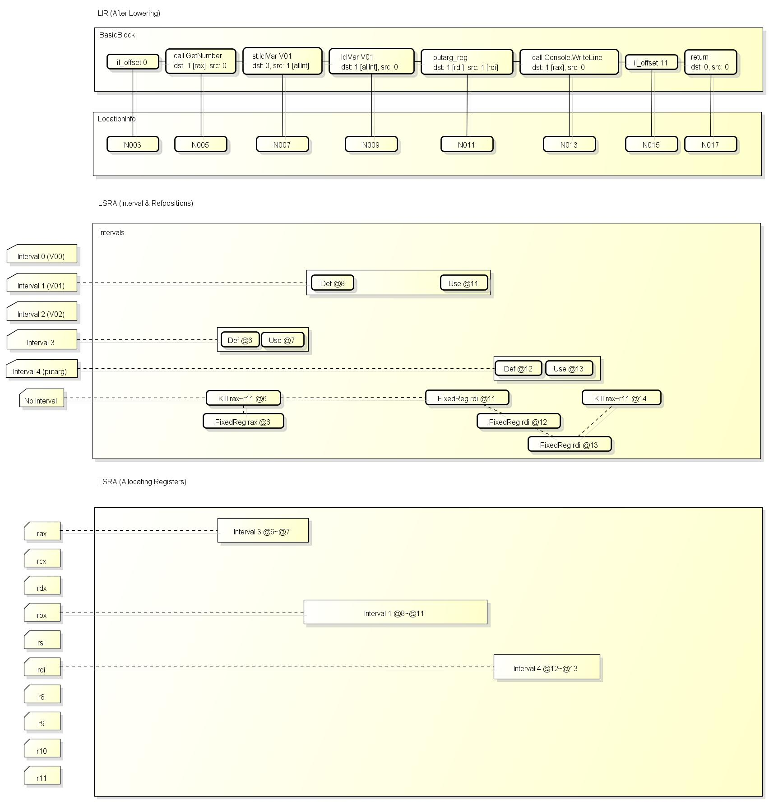

[LinearScan::doLinearScan](https://github.com/dotnet/coreclr/blob/v1.1.0/src/jit/lsra.cpp#L1650)包含以下的处理:

- 调用[setFrameType](https://github.com/dotnet/coreclr/blob/v1.1.0/src/jit/lsra.cpp#L4534)设置当前是否应该使用Frame Pointer
    - 使用Frame Pointer表示需要使用rbp保存进入函数时的rsp值, 需要清除所有节点的寄存器候选中的rbp
- 调用[initMaxSpill](https://github.com/dotnet/coreclr/blob/v1.1.0/src/jit/lsra.cpp#L7706)初始化用于记录spill层数的数组
    - 数组`maxSpill`有两个元素, 一个记录int的最大spill层数, 另一个记录float的最大spill层数
- 调用[buildIntervals](https://github.com/dotnet/coreclr/blob/v1.1.0/src/jit/lsra.cpp#L4101)构建LSRA算法需要的数据结构
    - 构建Interval, RefPosition, LocationInfo
- 调用[initVarRegMaps](https://github.com/dotnet/coreclr/blob/v1.1.0/src/jit/lsra.cpp#L2158)设置进入和离开block时变量使用的寄存器
    - 枚举BasicBlock
        - 设置`inVarToRegMaps[blockIndex] = new regNumber[跟踪的变量数量]`
        - 设置`outVarToRegMaps[blockIndex] = new regNumber[跟踪的变量数量]`
        - 枚举跟踪的变量数量
            - 设置`inVarToRegMaps[blockIndex][regMapIndex] = REG_STK`(默认通过栈传递)
            - 设置`outVarToRegMap[blockIndex][regMapIndex] = REG_STK`(默认通过栈传递)
    - 因为JIT需要确保如果变量在寄存器中, 离开block时变量所在的寄存器和进入后继block时变量所在的寄存器一致
- 调用[allocateRegisters](https://github.com/dotnet/coreclr/blob/v1.1.0/src/jit/lsra.cpp#L6436)分配寄存器
    - 这个函数包含了LSRA算法的主要处理, 以下是简化过的流程, 完整的请看我的[JIT笔记](https://gist.github.com/303248153/2ca436a0e44e5da1c711de050fa3c13f#file-gistfile1-txt-L5477)
    - 建立一个寄存器索引`physRegs[寄存器数量]`, 索引`寄存器 => (上次使用寄存器的RefPosition, 是否正在使用)`
    - 枚举Interval, 如果是传入的函数参数则设置`isActive = true`
    - 枚举RefPosition
        - 如果RefPosition是读取(Use)
            - 如果当前无正在分配的寄存器则标记为reload(把值从栈reload到寄存器)
        - 如果RefPosition要求使用固定的寄存器(例如Kill)
            - 让寄存器对应的Interval让出寄存器并设置为inactive
        - 如果RefPosition是最后一次读取(Use)
            - 标记下一轮处理Interval让出寄存器并设置为inactive
        - 如果RefPosition是读取(Use)或者写入(Def)且未分配寄存器
            - 调用[tryAllocateFreeReg](https://github.com/dotnet/coreclr/blob/v1.1.0/src/jit/lsra.cpp#L4811)分配一个寄存器(论文中的First Pass)
            - 如果分配失败则调用[allocateBusyReg](https://github.com/dotnet/coreclr/blob/v1.1.0/src/jit/lsra.cpp#L5315)再次尝试分配一个寄存器(论文中的Second Pass)
                - 必要时会让原来的寄存器对应的Interval让出寄存器(把值从寄存器spill到栈, 然后变为inactive)
            - 分配成功时Interval变为active
    - (如果一个变量对应的Interval从未让出过寄存器(spill), 则这个变量可以一直使用寄存器保存而不需要访问栈)
    - (反过来说如果一个Interval让出过寄存器(spill), 且该Interval不是本地变量, 则需要增加一个内部临时变量)
- 调用[resolveRegisters](https://github.com/dotnet/coreclr/blob/v1.1.0/src/jit/lsra.cpp#L7863)解决block之间寄存器的差异
    - 上面的分配是线性的, 并未考虑到flowgraph, 这个函数会确保离开block时变量所在的寄存器和进入后继block时变量所在的寄存器一致
    - 根据之前分配的结果给节点(GenTree)设置使用的寄存器
    - 如果需要重新从栈读取值则插入`GT_RELOAD`节点
    - 设置进入block时变量所在的寄存器索引`inVarToRegMaps`
    - 设置离开block时变量所在的寄存器索引`outVarToRegMap`
    - 调用[resolveEdges](https://github.com/dotnet/coreclr/blob/v1.1.0/src/jit/lsra.cpp#L8935)
        - 如果block的后继block有多个前继block, 例如(A => B, C => B), 则需要在A中解决
            - 如果block结束时变量的寄存器跟后继block的寄存器一致, 则无需resolution
            - 如果block结束时变量的寄存器跟后继block的寄存器不一致, 但所有后继block的寄存器都相同
                - 在block结束前插入GT_COPY节点, 复制来源寄存器到目标寄存器(或者来源寄存器到堆栈到目标寄存器)
            - 如果block结束时变量的寄存器跟后继block的寄存器不一致, 且不是所有后继block的寄存器都相同
                - 在block和后继block之间插入一个新block, 新block中插入GT_COPY节点用于复制到目标寄存器
        - 如果block只有一个前继block, 例如(A => B), 则可以在B中解决
            - 对于不一致的寄存器在block开头插入GT_COPY节点
    - 对于从未spill过的本地变量, 设置它可以不放在栈上(lvRegister = true, lvOnFrame = false)
    - 对于非本地变量的spill, 根据`maxSpill[int]`和`maxSpill[float]`调用[tmpPreAllocateTemps](https://github.com/dotnet/coreclr/blob/v1.1.0/src/jit/regset.cpp#L3295)创建指定数量的内部临时变量

经过这个阶段后, LIR中需要寄存器的节点都会得到明确的寄存器, 读取或者写入本地变量的节点也会明确目标是栈还是某个寄存器.

# PHASE_RA_ASSIGN_VARS

因为旧的JIT后端不支持LSRA, 这个阶段负责给旧的JIT后端(JIT32)分配寄存器, 包含以下的代码:

``` c++
lvaTrackedFixed = true; // We cannot add any new tracked variables after this point.
// For the classic JIT32 at this point lvaSortAgain can be set and raAssignVars() will call lvaSortOnly()

// Now do "classic" register allocation.
raAssignVars();
EndPhase(PHASE_RA_ASSIGN_VARS);
```

因为一般的CoreCLR不会执行这个阶段, 这里就不详细分析了.

# PHASE_GENERATE_CODE

从这个阶段开始就属于CodeGen了, CodeGen的入口如下:

``` c++
/* Generate code */

codeGen->genGenerateCode(methodCodePtr, methodCodeSize);
```

[genGenerateCode](https://github.com/dotnet/coreclr/blob/v1.1.0/src/jit/codegencommon.cpp#L2753)包含了三个阶段:

- PHASE_GENERATE_CODE: 负责根据LIR生成汇编指令
- PHASE_EMIT_CODE: 根据汇编指令写入可执行的机器代码
- PHASE_EMIT_GCEH: 写入函数的附加信息(函数头, GC信息, 例外信息等)

CodeGen会使用以下的数据类型:

- instrDesc: 汇编指令的数据, 一个instrDesc实例对应一条汇编指令
- insGroup: 汇编指令的组, 一个insGroup包含一个或多个instrDesc, 跳转指令的目标只能是IG的第一条指令

以下是[上一篇文章](http://www.cnblogs.com/zkweb/p/7687737.html)中的图片说明:

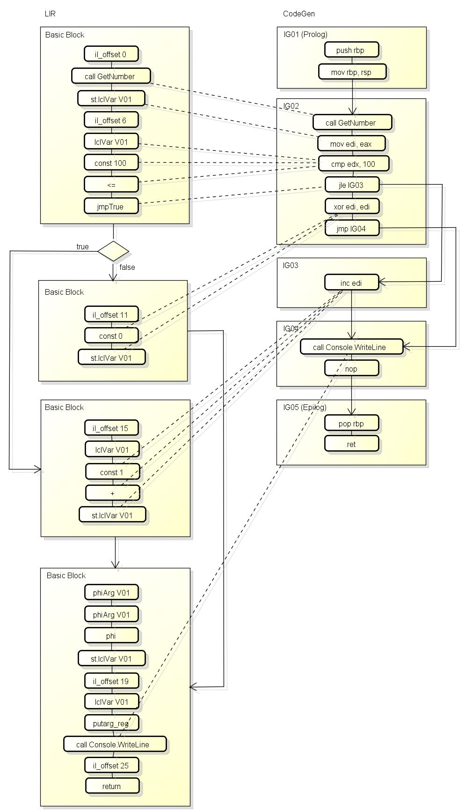

`PHASE_GENERATE_CODE`阶段包含了以下的处理:

- 调用[lvaAssignFrameOffsets](https://github.com/dotnet/coreclr/blob/v1.1.0/src/jit/lclvars.cpp#L3960)给各个本地变量分配栈偏移值
    - 会分两步计算
        - 第一步设置一个虚拟的初始偏移值0, 然后以这个0为基准设置各个变量的偏移值, 参数为正数本地变量为负数
        - 第二步根据是否使用frame pointer调整各个偏移值
    - 计算完毕后会设置`compLclFrameSize`, 代表进入函数时需要分配的大小(例如sub rsp, 0x80)
- 调用[emitBegFN](https://github.com/dotnet/coreclr/blob/v1.1.0/src/jit/emit.cpp#L980)预留函数的prolog所使用的IG
    - LIR只包含了函数体, 函数的prolog需要一个单独的IG保存
- 调用[genCodeForBBlist](https://github.com/dotnet/coreclr/blob/v1.1.0/src/jit/codegenxarch.cpp#L325)处理BasicBlock
    - 如果block是小函数(funclet)的第一个block, 则预留小函数的prolog所使用的IG
    - 以LIR顺序枚举block中的节点, 调用[genCodeForTreeNode](https://github.com/dotnet/coreclr/blob/v1.1.0/src/jit/codegenxarch.cpp#L1866)根据节点添加汇编指令
        - GT_CNS_INT: 如果常量的值是0, 生成`xor targetReg, targetReg`, 否则生成`mov, targetReg, imm`
        - GT_NEG: 如果来源寄存器跟目标寄存器不一致则生成`mov targetReg, sourceReg`, 然后生成`neg targetReg`
        - GT_LCL_VAR: 如果本地变量已经在寄存器则可以不处理, 否则生成从栈读取到寄存器的指令, 例如`mov targetReg, [rbp-offset]`
        - GT_STORE_LCL_VAR: 如果本地变量已经在相同的寄存器则不处理, 如果在不同的寄存器则添加复制寄存器的指令, 否则生成从寄存器保存到栈的指令
        - 更多的类型可以参考我的[JIT笔记](https://gist.github.com/303248153/2ca436a0e44e5da1c711de050fa3c13f#file-gistfile1-txt-L6687)
    - 判断block的跳转类型
        - BBJ_ALWAYS: 添加jmp指令
        - BBJ_RETURN: 预留函数的epilog使用的IG
        - BBJ_THROW: 添加int 3指令(这个指令不会被执行)
        - BBJ_CALLFINALLY: 添加`mov rcx, pspsym; call finally-funclet; jmp finally-return;`的指令
        - BBJ_EHCATCHRET: 移动block的目标地址(返回地址)到rax, 然后预留小函数的epilog使用的IG
        - BBJ_EHFINALLYRET, BBJ_EHFILTERRET: 预留小函数的epilog使用的IG
- 调用[genGeneratePrologsAndEpilogs](https://github.com/dotnet/coreclr/blob/v1.1.0/src/jit/codegencommon.cpp#L10338)添加prolog和epilog中的指令
    - 调用[genFnProlog](https://github.com/dotnet/coreclr/blob/v1.1.0/src/jit/codegencommon.cpp#L8140)生成主函数的prolog
        - 如果需要使用Frame Pointer, 则添加`push rbp; mov rbp, rsp`
        - push修改过的Callee Saved Register
        - 添加分配栈空间的指令, 例如`sub rsp, size`, 并添加确认栈空间的虚拟内存(所有页)可访问的指令
        - 添加清零栈空间的指令(本地变量的初始值是0)
        - 如果使用了小函数(funclet), 则添加`mov [lvaPSPSym], rsp`
        - 如果使用了Generic Context参数则添加保存它到本地变量的指令
        - 如果使用了GS Cookie则添加设置GS Cookie值的指令
    - 调用[emitGeneratePrologEpilog](https://github.com/dotnet/coreclr/blob/v1.1.0/src/jit/emit.cpp#L1750)生成主函数的epilog和小函数的prolog和epilog
        - 枚举之前预留的IG列表
            - IGPT_PROLOG: 上面已经生成过, 这里可以跳过
            - IGPT_EPILOG: 调用[genFnEpilog](https://github.com/dotnet/coreclr/blob/v1.1.0/src/jit/codegencommon.cpp#L9254)生成主函数的epilog
              - pop之前prolog里面push过的Callee Saved Register
              - 如果使用Frame Pointer且是x86, 则添加`mov esp, ebp; pop ebp;`
              - 如果使用Frame Pointer且是x64, 则添加`add rsp, size; pop rbp`或者`lea rsp, [rsp+size]; pop rbp;`
              - 如果不使用Frame Pointer, 则添加`add rsp, size`或者`lea rsp, [rsp+size]`
              - 如果是tail call则添加`call addr`, 如果是fast tail call则添加`jmp rax`, 否则添加`ret`
            - IGPT_FUNCLET_PROLOG:
                - 添加`push rbp`
                - push修改过的Callee Saved Register
                - 添加分配栈空间的指令, 例如`sub rsp, size`
                - 添加继承PSPSym并恢复主函数rbp的指令, 例如`mov rbp, [rcx+20h]; mov [rsp+20h], rbp; lea rbp,[rbp+40h];`
            - IGPT_FUNCLET_EPILOG:
                - 添加释放栈空间的指令, 例如`add rsp, size`
                - pop之前prolog里面push过的Callee Saved Register
                - 添加`pop rbp`
                - 添加`ret`

# PHASE_EMIT_CODE

上一个阶段生成了汇编指令, 但这些指令是通过`instrDesc`保存在`insGroup`的数据结构, 并不是可执行的机器代码.
这个阶段负责根据`instrDesc`列表写入实际可执行的机器代码.

以下是[上一篇文章](http://www.cnblogs.com/zkweb/p/7687737.html)中的图片说明:

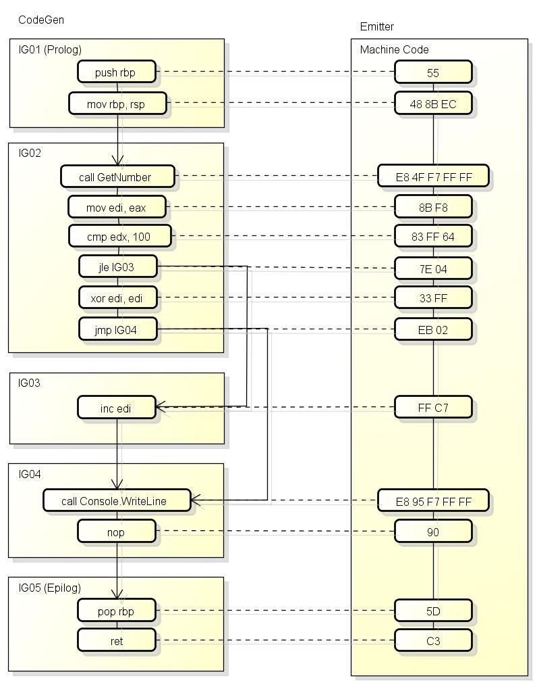

生成的结构如下, 包含函数代码, 函数头和真函数头:

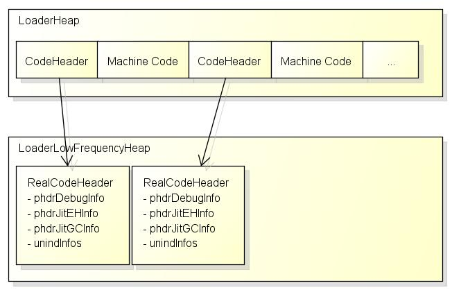

这个阶段的主要处理在[emitEndCodeGen](https://github.com/dotnet/coreclr/blob/v1.1.0/src/jit/emit.cpp#L4384)函数中, 包含以下的处理:

- 调用[CEEJitInfo::allocMem](https://github.com/dotnet/coreclr/blob/v1.1.0/src/vm/jitinterface.cpp#L11394)分配保存可执行机器代码的内存
    - 调用[EEJitManager::allocCode](https://github.com/dotnet/coreclr/blob/v1.1.0/src/vm/codeman.cpp#L2516)
        - 调用[EEJitManager::allocCodeRaw](https://github.com/dotnet/coreclr/blob/v1.1.0/src/vm/codeman.cpp#L2371)
            - 获取CodeHeap(chunk)的列表, 如果空间不足则调用[EEJitManager::NewCodeHeap](https://github.com/dotnet/coreclr/blob/v1.1.0/src/vm/codeman.cpp#L2259)分配一个新的chunk
                - 调用[ClrVirtualAllocExecutable](https://github.com/dotnet/coreclr/blob/v1.1.0/src/utilcode/util.cpp#L481)
            - 如果是动态函数, 这里会分配"函数头+函数代码+真函数头"的大小并返回指向"函数代码"的指针
            - 如果不是动态函数, 这里会分配"函数头+函数代码"的大小并返回函数代码的指针
        - 如果不是动态函数, 调用`pMD->GetLoaderAllocator()->GetLowFrequencyHeap()->AllocMem`分配真函数头
            - 这里分配的区域只有`PAGE_READWRITE`, 不可被执行
        - 设置"函数头"中的指针指向"真函数头"
        - 调用[NibbleMapSet](https://github.com/dotnet/coreclr/blob/v1.1.0/src/vm/codeman.cpp#L3822)设置`Nibble Map`, 用于定位函数的开始地址
            - `Nibble Map`在函数所在chunk(HeapList)的`pHdrMap`成员中, 是一个DWORD的数组, 一个DWORD包含8个`Nibble`格式如下
            - `[ [ NIBBLE(4bit), NIBBLE, ...(8个) ], [ NIBBLE, NIBBLE, ...(8个) ], ... ]`
            - 例如函数的开始地址是`0x7fff7ce80078`, 所在chunk(HeapList)的基础地址是`0x7fff7ce80000`, 则偏移值是120
            - Nibble的值是`((120 % 32) / 4) + 1 = 7`
            - Nibble存放在第`120 / 32 / 8 = 0`个DWORD中的第`120 / 32 = 3`个Nibble
            - 也就是DWORD的值会`&= 0xfff0ffff`然后`|= 0x00070000`
            - `Nibble Map`会可以根据当前PC查找函数的开始地址和对应的函数头, 对于调试和GC都是必要的信息
- 枚举IG(insGroup)列表
    - 记录IG开始时有哪些GC引用(对象或者struct的指针)在栈和寄存器上, 添加到gcInfo的列表中
    - 枚举IG中的指令(instrDesc)
        - 调用[emitIssue1Instr](https://github.com/dotnet/coreclr/blob/v1.1.0/src/jit/emit.cpp#L3389)编码指令
            - 调用[emitOutputInstr](https://github.com/dotnet/coreclr/blob/v1.1.0/src/jit/emitxarch.cpp#L10430)(x86/x64版本)
                - 判断指令的类型并写入指令, 指令的类型有
                    - 无参数的指令, 例如`nop`
                    - 带一个常量的指令, 例如`jge, loop, ret`
                    - 带跳转目标(label)的指令, 例如`jmp`
                    - 带函数或者函数指针的指令, 例如`call`
                    - 带单个寄存器的指令, 例如`inc, dec`
                    - 带两个寄存器的指令, 例如`mov`
                    - 第一个参数是寄存器, 第二个参数是内存的指令, 例如`mov`
                    - 更多的处理可以参考我的[JIT笔记](https://gist.github.com/303248153/2ca436a0e44e5da1c711de050fa3c13f#file-gistfile1-txt-L8048)
        - 写入指令的同时会更新gcInfo的列表
            - 例如从函数地址+x开始寄存器rax中包含GC引用, 从函数地址+x1开始寄存器rax不包含GC引用等

这个阶段完成了对函数中机器代码的写入, 接下来就是最后一个阶段.

# PHASE_EMIT_GCEH

这个阶段负责写入函数相关的信息, 也就是上面"真函数头"中的信息.
"真函数头"的类型是`_hpRealCodeHdr`, 包含以下的信息:

- phdrDebugInfo: PC到IL offset的索引
- phdrJitEHInfo: EH Clause的数组
- phdrJitGCInfo: GC扫描栈和寄存器使用的信息
- phdrMDesc: 函数的MethodDesc
- nUnwindInfos: unwindInfos的数量
- unindInfos: unwind信息(栈回滚信息)

### DebugInfo

`phdrDebugInfo`是一个DWORD的数组, 格式是`Nibble Stream`, 以4 bit为单位保存数字.
例如 0xa9 0xa0 0x03 代表 80, 19 两个数字:

``` text
0xa9 = 0b1010'1001 (最高位的1代表还需要继续读取下一个nibble)
0xa0 = 0b1010'0000 (最高位的0表示当前数字已结束)
0x03 = 0b0000'0011
001 010 000 => 80
010 011 => 19
```

数字列表的结构是:

- header, 包含两个数字, 第一个是`offset mapping`编码后的长度(bytes), 第二个是`native vars`编码后的长度(bytes) 
- offset mapping
    - offset mapping 的数量
    - native offset, 写入与前一条记录的偏移值
    - il offset
    - source 标记(flags), 有`SOURCE_TYPE_INVALID, SEQUENCE_POINT, STACK_EMPTY`等
- native vars (内部变量所在的scope的信息)
    - native vars 的数量
    - startOffset scope的开始偏移值
    - endOffset scope的结束偏移值, 写入距离start的delta
    - var number 变量的序号
    - var type (reg还是stack)
    - 后面的信息根据var type而定, 具体参考[DoNativeVarInfo](https://github.com/dotnet/coreclr/blob/v1.1.0/src/vm/debuginfostore.cpp#L270)

IDE可以根据DebugInfo知道下断点的时候应该把断点设在哪个内存地址, 步过的时候应该在哪个内存地址停下来等.

### EHInfo

`phdrJitEHInfo`是指向`CorILMethod_Sect_FatFormat`结构体的指针, 包含了`EH Clause`的数量和`EE_ILEXCEPTION_CLAUSE`的数组.

使用以下的C#代码:

``` csharp
var x = GetString();
try {
    Console.WriteLine(x);
    throw new Exception("abc");
} catch (Exception ex) {
    Console.WriteLine(ex);
    Console.WriteLine(x);
}
```

可以生成以下的汇编代码:

``` text
IN0016: 000000 push     rbp
IN0017: 000001 push     rbx
IN0018: 000002 sub      rsp, 24
IN0019: 000006 lea      rbp, [rsp+20H]
IN001a: 00000B mov      qword ptr [V06 rbp-20H], rsp
G_M21556_IG02:        ; offs=00000FH, size=0009H, gcrefRegs=00000000 {}, byrefRegs=00000000 {}, byref
IN0001: 00000F call     ConsoleApplication.Program:GetString():ref
IN0002: 000014 mov      gword ptr [V01 rbp-10H], rax
G_M21556_IG03:        ; offs=000018H, size=0043H, gcVars=0000000000000001 {V01}, gcrefRegs=00000000 {}, byrefRegs=00000000 {}, gcvars, byref
IN0003: 000018 mov      rdi, gword ptr [V01 rbp-10H]
IN0004: 00001C call     System.Console:WriteLine(ref)
IN0005: 000021 mov      rdi, 0x7F78892D3CE8
IN0006: 00002B call     CORINFO_HELP_NEWSFAST
IN0007: 000030 mov      rbx, rax
IN0008: 000033 mov      edi, 1
IN0009: 000038 mov      rsi, 0x7F78881BCE70
IN000a: 000042 call     CORINFO_HELP_STRCNS
IN000b: 000047 mov      rsi, rax
IN000c: 00004A mov      rdi, rbx
IN000d: 00004D call     System.Exception:.ctor(ref):this
IN000e: 000052 mov      rdi, rbx
IN000f: 000055 call     CORINFO_HELP_THROW
IN0010: 00005A int3     
G_M21556_IG04:        ; offs=00005BH, size=0007H, gcVars=0000000000000000 {}, gcrefRegs=00000000 {}, byrefRegs=00000000 {}, gcvars, byref, epilog, nogc
IN001b: 00005B lea      rsp, [rbp-08H]
IN001c: 00005F pop      rbx
IN001d: 000060 pop      rbp
IN001e: 000061 ret      
G_M21556_IG05:        ; func=01, offs=000062H, size=000EH, gcrefRegs=00000040 {rsi}, byrefRegs=00000000 {}, byref, funclet prolog, nogc
IN001f: 000062 push     rbp
IN0020: 000063 push     rbx
IN0021: 000064 push     rax
IN0022: 000065 mov      rbp, qword ptr [rdi]
IN0023: 000068 mov      qword ptr [rsp], rbp
IN0024: 00006C lea      rbp, [rbp+20H]
G_M21556_IG06:        ; offs=000070H, size=0018H, gcVars=0000000000000001 {V01}, gcrefRegs=00000040 {rsi}, byrefRegs=00000000 {}, gcvars, byref, isz
IN0011: 000070 mov      rdi, rsi
IN0012: 000073 call     System.Console:WriteLine(ref)
IN0013: 000078 mov      rdi, gword ptr [V01 rbp-10H]
IN0014: 00007C call     System.Console:WriteLine(ref)
IN0015: 000081 lea      rax, G_M21556_IG04
G_M21556_IG07:        ; offs=000088H, size=0007H, funclet epilog, nogc, emitadd
IN0025: 000088 add      rsp, 8
IN0026: 00008C pop      rbx
IN0027: 00008D pop      rbp
IN0028: 00008E ret
```

用lldb来分析这个函数的EHInfo可以得到:

``` text
(lldb) p *codePtr
(void *) $1 = 0x00007fff7ceef920
(lldb) p *(CodeHeader*)(0x00007fff7ceef920-8)
(CodeHeader) $2 = {
  pRealCodeHeader = 0x00007fff7cf35c78
}
(lldb) p *(_hpRealCodeHdr*)(0x00007fff7cf35c78)
(_hpRealCodeHdr) $3 = {
  phdrDebugInfo = 0x0000000000000000
  phdrJitEHInfo = 0x00007fff7cf35ce0
  phdrJitGCInfo = 0x0000000000000000
  phdrMDesc = 0x00007fff7baf9200
  nUnwindInfos = 2
  unwindInfos = {}
}
(lldb) me re -s8 -c20 -fx 0x00007fff7cf35ce0-8
0x7fff7cf35cd8: 0x0000000000000001 0x0000000000002040
0x7fff7cf35ce8: 0x0000001800000000 0x000000620000005b
0x7fff7cf35cf8: 0x000000000000008f 0x000000000100000e
0x7fff7cf35d08: 0x0000000000000030 0x0000000000000001
0x7fff7cf35d18: 0x00007ffff628f550 0x0000000000000b4a
0x7fff7cf35d28: 0x0000000000000000 0x0000000000000000
0x7fff7cf35d38: 0x0000000000000000 0x0000000000000000
0x7fff7cf35d48: 0x0000000000000000 0x0000000000000000
0x7fff7cf35d58: 0x0000000000000000 0x0000000000000000
0x7fff7cf35d68: 0x0000000000000000 0x0000000000000000

0x0000000000000001:
phdrJitEHInfo - sizeof(size_t) is num clauses, here is 1

0x0000000000002040:
memeber from base class IMAGE_COR_ILMETHOD_SECT_FAT
Kind = 0x40 = CorILMethod_Sect_FatFormat
DataSize = 0x20 = 32 = 1 * sizeof(EE_ILEXCEPTION_CLAUSE)

(lldb) p ((EE_ILEXCEPTION_CLAUSE*)(0x00007fff7cf35ce0+8))[0]
(EE_ILEXCEPTION_CLAUSE) $29 = {
  Flags = COR_ILEXCEPTION_CLAUSE_NONE
  TryStartPC = 24
  TryEndPC = 91
  HandlerStartPC = 98
  HandlerEndPC = 143
   = (TypeHandle = 0x000000000100000e, ClassToken = 16777230, FilterOffset = 16777230)
}

(lldb) sos Token2EE * 0x000000000100000e
Module:      00007fff7bc04000
Assembly:    System.Private.CoreLib.ni.dll
<invalid module token>
--------------------------------------
Module:      00007fff7baf6e70
Assembly:    coreapp_jit.dll
Token:       000000000100000E
MethodTable: 00007fff7cc0dce8
EEClass:     00007fff7bcb9400
Name:         mdToken: 0100000e (/home/ubuntu/git/coreapp_jitnew/bin/Release/netcoreapp1.1/ubuntu.16.04-x64/publish/coreapp_jit.dll)

(lldb) dumpmt 00007fff7cc0dce8
EEClass:         00007FFF7BCB9400
Module:          00007FFF7BC04000
Name:            System.Exception
mdToken:         0000000002000249
File:            /home/ubuntu/git/coreapp_jitnew/bin/Release/netcoreapp1.1/ubuntu.16.04-x64/publish/System.Private.CoreLib.ni.dll
BaseSize:        0x98
ComponentSize:   0x0
Slots in VTable: 51
Number of IFaces in IFaceMap: 2
```

可以看到`EE_ILEXCEPTION_CLAUSE`包含了try开始和结束的PC地址, handler开始和结束的PC地址, 和指向捕捉例外类型(或者filter函数)的指针.
CLR可以根据EHInfo知道例外抛出时应该调用哪个catch和finally.

### GCInfo

`phdrJitGCInfo`是一个bit数组, 它的编码非常复杂, 这里我给出一个实际解析GCInfo的例子.

C#代码和汇编代码和上面的`EHInfo`一样, 使用LLDB分析可以得到:

``` text
(lldb) p *codePtr
(void *) $1 = 0x00007fff7cee3920
(lldb) p *(CodeHeader*)(0x00007fff7cee3920-8)
(CodeHeader) $2 = {
  pRealCodeHeader = 0x00007fff7cf29c78
}
(lldb) p *(_hpRealCodeHdr*)(0x00007fff7cf29c78)
(_hpRealCodeHdr) $3 = {
  phdrDebugInfo = 0x0000000000000000
  phdrJitEHInfo = 0x00007fff7cf29ce0
  phdrJitGCInfo = 0x00007fff7cf29d28 "\x91\x81G"
  phdrMDesc = 0x00007fff7baed200
  nUnwindInfos = 2
  unwindInfos = {}
}
(lldb) me re -s8 -c20 -fx 0x00007fff7cf29d28
0x7fff7cf29d28: 0x1963d80000478191 0x171f412003325ca8
0x7fff7cf29d38: 0xee92864c5ffe0280 0x1c5c1c1f09bea536
0x7fff7cf29d48: 0xed8a93e5c6872932 0x00000000000000c4
0x7fff7cf29d58: 0x000000000000002a 0x0000000000000001
0x7fff7cf29d68: 0x00007ffff628f550 0x0000000000000b2e
0x7fff7cf29d78: 0x0000000000000000 0x0000000000000000
0x7fff7cf29d88: 0x0000000000000000 0x0000000000000000
0x7fff7cf29d98: 0x0000000000000000 0x0000000000000000
0x7fff7cf29da8: 0x0000000000000000 0x0000000000000000
0x7fff7cf29db8: 0x0000000000000000 0x0000000000000000
```

对bit数组的解析如下:

``` text
10001001
1: use fat encoding
0: no var arg
0: no security object
0: no gc cookie
1: have pspsym stack slot
0 0: no generic context parameter
1: have stack base register

1000000
1: wants report only leaf
0: no edit and continue preserved area
0: no reverse pinvoke frame
0 0 0 0: return kind is RT_Scalar

1'11100010
0 10001111: code length is 143

0000000
0 000000: pspsym stack slot is 0

0'0000000
0 000: stack base register is rbp (rbp is 5, normalize function will ^5 so it's 0)
0 000: size of stack outgoing and scratch area is 0

0'000110
0 00: 0 call sites
1 0 0 1: 2 interruptible ranges

11'11000
0 001111: interruptible range 1 begins from 15

110'10011000'000
1 001011 0 000001: interruptible range 1 finished at 91 (15 + 75 + 1)

10101'00
0 010101: interruptible range 2 begins from 112 (91 + 21)

111010'01001100
0 010111: interruptible range 2 finished at 136 (112 + 23 + 1)
1: have register slots
1 00 0 01: 4 register slots

110000
1: have stack slots
0 01: 1 tracked stack slots
0 0: 0 untracked stack slots

00'0000010
0 000: register slot 1 is rax(0)
00: register slot 1 flag is GC_SLOT_IS_REGISTER(8 & 0b11 = 0)
0 10: register slot 2 is rbx(3) (0 + 2 + 1)

0'10000
0 10: register slot 3 is rsi(6) (3 + 2 + 1)
0 00: register slot 4 is rdi(7) (6 + 0 + 1)

010'11111000
01: stack slot 1 base on GC_FRAMEREG_REL(2)
0 111110: stack slot 1 offset is -16 (-16 / 8 = -2)
00: stack slot 1 flag is GC_SLOT_BASE(0)

111 01000
111: num bits per pointer is 7

00000001
0 0000001: chunk 0's bit offset is 0 (1-1)

01000000: chunk 1's bit offset is 63 (64-1)

011111
011111: chunk 0 could be live slot list, simple format, all could live

11'111
11111: chunk 0 final state, all slot lives

1 1010'00
1 000101: transition of register slot 1(rax) at 0x14 (20 = 15 + 5), becomes live

110010'01100001
1 001001: transition of register slot 1(rax) at 0x18 (24 = 15 + 9), becomes dead
1 100001: transition of register slot 1(rax) at 0x30 (48 = 15 + 33), becomes live

01001001
0: terminator, no more transition of register slot 1(rax) in this chunk
1 100100: transition of register slot 2(rbx) at 0x33 (51 = 15 + 36), becomes live

01110111
0: terminator, no more transition of register slot 2(rbx) in this chunk
1 111110: transition of register slot 3(rsi) at 0x4d (77 = 15 + 62), becomes live

01101100
0: terminator, no more transition of register slot 3(rsi) in this chunk
1 001101: transition of register slot 4(rdi) at 0x1c (28 = 15 + 13), becomes live

1010010
1 010010: transition of register slot 4(rdi) at 0x21 (33 = 15 + 18), becomes dead

1'0111110
1 111110: transition of register slot 4(rdi) at 0x4d (77 = 15 + 62), becomes live
0: terminator, no more transition of register slot 4(rdi) in this chunk

1'1001000
1 001001: transition of stack slot 1(rbp-16) at 0x18 (24 = 15 + 9), becomes live
0: terminator, no more transition of stack slot 1(rbp-16) in this chunk

0'11111
0 11111: chunk 1 could be live slot list, simple format, all could live

000'00
00000: chunk 1 final state, all slot dead

111000'00
1 000011: transition of register slot 1(rax) at 0x52 (15 + 64 + 3), becomes dead
0: terminator, no more transition of register slot 1(rax) in this chunk

111010'00
1: 001011: transition of register slot 2(rbx) at 0x5a (15 + 64 + 11), becomes dead
0: terminator, no more transition of register slot 2(rbx) in this chunk

111000'01001100
1 000011: transition of register slot 3(rsi) at 0x52 (15 + 64 + 3), becomes dead
1 001100: transition of register slot 3(rsi) at 0x70 (0x70 + (64+12 - (0x5b-0xf))), becomes live

10010100
1 010100: transition of register slot 3(rsi) at 0x78 (0x70 + (64+20 - (0x5b-0xf))), becomes dead
0: terminator, no more transition of register slot 3(rsi) in this chunk

1110000
1: 000011: transition of register slot 4(rdi) at 0x52 (15 + 64 + 3), becomes dead

1'011000
1 000110: transition of register slot 4(rdi) at 0x55 (15 + 64 + 6), becomes live

11'10100
1 001011: transition of register slot 4(rdi) at 0x5a (15 + 64 + 11), becomes dead

111'1100
1: 001111: transition of register slot 4(rdi) at 0x73 (0x70 + (64+15 - (0x5b-0xf))), becomes live

1001'010
1 010100: transition of register slot 4(rdi) at 0x78 (0x70 + (64+20 - (0x5b-0xf))), becomes dead

10001'10
1 011000: transition of register slot 4(rdi) at 0x7c (0x70 + (64+24 - (0x5b-0xf))), becomes live

110111'00
1 011101: transition of register slot 4(rdi) at 0x81 (0x70 + (64+29 - (0x5b-0xf))), becomes dead
0: terminator, no more transition of register slot 4(rdi) in this chunk

100011'00
1 011000: transition of stack slot 1(rbp-16) at 0x7c (0x70 + (64+24 - (0x5b-0xf))), becomes dead
0: terminator, no more transition of stack slot 1(rbp-16) in this chunk
```

CLR在执行GC的时候, 会停止线程并得到当前停止的PC地址,
然后根据PC地址和`Nibble Map`获取到函数头,
再根据函数头中的`GCInfo`就可以获取到当前执行函数中有哪些栈地址和寄存器包含了**根对象**.

因为`GCInfo`记录了函数运行过程(可中断的部分)中的所有GC引用的位置和生命周期,
CoreCLR中需要使用这样复杂的编码来减少它的大小.

# UnwindInfo

`unwindInfos`是一个长度为`nUnwindInfos`的数组, 类型是`RUNTIME_FUNCTION`.
`nUnwindInfos`的值等于主函数 + 小函数(funclet)的数量.
`RUNTIME_FUNCTION`中又保存了指向`UNWIND_INFO`的偏移值, `UNWIND_INFO`保存了函数对栈指针的操作.

这里我也给出一个实际分析的例子, 使用以下的C#代码:

``` csharp
var x = GetString();
try {
    Console.WriteLine(x);
    throw new Exception("abc");
} catch (Exception ex) {
    Console.WriteLine(ex);
    Console.WriteLine(x);
} finally {
    Console.WriteLine("finally");
}
```

可以生成以下的汇编代码:

``` text
G_M21556_IG01:        ; func=00, offs=000000H, size=000FH, gcVars=0000000000000000 {}, gcrefRegs=00000000 {}, byrefRegs=00000000 {}, gcvars, byref, nogc <-- Prolog IG

IN001e: 000000 push     rbp
IN001f: 000001 push     rbx
IN0020: 000002 sub      rsp, 24
IN0021: 000006 lea      rbp, [rsp+20H]
IN0022: 00000B mov      qword ptr [V06 rbp-20H], rsp

G_M21556_IG02:        ; offs=00000FH, size=0009H, gcrefRegs=00000000 {}, byrefRegs=00000000 {}, byref

IN0001: 00000F call     ConsoleApplication.Program:GetString():ref
IN0002: 000014 mov      gword ptr [V01 rbp-10H], rax

G_M21556_IG03:        ; offs=000018H, size=0043H, gcVars=0000000000000001 {V01}, gcrefRegs=00000000 {}, byrefRegs=00000000 {}, gcvars, byref

IN0003: 000018 mov      rdi, gword ptr [V01 rbp-10H]
IN0004: 00001C call     System.Console:WriteLine(ref)
IN0005: 000021 mov      rdi, 0x7F94DDF9CCE8
IN0006: 00002B call     CORINFO_HELP_NEWSFAST
IN0007: 000030 mov      rbx, rax
IN0008: 000033 mov      edi, 1
IN0009: 000038 mov      rsi, 0x7F94DCE85E70
IN000a: 000042 call     CORINFO_HELP_STRCNS
IN000b: 000047 mov      rsi, rax
IN000c: 00004A mov      rdi, rbx
IN000d: 00004D call     System.Exception:.ctor(ref):this
IN000e: 000052 mov      rdi, rbx
IN000f: 000055 call     CORINFO_HELP_THROW
IN0010: 00005A int3     

G_M21556_IG04:        ; offs=00005BH, size=0001H, gcVars=0000000000000000 {}, gcrefRegs=00000000 {}, byrefRegs=00000000 {}, gcvars, byref

IN0011: 00005B nop      

G_M21556_IG05:        ; offs=00005CH, size=0008H, gcrefRegs=00000000 {}, byrefRegs=00000000 {}, byref

IN0012: 00005C mov      rdi, rsp
IN0013: 00005F call     G_M21556_IG11

G_M21556_IG06:        ; offs=000064H, size=0001H, nogc, emitadd

IN0014: 000064 nop      

G_M21556_IG07:        ; offs=000065H, size=0007H, gcrefRegs=00000000 {}, byrefRegs=00000000 {}, byref, epilog, nogc

IN0023: 000065 lea      rsp, [rbp-08H]
IN0024: 000069 pop      rbx
IN0025: 00006A pop      rbp
IN0026: 00006B ret      

G_M21556_IG08:        ; func=01, offs=00006CH, size=000EH, gcVars=0000000000000001 {V01}, gcrefRegs=00000040 {rsi}, byrefRegs=00000000 {}, gcvars, byref, funclet prolog, nogc

IN0027: 00006C push     rbp
IN0028: 00006D push     rbx
IN0029: 00006E push     rax
IN002a: 00006F mov      rbp, qword ptr [rdi]
IN002b: 000072 mov      qword ptr [rsp], rbp
IN002c: 000076 lea      rbp, [rbp+20H]

G_M21556_IG09:        ; offs=00007AH, size=0018H, gcVars=0000000000000001 {V01}, gcrefRegs=00000040 {rsi}, byrefRegs=00000000 {}, gcvars, byref, isz

IN0015: 00007A mov      rdi, rsi
IN0016: 00007D call     System.Console:WriteLine(ref)
IN0017: 000082 mov      rdi, gword ptr [V01 rbp-10H]
IN0018: 000086 call     System.Console:WriteLine(ref)
IN0019: 00008B lea      rax, G_M21556_IG04

G_M21556_IG10:        ; offs=000092H, size=0007H, funclet epilog, nogc, emitadd

IN002d: 000092 add      rsp, 8
IN002e: 000096 pop      rbx
IN002f: 000097 pop      rbp
IN0030: 000098 ret      

G_M21556_IG11:        ; func=02, offs=000099H, size=000EH, gcrefRegs=00000000 {}, byrefRegs=00000000 {}, byref, funclet prolog, nogc

IN0031: 000099 push     rbp
IN0032: 00009A push     rbx
IN0033: 00009B push     rax
IN0034: 00009C mov      rbp, qword ptr [rdi]
IN0035: 00009F mov      qword ptr [rsp], rbp
IN0036: 0000A3 lea      rbp, [rbp+20H]

G_M21556_IG12:        ; offs=0000A7H, size=0013H, gcVars=0000000000000000 {}, gcrefRegs=00000000 {}, byrefRegs=00000000 {}, gcvars, byref

IN001a: 0000A7 mov      rdi, 0x7F94C8001068
IN001b: 0000B1 mov      rdi, gword ptr [rdi]
IN001c: 0000B4 call     System.Console:WriteLine(ref)
IN001d: 0000B9 nop      

G_M21556_IG13:        ; offs=0000BAH, size=0007H, funclet epilog, nogc, emitadd

IN0037: 0000BA add      rsp, 8
IN0038: 0000BE pop      rbx
IN0039: 0000BF pop      rbp
IN003a: 0000C0 ret
```

使用LLDB分析可以得到:

``` text
(lldb) p *codePtr
(void *) $0 = 0x00007fff7ceee920
(lldb) p *(CodeHeader*)(0x00007fff7ceee920-8)
(CodeHeader) $1 = {
  pRealCodeHeader = 0x00007fff7cf34c78
}
(lldb) p *(_hpRealCodeHdr*)(0x00007fff7cf34c78)
(_hpRealCodeHdr) $2 = {
  phdrDebugInfo = 0x0000000000000000
  phdrJitEHInfo = 0x0000000000000000
  phdrJitGCInfo = 0x0000000000000000
  phdrMDesc = 0x00007fff7baf8200
  nUnwindInfos = 3
  unwindInfos = {}
}
(lldb) p ((_hpRealCodeHdr*)(0x00007fff7cf34c78))->unwindInfos[0]
(RUNTIME_FUNCTION) $3 = (BeginAddress = 2304, EndAddress = 2412, UnwindData = 2500)
(lldb) p ((_hpRealCodeHdr*)(0x00007fff7cf34c78))->unwindInfos[1]
(RUNTIME_FUNCTION) $4 = (BeginAddress = 2412, EndAddress = 2457, UnwindData = 2516)
(lldb) p ((_hpRealCodeHdr*)(0x00007fff7cf34c78))->unwindInfos[2]
(RUNTIME_FUNCTION) $5 = (BeginAddress = 2457, EndAddress = 2497, UnwindData = 2532)

first unwind info:
(lldb) p (void*)(((CEEJitInfo*)compiler->info.compCompHnd)->m_moduleBase + 2304) 
(void *) $13 = 0x00007fff7ceee920
(lldb) p (void*)(((CEEJitInfo*)compiler->info.compCompHnd)->m_moduleBase + 2412) 
(void *) $14 = 0x00007fff7ceee98c
# range is [0, 0x6c)
(lldb) p *(UNWIND_INFO*)(((CEEJitInfo*)compiler->info.compCompHnd)->m_moduleBase + 2500)
(UNWIND_INFO) $16 = {
  Version = '\x01'
  Flags = '\x03'
  SizeOfProlog = '\x06'
  CountOfUnwindCodes = '\x03'
  FrameRegister = '\0'
  FrameOffset = '\0'
  UnwindCode = {
    [0] = {
       = (CodeOffset = '\x06', UnwindOp = '\x02', OpInfo = '\x02')
      EpilogueCode = (OffsetLow = '\x06', UnwindOp = '\x02', OffsetHigh = '\x02')
      FrameOffset = 8710
    }
  }
}
(lldb) p ((UNWIND_INFO*)(((CEEJitInfo*)compiler->info.compCompHnd)->m_moduleBase + 2500))->UnwindCode[0]
(UNWIND_CODE) $17 = {
   = (CodeOffset = '\x06', UnwindOp = '\x02', OpInfo = '\x02')
  EpilogueCode = (OffsetLow = '\x06', UnwindOp = '\x02', OffsetHigh = '\x02')
  FrameOffset = 8710
}
(lldb) p ((UNWIND_INFO*)(((CEEJitInfo*)compiler->info.compCompHnd)->m_moduleBase + 2500))->UnwindCode[1]
(UNWIND_CODE) $18 = {
   = (CodeOffset = '\x02', UnwindOp = '\0', OpInfo = '\x03')
  EpilogueCode = (OffsetLow = '\x02', UnwindOp = '\0', OffsetHigh = '\x03')
  FrameOffset = 12290
}
(lldb) p ((UNWIND_INFO*)(((CEEJitInfo*)compiler->info.compCompHnd)->m_moduleBase + 2500))->UnwindCode[2]
(UNWIND_CODE) $19 = {
   = (CodeOffset = '\x01', UnwindOp = '\0', OpInfo = '\x05')
  EpilogueCode = (OffsetLow = '\x01', UnwindOp = '\0', OffsetHigh = '\x05')
  FrameOffset = 20481
}
```

上面的`UNWIND_CODE`可能有点难懂, 可以结合`COMPlus_JitDump`输出的信息分析:

``` text
Unwind Info:
  >> Start offset   : 0x000000 (not in unwind data)
  >>   End offset   : 0x00006c (not in unwind data)
  Version           : 1
  Flags             : 0x00
  SizeOfProlog      : 0x06
  CountOfUnwindCodes: 3
  FrameRegister     : none (0)
  FrameOffset       : N/A (no FrameRegister) (Value=0)
  UnwindCodes       :
    CodeOffset: 0x06 UnwindOp: UWOP_ALLOC_SMALL (2)     OpInfo: 2 * 8 + 8 = 24 = 0x18
    CodeOffset: 0x02 UnwindOp: UWOP_PUSH_NONVOL (0)     OpInfo: rbx (3)
    CodeOffset: 0x01 UnwindOp: UWOP_PUSH_NONVOL (0)     OpInfo: rbp (5)
allocUnwindInfo(pHotCode=0x00007F94DE27E920, pColdCode=0x0000000000000000, startOffset=0x0, endOffset=0x6c, unwindSize=0xa, pUnwindBlock=0x0000000002029516, funKind=0 (main function))
Unwind Info:
  >> Start offset   : 0x00006c (not in unwind data)
  >>   End offset   : 0x000099 (not in unwind data)
  Version           : 1
  Flags             : 0x00
  SizeOfProlog      : 0x03
  CountOfUnwindCodes: 3
  FrameRegister     : none (0)
  FrameOffset       : N/A (no FrameRegister) (Value=0)
  UnwindCodes       :
    CodeOffset: 0x03 UnwindOp: UWOP_ALLOC_SMALL (2)     OpInfo: 0 * 8 + 8 = 8 = 0x08
    CodeOffset: 0x02 UnwindOp: UWOP_PUSH_NONVOL (0)     OpInfo: rbx (3)
    CodeOffset: 0x01 UnwindOp: UWOP_PUSH_NONVOL (0)     OpInfo: rbp (5)
allocUnwindInfo(pHotCode=0x00007F94DE27E920, pColdCode=0x0000000000000000, startOffset=0x6c, endOffset=0x99, unwindSize=0xa, pUnwindBlock=0x0000000002029756, funKind=1 (handler))
Unwind Info:
  >> Start offset   : 0x000099 (not in unwind data)
  >>   End offset   : 0x0000c1 (not in unwind data)
  Version           : 1
  Flags             : 0x00
  SizeOfProlog      : 0x03
  CountOfUnwindCodes: 3
  FrameRegister     : none (0)
  FrameOffset       : N/A (no FrameRegister) (Value=0)
  UnwindCodes       :
    CodeOffset: 0x03 UnwindOp: UWOP_ALLOC_SMALL (2)     OpInfo: 0 * 8 + 8 = 8 = 0x08
    CodeOffset: 0x02 UnwindOp: UWOP_PUSH_NONVOL (0)     OpInfo: rbx (3)
    CodeOffset: 0x01 UnwindOp: UWOP_PUSH_NONVOL (0)     OpInfo: rbp (5)
```

以第一个`RUNTIME_FUNCTION`(主函数)为例, 它包含了3个`UnwindCode`, 分别记录了

``` text
push rbp
push rbx
sub rsp, 24
```

CLR查找调用链的时候, 例如`A => B => C`需要知道`C`的调用者,
可以`根据当前PC获取当前Frame的顶部 => 获取Return Address => 根据Return Address获取上一个Frame的顶部 => 循环`得到所有调用者.
这个流程也叫Stack Walking(或Stack Crawling).

GC查找根对象时也需要根据Unwind信息查找调用链中的所有函数.

# 参考链接

https://github.com/dotnet/coreclr/blob/master/Documentation/botr/ryujit-tutorial.md
https://github.com/dotnet/coreclr/blob/release/1.1.0/Documentation/botr/ryujit-overview.md
https://github.com/dotnet/coreclr/blob/release/1.1.0/Documentation/botr/porting-ryujit.md
https://github.com/dotnet/coreclr/blob/release/1.1.0/Documentation/building/viewing-jit-dumps.md
https://github.com/dotnet/coreclr/blob/release/1.1.0/Documentation/project-docs/clr-configuration-knobs.md
https://github.com/dotnet/coreclr/blob/release/1.1.0/Documentation/building/debugging-instructions.md
https://github.com/dotnet/coreclr/blob/release/1.1.0/Documentation/botr/clr-abi.md
https://github.com/dotnet/coreclr/blob/release/1.1.0/Documentation/design-docs/finally-optimizations.md
https://github.com/dotnet/coreclr/blob/release/1.1.0/Documentation/design-docs/jit-call-morphing.md
https://github.com/dotnet/coreclr/blob/release/1.1.0/Documentation/botr/type-system.md
https://github.com/dotnet/coreclr/blob/release/1.1.0/Documentation/botr/type-loader.md
https://github.com/dotnet/coreclr/blob/release/1.1.0/Documentation/botr/method-descriptor.md
https://github.com/dotnet/coreclr/blob/release/1.1.0/Documentation/botr/virtual-stub-dispatch.md
https://github.com/dotnet/coreclr/blob/release/1.1.0/Documentation/design-docs/jit-call-morphing.md
https://msdn.microsoft.com/en-us/library/system.reflection.emit.opcodes(v=vs.110).aspx
https://www.microsoft.com/en-us/research/wp-content/uploads/2001/01/designandimplementationofgenerics.pdf
https://www.cs.rice.edu/~keith/EMBED/dom.pdf
https://www.usenix.org/legacy/events/vee05/full_papers/p132-wimmer.pdf
http://aakinshin.net/ru/blog/dotnet/typehandle/
https://en.wikipedia.org/wiki/List_of_CIL_instructions
http://infocenter.arm.com/help/index.jsp?topic=/com.arm.doc.arn0008c/index.html
http://wiki.osdev.org/X86-64_Instruction_Encoding
https://github.com/dotnet/coreclr/issues/12383
https://github.com/dotnet/coreclr/issues/14414
http://ref.x86asm.net/
https://www.onlinedisassembler.com/odaweb/

# 写在最后

这篇文章对CoreCLR中JIT的整个流程做出了更详细的分析,
但因为JIT中的代码实在太多, 我无法像分析GC的时候一样把代码全部贴出来, 有很多细节也无法顾及.
如果你对某个点有疑问, 可以试着参考我的[JIT笔记](https://gist.github.com/303248153/2ca436a0e44e5da1c711de050fa3c13f), 也欢迎在文章下面留言你的问题.
