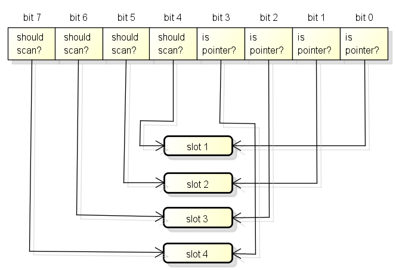
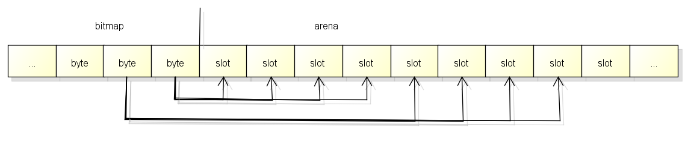
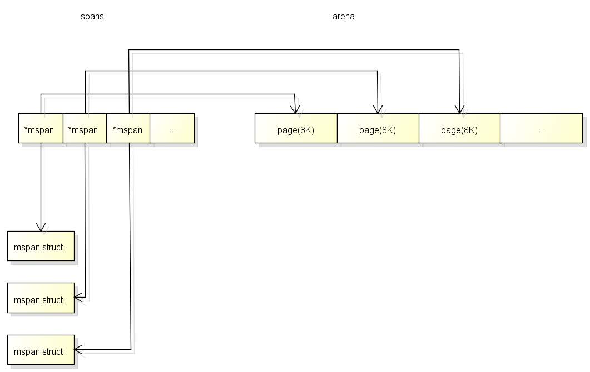
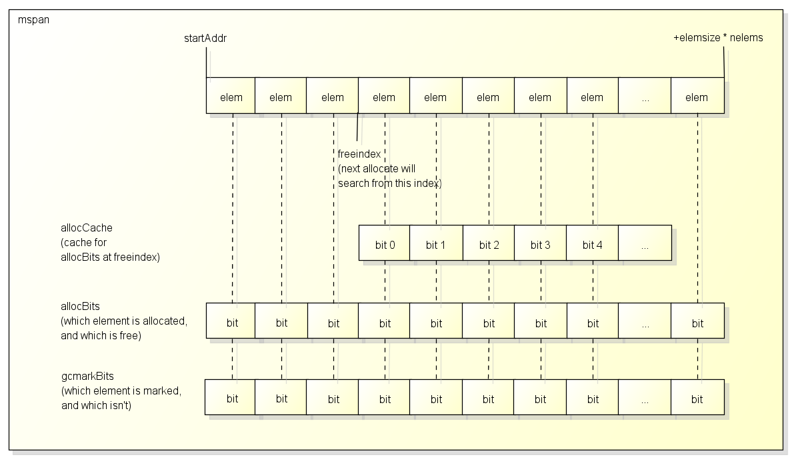
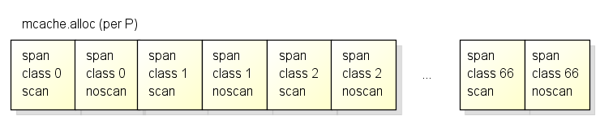
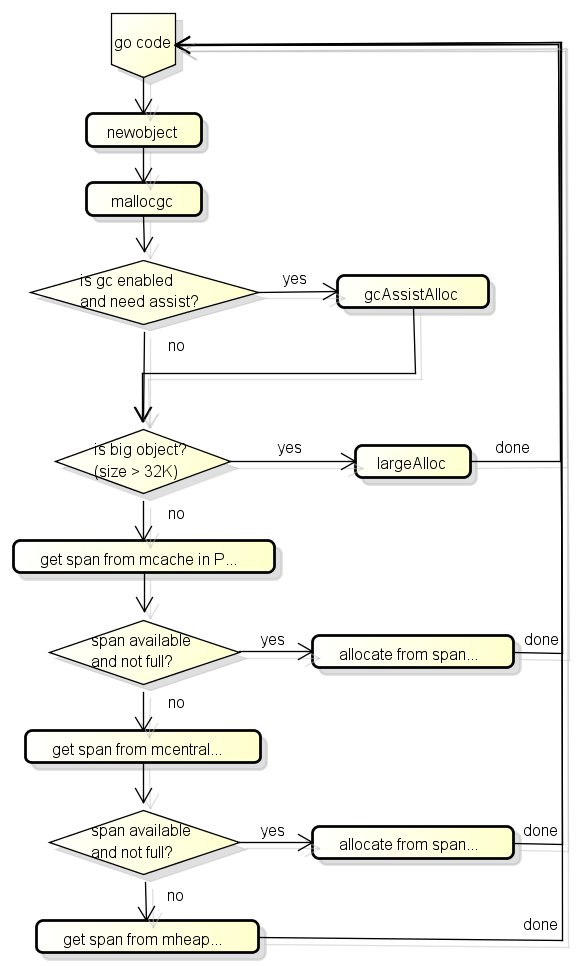
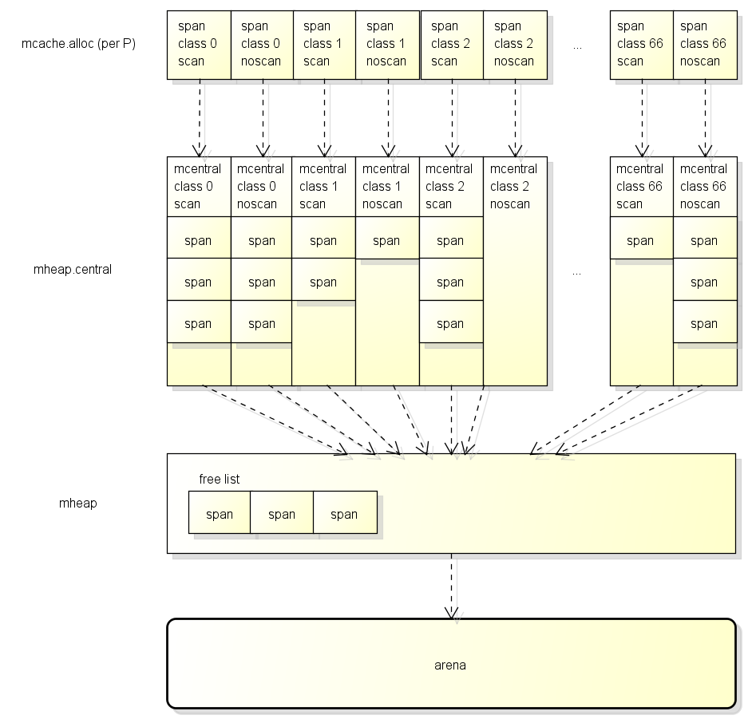
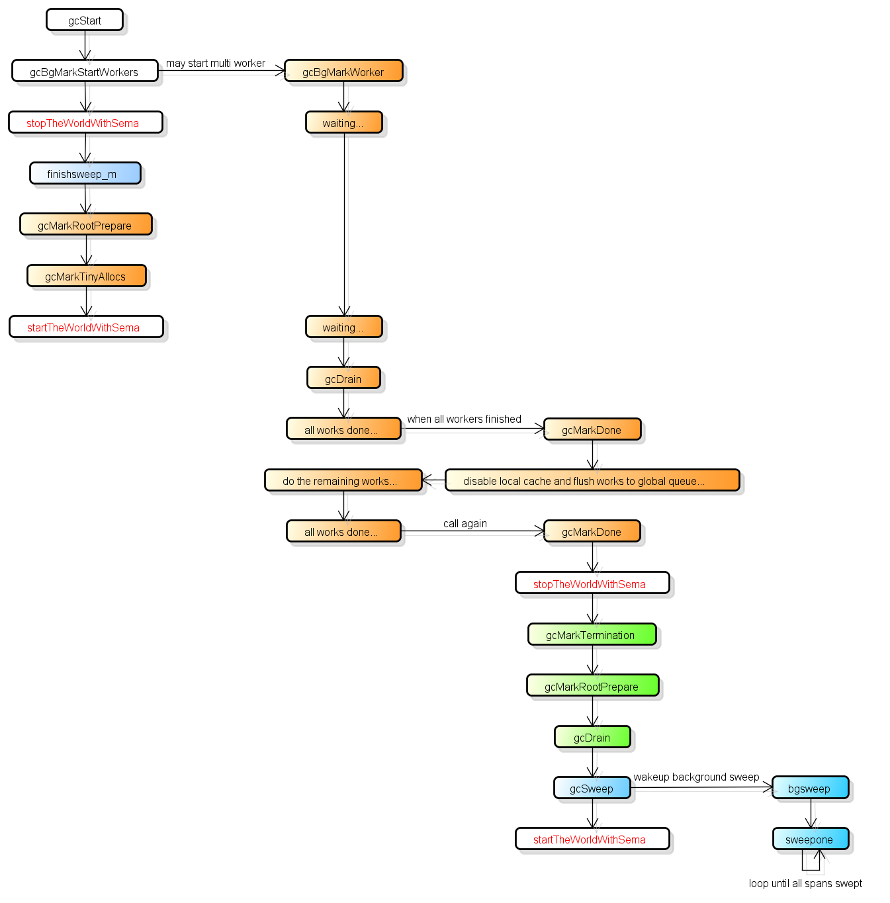

Golang源码探索(三) GC的实现原理

Golang从1.5开始引入了三色GC, 经过多次改进, 当前的1.9版本的GC停顿时间已经可以做到极短.
停顿时间的减少意味着"最大响应时间"的缩短, 这也让go更适合编写网络服务程序.
这篇文章将通过分析golang的源代码来讲解go中的三色GC的实现原理.

这个系列分析的golang源代码是Google官方的实现的1.9.2版本, 不适用于其他版本和gccgo等其他实现,
运行环境是Ubuntu 16.04 LTS 64bit.
首先会讲解基础概念, 然后讲解分配器, 再讲解收集器的实现.

# 基础概念

### 内存结构

go在程序启动时会分配一块虚拟内存地址是连续的内存, 结构如下:


这一块内存分为了3个区域, 在X64上大小分别是512M, 16G和512G, 它们的作用如下:

**arena**

arena区域就是我们通常说的**heap**, go从heap分配的内存都在这个区域中.

**bitmap**

bitmap区域用于表示arena区域中哪些地址保存了对象, 并且对象中哪些地址包含了**指针**.
bitmap区域中一个byte(8 bit)对应了arena区域中的四个指针大小的内存, 也就是2 bit对应一个指针大小的内存.
所以bitmap区域的大小是 512GB / 指针大小(8 byte) / 4 = 16GB.

bitmap区域中的一个byte对应arena区域的四个指针大小的内存的结构如下,
每一个指针大小的内存都会有两个bit分别表示是否应该继续扫描和是否包含指针:



bitmap中的byte和arena的对应关系从末尾开始, 也就是随着内存分配会向两边扩展:



**spans**

spans区域用于表示arena区中的某一页(Page)属于哪个span, 什么是span将在下面介绍.
spans区域中一个指针(8 byte)对应了arena区域中的一页(在go中一页=8KB).
所以spans的大小是 512GB / 页大小(8KB) * 指针大小(8 byte) = 512MB.

spans区域的一个指针对应arena区域的一页的结构如下, 和bitmap不一样的是对应关系会从开头开始:



### 什么时候从Heap分配对象

很多讲解go的文章和书籍中都提到过, go会自动确定哪些对象应该放在栈上, 哪些对象应该放在堆上.
简单的来说, 当一个对象的内容可能在生成该对象的函数结束后被访问, 那么这个对象就会分配在堆上.
在堆上分配对象的情况包括:

- 返回对象的指针
- 传递了对象的指针到其他函数
- 在闭包中使用了对象并且需要修改对象
- 使用new

在C语言中函数返回在栈上的对象的指针是非常危险的事情, 但在go中却是安全的, 因为这个对象会自动在堆上分配.
go决定是否使用堆分配对象的过程也叫"逃逸分析".

### GC Bitmap

GC在标记时需要知道哪些地方包含了指针, 例如上面提到的bitmap区域涵盖了arena区域中的指针信息.
除此之外, GC还需要知道栈空间上哪些地方包含了指针,
因为栈空间不属于arena区域, 栈空间的指针信息将会在**函数信息**里面.
另外, GC在分配对象时也需要根据对象的类型设置bitmap区域, 来源的指针信息将会在**类型信息**里面.

总结起来go中有以下的GC Bitmap:

- bitmap区域: 涵盖了arena区域, 使用2 bit表示一个指针大小的内存
- 函数信息: 涵盖了函数的栈空间, 使用1 bit表示一个指针大小的内存 (位于stackmap.bytedata)
- 类型信息: 在分配对象时会复制到bitmap区域, 使用1 bit表示一个指针大小的内存 (位于_type.gcdata)

### Span

span是用于分配对象的区块, 下图是简单说明了Span的内部结构:



通常一个span包含了多个大小相同的元素, 一个元素会保存一个对象, 除非:

- span用于保存大对象, 这种情况span只有一个元素
- span用于保存极小对象且不包含指针的对象(tiny object), 这种情况span会用一个元素保存多个对象

span中有一个freeindex标记下一次分配对象时应该开始搜索的地址, 分配后freeindex会增加,
在freeindex之前的元素都是已分配的, 在freeindex之后的元素有可能已分配, 也有可能未分配.

span每次GC以后都可能会回收掉一些元素, allocBits用于标记哪些元素是已分配的, 哪些元素是未分配的.
使用freeindex + allocBits可以在分配时跳过已分配的元素, 把对象设置在未分配的元素中,
但因为每次都去访问allocBits效率会比较慢, span中有一个整数型的allocCache用于缓存freeindex开始的bitmap, 缓存的bit值与原值相反.

gcmarkBits用于在gc时标记哪些对象存活, **每次gc以后gcmarkBits会变为allocBits**.
需要注意的是span结构本身的内存是从系统分配的, 上面提到的spans区域和bitmap区域都只是一个索引.

### Span的类型

span根据大小可以分为67个类型, 如下:

``` text
// class  bytes/obj  bytes/span  objects  tail waste  max waste
//     1          8        8192     1024           0     87.50%
//     2         16        8192      512           0     43.75%
//     3         32        8192      256           0     46.88%
//     4         48        8192      170          32     31.52%
//     5         64        8192      128           0     23.44%
//     6         80        8192      102          32     19.07%
//     7         96        8192       85          32     15.95%
//     8        112        8192       73          16     13.56%
//     9        128        8192       64           0     11.72%
//    10        144        8192       56         128     11.82%
//    11        160        8192       51          32      9.73%
//    12        176        8192       46          96      9.59%
//    13        192        8192       42         128      9.25%
//    14        208        8192       39          80      8.12%
//    15        224        8192       36         128      8.15%
//    16        240        8192       34          32      6.62%
//    17        256        8192       32           0      5.86%
//    18        288        8192       28         128     12.16%
//    19        320        8192       25         192     11.80%
//    20        352        8192       23          96      9.88%
//    21        384        8192       21         128      9.51%
//    22        416        8192       19         288     10.71%
//    23        448        8192       18         128      8.37%
//    24        480        8192       17          32      6.82%
//    25        512        8192       16           0      6.05%
//    26        576        8192       14         128     12.33%
//    27        640        8192       12         512     15.48%
//    28        704        8192       11         448     13.93%
//    29        768        8192       10         512     13.94%
//    30        896        8192        9         128     15.52%
//    31       1024        8192        8           0     12.40%
//    32       1152        8192        7         128     12.41%
//    33       1280        8192        6         512     15.55%
//    34       1408       16384       11         896     14.00%
//    35       1536        8192        5         512     14.00%
//    36       1792       16384        9         256     15.57%
//    37       2048        8192        4           0     12.45%
//    38       2304       16384        7         256     12.46%
//    39       2688        8192        3         128     15.59%
//    40       3072       24576        8           0     12.47%
//    41       3200       16384        5         384      6.22%
//    42       3456       24576        7         384      8.83%
//    43       4096        8192        2           0     15.60%
//    44       4864       24576        5         256     16.65%
//    45       5376       16384        3         256     10.92%
//    46       6144       24576        4           0     12.48%
//    47       6528       32768        5         128      6.23%
//    48       6784       40960        6         256      4.36%
//    49       6912       49152        7         768      3.37%
//    50       8192        8192        1           0     15.61%
//    51       9472       57344        6         512     14.28%
//    52       9728       49152        5         512      3.64%
//    53      10240       40960        4           0      4.99%
//    54      10880       32768        3         128      6.24%
//    55      12288       24576        2           0     11.45%
//    56      13568       40960        3         256      9.99%
//    57      14336       57344        4           0      5.35%
//    58      16384       16384        1           0     12.49%
//    59      18432       73728        4           0     11.11%
//    60      19072       57344        3         128      3.57%
//    61      20480       40960        2           0      6.87%
//    62      21760       65536        3         256      6.25%
//    63      24576       24576        1           0     11.45%
//    64      27264       81920        3         128     10.00%
//    65      28672       57344        2           0      4.91%
//    66      32768       32768        1           0     12.50%
```

以类型(class)为1的span为例,
span中的元素大小是8 byte, span本身占1页也就是8K, 一共可以保存1024个对象.

在分配对象时, 会根据对象的大小决定使用什么类型的span,
例如16 byte的对象会使用span 2, 17 byte的对象会使用span 3, 32 byte的对象会使用span 3.
从这个例子也可以看到, 分配17和32 byte的对象都会使用span 3, 也就是说部分大小的对象在分配时会浪费一定的空间.

有人可能会注意到, 上面最大的span的元素大小是32K, 那么分配超过32K的对象会在哪里分配呢?
超过32K的对象称为"大对象", 分配大对象时, 会直接从heap分配一个特殊的span,
这个特殊的span的类型(class)是0, 只包含了一个大对象, span的大小由对象的大小决定.

特殊的span加上的66个标准的span, 一共组成了67个span类型.

### Span的位置

在[前一篇](http://www.cnblogs.com/zkweb/p/7815600.html)中我提到了P是一个虚拟的资源, 同一时间只能有一个线程访问同一个P, 所以P中的数据不需要锁.
为了分配对象时有更好的性能, 各个P中都有span的缓存(也叫mcache), 缓存的结构如下:



各个P中按span类型的不同, 有67*2=134个span的缓存,

其中scan和noscan的区别在于,
如果对象包含了指针, 分配对象时会使用scan的span,
如果对象不包含指针, 分配对象时会使用noscan的span.
把span分为scan和noscan的意义在于,
GC扫描对象的时候对于noscan的span可以不去查看bitmap区域来标记子对象, 这样可以大幅提升标记的效率.

在分配对象时将会从以下的位置获取适合的span用于分配:

- 首先从P的缓存(mcache)获取, 如果有缓存的span并且未满则使用, 这个步骤不需要锁
- 然后从全局缓存(mcentral)获取, 如果获取成功则设置到P, 这个步骤需要锁
- 最后从mheap获取, 获取后设置到全局缓存, 这个步骤需要锁

在P中缓存span的做法跟CoreCLR中线程缓存分配上下文(Allocation Context)的做法相似,
都可以让分配对象时大部分时候不需要线程锁, 改进分配的性能.

# 分配对象的处理

### 分配对象的流程

go从堆分配对象时会调用newobject函数, 这个函数的流程大致如下:



首先会检查GC是否在工作中, 如果GC在工作中并且当前的G分配了一定大小的内存则需要协助GC做一定的工作,
这个机制叫GC Assist, 用于防止分配内存太快导致GC回收跟不上的情况发生.

之后会判断是小对象还是大对象, 如果是大对象则直接调用largeAlloc从堆中分配,
如果是小对象分3个阶段获取可用的span, 然后从span中分配对象:

- 首先从P的缓存(mcache)获取
- 然后从全局缓存(mcentral)获取, 全局缓存中有可用的span的列表
- 最后从mheap获取, mheap中也有span的自由列表, 如果都获取失败则从arena区域分配

这三个阶段的详细结构如下图:



### 数据类型的定义

分配对象涉及的数据类型包含:

[p](https://github.com/golang/go/blob/go1.9.2/src/runtime/runtime2.go#L450): 前一篇提到过, P是协程中的用于运行go代码的虚拟资源
[m](https://github.com/golang/go/blob/go1.9.2/src/runtime/runtime2.go#L383): 前一篇提到过, M目前代表系统线程
[g](https://github.com/golang/go/blob/go1.9.2/src/runtime/runtime2.go#L320): 前一篇提到过, G就是goroutine
[mspan](https://github.com/golang/go/blob/go1.9.2/src/runtime/mheap.go#L222): 用于分配对象的区块
[mcentral](https://github.com/golang/go/blob/go1.9.2/src/runtime/mcentral.go#L20): 全局的mspan缓存, 一共有67*2=134个
[mheap](https://github.com/golang/go/blob/go1.9.2/src/runtime/mheap.go#L30): 用于管理heap的对象, 全局只有一个

### 源代码分析

go从堆分配对象时会调用[newobject](https://github.com/golang/go/blob/go1.9.2/src/runtime/malloc.go#L840)函数, 先从这个函数看起:

``` go
// implementation of new builtin
// compiler (both frontend and SSA backend) knows the signature
// of this function
func newobject(typ *_type) unsafe.Pointer {
	return mallocgc(typ.size, typ, true)
}
```

[newobject](https://github.com/golang/go/blob/go1.9.2/src/runtime/malloc.go#L840)调用了[mallocgc](https://github.com/golang/go/blob/go1.9.2/src/runtime/malloc.go#L581)函数:

``` go
// Allocate an object of size bytes.
// Small objects are allocated from the per-P cache's free lists.
// Large objects (> 32 kB) are allocated straight from the heap.
func mallocgc(size uintptr, typ *_type, needzero bool) unsafe.Pointer {
	if gcphase == _GCmarktermination {
		throw("mallocgc called with gcphase == _GCmarktermination")
	}

	if size == 0 {
		return unsafe.Pointer(&zerobase)
	}

	if debug.sbrk != 0 {
		align := uintptr(16)
		if typ != nil {
			align = uintptr(typ.align)
		}
		return persistentalloc(size, align, &memstats.other_sys)
	}

	// 判断是否要辅助GC工作
	// gcBlackenEnabled在GC的标记阶段会开启
	// assistG is the G to charge for this allocation, or nil if
	// GC is not currently active.
	var assistG *g
	if gcBlackenEnabled != 0 {
		// Charge the current user G for this allocation.
		assistG = getg()
		if assistG.m.curg != nil {
			assistG = assistG.m.curg
		}
		// Charge the allocation against the G. We'll account
		// for internal fragmentation at the end of mallocgc.
		assistG.gcAssistBytes -= int64(size)

		// 会按分配的大小判断需要协助GC完成多少工作
		// 具体的算法将在下面讲解收集器时说明
		if assistG.gcAssistBytes < 0 {
			// This G is in debt. Assist the GC to correct
			// this before allocating. This must happen
			// before disabling preemption.
			gcAssistAlloc(assistG)
		}
	}

	// 增加当前G对应的M的lock计数, 防止这个G被抢占
	// Set mp.mallocing to keep from being preempted by GC.
	mp := acquirem()
	if mp.mallocing != 0 {
		throw("malloc deadlock")
	}
	if mp.gsignal == getg() {
		throw("malloc during signal")
	}
	mp.mallocing = 1

	shouldhelpgc := false
	dataSize := size
	// 获取当前G对应的M对应的P的本地span缓存(mcache)
	// 因为M在拥有P后会把P的mcache设到M中, 这里返回的是getg().m.mcache
	c := gomcache()
	var x unsafe.Pointer
	noscan := typ == nil || typ.kind&kindNoPointers != 0
	// 判断是否小对象, maxSmallSize当前的值是32K
	if size <= maxSmallSize {
		// 如果对象不包含指针, 并且对象的大小小于16 bytes, 可以做特殊处理
		// 这里是针对非常小的对象的优化, 因为span的元素最小只能是8 byte, 如果对象更小那么很多空间都会被浪费掉
		// 非常小的对象可以整合在"class 2 noscan"的元素(大小为16 byte)中
		if noscan && size < maxTinySize {
			// Tiny allocator.
			//
			// Tiny allocator combines several tiny allocation requests
			// into a single memory block. The resulting memory block
			// is freed when all subobjects are unreachable. The subobjects
			// must be noscan (don't have pointers), this ensures that
			// the amount of potentially wasted memory is bounded.
			//
			// Size of the memory block used for combining (maxTinySize) is tunable.
			// Current setting is 16 bytes, which relates to 2x worst case memory
			// wastage (when all but one subobjects are unreachable).
			// 8 bytes would result in no wastage at all, but provides less
			// opportunities for combining.
			// 32 bytes provides more opportunities for combining,
			// but can lead to 4x worst case wastage.
			// The best case winning is 8x regardless of block size.
			//
			// Objects obtained from tiny allocator must not be freed explicitly.
			// So when an object will be freed explicitly, we ensure that
			// its size >= maxTinySize.
			//
			// SetFinalizer has a special case for objects potentially coming
			// from tiny allocator, it such case it allows to set finalizers
			// for an inner byte of a memory block.
			//
			// The main targets of tiny allocator are small strings and
			// standalone escaping variables. On a json benchmark
			// the allocator reduces number of allocations by ~12% and
			// reduces heap size by ~20%.
			off := c.tinyoffset
			// Align tiny pointer for required (conservative) alignment.
			if size&7 == 0 {
				off = round(off, 8)
			} else if size&3 == 0 {
				off = round(off, 4)
			} else if size&1 == 0 {
				off = round(off, 2)
			}
			if off+size <= maxTinySize && c.tiny != 0 {
				// The object fits into existing tiny block.
				x = unsafe.Pointer(c.tiny + off)
				c.tinyoffset = off + size
				c.local_tinyallocs++
				mp.mallocing = 0
				releasem(mp)
				return x
			}
			// Allocate a new maxTinySize block.
			span := c.alloc[tinySpanClass]
			v := nextFreeFast(span)
			if v == 0 {
				v, _, shouldhelpgc = c.nextFree(tinySpanClass)
			}
			x = unsafe.Pointer(v)
			(*[2]uint64)(x)[0] = 0
			(*[2]uint64)(x)[1] = 0
			// See if we need to replace the existing tiny block with the new one
			// based on amount of remaining free space.
			if size < c.tinyoffset || c.tiny == 0 {
				c.tiny = uintptr(x)
				c.tinyoffset = size
			}
			size = maxTinySize
		} else {
			// 否则按普通的小对象分配
			// 首先获取对象的大小应该使用哪个span类型
			var sizeclass uint8
			if size <= smallSizeMax-8 {
				sizeclass = size_to_class8[(size+smallSizeDiv-1)/smallSizeDiv]
			} else {
				sizeclass = size_to_class128[(size-smallSizeMax+largeSizeDiv-1)/largeSizeDiv]
			}
			size = uintptr(class_to_size[sizeclass])
			// 等于sizeclass * 2 + (noscan ? 1 : 0)
			spc := makeSpanClass(sizeclass, noscan)
			span := c.alloc[spc]
			// 尝试快速的从这个span中分配
			v := nextFreeFast(span)
			if v == 0 {
				// 分配失败, 可能需要从mcentral或者mheap中获取
				// 如果从mcentral或者mheap获取了新的span, 则shouldhelpgc会等于true
				// shouldhelpgc会等于true时会在下面判断是否要触发GC
				v, span, shouldhelpgc = c.nextFree(spc)
			}
			x = unsafe.Pointer(v)
			if needzero && span.needzero != 0 {
				memclrNoHeapPointers(unsafe.Pointer(v), size)
			}
		}
	} else {
		// 大对象直接从mheap分配, 这里的s是一个特殊的span, 它的class是0
		var s *mspan
		shouldhelpgc = true
		systemstack(func() {
			s = largeAlloc(size, needzero, noscan)
		})
		s.freeindex = 1
		s.allocCount = 1
		x = unsafe.Pointer(s.base())
		size = s.elemsize
	}

	// 设置arena对应的bitmap, 记录哪些位置包含了指针, GC会使用bitmap扫描所有可到达的对象
	var scanSize uintptr
	if !noscan {
		// If allocating a defer+arg block, now that we've picked a malloc size
		// large enough to hold everything, cut the "asked for" size down to
		// just the defer header, so that the GC bitmap will record the arg block
		// as containing nothing at all (as if it were unused space at the end of
		// a malloc block caused by size rounding).
		// The defer arg areas are scanned as part of scanstack.
		if typ == deferType {
			dataSize = unsafe.Sizeof(_defer{})
		}
		// 这个函数非常的长, 有兴趣的可以看
		// https://github.com/golang/go/blob/go1.9.2/src/runtime/mbitmap.go#L855
		// 虽然代码很长但是设置的内容跟上面说过的bitmap区域的结构一样
		// 根据类型信息设置scan bit跟pointer bit, scan bit成立表示应该继续扫描, pointer bit成立表示该位置是指针
		// 需要注意的地方有
		// - 如果一个类型只有开头的地方包含指针, 例如[ptr, ptr, large non-pointer data]
		//   那么后面的部分的scan bit将会为0, 这样可以大幅提升标记的效率
		// - 第二个slot的scan bit用途比较特殊, 它并不用于标记是否继续scan, 而是标记checkmark
		// 什么是checkmark
		// - 因为go的并行GC比较复杂, 为了检查实现是否正确, go需要在有一个检查所有应该被标记的对象是否被标记的机制
		//   这个机制就是checkmark, 在开启checkmark时go会在标记阶段的最后停止整个世界然后重新执行一次标记
		//   上面的第二个slot的scan bit就是用于标记对象在checkmark标记中是否被标记的
		// - 有的人可能会发现第二个slot要求对象最少有两个指针的大小, 那么只有一个指针的大小的对象呢?
		//   只有一个指针的大小的对象可以分为两种情况
		//   对象就是指针, 因为大小刚好是1个指针所以并不需要看bitmap区域, 这时第一个slot就是checkmark
		//   对象不是指针, 因为有tiny alloc的机制, 不是指针且只有一个指针大小的对象会分配在两个指针的span中
		//               这时候也不需要看bitmap区域, 所以和上面一样第一个slot就是checkmark
		heapBitsSetType(uintptr(x), size, dataSize, typ)
		if dataSize > typ.size {
			// Array allocation. If there are any
			// pointers, GC has to scan to the last
			// element.
			if typ.ptrdata != 0 {
				scanSize = dataSize - typ.size + typ.ptrdata
			}
		} else {
			scanSize = typ.ptrdata
		}
		c.local_scan += scanSize
	}

	// 内存屏障, 因为x86和x64的store不会乱序所以这里只是个针对编译器的屏障, 汇编中是ret
	// Ensure that the stores above that initialize x to
	// type-safe memory and set the heap bits occur before
	// the caller can make x observable to the garbage
	// collector. Otherwise, on weakly ordered machines,
	// the garbage collector could follow a pointer to x,
	// but see uninitialized memory or stale heap bits.
	publicationBarrier()

	// 如果当前在GC中, 需要立刻标记分配后的对象为"黑色", 防止它被回收
	// Allocate black during GC.
	// All slots hold nil so no scanning is needed.
	// This may be racing with GC so do it atomically if there can be
	// a race marking the bit.
	if gcphase != _GCoff {
		gcmarknewobject(uintptr(x), size, scanSize)
	}

	// Race Detector的处理(用于检测线程冲突问题)
	if raceenabled {
		racemalloc(x, size)
	}

	// Memory Sanitizer的处理(用于检测危险指针等内存问题)
	if msanenabled {
		msanmalloc(x, size)
	}

	// 重新允许当前的G被抢占
	mp.mallocing = 0
	releasem(mp)

	// 除错记录
	if debug.allocfreetrace != 0 {
		tracealloc(x, size, typ)
	}

	// Profiler记录
	if rate := MemProfileRate; rate > 0 {
		if size < uintptr(rate) && int32(size) < c.next_sample {
			c.next_sample -= int32(size)
		} else {
			mp := acquirem()
			profilealloc(mp, x, size)
			releasem(mp)
		}
	}

	// gcAssistBytes减去"实际分配大小 - 要求分配大小", 调整到准确值
	if assistG != nil {
		// Account for internal fragmentation in the assist
		// debt now that we know it.
		assistG.gcAssistBytes -= int64(size - dataSize)
	}

	// 如果之前获取了新的span, 则判断是否需要后台启动GC
	// 这里的判断逻辑(gcTrigger)会在下面详细说明
	if shouldhelpgc {
		if t := (gcTrigger{kind: gcTriggerHeap}); t.test() {
			gcStart(gcBackgroundMode, t)
		}
	}

	return x
}
```

接下来看看如何从span里面分配对象, 首先会调用[nextFreeFast](https://github.com/golang/go/blob/go1.9.2/src/runtime/malloc.go#L521)尝试快速分配:

``` go
// nextFreeFast returns the next free object if one is quickly available.
// Otherwise it returns 0.
func nextFreeFast(s *mspan) gclinkptr {
	// 获取第一个非0的bit是第几个bit, 也就是哪个元素是未分配的
	theBit := sys.Ctz64(s.allocCache) // Is there a free object in the allocCache?
	// 找到未分配的元素
	if theBit < 64 {
		result := s.freeindex + uintptr(theBit)
		// 要求索引值小于元素数量
		if result < s.nelems {
			// 下一个freeindex
			freeidx := result + 1
			// 可以被64整除时需要特殊处理(参考nextFree)
			if freeidx%64 == 0 && freeidx != s.nelems {
				return 0
			}
			// 更新freeindex和allocCache(高位都是0, 用尽以后会更新)
			s.allocCache >>= uint(theBit + 1)
			s.freeindex = freeidx
			// 返回元素所在的地址
			v := gclinkptr(result*s.elemsize + s.base())
			// 添加已分配的元素计数
			s.allocCount++
			return v
		}
	}
	return 0
}
```

如果在freeindex后无法快速找到未分配的元素, 就需要调用[nextFree](https://github.com/golang/go/blob/go1.9.2/src/runtime/malloc.go#L546)做出更复杂的处理:

``` go
// nextFree returns the next free object from the cached span if one is available.
// Otherwise it refills the cache with a span with an available object and
// returns that object along with a flag indicating that this was a heavy
// weight allocation. If it is a heavy weight allocation the caller must
// determine whether a new GC cycle needs to be started or if the GC is active
// whether this goroutine needs to assist the GC.
func (c *mcache) nextFree(spc spanClass) (v gclinkptr, s *mspan, shouldhelpgc bool) {
	// 找到下一个freeindex和更新allocCache
	s = c.alloc[spc]
	shouldhelpgc = false
	freeIndex := s.nextFreeIndex()
	// 如果span里面所有元素都已分配, 则需要获取新的span
	if freeIndex == s.nelems {
		// The span is full.
		if uintptr(s.allocCount) != s.nelems {
			println("runtime: s.allocCount=", s.allocCount, "s.nelems=", s.nelems)
			throw("s.allocCount != s.nelems && freeIndex == s.nelems")
		}
		// 申请新的span
		systemstack(func() {
			c.refill(spc)
		})
		// 获取申请后的新的span, 并设置需要检查是否执行GC
		shouldhelpgc = true
		s = c.alloc[spc]

		freeIndex = s.nextFreeIndex()
	}

	if freeIndex >= s.nelems {
		throw("freeIndex is not valid")
	}

	// 返回元素所在的地址
	v = gclinkptr(freeIndex*s.elemsize + s.base())
	// 添加已分配的元素计数
	s.allocCount++
	if uintptr(s.allocCount) > s.nelems {
		println("s.allocCount=", s.allocCount, "s.nelems=", s.nelems)
		throw("s.allocCount > s.nelems")
	}
	return
}
```

如果mcache中指定类型的span已满, 就需要调用[refill](https://github.com/golang/go/blob/go1.9.2/src/runtime/mcache.go#L107)函数申请新的span:

``` go
// Gets a span that has a free object in it and assigns it
// to be the cached span for the given sizeclass. Returns this span.
func (c *mcache) refill(spc spanClass) *mspan {
	_g_ := getg()

	// 防止G被抢占
	_g_.m.locks++
	// Return the current cached span to the central lists.
	s := c.alloc[spc]

	// 确保当前的span所有元素都已分配
	if uintptr(s.allocCount) != s.nelems {
		throw("refill of span with free space remaining")
	}

	// 设置span的incache属性, 除非是全局使用的空span(也就是mcache里面span指针的默认值)
	if s != &emptymspan {
		s.incache = false
	}

	// 向mcentral申请一个新的span
	// Get a new cached span from the central lists.
	s = mheap_.central[spc].mcentral.cacheSpan()
	if s == nil {
		throw("out of memory")
	}

	if uintptr(s.allocCount) == s.nelems {
		throw("span has no free space")
	}

	// 设置新的span到mcache中
	c.alloc[spc] = s
	// 允许G被抢占
	_g_.m.locks--
	return s
}
```

向mcentral申请一个新的span会通过[cacheSpan](https://github.com/golang/go/blob/go1.9.2/src/runtime/mcentral.go#L40)函数:
mcentral首先尝试从内部的链表复用原有的span, 如果复用失败则向mheap申请.

``` go
// Allocate a span to use in an MCache.
func (c *mcentral) cacheSpan() *mspan {
	// 让当前G协助一部分的sweep工作
	// Deduct credit for this span allocation and sweep if necessary.
	spanBytes := uintptr(class_to_allocnpages[c.spanclass.sizeclass()]) * _PageSize
	deductSweepCredit(spanBytes, 0)

	// 对mcentral上锁, 因为可能会有多个M(P)同时访问
	lock(&c.lock)
	traceDone := false
	if trace.enabled {
		traceGCSweepStart()
	}
	sg := mheap_.sweepgen
retry:
	// mcentral里面有两个span的链表
	// - nonempty表示确定该span最少有一个未分配的元素
	// - empty表示不确定该span最少有一个未分配的元素
	// 这里优先查找nonempty的链表
	// sweepgen每次GC都会增加2
	// - sweepgen == 全局sweepgen, 表示span已经sweep过
	// - sweepgen == 全局sweepgen-1, 表示span正在sweep
	// - sweepgen == 全局sweepgen-2, 表示span等待sweep
	var s *mspan
	for s = c.nonempty.first; s != nil; s = s.next {
		// 如果span等待sweep, 尝试原子修改sweepgen为全局sweepgen-1
		if s.sweepgen == sg-2 && atomic.Cas(&s.sweepgen, sg-2, sg-1) {
			// 修改成功则把span移到empty链表, sweep它然后跳到havespan
			c.nonempty.remove(s)
			c.empty.insertBack(s)
			unlock(&c.lock)
			s.sweep(true)
			goto havespan
		}
		// 如果这个span正在被其他线程sweep, 就跳过
		if s.sweepgen == sg-1 {
			// the span is being swept by background sweeper, skip
			continue
		}
		// span已经sweep过
		// 因为nonempty链表中的span确定最少有一个未分配的元素, 这里可以直接使用它
		// we have a nonempty span that does not require sweeping, allocate from it
		c.nonempty.remove(s)
		c.empty.insertBack(s)
		unlock(&c.lock)
		goto havespan
	}

	// 查找empty的链表
	for s = c.empty.first; s != nil; s = s.next {
		// 如果span等待sweep, 尝试原子修改sweepgen为全局sweepgen-1
		if s.sweepgen == sg-2 && atomic.Cas(&s.sweepgen, sg-2, sg-1) {
			// 把span放到empty链表的最后
			// we have an empty span that requires sweeping,
			// sweep it and see if we can free some space in it
			c.empty.remove(s)
			// swept spans are at the end of the list
			c.empty.insertBack(s)
			unlock(&c.lock)
			// 尝试sweep
			s.sweep(true)
			// sweep以后还需要检测是否有未分配的对象, 如果有则可以使用它
			freeIndex := s.nextFreeIndex()
			if freeIndex != s.nelems {
				s.freeindex = freeIndex
				goto havespan
			}
			lock(&c.lock)
			// the span is still empty after sweep
			// it is already in the empty list, so just retry
			goto retry
		}
		// 如果这个span正在被其他线程sweep, 就跳过
		if s.sweepgen == sg-1 {
			// the span is being swept by background sweeper, skip
			continue
		}
		// 找不到有未分配对象的span
		// already swept empty span,
		// all subsequent ones must also be either swept or in process of sweeping
		break
	}
	if trace.enabled {
		traceGCSweepDone()
		traceDone = true
	}
	unlock(&c.lock)

	// 找不到有未分配对象的span, 需要从mheap分配
	// 分配完成后加到empty链表中
	// Replenish central list if empty.
	s = c.grow()
	if s == nil {
		return nil
	}
	lock(&c.lock)
	c.empty.insertBack(s)
	unlock(&c.lock)

	// At this point s is a non-empty span, queued at the end of the empty list,
	// c is unlocked.
havespan:
	if trace.enabled && !traceDone {
		traceGCSweepDone()
	}
	// 统计span中未分配的元素数量, 加到mcentral.nmalloc中
	// 统计span中未分配的元素总大小, 加到memstats.heap_live中
	cap := int32((s.npages << _PageShift) / s.elemsize)
	n := cap - int32(s.allocCount)
	if n == 0 || s.freeindex == s.nelems || uintptr(s.allocCount) == s.nelems {
		throw("span has no free objects")
	}
	// Assume all objects from this span will be allocated in the
	// mcache. If it gets uncached, we'll adjust this.
	atomic.Xadd64(&c.nmalloc, int64(n))
	usedBytes := uintptr(s.allocCount) * s.elemsize
	atomic.Xadd64(&memstats.heap_live, int64(spanBytes)-int64(usedBytes))
	// 跟踪处理
	if trace.enabled {
		// heap_live changed.
		traceHeapAlloc()
	}
	// 如果当前在GC中, 因为heap_live改变了, 重新调整G辅助标记工作的值
	// 详细请参考下面对revise函数的解析
	if gcBlackenEnabled != 0 {
		// heap_live changed.
		gcController.revise()
	}
	// 设置span的incache属性, 表示span正在mcache中
	s.incache = true
	// 根据freeindex更新allocCache
	freeByteBase := s.freeindex &^ (64 - 1)
	whichByte := freeByteBase / 8
	// Init alloc bits cache.
	s.refillAllocCache(whichByte)

	// Adjust the allocCache so that s.freeindex corresponds to the low bit in
	// s.allocCache.
	s.allocCache >>= s.freeindex % 64

	return s
}
```

mcentral向mheap申请一个新的span会使用[grow](https://github.com/golang/go/blob/go1.9.2/src/runtime/mcentral.go#L227)函数:

```
// grow allocates a new empty span from the heap and initializes it for c's size class.
func (c *mcentral) grow() *mspan {
	// 根据mcentral的类型计算需要申请的span的大小(除以8K = 有多少页)和可以保存多少个元素
	npages := uintptr(class_to_allocnpages[c.spanclass.sizeclass()])
	size := uintptr(class_to_size[c.spanclass.sizeclass()])
	n := (npages << _PageShift) / size

	// 向mheap申请一个新的span, 以页(8K)为单位
	s := mheap_.alloc(npages, c.spanclass, false, true)
	if s == nil {
		return nil
	}

	p := s.base()
	s.limit = p + size*n

	// 分配并初始化span的allocBits和gcmarkBits
	heapBitsForSpan(s.base()).initSpan(s)
	return s
}
```

mheap分配span的函数是[alloc](https://github.com/golang/go/blob/go1.9.2/src/runtime/mheap.go#L727):

``` go
func (h *mheap) alloc(npage uintptr, spanclass spanClass, large bool, needzero bool) *mspan {
	// 在g0的栈空间中调用alloc_m函数
	// 关于systemstack的说明请看前一篇文章
	// Don't do any operations that lock the heap on the G stack.
	// It might trigger stack growth, and the stack growth code needs
	// to be able to allocate heap.
	var s *mspan
	systemstack(func() {
		s = h.alloc_m(npage, spanclass, large)
	})

	if s != nil {
		if needzero && s.needzero != 0 {
			memclrNoHeapPointers(unsafe.Pointer(s.base()), s.npages<<_PageShift)
		}
		s.needzero = 0
	}
	return s
}
```

alloc函数会在g0的栈空间中调用[alloc_m](https://github.com/golang/go/blob/go1.9.2/src/runtime/mheap.go#L634)函数:

``` go
// Allocate a new span of npage pages from the heap for GC'd memory
// and record its size class in the HeapMap and HeapMapCache.
func (h *mheap) alloc_m(npage uintptr, spanclass spanClass, large bool) *mspan {
	_g_ := getg()
	if _g_ != _g_.m.g0 {
		throw("_mheap_alloc not on g0 stack")
	}
	// 对mheap上锁, 这里的锁是全局锁
	lock(&h.lock)

	// 为了防止heap增速太快, 在分配n页之前要先sweep和回收n页
	// 会先枚举busy列表然后再枚举busyLarge列表进行sweep, 具体参考reclaim和reclaimList函数
	// To prevent excessive heap growth, before allocating n pages
	// we need to sweep and reclaim at least n pages.
	if h.sweepdone == 0 {
		// TODO(austin): This tends to sweep a large number of
		// spans in order to find a few completely free spans
		// (for example, in the garbage benchmark, this sweeps
		// ~30x the number of pages its trying to allocate).
		// If GC kept a bit for whether there were any marks
		// in a span, we could release these free spans
		// at the end of GC and eliminate this entirely.
		if trace.enabled {
			traceGCSweepStart()
		}
		h.reclaim(npage)
		if trace.enabled {
			traceGCSweepDone()
		}
	}

	// 把mcache中的本地统计数据加到全局
	// transfer stats from cache to global
	memstats.heap_scan += uint64(_g_.m.mcache.local_scan)
	_g_.m.mcache.local_scan = 0
	memstats.tinyallocs += uint64(_g_.m.mcache.local_tinyallocs)
	_g_.m.mcache.local_tinyallocs = 0

	// 调用allocSpanLocked分配span, allocSpanLocked函数要求当前已经对mheap上锁
	s := h.allocSpanLocked(npage, &memstats.heap_inuse)
	if s != nil {
		// Record span info, because gc needs to be
		// able to map interior pointer to containing span.
		// 设置span的sweepgen = 全局sweepgen
		atomic.Store(&s.sweepgen, h.sweepgen)
		// 放到全局span列表中, 这里的sweepSpans的长度是2
		// sweepSpans[h.sweepgen/2%2]保存当前正在使用的span列表
		// sweepSpans[1-h.sweepgen/2%2]保存等待sweep的span列表
		// 因为每次gcsweepgen都会加2, 每次gc这两个列表都会交换
		h.sweepSpans[h.sweepgen/2%2].push(s) // Add to swept in-use list.
		// 初始化span成员
		s.state = _MSpanInUse
		s.allocCount = 0
		s.spanclass = spanclass
		if sizeclass := spanclass.sizeclass(); sizeclass == 0 {
			s.elemsize = s.npages << _PageShift
			s.divShift = 0
			s.divMul = 0
			s.divShift2 = 0
			s.baseMask = 0
		} else {
			s.elemsize = uintptr(class_to_size[sizeclass])
			m := &class_to_divmagic[sizeclass]
			s.divShift = m.shift
			s.divMul = m.mul
			s.divShift2 = m.shift2
			s.baseMask = m.baseMask
		}

		// update stats, sweep lists
		h.pagesInUse += uint64(npage)
		// 上面grow函数会传入true, 也就是通过grow调用到这里large会等于true
		// 添加已分配的span到busy列表, 如果页数超过_MaxMHeapList(128页=8K*128=1M)则放到busylarge列表
		if large {
			memstats.heap_objects++
			mheap_.largealloc += uint64(s.elemsize)
			mheap_.nlargealloc++
			atomic.Xadd64(&memstats.heap_live, int64(npage<<_PageShift))
			// Swept spans are at the end of lists.
			if s.npages < uintptr(len(h.busy)) {
				h.busy[s.npages].insertBack(s)
			} else {
				h.busylarge.insertBack(s)
			}
		}
	}
	// 如果当前在GC中, 因为heap_live改变了, 重新调整G辅助标记工作的值
	// 详细请参考下面对revise函数的解析
	// heap_scan and heap_live were updated.
	if gcBlackenEnabled != 0 {
		gcController.revise()
	}

	// 跟踪处理
	if trace.enabled {
		traceHeapAlloc()
	}

	// h.spans is accessed concurrently without synchronization
	// from other threads. Hence, there must be a store/store
	// barrier here to ensure the writes to h.spans above happen
	// before the caller can publish a pointer p to an object
	// allocated from s. As soon as this happens, the garbage
	// collector running on another processor could read p and
	// look up s in h.spans. The unlock acts as the barrier to
	// order these writes. On the read side, the data dependency
	// between p and the index in h.spans orders the reads.
	unlock(&h.lock)
	return s
}
```

继续查看[allocSpanLocked](https://github.com/golang/go/blob/go1.9.2/src/runtime/mheap.go#L784)函数:

``` go
// Allocates a span of the given size.  h must be locked.
// The returned span has been removed from the
// free list, but its state is still MSpanFree.
func (h *mheap) allocSpanLocked(npage uintptr, stat *uint64) *mspan {
	var list *mSpanList
	var s *mspan

	// 尝试在mheap中的自由列表分配
	// 页数小于_MaxMHeapList(128页=1M)的自由span都会在free列表中
	// 页数大于_MaxMHeapList的自由span都会在freelarge列表中
	// Try in fixed-size lists up to max.
	for i := int(npage); i < len(h.free); i++ {
		list = &h.free[i]
		if !list.isEmpty() {
			s = list.first
			list.remove(s)
			goto HaveSpan
		}
	}
	// free列表找不到则查找freelarge列表
	// 查找不到就向arena区域申请一个新的span加到freelarge中, 然后再查找freelarge列表
	// Best fit in list of large spans.
	s = h.allocLarge(npage) // allocLarge removed s from h.freelarge for us
	if s == nil {
		if !h.grow(npage) {
			return nil
		}
		s = h.allocLarge(npage)
		if s == nil {
			return nil
		}
	}

HaveSpan:
	// Mark span in use.
	if s.state != _MSpanFree {
		throw("MHeap_AllocLocked - MSpan not free")
	}
	if s.npages < npage {
		throw("MHeap_AllocLocked - bad npages")
	}
	// 如果span有已释放(解除虚拟内存和物理内存关系)的页, 提醒这些页会被使用然后更新统计数据
	if s.npreleased > 0 {
		sysUsed(unsafe.Pointer(s.base()), s.npages<<_PageShift)
		memstats.heap_released -= uint64(s.npreleased << _PageShift)
		s.npreleased = 0
	}

	// 如果获取到的span页数比要求的页数多
	// 分割剩余的页数到另一个span并且放到自由列表中
	if s.npages > npage {
		// Trim extra and put it back in the heap.
		t := (*mspan)(h.spanalloc.alloc())
		t.init(s.base()+npage<<_PageShift, s.npages-npage)
		s.npages = npage
		p := (t.base() - h.arena_start) >> _PageShift
		if p > 0 {
			h.spans[p-1] = s
		}
		h.spans[p] = t
		h.spans[p+t.npages-1] = t
		t.needzero = s.needzero
		s.state = _MSpanManual // prevent coalescing with s
		t.state = _MSpanManual
		h.freeSpanLocked(t, false, false, s.unusedsince)
		s.state = _MSpanFree
	}
	s.unusedsince = 0

	// 设置spans区域, 哪些地址对应哪个mspan对象
	p := (s.base() - h.arena_start) >> _PageShift
	for n := uintptr(0); n < npage; n++ {
		h.spans[p+n] = s
	}

	// 更新统计数据
	*stat += uint64(npage << _PageShift)
	memstats.heap_idle -= uint64(npage << _PageShift)

	//println("spanalloc", hex(s.start<<_PageShift))
	if s.inList() {
		throw("still in list")
	}
	return s
}
```

继续查看[allocLarge](https://github.com/golang/go/blob/go1.9.2/src/runtime/mheap.go#L867)函数:

``` go
// allocLarge allocates a span of at least npage pages from the treap of large spans.
// Returns nil if no such span currently exists.
func (h *mheap) allocLarge(npage uintptr) *mspan {
	// Search treap for smallest span with >= npage pages.
	return h.freelarge.remove(npage)
}
```

freelarge的类型是mTreap, 调用[remove](https://github.com/golang/go/blob/go1.9.2/src/runtime/mgclarge.go#L205)函数会在树里面搜索一个至少npage且在树中的最小的span返回:

``` go
// remove searches for, finds, removes from the treap, and returns the smallest
// span that can hold npages. If no span has at least npages return nil.
// This is slightly more complicated than a simple binary tree search
// since if an exact match is not found the next larger node is
// returned.
// If the last node inspected > npagesKey not holding
// a left node (a smaller npages) is the "best fit" node.
func (root *mTreap) remove(npages uintptr) *mspan {
	t := root.treap
	for t != nil {
		if t.spanKey == nil {
			throw("treap node with nil spanKey found")
		}
		if t.npagesKey < npages {
			t = t.right
		} else if t.left != nil && t.left.npagesKey >= npages {
			t = t.left
		} else {
			result := t.spanKey
			root.removeNode(t)
			return result
		}
	}
	return nil
}
```

向arena区域申请新span的函数是mheap类的[grow](https://github.com/golang/go/blob/go1.9.2/src/runtime/mheap.go#L876)函数:

``` go
// Try to add at least npage pages of memory to the heap,
// returning whether it worked.
//
// h must be locked.
func (h *mheap) grow(npage uintptr) bool {
	// Ask for a big chunk, to reduce the number of mappings
	// the operating system needs to track; also amortizes
	// the overhead of an operating system mapping.
	// Allocate a multiple of 64kB.
	npage = round(npage, (64<<10)/_PageSize)
	ask := npage << _PageShift
	if ask < _HeapAllocChunk {
		ask = _HeapAllocChunk
	}

	// 调用mheap.sysAlloc函数申请
	v := h.sysAlloc(ask)
	if v == nil {
		if ask > npage<<_PageShift {
			ask = npage << _PageShift
			v = h.sysAlloc(ask)
		}
		if v == nil {
			print("runtime: out of memory: cannot allocate ", ask, "-byte block (", memstats.heap_sys, " in use)\n")
			return false
		}
	}

	// 创建一个新的span并加到自由列表中
	// Create a fake "in use" span and free it, so that the
	// right coalescing happens.
	s := (*mspan)(h.spanalloc.alloc())
	s.init(uintptr(v), ask>>_PageShift)
	p := (s.base() - h.arena_start) >> _PageShift
	for i := p; i < p+s.npages; i++ {
		h.spans[i] = s
	}
	atomic.Store(&s.sweepgen, h.sweepgen)
	s.state = _MSpanInUse
	h.pagesInUse += uint64(s.npages)
	h.freeSpanLocked(s, false, true, 0)
	return true
}
```

继续查看mheap的[sysAlloc](https://github.com/golang/go/blob/go1.9.2/src/runtime/malloc.go#L401)函数:

``` go
// sysAlloc allocates the next n bytes from the heap arena. The
// returned pointer is always _PageSize aligned and between
// h.arena_start and h.arena_end. sysAlloc returns nil on failure.
// There is no corresponding free function.
func (h *mheap) sysAlloc(n uintptr) unsafe.Pointer {
	// strandLimit is the maximum number of bytes to strand from
	// the current arena block. If we would need to strand more
	// than this, we fall back to sysAlloc'ing just enough for
	// this allocation.
	const strandLimit = 16 << 20

	// 如果arena区域当前已提交的区域不足, 则调用sysReserve预留更多的空间, 然后更新arena_end
	// sysReserve在linux上调用的是mmap函数
	// mmap(v, n, _PROT_NONE, _MAP_ANON|_MAP_PRIVATE, -1, 0)
	if n > h.arena_end-h.arena_alloc {
		// If we haven't grown the arena to _MaxMem yet, try
		// to reserve some more address space.
		p_size := round(n+_PageSize, 256<<20)
		new_end := h.arena_end + p_size // Careful: can overflow
		if h.arena_end <= new_end && new_end-h.arena_start-1 <= _MaxMem {
			// TODO: It would be bad if part of the arena
			// is reserved and part is not.
			var reserved bool
			p := uintptr(sysReserve(unsafe.Pointer(h.arena_end), p_size, &reserved))
			if p == 0 {
				// TODO: Try smaller reservation
				// growths in case we're in a crowded
				// 32-bit address space.
				goto reservationFailed
			}
			// p can be just about anywhere in the address
			// space, including before arena_end.
			if p == h.arena_end {
				// The new block is contiguous with
				// the current block. Extend the
				// current arena block.
				h.arena_end = new_end
				h.arena_reserved = reserved
			} else if h.arena_start <= p && p+p_size-h.arena_start-1 <= _MaxMem && h.arena_end-h.arena_alloc < strandLimit {
				// We were able to reserve more memory
				// within the arena space, but it's
				// not contiguous with our previous
				// reservation. It could be before or
				// after our current arena_used.
				//
				// Keep everything page-aligned.
				// Our pages are bigger than hardware pages.
				h.arena_end = p + p_size
				p = round(p, _PageSize)
				h.arena_alloc = p
				h.arena_reserved = reserved
			} else {
				// We got a mapping, but either
				//
				// 1) It's not in the arena, so we
				// can't use it. (This should never
				// happen on 32-bit.)
				//
				// 2) We would need to discard too
				// much of our current arena block to
				// use it.
				//
				// We haven't added this allocation to
				// the stats, so subtract it from a
				// fake stat (but avoid underflow).
				//
				// We'll fall back to a small sysAlloc.
				stat := uint64(p_size)
				sysFree(unsafe.Pointer(p), p_size, &stat)
			}
		}
	}

	// 预留的空间足够时只需要增加arena_alloc
	if n <= h.arena_end-h.arena_alloc {
		// Keep taking from our reservation.
		p := h.arena_alloc
		sysMap(unsafe.Pointer(p), n, h.arena_reserved, &memstats.heap_sys)
		h.arena_alloc += n
		if h.arena_alloc > h.arena_used {
			h.setArenaUsed(h.arena_alloc, true)
		}

		if p&(_PageSize-1) != 0 {
			throw("misrounded allocation in MHeap_SysAlloc")
		}
		return unsafe.Pointer(p)
	}

	// 预留空间失败后的处理
reservationFailed:
	// If using 64-bit, our reservation is all we have.
	if sys.PtrSize != 4 {
		return nil
	}

	// On 32-bit, once the reservation is gone we can
	// try to get memory at a location chosen by the OS.
	p_size := round(n, _PageSize) + _PageSize
	p := uintptr(sysAlloc(p_size, &memstats.heap_sys))
	if p == 0 {
		return nil
	}

	if p < h.arena_start || p+p_size-h.arena_start > _MaxMem {
		// This shouldn't be possible because _MaxMem is the
		// whole address space on 32-bit.
		top := uint64(h.arena_start) + _MaxMem
		print("runtime: memory allocated by OS (", hex(p), ") not in usable range [", hex(h.arena_start), ",", hex(top), ")\n")
		sysFree(unsafe.Pointer(p), p_size, &memstats.heap_sys)
		return nil
	}

	p += -p & (_PageSize - 1)
	if p+n > h.arena_used {
		h.setArenaUsed(p+n, true)
	}

	if p&(_PageSize-1) != 0 {
		throw("misrounded allocation in MHeap_SysAlloc")
	}
	return unsafe.Pointer(p)
}
```

以上就是分配对象的完整流程了, 接下来分析GC标记和回收对象的处理.

# 回收对象的处理

### 回收对象的流程

GO的GC是并行GC, 也就是GC的大部分处理和普通的go代码是同时运行的, 这让GO的GC流程比较复杂.
首先GC有四个阶段, 它们分别是:

- Sweep Termination: 对未清扫的span进行清扫, 只有上一轮的GC的清扫工作完成才可以开始新一轮的GC
- Mark: 扫描所有根对象, 和根对象可以到达的所有对象, 标记它们不被回收
- Mark Termination: 完成标记工作, 重新扫描部分根对象(要求STW)
- Sweep: 按标记结果清扫span

下图是比较完整的GC流程, 并按颜色对这四个阶段进行了分类:



在GC过程中会有两种后台任务(G), 一种是标记用的后台任务, 一种是清扫用的后台任务.
标记用的后台任务会在需要时启动, 可以同时工作的后台任务数量大约是P的数量的25%, 也就是go所讲的让25%的cpu用在GC上的根据.
清扫用的后台任务在程序启动时会启动一个, 进入清扫阶段时唤醒.

目前整个GC流程会进行两次STW(Stop The World), 第一次是Mark阶段的开始, 第二次是Mark Termination阶段.
第一次STW会准备根对象的扫描, 启动写屏障(Write Barrier)和辅助GC(mutator assist).
第二次STW会重新扫描部分根对象, 禁用写屏障(Write Barrier)和辅助GC(mutator assist).
需要注意的是, 不是所有根对象的扫描都需要STW, 例如扫描栈上的对象只需要停止拥有该栈的G.
从go 1.9开始, 写屏障的实现使用了Hybrid Write Barrier, 大幅减少了第二次STW的时间.

### GC的触发条件

GC在满足一定条件后会被触发, 触发条件有以下几种:

- gcTriggerAlways: 强制触发GC
- gcTriggerHeap: 当前分配的内存达到一定值就触发GC
- gcTriggerTime: 当一定时间没有执行过GC就触发GC
- gcTriggerCycle: 要求启动新一轮的GC, 已启动则跳过, 手动触发GC的`runtime.GC()`会使用这个条件

触发条件的判断在gctrigger的[test](https://github.com/golang/go/blob/go1.9.2/src/runtime/mgc.go#L1154)函数.
其中gcTriggerHeap和gcTriggerTime这两个条件是自然触发的, gcTriggerHeap的判断代码如下:

``` go
return memstats.heap_live >= memstats.gc_trigger
```

heap_live的增加在上面对分配器的代码分析中可以看到, 当值达到gc_trigger就会触发GC, 那么gc_trigger是如何决定的?
gc_trigger的计算在[gcSetTriggerRatio](https://github.com/golang/go/blob/go1.9.2/src/runtime/mgc.go#L759)函数中, 公式是:

``` go
trigger = uint64(float64(memstats.heap_marked) * (1 + triggerRatio))
```

当前标记存活的大小乘以1+系数triggerRatio, 就是下次出发GC需要的分配量.
triggerRatio在每次GC后都会调整, 计算triggerRatio的函数是[encCycle](https://github.com/golang/go/blob/go1.9.2/src/runtime/mgc.go#L542), 公式是:

``` go
const triggerGain = 0.5
// 目标Heap增长率, 默认是1.0
goalGrowthRatio := float64(gcpercent) / 100
// 实际Heap增长率, 等于总大小/存活大小-1
actualGrowthRatio := float64(memstats.heap_live)/float64(memstats.heap_marked) - 1
// GC标记阶段的使用时间(因为endCycle是在Mark Termination阶段调用的)
assistDuration := nanotime() - c.markStartTime
// GC标记阶段的CPU占用率, 目标值是0.25
utilization := gcGoalUtilization
if assistDuration > 0 {
	// assistTime是G辅助GC标记对象所使用的时间合计
	// (nanosecnds spent in mutator assists during this cycle)
	// 额外的CPU占用率 = 辅助GC标记对象的总时间 / (GC标记使用时间 * P的数量)
	utilization += float64(c.assistTime) / float64(assistDuration*int64(gomaxprocs))
}
// 触发系数偏移值 = 目标增长率 - 原触发系数 - CPU占用率 / 目标CPU占用率 * (实际增长率 - 原触发系数)
// 参数的分析:
// 实际增长率越大, 触发系数偏移值越小, 小于0时下次触发GC会提早
// CPU占用率越大, 触发系数偏移值越小, 小于0时下次触发GC会提早
// 原触发系数越大, 触发系数偏移值越小, 小于0时下次触发GC会提早
triggerError := goalGrowthRatio - memstats.triggerRatio - utilization/gcGoalUtilization*(actualGrowthRatio-memstats.triggerRatio)
// 根据偏移值调整触发系数, 每次只调整偏移值的一半(渐进式调整)
triggerRatio := memstats.triggerRatio + triggerGain*triggerError
```

公式中的"目标Heap增长率"可以通过设置环境变量"GOGC"调整, 默认值是100, 增加它的值可以减少GC的触发.
设置"GOGC=off"可以彻底关掉GC.

gcTriggerTime的判断代码如下:

``` go
lastgc := int64(atomic.Load64(&memstats.last_gc_nanotime))
return lastgc != 0 && t.now-lastgc > forcegcperiod
```

forcegcperiod的定义是2分钟, 也就是2分钟内没有执行过GC就会强制触发.

### 三色的定义(黑, 灰, 白)

我看过的对三色GC的"三色"这个概念解释的最好的文章就是[这一篇](https://making.pusher.com/golangs-real-time-gc-in-theory-and-practice)了, 强烈建议先看这一篇中的讲解.
"三色"的概念可以简单的理解为:

- 黑色: 对象在这次GC中已标记, 且这个对象包含的子对象也已标记
- 灰色: 对象在这次GC中已标记, 但这个对象包含的子对象未标记
- 白色: 对象在这次GC中未标记

在go内部对象并没有保存颜色的属性, 三色只是对它们的状态的描述,
白色的对象在它所在的span的gcmarkBits中对应的bit为0,
灰色的对象在它所在的span的gcmarkBits中对应的bit为1, 并且对象在标记队列中,
黑色的对象在它所在的span的gcmarkBits中对应的bit为1, 并且对象已经从标记队列中取出并处理.
gc完成后, gcmarkBits会移动到allocBits然后重新分配一个全部为0的bitmap, 这样黑色的对象就变为了白色.

### 写屏障(Write Barrier)

因为go支持并行GC, GC的扫描和go代码可以同时运行, 这样带来的问题是GC扫描的过程中go代码有可能改变了对象的依赖树,
例如开始扫描时发现根对象A和B, B拥有C的指针, GC先扫描A, 然后B把C的指针交给A, GC再扫描B, 这时C就不会被扫描到.
为了避免这个问题, go在GC的标记阶段会启用写屏障(Write Barrier).

启用了写屏障(Write Barrier)后, 当B把C的指针交给A时, GC会认为在这一轮的扫描中C的指针是存活的,
即使A可能会在稍后丢掉C, 那么C就在下一轮回收.
写屏障只针对指针启用, 而且只在GC的标记阶段启用, 平时会直接把值写入到目标地址.

go在1.9开始启用了[混合写屏障(Hybrid Write Barrier)](https://github.com/golang/proposal/blob/master/design/17503-eliminate-rescan.md), 伪代码如下:

``` go
writePointer(slot, ptr):
    shade(*slot)
    if any stack is grey:
        shade(ptr)
    *slot = ptr
```

混合写屏障会同时标记指针写入目标的"原指针"和“新指针".

标记原指针的原因是, 其他运行中的线程有可能会同时把这个指针的值复制到寄存器或者栈上的本地变量,
因为**复制指针到寄存器或者栈上的本地变量不会经过写屏障**, 所以有可能会导致指针不被标记, 试想下面的情况:

``` text
[go] b = obj
[go] oldx = nil
[gc] scan oldx...
[go] oldx = b.x // 复制b.x到本地变量, 不进过写屏障
[go] b.x = ptr // 写屏障应该标记b.x的原值
[gc] scan b...
如果写屏障不标记原值, 那么oldx就不会被扫描到.
```

标记新指针的原因是, 其他运行中的线程有可能会转移指针的位置, 试想下面的情况:

``` text
[go] a = ptr
[go] b = obj
[gc] scan b...
[go] b.x = a // 写屏障应该标记b.x的新值
[go] a = nil
[gc] scan a...
如果写屏障不标记新值, 那么ptr就不会被扫描到.
```

混合写屏障可以让GC在并行标记结束后不需要重新扫描各个G的堆栈, 可以减少Mark Termination中的STW时间.
除了写屏障外, 在GC的过程中所有新分配的对象都会立刻变为黑色, 在上面的mallocgc函数中可以看到.

### 辅助GC(mutator assist)

为了防止heap增速太快, 在GC执行的过程中如果同时运行的G分配了内存, 那么这个G会被要求辅助GC做一部分的工作.
在GC的过程中同时运行的G称为"mutator", "mutator assist"机制就是G辅助GC做一部分工作的机制.

辅助GC做的工作有两种类型, 一种是标记(Mark), 另一种是清扫(Sweep).
辅助标记的触发可以查看上面的mallocgc函数, 触发时G会帮助扫描"工作量"个对象, 工作量的计算公式是:

``` go
debtBytes * assistWorkPerByte
```

意思是分配的大小乘以系数assistWorkPerByte, assistWorkPerByte的计算在函数[revise](https://github.com/golang/go/blob/go1.9.2/src/runtime/mgc.go#L497)中, 公式是:

``` go
// 等待扫描的对象数量 = 未扫描的对象数量 - 已扫描的对象数量
scanWorkExpected := int64(memstats.heap_scan) - c.scanWork
if scanWorkExpected < 1000 {
	scanWorkExpected = 1000
}
// 距离触发GC的Heap大小 = 期待触发GC的Heap大小 - 当前的Heap大小
// 注意next_gc的计算跟gc_trigger不一样, next_gc等于heap_marked * (1 + gcpercent / 100)
heapDistance := int64(memstats.next_gc) - int64(atomic.Load64(&memstats.heap_live))
if heapDistance <= 0 {
	heapDistance = 1
}
// 每分配1 byte需要辅助扫描的对象数量 = 等待扫描的对象数量 / 距离触发GC的Heap大小
c.assistWorkPerByte = float64(scanWorkExpected) / float64(heapDistance)
c.assistBytesPerWork = float64(heapDistance) / float64(scanWorkExpected)
```

和辅助标记不一样的是, 辅助清扫申请新span时才会检查, 而辅助标记是每次分配对象时都会检查.
辅助清扫的触发可以看上面的cacheSpan函数, 触发时G会帮助回收"工作量"页的对象, 工作量的计算公式是:

``` go
spanBytes * sweepPagesPerByte // 不完全相同, 具体看deductSweepCredit函数
```

意思是分配的大小乘以系数sweepPagesPerByte, sweepPagesPerByte的计算在函数[gcSetTriggerRatio](https://github.com/golang/go/blob/go1.9.2/src/runtime/mgc.go#L759)中, 公式是:

``` go
// 当前的Heap大小
heapLiveBasis := atomic.Load64(&memstats.heap_live)
// 距离触发GC的Heap大小 = 下次触发GC的Heap大小 - 当前的Heap大小
heapDistance := int64(trigger) - int64(heapLiveBasis)
heapDistance -= 1024 * 1024
if heapDistance < _PageSize {
	heapDistance = _PageSize
}
// 已清扫的页数
pagesSwept := atomic.Load64(&mheap_.pagesSwept)
// 未清扫的页数 = 使用中的页数 - 已清扫的页数
sweepDistancePages := int64(mheap_.pagesInUse) - int64(pagesSwept)
if sweepDistancePages <= 0 {
	mheap_.sweepPagesPerByte = 0
} else {
	// 每分配1 byte(的span)需要辅助清扫的页数 = 未清扫的页数 / 距离触发GC的Heap大小
	mheap_.sweepPagesPerByte = float64(sweepDistancePages) / float64(heapDistance)
}
```

### 根对象

在GC的标记阶段首先需要标记的就是"根对象", 从根对象开始可到达的所有对象都会被认为是存活的.
根对象包含了全局变量, 各个G的栈上的变量等, GC会先扫描根对象然后再扫描根对象可到达的所有对象.
扫描根对象包含了一系列的工作, 它们定义在[https://github.com/golang/go/blob/go1.9.2/src/runtime/mgcmark.go#L54]函数:

- Fixed Roots: 特殊的扫描工作
	- fixedRootFinalizers: 扫描析构器队列
	- fixedRootFreeGStacks: 释放已中止的G的栈
- Flush Cache Roots: 释放mcache中的所有span, 要求STW
- Data Roots: 扫描可读写的全局变量
- BSS Roots: 扫描只读的全局变量
- Span Roots: 扫描各个span中特殊对象(析构器列表)
- Stack Roots: 扫描各个G的栈

标记阶段(Mark)会做其中的"Fixed Roots", "Data Roots", "BSS Roots", "Span Roots", "Stack Roots".
完成标记阶段(Mark Termination)会做其中的"Fixed Roots", "Flush Cache Roots".

### 标记队列

GC的标记阶段会使用"标记队列"来确定所有可从根对象到达的对象都已标记, 上面提到的"灰色"的对象就是在标记队列中的对象.
举例来说, 如果当前有[A, B, C]这三个根对象, 那么扫描根对象时就会把它们放到标记队列:

``` text
work queue: [A, B, C]
```

后台标记任务从标记队列中取出A, 如果A引用了D, 则把D放入标记队列:

``` text
work queue: [B, C, D]
```

后台标记任务从标记队列取出B, 如果B也引用了D, 这时因为D在gcmarkBits中对应的bit已经是1所以会跳过:

``` text
work queue: [C, D]
```

如果并行运行的go代码分配了一个对象E, 对象E会被立刻标记, 但不会进入标记队列(因为确定E没有引用其他对象).
然后并行运行的go代码把对象F设置给对象E的成员, 写屏障会标记对象F然后把对象F加到运行队列:

``` text
work queue: [C, D, F]
```

后台标记任务从标记队列取出C, 如果C没有引用其他对象, 则不需要处理:

``` text
work queue: [D, F]
```

后台标记任务从标记队列取出D, 如果D引用了X, 则把X放入标记队列:

``` text
work queue: [F, X]
```

后台标记任务从标记队列取出F, 如果F没有引用其他对象, 则不需要处理.
后台标记任务从标记队列取出X, 如果X没有引用其他对象, 则不需要处理.
最后标记队列为空, 标记完成, 存活的对象有[A, B, C, D, E, F, X].

实际的状况会比上面介绍的状况稍微复杂一点.
标记队列会分为全局标记队列和各个P的本地标记队列, 这点和协程中的运行队列相似.
并且标记队列为空以后, 还需要停止整个世界并禁止写屏障, 然后再次检查是否为空.

### 源代码分析

go触发gc会从[gcStart](https://github.com/golang/go/blob/go1.9.2/src/runtime/mgc.go#L1190)函数开始:

``` go
// gcStart transitions the GC from _GCoff to _GCmark (if
// !mode.stwMark) or _GCmarktermination (if mode.stwMark) by
// performing sweep termination and GC initialization.
//
// This may return without performing this transition in some cases,
// such as when called on a system stack or with locks held.
func gcStart(mode gcMode, trigger gcTrigger) {
	// 判断当前G是否可抢占, 不可抢占时不触发GC
	// Since this is called from malloc and malloc is called in
	// the guts of a number of libraries that might be holding
	// locks, don't attempt to start GC in non-preemptible or
	// potentially unstable situations.
	mp := acquirem()
	if gp := getg(); gp == mp.g0 || mp.locks > 1 || mp.preemptoff != "" {
		releasem(mp)
		return
	}
	releasem(mp)
	mp = nil

	// 并行清扫上一轮GC未清扫的span
	// Pick up the remaining unswept/not being swept spans concurrently
	//
	// This shouldn't happen if we're being invoked in background
	// mode since proportional sweep should have just finished
	// sweeping everything, but rounding errors, etc, may leave a
	// few spans unswept. In forced mode, this is necessary since
	// GC can be forced at any point in the sweeping cycle.
	//
	// We check the transition condition continuously here in case
	// this G gets delayed in to the next GC cycle.
	for trigger.test() && gosweepone() != ^uintptr(0) {
		sweep.nbgsweep++
	}

	// 上锁, 然后重新检查gcTrigger的条件是否成立, 不成立时不触发GC
	// Perform GC initialization and the sweep termination
	// transition.
	semacquire(&work.startSema)
	// Re-check transition condition under transition lock.
	if !trigger.test() {
		semrelease(&work.startSema)
		return
	}

	// 记录是否强制触发, gcTriggerCycle是runtime.GC用的
	// For stats, check if this GC was forced by the user.
	work.userForced = trigger.kind == gcTriggerAlways || trigger.kind == gcTriggerCycle

	// 判断是否指定了禁止并行GC的参数
	// In gcstoptheworld debug mode, upgrade the mode accordingly.
	// We do this after re-checking the transition condition so
	// that multiple goroutines that detect the heap trigger don't
	// start multiple STW GCs.
	if mode == gcBackgroundMode {
		if debug.gcstoptheworld == 1 {
			mode = gcForceMode
		} else if debug.gcstoptheworld == 2 {
			mode = gcForceBlockMode
		}
	}

	// Ok, we're doing it!  Stop everybody else
	semacquire(&worldsema)

	// 跟踪处理
	if trace.enabled {
		traceGCStart()
	}

	// 启动后台扫描任务(G)
	if mode == gcBackgroundMode {
		gcBgMarkStartWorkers()
	}

	// 重置标记相关的状态
	gcResetMarkState()

	// 重置参数
	work.stwprocs, work.maxprocs = gcprocs(), gomaxprocs
	work.heap0 = atomic.Load64(&memstats.heap_live)
	work.pauseNS = 0
	work.mode = mode

	// 记录开始时间
	now := nanotime()
	work.tSweepTerm = now
	work.pauseStart = now
	
	// 停止所有运行中的G, 并禁止它们运行
	systemstack(stopTheWorldWithSema)
	
	// !!!!!!!!!!!!!!!!
	// 世界已停止(STW)...
	// !!!!!!!!!!!!!!!!
	
	// 清扫上一轮GC未清扫的span, 确保上一轮GC已完成
	// Finish sweep before we start concurrent scan.
	systemstack(func() {
		finishsweep_m()
	})
	// 清扫sched.sudogcache和sched.deferpool
	// clearpools before we start the GC. If we wait they memory will not be
	// reclaimed until the next GC cycle.
	clearpools()

	// 增加GC计数
	work.cycles++
	
	// 判断是否并行GC模式
	if mode == gcBackgroundMode { // Do as much work concurrently as possible
		// 标记新一轮GC已开始
		gcController.startCycle()
		work.heapGoal = memstats.next_gc

		// 设置全局变量中的GC状态为_GCmark
		// 然后启用写屏障
		// Enter concurrent mark phase and enable
		// write barriers.
		//
		// Because the world is stopped, all Ps will
		// observe that write barriers are enabled by
		// the time we start the world and begin
		// scanning.
		//
		// Write barriers must be enabled before assists are
		// enabled because they must be enabled before
		// any non-leaf heap objects are marked. Since
		// allocations are blocked until assists can
		// happen, we want enable assists as early as
		// possible.
		setGCPhase(_GCmark)

		// 重置后台标记任务的计数
		gcBgMarkPrepare() // Must happen before assist enable.

		// 计算扫描根对象的任务数量
		gcMarkRootPrepare()

		// 标记所有tiny alloc等待合并的对象
		// Mark all active tinyalloc blocks. Since we're
		// allocating from these, they need to be black like
		// other allocations. The alternative is to blacken
		// the tiny block on every allocation from it, which
		// would slow down the tiny allocator.
		gcMarkTinyAllocs()

		// 启用辅助GC
		// At this point all Ps have enabled the write
		// barrier, thus maintaining the no white to
		// black invariant. Enable mutator assists to
		// put back-pressure on fast allocating
		// mutators.
		atomic.Store(&gcBlackenEnabled, 1)

		// 记录标记开始的时间
		// Assists and workers can start the moment we start
		// the world.
		gcController.markStartTime = now

		// 重新启动世界
		// 前面创建的后台标记任务会开始工作, 所有后台标记任务都完成工作后, 进入完成标记阶段
		// Concurrent mark.
		systemstack(startTheWorldWithSema)
		
		// !!!!!!!!!!!!!!!
		// 世界已重新启动...
		// !!!!!!!!!!!!!!!
		
		// 记录停止了多久, 和标记阶段开始的时间
		now = nanotime()
		work.pauseNS += now - work.pauseStart
		work.tMark = now
	} else {
		// 不是并行GC模式
		// 记录完成标记阶段开始的时间
		t := nanotime()
		work.tMark, work.tMarkTerm = t, t
		work.heapGoal = work.heap0

		// 跳过标记阶段, 执行完成标记阶段
		// 所有标记工作都会在世界已停止的状态执行
		// (标记阶段会设置work.markrootDone=true, 如果跳过则它的值是false, 完成标记阶段会执行所有工作)
		// 完成标记阶段会重新启动世界
		// Perform mark termination. This will restart the world.
		gcMarkTermination(memstats.triggerRatio)
	}

	semrelease(&work.startSema)
}
```

接下来一个个分析gcStart调用的函数, 建议配合上面的"回收对象的流程"中的图理解.

函数[gcBgMarkStartWorkers](https://github.com/golang/go/blob/go1.9.2/src/runtime/mgc.go#L1650)用于启动后台标记任务, 先分别对每个P启动一个:

``` go
// gcBgMarkStartWorkers prepares background mark worker goroutines.
// These goroutines will not run until the mark phase, but they must
// be started while the work is not stopped and from a regular G
// stack. The caller must hold worldsema.
func gcBgMarkStartWorkers() {
	// Background marking is performed by per-P G's. Ensure that
	// each P has a background GC G.
	for _, p := range &allp {
		if p == nil || p.status == _Pdead {
			break
		}
		// 如果已启动则不重复启动
		if p.gcBgMarkWorker == 0 {
			go gcBgMarkWorker(p)
			// 启动后等待该任务通知信号量bgMarkReady再继续
			notetsleepg(&work.bgMarkReady, -1)
			noteclear(&work.bgMarkReady)
		}
	}
}
```

这里虽然为每个P启动了一个后台标记任务, 但是可以同时工作的只有25%, 这个逻辑在协程M获取G时调用的[findRunnableGCWorker](https://github.com/golang/go/blob/go1.9.2/src/runtime/mgc.go#L657)中:

``` go
// findRunnableGCWorker returns the background mark worker for _p_ if it
// should be run. This must only be called when gcBlackenEnabled != 0.
func (c *gcControllerState) findRunnableGCWorker(_p_ *p) *g {
	if gcBlackenEnabled == 0 {
		throw("gcControllerState.findRunnable: blackening not enabled")
	}
	if _p_.gcBgMarkWorker == 0 {
		// The mark worker associated with this P is blocked
		// performing a mark transition. We can't run it
		// because it may be on some other run or wait queue.
		return nil
	}

	if !gcMarkWorkAvailable(_p_) {
		// No work to be done right now. This can happen at
		// the end of the mark phase when there are still
		// assists tapering off. Don't bother running a worker
		// now because it'll just return immediately.
		return nil
	}

	// 原子减少对应的值, 如果减少后大于等于0则返回true, 否则返回false
	decIfPositive := func(ptr *int64) bool {
		if *ptr > 0 {
			if atomic.Xaddint64(ptr, -1) >= 0 {
				return true
			}
			// We lost a race
			atomic.Xaddint64(ptr, +1)
		}
		return false
	}

	// 减少dedicatedMarkWorkersNeeded, 成功时后台标记任务的模式是Dedicated
	// dedicatedMarkWorkersNeeded是当前P的数量的25%去除小数点
	// 详见startCycle函数
	if decIfPositive(&c.dedicatedMarkWorkersNeeded) {
		// This P is now dedicated to marking until the end of
		// the concurrent mark phase.
		_p_.gcMarkWorkerMode = gcMarkWorkerDedicatedMode
	} else {
		// 减少fractionalMarkWorkersNeeded, 成功是后台标记任务的模式是Fractional
		// 上面的计算如果小数点后有数值(不能够整除)则fractionalMarkWorkersNeeded为1, 否则为0
		// 详见startCycle函数
		// 举例来说, 4个P时会执行1个Dedicated模式的任务, 5个P时会执行1个Dedicated模式和1个Fractional模式的任务
		if !decIfPositive(&c.fractionalMarkWorkersNeeded) {
			// No more workers are need right now.
			return nil
		}

		// 按Dedicated模式的任务的执行时间判断cpu占用率是否超过预算值, 超过时不启动
		// This P has picked the token for the fractional worker.
		// Is the GC currently under or at the utilization goal?
		// If so, do more work.
		//
		// We used to check whether doing one time slice of work
		// would remain under the utilization goal, but that has the
		// effect of delaying work until the mutator has run for
		// enough time slices to pay for the work. During those time
		// slices, write barriers are enabled, so the mutator is running slower.
		// Now instead we do the work whenever we're under or at the
		// utilization work and pay for it by letting the mutator run later.
		// This doesn't change the overall utilization averages, but it
		// front loads the GC work so that the GC finishes earlier and
		// write barriers can be turned off sooner, effectively giving
		// the mutator a faster machine.
		//
		// The old, slower behavior can be restored by setting
		//	gcForcePreemptNS = forcePreemptNS.
		const gcForcePreemptNS = 0

		// TODO(austin): We could fast path this and basically
		// eliminate contention on c.fractionalMarkWorkersNeeded by
		// precomputing the minimum time at which it's worth
		// next scheduling the fractional worker. Then Ps
		// don't have to fight in the window where we've
		// passed that deadline and no one has started the
		// worker yet.
		//
		// TODO(austin): Shorter preemption interval for mark
		// worker to improve fairness and give this
		// finer-grained control over schedule?
		now := nanotime() - gcController.markStartTime
		then := now + gcForcePreemptNS
		timeUsed := c.fractionalMarkTime + gcForcePreemptNS
		if then > 0 && float64(timeUsed)/float64(then) > c.fractionalUtilizationGoal {
			// Nope, we'd overshoot the utilization goal
			atomic.Xaddint64(&c.fractionalMarkWorkersNeeded, +1)
			return nil
		}
		_p_.gcMarkWorkerMode = gcMarkWorkerFractionalMode
	}

	// 安排后台标记任务执行
	// Run the background mark worker
	gp := _p_.gcBgMarkWorker.ptr()
	casgstatus(gp, _Gwaiting, _Grunnable)
	if trace.enabled {
		traceGoUnpark(gp, 0)
	}
	return gp
}
```

[gcResetMarkState](https://github.com/golang/go/blob/go1.9.2/src/runtime/mgc.go#L2040)函数会重置标记相关的状态:

``` go
// gcResetMarkState resets global state prior to marking (concurrent
// or STW) and resets the stack scan state of all Gs.
//
// This is safe to do without the world stopped because any Gs created
// during or after this will start out in the reset state.
func gcResetMarkState() {
	// This may be called during a concurrent phase, so make sure
	// allgs doesn't change.
	lock(&allglock)
	for _, gp := range allgs {
		gp.gcscandone = false  // set to true in gcphasework
		gp.gcscanvalid = false // stack has not been scanned
		gp.gcAssistBytes = 0
	}
	unlock(&allglock)

	work.bytesMarked = 0
	work.initialHeapLive = atomic.Load64(&memstats.heap_live)
	work.markrootDone = false
}
```

[stopTheWorldWithSema](https://github.com/golang/go/blob/go1.9.2/src/runtime/proc.go#L987)函数会停止整个世界, 这个函数必须在g0中运行:

``` go
// stopTheWorldWithSema is the core implementation of stopTheWorld.
// The caller is responsible for acquiring worldsema and disabling
// preemption first and then should stopTheWorldWithSema on the system
// stack:
//
//	semacquire(&worldsema, 0)
//	m.preemptoff = "reason"
//	systemstack(stopTheWorldWithSema)
//
// When finished, the caller must either call startTheWorld or undo
// these three operations separately:
//
//	m.preemptoff = ""
//	systemstack(startTheWorldWithSema)
//	semrelease(&worldsema)
//
// It is allowed to acquire worldsema once and then execute multiple
// startTheWorldWithSema/stopTheWorldWithSema pairs.
// Other P's are able to execute between successive calls to
// startTheWorldWithSema and stopTheWorldWithSema.
// Holding worldsema causes any other goroutines invoking
// stopTheWorld to block.
func stopTheWorldWithSema() {
	_g_ := getg()

	// If we hold a lock, then we won't be able to stop another M
	// that is blocked trying to acquire the lock.
	if _g_.m.locks > 0 {
		throw("stopTheWorld: holding locks")
	}

	lock(&sched.lock)
	
	// 需要停止的P数量
	sched.stopwait = gomaxprocs
	
	// 设置gc等待标记, 调度时看见此标记会进入等待
	atomic.Store(&sched.gcwaiting, 1)
	
	// 抢占所有运行中的G
	preemptall()
	
	// 停止当前的P
	// stop current P
	_g_.m.p.ptr().status = _Pgcstop // Pgcstop is only diagnostic.
	
	// 减少需要停止的P数量(当前的P算一个)
	sched.stopwait--
	
	// 抢占所有在Psyscall状态的P, 防止它们重新参与调度
	// try to retake all P's in Psyscall status
	for i := 0; i < int(gomaxprocs); i++ {
		p := allp[i]
		s := p.status
		if s == _Psyscall && atomic.Cas(&p.status, s, _Pgcstop) {
			if trace.enabled {
				traceGoSysBlock(p)
				traceProcStop(p)
			}
			p.syscalltick++
			sched.stopwait--
		}
	}
	
	// 防止所有空闲的P重新参与调度
	// stop idle P's
	for {
		p := pidleget()
		if p == nil {
			break
		}
		p.status = _Pgcstop
		sched.stopwait--
	}
	wait := sched.stopwait > 0
	unlock(&sched.lock)

	// 如果仍有需要停止的P, 则等待它们停止
	// wait for remaining P's to stop voluntarily
	if wait {
		for {
			// 循环等待 + 抢占所有运行中的G
			// wait for 100us, then try to re-preempt in case of any races
			if notetsleep(&sched.stopnote, 100*1000) {
				noteclear(&sched.stopnote)
				break
			}
			preemptall()
		}
	}

	// 逻辑正确性检查
	// sanity checks
	bad := ""
	if sched.stopwait != 0 {
		bad = "stopTheWorld: not stopped (stopwait != 0)"
	} else {
		for i := 0; i < int(gomaxprocs); i++ {
			p := allp[i]
			if p.status != _Pgcstop {
				bad = "stopTheWorld: not stopped (status != _Pgcstop)"
			}
		}
	}
	if atomic.Load(&freezing) != 0 {
		// Some other thread is panicking. This can cause the
		// sanity checks above to fail if the panic happens in
		// the signal handler on a stopped thread. Either way,
		// we should halt this thread.
		lock(&deadlock)
		lock(&deadlock)
	}
	if bad != "" {
		throw(bad)
	}
	
	// 到这里所有运行中的G都会变为待运行, 并且所有的P都不能被M获取
	// 也就是说所有的go代码(除了当前的)都会停止运行, 并且不能运行新的go代码
}
```

[finishsweep_m](https://github.com/golang/go/blob/go1.9.2/src/runtime/mgcsweep.go#L33)函数会清扫上一轮GC未清扫的span, 确保上一轮GC已完成:

``` go
// finishsweep_m ensures that all spans are swept.
//
// The world must be stopped. This ensures there are no sweeps in
// progress.
//
//go:nowritebarrier
func finishsweep_m() {
	// sweepone会取出一个未sweep的span然后执行sweep
	// 详细将在下面sweep阶段时分析
	// Sweeping must be complete before marking commences, so
	// sweep any unswept spans. If this is a concurrent GC, there
	// shouldn't be any spans left to sweep, so this should finish
	// instantly. If GC was forced before the concurrent sweep
	// finished, there may be spans to sweep.
	for sweepone() != ^uintptr(0) {
		sweep.npausesweep++
	}

	// 所有span都sweep完成后, 启动一个新的markbit时代
	// 这个函数是实现span的gcmarkBits和allocBits的分配和复用的关键, 流程如下
	// - span分配gcmarkBits和allocBits
	// - span完成sweep
	//   - 原allocBits不再被使用
	//   - gcmarkBits变为allocBits
	//   - 分配新的gcmarkBits
	// - 开启新的markbit时代
	// - span完成sweep, 同上
	// - 开启新的markbit时代
	//   - 2个时代之前的bitmap将不再被使用, 可以复用这些bitmap
	nextMarkBitArenaEpoch()
}
```

[clearpools](https://github.com/golang/go/blob/go1.9.2/src/runtime/mgc.go#L2065)函数会清理sched.sudogcache和sched.deferpool, 让它们的内存可以被回收:

``` go
func clearpools() {
	// clear sync.Pools
	if poolcleanup != nil {
		poolcleanup()
	}

	// Clear central sudog cache.
	// Leave per-P caches alone, they have strictly bounded size.
	// Disconnect cached list before dropping it on the floor,
	// so that a dangling ref to one entry does not pin all of them.
	lock(&sched.sudoglock)
	var sg, sgnext *sudog
	for sg = sched.sudogcache; sg != nil; sg = sgnext {
		sgnext = sg.next
		sg.next = nil
	}
	sched.sudogcache = nil
	unlock(&sched.sudoglock)

	// Clear central defer pools.
	// Leave per-P pools alone, they have strictly bounded size.
	lock(&sched.deferlock)
	for i := range sched.deferpool {
		// disconnect cached list before dropping it on the floor,
		// so that a dangling ref to one entry does not pin all of them.
		var d, dlink *_defer
		for d = sched.deferpool[i]; d != nil; d = dlink {
			dlink = d.link
			d.link = nil
		}
		sched.deferpool[i] = nil
	}
	unlock(&sched.deferlock)
}
```

[startCycle](https://github.com/golang/go/blob/go1.9.2/src/runtime/mgc.go#L420)标记开始了新一轮的GC:

``` go
// startCycle resets the GC controller's state and computes estimates
// for a new GC cycle. The caller must hold worldsema.
func (c *gcControllerState) startCycle() {
	c.scanWork = 0
	c.bgScanCredit = 0
	c.assistTime = 0
	c.dedicatedMarkTime = 0
	c.fractionalMarkTime = 0
	c.idleMarkTime = 0

	// 伪装heap_marked的值如果gc_trigger的值很小, 防止后面对triggerRatio做出错误的调整
	// If this is the first GC cycle or we're operating on a very
	// small heap, fake heap_marked so it looks like gc_trigger is
	// the appropriate growth from heap_marked, even though the
	// real heap_marked may not have a meaningful value (on the
	// first cycle) or may be much smaller (resulting in a large
	// error response).
	if memstats.gc_trigger <= heapminimum {
		memstats.heap_marked = uint64(float64(memstats.gc_trigger) / (1 + memstats.triggerRatio))
	}

	// 重新计算next_gc, 注意next_gc的计算跟gc_trigger不一样
	// Re-compute the heap goal for this cycle in case something
	// changed. This is the same calculation we use elsewhere.
	memstats.next_gc = memstats.heap_marked + memstats.heap_marked*uint64(gcpercent)/100
	if gcpercent < 0 {
		memstats.next_gc = ^uint64(0)
	}

	// 确保next_gc和heap_live之间最少有1MB
	// Ensure that the heap goal is at least a little larger than
	// the current live heap size. This may not be the case if GC
	// start is delayed or if the allocation that pushed heap_live
	// over gc_trigger is large or if the trigger is really close to
	// GOGC. Assist is proportional to this distance, so enforce a
	// minimum distance, even if it means going over the GOGC goal
	// by a tiny bit.
	if memstats.next_gc < memstats.heap_live+1024*1024 {
		memstats.next_gc = memstats.heap_live + 1024*1024
	}

	// 计算可以同时执行的后台标记任务的数量
	// dedicatedMarkWorkersNeeded等于P的数量的25%去除小数点
	// 如果可以整除则fractionalMarkWorkersNeeded等于0否则等于1
	// totalUtilizationGoal是GC所占的P的目标值(例如P一共有5个时目标是1.25个P)
	// fractionalUtilizationGoal是Fractiona模式的任务所占的P的目标值(例如P一共有5个时目标是0.25个P)
	// Compute the total mark utilization goal and divide it among
	// dedicated and fractional workers.
	totalUtilizationGoal := float64(gomaxprocs) * gcGoalUtilization
	c.dedicatedMarkWorkersNeeded = int64(totalUtilizationGoal)
	c.fractionalUtilizationGoal = totalUtilizationGoal - float64(c.dedicatedMarkWorkersNeeded)
	if c.fractionalUtilizationGoal > 0 {
		c.fractionalMarkWorkersNeeded = 1
	} else {
		c.fractionalMarkWorkersNeeded = 0
	}

	// 重置P中的辅助GC所用的时间统计
	// Clear per-P state
	for _, p := range &allp {
		if p == nil {
			break
		}
		p.gcAssistTime = 0
	}

	// 计算辅助GC的参数
	// 参考上面对计算assistWorkPerByte的公式的分析
	// Compute initial values for controls that are updated
	// throughout the cycle.
	c.revise()

	if debug.gcpacertrace > 0 {
		print("pacer: assist ratio=", c.assistWorkPerByte,
			" (scan ", memstats.heap_scan>>20, " MB in ",
			work.initialHeapLive>>20, "->",
			memstats.next_gc>>20, " MB)",
			" workers=", c.dedicatedMarkWorkersNeeded,
			"+", c.fractionalMarkWorkersNeeded, "\n")
	}
}
```

[setGCPhase](https://github.com/golang/go/blob/go1.9.2/src/runtime/mgc.go#L279)函数会修改表示当前GC阶段的全局变量和**是否开启写屏障**的全局变量:

``` go
//go:nosplit
func setGCPhase(x uint32) {
	atomic.Store(&gcphase, x)
	writeBarrier.needed = gcphase == _GCmark || gcphase == _GCmarktermination
	writeBarrier.enabled = writeBarrier.needed || writeBarrier.cgo
}
```

[gcBgMarkPrepare](https://github.com/golang/go/blob/go1.9.2/src/runtime/mgc.go#L1667)函数会重置后台标记任务的计数:

``` go
// gcBgMarkPrepare sets up state for background marking.
// Mutator assists must not yet be enabled.
func gcBgMarkPrepare() {
	// Background marking will stop when the work queues are empty
	// and there are no more workers (note that, since this is
	// concurrent, this may be a transient state, but mark
	// termination will clean it up). Between background workers
	// and assists, we don't really know how many workers there
	// will be, so we pretend to have an arbitrarily large number
	// of workers, almost all of which are "waiting". While a
	// worker is working it decrements nwait. If nproc == nwait,
	// there are no workers.
	work.nproc = ^uint32(0)
	work.nwait = ^uint32(0)
}
```

[gcMarkRootPrepare](https://github.com/golang/go/blob/go1.9.2/src/runtime/mgcmark.go#L54)函数会计算扫描根对象的任务数量:

```
// gcMarkRootPrepare queues root scanning jobs (stacks, globals, and
// some miscellany) and initializes scanning-related state.
//
// The caller must have call gcCopySpans().
//
// The world must be stopped.
//
//go:nowritebarrier
func gcMarkRootPrepare() {
	// 释放mcache中的所有span的任务, 只在完成标记阶段(mark termination)中执行
	if gcphase == _GCmarktermination {
		work.nFlushCacheRoots = int(gomaxprocs)
	} else {
		work.nFlushCacheRoots = 0
	}

	// 计算block数量的函数, rootBlockBytes是256KB
	// Compute how many data and BSS root blocks there are.
	nBlocks := func(bytes uintptr) int {
		return int((bytes + rootBlockBytes - 1) / rootBlockBytes)
	}

	work.nDataRoots = 0
	work.nBSSRoots = 0

	// data和bss每一轮GC只扫描一次
	// 并行GC中会在后台标记任务中扫描, 完成标记阶段(mark termination)中不扫描
	// 非并行GC会在完成标记阶段(mark termination)中扫描
	// Only scan globals once per cycle; preferably concurrently.
	if !work.markrootDone {
		// 计算扫描可读写的全局变量的任务数量
		for _, datap := range activeModules() {
			nDataRoots := nBlocks(datap.edata - datap.data)
			if nDataRoots > work.nDataRoots {
				work.nDataRoots = nDataRoots
			}
		}

		// 计算扫描只读的全局变量的任务数量
		for _, datap := range activeModules() {
			nBSSRoots := nBlocks(datap.ebss - datap.bss)
			if nBSSRoots > work.nBSSRoots {
				work.nBSSRoots = nBSSRoots
			}
		}
	}

	// span中的finalizer和各个G的栈每一轮GC只扫描一次
	// 同上
	if !work.markrootDone {
		// 计算扫描span中的finalizer的任务数量
		// On the first markroot, we need to scan span roots.
		// In concurrent GC, this happens during concurrent
		// mark and we depend on addfinalizer to ensure the
		// above invariants for objects that get finalizers
		// after concurrent mark. In STW GC, this will happen
		// during mark termination.
		//
		// We're only interested in scanning the in-use spans,
		// which will all be swept at this point. More spans
		// may be added to this list during concurrent GC, but
		// we only care about spans that were allocated before
		// this mark phase.
		work.nSpanRoots = mheap_.sweepSpans[mheap_.sweepgen/2%2].numBlocks()

		// 计算扫描各个G的栈的任务数量
		// On the first markroot, we need to scan all Gs. Gs
		// may be created after this point, but it's okay that
		// we ignore them because they begin life without any
		// roots, so there's nothing to scan, and any roots
		// they create during the concurrent phase will be
		// scanned during mark termination. During mark
		// termination, allglen isn't changing, so we'll scan
		// all Gs.
		work.nStackRoots = int(atomic.Loaduintptr(&allglen))
	} else {
		// We've already scanned span roots and kept the scan
		// up-to-date during concurrent mark.
		work.nSpanRoots = 0

		// The hybrid barrier ensures that stacks can't
		// contain pointers to unmarked objects, so on the
		// second markroot, there's no need to scan stacks.
		work.nStackRoots = 0

		if debug.gcrescanstacks > 0 {
			// Scan stacks anyway for debugging.
			work.nStackRoots = int(atomic.Loaduintptr(&allglen))
		}
	}

	// 计算总任务数量
	// 后台标记任务会对markrootNext进行原子递增, 来决定做哪个任务
	// 这种用数值来实现锁自由队列的办法挺聪明的, 尽管google工程师觉得不好(看后面markroot函数的分析)
	work.markrootNext = 0
	work.markrootJobs = uint32(fixedRootCount + work.nFlushCacheRoots + work.nDataRoots + work.nBSSRoots + work.nSpanRoots + work.nStackRoots)
}
```

[gcMarkTinyAllocs](https://github.com/golang/go/blob/go1.9.2/src/runtime/mgcmark.go#L1358)函数会标记所有tiny alloc等待合并的对象:

``` go
// gcMarkTinyAllocs greys all active tiny alloc blocks.
//
// The world must be stopped.
func gcMarkTinyAllocs() {
	for _, p := range &allp {
		if p == nil || p.status == _Pdead {
			break
		}
		c := p.mcache
		if c == nil || c.tiny == 0 {
			continue
		}
		// 标记各个P中的mcache中的tiny
		// 在上面的mallocgc函数中可以看到tiny是当前等待合并的对象
		_, hbits, span, objIndex := heapBitsForObject(c.tiny, 0, 0)
		gcw := &p.gcw
		// 标记一个对象存活, 并把它加到标记队列(该对象变为灰色)
		greyobject(c.tiny, 0, 0, hbits, span, gcw, objIndex)
		// gcBlackenPromptly变量表示当前是否禁止本地队列, 如果已禁止则把标记任务flush到全局队列
		if gcBlackenPromptly {
			gcw.dispose()
		}
	}
}
```

[startTheWorldWithSema](https://github.com/golang/go/blob/go1.9.2/src/runtime/proc.go#L1070)函数会重新启动世界:

``` go
func startTheWorldWithSema() {
	_g_ := getg()
	
	// 禁止G被抢占
	_g_.m.locks++        // disable preemption because it can be holding p in a local var
	
	// 判断收到的网络事件(fd可读可写或错误)并添加对应的G到待运行队列
	gp := netpoll(false) // non-blocking
	injectglist(gp)
	
	// 判断是否要启动gc helper
	add := needaddgcproc()
	lock(&sched.lock)
	
	// 如果要求改变gomaxprocs则调整P的数量
	// procresize会返回有可运行任务的P的链表
	procs := gomaxprocs
	if newprocs != 0 {
		procs = newprocs
		newprocs = 0
	}
	p1 := procresize(procs)
	
	// 取消GC等待标记
	sched.gcwaiting = 0
	
	// 如果sysmon在等待则唤醒它
	if sched.sysmonwait != 0 {
		sched.sysmonwait = 0
		notewakeup(&sched.sysmonnote)
	}
	unlock(&sched.lock)
	
	// 唤醒有可运行任务的P
	for p1 != nil {
		p := p1
		p1 = p1.link.ptr()
		if p.m != 0 {
			mp := p.m.ptr()
			p.m = 0
			if mp.nextp != 0 {
				throw("startTheWorld: inconsistent mp->nextp")
			}
			mp.nextp.set(p)
			notewakeup(&mp.park)
		} else {
			// Start M to run P.  Do not start another M below.
			newm(nil, p)
			add = false
		}
	}
	
	// 如果有空闲的P，并且没有自旋中的M则唤醒或者创建一个M
	// Wakeup an additional proc in case we have excessive runnable goroutines
	// in local queues or in the global queue. If we don't, the proc will park itself.
	// If we have lots of excessive work, resetspinning will unpark additional procs as necessary.
	if atomic.Load(&sched.npidle) != 0 && atomic.Load(&sched.nmspinning) == 0 {
		wakep()
	}
	
	// 启动gc helper
	if add {
		// If GC could have used another helper proc, start one now,
		// in the hope that it will be available next time.
		// It would have been even better to start it before the collection,
		// but doing so requires allocating memory, so it's tricky to
		// coordinate. This lazy approach works out in practice:
		// we don't mind if the first couple gc rounds don't have quite
		// the maximum number of procs.
		newm(mhelpgc, nil)
	}
	
	// 允许G被抢占
	_g_.m.locks--
	
	// 如果当前G要求被抢占则重新尝试
	if _g_.m.locks == 0 && _g_.preempt { // restore the preemption request in case we've cleared it in newstack
		_g_.stackguard0 = stackPreempt
	}
}
```

重启世界后各个M会重新开始调度, 调度时会优先使用上面提到的findRunnableGCWorker函数查找任务, 之后就有大约25%的P运行后台标记任务.
后台标记任务的函数是[gcBgMarkWorker](https://github.com/golang/go/blob/go1.9.2/src/runtime/mgc.go#L1681):

``` go
func gcBgMarkWorker(_p_ *p) {
	gp := getg()
	
	// 用于休眠后重新获取P的构造体
	type parkInfo struct {
		m      muintptr // Release this m on park.
		attach puintptr // If non-nil, attach to this p on park.
	}
	// We pass park to a gopark unlock function, so it can't be on
	// the stack (see gopark). Prevent deadlock from recursively
	// starting GC by disabling preemption.
	gp.m.preemptoff = "GC worker init"
	park := new(parkInfo)
	gp.m.preemptoff = ""
	
	// 设置当前的M并禁止抢占
	park.m.set(acquirem())
	// 设置当前的P(需要关联到的P)
	park.attach.set(_p_)
	
	// 通知gcBgMarkStartWorkers可以继续处理
	// Inform gcBgMarkStartWorkers that this worker is ready.
	// After this point, the background mark worker is scheduled
	// cooperatively by gcController.findRunnable. Hence, it must
	// never be preempted, as this would put it into _Grunnable
	// and put it on a run queue. Instead, when the preempt flag
	// is set, this puts itself into _Gwaiting to be woken up by
	// gcController.findRunnable at the appropriate time.
	notewakeup(&work.bgMarkReady)
	
	for {
		// 让当前G进入休眠
		// Go to sleep until woken by gcController.findRunnable.
		// We can't releasem yet since even the call to gopark
		// may be preempted.
		gopark(func(g *g, parkp unsafe.Pointer) bool {
			park := (*parkInfo)(parkp)
			
			// 重新允许抢占
			// The worker G is no longer running, so it's
			// now safe to allow preemption.
			releasem(park.m.ptr())
			
			// 设置关联的P
			// 把当前的G设到P的gcBgMarkWorker成员, 下次findRunnableGCWorker会使用
			// 设置失败时不休眠
			// If the worker isn't attached to its P,
			// attach now. During initialization and after
			// a phase change, the worker may have been
			// running on a different P. As soon as we
			// attach, the owner P may schedule the
			// worker, so this must be done after the G is
			// stopped.
			if park.attach != 0 {
				p := park.attach.ptr()
				park.attach.set(nil)
				// cas the worker because we may be
				// racing with a new worker starting
				// on this P.
				if !p.gcBgMarkWorker.cas(0, guintptr(unsafe.Pointer(g))) {
					// The P got a new worker.
					// Exit this worker.
					return false
				}
			}
			return true
		}, unsafe.Pointer(park), "GC worker (idle)", traceEvGoBlock, 0)
		
		// 检查P的gcBgMarkWorker是否和当前的G一致, 不一致时结束当前的任务
		// Loop until the P dies and disassociates this
		// worker (the P may later be reused, in which case
		// it will get a new worker) or we failed to associate.
		if _p_.gcBgMarkWorker.ptr() != gp {
			break
		}
		
		// 禁止G被抢占
		// Disable preemption so we can use the gcw. If the
		// scheduler wants to preempt us, we'll stop draining,
		// dispose the gcw, and then preempt.
		park.m.set(acquirem())
		
		if gcBlackenEnabled == 0 {
			throw("gcBgMarkWorker: blackening not enabled")
		}
		
		// 记录开始时间
		startTime := nanotime()
		
		decnwait := atomic.Xadd(&work.nwait, -1)
		if decnwait == work.nproc {
			println("runtime: work.nwait=", decnwait, "work.nproc=", work.nproc)
			throw("work.nwait was > work.nproc")
		}
		
		// 切换到g0运行
		systemstack(func() {
			// 设置G的状态为等待中这样它的栈可以被扫描(两个后台标记任务可以互相扫描对方的栈)
			// Mark our goroutine preemptible so its stack
			// can be scanned. This lets two mark workers
			// scan each other (otherwise, they would
			// deadlock). We must not modify anything on
			// the G stack. However, stack shrinking is
			// disabled for mark workers, so it is safe to
			// read from the G stack.
			casgstatus(gp, _Grunning, _Gwaiting)
			
			// 判断后台标记任务的模式
			switch _p_.gcMarkWorkerMode {
			default:
				throw("gcBgMarkWorker: unexpected gcMarkWorkerMode")
			case gcMarkWorkerDedicatedMode:
				// 这个模式下P应该专心执行标记
				// 执行标记, 直到被抢占, 并且需要计算后台的扫描量来减少辅助GC和唤醒等待中的G
				gcDrain(&_p_.gcw, gcDrainUntilPreempt|gcDrainFlushBgCredit)
				// 被抢占时把本地运行队列中的所有G都踢到全局运行队列
				if gp.preempt {
					// We were preempted. This is
					// a useful signal to kick
					// everything out of the run
					// queue so it can run
					// somewhere else.
					lock(&sched.lock)
					for {
						gp, _ := runqget(_p_)
						if gp == nil {
							break
						}
						globrunqput(gp)
					}
					unlock(&sched.lock)
				}
				// 继续执行标记, 直到无更多任务, 并且需要计算后台的扫描量来减少辅助GC和唤醒等待中的G
				// Go back to draining, this time
				// without preemption.
				gcDrain(&_p_.gcw, gcDrainNoBlock|gcDrainFlushBgCredit)
			case gcMarkWorkerFractionalMode:
				// 这个模式下P应该适当执行标记
				// 执行标记, 直到被抢占, 并且需要计算后台的扫描量来减少辅助GC和唤醒等待中的G
				gcDrain(&_p_.gcw, gcDrainUntilPreempt|gcDrainFlushBgCredit)
			case gcMarkWorkerIdleMode:
				// 这个模式下P只在空闲时执行标记
				// 执行标记, 直到被抢占或者达到一定的量, 并且需要计算后台的扫描量来减少辅助GC和唤醒等待中的G
				gcDrain(&_p_.gcw, gcDrainIdle|gcDrainUntilPreempt|gcDrainFlushBgCredit)
			}
			
			// 恢复G的状态到运行中
			casgstatus(gp, _Gwaiting, _Grunning)
		})
		
		// 如果标记了禁止本地标记队列则flush到全局标记队列
		// If we are nearing the end of mark, dispose
		// of the cache promptly. We must do this
		// before signaling that we're no longer
		// working so that other workers can't observe
		// no workers and no work while we have this
		// cached, and before we compute done.
		if gcBlackenPromptly {
			_p_.gcw.dispose()
		}
		
		// 累加所用时间
		// Account for time.
		duration := nanotime() - startTime
		switch _p_.gcMarkWorkerMode {
		case gcMarkWorkerDedicatedMode:
			atomic.Xaddint64(&gcController.dedicatedMarkTime, duration)
			atomic.Xaddint64(&gcController.dedicatedMarkWorkersNeeded, 1)
		case gcMarkWorkerFractionalMode:
			atomic.Xaddint64(&gcController.fractionalMarkTime, duration)
			atomic.Xaddint64(&gcController.fractionalMarkWorkersNeeded, 1)
		case gcMarkWorkerIdleMode:
			atomic.Xaddint64(&gcController.idleMarkTime, duration)
		}
		
		// Was this the last worker and did we run out
		// of work?
		incnwait := atomic.Xadd(&work.nwait, +1)
		if incnwait > work.nproc {
			println("runtime: p.gcMarkWorkerMode=", _p_.gcMarkWorkerMode,
				"work.nwait=", incnwait, "work.nproc=", work.nproc)
			throw("work.nwait > work.nproc")
		}
		
		// 判断是否所有后台标记任务都完成, 并且没有更多的任务
		// If this worker reached a background mark completion
		// point, signal the main GC goroutine.
		if incnwait == work.nproc && !gcMarkWorkAvailable(nil) {
			// 取消和P的关联
			// Make this G preemptible and disassociate it
			// as the worker for this P so
			// findRunnableGCWorker doesn't try to
			// schedule it.
			_p_.gcBgMarkWorker.set(nil)
			
			// 允许G被抢占
			releasem(park.m.ptr())
			
			// 准备进入完成标记阶段
			gcMarkDone()
			
			// 休眠之前会重新关联P
			// 因为上面允许被抢占, 到这里的时候可能就会变成其他P
			// 如果重新关联P失败则这个任务会结束
			// Disable preemption and prepare to reattach
			// to the P.
			//
			// We may be running on a different P at this
			// point, so we can't reattach until this G is
			// parked.
			park.m.set(acquirem())
			park.attach.set(_p_)
		}
	}
}
```

[gcDrain](https://github.com/golang/go/blob/go1.9.2/src/runtime/mgcmark.go#L889)函数用于执行标记:

``` go
// gcDrain scans roots and objects in work buffers, blackening grey
// objects until all roots and work buffers have been drained.
//
// If flags&gcDrainUntilPreempt != 0, gcDrain returns when g.preempt
// is set. This implies gcDrainNoBlock.
//
// If flags&gcDrainIdle != 0, gcDrain returns when there is other work
// to do. This implies gcDrainNoBlock.
//
// If flags&gcDrainNoBlock != 0, gcDrain returns as soon as it is
// unable to get more work. Otherwise, it will block until all
// blocking calls are blocked in gcDrain.
//
// If flags&gcDrainFlushBgCredit != 0, gcDrain flushes scan work
// credit to gcController.bgScanCredit every gcCreditSlack units of
// scan work.
//
//go:nowritebarrier
func gcDrain(gcw *gcWork, flags gcDrainFlags) {
	if !writeBarrier.needed {
		throw("gcDrain phase incorrect")
	}
	
	gp := getg().m.curg
	
	// 看到抢占标志时是否要返回
	preemptible := flags&gcDrainUntilPreempt != 0
	
	// 没有任务时是否要等待任务
	blocking := flags&(gcDrainUntilPreempt|gcDrainIdle|gcDrainNoBlock) == 0
	
	// 是否计算后台的扫描量来减少辅助GC和唤醒等待中的G
	flushBgCredit := flags&gcDrainFlushBgCredit != 0
	
	// 是否只执行一定量的工作
	idle := flags&gcDrainIdle != 0
	
	// 记录初始的已扫描数量
	initScanWork := gcw.scanWork
	
	// 扫描idleCheckThreshold(100000)个对象以后检查是否要返回
	// idleCheck is the scan work at which to perform the next
	// idle check with the scheduler.
	idleCheck := initScanWork + idleCheckThreshold
	
	// 如果根对象未扫描完, 则先扫描根对象
	// Drain root marking jobs.
	if work.markrootNext < work.markrootJobs {
		// 如果标记了preemptible, 循环直到被抢占
		for !(preemptible && gp.preempt) {
			// 从根对象扫描队列取出一个值(原子递增)
			job := atomic.Xadd(&work.markrootNext, +1) - 1
			if job >= work.markrootJobs {
				break
			}
			// 执行根对象扫描工作
			markroot(gcw, job)
			// 如果是idle模式并且有其他工作, 则返回
			if idle && pollWork() {
				goto done
			}
		}
	}
	
	// 根对象已经在标记队列中, 消费标记队列
	// 如果标记了preemptible, 循环直到被抢占
	// Drain heap marking jobs.
	for !(preemptible && gp.preempt) {
		// 如果全局标记队列为空, 把本地标记队列的一部分工作分过去
		// (如果wbuf2不为空则移动wbuf2过去, 否则移动wbuf1的一半过去)
		// Try to keep work available on the global queue. We used to
		// check if there were waiting workers, but it's better to
		// just keep work available than to make workers wait. In the
		// worst case, we'll do O(log(_WorkbufSize)) unnecessary
		// balances.
		if work.full == 0 {
			gcw.balance()
		}
		
		// 从本地标记队列中获取对象, 获取不到则从全局标记队列获取
		var b uintptr
		if blocking {
			// 阻塞获取
			b = gcw.get()
		} else {
			// 非阻塞获取
			b = gcw.tryGetFast()
			if b == 0 {
				b = gcw.tryGet()
			}
		}
		
		// 获取不到对象, 标记队列已为空, 跳出循环
		if b == 0 {
			// work barrier reached or tryGet failed.
			break
		}
		
		// 扫描获取到的对象
		scanobject(b, gcw)
		
		// 如果已经扫描了一定数量的对象(gcCreditSlack的值是2000)
		// Flush background scan work credit to the global
		// account if we've accumulated enough locally so
		// mutator assists can draw on it.
		if gcw.scanWork >= gcCreditSlack {
			// 把扫描的对象数量添加到全局
			atomic.Xaddint64(&gcController.scanWork, gcw.scanWork)
			// 减少辅助GC的工作量和唤醒等待中的G
			if flushBgCredit {
				gcFlushBgCredit(gcw.scanWork - initScanWork)
				initScanWork = 0
			}
			idleCheck -= gcw.scanWork
			gcw.scanWork = 0
			
			// 如果是idle模式且达到了检查的扫描量, 则检查是否有其他任务(G), 如果有则跳出循环
			if idle && idleCheck <= 0 {
				idleCheck += idleCheckThreshold
				if pollWork() {
					break
				}
			}
		}
	}
	
	// In blocking mode, write barriers are not allowed after this
	// point because we must preserve the condition that the work
	// buffers are empty.
	
done:
	// 把扫描的对象数量添加到全局
	// Flush remaining scan work credit.
	if gcw.scanWork > 0 {
		atomic.Xaddint64(&gcController.scanWork, gcw.scanWork)
		// 减少辅助GC的工作量和唤醒等待中的G
		if flushBgCredit {
			gcFlushBgCredit(gcw.scanWork - initScanWork)
		}
		gcw.scanWork = 0
	}
}
```

[markroot](https://github.com/golang/go/blob/go1.9.2/src/runtime/mgcmark.go#L178)函数用于执行根对象扫描工作:

``` go
// markroot scans the i'th root.
//
// Preemption must be disabled (because this uses a gcWork).
//
// nowritebarrier is only advisory here.
//
//go:nowritebarrier
func markroot(gcw *gcWork, i uint32) {
	// 判断取出的数值对应哪种任务
	// (google的工程师觉得这种办法可笑)
	// TODO(austin): This is a bit ridiculous. Compute and store
	// the bases in gcMarkRootPrepare instead of the counts.
	baseFlushCache := uint32(fixedRootCount)
	baseData := baseFlushCache + uint32(work.nFlushCacheRoots)
	baseBSS := baseData + uint32(work.nDataRoots)
	baseSpans := baseBSS + uint32(work.nBSSRoots)
	baseStacks := baseSpans + uint32(work.nSpanRoots)
	end := baseStacks + uint32(work.nStackRoots)

	// Note: if you add a case here, please also update heapdump.go:dumproots.
	switch {
	// 释放mcache中的所有span, 要求STW
	case baseFlushCache <= i && i < baseData:
		flushmcache(int(i - baseFlushCache))

	// 扫描可读写的全局变量
	// 这里只会扫描i对应的block, 扫描时传入包含哪里有指针的bitmap数据
	case baseData <= i && i < baseBSS:
		for _, datap := range activeModules() {
			markrootBlock(datap.data, datap.edata-datap.data, datap.gcdatamask.bytedata, gcw, int(i-baseData))
		}

	// 扫描只读的全局变量
	// 这里只会扫描i对应的block, 扫描时传入包含哪里有指针的bitmap数据
	case baseBSS <= i && i < baseSpans:
		for _, datap := range activeModules() {
			markrootBlock(datap.bss, datap.ebss-datap.bss, datap.gcbssmask.bytedata, gcw, int(i-baseBSS))
		}

	// 扫描析构器队列
	case i == fixedRootFinalizers:
		// Only do this once per GC cycle since we don't call
		// queuefinalizer during marking.
		if work.markrootDone {
			break
		}
		for fb := allfin; fb != nil; fb = fb.alllink {
			cnt := uintptr(atomic.Load(&fb.cnt))
			scanblock(uintptr(unsafe.Pointer(&fb.fin[0])), cnt*unsafe.Sizeof(fb.fin[0]), &finptrmask[0], gcw)
		}

	// 释放已中止的G的栈
	case i == fixedRootFreeGStacks:
		// Only do this once per GC cycle; preferably
		// concurrently.
		if !work.markrootDone {
			// Switch to the system stack so we can call
			// stackfree.
			systemstack(markrootFreeGStacks)
		}

	// 扫描各个span中特殊对象(析构器列表)
	case baseSpans <= i && i < baseStacks:
		// mark MSpan.specials
		markrootSpans(gcw, int(i-baseSpans))

	// 扫描各个G的栈
	default:
		// 获取需要扫描的G
		// the rest is scanning goroutine stacks
		var gp *g
		if baseStacks <= i && i < end {
			gp = allgs[i-baseStacks]
		} else {
			throw("markroot: bad index")
		}

		// 记录等待开始的时间
		// remember when we've first observed the G blocked
		// needed only to output in traceback
		status := readgstatus(gp) // We are not in a scan state
		if (status == _Gwaiting || status == _Gsyscall) && gp.waitsince == 0 {
			gp.waitsince = work.tstart
		}

		// 切换到g0运行(有可能会扫到自己的栈)
		// scang must be done on the system stack in case
		// we're trying to scan our own stack.
		systemstack(func() {
			// 判断扫描的栈是否自己的
			// If this is a self-scan, put the user G in
			// _Gwaiting to prevent self-deadlock. It may
			// already be in _Gwaiting if this is a mark
			// worker or we're in mark termination.
			userG := getg().m.curg
			selfScan := gp == userG && readgstatus(userG) == _Grunning
			
			// 如果正在扫描自己的栈则切换状态到等待中防止死锁
			if selfScan {
				casgstatus(userG, _Grunning, _Gwaiting)
				userG.waitreason = "garbage collection scan"
			}
			
			// 扫描G的栈
			// TODO: scang blocks until gp's stack has
			// been scanned, which may take a while for
			// running goroutines. Consider doing this in
			// two phases where the first is non-blocking:
			// we scan the stacks we can and ask running
			// goroutines to scan themselves; and the
			// second blocks.
			scang(gp, gcw)
			
			// 如果正在扫描自己的栈则把状态切换回运行中
			if selfScan {
				casgstatus(userG, _Gwaiting, _Grunning)
			}
		})
	}
}
```

[scang](https://github.com/golang/go/blob/go1.9.2/src/runtime/proc.go#L830)函数负责扫描G的栈:

``` go
// scang blocks until gp's stack has been scanned.
// It might be scanned by scang or it might be scanned by the goroutine itself.
// Either way, the stack scan has completed when scang returns.
func scang(gp *g, gcw *gcWork) {
	// Invariant; we (the caller, markroot for a specific goroutine) own gp.gcscandone.
	// Nothing is racing with us now, but gcscandone might be set to true left over
	// from an earlier round of stack scanning (we scan twice per GC).
	// We use gcscandone to record whether the scan has been done during this round.

	// 标记扫描未完成
	gp.gcscandone = false

	// See http://golang.org/cl/21503 for justification of the yield delay.
	const yieldDelay = 10 * 1000
	var nextYield int64

	// 循环直到扫描完成
	// Endeavor to get gcscandone set to true,
	// either by doing the stack scan ourselves or by coercing gp to scan itself.
	// gp.gcscandone can transition from false to true when we're not looking
	// (if we asked for preemption), so any time we lock the status using
	// castogscanstatus we have to double-check that the scan is still not done.
loop:
	for i := 0; !gp.gcscandone; i++ {
		// 判断G的当前状态
		switch s := readgstatus(gp); s {
		default:
			dumpgstatus(gp)
			throw("stopg: invalid status")

		// G已中止, 不需要扫描它
		case _Gdead:
			// No stack.
			gp.gcscandone = true
			break loop

		// G的栈正在扩展, 下一轮重试
		case _Gcopystack:
		// Stack being switched. Go around again.

		// G不是运行中, 首先需要防止它运行
		case _Grunnable, _Gsyscall, _Gwaiting:
			// Claim goroutine by setting scan bit.
			// Racing with execution or readying of gp.
			// The scan bit keeps them from running
			// the goroutine until we're done.
			if castogscanstatus(gp, s, s|_Gscan) {
				// 原子切换状态成功时扫描它的栈
				if !gp.gcscandone {
					scanstack(gp, gcw)
					gp.gcscandone = true
				}
				// 恢复G的状态, 并跳出循环
				restartg(gp)
				break loop
			}

		// G正在扫描它自己, 等待扫描完毕
		case _Gscanwaiting:
		// newstack is doing a scan for us right now. Wait.

		// G正在运行
		case _Grunning:
			// Goroutine running. Try to preempt execution so it can scan itself.
			// The preemption handler (in newstack) does the actual scan.

			// 如果已经有抢占请求, 则抢占成功时会帮我们处理
			// Optimization: if there is already a pending preemption request
			// (from the previous loop iteration), don't bother with the atomics.
			if gp.preemptscan && gp.preempt && gp.stackguard0 == stackPreempt {
				break
			}

			// 抢占G, 抢占成功时G会扫描它自己
			// Ask for preemption and self scan.
			if castogscanstatus(gp, _Grunning, _Gscanrunning) {
				if !gp.gcscandone {
					gp.preemptscan = true
					gp.preempt = true
					gp.stackguard0 = stackPreempt
				}
				casfrom_Gscanstatus(gp, _Gscanrunning, _Grunning)
			}
		}

		// 第一轮休眠10毫秒, 第二轮休眠5毫秒
		if i == 0 {
			nextYield = nanotime() + yieldDelay
		}
		if nanotime() < nextYield {
			procyield(10)
		} else {
			osyield()
			nextYield = nanotime() + yieldDelay/2
		}
	}

	// 扫描完成, 取消抢占扫描的请求
	gp.preemptscan = false // cancel scan request if no longer needed
}
```

设置preemptscan后, 在抢占G成功时会调用scanstack扫描它自己的栈, 具体代码[在这里](https://github.com/golang/go/blob/go1.9.2/src/runtime/stack.go#L1013).
扫描栈用的函数是[scanstack](https://github.com/golang/go/blob/go1.9.2/src/runtime/mgcmark.go#L736):

``` go
// scanstack scans gp's stack, greying all pointers found on the stack.
//
// scanstack is marked go:systemstack because it must not be preempted
// while using a workbuf.
//
//go:nowritebarrier
//go:systemstack
func scanstack(gp *g, gcw *gcWork) {
	if gp.gcscanvalid {
		return
	}

	if readgstatus(gp)&_Gscan == 0 {
		print("runtime:scanstack: gp=", gp, ", goid=", gp.goid, ", gp->atomicstatus=", hex(readgstatus(gp)), "\n")
		throw("scanstack - bad status")
	}

	switch readgstatus(gp) &^ _Gscan {
	default:
		print("runtime: gp=", gp, ", goid=", gp.goid, ", gp->atomicstatus=", readgstatus(gp), "\n")
		throw("mark - bad status")
	case _Gdead:
		return
	case _Grunning:
		print("runtime: gp=", gp, ", goid=", gp.goid, ", gp->atomicstatus=", readgstatus(gp), "\n")
		throw("scanstack: goroutine not stopped")
	case _Grunnable, _Gsyscall, _Gwaiting:
		// ok
	}

	if gp == getg() {
		throw("can't scan our own stack")
	}
	mp := gp.m
	if mp != nil && mp.helpgc != 0 {
		throw("can't scan gchelper stack")
	}

	// Shrink the stack if not much of it is being used. During
	// concurrent GC, we can do this during concurrent mark.
	if !work.markrootDone {
		shrinkstack(gp)
	}

	// Scan the stack.
	var cache pcvalueCache
	scanframe := func(frame *stkframe, unused unsafe.Pointer) bool {
		// scanframeworker会根据代码地址(pc)获取函数信息
		// 然后找到函数信息中的stackmap.bytedata, 它保存了函数的栈上哪些地方有指针
		// 再调用scanblock来扫描函数的栈空间, 同时函数的参数也会这样扫描
		scanframeworker(frame, &cache, gcw)
		return true
	}
	// 枚举所有调用帧, 分别调用scanframe函数
	gentraceback(^uintptr(0), ^uintptr(0), 0, gp, 0, nil, 0x7fffffff, scanframe, nil, 0)
	// 枚举所有defer的调用帧, 分别调用scanframe函数
	tracebackdefers(gp, scanframe, nil)
	gp.gcscanvalid = true
}
```

[scanblock](https://github.com/golang/go/blob/go1.9.2/src/runtime/mgcmark.go#L1059)函数是一个通用的扫描函数, 扫描全局变量和栈空间都会用它, 和scanobject不同的是bitmap需要手动传入:

``` go
// scanblock scans b as scanobject would, but using an explicit
// pointer bitmap instead of the heap bitmap.
//
// This is used to scan non-heap roots, so it does not update
// gcw.bytesMarked or gcw.scanWork.
//
//go:nowritebarrier
func scanblock(b0, n0 uintptr, ptrmask *uint8, gcw *gcWork) {
	// Use local copies of original parameters, so that a stack trace
	// due to one of the throws below shows the original block
	// base and extent.
	b := b0
	n := n0

	arena_start := mheap_.arena_start
	arena_used := mheap_.arena_used

	// 枚举扫描的地址
	for i := uintptr(0); i < n; {
		// 找到bitmap中对应的byte
		// Find bits for the next word.
		bits := uint32(*addb(ptrmask, i/(sys.PtrSize*8)))
		if bits == 0 {
			i += sys.PtrSize * 8
			continue
		}
		// 枚举byte
		for j := 0; j < 8 && i < n; j++ {
			// 如果该地址包含指针
			if bits&1 != 0 {
				// 标记在该地址的对象存活, 并把它加到标记队列(该对象变为灰色)
				// Same work as in scanobject; see comments there.
				obj := *(*uintptr)(unsafe.Pointer(b + i))
				if obj != 0 && arena_start <= obj && obj < arena_used {
					// 找到该对象对应的span和bitmap
					if obj, hbits, span, objIndex := heapBitsForObject(obj, b, i); obj != 0 {
						// 标记一个对象存活, 并把它加到标记队列(该对象变为灰色)
						greyobject(obj, b, i, hbits, span, gcw, objIndex)
					}
				}
			}
			// 处理下一个指针下一个bit
			bits >>= 1
			i += sys.PtrSize
		}
	}
}
```

[greyobject](https://github.com/golang/go/blob/go1.9.2/src/runtime/mgcmark.go#L1216)用于标记一个对象存活, 并把它加到标记队列(该对象变为灰色):

``` go
// obj is the start of an object with mark mbits.
// If it isn't already marked, mark it and enqueue into gcw.
// base and off are for debugging only and could be removed.
//go:nowritebarrierrec
func greyobject(obj, base, off uintptr, hbits heapBits, span *mspan, gcw *gcWork, objIndex uintptr) {
	// obj should be start of allocation, and so must be at least pointer-aligned.
	if obj&(sys.PtrSize-1) != 0 {
		throw("greyobject: obj not pointer-aligned")
	}
	mbits := span.markBitsForIndex(objIndex)

	if useCheckmark {
		// checkmark是用于检查是否所有可到达的对象都被正确标记的机制, 仅除错使用
		if !mbits.isMarked() {
			printlock()
			print("runtime:greyobject: checkmarks finds unexpected unmarked object obj=", hex(obj), "\n")
			print("runtime: found obj at *(", hex(base), "+", hex(off), ")\n")

			// Dump the source (base) object
			gcDumpObject("base", base, off)

			// Dump the object
			gcDumpObject("obj", obj, ^uintptr(0))

			getg().m.traceback = 2
			throw("checkmark found unmarked object")
		}
		if hbits.isCheckmarked(span.elemsize) {
			return
		}
		hbits.setCheckmarked(span.elemsize)
		if !hbits.isCheckmarked(span.elemsize) {
			throw("setCheckmarked and isCheckmarked disagree")
		}
	} else {
		if debug.gccheckmark > 0 && span.isFree(objIndex) {
			print("runtime: marking free object ", hex(obj), " found at *(", hex(base), "+", hex(off), ")\n")
			gcDumpObject("base", base, off)
			gcDumpObject("obj", obj, ^uintptr(0))
			getg().m.traceback = 2
			throw("marking free object")
		}

		// 如果对象所在的span中的gcmarkBits对应的bit已经设置为1则可以跳过处理
		// If marked we have nothing to do.
		if mbits.isMarked() {
			return
		}
		
		// 设置对象所在的span中的gcmarkBits对应的bit为1
		// mbits.setMarked() // Avoid extra call overhead with manual inlining.
		atomic.Or8(mbits.bytep, mbits.mask)
		
		// 如果确定对象不包含指针(所在span的类型是noscan), 则不需要把对象放入标记队列
		// If this is a noscan object, fast-track it to black
		// instead of greying it.
		if span.spanclass.noscan() {
			gcw.bytesMarked += uint64(span.elemsize)
			return
		}
	}

	// 把对象放入标记队列
	// 先放入本地标记队列, 失败时把本地标记队列中的部分工作转移到全局标记队列, 再放入本地标记队列
	// Queue the obj for scanning. The PREFETCH(obj) logic has been removed but
	// seems like a nice optimization that can be added back in.
	// There needs to be time between the PREFETCH and the use.
	// Previously we put the obj in an 8 element buffer that is drained at a rate
	// to give the PREFETCH time to do its work.
	// Use of PREFETCHNTA might be more appropriate than PREFETCH
	if !gcw.putFast(obj) {
		gcw.put(obj)
	}
}
```

gcDrain函数扫描完根对象, 就会开始消费标记队列, 对从标记队列中取出的对象调用[scanobject](https://github.com/golang/go/blob/go1.9.2/src/runtime/mgcmark.go#L1098)函数:

``` go
// scanobject scans the object starting at b, adding pointers to gcw.
// b must point to the beginning of a heap object or an oblet.
// scanobject consults the GC bitmap for the pointer mask and the
// spans for the size of the object.
//
//go:nowritebarrier
func scanobject(b uintptr, gcw *gcWork) {
	// Note that arena_used may change concurrently during
	// scanobject and hence scanobject may encounter a pointer to
	// a newly allocated heap object that is *not* in
	// [start,used). It will not mark this object; however, we
	// know that it was just installed by a mutator, which means
	// that mutator will execute a write barrier and take care of
	// marking it. This is even more pronounced on relaxed memory
	// architectures since we access arena_used without barriers
	// or synchronization, but the same logic applies.
	arena_start := mheap_.arena_start
	arena_used := mheap_.arena_used

	// Find the bits for b and the size of the object at b.
	//
	// b is either the beginning of an object, in which case this
	// is the size of the object to scan, or it points to an
	// oblet, in which case we compute the size to scan below.
	// 获取对象对应的bitmap
	hbits := heapBitsForAddr(b)
	
	// 获取对象所在的span
	s := spanOfUnchecked(b)
	
	// 获取对象的大小
	n := s.elemsize
	if n == 0 {
		throw("scanobject n == 0")
	}

	// 对象大小过大时(maxObletBytes是128KB)需要分割扫描
	// 每次最多只扫描128KB
	if n > maxObletBytes {
		// Large object. Break into oblets for better
		// parallelism and lower latency.
		if b == s.base() {
			// It's possible this is a noscan object (not
			// from greyobject, but from other code
			// paths), in which case we must *not* enqueue
			// oblets since their bitmaps will be
			// uninitialized.
			if s.spanclass.noscan() {
				// Bypass the whole scan.
				gcw.bytesMarked += uint64(n)
				return
			}

			// Enqueue the other oblets to scan later.
			// Some oblets may be in b's scalar tail, but
			// these will be marked as "no more pointers",
			// so we'll drop out immediately when we go to
			// scan those.
			for oblet := b + maxObletBytes; oblet < s.base()+s.elemsize; oblet += maxObletBytes {
				if !gcw.putFast(oblet) {
					gcw.put(oblet)
				}
			}
		}

		// Compute the size of the oblet. Since this object
		// must be a large object, s.base() is the beginning
		// of the object.
		n = s.base() + s.elemsize - b
		if n > maxObletBytes {
			n = maxObletBytes
		}
	}

	// 扫描对象中的指针
	var i uintptr
	for i = 0; i < n; i += sys.PtrSize {
		// 获取对应的bit
		// Find bits for this word.
		if i != 0 {
			// Avoid needless hbits.next() on last iteration.
			hbits = hbits.next()
		}
		// Load bits once. See CL 22712 and issue 16973 for discussion.
		bits := hbits.bits()
		
		// 检查scan bit判断是否继续扫描, 注意第二个scan bit是checkmark
		// During checkmarking, 1-word objects store the checkmark
		// in the type bit for the one word. The only one-word objects
		// are pointers, or else they'd be merged with other non-pointer
		// data into larger allocations.
		if i != 1*sys.PtrSize && bits&bitScan == 0 {
			break // no more pointers in this object
		}
		
		// 检查pointer bit, 不是指针则继续
		if bits&bitPointer == 0 {
			continue // not a pointer
		}

		// 取出指针的值
		// Work here is duplicated in scanblock and above.
		// If you make changes here, make changes there too.
		obj := *(*uintptr)(unsafe.Pointer(b + i))

		// 如果指针在arena区域中, 则调用greyobject标记对象并把对象放到标记队列中
		// At this point we have extracted the next potential pointer.
		// Check if it points into heap and not back at the current object.
		if obj != 0 && arena_start <= obj && obj < arena_used && obj-b >= n {
			// Mark the object.
			if obj, hbits, span, objIndex := heapBitsForObject(obj, b, i); obj != 0 {
				greyobject(obj, b, i, hbits, span, gcw, objIndex)
			}
		}
	}
	
	// 统计扫描过的大小和对象数量
	gcw.bytesMarked += uint64(n)
	gcw.scanWork += int64(i)
}
```

在所有后台标记任务都把标记队列消费完毕时, 会执行[gcMarkDone](https://github.com/golang/go/blob/go1.9.2/src/runtime/mgc.go#L1345)函数准备进入完成标记阶段(mark termination):
在并行GC中gcMarkDone会被执行两次, 第一次会禁止本地标记队列然后重新开始后台标记任务, 第二次会进入完成标记阶段(mark termination)。

``` go
// gcMarkDone transitions the GC from mark 1 to mark 2 and from mark 2
// to mark termination.
//
// This should be called when all mark work has been drained. In mark
// 1, this includes all root marking jobs, global work buffers, and
// active work buffers in assists and background workers; however,
// work may still be cached in per-P work buffers. In mark 2, per-P
// caches are disabled.
//
// The calling context must be preemptible.
//
// Note that it is explicitly okay to have write barriers in this
// function because completion of concurrent mark is best-effort
// anyway. Any work created by write barriers here will be cleaned up
// by mark termination.
func gcMarkDone() {
top:
	semacquire(&work.markDoneSema)

	// Re-check transition condition under transition lock.
	if !(gcphase == _GCmark && work.nwait == work.nproc && !gcMarkWorkAvailable(nil)) {
		semrelease(&work.markDoneSema)
		return
	}

	// 暂时禁止启动新的后台标记任务
	// Disallow starting new workers so that any remaining workers
	// in the current mark phase will drain out.
	//
	// TODO(austin): Should dedicated workers keep an eye on this
	// and exit gcDrain promptly?
	atomic.Xaddint64(&gcController.dedicatedMarkWorkersNeeded, -0xffffffff)
	atomic.Xaddint64(&gcController.fractionalMarkWorkersNeeded, -0xffffffff)

	// 判断本地标记队列是否已禁用
	if !gcBlackenPromptly {
		// 本地标记队列是否未禁用, 禁用然后重新开始后台标记任务
		// Transition from mark 1 to mark 2.
		//
		// The global work list is empty, but there can still be work
		// sitting in the per-P work caches.
		// Flush and disable work caches.

		// 禁用本地标记队列
		// Disallow caching workbufs and indicate that we're in mark 2.
		gcBlackenPromptly = true

		// Prevent completion of mark 2 until we've flushed
		// cached workbufs.
		atomic.Xadd(&work.nwait, -1)

		// GC is set up for mark 2. Let Gs blocked on the
		// transition lock go while we flush caches.
		semrelease(&work.markDoneSema)

		// 把所有本地标记队列中的对象都推到全局标记队列
		systemstack(func() {
			// Flush all currently cached workbufs and
			// ensure all Ps see gcBlackenPromptly. This
			// also blocks until any remaining mark 1
			// workers have exited their loop so we can
			// start new mark 2 workers.
			forEachP(func(_p_ *p) {
				_p_.gcw.dispose()
			})
		})

		// 除错用
		// Check that roots are marked. We should be able to
		// do this before the forEachP, but based on issue
		// #16083 there may be a (harmless) race where we can
		// enter mark 2 while some workers are still scanning
		// stacks. The forEachP ensures these scans are done.
		//
		// TODO(austin): Figure out the race and fix this
		// properly.
		gcMarkRootCheck()

		// 允许启动新的后台标记任务
		// Now we can start up mark 2 workers.
		atomic.Xaddint64(&gcController.dedicatedMarkWorkersNeeded, 0xffffffff)
		atomic.Xaddint64(&gcController.fractionalMarkWorkersNeeded, 0xffffffff)

		// 如果确定没有更多的任务则可以直接跳到函数顶部
		// 这样就当作是第二次调用了
		incnwait := atomic.Xadd(&work.nwait, +1)
		if incnwait == work.nproc && !gcMarkWorkAvailable(nil) {
			// This loop will make progress because
			// gcBlackenPromptly is now true, so it won't
			// take this same "if" branch.
			goto top
		}
	} else {
		// 记录完成标记阶段开始的时间和STW开始的时间
		// Transition to mark termination.
		now := nanotime()
		work.tMarkTerm = now
		work.pauseStart = now
		
		// 禁止G被抢占
		getg().m.preemptoff = "gcing"
		
		// 停止所有运行中的G, 并禁止它们运行
		systemstack(stopTheWorldWithSema)
		
		// !!!!!!!!!!!!!!!!
		// 世界已停止(STW)...
		// !!!!!!!!!!!!!!!!
		
		// The gcphase is _GCmark, it will transition to _GCmarktermination
		// below. The important thing is that the wb remains active until
		// all marking is complete. This includes writes made by the GC.
		
		// 标记对根对象的扫描已完成, 会影响gcMarkRootPrepare中的处理
		// Record that one root marking pass has completed.
		work.markrootDone = true
		
		// 禁止辅助GC和后台标记任务的运行
		// Disable assists and background workers. We must do
		// this before waking blocked assists.
		atomic.Store(&gcBlackenEnabled, 0)
		
		// 唤醒所有因为辅助GC而休眠的G
		// Wake all blocked assists. These will run when we
		// start the world again.
		gcWakeAllAssists()
		
		// Likewise, release the transition lock. Blocked
		// workers and assists will run when we start the
		// world again.
		semrelease(&work.markDoneSema)
		
		// 计算下一次触发gc需要的heap大小
		// endCycle depends on all gcWork cache stats being
		// flushed. This is ensured by mark 2.
		nextTriggerRatio := gcController.endCycle()
		
		// 进入完成标记阶段, 会重新启动世界
		// Perform mark termination. This will restart the world.
		gcMarkTermination(nextTriggerRatio)
	}
}
```

[gcMarkTermination](https://github.com/golang/go/blob/go1.9.2/src/runtime/mgc.go#L1449)函数会进入完成标记阶段:

``` go
func gcMarkTermination(nextTriggerRatio float64) {
	// World is stopped.
	// Start marktermination which includes enabling the write barrier.
	// 禁止辅助GC和后台标记任务的运行
	atomic.Store(&gcBlackenEnabled, 0)
	
	// 重新允许本地标记队列(下次GC使用)
	gcBlackenPromptly = false
	
	// 设置当前GC阶段到完成标记阶段, 并启用写屏障
	setGCPhase(_GCmarktermination)

	// 记录开始时间
	work.heap1 = memstats.heap_live
	startTime := nanotime()

	// 禁止G被抢占
	mp := acquirem()
	mp.preemptoff = "gcing"
	_g_ := getg()
	_g_.m.traceback = 2
	
	// 设置G的状态为等待中这样它的栈可以被扫描
	gp := _g_.m.curg
	casgstatus(gp, _Grunning, _Gwaiting)
	gp.waitreason = "garbage collection"

	// 切换到g0运行
	// Run gc on the g0 stack. We do this so that the g stack
	// we're currently running on will no longer change. Cuts
	// the root set down a bit (g0 stacks are not scanned, and
	// we don't need to scan gc's internal state).  We also
	// need to switch to g0 so we can shrink the stack.
	systemstack(func() {
		// 开始STW中的标记
		gcMark(startTime)
		
		// 必须立刻返回, 因为外面的G的栈有可能被移动, 不能在这之后访问外面的变量
		// Must return immediately.
		// The outer function's stack may have moved
		// during gcMark (it shrinks stacks, including the
		// outer function's stack), so we must not refer
		// to any of its variables. Return back to the
		// non-system stack to pick up the new addresses
		// before continuing.
	})

	// 重新切换到g0运行
	systemstack(func() {
		work.heap2 = work.bytesMarked
		
		// 如果启用了checkmark则执行检查, 检查是否所有可到达的对象都有标记
		if debug.gccheckmark > 0 {
			// Run a full stop-the-world mark using checkmark bits,
			// to check that we didn't forget to mark anything during
			// the concurrent mark process.
			gcResetMarkState()
			initCheckmarks()
			gcMark(startTime)
			clearCheckmarks()
		}

		// 设置当前GC阶段到关闭, 并禁用写屏障
		// marking is complete so we can turn the write barrier off
		setGCPhase(_GCoff)
		
		// 唤醒后台清扫任务, 将在STW结束后开始运行
		gcSweep(work.mode)

		// 除错用
		if debug.gctrace > 1 {
			startTime = nanotime()
			// The g stacks have been scanned so
			// they have gcscanvalid==true and gcworkdone==true.
			// Reset these so that all stacks will be rescanned.
			gcResetMarkState()
			finishsweep_m()

			// Still in STW but gcphase is _GCoff, reset to _GCmarktermination
			// At this point all objects will be found during the gcMark which
			// does a complete STW mark and object scan.
			setGCPhase(_GCmarktermination)
			gcMark(startTime)
			setGCPhase(_GCoff) // marking is done, turn off wb.
			gcSweep(work.mode)
		}
	})

	// 设置G的状态为运行中
	_g_.m.traceback = 0
	casgstatus(gp, _Gwaiting, _Grunning)

	// 跟踪处理
	if trace.enabled {
		traceGCDone()
	}

	// all done
	mp.preemptoff = ""

	if gcphase != _GCoff {
		throw("gc done but gcphase != _GCoff")
	}

	// 更新下一次触发gc需要的heap大小(gc_trigger)
	// Update GC trigger and pacing for the next cycle.
	gcSetTriggerRatio(nextTriggerRatio)

	// 更新用时记录
	// Update timing memstats
	now := nanotime()
	sec, nsec, _ := time_now()
	unixNow := sec*1e9 + int64(nsec)
	work.pauseNS += now - work.pauseStart
	work.tEnd = now
	atomic.Store64(&memstats.last_gc_unix, uint64(unixNow)) // must be Unix time to make sense to user
	atomic.Store64(&memstats.last_gc_nanotime, uint64(now)) // monotonic time for us
	memstats.pause_ns[memstats.numgc%uint32(len(memstats.pause_ns))] = uint64(work.pauseNS)
	memstats.pause_end[memstats.numgc%uint32(len(memstats.pause_end))] = uint64(unixNow)
	memstats.pause_total_ns += uint64(work.pauseNS)

	// 更新所用cpu记录
	// Update work.totaltime.
	sweepTermCpu := int64(work.stwprocs) * (work.tMark - work.tSweepTerm)
	// We report idle marking time below, but omit it from the
	// overall utilization here since it's "free".
	markCpu := gcController.assistTime + gcController.dedicatedMarkTime + gcController.fractionalMarkTime
	markTermCpu := int64(work.stwprocs) * (work.tEnd - work.tMarkTerm)
	cycleCpu := sweepTermCpu + markCpu + markTermCpu
	work.totaltime += cycleCpu

	// Compute overall GC CPU utilization.
	totalCpu := sched.totaltime + (now-sched.procresizetime)*int64(gomaxprocs)
	memstats.gc_cpu_fraction = float64(work.totaltime) / float64(totalCpu)

	// 重置清扫状态
	// Reset sweep state.
	sweep.nbgsweep = 0
	sweep.npausesweep = 0

	// 统计强制开始GC的次数
	if work.userForced {
		memstats.numforcedgc++
	}

	// 统计执行GC的次数然后唤醒等待清扫的G
	// Bump GC cycle count and wake goroutines waiting on sweep.
	lock(&work.sweepWaiters.lock)
	memstats.numgc++
	injectglist(work.sweepWaiters.head.ptr())
	work.sweepWaiters.head = 0
	unlock(&work.sweepWaiters.lock)

	// 性能统计用
	// Finish the current heap profiling cycle and start a new
	// heap profiling cycle. We do this before starting the world
	// so events don't leak into the wrong cycle.
	mProf_NextCycle()

	// 重新启动世界
	systemstack(startTheWorldWithSema)

	// !!!!!!!!!!!!!!!
	// 世界已重新启动...
	// !!!!!!!!!!!!!!!

	// 性能统计用
	// Flush the heap profile so we can start a new cycle next GC.
	// This is relatively expensive, so we don't do it with the
	// world stopped.
	mProf_Flush()

	// 移动标记队列使用的缓冲区到自由列表, 使得它们可以被回收
	// Prepare workbufs for freeing by the sweeper. We do this
	// asynchronously because it can take non-trivial time.
	prepareFreeWorkbufs()

	// 释放未使用的栈
	// Free stack spans. This must be done between GC cycles.
	systemstack(freeStackSpans)

	// 除错用
	// Print gctrace before dropping worldsema. As soon as we drop
	// worldsema another cycle could start and smash the stats
	// we're trying to print.
	if debug.gctrace > 0 {
		util := int(memstats.gc_cpu_fraction * 100)

		var sbuf [24]byte
		printlock()
		print("gc ", memstats.numgc,
			" @", string(itoaDiv(sbuf[:], uint64(work.tSweepTerm-runtimeInitTime)/1e6, 3)), "s ",
			util, "%: ")
		prev := work.tSweepTerm
		for i, ns := range []int64{work.tMark, work.tMarkTerm, work.tEnd} {
			if i != 0 {
				print("+")
			}
			print(string(fmtNSAsMS(sbuf[:], uint64(ns-prev))))
			prev = ns
		}
		print(" ms clock, ")
		for i, ns := range []int64{sweepTermCpu, gcController.assistTime, gcController.dedicatedMarkTime + gcController.fractionalMarkTime, gcController.idleMarkTime, markTermCpu} {
			if i == 2 || i == 3 {
				// Separate mark time components with /.
				print("/")
			} else if i != 0 {
				print("+")
			}
			print(string(fmtNSAsMS(sbuf[:], uint64(ns))))
		}
		print(" ms cpu, ",
			work.heap0>>20, "->", work.heap1>>20, "->", work.heap2>>20, " MB, ",
			work.heapGoal>>20, " MB goal, ",
			work.maxprocs, " P")
		if work.userForced {
			print(" (forced)")
		}
		print("\n")
		printunlock()
	}

	semrelease(&worldsema)
	// Careful: another GC cycle may start now.

	// 重新允许当前的G被抢占
	releasem(mp)
	mp = nil

	// 如果是并行GC, 让当前M继续运行(会回到gcBgMarkWorker然后休眠)
	// 如果不是并行GC, 则让当前M开始调度
	// now that gc is done, kick off finalizer thread if needed
	if !concurrentSweep {
		// give the queued finalizers, if any, a chance to run
		Gosched()
	}
}
```

[gcSweep](https://github.com/golang/go/blob/go1.9.2/src/runtime/mgc.go#L1987)函数会唤醒后台清扫任务:
后台清扫任务会在程序启动时调用的[gcenable](https://github.com/golang/go/blob/go1.9.2/src/runtime/mgc.go#L214)函数中启动.

``` go
func gcSweep(mode gcMode) {
	if gcphase != _GCoff {
		throw("gcSweep being done but phase is not GCoff")
	}

	// 增加sweepgen, 这样sweepSpans中两个队列角色会交换, 所有span都会变为"待清扫"的span
	lock(&mheap_.lock)
	mheap_.sweepgen += 2
	mheap_.sweepdone = 0
	if mheap_.sweepSpans[mheap_.sweepgen/2%2].index != 0 {
		// We should have drained this list during the last
		// sweep phase. We certainly need to start this phase
		// with an empty swept list.
		throw("non-empty swept list")
	}
	mheap_.pagesSwept = 0
	unlock(&mheap_.lock)

	// 如果非并行GC则在这里完成所有工作(STW中)
	if !_ConcurrentSweep || mode == gcForceBlockMode {
		// Special case synchronous sweep.
		// Record that no proportional sweeping has to happen.
		lock(&mheap_.lock)
		mheap_.sweepPagesPerByte = 0
		unlock(&mheap_.lock)
		// Sweep all spans eagerly.
		for sweepone() != ^uintptr(0) {
			sweep.npausesweep++
		}
		// Free workbufs eagerly.
		prepareFreeWorkbufs()
		for freeSomeWbufs(false) {
		}
		// All "free" events for this mark/sweep cycle have
		// now happened, so we can make this profile cycle
		// available immediately.
		mProf_NextCycle()
		mProf_Flush()
		return
	}

	// 唤醒后台清扫任务
	// Background sweep.
	lock(&sweep.lock)
	if sweep.parked {
		sweep.parked = false
		ready(sweep.g, 0, true)
	}
	unlock(&sweep.lock)
}
```

后台清扫任务的函数是[bgsweep](https://github.com/golang/go/blob/go1.9.2/src/runtime/mgcsweep.go#L46):

``` go
func bgsweep(c chan int) {
	sweep.g = getg()

	// 等待唤醒
	lock(&sweep.lock)
	sweep.parked = true
	c <- 1
	goparkunlock(&sweep.lock, "GC sweep wait", traceEvGoBlock, 1)

	// 循环清扫
	for {
		// 清扫一个span, 然后进入调度(一次只做少量工作)
		for gosweepone() != ^uintptr(0) {
			sweep.nbgsweep++
			Gosched()
		}
		// 释放一些未使用的标记队列缓冲区到heap
		for freeSomeWbufs(true) {
			Gosched()
		}
		// 如果清扫未完成则继续循环
		lock(&sweep.lock)
		if !gosweepdone() {
			// This can happen if a GC runs between
			// gosweepone returning ^0 above
			// and the lock being acquired.
			unlock(&sweep.lock)
			continue
		}
		// 否则让后台清扫任务进入休眠, 当前M继续调度
		sweep.parked = true
		goparkunlock(&sweep.lock, "GC sweep wait", traceEvGoBlock, 1)
	}
}
```

[gosweepone](https://github.com/golang/go/blob/go1.9.2/src/runtime/mgcsweep.go#L134)函数会从sweepSpans中取出单个span清扫:

``` go
//go:nowritebarrier
func gosweepone() uintptr {
	var ret uintptr
	// 切换到g0运行
	systemstack(func() {
		ret = sweepone()
	})
	return ret
}
```

[sweepone](https://github.com/golang/go/blob/go1.9.2/src/runtime/mgcsweep.go#L78)函数如下:

``` go
// sweeps one span
// returns number of pages returned to heap, or ^uintptr(0) if there is nothing to sweep
//go:nowritebarrier
func sweepone() uintptr {
	_g_ := getg()
	sweepRatio := mheap_.sweepPagesPerByte // For debugging

	// 禁止G被抢占
	// increment locks to ensure that the goroutine is not preempted
	// in the middle of sweep thus leaving the span in an inconsistent state for next GC
	_g_.m.locks++
	
	// 检查是否已完成清扫
	if atomic.Load(&mheap_.sweepdone) != 0 {
		_g_.m.locks--
		return ^uintptr(0)
	}
	
	// 更新同时执行sweep的任务数量
	atomic.Xadd(&mheap_.sweepers, +1)

	npages := ^uintptr(0)
	sg := mheap_.sweepgen
	for {
		// 从sweepSpans中取出一个span
		s := mheap_.sweepSpans[1-sg/2%2].pop()
		// 全部清扫完毕时跳出循环
		if s == nil {
			atomic.Store(&mheap_.sweepdone, 1)
			break
		}
		// 其他M已经在清扫这个span时跳过
		if s.state != mSpanInUse {
			// This can happen if direct sweeping already
			// swept this span, but in that case the sweep
			// generation should always be up-to-date.
			if s.sweepgen != sg {
				print("runtime: bad span s.state=", s.state, " s.sweepgen=", s.sweepgen, " sweepgen=", sg, "\n")
				throw("non in-use span in unswept list")
			}
			continue
		}
		// 原子增加span的sweepgen, 失败表示其他M已经开始清扫这个span, 跳过
		if s.sweepgen != sg-2 || !atomic.Cas(&s.sweepgen, sg-2, sg-1) {
			continue
		}
		// 清扫这个span, 然后跳出循环
		npages = s.npages
		if !s.sweep(false) {
			// Span is still in-use, so this returned no
			// pages to the heap and the span needs to
			// move to the swept in-use list.
			npages = 0
		}
		break
	}

	// 更新同时执行sweep的任务数量
	// Decrement the number of active sweepers and if this is the
	// last one print trace information.
	if atomic.Xadd(&mheap_.sweepers, -1) == 0 && atomic.Load(&mheap_.sweepdone) != 0 {
		if debug.gcpacertrace > 0 {
			print("pacer: sweep done at heap size ", memstats.heap_live>>20, "MB; allocated ", (memstats.heap_live-mheap_.sweepHeapLiveBasis)>>20, "MB during sweep; swept ", mheap_.pagesSwept, " pages at ", sweepRatio, " pages/byte\n")
		}
	}
	// 允许G被抢占
	_g_.m.locks--
	// 返回清扫的页数
	return npages
}
```

span的[sweep](https://github.com/golang/go/blob/go1.9.2/src/runtime/mgcsweep.go#L179)函数用于清扫单个span:

``` go
// Sweep frees or collects finalizers for blocks not marked in the mark phase.
// It clears the mark bits in preparation for the next GC round.
// Returns true if the span was returned to heap.
// If preserve=true, don't return it to heap nor relink in MCentral lists;
// caller takes care of it.
//TODO go:nowritebarrier
func (s *mspan) sweep(preserve bool) bool {
	// It's critical that we enter this function with preemption disabled,
	// GC must not start while we are in the middle of this function.
	_g_ := getg()
	if _g_.m.locks == 0 && _g_.m.mallocing == 0 && _g_ != _g_.m.g0 {
		throw("MSpan_Sweep: m is not locked")
	}
	sweepgen := mheap_.sweepgen
	if s.state != mSpanInUse || s.sweepgen != sweepgen-1 {
		print("MSpan_Sweep: state=", s.state, " sweepgen=", s.sweepgen, " mheap.sweepgen=", sweepgen, "\n")
		throw("MSpan_Sweep: bad span state")
	}

	if trace.enabled {
		traceGCSweepSpan(s.npages * _PageSize)
	}

	// 统计已清理的页数
	atomic.Xadd64(&mheap_.pagesSwept, int64(s.npages))

	spc := s.spanclass
	size := s.elemsize
	res := false

	c := _g_.m.mcache
	freeToHeap := false

	// The allocBits indicate which unmarked objects don't need to be
	// processed since they were free at the end of the last GC cycle
	// and were not allocated since then.
	// If the allocBits index is >= s.freeindex and the bit
	// is not marked then the object remains unallocated
	// since the last GC.
	// This situation is analogous to being on a freelist.

	// 判断在special中的析构器, 如果对应的对象已经不再存活则标记对象存活防止回收, 然后把析构器移到运行队列
	// Unlink & free special records for any objects we're about to free.
	// Two complications here:
	// 1. An object can have both finalizer and profile special records.
	//    In such case we need to queue finalizer for execution,
	//    mark the object as live and preserve the profile special.
	// 2. A tiny object can have several finalizers setup for different offsets.
	//    If such object is not marked, we need to queue all finalizers at once.
	// Both 1 and 2 are possible at the same time.
	specialp := &s.specials
	special := *specialp
	for special != nil {
		// A finalizer can be set for an inner byte of an object, find object beginning.
		objIndex := uintptr(special.offset) / size
		p := s.base() + objIndex*size
		mbits := s.markBitsForIndex(objIndex)
		if !mbits.isMarked() {
			// This object is not marked and has at least one special record.
			// Pass 1: see if it has at least one finalizer.
			hasFin := false
			endOffset := p - s.base() + size
			for tmp := special; tmp != nil && uintptr(tmp.offset) < endOffset; tmp = tmp.next {
				if tmp.kind == _KindSpecialFinalizer {
					// Stop freeing of object if it has a finalizer.
					mbits.setMarkedNonAtomic()
					hasFin = true
					break
				}
			}
			// Pass 2: queue all finalizers _or_ handle profile record.
			for special != nil && uintptr(special.offset) < endOffset {
				// Find the exact byte for which the special was setup
				// (as opposed to object beginning).
				p := s.base() + uintptr(special.offset)
				if special.kind == _KindSpecialFinalizer || !hasFin {
					// Splice out special record.
					y := special
					special = special.next
					*specialp = special
					freespecial(y, unsafe.Pointer(p), size)
				} else {
					// This is profile record, but the object has finalizers (so kept alive).
					// Keep special record.
					specialp = &special.next
					special = *specialp
				}
			}
		} else {
			// object is still live: keep special record
			specialp = &special.next
			special = *specialp
		}
	}

	// 除错用
	if debug.allocfreetrace != 0 || raceenabled || msanenabled {
		// Find all newly freed objects. This doesn't have to
		// efficient; allocfreetrace has massive overhead.
		mbits := s.markBitsForBase()
		abits := s.allocBitsForIndex(0)
		for i := uintptr(0); i < s.nelems; i++ {
			if !mbits.isMarked() && (abits.index < s.freeindex || abits.isMarked()) {
				x := s.base() + i*s.elemsize
				if debug.allocfreetrace != 0 {
					tracefree(unsafe.Pointer(x), size)
				}
				if raceenabled {
					racefree(unsafe.Pointer(x), size)
				}
				if msanenabled {
					msanfree(unsafe.Pointer(x), size)
				}
			}
			mbits.advance()
			abits.advance()
		}
	}

	// 计算释放的对象数量
	// Count the number of free objects in this span.
	nalloc := uint16(s.countAlloc())
	if spc.sizeclass() == 0 && nalloc == 0 {
		// 如果span的类型是0(大对象)并且其中的对象已经不存活则释放到heap
		s.needzero = 1
		freeToHeap = true
	}
	nfreed := s.allocCount - nalloc
	if nalloc > s.allocCount {
		print("runtime: nelems=", s.nelems, " nalloc=", nalloc, " previous allocCount=", s.allocCount, " nfreed=", nfreed, "\n")
		throw("sweep increased allocation count")
	}

	// 设置新的allocCount
	s.allocCount = nalloc

	// 判断span是否无未分配的对象
	wasempty := s.nextFreeIndex() == s.nelems

	// 重置freeindex, 下次分配从0开始搜索
	s.freeindex = 0 // reset allocation index to start of span.
	if trace.enabled {
		getg().m.p.ptr().traceReclaimed += uintptr(nfreed) * s.elemsize
	}

	// gcmarkBits变为新的allocBits
	// 然后重新分配一块全部为0的gcmarkBits
	// 下次分配对象时可以根据allocBits得知哪些元素是未分配的
	// gcmarkBits becomes the allocBits.
	// get a fresh cleared gcmarkBits in preparation for next GC
	s.allocBits = s.gcmarkBits
	s.gcmarkBits = newMarkBits(s.nelems)

	// 更新freeindex开始的allocCache
	// Initialize alloc bits cache.
	s.refillAllocCache(0)

	// 如果span中已经无存活的对象则更新sweepgen到最新
	// 下面会把span加到mcentral或者mheap
	// We need to set s.sweepgen = h.sweepgen only when all blocks are swept,
	// because of the potential for a concurrent free/SetFinalizer.
	// But we need to set it before we make the span available for allocation
	// (return it to heap or mcentral), because allocation code assumes that a
	// span is already swept if available for allocation.
	if freeToHeap || nfreed == 0 {
		// The span must be in our exclusive ownership until we update sweepgen,
		// check for potential races.
		if s.state != mSpanInUse || s.sweepgen != sweepgen-1 {
			print("MSpan_Sweep: state=", s.state, " sweepgen=", s.sweepgen, " mheap.sweepgen=", sweepgen, "\n")
			throw("MSpan_Sweep: bad span state after sweep")
		}
		// Serialization point.
		// At this point the mark bits are cleared and allocation ready
		// to go so release the span.
		atomic.Store(&s.sweepgen, sweepgen)
	}

	if nfreed > 0 && spc.sizeclass() != 0 {
		// 把span加到mcentral, res等于是否添加成功
		c.local_nsmallfree[spc.sizeclass()] += uintptr(nfreed)
		res = mheap_.central[spc].mcentral.freeSpan(s, preserve, wasempty)
		// freeSpan会更新sweepgen
		// MCentral_FreeSpan updates sweepgen
	} else if freeToHeap {
		// 把span释放到mheap
		// Free large span to heap

		// NOTE(rsc,dvyukov): The original implementation of efence
		// in CL 22060046 used SysFree instead of SysFault, so that
		// the operating system would eventually give the memory
		// back to us again, so that an efence program could run
		// longer without running out of memory. Unfortunately,
		// calling SysFree here without any kind of adjustment of the
		// heap data structures means that when the memory does
		// come back to us, we have the wrong metadata for it, either in
		// the MSpan structures or in the garbage collection bitmap.
		// Using SysFault here means that the program will run out of
		// memory fairly quickly in efence mode, but at least it won't
		// have mysterious crashes due to confused memory reuse.
		// It should be possible to switch back to SysFree if we also
		// implement and then call some kind of MHeap_DeleteSpan.
		if debug.efence > 0 {
			s.limit = 0 // prevent mlookup from finding this span
			sysFault(unsafe.Pointer(s.base()), size)
		} else {
			mheap_.freeSpan(s, 1)
		}
		c.local_nlargefree++
		c.local_largefree += size
		res = true
	}
	
	// 如果span未加到mcentral或者未释放到mheap, 则表示span仍在使用
	if !res {
		// 把仍在使用的span加到sweepSpans的"已清扫"队列中
		// The span has been swept and is still in-use, so put
		// it on the swept in-use list.
		mheap_.sweepSpans[sweepgen/2%2].push(s)
	}
	return res
}
```

从bgsweep和前面的分配器可以看出扫描阶段的工作是十分懒惰(lazy)的,
实际可能会出现前一阶段的扫描还未完成, 就需要开始新一轮的GC的情况,
所以每一轮GC开始之前都需要完成前一轮GC的扫描工作(Sweep Termination阶段).

GC的整个流程都分析完毕了, 最后贴上写屏障函数[writebarrierptr](https://github.com/golang/go/blob/go1.9.2/src/runtime/mbarrier.go#L202)的实现:

``` go
// NOTE: Really dst *unsafe.Pointer, src unsafe.Pointer,
// but if we do that, Go inserts a write barrier on *dst = src.
//go:nosplit
func writebarrierptr(dst *uintptr, src uintptr) {
	if writeBarrier.cgo {
		cgoCheckWriteBarrier(dst, src)
	}
	if !writeBarrier.needed {
		*dst = src
		return
	}
	if src != 0 && src < minPhysPageSize {
		systemstack(func() {
			print("runtime: writebarrierptr *", dst, " = ", hex(src), "\n")
			throw("bad pointer in write barrier")
		})
	}
	// 标记指针
	writebarrierptr_prewrite1(dst, src)
	// 设置指针到目标
	*dst = src
}
```

[writebarrierptr_prewrite1](https://github.com/golang/go/blob/go1.9.2/src/runtime/mbarrier.go#L182)函数如下:

``` go
// writebarrierptr_prewrite1 invokes a write barrier for *dst = src
// prior to the write happening.
//
// Write barrier calls must not happen during critical GC and scheduler
// related operations. In particular there are times when the GC assumes
// that the world is stopped but scheduler related code is still being
// executed, dealing with syscalls, dealing with putting gs on runnable
// queues and so forth. This code cannot execute write barriers because
// the GC might drop them on the floor. Stopping the world involves removing
// the p associated with an m. We use the fact that m.p == nil to indicate
// that we are in one these critical section and throw if the write is of
// a pointer to a heap object.
//go:nosplit
func writebarrierptr_prewrite1(dst *uintptr, src uintptr) {
	mp := acquirem()
	if mp.inwb || mp.dying > 0 {
		releasem(mp)
		return
	}
	systemstack(func() {
		if mp.p == 0 && memstats.enablegc && !mp.inwb && inheap(src) {
			throw("writebarrierptr_prewrite1 called with mp.p == nil")
		}
		mp.inwb = true
		gcmarkwb_m(dst, src)
	})
	mp.inwb = false
	releasem(mp)
}
```

[gcmarkwb_m](https://github.com/golang/go/blob/go1.9.2/src/runtime/mbarrier.go#L142)函数如下:

``` go
func gcmarkwb_m(slot *uintptr, ptr uintptr) {
	if writeBarrier.needed {
		// Note: This turns bad pointer writes into bad
		// pointer reads, which could be confusing. We avoid
		// reading from obviously bad pointers, which should
		// take care of the vast majority of these. We could
		// patch this up in the signal handler, or use XCHG to
		// combine the read and the write. Checking inheap is
		// insufficient since we need to track changes to
		// roots outside the heap.
		//
		// Note: profbuf.go omits a barrier during signal handler
		// profile logging; that's safe only because this deletion barrier exists.
		// If we remove the deletion barrier, we'll have to work out
		// a new way to handle the profile logging.
		if slot1 := uintptr(unsafe.Pointer(slot)); slot1 >= minPhysPageSize {
			if optr := *slot; optr != 0 {
				// 标记旧指针
				shade(optr)
			}
		}
		// TODO: Make this conditional on the caller's stack color.
		if ptr != 0 && inheap(ptr) {
			// 标记新指针
			shade(ptr)
		}
	}
}
```

[shade](https://github.com/golang/go/blob/go1.9.2/src/runtime/mgcmark.go#L1200)函数如下:

``` go
// Shade the object if it isn't already.
// The object is not nil and known to be in the heap.
// Preemption must be disabled.
//go:nowritebarrier
func shade(b uintptr) {
	if obj, hbits, span, objIndex := heapBitsForObject(b, 0, 0); obj != 0 {
		gcw := &getg().m.p.ptr().gcw
		// 标记一个对象存活, 并把它加到标记队列(该对象变为灰色)
		greyobject(obj, 0, 0, hbits, span, gcw, objIndex)
		// 如果标记了禁止本地标记队列则flush到全局标记队列
		if gcphase == _GCmarktermination || gcBlackenPromptly {
			// Ps aren't allowed to cache work during mark
			// termination.
			gcw.dispose()
		}
	}
}
```

# 参考链接

https://github.com/golang/go
https://making.pusher.com/golangs-real-time-gc-in-theory-and-practice
https://github.com/golang/proposal/blob/master/design/17503-eliminate-rescan.md
https://golang.org/s/go15gcpacing
https://golang.org/ref/mem
https://talks.golang.org/2015/go-gc.pdf
https://docs.google.com/document/d/1ETuA2IOmnaQ4j81AtTGT40Y4_Jr6_IDASEKg0t0dBR8/edit#heading=h.x4kziklnb8fr
https://go-review.googlesource.com/c/go/+/21503
http://www.cnblogs.com/diegodu/p/5803202.html
http://legendtkl.com/2017/04/28/golang-gc
https://lengzzz.com/note/gc-in-golang

# Golang的GC和CoreCLR的GC对比

因为我之前已经对CoreCLR的GC做过分析(看[这一篇](http://www.cnblogs.com/zkweb/p/6379080.html)和[这一篇](http://www.cnblogs.com/zkweb/p/6625049.html)), 这里我可以简单的对比一下CoreCLR和GO的GC实现:

- CoreCLR的对象带有类型信息, GO的对象不带, 而是通过bitmap区域记录哪些地方包含指针
- CoreCLR分配对象的速度明显更快, GO分配对象需要查找span和写入bitmap区域
- CoreCLR的收集器需要做的工作比GO多很多
	- CoreCLR不同大小的对象都会放在一个segment中, 只能线性扫描
	- CoreCLR判断对象引用要访问类型信息, 而go只需要访问bitmap
	- CoreCLR清扫时要一个个去标记为自由对象, 而go只需要切换allocBits
- CoreCLR的停顿时间比GO要长
	- 虽然CoreCLR支持并行GC, 但是没有GO彻底, GO连扫描根对象都不需要完全停顿
- CoreCLR支持分代GC
	- 虽然Full GC时CoreCLR的效率不如GO, 但是CoreCLR可以在大部分时候只扫描第0和第1代的对象
	- 因为支持分代GC, 通常CoreCLR花在GC上的CPU时间会比GO要少

CoreCLR的分配器和收集器通常比GO要高效, 也就是说CoreCLR会有更高的吞吐量.
但CoreCLR的最大停顿时间不如GO短, 这是因为GO的GC整个设计都是为了减少停顿时间.

现在分布式计算和横向扩展越来越流行,
比起追求单机吞吐量, 追求低延迟然后让分布式解决吞吐量问题无疑是更明智的选择,
GO的设计目标使得它比其他语言都更适合编写网络服务程序.