# 写给程序员的机器学习入门 (一) - 从基础说起

前段时间因为店铺不能开门，我花了一些空余时间看了很多机器学习相关的资料，我发现目前的机器学习入门大多要不门槛比较高，要不过于着重使用而忽视基础原理，所以我决定开一个新的系列针对程序员讲讲机器学习。这个系列会从机器学习的基础原理开始一直讲到如何应用，看懂这个系列需要一定的编程知识（主要会使用 python 语言），但不需要过多的数学知识，并且对于涉及到的数学知识会作出简单的介绍。因为我水平有限（不是专业的机器学习工程师），这个系列不会讲的非常深入，看完可能也就只能做一个调参狗，各路大佬觉得哪些部分讲错的可以在评论中指出。

如果你没有学过 python，但学过其他语言 (例如 Java 或 C#)，推荐你看 `Learn Python in Y Minutes`，大约半天时间就能掌握基础语法（快的可能只需一个小时😂）。

- [英文版](https://learnxinyminutes.com/docs/python/)
- [中文版](https://www.jianshu.com/p/1062bdd071cc)

## 机器学习的本质

在讲解具体的例子与模型之前，我们先来了解一下什么是机器学习。在业务中我们有很多需要解决的问题，例如用户提交订单时如何根据商品列表计算订单金额，用户搜索商品时如何根据商品关键字得出商品搜索结果，用户查看商品一览时如何根据用户已买商品计算商品推荐列表，这些问题都可以分为 `输入`，`操作`，`输出`，如下图所示：

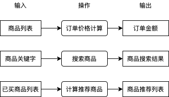

其中操作部分我们通常会直接编写程序代码实现，程序代码会查询数据库，使用某种算法处理数据等，这些工作可能很枯燥，一些程序员受不了了就会自称码农，因为日复一日编写这些逻辑就像种田一样艰苦和缺乏新意。你有没有想过如果有一套系统，可以只给出一些输入和输出的例子就能自动实现操作中的逻辑？如果有这么一套系统，在处理很多问题的时候就可以不需要考虑使用什么逻辑从输入转换到输出，我们只需提供一些例子这套系统就可以自动帮我们实现。

好消息是这样的系统是存在的，我们给出一些输入与输出的例子，让机器自动摸索出它们之间的规律并且建立一套转换它们的逻辑，就是所谓的机器学习。目前机器学习可以做到从图片识别出物体类别，从图片识别出文字，从文本识别出大概含义，也可以做到上图中的从已买商品列表计算出推荐商品列表，这些操作都不需要编写具体逻辑，只需要准备一定的例子让机器自己学习即可，如果成功摸索出规律，机器在遇到例子中没有的输入时也可以正确的计算出输出结果，如下图所示：

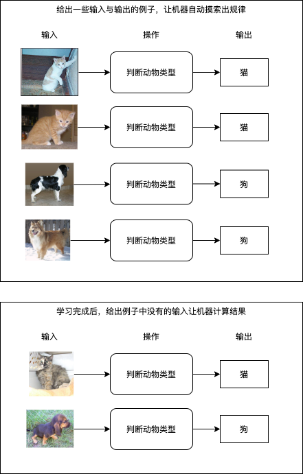

可惜的是机器学习不是万能的，我们不能指望机器可以学习到所有规律从而实现所有操作，机器学习的界限主要有：

- 做不到 100% 的精度，例如前述的根据商品列表计算订单价格要求非常准确，我们不能用机器学习来实现这个操作
- 需要一定的数据量，如果例子较少则无法成功学习到规律
- 无法实现复杂的判断，机器学习与人脑之间仍然有相当大的差距，一些复杂的操作无法使用机器学习代替

到这里我们应该对机器学习是什么有了一个大概的印象，如何根据输入与输出摸索出规律就是机器学习最主要的命题，接下来我们会更详细分析机器学习的流程与步骤。需要注意的是，不是所有场景都可以明确的给出输入与输出的例子，可以明确给出例子的学习称为有监督学习 (supervised learning)，而只给出输入不给出输出例子的学习称为无监督学习 (unsupervised learning)，无监督学习通常用于实现数据分类，虽然不给出输出但是会按一定的规律控制学习的过程，因为无监督学习应用范围不广，这个系列讲的基本上都是有监督学习。

## 机器学习的流程与步骤

我们先来了解一下机器学习的流程:

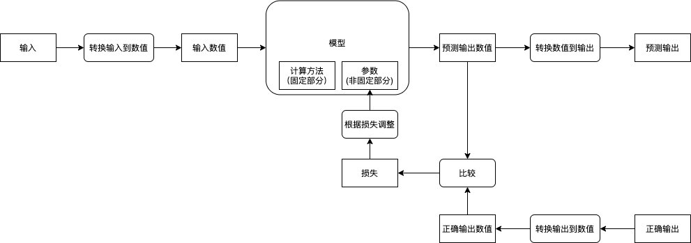

而实现机器学习需要以下的步骤:

- 收集输入与输出的例子
- 建立模型
- 确定输入输出与模型可接收返回的数值之间如何转换
- 使用输入与输出的例子调整模型的参数
- 使用没有参与训练的输入与输出评价模型是否成功摸索出规律

### 收集输入与输出的例子

在开始机器学习之前我们需要先收集输入与输出的例子，收集到的例子又称数据集 (Dataset)，收集工作一般是个苦力活，例如学习从图片判断物体类别需要收集一堆图片并手动对它们进行分类，学习从图片识别文字需要收集一堆图片并手动记录图片对应的文本，这样的工作通常称为打标签 (Labeling)，标签 (Label) 就相当于这个数据对应的输出结果。有些时候我们也可以偷懒，例如实现验证码识别的时候我们可以反过来根据文本生成图片，然后把图片当作输入文本当作输出，再例如实现商品推荐的时候我们可以把用户购买过的商品分割成两部分，一部分作为已购买商品 (输入)，另一部分作为推荐商品 (输出)。注意输入与输出可以有多个，例如视频网站可以根据用户的年龄，性别，所在地 (3 个输入) 来判断用户喜欢看的视频类型 (1 个输出)，再例如自动驾驶系统可以根据视频输入，雷达输入与地图路线 (3 个输入) 计算汽车速度与方向盘角度 (2 个输出)，后面会介绍如何处理多个输入与输出，包括数量可变的输入。

如果你只是想试试手而不是解决实际的业务问题，可以直接用别人收集好的数据集，以下是包含了各种公开数据集链接的 Github 仓库：

https://github.com/awesomedata/awesome-public-datasets

### 建立模型

用于让机器学习与实现操作的就是模型 (Model)，模型可以分为两部分，第一部分是计算方法，这部分需要我们来决定并且不会在学习过程中改变；第二部分是参数，这部分会随着学习不断调整，最终实现我们想要的操作。模型的计算方法需要根据业务（输入与输出的类型）来决定，例如分类可以使用多层线性模型，图像识别可以使用 CNN 模型，趋势预测可以使用 RNN 模型，文本翻译可以使用 Transformer 模型，对象识别可以使用 R-CNN 模型等 （这些模型会在后续的章节详细介绍），通常我们可以直接用别人设计好的模型再加上一些细微调整（只会做这种工作的也叫调参狗😊，我们的第一个小目标），而一些复杂的业务需要自己设计模型，这是真正难的地方。你可能会想是否有一种模型可以适用于所有类型的业务，遗憾的是目前并没有，如果有那就是真正的人工智能了。

因为篇幅限制，现实使用的模型会在后面的文章中介绍，请参考本文末尾的预告。

### 确定输入输出与模型可接收返回的数值之间如何转换

在机器学习中，模型只会接受和返回数值 (通常使用多维数组，即矩阵)，所以我们还需要决定输入输出与数值之间如何转换，例如输入是图片时，我们可以把每个像素的红绿蓝值与图片大小一起组成一个三维数组（红绿蓝 * 图片宽度 * 图片高度），再例如输入是数据库中的商品时，我们可以先根据总商品大小创建一个一维数组，然后用数组 `1, 0, 0, ...` 代表第一个商品，数组 `0, 1, 0, ...` 代表第二个商品，数组 `0, 0, 1, ...` 代表第三个商品，把数值转换到输出也一样，将对应关系反过来就行了。注意转换方式也是一个比较重要的部分，使用正确的转换方式可以让机器学习事半功倍，而使用错误的转换方式可能导致学习缓慢或学习失败。

为了提升学习速度，我们通常会一次性的给模型传入多组输入并让模型返回多组输出，传入的多组输入也叫批次 (Batch)，例如准备了 10000 组输入与输出，每次给模型传入 50 组，那么批次大小就是 50，需要分 2000 个批次传入。分批次会让输入与输出的数组维度加一，例如一次性传 50 张宽 30 x 高 20 的图片时，需要把这些图片转换为一个 50 x 3 x 30 x 20 的四维数组，再例如传 50 个商品时，需要把这些商品转换为一个 50 x 商品数量的二维数组。你可能会有疑问为什么不能一次性把所有输入传给模型，如果输入输出数量过大（有的数据集会有上百万组数据），那么计算机不会有足够的内存处理它们；另一个原因是分批次传入可以防止过拟合 (Overfitting)，但本篇不会详细介绍这点。惯例上，我们通常会选择 32 ～ 100 为批次大小。

此外，为了提升学习效果我们还可以选择把数值正规化 (Normalization)，例如一个输入数值的取值范围在 0 ~ 10 的时候，我们可以把数值全部除以 10，用 0 代表最小的值，用 1 代表最大的值，这个手法可以改善模型的学习速度与提升最终的效果。因为理解需要一定的数学知识，本篇不会详细介绍为什么。

### 使用输入与输出的例子调整模型的参数

接下来我们就可以开始学习了，首先我们会给模型的参数 (非固定部分) 随机赋值，然后给模型传入预先准备好的输入，然后模型返回预测的输出，第一次因为参数是随机的，返回的预测输出与正确输出可能会差很远，例如传一张狗的图片给模型，模型可能会告诉你这是猪。接下来你需要纠正模型，把预测输出的数值与正确输出的数值通过某种方法得到它们的相差值 (也叫损失 - Loss)，然后根据损失来调整模型的参数 (修改参数使得损失接近 0)，让下一次模型的预测输出的数值更接近正确输出的数值。如果把事先准备的所有输入 (批次) 都传给了模型，并且根据模型的预测输出与正确输出调整了模型的参数，那么就可以说经过了一轮训练 (1 Epoch)，通常我们需要经过好几轮训练才能达到理想的效果。

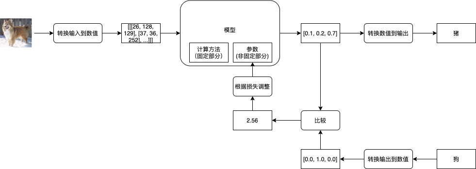

评价模型是否达到理想的效果通常会使用正确率 (Accuracy, 很多文章会缩写成 Acc)，例如传入 100 个输入给模型，模型返回的 100 个预测输出中有 99 个与正确输出是一致的，那么正确率就是 99 %。如果模型足够强大，我们可以让模型针对参与训练的输入达到 100 % 的正确率，但这并不能说明模型训练成功，我们还需要使用没有参与训练的输入与输出来评价模型是否成功摸索出规律。如果模型能力不足，或者用了与业务不匹配的模型，那么模型会给出很低的正确率，并且经过再多训练都不会改善，这个时候我们就需要换一个模型了。模型通过训练达到很高的正确率又称收敛 (Converge)，我们首先需要确定模型能收敛，再确定模型是否能成功摸索出规律。

### 使用没有参与训练的输入与输出评价模型是否成功摸索出规律

如果模型针对参与训练的输入达到了很高的正确率，那么就有两种情况，第一种情况是模型成功的摸索出规律了，第二种情况是模型只是把所有参与训练的输入与输出记住。第二种情况非常糟糕，就像我们把试卷的所有问题和答案记住了，但是没有理解为什么，遇到另一张没看过的试卷时就会得出很低的分数，这样的情况又称过拟合 (Overfitting)。

为了判断是否发生过拟合，我们通常会把事先准备好的输入与输出数据集打乱并分为三个集合，分别是训练集 (Training Set)，验证集 (Validating Set) 与测试集 (Testing Set)，举例来说我们可以把 70 % 的数据划给训练集，15 % 的数据划给验证集，剩余 15 % 的数据划给测试集。训练集中的输入与输出用于传给模型并且调整模型的参数；验证集中的输入与输出不会参与训练，用于在经过每一轮训练后判断模型在遇到未知的输入时可以得出的正确率，如果模型针对训练集可以得出 99 % 的正确率，但针对验证集只能得出 50 % 的正确率，那么就可以判断发生了过拟合；测试集用于在最终训练完成后判断模型是否过度偏向于训练集与验证集中的数据，如果针对测试集都可以得出比较高的正确率，那么就可以说这个模型训练成功了。

因为实际的业务场景中收集到的输入与输出会夹杂一些不完全正确的数据，如果不停的去训练模型，模型为了迎合这些不完全正确的数据会去破坏已经摸索出的规律，导致最终一定发生过拟合。为了防止这种情况我们可以使用提早停止 (Early Stopping) 的手法，在每一轮训练后都计算模型针对训练集与验证集的正确率，然后在验证集正确率最高的时候停止训练，例如：

- 第一轮训练后，训练集正确率 60 %，验证集正确率 58 %
- 第二轮训练后，训练集正确率 79 %，验证集正确率 72 %
- 第三轮训练后，训练集正确率 88 %，验证集正确率 86 %
- 第四轮训练后，训练集正确率 92 %，验证集正确率 85 %
- 第五轮训练后，训练集正确率 99 %，验证集正确率 78 %

我们可以看出应该在第三轮训练后停止训练，在实际操作中我们会记录每一轮训练的正确率与验证集正确率最高时模型的状态，如果验证集正确率经过一定训练次数都没有超过之前的最高值，那么就使用之前记录的模型状态作为结果并停止训练。在停止训练后，我们需要判断验证集正确率的最高值是否达到我们满意的水平，如果没有达到则代表模型不适合或者没有能力应付当前的业务，我们需要修改模型并重新开始训练。

如果验证集正确率的最高值达到我们满意的水平，那么就可以做最后一步了，即用模型判断测试集的正确率，因为测试集完全没有参与过之前的步骤，如果测试集的正确率也达到满意的水平，那么就可以说这个模型训练成功了。但如果测试集的正确率没有达到满意的水平，则代表模型对训练集与验证集有偏向，因为我们在验证集正确率不满意的时候会修改模型，修改后的模型会更偏向于验证集的数据，但这个偏向可能会不适合验证集以外的数据。训练集，验证集与测试集的意义可以总结如下：

- 训练集 (Training Set): 用于训练模型参数
- 验证集 (Validating Set): 用于判断模型是否支持处理没有训练过的输入，并手动调整模型的计算方法
- 测试集 (Testing Set): 用于最终判断模型是否支持处理完全没有参与训练与手动调整模型的输入

一个常见的人为错误是划分这三个集合的时候没有对数据进行打乱，例如有猫狗猪的图片各 1000 张，如果划分集合的时候这些图片是排序好的，那么训练集会只有猫和狗的图片，测试集会只有猪的图片，这样就很难确保训练出来的模型可以正确识别猪了。

从划分数据集到训练成功的流程可以总结如下：

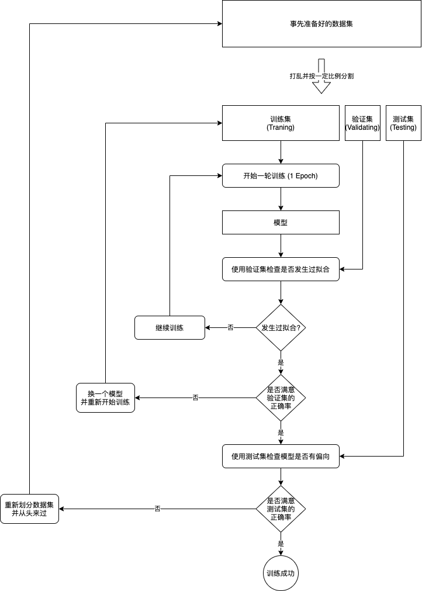

注1: 让模型成功摸索出规律 (针对未知输入得出正确输出) 的工作一般称为泛化 (Generalization)。

注2: 防止过拟合还有另外一些手法，会在接下来的文章中介绍。

## 机器学习，深度学习与人工智能的区别

对初学者来说一个很常见的问题是，机器学习，深度学习与人工智能有什么区别？如果机器学习的模型非常复杂（经过多层次的计算），那么就可以说是深度学习，如果模型的效果非常好，在某个领域达到或者超过人类的水平，那就可以说是人工智能。但实际上它们都是 PPT 词汇，给👼投资人👶看的时候写人工智能比写机器学习要抢眼多了，就算不满足人工智能的水平很多公司都会宣传为人工智能。这个系列是给在 IT 食物链最底层的程序员看的，所以还是谦虚点叫机器学习吧。

## 一个最简单的例子

为了更好的理解前述的步骤，我准备了一个最简单的例子：

假设有以下的输入与输出，怎样才能自动找出从输入转换到输出的方法呢？

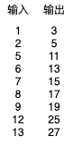

你很可能一眼就已经看出了它们的规律，别急，让我们使用机器学习来解决这个问题。

我们可以先假设输入乘以某个值再加上某个值等于输出，然后：

- 用 x 代表输入
- 用 y 代表输出
- 用 weight 代表输入乘以的值 (公式中缩写为 w)
- 用 bias 代表输出加上的值 (公式中缩写为 b)

用数学公式可以表达如下：

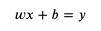

这个公式就是模型中的计算方法部分，而 weight 和 bias 则是这个模型的参数，我们把部分输入与输出代入 x 和 y：

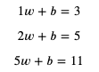

接下来要做的就是找出可以满足这些等式的 weight 和 bias。

我们首先随便给 weight 和 bias 分配值，例如给 weight 分配 1，给 bias 分配 0，然后试试计算结果：

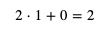

这个计算结果 2 就是预测输出，而预测输出和正确输出之间的差距就是损失。

如果用 predicted (缩写 p) 代表预测输出，用 loss (缩写 l) 代表损失，可以得出以下公式：

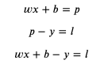

如果 loss 等于 0，那么预测输出 predicted 就会等于正确输出 y，我们的目标是尽量的让 loss 接近 0。

想想如果 weight 增加 1 时 loss 会增加多少，而 bias 增加 1 时 loss 会增加多少：

- weight 增加 1 时，loss 会增加 x
- bias 增加 1 时，loss 会增加 1

可以看出 weight 和 bias 与 loss 是正相关的，并且 weight 和 bias 对 loss 的贡献是 x 比 1，在前面的例子中，loss 等于 predicted - y 等于 2 - 5 等于 -3，我们需要增加 weight 和 bias 的值来让 loss 更接近 0。增加 weight 和 bias 时的比例应该与贡献比例一致，试着给 weight 加上 x，bias 加上 1，调整以后 weight 等于 3，bias 等于 1，计算结果如下：

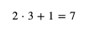

这下 loss 等于 7 - 5 等于 2 了，我们需要减少 weight 和 bias 来让 loss 更接近 0，如果和之前一样 weight 减去 x，bias 减去 1，那么 weight 和 bias 就会变回之前的值，不管调整多少次都无法减少 loss，噢😢。解决这个问题可以控制每次 weight 和 bias 的修改量，例如每次只修改 0.01 倍 (这个倍数又称学习比率 - Learning Rate - 简称 LR)，总结规则如下：

如果 loss 小于 0：

- weight 增加 x 乘以 0.01
- bias 增加 0.01

如果 loss 大于 0：

- weight 减少 x 乘以 0.01
- bias 减少 0.01

模拟一下修改的过程：

``` text
第一轮：
x = 2, y = 5, weight = 1, bias = 0
predicted = 2 * 1 + 0 = 2
loss = 2 - 5 = -3
weight += 2 * 0.1
bias += 0.1

第二轮:
x = 2, y = 5, weight = 1.02, bias = 0.01
predicted = 2 * 1.02 + 0.01 = 2.05
loss = 2.05 - 5 = -2.95
weight += 2 * 0.1
bias += 0.1

第三轮:
x = 2, y = 5, weight = 1.04, bias = 0.02
predicted = 2 * 1.04 + 0.02 = 2.1
loss = 2.1 - 5 = -2.9
weight += 2 * 0.1
bias += 0.1
```

可以看到 loss 越来越接近 0，继续修改下去 weight 会等于 2.2，bias 会等于 0.6，满足 x 等于 2，y 等于 5 的情况，但满足不了数据集中的其他数据。我们可以编写一个程序遍历数据集中的数据来进行同样的修改，来看看能不能找到满足数据集中所有数据的 weight 和 bias：

``` python
# 定义参数
weight = 1
bias = 0

# 定义学习比率
learning_rate = 0.01

# 准备训练集，验证集和测试集
traning_set = [(2, 5), (5, 11), (6, 13), (7, 15), (8, 17)]
validating_set = [(12, 25), (1, 3)]
testing_set = [(9, 19), (13, 27)]

for epoch in range(1, 10000):
    print(f"epoch: {epoch}")

    # 根据训练集训练并修改参数
    for x, y in traning_set:
        # 计算预测值
        predicted = x * weight + bias
        # 计算损失
        loss = predicted - y
        # 打印除错信息
        print(f"traning x: {x}, y: {y}, predicted: {predicted}, loss: {loss}, weight: {weight}, bias: {bias}")
        # 判断需要如何修改 weight 和 bias 才能减少 loss
        if loss < 0:
            # 需要增加 weight 和 bias 来让 predicted 更大
            weight += x * learning_rate
            bias += 1 * learning_rate
        else:
            # 需要减少 weight 和 bias 来让 predicted 更小
            weight -= x * learning_rate
            bias -= 1 * learning_rate

    # 检查验证集
    validating_accuracy = 0
    for x, y in validating_set:
        predicted = x * weight + bias
        validating_accuracy += 1 - abs(y - predicted) / y
        print(f"validating x: {x}, y: {y}, predicted: {predicted}")
    validating_accuracy /= len(validating_set)

    # 如果验证集正确率大于 99 %，则停止训练
    print(f"validating accuracy: {validating_accuracy}")
    if validating_accuracy > 0.99:
        break

# 检查测试集
testing_accuracy = 0
for x, y in testing_set:
    predicted = x * weight + bias
    testing_accuracy += 1 - abs(y - predicted) / y
    print(f"testing x: {x}, y: {y}, predicted: {predicted}")
testing_accuracy /= len(testing_set)
print(f"testing accuracy: {testing_accuracy}")
```

输出结果如下：

``` text
epoch: 1
traning x: 2, y: 5, predicted: 2, loss: -3, weight: 1, bias: 0
traning x: 5, y: 11, predicted: 5.109999999999999, loss: -5.890000000000001, weight: 1.02, bias: 0.01
traning x: 6, y: 13, predicted: 6.4399999999999995, loss: -6.5600000000000005, weight: 1.07, bias: 0.02
traning x: 7, y: 15, predicted: 7.940000000000001, loss: -7.059999999999999, weight: 1.1300000000000001, bias: 0.03
traning x: 8, y: 17, predicted: 9.64, loss: -7.359999999999999, weight: 1.2000000000000002, bias: 0.04
validating x: 12, y: 25, predicted: 15.410000000000004
validating x: 1, y: 3, predicted: 1.3300000000000003
validating accuracy: 0.5298666666666668
epoch: 2
traning x: 2, y: 5, predicted: 2.6100000000000003, loss: -2.3899999999999997, weight: 1.2800000000000002, bias: 0.05
traning x: 5, y: 11, predicted: 6.560000000000001, loss: -4.439999999999999, weight: 1.3000000000000003, bias: 0.060000000000000005
traning x: 6, y: 13, predicted: 8.170000000000002, loss: -4.829999999999998, weight: 1.3500000000000003, bias: 0.07
traning x: 7, y: 15, predicted: 9.950000000000003, loss: -5.049999999999997, weight: 1.4100000000000004, bias: 0.08
traning x: 8, y: 17, predicted: 11.930000000000003, loss: -5.069999999999997, weight: 1.4800000000000004, bias: 0.09
validating x: 12, y: 25, predicted: 18.820000000000007
validating x: 1, y: 3, predicted: 1.6600000000000006
validating accuracy: 0.6530666666666669
epoch: 3
traning x: 2, y: 5, predicted: 3.220000000000001, loss: -1.779999999999999, weight: 1.5600000000000005, bias: 0.09999999999999999
traning x: 5, y: 11, predicted: 8.010000000000002, loss: -2.9899999999999984, weight: 1.5800000000000005, bias: 0.10999999999999999
traning x: 6, y: 13, predicted: 9.900000000000002, loss: -3.099999999999998, weight: 1.6300000000000006, bias: 0.11999999999999998
traning x: 7, y: 15, predicted: 11.960000000000004, loss: -3.0399999999999956, weight: 1.6900000000000006, bias: 0.12999999999999998
traning x: 8, y: 17, predicted: 14.220000000000006, loss: -2.779999999999994, weight: 1.7600000000000007, bias: 0.13999999999999999
validating x: 12, y: 25, predicted: 22.230000000000008
validating x: 1, y: 3, predicted: 1.9900000000000007
validating accuracy: 0.7762666666666669

省略途中的输出

epoch: 90
traning x: 2, y: 5, predicted: 4.949999999999935, loss: -0.05000000000006466, weight: 1.9799999999999676, bias: 0.9900000000000007
traning x: 5, y: 11, predicted: 10.999999999999838, loss: -1.616484723854228e-13, weight: 1.9999999999999676, bias: 1.0000000000000007
traning x: 6, y: 13, predicted: 13.309999999999807, loss: 0.3099999999998069, weight: 2.0499999999999674, bias: 1.0100000000000007
traning x: 7, y: 15, predicted: 14.929999999999772, loss: -0.07000000000022766, weight: 1.9899999999999674, bias: 1.0000000000000007
traning x: 8, y: 17, predicted: 17.48999999999974, loss: 0.4899999999997391, weight: 2.059999999999967, bias: 1.0100000000000007
validating x: 12, y: 25, predicted: 24.759999999999607
validating x: 1, y: 3, predicted: 2.9799999999999676
validating accuracy: 0.9918666666666534
testing x: 9, y: 19, predicted: 18.819999999999705
testing x: 13, y: 27, predicted: 26.739999999999572
testing accuracy: 0.9904483430799063
```

最终 weight 等于 2.05，bias 等于 1.01，它针对没有训练过的检查集和测试集可以达到 99 % 的正确率 (预测输出 99 % 接近正确输出)，如果 99 % 的正确率可以接受，那么就可以说这次训练成功了。

如果你想看 weight 和 bias 的变化，可以记录它们的值并且使用 matplotlib 来显示图表。

安装 matplotlib 的命令：

``` text
pip3 install matplotlib
```

修改后的代码：

``` python
# 定义参数
weight = 1
bias = 0

# 定义学习比率
learning_rate = 0.01

# 准备训练集，验证集和测试集
traning_set = [(2, 5), (5, 11), (6, 13), (7, 15), (8, 17)]
validating_set = [(12, 25), (1, 3)]
testing_set = [(9, 19), (13, 27)]

# 记录 weight 与 bias 的历史值
weight_history = [weight]
bias_history = [bias]

for epoch in range(1, 10000):
    print(f"epoch: {epoch}")

    # 根据训练集训练并修改参数
    for x, y in traning_set:
        # 计算预测值
        predicted = x * weight + bias
        # 计算损失
        loss = predicted - y
        # 打印除错信息
        print(f"traning x: {x}, y: {y}, predicted: {predicted}, loss: {loss}, weight: {weight}, bias: {bias}")
        # 判断需要如何修改 weight 和 bias 才能减少 loss
        if loss < 0:
            # 需要增加 weight 和 bias 来让 predicted 更大
            weight += x * learning_rate
            bias += 1 * learning_rate
        else:
            # 需要减少 weight 和 bias 来让 predicted 更小
            weight -= x * learning_rate
            bias -= 1 * learning_rate
        weight_history.append(weight)
        bias_history.append(bias)

    # 检查验证集
    validating_accuracy = 0
    for x, y in validating_set:
        predicted = x * weight + bias
        validating_accuracy += 1 - abs(y - predicted) / y
        print(f"validating x: {x}, y: {y}, predicted: {predicted}")
    validating_accuracy /= len(validating_set)

    # 如果验证集正确率大于 99 %，则停止训练
    print(f"validating accuracy: {validating_accuracy}")
    if validating_accuracy > 0.99:
        break

# 检查测试集
testing_accuracy = 0
for x, y in testing_set:
    predicted = x * weight + bias
    testing_accuracy += 1 - abs(y - predicted) / y
    print(f"testing x: {x}, y: {y}, predicted: {predicted}")
testing_accuracy /= len(testing_set)
print(f"testing accuracy: {testing_accuracy}")

# 显示 weight 与 bias 的变化
from matplotlib import pyplot
pyplot.plot(weight_history, label="weight")
pyplot.plot(bias_history, label="bias")
pyplot.legend()
pyplot.show()
```

输出的图表，可以看到 weight 接近 2 以后一直上下浮动，而 bias 逐渐接近 1：

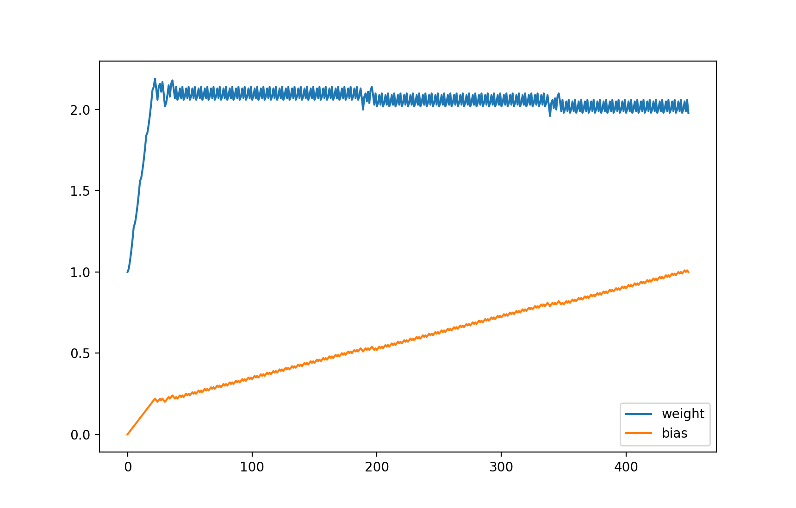

等等，你是不是觉得这个例子很蠢？这个例子的确很蠢，如果我们用其他方法 (例如联立方程式) 可以马上计算出 weight 应该等于 2，bias 应该等于 1，这时预测输出 100 % 等于正确输出。但这个例子代表了机器学习最基础的原理 - 计算各个参数对损失的贡献比例然后修改参数让损失接近 0，如果模型的计算方法非常复杂，将没有方法立刻计算出可以让损失等于 0 的参数值，只能慢慢的调整参数去试。

好了，那为什么上面的例子不能调整 weight 到 2，bias 到 1 呢？主要有两个原因，第一是学习比率为 0.01，如果出现 loss 很接近但小于 0，weight 和 bias 增加以后 loss 大于 0，然后减少 weight 和 bias 又让 loss 变回原来的值，那么接下来无论学习多少次 loss 都不会等于 0，而是在小于 0 的某个值和大于 0 的某个值之间摇摆；第二是我们在正确率达到 99 % 的时候就中断了训练。你可以试试减少学习比率和增加中断训练需要的正确率，试试 weight 和 bias 会不会更接近 2 和 1。

此外在这个例子中，因为所有数据都是完美的，没有杂质在里面，并且模型非常的简单，所以不会出现过拟合 (Overfitting) 问题，也不需要使用提早停止 (Early Stopping) 的手法来防止过拟合。

## 机器学习与微分

很多机器学习的文章喜欢用抛物线和一个球来形容机器学习训练的过程：

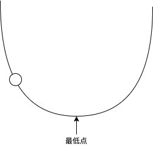

把球看作参数，抛物线看作 loss 的值，如果球在左半部分 loss 小于 0，如果球在右半部分 loss 大于 0，如果球落在最低点那么 loss 等于 0，机器学习的过程就是调整这个球的位置。球所在的位置的梯度 (Gradient) 决定了球的移动方向和每次的移动距离（移动速度），球在左半边的时候会向右移，球在右半边的时候会向左移，而梯度越大每次的移动距离就越长，如果每次的移动距离很长，球可能会一直左右摇摆而无法落在最低点，这个时候我们就需要使用学习比率 (Learning Rate) 来控制每次移动的距离，让每次移动的距离等于 `梯度 * 学习比率`。

在前述的例子中，参数 weight 的梯度是 x，而参数 bias 的梯度是 1，这实际上就是它们的导函数 (Derivative Function)：

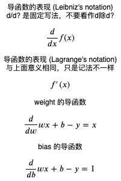

如果你还记得高中学过的微积分，那么立刻就能看明白，但我问过但很多程序员都说已经忘光了还给数学老师了😓，所以我在这里再简单解释一下微分的概念，还记得的就当复习叭。

所谓微分就是求某个函数的导函数，而导函数就是求某一个点上值的变化与结果的变化的关联 (梯度)。以前面的例子为例，weight 如果增加 1，那么 loss 就会增加 x，weight 如果增加 2，那么 loss 就会增加 2x，所以 weight 的导函数可以用 x 来表示；而 bias 如果增加 1，那么 loss 就会增加 1，bias 如果增加 2，那么 loss 就会增加 2，所以 bias 的导函数可以用 1 来表示。

求导函数的通用公式如下：

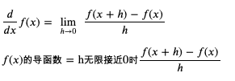

求 weight 和 bias 的导函数 (weight 和 bias 的变化与 loss 的变化的关联) 的过程如下：

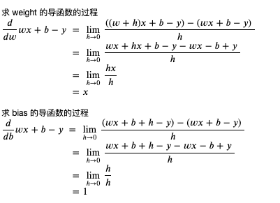

你可能会有疑问为什么要求 h 无限接近于 0，这是因为导函数求的是**某个点**上变化的关联，而这个关联可能会根据点的位置而不同，在上述例子中 weight 和 bias 不管在哪里，它们和 loss 的关联都是相同的，不会依赖于 weight 和 bias 的值。我们可以看一个根据位置不同关联发生变化的例子，例如 x 的平方：

``` text
当 x 等于 3 时，x 的平方等于 9
当 x 等于 5 时，x 当平方等于 25

求 x 的变化与 x 的平方的变化的关联

当 x 等于 3 + 1 时，x 的平方等于 16，与原值相差 7
当 x 等于 5 + 1 时，x 当平方等于 36，与原值相差 11

可以看到当 x 增加 1 时，x 的平方增加多少不是固定的，会依赖于 x 的值
```

求 x 的平方的导函数的过程如下：

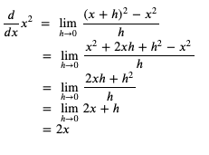

我们可以粗略检查一下这个导函数是否正确 (以下的代码运行在 python 的 REPL 中)：

``` python
>>> ((3 + 1) ** 2 - 3 ** 2) / 1
7.0
>>> ((3 + 0.1) ** 2 - 3 ** 2) / 0.1
6.100000000000012
>>> ((3 + 0.01) ** 2 - 3 ** 2) / 0.01
6.009999999999849
>>> ((3 + 0.001) ** 2 - 3 ** 2) / 0.001
6.000999999999479
>>> ((5 + 1) ** 2 - 5 ** 2) / 1
11.0
>>> ((5 + 0.1) ** 2 - 5 ** 2) / 0.1
10.09999999999998
>>> ((5 + 0.01) ** 2 - 5 ** 2) / 0.01
10.009999999999764
>>> ((5 + 0.001) ** 2 - 5 ** 2) / 0.001
10.001000000002591
```

可以看到变化的值越接近 0，变化值与结果的关联越接近 2x。

现在我们了解微分了，那积分是什么呢？积分分为不定积分和定积分，不定积分就是反过来从导函数求原始函数，定积分就是从导函数和参数的变化范围求结果的变化范围：

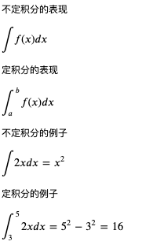

好了，复习就到此为止，我们来总结一下机器学习是怎么利用微分来调整参数的：

- 假设一个可以从输入计算输出的公式
- 定好计算损失的方法，并把公式变形为计算损失的公式
- 利用微分来计算公式的各个参数对损失的贡献比例 (也就是偏导)
- 随机分配参数的值
- 用预先收集好的输入计算预测输出，然后用预测输出和正确输出计算损失
- 根据各个参数对损失的贡献比例调整参数，使得损失接近 0
- 损失非常接近 0 时，代表公式计算的预测输出非常接近正确输出，如果达到可接受的范围就可以停止训练

这种调整参数方式称为梯度下降法 (Gradient Descent)，因为参数的值是随机分配的，通常又称为随机梯度下降法 (Stochastic Gradient Descent, 简称 SGD)。

## 让参数调整量依赖损失的大小

我们再来回头看看前面的例子，会发现调整参数的时候，调整量只会依赖输入与学习比率，不会依赖损失的大小，如果我们想在损失比较大的时候调整多一点，损失比较小的时候调整少一点，应该怎么办呢？

我们可以改变损失的计算方法，把预测输出和正确输出相差的值的平方作为损失，这里我引入一个新的临时变量 diff (缩写 d) 来表示预测输出和正确输出相差的值：

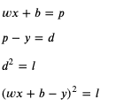

这个时候应该如何计算 weight 和 bias 的导函数呢？

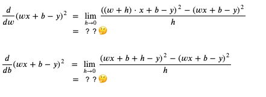

我们可以使用连锁律 (Chain Rule)，简单的来说就是如果 x 的变化影响了 y 的变化，y 的变化影响了 z 的变化，那么 x 的变化 与 z 的变化之间的关系可以用前面两个变化的关系组合计算出来 (注意下图中的公式用的是 Lagrange's notation，只是记法不一样)：

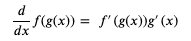

使用连锁律计算 weight 和 bias 的导函数的过程如下 (如果你有兴趣和时间可以试试不用连锁律计算，看看结果是否一样)：

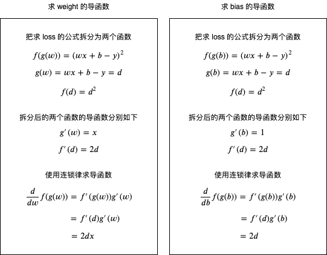

可以看到修改 loss 的计算方式后，weight 和 bias 对 loss 的贡献比例是 `2 * diff * x` 比 `2 * diff`，会依赖于预测输出与正确输出相差的值，现在我们修改一下上面例子的代码，看看是否仍然可以训练成功：

``` python
# 定义参数
weight = 1
bias = 0

# 定义学习比率
learning_rate = 0.01

# 准备训练集，验证集和测试集
traning_set = [(2, 5), (5, 11), (6, 13), (7, 15), (8, 17)]
validating_set = [(12, 25), (1, 3)]
testing_set = [(9, 19), (13, 27)]

# 记录 weight 与 bias 的历史值
weight_history = [weight]
bias_history = [bias]

for epoch in range(1, 10000):
    print(f"epoch: {epoch}")

    # 根据训练集训练并修改参数
    for x, y in traning_set:
        # 计算预测值
        predicted = x * weight + bias
        # 计算损失
        diff = predicted - y
        loss = diff ** 2
        # 打印除错信息
        print(f"traning x: {x}, y: {y}, predicted: {predicted}, loss: {loss}, weight: {weight}, bias: {bias}")
        # 计算导函数值
        derivative_weight = 2 * diff * x
        derivative_bias = 2 * diff
        # 修改 weight 和 bias 以减少 loss
        # diff 为正时代表预测输出 > 正确输出，会减少 weight 和 bias
        # diff 为负时代表预测输出 < 正确输出，会增加 weight 和 bias
        weight -= derivative_weight * learning_rate
        bias -= derivative_bias * learning_rate
        # 记录 weight 和 bias 的历史值
        weight_history.append(weight)
        bias_history.append(bias)

    # 检查验证集
    validating_accuracy = 0
    for x, y in validating_set:
        predicted = x * weight + bias
        validating_accuracy += 1 - abs(y - predicted) / y
        print(f"validating x: {x}, y: {y}, predicted: {predicted}")
    validating_accuracy /= len(validating_set)

    # 如果验证集正确率大于 99 %，则停止训练
    print(f"validating accuracy: {validating_accuracy}")
    if validating_accuracy > 0.99:
        break

# 检查测试集
testing_accuracy = 0
for x, y in testing_set:
    predicted = x * weight + bias
    testing_accuracy += 1 - abs(y - predicted) / y
    print(f"testing x: {x}, y: {y}, predicted: {predicted}")
testing_accuracy /= len(testing_set)
print(f"testing accuracy: {testing_accuracy}")

# 显示 weight 与 bias 的变化
from matplotlib import pyplot
pyplot.plot(weight_history, label="weight")
pyplot.plot(bias_history, label="bias")
pyplot.legend()
pyplot.show()
```

输出如下:

``` text
epoch: 1
traning x: 2, y: 5, predicted: 2, loss: 9, weight: 1, bias: 0
traning x: 5, y: 11, predicted: 5.66, loss: 28.5156, weight: 1.12, bias: 0.06
traning x: 6, y: 13, predicted: 10.090800000000002, loss: 8.463444639999992, weight: 1.6540000000000001, bias: 0.1668
traning x: 7, y: 15, predicted: 14.246711999999999, loss: 0.567442810944002, weight: 2.003104, bias: 0.22498399999999996
traning x: 8, y: 17, predicted: 17.108564320000003, loss: 0.011786211577063013, weight: 2.10856432, bias: 0.24004976
validating x: 12, y: 25, predicted: 25.332206819199993
validating x: 1, y: 3, predicted: 2.3290725023999994
validating accuracy: 0.8815346140160001
epoch: 2
traning x: 2, y: 5, predicted: 4.420266531199999, loss: 0.3360908948468813, weight: 2.0911940287999995, bias: 0.23787847359999995
traning x: 5, y: 11, predicted: 10.821389980735997, loss: 0.03190153898148744, weight: 2.1143833675519996, bias: 0.24947314297599996
traning x: 6, y: 13, predicted: 13.046511560231679, loss: 0.0021633252351850635, weight: 2.1322443694784, bias: 0.25304534336128004
traning x: 7, y: 15, predicted: 15.138755987910837, loss: 0.019253224181112433, weight: 2.1266629822505987, bias: 0.25211511215664645
traning x: 8, y: 17, predicted: 17.10723714394308, loss: 0.011499805041069082, weight: 2.1072371439430815, bias: 0.2493399923984297
validating x: 12, y: 25, predicted: 25.32814566046583
validating x: 1, y: 3, predicted: 2.3372744504317566
validating accuracy: 0.8829828285293095
epoch: 3
traning x: 2, y: 5, predicted: 4.427353651343945, loss: 0.327923840629112, weight: 2.0900792009121885, bias: 0.24719524951956806
traning x: 5, y: 11, predicted: 10.823573450784844, loss: 0.03112632726796794, weight: 2.112985054858431, bias: 0.2586481764926892
traning x: 6, y: 13, predicted: 13.045942966156671, loss: 0.0021107561392730407, weight: 2.1306277097799464, bias: 0.2621767074769923
traning x: 7, y: 15, predicted: 15.13705972504188, loss: 0.01878536822855566, weight: 2.125114553841146, bias: 0.2612578481538589
traning x: 8, y: 17, predicted: 17.105926192335282, loss: 0.011220358222651178, weight: 2.1059261923352826, bias: 0.2585166536530213
validating x: 12, y: 25, predicted: 25.324134148545966
validating x: 1, y: 3, predicted: 2.3453761313679533
validating accuracy: 0.8844133389237396

省略途中的输出

epoch: 202
traning x: 2, y: 5, predicted: 4.950471765167672, loss: 0.002453046045606255, weight: 2.0077909582882314, bias: 0.9348898485912089
traning x: 5, y: 11, predicted: 10.984740851695477, loss: 0.00023284160697942092, weight: 2.0097720876815246, bias: 0.9358804132878555
traning x: 6, y: 13, predicted: 13.003973611325808, loss: 1.578958696858945e-05, weight: 2.011298002511977, bias: 0.936185596253946
traning x: 7, y: 15, predicted: 15.011854308097591, loss: 0.00014052462047262272, weight: 2.01082116915288, bias: 0.9361061240274299
traning x: 8, y: 17, predicted: 17.009161566019216, loss: 8.393429192445584e-05, weight: 2.0091615660192175, bias: 0.935869037865478
validating x: 12, y: 25, predicted: 25.02803439201881
validating x: 1, y: 3, predicted: 2.9433815220012365
validating accuracy: 0.9900028991598299
testing x: 9, y: 19, predicted: 19.00494724565038
testing x: 13, y: 27, predicted: 27.03573010747495
testing accuracy: 0.9992081406680464
```

weight 与 bias 的变化如下:

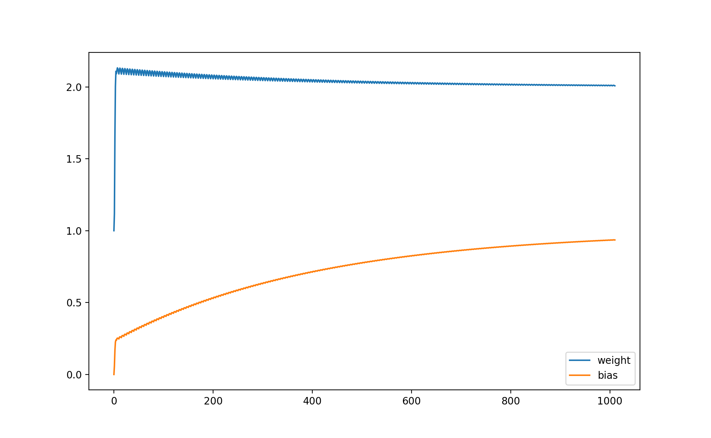

你可能会发现训练速度比前面的例子慢很多，这是因为这个例子实在太简单了，所以无法显示出让参数调整量依赖损失的优势，在复杂的场景下它可以让训练速度更快并且让预测输出更接近正确输出。此外，还有另外一些计算损失的方法，例如 Cross Entropy 等，它们将在后面的文章中提到。

最后补充一个知识点，通过输入计算预测输出的过程在机器学习中称作 Forward，而通过损失调整参数的过程则称作 Backward，如果参数经过多层计算，那么可以把调整多层参数的过程称为反向传播 (Backpropagation)，多层计算的模型将在后面的文章中提到。

## 写在最后

看到这里你可能会有点失望，因为这篇太基础了，也没有涉及到实用的例子😓。但这个系列的阅读目标是程序员，主要是那些人到中年，天天只做增删查改，并且开始掉头发的程序员们，他们很多都抱怨其他高级的教程看不懂。所以这个系列会把容易理解放在首位，看完可能只能做个调参狗，但如主席所说的，不管黑狗白狗，能解决问题的就是好狗😂。希望这个系列可以让你踏入机器学习的大门，并且可以利用机器学习解决业务上的问题。

接下来的文章内容预计如下：

- pytorch 与矩阵计算入门
- 线性模型，激活函数与多层线性模型
- 递归神经网络 RNN, LSTM 与 GRU
- 卷积神经网络 CNN
- (之后如果还有时间可能会介绍 R-CNN, Transformer, GAN 等更复杂的模型)
