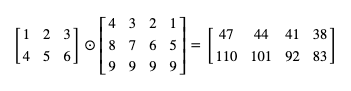
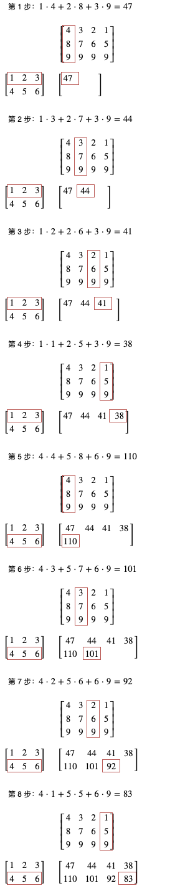

# 写给程序员的机器学习入门 (二) - pytorch 与矩阵计算入门

## pytorch 简介

pytorch 是目前世界上最流行的两个机器学习框架的其中之一，与 tensoflow 并峙双雄。它提供了很多方便的功能，例如根据损失自动微分计算应该怎样调整参数，提供了一系列的数学函数封装，还提供了一系列现成的模型，以及把模型组合起来进行训练的框架。pytorch 的前身是 torch，基于 lua，而 pytorch 基于 python，虽然它基于 python 但底层完全由 c++ 编写，支持自动并列化计算和使用 GPU 加速运算，所以它的性能非常好。

传统的机器学习有的会像前一节的例子中全部手写，或者利用 numpy 类库减少一部分工作量，也有人会利用 scikit-learn (基于 numpy) 类库封装好的各种经典算法。pytorch 与 tensorflow 和传统机器学习不一样的是，它们把重点放在了组建类似人脑的神经元网络 (Neural Network)，所以能实现传统机器学习无法做到的非常复杂的判断，例如判断图片中的物体类型，自动驾驶等。不过，它们组建的神经元网络工作方式是不是真的和人脑类似仍然有很多争议，目前已经有人开始着手组建原理上更接近人脑的 GNN (Graph Neural Network) 网络，但仍未实用化，所以我们这个系列还是会着重讲解当前已经实用化并广泛应用在各个行业的网络模型。

## 学 pytorch 还是学 tensorflow 好？

对初学者来说一个很常见的问题是，学 pytorch 还是学 tensorflow 好？按目前的统计数据来说，公司更多使用 tensorflow，而研究人员更多使用 pytorch，pytorch 的增长速度非常快，有超越 tensorflow 的趋势。我的意见是学哪个都无所谓，如果你熟悉 pytorch，学 tensorflow 也就一两天的事情，反过来也一样，并且 pytorch 和 tensorflow 的项目可以互相移植，选一个觉得好学的就可以了。因为我觉得 pytorch 更好学 (封装非常直观，使用 Dynamic Graph 使得调试非常容易)，所以这个系列会基于 pytorch 来讲。

### Dynamic Graph 与 Static Graph

机器学习框架按运算的流程是否需要预先固定可以分为 Dynamic Graph 和 Static Graph，Dynamic Graph 不需要预先固定运算流程，而 Static Graph 需要。举例来说，对同一个公式 `wx + b = y`，Dynamic Graph 型的框架可以把 `wx`，`+b` 分开写并且逐步计算，计算的过程中随时都可以用 `print` 等指令输出途中的结果，或者把途中的结果发送到其他地方记录起来；而 Static Graph 型的框架必须预先定好整个计算流程，你只能传入 `w`, `x`, `b` 给计算器，然后让计算器输出 `y`，中途计算的结果只能使用专门的调试器来查看。

一般的来说 Static Graph 性能会比 Dynamic Graph 好，Tensorflow (老版本) 使用的是 Static Graph，而 pytorch 使用的是 Dynamic Graph，但两者实际性能相差很小，因为消耗资源的大部分都是矩阵运算，使用批次训练可以很大程度减少它们的差距。顺带一提，Tensorflow 1.7 开始支持了 Dynamic Graph，并且在 2.0 默认开启，但大部分人在使用 Tensorflow 的时候还是会用 Static Graph。

``` python
# Dynamic Graph 的印象，运算的每一步都可以插入自定义代码
def forward(w, x, b):
    wx = w * x
    print(wx)
    y = wx + b
    print(y)
    return y
forward(w, x, b)

# Static Graph 的印象，需要预先编译整个计算流程
forward = compile("wx+b")
forward(w, x, b)
```

## 安装 pytorch

假设你已经安装了 python3，执行以下命令即可安装 pytorch：

``` text
pip3 install pytorch
```

之后在 python 代码中使用 `import torch` 即可引用 pytorch 类库。

## pytorch 的基本操作

接下来我们熟悉一下 pytorch 里面最基本的操作，pytorch 会用 `torch.Tensor` 类型来统一表现数值，向量 (一维数组) 或矩阵 (多维数组)，模型的参数也会使用这个类型。(tensorflow 会根据用途分为好几个类型，这点 pytorch 更简洁明了)

`torch.Tensor` 类型可以使用 `torch.tensor` 函数构建，以下是一些简单的例子（运行在 python 的 REPL 中):

``` python
# 引用 pytorch
>>> import torch

# 创建一个整数 tensor
>>> torch.tensor(1)
tensor(1)

# 创建一个小数 tensor
>>> torch.tensor(1.0)
tensor(1.)

# 单值 tensor 中的值可以用 item 函数取出
>>> torch.tensor(1.0).item()
1.0

# 使用一维数组创建一个向量 tensor
>>> torch.tensor([1.0, 2.0, 3.0])
tensor([1., 2., 3.])

# 使用二维数组创建一个矩阵 tensor
>>> torch.tensor([[1.0, 2.0, 3.0], [-1.0, -2.0, -3.0]])
tensor([[ 1.,  2.,  3.],
        [-1., -2., -3.]])
```

tensor 对象的数值类型可以看它的 `dtype` 成员：

``` python
>>> torch.tensor(1).dtype
torch.int64
>>> torch.tensor(1.0).dtype
torch.float32
>>> torch.tensor([1.0, 2.0, 3.0]).dtype
torch.float32
>>> torch.tensor([[1.0, 2.0, 3.0], [-1.0, -2.0, -3.0]]).dtype
torch.float32
```

pytorch 支持整数类型 `torch.uint8`, `torch.int8`, `torch.int16`, `torch.int32`, `torch.int64` ，浮点数类型 `torch.float16`, `torch.float32`, `torch.float64`，还有布尔值类型 `torch.bool`。类型后的数字代表它的位数 (bit 数)，而 `uint8` 前面的 `u` 代表它是无符号数 (unsigned)。实际绝大部分场景都只会使用 `torch.float32`，虽然精度没有 `torch.float64` 高但它占用内存小并且运算速度快。注意一个 tensor 对象里面只能保存一种类型的数值，不能混合存放。

创建 tensor 对象时可以通过 `dtype` 参数强制指定类型：

``` python
>>> torch.tensor(1, dtype=torch.int32)
tensor(1, dtype=torch.int32)
>>> torch.tensor([1.1, 2.9, 3.5], dtype=torch.int32)
tensor([1, 2, 3], dtype=torch.int32)

>>> torch.tensor(1, dtype=torch.int64)
tensor(1)

>>> torch.tensor(1, dtype=torch.float32)
tensor(1.)

>>> torch.tensor(1, dtype=torch.float64)
tensor(1., dtype=torch.float64)
>>> torch.tensor([1, 2, 3], dtype=torch.float64)
tensor([1., 2., 3.], dtype=torch.float64)

>>> torch.tensor([1, 2, 0], dtype=torch.bool)
tensor([ True,  True, False])
```

tensor 对象的形状可以看它的 `shape` 成员：

``` python
# 整数 tensor 的 shape 为空
>>> torch.tensor(1).shape
torch.Size([])
>>> torch.tensor(1.0).shape
torch.Size([])

# 数组 tensor 的 shape 只有一个值，代表数组的长度
>>> torch.tensor([1.0]).shape
torch.Size([1])
>>> torch.tensor([1.0, 2.0, 3.0]).shape
torch.Size([3])

# 矩阵 tensor 的 shape 根据它的维度而定，每个值代表各个维度的大小，这个例子代表矩阵有 2 行 3 列
>>> torch.tensor([[1.0, 2.0, 3.0], [-1.0, -2.0, -3.0]]).shape
torch.Size([2, 3])
```

tensor 对象与数值，tensor 对象与 tensor 对象之间可以进行运算：

``` python
>>> torch.tensor(1.0) * 2
tensor(2.)
>>> torch.tensor(1.0) * torch.tensor(2.0)
tensor(2.)
>>> torch.tensor(3.0) * torch.tensor(2.0)
tensor(6.)
```

向量和矩阵还可以批量进行运算（内部会并列化运算）：

``` python
# 向量和数值之间的运算
>>> torch.tensor([1.0, 2.0, 3.0])
tensor([1., 2., 3.])
>>> torch.tensor([1.0, 2.0, 3.0]) * 3
tensor([3., 6., 9.])
>>> torch.tensor([1.0, 2.0, 3.0]) * 3 - 1
tensor([2., 5., 8.])

# 矩阵和单值 tensor 对象之间的运算
>>> torch.tensor([[1.0, 2.0, 3.0], [-1.0, -2.0, -3.0]])
tensor([[ 1.,  2.,  3.],
        [-1., -2., -3.]])
>>> torch.tensor([[1.0, 2.0, 3.0], [-1.0, -2.0, -3.0]]) / torch.tensor(2)
tensor([[ 0.5000,  1.0000,  1.5000],
        [-0.5000, -1.0000, -1.5000]])

# 矩阵和与矩阵最后一个维度相同长度向量之间的运算
>>> torch.tensor([[1.0, 2.0, 3.0], [-1.0, -2.0, -3.0]]) * torch.tensor([1.0, 1.5, 2.0])
tensor([[ 1.,  3.,  6.],
        [-1., -3., -6.]])
```

tensor 对象之间的运算一般都会生成一个新的 tensor 对象，如果你想避免生成新对象 (提高性能)，可以使用 `_` 结尾的函数，它们会修改原有的对象：

``` python
# 生成新对象，原有对象不变，add 和 + 意义相同
>>> a = torch.tensor([1,2,3])
>>> b = torch.tensor([7,8,9])
>>> a.add(b)
tensor([ 8, 10, 12])
>>> a
tensor([1, 2, 3])

# 在原有对象上执行操作，避免生成新对象
>>> a.add_(b)
tensor([ 8, 10, 12])
>>> a
tensor([ 8, 10, 12])
```

pytorch 还提供了一系列方便的函数求最大值，最小值，平均值，标准差等:

``` python
>>> torch.tensor([1.0, 2.0, 3.0])
tensor([1., 2., 3.])
>>> torch.tensor([1.0, 2.0, 3.0]).min()
tensor(1.)
>>> torch.tensor([1.0, 2.0, 3.0]).max()
tensor(3.)
>>> torch.tensor([1.0, 2.0, 3.0]).mean()
tensor(2.)
>>> torch.tensor([1.0, 2.0, 3.0]).std()
tensor(1.)
```

pytorch 还支持比较 tensor 对象来生成布尔值类型的 tensor:

``` python
# tensor 对象与数值比较
>>> torch.tensor([1.0, 2.0, 3.0]) > 1.0
tensor([False,  True,  True])
>>> torch.tensor([1.0, 2.0, 3.0]) <= 2.0
tensor([ True,  True, False])

# tensor 对象与 tensor 对象比较
>>> torch.tensor([1.0, 2.0, 3.0]) > torch.tensor([1.1, 1.9, 3.0])
tensor([False,  True, False])
>>> torch.tensor([1.0, 2.0, 3.0]) <= torch.tensor([1.1, 1.9, 3.0])
tensor([ True, False,  True])
```

pytorch 还支持生成指定形状的 tensor 对象：

``` python
# 生成 2 行 3 列的矩阵 tensor，值全部为 0
>>> torch.zeros(2, 3)
tensor([[0., 0., 0.],
        [0., 0., 0.]])

# 生成 3 行 2 列的矩阵 tensor，值全部为 1
torch.ones(3, 2)
>>> torch.ones(2, 3)
tensor([[1., 1., 1.],
        [1., 1., 1.]])

# 生成 3 行 2 列的矩阵 tensor，值全部为 100
>>> torch.full((3, 2), 100)
tensor([[100., 100.],
        [100., 100.],
        [100., 100.]])

# 生成 3 行 3 列的矩阵 tensor，值为范围 [0, 1) 的随机浮点数
>>> torch.rand(3, 3)
tensor([[0.4012, 0.2412, 0.1532],
        [0.1178, 0.2319, 0.4056],
        [0.7879, 0.8318, 0.7452]])

# 生成 3 行 3 列的矩阵 tensor，值为范围 [1, 10] 的随机整数
>>> (torch.rand(3, 3) * 10 + 1).long()
tensor([[ 8,  1,  5],
        [ 8,  6,  5],
        [ 1,  6, 10]])

# 和上面的写法效果一样
>>> torch.randint(1, 11, (3, 3))
tensor([[7, 1, 3],
        [7, 9, 8],
        [4, 7, 3]])
```

这里提到的操作只是常用的一部分，如果你想了解更多 tensor 对象支持的操作，可以参考以下文档：

- https://pytorch.org/docs/stable/tensors.html

## pytorch 保存 tensor 使用的数据结构

为了减少内存占用与提升访问速度，pytorch 会使用一块连续的储存空间 (不管是在系统内存还是在 GPU 内存中) 保存 tensor，不管 tensor 是数值，向量还是矩阵。

我们可以使用 `storage` 查看 tensor 对象使用的储存空间：

``` python
# 数值的储存空间长度是 1
>>> torch.tensor(1).storage()
 1
[torch.LongStorage of size 1]

# 向量的储存空间长度等于向量的长度
>>> torch.tensor([1, 2, 3], dtype=torch.float32).storage()
 1.0
 2.0
 3.0
[torch.FloatStorage of size 3]

# 矩阵的储存空间长度等于所有维度相乘的结果，这里是 2 行 3 列总共 6 个元素
>>> torch.tensor([[1, 2, 3], [-1, -2, -3]], dtype=torch.float64).storage()
 1.0
 2.0
 3.0
 -1.0
 -2.0
 -3.0
[torch.DoubleStorage of size 6]
```

pytorch 会使用 `stride` 来确定一个 tensor 对象的维度：

``` python
# 储存空间有 6 个元素
>>> torch.tensor([[1, 2, 3], [-1, -2, -3]]).storage()
 1
 2
 3
 -1
 -2
 -3
[torch.LongStorage of size 6]

# 第一个维度是 2，第二个维度是 3 (2 行 3 列)
>>> torch.tensor([[1, 2, 3], [-1, -2, -3]]).shape
torch.Size([2, 3])

# stride 的意义是表示每个维度之间元素的距离
# 第一个维度会按 3 个元素来切分 (6 个元素可以切分成 2 组)，第二个维度会按 1 个元素来切分 (3 个元素)
>>> torch.tensor([[1, 2, 3], [-1, -2, -3]])
tensor([[ 1,  2,  3],
        [-1, -2, -3]])
>>> torch.tensor([[1, 2, 3], [-1, -2, -3]]).stride()
(3, 1)
```

pytorch 的一个很强大的地方是，通过 `view` 函数可以修改 tensor 对象的维度 (内部改变了 `stride`)，但是不需要创建新的储存空间并复制元素：

``` python
# 创建一个 2 行 3 列的矩阵
>>> a = torch.tensor([[1, 2, 3], [-1, -2, -3]])
>>> a
tensor([[ 1,  2,  3],
        [-1, -2, -3]])
>>> a.shape
torch.Size([2, 3])
>>> a.stride()
(3, 1)

# 把维度改为 3 行 2 列
>>> b = a.view(3, 2)
>>> b
tensor([[ 1,  2],
        [ 3, -1],
        [-2, -3]])
>>> b.shape
torch.Size([3, 2])
>>> b.stride()
(2, 1)

# 转换为向量
>>> c = b.view(6)
>>> c
tensor([ 1,  2,  3, -1, -2, -3])
>>> c.shape
torch.Size([6])
>>> c.stride()
(1,)

# 它们的储存空间是一样的
>>> a.storage()
 1
 2
 3
 -1
 -2
 -3
[torch.LongStorage of size 6]
>>> b.storage()
 1
 2
 3
 -1
 -2
 -3
[torch.LongStorage of size 6]
>>> c.storage()
 1
 2
 3
 -1
 -2
 -3
[torch.LongStorage of size 6]
```

使用 `stride` 确定维度的另一个意义是它可以支持共用同一个空间实现转置 (Transpose) 操作:

``` python
# 创建一个 2 行 3 列的矩阵
>>> a = torch.tensor([[1, 2, 3], [-1, -2, -3]])
>>> a
tensor([[ 1,  2,  3],
        [-1, -2, -3]])
>>> a.shape
torch.Size([2, 3])
>>> a.stride()
(3, 1)

# 使用转置操作交换维度 (行转列)
>>> b = a.transpose(0, 1)
>>> b
tensor([[ 1, -1],
        [ 2, -2],
        [ 3, -3]])
>>> b.shape
torch.Size([3, 2])
>>> b.stride()
(1, 3)

# 它们的储存空间是一样的
>>> a.storage()
 1
 2
 3
 -1
 -2
 -3
[torch.LongStorage of size 6]
>>> b.storage()
 1
 2
 3
 -1
 -2
 -3
[torch.LongStorage of size 6]
```

转置操作内部就是交换了指定维度在 `stride` 中对应的值，你可以根据前面的描述想想对象在转置后的矩阵中会如何划分。

现在再想想，如果把转置后的矩阵用 `view` 函数专为向量会变为什么？会变为 `[1, -1, 2, -2, 3, -3]` 吗？

实际上这样的操作会导致出错😱：

``` python
>>> b
tensor([[ 1, -1],
        [ 2, -2],
        [ 3, -3]])
>>> b.view(6)
Traceback (most recent call last):
  File "<stdin>", line 1, in <module>
RuntimeError: view size is not compatible with input tensor's size and stride (at least one dimension spans across two contiguous subspaces). Use .reshape(...) instead.
```

这是因为转置后矩阵元素的自然顺序和储存空间中的顺序不一致，我们可以用 `is_contiguous` 函数来检测：

``` python
>>> a.is_contiguous()
True
>>> b.is_contiguous()
False
```

解决这个问题的方法是首先用 `contiguous` 函数把储存空间另外复制一份使得顺序一致，然后再用 `view` 函数改变维度；或者用更方便的 `reshape` 函数，`reshape` 函数会检测改变维度的时候是否需要复制储存空间，如果需要则复制，不需要则和 `view` 一样只修改内部的 `stride`。

``` python
>>> b.contiguous().view(6)
tensor([ 1, -1,  2, -2,  3, -3])
>>> b.reshape(6)
tensor([ 1, -1,  2, -2,  3, -3])
```

pytorch 还支持截取储存空间的一部分来作为一个新的 tensor 对象，基于内部的 `storage_offset` 与 `size` 属性，同样不需要复制：

``` python
# 截取向量的例子
>>> a = torch.tensor([1, 2, 3, -1, -2, -3])
>>> b = a[1:3]
>>> b
tensor([2, 3])
>>> b.storage_offset()
1
>>> b.size()
torch.Size([2])
>>> b.storage()
 1
 2
 3
 -1
 -2
 -3
[torch.LongStorage of size 6]

# 截取矩阵的例子
>>> a.view(3, 2)
tensor([[ 1,  2],
        [ 3, -1],
        [-2, -3]])
>>> c = a.view(3, 2)[1:] # 第一维度 (行) 截取 1~结尾, 第二维度不截取
>>> c
tensor([[ 3, -1],
        [-2, -3]])
>>> c.storage_offset()
2
>>> c.size()
torch.Size([2, 2])
>>> c.stride()
(2, 1)
>>> c.storage()
 1
 2
 3
 -1
 -2
 -3
[torch.LongStorage of size 6]

# 截取转置后矩阵的例子，更复杂一些
>>> a.view(3, 2).transpose(0, 1)
tensor([[ 1,  3, -2],
        [ 2, -1, -3]])
>>> c = a.view(3, 2).transpose(0, 1)[:,1:] # 第一维度 (行) 不截取，第二维度 (列) 截取 1~结尾
>>> c
tensor([[ 3, -2],
        [-1, -3]])
>>> c.storage_offset()
2
>>> c.size()
torch.Size([2, 2])
>>> c.stride()
(1, 2)
>>> c.storage()
 1
 2
 3
 -1
 -2
 -3
[torch.LongStorage of size 6]
```

好了，看完这一节你应该对 pytorch 如何储存 tensor 对象有一个比较基础的了解。为了容易理解本节最多只使用二维矩阵做例子，你可以自己试试更多维度的矩阵是否可以用同样的方式操作。

## 矩阵乘法简介

接下来我们看看矩阵乘法 (Matrix Multiplication)，这是机器学习中最最最频繁的操作，高中学过并且还记得的就当复习一下吧，

以下是一个简单的例子，一个 2 行 3 列的矩阵乘以一个 3 行 4 列的矩阵可以得出一个 2 行 4 列的矩阵：



矩阵乘法会把第一个矩阵的每一行与第二个矩阵的每一列相乘的各个合计值作为结果，可以参考下图理解：



按这个规则来算，一个 n 行 m 列的矩阵和一个 m 行 p 列的矩阵相乘，会得出一个 n 行 p 列的矩阵 (第一个矩阵的列数与第二个矩阵的行数必须相同)。

那矩阵乘法有什么意义呢？矩阵乘法在机器学习中的意义是可以把对多个输入输出或者中间值的计算合并到一个操作中 (在数学上也可以大幅简化公式)，框架可以在内部并列化计算，因为高端的 GPU 有几千个核心，把计算分布到几千个核心中可以大幅提升运算速度。在接下来的例子中也可以看到如何用矩阵乘法实现批次训练。

## 使用 pytorch 进行矩阵乘法计算

在 pytorch 中矩阵乘法可以调用 `mm` 函数：

``` python
>>> a = torch.tensor([[1,2,3],[4,5,6]])
>>> b = torch.tensor([[4,3,2,1],[8,7,6,5],[9,9,9,9]])
>>> a.mm(b)
tensor([[ 47,  44,  41,  38],
        [110, 101,  92,  83]])

# 如果大小不匹配会出错
>>> a = torch.tensor([[1,2,3],[4,5,6]])
>>> b = torch.tensor([[4,3,2,1],[8,7,6,5]])
>>> a.mm(b)
Traceback (most recent call last):
  File "<stdin>", line 1, in <module>
RuntimeError: size mismatch, m1: [2 x 3], m2: [2 x 4] at ../aten/src/TH/generic/THTensorMath.cpp:197

# mm 函数也可以用 @ 操作符代替，结果是一样的
>>> a = torch.tensor([[1,2,3],[4,5,6]])
>>> b = torch.tensor([[4,3,2,1],[8,7,6,5],[9,9,9,9]])
>>> a @ b
tensor([[ 47,  44,  41,  38],
        [110, 101,  92,  83]])
```

针对更多维度的矩阵乘法，pytorch 提供了 `matmul` 函数：

``` python
# n x m 的矩阵与 q x m x p 的矩阵相乘会得出 q x n x p 的矩阵
>>> a = torch.ones(2,3)
>>> b = torch.ones(5,3,4)
>>> a.matmul(b)
tensor([[[3., 3., 3., 3.],
         [3., 3., 3., 3.]],

        [[3., 3., 3., 3.],
         [3., 3., 3., 3.]],

        [[3., 3., 3., 3.],
         [3., 3., 3., 3.]],

        [[3., 3., 3., 3.],
         [3., 3., 3., 3.]],

        [[3., 3., 3., 3.],
         [3., 3., 3., 3.]]])
>>> a.matmul(b).shape
torch.Size([5, 2, 4])
```

## pytorch 的自动微分功能 (autograd)

pytorch 支持自动微分求导函数值 (即各个参数的梯度)，利用这个功能我们不再需要通过数学公式求各个参数的导函数值，使得机器学习的门槛低了很多😄😄，以下是这个功能的例子：

``` python
# 定义参数
# 创建 tensor 对象时设置 requires_grad 为 True 即可开启自动微分功能
>>> w = torch.tensor(1.0, requires_grad=True)
>>> b = torch.tensor(0.0, requires_grad=True)

# 定义输入和输出的 tensor
>>> x = torch.tensor(2)
>>> y = torch.tensor(5)

# 计算预测输出
>>> p = x * w + b
>>> p
tensor(2., grad_fn=<AddBackward0>)

# 计算损失
# 注意 pytorch 的自动微分功能要求损失不能为负数，因为 pytorch 只会考虑减少损失而不是让损失接近 0
# 这里用 abs 让损失变为绝对值
>>> l = (p - y).abs()
>>> l
tensor(3., grad_fn=<AbsBackward>)

# 从损失自动微分求导函数值
>>> l.backward()

# 查看各个参数对应的导函数值
# 注意 pytorch 会假设让参数减去 grad 的值才能减少损失，所以这里是负数（参数会变大）
>>> w.grad
tensor(-2.)
>>> b.grad
tensor(-1.)

# 定义学习比率，即每次根据导函数值调整参数的比率
>>> learning_rate = 0.01

# 调整参数时需要用 torch.no_grad 来临时禁止自动微分功能
>>> with torch.no_grad():
...     w -= w.grad * learning_rate
...     b -= b.grad * learning_rate
...

# 我们可以看到 weight 和 bias 分别增加了 0.02 和 0.01
>>> w
tensor(1.0200, requires_grad=True)
>>> b
tensor(0.0100, requires_grad=True)

# 最后我们需要清空参数的 grad 值，这个值不会自动清零（因为某些模型需要叠加导函数值）
# 你可以试试再调一次 backward，会发现 grad 把两次的值叠加起来
>>> w.grad.zero_()
>>> b.grad.zero_()
```

我们再来试试前一节提到的让损失等于相差值平方的方法：

``` python
# 定义参数
>>> w = torch.tensor(1.0, requires_grad=True)
>>> b = torch.tensor(0.0, requires_grad=True)

# 定义输入和输出的 tensor
>>> x = torch.tensor(2)
>>> y = torch.tensor(5)

# 计算预测输出
>>> p = x * w + b
>>> p
tensor(2., grad_fn=<AddBackward0>)

# 计算相差值
>>> d = p - y
>>> d
tensor(-3., grad_fn=<SubBackward0>)

# 计算损失 (相差值的平方, 一定会是 0 或者正数)
>>> l = d ** 2
>>> l
tensor(9., grad_fn=<PowBackward0>)

# 从损失自动微分求导函数值
>>> l.backward()

# 查看各个参数对应的导函数值，跟我们上一篇用数学公式求出来的值一样吧
# w 的导函数值 = 2 * d * x = 2 * -3 * 2 = -12
# b 的导函数值 = 2 * d = 2 * -3 = -6
>>> w.grad
tensor(-12.)
>>> b.grad
tensor(-6.)

# 之后和上一个例子一样调整参数即可
```

腻害叭😼，再复杂的模型只要调用 `backward` 都可以自动帮我们计算出导函数值，从现在开始我们可以把数学课本丢掉了 (这是开玩笑的，一些问题仍然需要用数学来理解，但大部分情况下只有基础数学知识的人也能玩得起)。

## pytorch 的损失计算器封装 (loss function)

pytorch 提供了几种常见的损失计算器的封装，我们最开始看到的也称 L1 损失 (L1 Loss)，表示所有预测输出与正确输出的相差的绝对值的平均 (有的场景会有多个输出)，以下是使用 L1 损失的例子：

``` python
# 定义参数
>>> w = torch.tensor(1.0, requires_grad=True)
>>> b = torch.tensor(0.0, requires_grad=True)

# 定义输入和输出的 tensor
# 注意 pytorch 提供的损失计算器要求预测输出和正确输出均为浮点数，所以定义输入与输出的时候也需要用浮点数
>>> x = torch.tensor(2.0)
>>> y = torch.tensor(5.0)

# 创建损失计算器
>>> loss_function = torch.nn.L1Loss()

# 计算预测输出
>>> p = x * w + b
>>> p
tensor(2., grad_fn=<AddBackward0>)

# 计算损失
# 等同于 (p - y).abs().mean()
>>> l = loss_function(p, y)
>>> l
tensor(3., grad_fn=<L1LossBackward>)
```

而计算相差值的平方作为损失称为 MSE 损失 (Mean Squared Error)，有的地方又称 L2 损失，以下是使用 MSE 损失的例子：

``` python
# 定义参数
>>> w = torch.tensor(1.0, requires_grad=True)
>>> b = torch.tensor(0.0, requires_grad=True)

# 定义输入和输出的 tensor
>>> x = torch.tensor(2.0)
>>> y = torch.tensor(5.0)

# 创建损失计算器
>>> loss_function = torch.nn.MSELoss()

# 计算预测输出
>>> p = x * w + b
>>> p
tensor(2., grad_fn=<AddBackward0>)

# 计算损失
# 等同于 ((p - y) ** 2).mean()
>>> l = loss_function(p, y)
>>> l
tensor(9., grad_fn=<MseLossBackward>)
```

方便叭🙂️，如果你想看更多的损失计算器可以参考以下地址：

- https://pytorch.org/docs/stable/nn.html#loss-functions

## pytorch 的参数调整器封装 (optimizer)

pytorch 还提供了根据导函数值调整参数的调整器封装，我们在这两篇文章中看到的方法 (随机初始化参数值，然后根据导函数值 * 学习比率调整参数减少损失) 又称随机梯度下降法 (Stochastic Gradient Descent)，以下是使用封装好的调整器的例子：

``` python
# 定义参数
>>> w = torch.tensor(1.0, requires_grad=True)
>>> b = torch.tensor(0.0, requires_grad=True)

# 定义输入和输出的 tensor
>>> x = torch.tensor(2.0)
>>> y = torch.tensor(5.0)

# 创建损失计算器
>>> loss_function = torch.nn.MSELoss()

# 创建参数调整器
# 需要传入参数列表和指定学习比率，这里的学习比率是 0.01
>>> optimizer = torch.optim.SGD([w, b], lr=0.01)

# 计算预测输出
>>> p = x * w + b
>>> p
tensor(2., grad_fn=<AddBackward0>)

# 计算损失
>>> l = loss_function(p, y)
>>> l
tensor(9., grad_fn=<MseLossBackward>)

# 从损失自动微分求导函数值
>>> l.backward()

# 确认参数的导函数值
>>> w.grad
tensor(-12.)
>>> b.grad
tensor(-6.)

# 使用参数调整器调整参数
# 等同于:
# with torch.no_grad():
#     w -= w.grad * learning_rate
#     b -= b.grad * learning_rate
optimizer.step()

# 清空导函数值
# 等同于:
# w.grad.zero_()
# b.grad.zero_()
optimizer.zero_grad()

# 确认调整后的参数
>>> w
tensor(1.1200, requires_grad=True)
>>> b
tensor(0.0600, requires_grad=True)
>>> w.grad
tensor(0.)
>>> b.grad
tensor(0.)
```

SGD 参数调整器的学习比率是固定的，如果我们想在学习过程中自动调整学习比率，可以使用其他参数调整器，例如 Adam 调整器。此外，你还可以开启冲量 (momentum) 选项改进学习速度，该选项开启后可以在参数调整时参考前一次调整的方向 (正负)，如果相同则调整更多，而不同则调整更少。

如果你对 Adam 调整器的实现和冲量的实现有兴趣，可以参考以下文章 (需要一定的数学知识):

- https://mlfromscratch.com/optimizers-explained

如果你想查看 pytorch 提供的其他参数调整器可以访问以下地址：

- https://pytorch.org/docs/stable/optim.html

## 使用 pytorch 实现上一篇文章的例子

好了，学到这里我们应该对 pytorch 的基本操作有一定了解，现在我们来试试用 pytorch 实现上一篇文章最后的例子。

上一篇文章最后的例子代码如下：

``` python
# 定义参数
weight = 1
bias = 0

# 定义学习比率
learning_rate = 0.01

# 准备训练集，验证集和测试集
training_set = [(2, 5), (5, 11), (6, 13), (7, 15), (8, 17)]
validating_set = [(12, 25), (1, 3)]
testing_set = [(9, 19), (13, 27)]

# 记录 weight 与 bias 的历史值
weight_history = [weight]
bias_history = [bias]

for epoch in range(1, 10000):
    print(f"epoch: {epoch}")

    # 根据训练集训练并修改参数
    for x, y in training_set:
        # 计算预测值
        predicted = x * weight + bias
        # 计算损失
        diff = predicted - y
        loss = diff ** 2
        # 打印除错信息
        print(f"training x: {x}, y: {y}, predicted: {predicted}, loss: {loss}, weight: {weight}, bias: {bias}")
        # 计算导函数值
        derivative_weight = 2 * diff * x
        derivative_bias = 2 * diff
        # 修改 weight 和 bias 以减少 loss
        # diff 为正时代表预测输出 > 正确输出，会减少 weight 和 bias
        # diff 为负时代表预测输出 < 正确输出，会增加 weight 和 bias
        weight -= derivative_weight * learning_rate
        bias -= derivative_bias * learning_rate
        # 记录 weight 和 bias 的历史值
        weight_history.append(weight)
        bias_history.append(bias)

    # 检查验证集
    validating_accuracy = 0
    for x, y in validating_set:
        predicted = x * weight + bias
        validating_accuracy += 1 - abs(y - predicted) / y
        print(f"validating x: {x}, y: {y}, predicted: {predicted}")
    validating_accuracy /= len(validating_set)

    # 如果验证集正确率大于 99 %，则停止训练
    print(f"validating accuracy: {validating_accuracy}")
    if validating_accuracy > 0.99:
        break

# 检查测试集
testing_accuracy = 0
for x, y in testing_set:
    predicted = x * weight + bias
    testing_accuracy += 1 - abs(y - predicted) / y
    print(f"testing x: {x}, y: {y}, predicted: {predicted}")
testing_accuracy /= len(testing_set)
print(f"testing accuracy: {testing_accuracy}")

# 显示 weight 与 bias 的变化
from matplotlib import pyplot
pyplot.plot(weight_history, label="weight")
pyplot.plot(bias_history, label="bias")
pyplot.legend()
pyplot.show()
```

使用 pytorch 实现后代码如下:

``` python
# 引用 pytorch
import torch

# 定义参数
weight = torch.tensor(1.0, requires_grad=True)
bias = torch.tensor(0.0, requires_grad=True)

# 创建损失计算器
loss_function = torch.nn.MSELoss()

# 创建参数调整器
optimizer = torch.optim.SGD([weight, bias], lr=0.01)

# 准备训练集，验证集和测试集
training_set = [
    (torch.tensor(2.0), torch.tensor(5.0)),
    (torch.tensor(5.0), torch.tensor(11.0)),
    (torch.tensor(6.0), torch.tensor(13.0)),
    (torch.tensor(7.0), torch.tensor(15.0)),
    (torch.tensor(8.0), torch.tensor(17.0))
]
validating_set = [
    (torch.tensor(12.0), torch.tensor(25.0)),
    (torch.tensor(1.0), torch.tensor(3.0))
]
testing_set = [
    (torch.tensor(9.0), torch.tensor(19.0)),
    (torch.tensor(13.0), torch.tensor(27.0))
]

# 记录 weight 与 bias 的历史值
weight_history = [weight.item()]
bias_history = [bias.item()]

for epoch in range(1, 10000):
    print(f"epoch: {epoch}")

    # 根据训练集训练并修改参数
    for x, y in training_set:
        # 计算预测值
        predicted = x * weight + bias
        # 计算损失
        loss = loss_function(predicted, y)
        # 打印除错信息
        print(f"training x: {x}, y: {y}, predicted: {predicted}, loss: {loss}, weight: {weight}, bias: {bias}")
        # 从损失自动微分求导函数值
        loss.backward()
        # 使用参数调整器调整参数
        optimizer.step()
        # 清空导函数值
        optimizer.zero_grad()
        # 记录 weight 和 bias 的历史值
        weight_history.append(weight.item())
        bias_history.append(bias.item())

    # 检查验证集
    validating_accuracy = 0
    for x, y in validating_set:
        predicted = x * weight.item() + bias.item()
        validating_accuracy += 1 - abs(y - predicted) / y
        print(f"validating x: {x}, y: {y}, predicted: {predicted}")
    validating_accuracy /= len(validating_set)

    # 如果验证集正确率大于 99 %，则停止训练
    print(f"validating accuracy: {validating_accuracy}")
    if validating_accuracy > 0.99:
        break

# 检查测试集
testing_accuracy = 0
for x, y in testing_set:
    predicted = x * weight.item() + bias.item()
    testing_accuracy += 1 - abs(y - predicted) / y
    print(f"testing x: {x}, y: {y}, predicted: {predicted}")
testing_accuracy /= len(testing_set)
print(f"testing accuracy: {testing_accuracy}")

# 显示 weight 与 bias 的变化
from matplotlib import pyplot
pyplot.plot(weight_history, label="weight")
pyplot.plot(bias_history, label="bias")
pyplot.legend()
pyplot.show()
```

输出如下:

``` text
epoch: 1
training x: 2.0, y: 5.0, predicted: 2.0, loss: 9.0, weight: 1.0, bias: 0.0
training x: 5.0, y: 11.0, predicted: 5.659999847412109, loss: 28.515602111816406, weight: 1.1200000047683716, bias: 0.05999999865889549
training x: 6.0, y: 13.0, predicted: 10.090799331665039, loss: 8.463448524475098, weight: 1.6540000438690186, bias: 0.16679999232292175
training x: 7.0, y: 15.0, predicted: 14.246713638305664, loss: 0.5674403309822083, weight: 2.0031042098999023, bias: 0.22498400509357452
training x: 8.0, y: 17.0, predicted: 17.108564376831055, loss: 0.011786224320530891, weight: 2.1085643768310547, bias: 0.24004973471164703
validating x: 12.0, y: 25.0, predicted: 25.33220863342285
validating x: 1.0, y: 3.0, predicted: 2.3290724754333496
validating accuracy: 0.8815345764160156
epoch: 2
training x: 2.0, y: 5.0, predicted: 4.420266628265381, loss: 0.3360907733440399, weight: 2.0911941528320312, bias: 0.2378784418106079
training x: 5.0, y: 11.0, predicted: 10.821391105651855, loss: 0.03190113604068756, weight: 2.1143834590911865, bias: 0.24947310984134674
training x: 6.0, y: 13.0, predicted: 13.04651165008545, loss: 0.002163333585485816, weight: 2.132244348526001, bias: 0.25304529070854187
training x: 7.0, y: 15.0, predicted: 15.138755798339844, loss: 0.019253171980381012, weight: 2.1266629695892334, bias: 0.25211507081985474
training x: 8.0, y: 17.0, predicted: 17.107236862182617, loss: 0.011499744839966297, weight: 2.1072371006011963, bias: 0.24933995306491852
validating x: 12.0, y: 25.0, predicted: 25.32814598083496
validating x: 1.0, y: 3.0, predicted: 2.3372745513916016
validating accuracy: 0.8829828500747681
epoch: 3
training x: 2.0, y: 5.0, predicted: 4.427353858947754, loss: 0.32792359590530396, weight: 2.0900793075561523, bias: 0.24719521403312683
training x: 5.0, y: 11.0, predicted: 10.82357406616211, loss: 0.0311261098831892, weight: 2.112985134124756, bias: 0.2586481273174286
training x: 6.0, y: 13.0, predicted: 13.045942306518555, loss: 0.002110695466399193, weight: 2.1306276321411133, bias: 0.26217663288116455
training x: 7.0, y: 15.0, predicted: 15.137059211730957, loss: 0.018785227090120316, weight: 2.1251144409179688, bias: 0.2612577974796295
training x: 8.0, y: 17.0, predicted: 17.105924606323242, loss: 0.011220022104680538, weight: 2.105926036834717, bias: 0.2585166096687317
validating x: 12.0, y: 25.0, predicted: 25.324134826660156
validating x: 1.0, y: 3.0, predicted: 2.3453762531280518
validating accuracy: 0.8844133615493774

省略途中的输出

epoch: 202
training x: 2.0, y: 5.0, predicted: 4.950470924377441, loss: 0.0024531292729079723, weight: 2.0077908039093018, bias: 0.9348894953727722
training x: 5.0, y: 11.0, predicted: 10.984740257263184, loss: 0.00023285974748432636, weight: 2.0097720623016357, bias: 0.9358800649642944
training x: 6.0, y: 13.0, predicted: 13.003972053527832, loss: 1.5777208318468183e-05, weight: 2.0112979412078857, bias: 0.9361852407455444
training x: 7.0, y: 15.0, predicted: 15.011855125427246, loss: 0.00014054399798624218, weight: 2.0108213424682617, bias: 0.9361057877540588
training x: 8.0, y: 17.0, predicted: 17.00916290283203, loss: 8.39587883092463e-05, weight: 2.0091617107391357, bias: 0.9358686804771423
validating x: 12.0, y: 25.0, predicted: 25.028034210205078
validating x: 1.0, y: 3.0, predicted: 2.9433810710906982
validating accuracy: 0.9900028705596924
testing x: 9.0, y: 19.0, predicted: 19.004947662353516
testing x: 13.0, y: 27.0, predicted: 27.035730361938477
testing accuracy: 0.9992080926895142
```

同样的训练成功了😼。你可能会发现输出的值和前一篇文章的值有一些不同，这是因为 pytorch 默认使用 32 位浮点数 (float32) 进行运算，而 python 使用的是 64 位浮点数 (float64), 如果你把参数定义的部分改成这样：

``` python
# 定义参数
weight = torch.tensor(1.0, dtype=torch.float64, requires_grad=True)
bias = torch.tensor(0.0, dtype=torch.float64, requires_grad=True)
```

然后计算损失的部分改成这样，则可以得到和前一篇文章一样的输出：

``` python
# 计算损失
loss = loss_function(predicted, y.double())
```

## 使用矩阵乘法实现批次训练

前面的例子虽然使用 pytorch 实现了训练，但还是一个一个值的计算，我们可以用矩阵乘法来实现批次训练，一次计算多个值，以下修改后的代码：

``` python
# 引用 pytorch
import torch

# 定义参数
weight = torch.tensor([[1.0]], requires_grad=True) # 1 行 1 列
bias = torch.tensor(0.0, requires_grad=True)

# 创建损失计算器
loss_function = torch.nn.MSELoss()

# 创建参数调整器
optimizer = torch.optim.SGD([weight, bias], lr=0.01)

# 准备训练集，验证集和测试集
training_set_x = torch.tensor([[2.0], [5.0], [6.0], [7.0], [8.0]]) # 5 行 1 列，代表有 5 组，每组有 1 个输入
training_set_y = torch.tensor([[5.0], [11.0], [13.0], [15.0], [17.0]]) # 5 行 1 列，代表有 5 组，每组有 1 个输出
validating_set_x = torch.tensor([[12.0], [1.0]]) # 2 行 1 列，代表有 2 组，每组有 1 个输入
validating_set_y = torch.tensor([[25.0], [3.0]]) # 2 行 1 列，代表有 2 组，每组有 1 个输出
testing_set_x = torch.tensor([[9.0], [13.0]]) # 2 行 1 列，代表有 2 组，每组有 1 个输入
testing_set_y = torch.tensor([[19.0], [27.0]]) # 2 行 1 列，代表有 2 组，每组有 1 个输出

# 记录 weight 与 bias 的历史值
weight_history = [weight[0][0].item()]
bias_history = [bias.item()]

for epoch in range(1, 10000):
    print(f"epoch: {epoch}")

    # 根据训练集训练并修改参数

    # 计算预测值
    # 5 行 1 列的矩阵乘以 1 行 1 列的矩阵，会得出 5 行 1 列的矩阵
    predicted = training_set_x.mm(weight) + bias
    # 计算损失
    loss = loss_function(predicted, training_set_y)
    # 打印除错信息
    print(f"training x: {training_set_x}, y: {training_set_y}, predicted: {predicted}, loss: {loss}, weight: {weight}, bias: {bias}")
    # 从损失自动微分求导函数值
    loss.backward()
    # 使用参数调整器调整参数
    optimizer.step()
    # 清空导函数值
    optimizer.zero_grad()
    # 记录 weight 和 bias 的历史值
    weight_history.append(weight[0][0].item())
    bias_history.append(bias.item())

    # 检查验证集
    with torch.no_grad(): # 禁止自动微分功能
        predicted = validating_set_x.mm(weight) + bias
        validating_accuracy = 1 - ((validating_set_y - predicted).abs() / validating_set_y).mean()
    print(f"validating x: {validating_set_x}, y: {validating_set_y}, predicted: {predicted}")

    # 如果验证集正确率大于 99 %，则停止训练
    print(f"validating accuracy: {validating_accuracy}")
    if validating_accuracy > 0.99:
        break

# 检查测试集
with torch.no_grad(): # 禁止自动微分功能
    predicted = testing_set_x.mm(weight) + bias
    testing_accuracy = 1 - ((testing_set_y - predicted).abs() / testing_set_y).mean()
print(f"testing x: {testing_set_x}, y: {testing_set_y}, predicted: {predicted}")
print(f"testing accuracy: {testing_accuracy}")

# 显示 weight 与 bias 的变化
from matplotlib import pyplot
pyplot.plot(weight_history, label="weight")
pyplot.plot(bias_history, label="bias")
pyplot.legend()
pyplot.show()
```

输出如下:

``` text
epoch: 1
training x: tensor([[2.],
        [5.],
        [6.],
        [7.],
        [8.]]), y: tensor([[ 5.],
        [11.],
        [13.],
        [15.],
        [17.]]), predicted: tensor([[2.],
        [5.],
        [6.],
        [7.],
        [8.]], grad_fn=<AddBackward0>), loss: 47.79999923706055, weight: tensor([[1.]], requires_grad=True), bias: 0.0
validating x: tensor([[12.],
        [ 1.]]), y: tensor([[25.],
        [ 3.]]), predicted: tensor([[22.0200],
        [ 1.9560]])
validating accuracy: 0.7663999795913696
epoch: 2
training x: tensor([[2.],
        [5.],
        [6.],
        [7.],
        [8.]]), y: tensor([[ 5.],
        [11.],
        [13.],
        [15.],
        [17.]]), predicted: tensor([[ 3.7800],
        [ 9.2520],
        [11.0760],
        [12.9000],
        [14.7240]], grad_fn=<AddBackward0>), loss: 3.567171573638916, weight: tensor([[1.8240]], requires_grad=True), bias: 0.13199999928474426
validating x: tensor([[12.],
        [ 1.]]), y: tensor([[25.],
        [ 3.]]), predicted: tensor([[24.7274],
        [ 2.2156]])
validating accuracy: 0.8638148307800293

省略途中的输出

epoch: 1103
training x: tensor([[2.],
        [5.],
        [6.],
        [7.],
        [8.]]), y: tensor([[ 5.],
        [11.],
        [13.],
        [15.],
        [17.]]), predicted: tensor([[ 4.9567],
        [10.9867],
        [12.9966],
        [15.0066],
        [17.0166]], grad_fn=<AddBackward0>), loss: 0.0004764374461956322, weight: tensor([[2.0100]], requires_grad=True), bias: 0.936755359172821
validating x: tensor([[12.],
        [ 1.]]), y: tensor([[25.],
        [ 3.]]), predicted: tensor([[25.0564],
        [ 2.9469]])
validating accuracy: 0.99001544713974
testing x: tensor([[ 9.],
        [13.]]), y: tensor([[19.],
        [27.]]), predicted: tensor([[19.0265],
        [27.0664]])
testing accuracy: 0.998073160648346
```

嗯？这回怎么用了 1103 次才训练成功？这是因为 weight 和 bias 调整的方向始终都是一致的，所以只用一个批次训练反而会更慢。在之后的文章中，我们会用更多的参数 (神经元) 来训练，而它们可以有不同的调整方向，所以不会出现这个例子中的问题。当然，业务上有的时候会出现因为参数调整方向全部一致导致训练很慢，或者根本无法收敛的问题，这个时候我们可以通过更换模型，或者切分多个批次来解决。

## 划分训练集，验证集和测试集的例子

上面的例子定义训练集，验证集和测试集的时候都是一个个 tensor 的定义，有没有觉得很麻烦？我们可以通过 pytorch 提供的 tensor 操作来更方便的划分它们：

``` python
# 原始数据集
>>> dataset = [(1, 3), (2, 5), (5, 11), (6, 13), (7, 15), (8, 17), (9, 19), (12, 25), (13, 27)]

# 转换原始数据集到 tensor，并且指定数值类型为浮点数
>>> dataset_tensor = torch.tensor(dataset, dtype=torch.float32)
>>> dataset_tensor
tensor([[ 1.,  3.],
        [ 2.,  5.],
        [ 5., 11.],
        [ 6., 13.],
        [ 7., 15.],
        [ 8., 17.],
        [ 9., 19.],
        [12., 25.],
        [13., 27.]])

# 给随机数生成器分配一个初始值，使得每次运行都可以生成相同的随机数
# 这是为了让训练过程可重现，你也可以选择不这样做
>>> torch.random.manual_seed(0)
<torch._C.Generator object at 0x10cc03070>

# 生成随机索引值, 用于打乱数据顺序防止分布不均
>>> dataset_tensor.shape
torch.Size([9, 2])
>>> random_indices = torch.randperm(dataset_tensor.shape[0])
>>> random_indices
tensor([8, 0, 2, 3, 7, 1, 4, 5, 6])

# 计算训练集，验证集和测试集的索引值列表
# 60 % 的数据划分到训练集，20 % 的数据划分到验证集，20 % 的数据划分到测试集
>>> training_indices = random_indices[:int(len(random_indices)*0.6)]
>>> training_indices
tensor([8, 0, 2, 3, 7])
>>> validating_indices = random_indices[int(len(random_indices)*0.6):int(len(random_indices)*0.8):]
>>> validating_indices
tensor([1, 4])
>>> testing_indices = random_indices[int(len(random_indices)*0.8):]
>>> testing_indices
tensor([5, 6])

# 划分训练集，验证集和测试集
>>> training_set_x = dataset_tensor[training_indices][:,:1] # 第一维度不截取，第二维度截取索引值小于 1 的元素
>>> training_set_y = dataset_tensor[training_indices][:,1:] # 第一维度不截取，第二维度截取索引值大于或等于 1 的元素
>>> training_set_x
tensor([[13.],
        [ 1.],
        [ 5.],
        [ 6.],
        [12.]])
>>> training_set_y
tensor([[27.],
        [ 3.],
        [11.],
        [13.],
        [25.]])
>>> validating_set_x = dataset_tensor[validating_indices][:,:1]
>>> validating_set_y = dataset_tensor[validating_indices][:,1:]
>>> validating_set_x
tensor([[2.],
        [7.]])
>>> validating_set_y
tensor([[ 5.],
        [15.]])
>>> testing_set_x = dataset_tensor[testing_indices][:,:1]
>>> testing_set_y = dataset_tensor[testing_indices][:,1:]
>>> testing_set_x
tensor([[8.],
        [9.]])
>>> testing_set_y
tensor([[17.],
        [19.]])
```

写成代码如下：

``` python
# 原始数据集
dataset = [(1, 3), (2, 5), (5, 11), (6, 13), (7, 15), (8, 17), (9, 19), (12, 25), (13, 27)]

# 转换原始数据集到 tensor
dataset_tensor = torch.tensor(dataset, dtype=torch.float32)

# 给随机数生成器分配一个初始值，使得每次运行都可以生成相同的随机数
torch.random.manual_seed(0)

# 切分训练集，验证集和测试集
random_indices = torch.randperm(dataset_tensor.shape[0])
training_indices = random_indices[:int(len(random_indices)*0.6)]
validating_indices = random_indices[int(len(random_indices)*0.6):int(len(random_indices)*0.8):]
testing_indices = random_indices[int(len(random_indices)*0.8):]
training_set_x = dataset_tensor[training_indices][:,:1]
training_set_y = dataset_tensor[training_indices][:,1:]
validating_set_x = dataset_tensor[validating_indices][:,:1]
validating_set_y = dataset_tensor[validating_indices][:,1:]
testing_set_x = dataset_tensor[testing_indices][:,:1]
testing_set_y = dataset_tensor[testing_indices][:,1:]
```

注意改变数据分布可以影响训练速度，你可以试试上面的代码经过多少次训练可以训练成功 (达到 99 % 的正确率)。不过，数据越多越均匀，分布对训练速度的影响就越少。

## 定义模型类 (torch.nn.Module)

如果我们想把自己写好的模型提供给别人用，或者用别人写好的模型，应该怎么办呢？pytorch 提供了封装模型的基础类 `torch.nn.Module`，上面例子中的模型可以改写如下：

``` python
# 引用 pytorch 和显示图表使用的 matplotlib
import torch
from matplotlib import pyplot

# 定义模型
# 模型需要定义 forward 函数接收输入并返回预测输出
# add_history 和 show_history 是自定义函数，它们仅用于帮助我们理解机器学习的原理，实际不需要这样做
class MyModle(torch.nn.Module):
    def __init__(self):
        # 初始化基类
        super().__init__()
        # 定义参数
        # 需要使用 torch.nn.Parameter 包装，requires_grad 不需要设置 (会统一帮我们设置)
        self.weight = torch.nn.Parameter(torch.tensor([[1.0]]))
        self.bias = torch.nn.Parameter(torch.tensor(0.0))
        # 记录 weight 与 bias 的历史值
        self.weight_history = [self.weight[0][0].item()]
        self.bias_history = [self.bias.item()]

    def forward(self, x):
        # 计算预测值
        predicted = x.mm(self.weight) + self.bias
        return predicted

    def add_history(self):
        # 记录 weight 和 bias 的历史值
        self.weight_history.append(self.weight[0][0].item())
        self.bias_history.append(self.bias.item())

    def show_history(self):
        # 显示 weight 与 bias 的变化
        pyplot.plot(self.weight_history, label="weight")
        pyplot.plot(self.bias_history, label="bias")
        pyplot.legend()
        pyplot.show()

# 创建模型实例
model = MyModle()

# 创建损失计算器
loss_function = torch.nn.MSELoss()

# 创建参数调整器
# 调用 parameters 函数可以自动递归获取模型中的参数列表 (注意是递归获取，嵌套模型也能支持)
optimizer = torch.optim.SGD(model.parameters(), lr=0.01)

# 原始数据集
dataset = [(1, 3), (2, 5), (5, 11), (6, 13), (7, 15), (8, 17), (9, 19), (12, 25), (13, 27)]

# 转换原始数据集到 tensor
dataset_tensor = torch.tensor(dataset, dtype=torch.float32)

# 给随机数生成器分配一个初始值，使得每次运行都可以生成相同的随机数
# 这是为了让训练过程可重现，你也可以选择不这样做
torch.random.manual_seed(0)

# 切分训练集，验证集和测试集
random_indices = torch.randperm(dataset_tensor.shape[0])
training_indices = random_indices[:int(len(random_indices)*0.6)]
validating_indices = random_indices[int(len(random_indices)*0.6):int(len(random_indices)*0.8):]
testing_indices = random_indices[int(len(random_indices)*0.8):]
training_set_x = dataset_tensor[training_indices][:,:1]
training_set_y = dataset_tensor[training_indices][:,1:]
validating_set_x = dataset_tensor[validating_indices][:,:1]
validating_set_y = dataset_tensor[validating_indices][:,1:]
testing_set_x = dataset_tensor[testing_indices][:,:1]
testing_set_y = dataset_tensor[testing_indices][:,1:]

# 开始训练过程
for epoch in range(1, 10000):
    print(f"epoch: {epoch}")

    # 根据训练集训练并修改参数
    # 切换模型到训练模式，将会启用自动微分，批次正规化 (BatchNorm) 与 Dropout
    model.train()

    # 计算预测值
    predicted = model(training_set_x)
    # 计算损失
    loss = loss_function(predicted, training_set_y)
    # 打印除错信息
    print(f"training x: {training_set_x}, y: {training_set_y}, predicted: {predicted}, loss: {loss}, weight: {model.weight}, bias: {model.bias}")
    # 从损失自动微分求导函数值
    loss.backward()
    # 使用参数调整器调整参数
    optimizer.step()
    # 清空导函数值
    optimizer.zero_grad()
    # 记录 weight 和 bias 的历史值
    model.add_history()

    # 检查验证集
    # 切换模型到验证模式，将会禁用自动微分，批次正规化 (BatchNorm) 与 Dropout
    model.eval()
    predicted = model(validating_set_x)
    validating_accuracy = 1 - ((validating_set_y - predicted).abs() / validating_set_y).mean()
    print(f"validating x: {validating_set_x}, y: {validating_set_y}, predicted: {predicted}")

    # 如果验证集正确率大于 99 %，则停止训练
    print(f"validating accuracy: {validating_accuracy}")
    if validating_accuracy > 0.99:
        break

# 检查测试集
predicted = model(testing_set_x)
testing_accuracy = 1 - ((testing_set_y - predicted).abs() / testing_set_y).mean()
print(f"testing x: {testing_set_x}, y: {testing_set_y}, predicted: {predicted}")
print(f"testing accuracy: {testing_accuracy}")

# 显示 weight 与 bias 的变化
model.show_history()
```

定义和使用模型类需要注意以下几点：

- 必须在构造函数 `__init__` 中调用 `super().__init__()` 初始化基类 (一般 python 继承类也需要这样做)
- 必须定义 `forward` 函数接收输入并返回预测输出
- 模型中定义参数需要使用 `torch.nn.Parameter` 包装，`requires_grad` 不需要设置 (会统一帮我们设置)
- 调用 `model.parameters()` 可以递归获取参数列表 (支持嵌套模型)，创建参数调整器时需要这个参数列表
- 在训练前调用 `model.train()` 开启自动微分等功能
- 在验证或者使用训练好的模型前调用 `model.eval` 关闭自动微分等功能

我们在后面继续使用 pytorch 进行机器学习时，代码的结构会基本和上面的例子一样，只是模型和检查验证集测试集的部分不同。此外，批次正规化与 Dropout 等功能会在后面的文章中介绍。

本篇就到此结束了，相信看到这里你已经掌握了用 pytorch 进行机器学习的基本模式😼。

## 写在最后

本篇介绍的东西也很基础，但是这些基础对应用机器学习必不可少。这两篇的内容在很多机器学习教程中都没有提到，它们直接就从多层线性模型开始讲了，所以很多人会抱怨入门好难😫。如果你看过 pytorch 出的官方书籍 《Deep Learning with Pytorch》可能会发现，这两篇的介绍顺序和这本书的介绍顺序很接近，是的，写这两篇的时候我参考了这本书，按这个顺序来理解是最容易的。

下一篇开始将会讲解线性模型，激活函数和多层线性模型，并且会给出更接近实际的例子，但可能会需要更多时间，想看的耐心等等叭🙁️。
