# 写给程序员的机器学习入门 (三) - 线性模型，激活函数与多层线性模型

## 生物神经元与人工神经元

在了解神经元网络之前，我们先简单的看看生物学上的神经元是什么样子的，下图摘自维基百科：

（因为我不是专家，这里的解释只用于理解人工神经元模拟了生物神经元的什么地方，不一定完全准确）

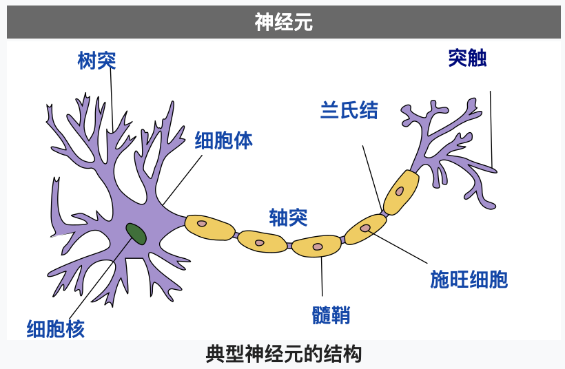

神经元主要由细胞体和细胞突组成，而细胞突分为树突 (Dendrites) 和轴突 (Axon)，树突负责接收其他神经元输入的电流，而轴突负责把电流输出给其他神经元。一个神经元可以通过树突从多个神经元接收电流，如果电流没有达到某个阈值则神经元不会把电流输出，如果电流达到了某个阈值则神经元会通过轴突的突触把电流输出给其他神经元，这样的规则被称为全有全无律。输入电流达到阈值以后输出电流的状态又称为到达动作电位，动作电位会持续 1 ~ 2 毫秒，之后会进入约 0.5 毫秒的绝对不应期，无论输入多大的电流都不会输出，然后再进入约 3.5 毫秒的相对不应期，需要电流达到更大的阈值才会输出，最后返回静息电位。神经元之间连接起来的网络称为神经元网络，人的大脑中大约有 860 亿个神经元，因为 860 亿个神经元可以同时工作，所以目前的计算机无法模拟这种工作方式 (除非开发专用的芯片)，只能模拟一部分的工作方式和使用更小规模的网络。

计算机模拟神经元网络使用的是人工神经元，单个人工神经元可以用以下公式表达：

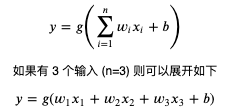

其中 n 代表输入的个数，你可以把 n 看作这个神经元拥有的树突个数，x 看作每个树突输入电流的值；而 w (weight) 代表各个输入的权重，也就是各个树突对电流大小的调整；而 b (bias) 用于调整各个输入乘权重相加后的值，使得这个值可以配合某个阈值工作；而 g 则是激活函数，用于判断值是否达到阈值并输出和输出多少，通常会使用非线性函数；而 y 则是输出的值，可以把它看作轴突输出的电流，连接这个 y 到其他神经元就可以组建神经元网络。

我们在前两篇看到的其实就是只有一个输入并且没有激活函数的单个人工神经元，把同样的输入传给多个神经元 (第一层)，然后再传给其他神经元 (第二层)，然后再传给其他神经元 (第三层) 就可以组建人工神经元网络了，同一层的神经元个数越多，神经元的层数越多，网络就越强大，但需要更多的运算时间并且更有可能发生第一篇文章讲过的过拟合 (Overfitting) 现象。

下图是人工神经元网络的例子，有 3 输入 1 个输出，经过 3 层处理，第 1 层和第 2 层各有两个神经元对应隐藏值 (中间值)，第 3 层有一个神经元对应输出值：

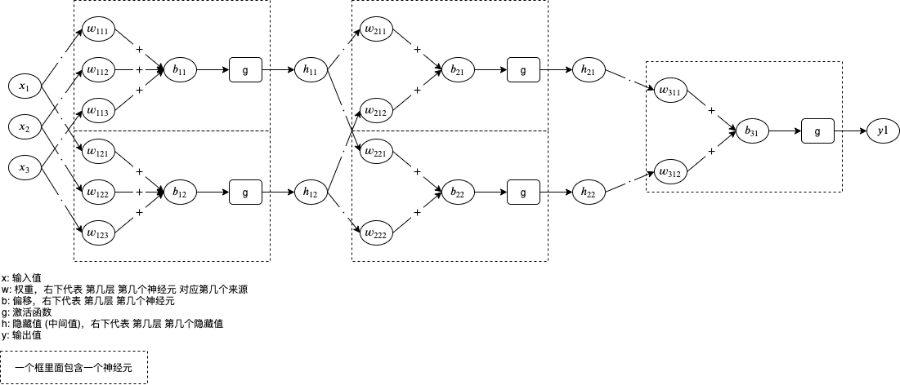

神经元中包含的 w 和 b 就是我们需要通过机器学习调整的参数值。

如果你觉得图片有点难以理解，可以看转换后的代码：

``` python
h11 = g(x1 * w111 + x2 * w112 + x3 * w113 + b11)
h12 = g(x1 * w121 + x2 * w122 + x3 * w123 + b12)
h21 = g(h11 * w211 + h12 * w212 + b21)
h22 = g(h11 * w221 + h12 * w222 + b22)
y = g(h21 * w311 + h22 * w312 + b31)
```

很多痴迷人工神经元网络的学者声称人工神经元网络可以模拟人脑的工作方式，做到某些领域上超过人脑的判断，但实际上这还有很大的争议，我们可以看到人工神经元的连接方式只会按固定的模式，判断是否达到阈值并输出的逻辑也无法做到和生物神经元一样（目前还没有解明），并且也没有生物神经元的不应期，所以也有学者声称人工神经元不过只是做了复杂的数学运算来模拟逻辑判断，需要根据不同的场景切换不同的计算方法，使用这种方式并不能达到人脑的水平。

## 单层线性模型

在前一篇文章我们已经稍微了解过机器学习框架 pytorch，现在我们来看看怎么使用 pytorch 封装的线性模型，以下代码运行在 python 的 REPL 中：

``` python
# 导入 pytorch 类库
>>> import torch

# 创建 pytorch 封装的线性模型，设置输入有 3 个输出有 1 个
>>> model = torch.nn.Linear(in_features=3, out_features=1)

# 查看线性模型内部包含的参数列表
# 这里一共包含两个参数，第一个参数是 1 行 3 列的矩阵分别表示 3 个输入对应的 w 值 (权重)，第二个参数表示 b 值 (偏移)
# 初始值会随机生成 (使用 kaiming_uniform 生成正态分布)
>>> list(model.parameters())
[Parameter containing:
tensor([[0.0599, 0.1324, 0.0099]], requires_grad=True), Parameter containing:
tensor([-0.2772], requires_grad=True)]

# 定义输入和输出
>>> x = torch.tensor([1, 2, 3], dtype=torch.float)
>>> y = torch.tensor([6], dtype=torch.float)

# 把输入传给模型
>>> p = model(x)

# 查看预测输出值
# 1 * 0.0599 + 2 * 0.1324 + 3 * 0.0099 - 0.2772 = 0.0772
>>> p
tensor([0.0772], grad_fn=<AddBackward0>)

# 计算误差并自动微分
>>> l = (p - y).abs()
>>> l
tensor([5.9228], grad_fn=<AbsBackward>)
>>> l.backward()

# 查看各个参数对应的导函数值
>>> list(model.parameters())[0].grad
tensor([[-1., -2., -3.]])
>>> list(model.parameters())[1].grad
tensor([-1.])
```

以上可以看作 1 层 1 个神经元，很好理解吧？我们来看看 1 层 2 个神经元：

``` python
# 导入 pytorch 类库
>>> import torch

# 创建 pytorch 封装的线性模型，设置输入有 3 个输出有 2 个
>>> model = torch.nn.Linear(in_features=3, out_features=2)

# 查看线性模型内部包含的参数列表
# 这里一共包含两个参数
# 第一个参数是 2 行 3 列的矩阵分别表示 2 个输出和 3 个输入对应的 w 值 (权重)
# 第二个参数表示 2 个输出对应的 b 值 (偏移)
>>> list(model.parameters())
[Parameter containing:
tensor([[0.1393, 0.5165, 0.2910],
        [0.2276, 0.1579, 0.1958]], requires_grad=True), Parameter containing:
tensor([0.2566, 0.1701], requires_grad=True)]

# 定义输入和输出
>>> x = torch.tensor([1, 2, 3], dtype=torch.float)
>>> y = torch.tensor([6, -6], dtype=torch.float)

# 把输入传给模型
>>> p = model(x)

# 查看预测输出值
# 1 * 0.1393 + 2 * 0.5165 + 3 * 0.2910 + 0.2566 = 2.3019
# 1 * 0.2276 + 2 * 0.1579 + 3 * 0.1958 + 0.1701 = 1.3009
>>> p
tensor([2.3019, 1.3009], grad_fn=<AddBackward0>)

# 计算误差并自动微分
# (abs(2.3019 - 6) + abs(1.3009 - -6)) / 2 = 5.4995
>>> l = (p - y).abs().mean()
>>> l
tensor(5.4995, grad_fn=<MeanBackward0>)
>>> l.backward()

# 查看各个参数对应的导函数值
# 因为误差取了 2 个值的平均，所以求导函数值的时候会除以 2
>>> list(model.parameters())[0].grad
tensor([[-0.5000, -1.0000, -1.5000],
        [ 0.5000,  1.0000,  1.5000]])
>>> list(model.parameters())[1].grad
tensor([-0.5000,  0.5000])
```

现在我们来试试用线性模型来学习符合 `x_1 * 1 + x_2 * 2 + x_3 * 3 + 8 = y` 的数据，输入和输出会使用矩阵定义：

``` python
# 引用 pytorch
import torch

# 给随机数生成器分配一个初始值，使得每次运行都可以生成相同的随机数
# 这是为了让训练过程可重现，你也可以选择不这样做
torch.random.manual_seed(0)

# 创建线性模型，设置有 3 个输入 1 个输出
model = torch.nn.Linear(in_features=3, out_features=1)

# 创建损失计算器
loss_function = torch.nn.MSELoss()

# 创建参数调整器
optimizer = torch.optim.SGD(model.parameters(), lr=0.01)

# 随机生成原始数据集，一共 20 组数据，每条数据有 3 个输入
dataset_x = torch.randn((20, 3))
dataset_y = dataset_x.mm(torch.tensor([[1], [2], [3]], dtype=torch.float)) + 8
print(f"dataset_x: {dataset_x}")
print(f"dataset_y: {dataset_y}")

# 切分训练集 (12 组)，验证集 (4 组) 和测试集 (4 组)
random_indices = torch.randperm(dataset_x.shape[0])
training_indices = random_indices[:int(len(random_indices)*0.6)]
validating_indices = random_indices[int(len(random_indices)*0.6):int(len(random_indices)*0.8):]
testing_indices = random_indices[int(len(random_indices)*0.8):]
training_set_x = dataset_x[training_indices]
training_set_y = dataset_y[training_indices]
validating_set_x = dataset_x[validating_indices]
validating_set_y = dataset_y[validating_indices]
testing_set_x = dataset_x[testing_indices]
testing_set_y = dataset_y[testing_indices]

# 开始训练过程
for epoch in range(1, 10000):
    print(f"epoch: {epoch}")

    # 根据训练集训练并修改参数
    # 切换模型到训练模式，将会启用自动微分，批次正规化 (BatchNorm) 与 Dropout
    model.train()

    # 计算预测值
    # 20 行 3 列的矩阵乘以 3 行 1 列的矩阵 (由 weight 转置得到) 等于 20 行 1 列的矩阵
    predicted = model(training_set_x)
    # 计算损失
    loss = loss_function(predicted, training_set_y)
    # 打印除错信息
    print(f"loss: {loss}, weight: {model.weight}, bias: {model.bias}")
    # 从损失自动微分求导函数值
    loss.backward()
    # 使用参数调整器调整参数
    optimizer.step()
    # 清空导函数值
    optimizer.zero_grad()

    # 检查验证集
    # 切换模型到验证模式，将会禁用自动微分，批次正规化 (BatchNorm) 与 Dropout
    model.eval()
    predicted = model(validating_set_x)
    validating_accuracy = 1 - ((validating_set_y - predicted).abs() / validating_set_y).abs().mean()
    print(f"validating x: {validating_set_x}, y: {validating_set_y}, predicted: {predicted}")

    # 如果验证集正确率大于 99 %，则停止训练
    print(f"validating accuracy: {validating_accuracy}")
    if validating_accuracy > 0.99:
        break

# 检查测试集
predicted = model(testing_set_x)
testing_accuracy = 1 - ((testing_set_y - predicted).abs() / testing_set_y).abs().mean()
print(f"testing x: {testing_set_x}, y: {testing_set_y}, predicted: {predicted}")
print(f"testing accuracy: {testing_accuracy}")
```

输出结果如下：

``` text
dataset_x: tensor([[ 0.8487,  0.6920, -0.3160],
        [-2.1152, -0.3561,  0.4372],
        [ 0.4913, -0.2041,  0.1198],
        [ 1.2377,  1.1168, -0.2473],
        [-1.0438, -1.3453,  0.7854],
        [ 0.9928,  0.5988, -1.5551],
        [-0.3414,  1.8530,  0.4681],
        [-0.1577,  1.4437,  0.2660],
        [ 1.3894,  1.5863,  0.9463],
        [-0.8437,  0.9318,  1.2590],
        [ 2.0050,  0.0537,  0.4397],
        [ 0.1124,  0.6408,  0.4412],
        [-0.2159, -0.7425,  0.5627],
        [ 0.2596,  0.5229,  2.3022],
        [-1.4689, -1.5867, -0.5692],
        [ 0.9200,  1.1108,  1.2899],
        [-1.4782,  2.5672, -0.4731],
        [ 0.3356, -1.6293, -0.5497],
        [-0.4798, -0.4997, -1.0670],
        [ 1.1149, -0.1407,  0.8058]])
dataset_y: tensor([[ 9.2847],
        [ 6.4842],
        [ 8.4426],
        [10.7294],
        [ 6.6217],
        [ 5.5252],
        [12.7689],
        [11.5278],
        [15.4009],
        [12.7970],
        [11.4315],
        [10.7175],
        [ 7.9872],
        [16.2120],
        [ 1.6500],
        [15.0112],
        [10.2369],
        [ 3.4277],
        [ 3.3199],
        [11.2509]])
epoch: 1
loss: 142.77590942382812, weight: Parameter containing:
tensor([[-0.0043,  0.3097, -0.4752]], requires_grad=True), bias: Parameter containing:
tensor([-0.4249], requires_grad=True)
validating x: tensor([[-0.4798, -0.4997, -1.0670],
        [ 0.8487,  0.6920, -0.3160],
        [ 0.1124,  0.6408,  0.4412],
        [-1.0438, -1.3453,  0.7854]]), y: tensor([[ 3.3199],
        [ 9.2847],
        [10.7175],
        [ 6.6217]]), predicted: tensor([[-0.1385],
        [ 0.3020],
        [-0.0126],
        [-1.1801]], grad_fn=<AddmmBackward>)
validating accuracy: -0.04714548587799072
epoch: 2
loss: 131.40403747558594, weight: Parameter containing:
tensor([[ 0.0675,  0.4937, -0.3163]], requires_grad=True), bias: Parameter containing:
tensor([-0.1970], requires_grad=True)
validating x: tensor([[-0.4798, -0.4997, -1.0670],
        [ 0.8487,  0.6920, -0.3160],
        [ 0.1124,  0.6408,  0.4412],
        [-1.0438, -1.3453,  0.7854]]), y: tensor([[ 3.3199],
        [ 9.2847],
        [10.7175],
        [ 6.6217]]), predicted: tensor([[-0.2023],
        [ 0.6518],
        [ 0.3935],
        [-1.1479]], grad_fn=<AddmmBackward>)
validating accuracy: -0.03184401988983154
epoch: 3
loss: 120.98343658447266, weight: Parameter containing:
tensor([[ 0.1357,  0.6687, -0.1639]], requires_grad=True), bias: Parameter containing:
tensor([0.0221], requires_grad=True)
validating x: tensor([[-0.4798, -0.4997, -1.0670],
        [ 0.8487,  0.6920, -0.3160],
        [ 0.1124,  0.6408,  0.4412],
        [-1.0438, -1.3453,  0.7854]]), y: tensor([[ 3.3199],
        [ 9.2847],
        [10.7175],
        [ 6.6217]]), predicted: tensor([[-0.2622],
        [ 0.9860],
        [ 0.7824],
        [-1.1138]], grad_fn=<AddmmBackward>)
validating accuracy: -0.016991496086120605

省略途中输出

epoch: 637
loss: 0.001102567883208394, weight: Parameter containing:
tensor([[1.0044, 2.0283, 3.0183]], requires_grad=True), bias: Parameter containing:
tensor([7.9550], requires_grad=True)
validating x: tensor([[-0.4798, -0.4997, -1.0670],
        [ 0.8487,  0.6920, -0.3160],
        [ 0.1124,  0.6408,  0.4412],
        [-1.0438, -1.3453,  0.7854]]), y: tensor([[ 3.3199],
        [ 9.2847],
        [10.7175],
        [ 6.6217]]), predicted: tensor([[ 3.2395],
        [ 9.2574],
        [10.6993],
        [ 6.5488]], grad_fn=<AddmmBackward>)
validating accuracy: 0.9900396466255188
testing x: tensor([[-0.3414,  1.8530,  0.4681],
        [-1.4689, -1.5867, -0.5692],
        [ 1.1149, -0.1407,  0.8058],
        [ 0.3356, -1.6293, -0.5497]]), y: tensor([[12.7689],
        [ 1.6500],
        [11.2509],
        [ 3.4277]]), predicted: tensor([[12.7834],
        [ 1.5438],
        [11.2217],
        [ 3.3285]], grad_fn=<AddmmBackward>)
testing accuracy: 0.9757462739944458
```

可以看到最终 weight 接近 1, 2, 3，bias 接近 8。和前一篇文章最后的例子比较还可以发现代码除了定义模型的部分以外几乎一模一样 (后面的代码基本上都是相同的结构，这个系列是先学套路在学细节😈) 。

看到这里你可能会觉得，怎么我们一直都在学习一次方程式，不能做更复杂的事情吗😡？

如我们看到的，线性模型只能计算一次方程式，如果我们给的数据不满足任何一次方程式，这个模型将无法学习成功，那么叠加多层线性模型可以学习更复杂的数据吗？

以下是一层和两层人工神经元网络的公式例子:

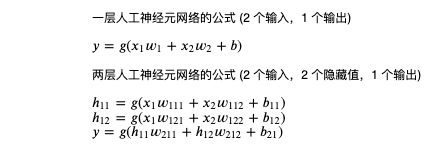

因为我们还没有学到激活函数，先去掉激活函数，然后展开没有激活函数的两层人工神经元网络看看是什么样子：

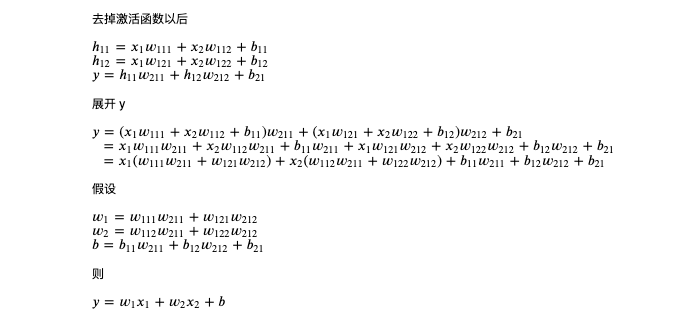

从上图可以看出，如果没有激活函数，两层人工神经元网络和一层神经元网络效果是一样的，实际上，如果没有激活函数不管叠加多少层都和一层一样🙀，所以如果我们要构建多层网络，必须添加激活函数。

## 激活函数

激活函数的作用是让人工神经元网络支持学习非线性的数据，所谓非线性的数据就是不满足任何一次方程式的数据，输出和输入之间不会按一定比例变化。举个很简单的例子，如果需要按码农的数量计算某个项目所需的完工时间，一个码农需要一个月，两个码农需要半个月，三个码农需要十天，四个码农需要一个星期，之后无论请多少个码农都需要一个星期，多出来的码农只会吃闲饭，使用图表可以表现如下：

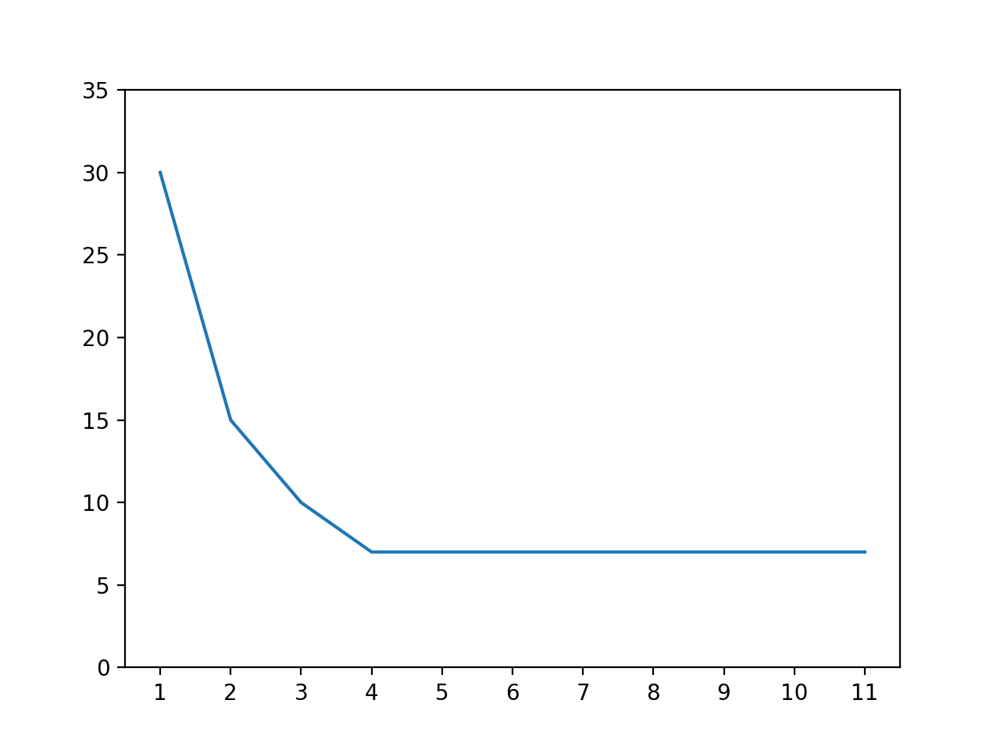

如果不用激活函数，只用线性模型可以调整 w 到 -5.4，b 到 30，使用图表对比 `-5.4 x + 30` 和实际数据如下，我们可以看到不仅预测的误差较大，随着码农数量的增长预测所需的完工时间会变为负数😱：

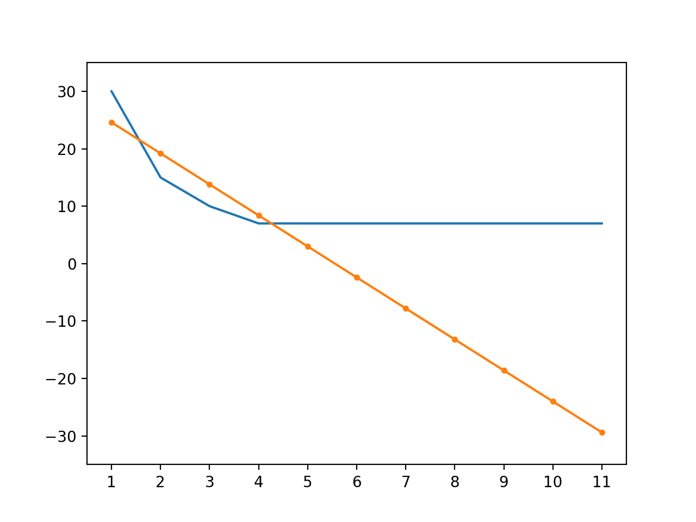

那么使用激活函数会怎样呢？我们以最简单也是最流行的激活函数 ReLU (Rectified Linear Unit) 为例，ReLU 函数的定义如下：

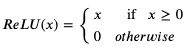

意思是传入值大于 0 时返回原值，否则返回 0，用 python 代码可以表现如下：

``` python
def relu(x):
    if x > 0:
        return x
    return 0
```

再看看以下结合了 ReLU 激活函数的两层人工神经元网络 (最后一层不使用激活函数)：

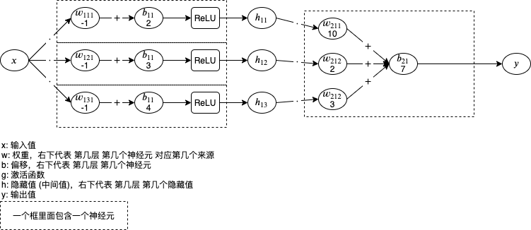

试试计算上面的例子：

``` python
def relu(x):
    if x > 0:
        return x
    return 0

for x in range(1, 11):
    h1 = relu(x * -1 + 2)
    h2 = relu(x * -1 + 3)
    h3 = relu(x * -1 + 4)
    y = h1 * 10 + h2 * 2 + h3 * 3 + 7
    print(x, y)
```

输入如下，可以看到添加激活函数后模型能够支持计算上面的非线性数据😎：

``` text
1 30
2 15
3 10
4 7
5 7
6 7
7 7
8 7
9 7
10 7
```

激活函数除了上述介绍的 ReLU 还有很多，以下是一些常用的激活函数：

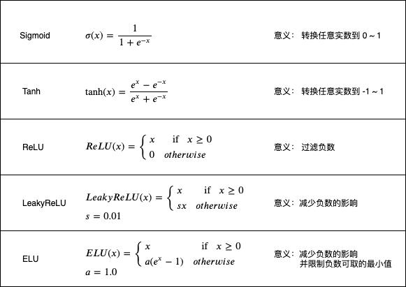

如果你想看它们的曲线和导函数可以参考以下链接：

- https://pytorch.org/docs/stable/nn.html#non-linear-activations-weighted-sum-nonlinearity
- https://ml-cheatsheet.readthedocs.io/en/latest/activation_functions.html

添加激活函数以后求导函数值同样可以使用连锁律，如果第一层返回的是正数，那么就和没有 ReLU 时的计算一样 (导函数为 1)：

``` python
>>> w1 = torch.tensor(5.0, requires_grad=True)
>>> b1 = torch.tensor(1.0, requires_grad=True)
>>> w2 = torch.tensor(6.0, requires_grad=True)
>>> b2 = torch.tensor(7.0, requires_grad=True)

>>> x = torch.tensor(2.0)
>>> y = torch.nn.functional.relu(x * w1 + b1) * w2 + b2

# 假设我们要调整 w1, b1, w2, b2 使得 y 接近 0
>>> y
tensor(73., grad_fn=<AddBackward0>)
>>> y.abs().backward()

# w1 的导函数值为 x * w2
>>> w1.grad
tensor(12.)

# b1 的导函数值为 w2
>>> b1.grad
tensor(6.)

# w2 的导函数值为 x * w1 + b1
>>> w2.grad
tensor(11.)

# b1 的导函数值为 1
>>> b2.grad
tensor(1.)
```

假设第一层返回的是负数，那么 ReLU 会让上一层的导函数值为 0 (导函数为 0)：

``` python
>>> w1 = torch.tensor(5.0, requires_grad=True)
>>> b1 = torch.tensor(1.0, requires_grad=True)
>>> w2 = torch.tensor(6.0, requires_grad=True)
>>> b2 = torch.tensor(7.0, requires_grad=True)

>>> x = torch.tensor(-2.0)
>>> y = torch.nn.functional.relu(x * w1 + b1) * w2 + b2

>>> y
tensor(7., grad_fn=<AddBackward0>)
>>> y.backward()

>>> w1.grad
tensor(-0.)
>>> b1.grad
tensor(0.)
>>> w2.grad
tensor(0.)
>>> b2.grad
tensor(1.)
```

虽然 ReLU 可以适合大部分场景，但有时候我们还是需要选择其他激活函数，选择激活函数一般会考虑以下的因素：

- 计算量
- 是否存在梯度消失 (Vanishing Gradient) 问题
- 是否存在停止学习问题

从上图我们可以看到 ReLU 的计算量是最少的，Sigmoid 和 Tanh 的计算量则很大，使用计算量大的激活函数会导致学习过程更慢。

而梯度消失 (Vanishing Gradient) 问题则是在人工神经元网络层数增多以后出现的问题，如果层数不断增多，使用连锁律求导函数的时候会不断叠加激活函数的导函数，部分激活函数例如 Sigmoid 和 Tanh 的导函数会随着叠加次数增多而不断的减少导函数值。例如有 3 层的时候，第 3 层导函数值可能是 `6, -2, 1`，第 2 层的导函数值可能是 `0.07, 0.68, -0.002`，第 1 层的导函数值可能是 `0.0004, -0.00016, -0.00003`，也就是前面的层参数基本上不会调整，只有后面的层参数不断变化，导致浪费计算资源和不能完全发挥模型的能力。激活函数 ReLU 则不会存在梯度消失问题，因为不管叠加多少层只要中间不存在负数则导函数值会一直传递上去，这也是 ReLU 流行的原因之一。

停止学习问题是模型达到某个状态 (未学习成功) 以后不管怎么调整参数都不会变化的问题，一个简单的例子是使用 ReLU 时，如果第一层的输出刚好全部都是负数，那隐藏值则全部为 0，导函数值也为 0，不管再怎么训练参数都不会变化。LeakyReLU 与 ELU 则是为了解决停止学习问题产生的，但因为增加计算量和允许负数可能会带来其他影响，我们一般都会先使用 ReLU，出现停止学习问题再试试 ReLU 的派生函数。

Sigmoid 和 Tanh 虽然有梯度消失问题，但是它们可以用于在指定场景下转换数值到 0 ~ 1 和 -1 ~ 1。例如 Sigmoid 可以用在最后一层表现可能性，100 表示非常有可能 (转换到 1)，50 也代表非常有可能 (转换到 1)，1 代表比较有可能 (转换到 0.7311)，0 代表不确定 (转换到 0.5)，-1 代表比较不可能 (转换到 0.2689)，-100 代表很不可能 (转换到 0)。而后面文章介绍的 LSTM 模型也会使用 Sigmoid 决定需要忘记哪些内部状态，Tanh 决定应该怎样更新内部状态。此外还有 Softmax 等一般只用在最后一层的函数，Softmax 可以用于在分类的时候判断哪个类别可能性最大，例如识别猫狗猪的时候最后一层给出 `6, 5, 8`，数值越大代表属于该分类的可能性越高，经过 Softmax 转换以后就是 `0.1142, 0.0420, 0.8438`，代表有 11.42% 的可能性是猫，4.2% 的可能性是狗，84.38% 的可能性是猪。

## 多层线性模型

接下来我们看看怎样在 pytorch 里面定义多层线性模型，上一节已经介绍过 `torch.nn.Linear` 是 pytorch 中单层线性模型的封装，组合多个 `torch.nn.Linear` 就可以实现多层线性模型。

组合 `torch.nn.Linear` 有两种方法，一种创建一个自定义的模型类，关于模型类在上一篇已经介绍过：

``` python
# 引用 pytorch，nn 等同于 torch.nn
import torch
from torch import nn

# 定义模型
class MyModel(nn.Module):
    def __init__(self):
        # 初始化基类
        super().__init__()
        # 定义参数
        # 这里一共定义了三层
        #   第一层接收 2 个输入，返回 32 个隐藏值 (内部 weight 矩阵为 32 行 2 列)
        #   第二层接收 32 个隐藏值，返回 64 个隐藏值 (内部 weight 矩阵为 64 行 32 列)
        #   第三层接收 64 个隐藏值，返回 1 个输出 (内部 weight 矩阵为 1 行 64 列)
        self.layer1 = nn.Linear(in_features=2, out_features=32)
        self.layer2 = nn.Linear(in_features=32, out_features=64)
        self.layer3 = nn.Linear(in_features=64, out_features=1)

    def forward(self, x):
        # x 是一个矩阵，行数代表批次，列数代表输入个数，例如有 50 个批次则为 50 行 2 列

        # 计算第一层返回的隐藏值，例如有 50 个批次则 hidden1 为 50 行 32 列
        # 计算矩阵乘法时会转置 layer1 内部的 weight 矩阵，50 行 2 列乘以 2 行 32 列等于 50 行 32 列
        hidden1 = nn.functional.relu(self.layer1(x))

        # 计算第二层返回的隐藏值，例如有 50 个批次则 hidden2 为 50 行 64 列
        hidden2 = nn.functional.relu(self.layer2(hidden1))

        # 计算第三层返回的输出，例如有 50 个批次则 y 为 50 行 1 列
        y = self.layer3(hidden2)

        # 返回输出
        return y

# 创建模型实例
model = MyModel()
```

我们可以定义任意数量的层，但每一层的接收值个数 (in_features) 必须等于上一层的返回值个数 (out_features)，第一层的接收值个数需要等于输入个数，最后一层的返回值个数需要等于输出个数。

第二种方法是使用 `torch.nn.Sequential`，这种方法更简便：

``` python3
# 引用 pytorch，nn 等同于 torch.nn
import torch
from torch import nn

# 创建模型实例，效果等同于第一种方法
model = nn.Sequential(
    nn.Linear(in_features=2, out_features=32),
    nn.ReLU(),
    nn.Linear(in_features=32, out_features=64),
    nn.ReLU(),
    nn.Linear(in_features=64, out_features=1))

# 注:
# nn.functional.relu(x) 等于 nn.ReLU()(x)
```

如前面所说的，层数越多隐藏值数量越多模型就越强大，但需要更长的训练时间并且更容易发生过拟合问题，实际操作时我们可以选择一个比较小的模型，再按需要增加层数和隐藏值个数。

三层线性模型的计算图可以表现如下，以后这个系列在讲解其他模型的时候也会使用相同形式的图表表示模型的计算路径：

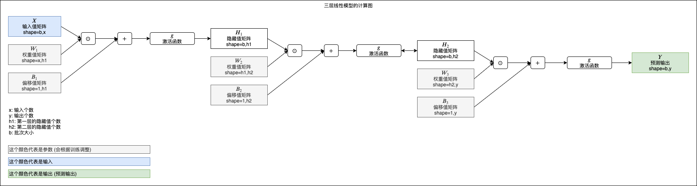

## 实例 - 根据码农条件求工资

我们已经了解到如何创建多层线性模型，现在可以试试解决比较实际的问题了，对于大部分码农来说最实际的问题就是每个月能拿多少工资😿，那就来建立一个根据码农的条件，预测可以拿到多少工资的模型吧。

以下是从某个地方秘密收集回来的码农条件和工资数据（其实是按某种规律随机生成出来的，不是实际数据🙀）：

``` text
年龄,性别,工作经验,Java,NET,JS,CSS,HTML,工资
29,0,0,1,2,2,1,4,12500
22,0,2,2,3,1,2,5,15500
24,0,4,1,2,1,1,2,16000
35,0,6,3,3,0,1,0,19500
45,0,18,0,5,2,0,5,17000
24,0,2,0,0,0,1,1,13500
23,1,2,2,3,1,1,0,10500
41,0,16,2,5,5,2,0,16500
50,0,18,0,5,0,5,2,16500
20,0,0,0,5,2,0,1,12500
26,0,6,1,5,5,1,1,27000
46,0,12,0,5,4,4,2,12500
26,0,6,1,5,3,1,1,23500
40,0,9,0,0,1,0,1,17500
41,0,20,3,5,3,3,5,20500
26,0,4,0,1,2,4,0,18500
42,0,18,5,0,0,2,5,18500
21,0,1,1,0,1,2,0,12000
26,0,1,0,0,0,0,2,12500
```

完整数据有 50000 条，可以从 https://github.com/303248153/BlogArchive/tree/master/ml-03/salary.csv 下载。

每个码农有以下条件：

- 年龄
- 性别 (0: 男性, 1: 女性)
- 工作经验年数 (仅限互联网行业)
- Java 编码熟练程度 (0 ~ 5)
- NET 编码熟练程度 (0 ~ 5)
- JS 编码熟练程度 (0 ~ 5)
- CSS 编码熟练程度 (0 ~ 5)
- HTML 编码熟练程度 (0 ~ 5)

也就是有 8 个输入，1 个输出 (工资)，我们可以建立三层线性模型：

- 第一层接收 8 个输入返回 100 个隐藏值
- 第二层接收 100 个隐藏值返回 50 个隐藏值
- 第三层接收 50 个隐藏值返回 1 个输出

写成代码如下 (这里使用了 pandas 类库读取 csv，使用 `pip3 install pandas` 即可安装)：

``` python
# 引用 pytorch 和 pandas
import pandas
import torch
from torch import nn

# 定义模型
class MyModel(nn.Module):
    def __init__(self):
        super().__init__()
        self.layer1 = nn.Linear(in_features=8, out_features=100)
        self.layer2 = nn.Linear(in_features=100, out_features=50)
        self.layer3 = nn.Linear(in_features=50, out_features=1)

    def forward(self, x):
        hidden1 = nn.functional.relu(self.layer1(x))
        hidden2 = nn.functional.relu(self.layer2(hidden1))
        y = self.layer3(hidden2)
        return y

# 给随机数生成器分配一个初始值，使得每次运行都可以生成相同的随机数
# 这是为了让训练过程可重现，你也可以选择不这样做
torch.random.manual_seed(0)

# 创建模型实例
model = MyModel()

# 创建损失计算器
loss_function = torch.nn.MSELoss()

# 创建参数调整器
optimizer = torch.optim.SGD(model.parameters(), lr=0.0000001)

# 从 csv 读取原始数据集
df = pandas.read_csv('salary.csv')
dataset_tensor = torch.tensor(df.values, dtype=torch.float)

# 切分训练集 (60%)，验证集 (20%) 和测试集 (20%)
random_indices = torch.randperm(dataset_tensor.shape[0])
training_indices = random_indices[:int(len(random_indices)*0.6)]
validating_indices = random_indices[int(len(random_indices)*0.6):int(len(random_indices)*0.8):]
testing_indices = random_indices[int(len(random_indices)*0.8):]
training_set_x = dataset_tensor[training_indices][:,:-1]
training_set_y = dataset_tensor[training_indices][:,-1:]
validating_set_x = dataset_tensor[validating_indices][:,:-1]
validating_set_y = dataset_tensor[validating_indices][:,-1:]
testing_set_x = dataset_tensor[testing_indices][:,:-1]
testing_set_y = dataset_tensor[testing_indices][:,-1:]

# 开始训练过程
for epoch in range(1, 1000):
    print(f"epoch: {epoch}")

    # 根据训练集训练并修改参数
    # 切换模型到训练模式，将会启用自动微分，批次正规化 (BatchNorm) 与 Dropout
    model.train()

    for batch in range(0, training_set_x.shape[0], 100):
        # 切分批次，一次只计算 100 组数据
        batch_x = training_set_x[batch:batch+100]
        batch_y = training_set_y[batch:batch+100]
        # 计算预测值
        predicted = model(batch_x)
        # 计算损失
        loss = loss_function(predicted, batch_y)
        # 从损失自动微分求导函数值
        loss.backward()
        # 使用参数调整器调整参数
        optimizer.step()
        # 清空导函数值
        optimizer.zero_grad()

    # 检查验证集
    # 切换模型到验证模式，将会禁用自动微分，批次正规化 (BatchNorm) 与 Dropout
    model.eval()
    predicted = model(validating_set_x)
    validating_accuracy = 1 - ((validating_set_y - predicted).abs() / validating_set_y).mean()
    print(f"validating x: {validating_set_x}, y: {validating_set_y}, predicted: {predicted}")
    print(f"validating accuracy: {validating_accuracy}")

# 检查测试集
predicted = model(testing_set_x)
testing_accuracy = 1 - ((testing_set_y - predicted).abs() / testing_set_y).mean()
print(f"testing x: {testing_set_x}, y: {testing_set_y}, predicted: {predicted}")
print(f"testing accuracy: {testing_accuracy}")

# 手动输入数据预测输出
while True:
    try:
        print("enter input:")
        r = list(map(float, input().split(",")))
        x = torch.tensor(r).view(1, len(r))
        print(model(x)[0,0].item())
    except Exception as e:
        print("error:", e)
```

输出如下，可以看到最后没有参与训练的验证集的正确度达到了 93.3% 测试集的正确度达到了 93.1%，模型成功的摸索出了某种规律：

``` text
epoch: 1
validating x: tensor([[42.,  0., 16.,  ...,  5.,  5.,  5.],
        [28.,  0.,  0.,  ...,  4.,  0.,  0.],
        [23.,  0.,  3.,  ...,  0.,  1.,  1.],
        ...,
        [44.,  1., 15.,  ...,  2.,  0.,  2.],
        [30.,  0.,  1.,  ...,  1.,  1.,  2.],
        [50.,  1., 18.,  ...,  5.,  5.,  2.]]), y: tensor([[24500.],
        [12500.],
        [17500.],
        ...,
        [10500.],
        [15000.],
        [16000.]]), predicted: tensor([[27604.2578],
        [15934.7607],
        [14536.8984],
        ...,
        [23678.5547],
        [18189.6953],
        [29968.8789]], grad_fn=<AddmmBackward>)
validating accuracy: 0.661293625831604
epoch: 2
validating x: tensor([[42.,  0., 16.,  ...,  5.,  5.,  5.],
        [28.,  0.,  0.,  ...,  4.,  0.,  0.],
        [23.,  0.,  3.,  ...,  0.,  1.,  1.],
        ...,
        [44.,  1., 15.,  ...,  2.,  0.,  2.],
        [30.,  0.,  1.,  ...,  1.,  1.,  2.],
        [50.,  1., 18.,  ...,  5.,  5.,  2.]]), y: tensor([[24500.],
        [12500.],
        [17500.],
        ...,
        [10500.],
        [15000.],
        [16000.]]), predicted: tensor([[29718.2441],
        [15790.3799],
        [15312.5791],
        ...,
        [23395.9668],
        [18672.0234],
        [31012.4062]], grad_fn=<AddmmBackward>)
validating accuracy: 0.6694601774215698

省略途中输出

epoch: 999
validating x: tensor([[42.,  0., 16.,  ...,  5.,  5.,  5.],
        [28.,  0.,  0.,  ...,  4.,  0.,  0.],
        [23.,  0.,  3.,  ...,  0.,  1.,  1.],
        ...,
        [44.,  1., 15.,  ...,  2.,  0.,  2.],
        [30.,  0.,  1.,  ...,  1.,  1.,  2.],
        [50.,  1., 18.,  ...,  5.,  5.,  2.]]), y: tensor([[24500.],
        [12500.],
        [17500.],
        ...,
        [10500.],
        [15000.],
        [16000.]]), predicted: tensor([[22978.7656],
        [13050.8018],
        [18396.5176],
        ...,
        [11449.5059],
        [14791.2969],
        [16635.2578]], grad_fn=<AddmmBackward>)
validating accuracy: 0.9311849474906921
testing x: tensor([[48.,  1., 18.,  ...,  5.,  0.,  5.],
        [22.,  1.,  2.,  ...,  2.,  1.,  2.],
        [24.,  0.,  1.,  ...,  3.,  2.,  0.],
        ...,
        [24.,  0.,  4.,  ...,  0.,  1.,  1.],
        [39.,  0.,  0.,  ...,  0.,  5.,  5.],
        [36.,  0.,  5.,  ...,  3.,  0.,  3.]]), y: tensor([[14000.],
        [10500.],
        [13000.],
        ...,
        [15500.],
        [12000.],
        [19000.]]), predicted: tensor([[15481.9062],
        [11011.7266],
        [12192.7949],
        ...,
        [16219.3027],
        [11074.0420],
        [20305.3516]], grad_fn=<AddmmBackward>)
testing accuracy: 0.9330180883407593
enter input:
```

最后我们手动输入码农条件可以得出预测输出 (35 岁男 10 年经验 Java 5 NET 2 JS 1 CSS 1 HTML 2 大约可拿 26k 😤)：

``` text
enter input:
35,0,10,5,2,1,1,2
26790.982421875
```

虽然训练成功了，但以上代码还有几个问题：

- 学习比率设置的非常低 (0.0000001)，这是因为我们没有对数据进行正规化处理
- 总是会固定训练 1000 次，不能像第一篇文章提到过的那样自动检测哪一次的正确度最高，没有考虑过拟合问题
- 不能把训练结果保存到硬盘，每次运行都需要从头训练
- 需要把所有数据一次性读取到内存中，数据过多时内存可能不够用
- 没有提供一个使用训练好的模型的接口

这些问题都会在下篇文章一个个解决。

## 写在最后

在这一篇我们终于看到怎样应用机器学习到更复杂的数据中，但路还有很长🏃。

下一篇我们会做个稍息，介绍一些训练过程中使用的技巧 (本来打算写到这篇里面的，但这篇已经足够长了)，再下一篇介绍可以处理不定长连续数据的递归模型。
