# 写给程序员的机器学习入门 (四) - 训练过程中常用的技巧

这篇将会着重介绍使用 pytorch 进行机器学习训练过程中的一些常见技巧，掌握它们可以让你事半功倍。

使用的代码大部分会基于上一篇最后一个例子，即根据码农条件预测工资🙀，如果你没看上一篇请点击[这里](https://www.cnblogs.com/zkweb/p/12761743.html)查看。

## 保存和读取模型状态

在 pytorch 中各种操作都是围绕 tensor 对象来的，模型的参数也是 tensor，如果我们把训练好的 tensor 保存到硬盘然后下次再从硬盘读取就可以直接使用了。

我们先来看看如何保存单个 tensor，以下代码运行在 python 的 REPL 中：

``` python
# 引用 pytorch
>>> import torch

# 新建一个 tensor 对象
>>> a = torch.tensor([1, 2, 3], dtype=torch.float)

# 保存 tensor 到文件 1.pt
>>> torch.save(a, "1.pt")

# 从文件 1.pt 读取 tensor
>>> b = torch.load("1.pt")
>>> b
tensor([1., 2., 3.])
```

torch.save 保存 tensor 的时候会使用 python 的 pickle 格式，这个格式保证在不同的 python 版本间兼容，但不支持压缩内容，所以如果 tensor 非常大保存的文件将会占用很多空间，我们可以在保存前压缩，读取前解压缩以减少文件大小：

``` python
# 引用压缩库
>>> import gzip

# 保存 tensor 到文件 1.pt，保存时使用 gzip 压缩
>>> torch.save(a, gzip.GzipFile("1.pt.gz", "wb"))

# 从文件 1.pt 读取 tensor，读取时使用 gzip 解压缩
>>> b = torch.load(gzip.GzipFile("1.pt.gz", "rb"))
>>> b
tensor([1., 2., 3.])
```

torch.save 不仅支持保存单个 tensor 对象，还支持保存 tensor 列表或者词典 (实际上它还可以保存 tensor 以外的 python 对象，只要 pickle 格式支持)，我们可以调用 `state_dict` 获取一个包含模型所有参数的集合，再用 torch.save 就可以保存模型的状态：

``` python
>>> from torch import nn
>>> class MyModel(nn.Module):
...     def __init__(self):
...         super().__init__()
...         self.layer1 = nn.Linear(in_features=8, out_features=100)
...         self.layer2 = nn.Linear(in_features=100, out_features=50)
...         self.layer3 = nn.Linear(in_features=50, out_features=1)
...     def forward(self, x):
...         hidden1 = nn.functional.relu(self.layer1(x))
...         hidden2 = nn.functional.relu(self.layer2(hidden1))
...         y = self.layer3(hidden2)
...         return y
...
>>> model = MyModel()
>>> model.state_dict()
OrderedDict([('layer1.weight', tensor([[ 0.2261,  0.2008,  0.0833, -0.2020, -0.0674,  0.2717, -0.0076,  0.1984],
        省略途中输出
          0.1347,  0.1356]])), ('layer3.bias', tensor([0.0769]))])

>>> torch.save(model.state_dict(), gzip.GzipFile("model.pt.gz", "wb"))
```

读取模型状态可以使用 `load_state_dict` 函数，不过你需要保证模型的参数定义没有发生变化，否则读取会出错：

``` python
>>> new_model = MyModel()
>>> new_model.load_state_dict(torch.load(gzip.GzipFile("model.pt.gz", "rb")))
<All keys matched successfully>
```

一个很重要的细节是，如果你读取模型状态后不是准备继续训练，而是用于预测其他数据，那么你应该调用 `eval` 函数来禁止自动微分等功能，这样可以加快运算速度：

``` python
>>> new_model.eval()
```

pytorch 不仅支持保存和读取模型状态，还支持保存和读取整个模型包括代码和参数，但我不推荐这种做法，因为使用的时候会看不到模型定义，并且模型依赖的类库或者函数不会一并保存起来所以你还是得预先加载它们否则会出错：

``` python
>>> torch.save(model, gzip.GzipFile("model.pt.gz", "wb"))
>>> new_model = torch.load(gzip.GzipFile("model.pt.gz", "rb"))
```

## 记录训练集和验证集的正确率变化

我们可以在训练过程中记录训练集和验证集的正确率变化，以观察是否可以收敛，训练速度如何，以及是否发生过拟合问题，以下是代码例子：

``` python
# 引用 pytorch 和 pandas 和显示图表使用的 matplotlib
import pandas
import torch
from torch import nn
from matplotlib import pyplot

# 定义模型
class MyModel(nn.Module):
    def __init__(self):
        super().__init__()
        self.layer1 = nn.Linear(in_features=8, out_features=100)
        self.layer2 = nn.Linear(in_features=100, out_features=50)
        self.layer3 = nn.Linear(in_features=50, out_features=1)

    def forward(self, x):
        hidden1 = nn.functional.relu(self.layer1(x))
        hidden2 = nn.functional.relu(self.layer2(hidden1))
        y = self.layer3(hidden2)
        return y

# 给随机数生成器分配一个初始值，使得每次运行都可以生成相同的随机数
# 这是为了让训练过程可重现，你也可以选择不这样做
torch.random.manual_seed(0)

# 创建模型实例
model = MyModel()

# 创建损失计算器
loss_function = torch.nn.MSELoss()

# 创建参数调整器
optimizer = torch.optim.SGD(model.parameters(), lr=0.0000001)

# 从 csv 读取原始数据集
df = pandas.read_csv('salary.csv')
dataset_tensor = torch.tensor(df.values, dtype=torch.float)

# 切分训练集 (60%)，验证集 (20%) 和测试集 (20%)
random_indices = torch.randperm(dataset_tensor.shape[0])
traning_indices = random_indices[:int(len(random_indices)*0.6)]
validating_indices = random_indices[int(len(random_indices)*0.6):int(len(random_indices)*0.8):]
testing_indices = random_indices[int(len(random_indices)*0.8):]
traning_set_x = dataset_tensor[traning_indices][:,:-1]
traning_set_y = dataset_tensor[traning_indices][:,-1:]
validating_set_x = dataset_tensor[validating_indices][:,:-1]
validating_set_y = dataset_tensor[validating_indices][:,-1:]
testing_set_x = dataset_tensor[testing_indices][:,:-1]
testing_set_y = dataset_tensor[testing_indices][:,-1:]

# 记录训练集和验证集的正确率变化
traning_accuracy_history = []
validating_accuracy_history = []

# 开始训练过程
for epoch in range(1, 500):
    print(f"epoch: {epoch}")

    # 根据训练集训练并修改参数
    # 切换模型到训练模式，将会启用自动微分，批次正规化 (BatchNorm) 与 Dropout
    model.train()

    traning_accuracy_list = []
    for batch in range(0, traning_set_x.shape[0], 100):
        # 切分批次，一次只计算 100 组数据
        batch_x = traning_set_x[batch:batch+100]
        batch_y = traning_set_y[batch:batch+100]
        # 计算预测值
        predicted = model(batch_x)
        # 计算损失
        loss = loss_function(predicted, batch_y)
        # 从损失自动微分求导函数值
        loss.backward()
        # 使用参数调整器调整参数
        optimizer.step()
        # 清空导函数值
        optimizer.zero_grad()
        # 记录这一个批次的正确率，torch.no_grad 代表临时禁用自动微分功能
        with torch.no_grad():
            traning_accuracy_list.append(1 - ((batch_y - predicted).abs() / batch_y).mean().item())
    traning_accuracy = sum(traning_accuracy_list) / len(traning_accuracy_list)
    traning_accuracy_history.append(traning_accuracy)
    print(f"training accuracy: {traning_accuracy}")

    # 检查验证集
    # 切换模型到验证模式，将会禁用自动微分，批次正规化 (BatchNorm) 与 Dropout
    model.eval()
    predicted = model(validating_set_x)
    validating_accuracy = 1 - ((validating_set_y - predicted).abs() / validating_set_y).mean()
    validating_accuracy_history.append(validating_accuracy.item())
    print(f"validating x: {validating_set_x}, y: {validating_set_y}, predicted: {predicted}")
    print(f"validating accuracy: {validating_accuracy}")

# 检查测试集
predicted = model(testing_set_x)
testing_accuracy = 1 - ((testing_set_y - predicted).abs() / testing_set_y).mean()
print(f"testing x: {testing_set_x}, y: {testing_set_y}, predicted: {predicted}")
print(f"testing accuracy: {testing_accuracy}")

# 显示训练集和验证集的正确率变化
pyplot.plot(traning_accuracy_history, label="traning")
pyplot.plot(validating_accuracy_history, label="validing")
pyplot.ylim(0, 1)
pyplot.legend()
pyplot.show()

# 手动输入数据预测输出
while True:
    try:
        print("enter input:")
        r = list(map(float, input().split(",")))
        x = torch.tensor(r).view(1, len(r))
        print(model(x)[0,0].item())
    except Exception as e:
        print("error:", e)
```

经过 500 轮训练后会生成以下的图表：

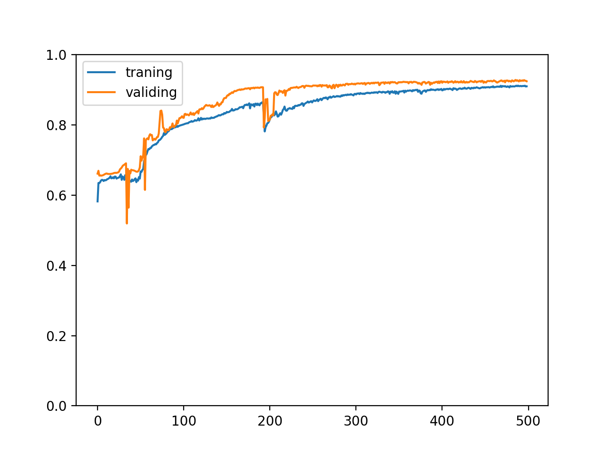

我们可以从图表看到训练集和验证集的正确率都随着训练逐渐上升，并且两个正确率非常接近，这代表训练很成功，模型针对训练集掌握了规律并且可以成功预测没有经过训练的验证集，但实际上我们很难会看到这样的图表，这是因为例子中的数据集是精心构建的并且生成了足够大量的数据。

我们还可能会看到以下类型的图表，分别代表不同的状况：

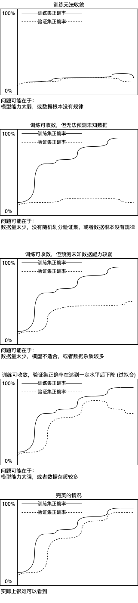

如果有足够的数据，数据遵从某种规律并且杂质较少，划分训练集和验证集的时候分布均匀，并且使用适当的模型，即可达到理想的状况，但实际很难做到😩。通过分析训练集和验证集的正确率变化我们可以定位问题发生在哪里，其中过拟合问题可以用提早停止 (Early Stopping) 的方式解决 (在第一篇文章已经提到过)，接下来我们看看如何决定什么时候停止训练。

## 决定什么时候停止训练

还记得第一篇提到的训练流程吗？我们将会了解如何在代码中实现这个训练流程：

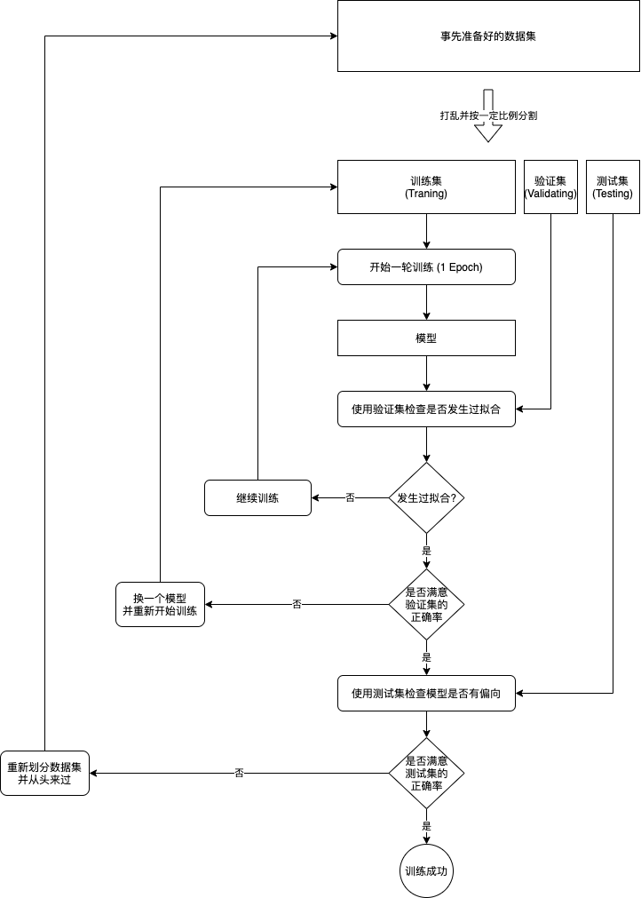

实现判断是否发生过拟合，可以简单的记录历史最高的验证集正确率，如果经过很多次训练都没有刷新最高正确率则结束训练。记录最高正确率的同时我们还需要保存模型的状态，这时模型摸索到了足够多的规律，但是还没有修改参数适应训练集中的杂质，用来预测未知数据可以达到最好的效果。这种手法又称提早停止 (Early Stopping)，是机器学习中很常见的手法。

代码实现如下：

``` python
# 引用 pytorch 和 pandas 和显示图表使用的 matplotlib
import pandas
import torch
from torch import nn
from matplotlib import pyplot

# 定义模型
class MyModel(nn.Module):
    def __init__(self):
        super().__init__()
        self.layer1 = nn.Linear(in_features=8, out_features=100)
        self.layer2 = nn.Linear(in_features=100, out_features=50)
        self.layer3 = nn.Linear(in_features=50, out_features=1)

    def forward(self, x):
        hidden1 = nn.functional.relu(self.layer1(x))
        hidden2 = nn.functional.relu(self.layer2(hidden1))
        y = self.layer3(hidden2)
        return y

# 给随机数生成器分配一个初始值，使得每次运行都可以生成相同的随机数
# 这是为了让训练过程可重现，你也可以选择不这样做
torch.random.manual_seed(0)

# 创建模型实例
model = MyModel()

# 创建损失计算器
loss_function = torch.nn.MSELoss()

# 创建参数调整器
optimizer = torch.optim.SGD(model.parameters(), lr=0.0000001)

# 从 csv 读取原始数据集
df = pandas.read_csv('salary.csv')
dataset_tensor = torch.tensor(df.values, dtype=torch.float)

# 切分训练集 (60%)，验证集 (20%) 和测试集 (20%)
random_indices = torch.randperm(dataset_tensor.shape[0])
traning_indices = random_indices[:int(len(random_indices)*0.6)]
validating_indices = random_indices[int(len(random_indices)*0.6):int(len(random_indices)*0.8):]
testing_indices = random_indices[int(len(random_indices)*0.8):]
traning_set_x = dataset_tensor[traning_indices][:,:-1]
traning_set_y = dataset_tensor[traning_indices][:,-1:]
validating_set_x = dataset_tensor[validating_indices][:,:-1]
validating_set_y = dataset_tensor[validating_indices][:,-1:]
testing_set_x = dataset_tensor[testing_indices][:,:-1]
testing_set_y = dataset_tensor[testing_indices][:,-1:]

# 记录训练集和验证集的正确率变化
traning_accuracy_history = []
validating_accuracy_history = []

# 记录最高的验证集正确率
validating_accuracy_highest = 0
validating_accuracy_highest_epoch = 0

# 开始训练过程
for epoch in range(1, 10000):
    print(f"epoch: {epoch}")

    # 根据训练集训练并修改参数
    # 切换模型到训练模式，将会启用自动微分，批次正规化 (BatchNorm) 与 Dropout
    model.train()

    traning_accuracy_list = []
    for batch in range(0, traning_set_x.shape[0], 100):
        # 切分批次，一次只计算 100 组数据
        batch_x = traning_set_x[batch:batch+100]
        batch_y = traning_set_y[batch:batch+100]
        # 计算预测值
        predicted = model(batch_x)
        # 计算损失
        loss = loss_function(predicted, batch_y)
        # 从损失自动微分求导函数值
        loss.backward()
        # 使用参数调整器调整参数
        optimizer.step()
        # 清空导函数值
        optimizer.zero_grad()
        # 记录这一个批次的正确率，torch.no_grad 代表临时禁用自动微分功能
        with torch.no_grad():
            traning_accuracy_list.append(1 - ((batch_y - predicted).abs() / batch_y).mean().item())
    traning_accuracy = sum(traning_accuracy_list) / len(traning_accuracy_list)
    traning_accuracy_history.append(traning_accuracy)
    print(f"training accuracy: {traning_accuracy}")

    # 检查验证集
    # 切换模型到验证模式，将会禁用自动微分，批次正规化 (BatchNorm) 与 Dropout
    model.eval()
    predicted = model(validating_set_x)
    validating_accuracy = 1 - ((validating_set_y - predicted).abs() / validating_set_y).mean()
    validating_accuracy_history.append(validating_accuracy.item())
    print(f"validating x: {validating_set_x}, y: {validating_set_y}, predicted: {predicted}")
    print(f"validating accuracy: {validating_accuracy}")

    # 记录最高的验证集正确率与当时的模型状态，判断是否在 100 次训练后仍然没有刷新记录
    if validating_accuracy > validating_accuracy_highest:
        validating_accuracy_highest = validating_accuracy
        validating_accuracy_highest_epoch = epoch
        torch.save(model.state_dict(), "model.pt")
        print("highest validating accuracy updated")
    elif epoch - validating_accuracy_highest_epoch > 100:
        # 在 100 次训练后仍然没有刷新记录，结束训练
        print("stop training because highest validating accuracy not updated in 100 epoches")
        break

# 使用达到最高正确率时的模型状态
print(f"highest validating accuracy: {validating_accuracy_highest}",
    f"from epoch {validating_accuracy_highest_epoch}")
model.load_state_dict(torch.load("model.pt"))

# 检查测试集
predicted = model(testing_set_x)
testing_accuracy = 1 - ((testing_set_y - predicted).abs() / testing_set_y).mean()
print(f"testing x: {testing_set_x}, y: {testing_set_y}, predicted: {predicted}")
print(f"testing accuracy: {testing_accuracy}")

# 显示训练集和验证集的正确率变化
pyplot.plot(traning_accuracy_history, label="traning")
pyplot.plot(validating_accuracy_history, label="validing")
pyplot.ylim(0, 1)
pyplot.legend()
pyplot.show()

# 手动输入数据预测输出
while True:
    try:
        print("enter input:")
        r = list(map(float, input().split(",")))
        x = torch.tensor(r).view(1, len(r))
        print(model(x)[0,0].item())
    except Exception as e:
        print("error:", e)
```

最终输出如下：

``` text
省略开始的输出

stop training because highest validating accuracy not updated in 100 epoches
highest validating accuracy: 0.93173748254776 from epoch 645
testing x: tensor([[48.,  1., 18.,  ...,  5.,  0.,  5.],
        [22.,  1.,  2.,  ...,  2.,  1.,  2.],
        [24.,  0.,  1.,  ...,  3.,  2.,  0.],
        ...,
        [24.,  0.,  4.,  ...,  0.,  1.,  1.],
        [39.,  0.,  0.,  ...,  0.,  5.,  5.],
        [36.,  0.,  5.,  ...,  3.,  0.,  3.]]), y: tensor([[14000.],
        [10500.],
        [13000.],
        ...,
        [15500.],
        [12000.],
        [19000.]]), predicted: tensor([[15612.1895],
        [10705.9873],
        [12577.7988],
        ...,
        [16281.9277],
        [10780.5996],
        [19780.3281]], grad_fn=<AddmmBackward>)
testing accuracy: 0.9330222606658936
```

训练集与验证集的正确率变化如下，可以看到我们停在了一个很好的地方😸，继续训练下去也不会有什么改进：

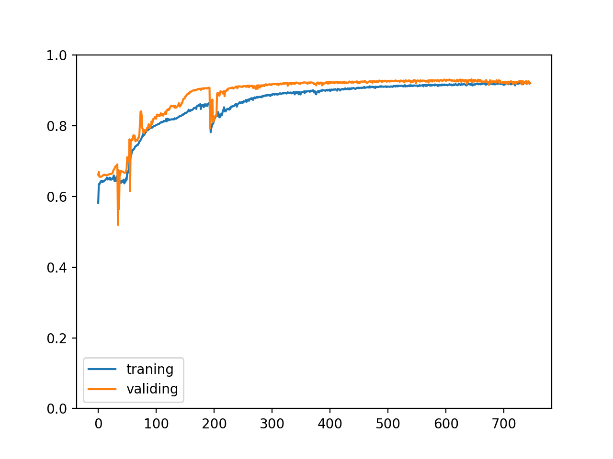

## 改进程序结构

我们还可以对程序结构进行以下的改进：

- 分离准备数据集和训练的过程
- 训练过程中分批读取数据
- 提供接口使用训练好的模型

至此为止我们看到的训练代码都是把准备数据集，训练，训练后评价和使用写在一个程序里面的，这样做容易理解但在实际业务中会比较浪费时间，如果你发现一个模型不适合，需要修改模型那么你得从头开始。我们可以分离准备数据集和训练的过程，首先读取原始数据并且转换到 tensor 对象再保存到硬盘，然后再从硬盘读取 tensor 对象进行训练，这样如果需要修改模型但不需要修改输入输出转换到 tensor 的编码时，可以节省掉第一步。

在实际业务上数据可能会非常庞大，做不到全部读取到内存中再分批次，这时我们可以在读取原始数据并且转换到 tensor 对象的时候进行分批，然后训练的过程中逐批从硬盘读取，这样就可以防止内存不足的问题。

最后我们可以提供一个对外的接口来使用训练好的模型，如果你的程序是 python 写的那么直接调用即可，但如果你的程序是其他语言写的，可能需要先建立一个 python 服务器提供 REST 服务，或者使用 TorchScript 进行跨语言交互，详细可以参考官方的[教程](https://pytorch.org/tutorials/intermediate/flask_rest_api_tutorial.html)。

总结起来我们会拆分以下过程：

- 读取原始数据集并转换到 tensor 对象
    - 分批次保存 tensor 对象到硬盘
- 分批次从硬盘读取 tensor 对象并进行训练
    - 训练时保存模型状态到硬盘 (一般选择保存验证集正确率最高时的模型状态)
- 提供接口使用训练好的模型

以下是改进后的示例代码：

``` python
import os
import sys
import pandas
import torch
import gzip
import itertools
from torch import nn
from matplotlib import pyplot

class MyModel(nn.Module):
    """根据码农条件预测工资的模型"""
    def __init__(self):
        super().__init__()
        self.layer1 = nn.Linear(in_features=8, out_features=100)
        self.layer2 = nn.Linear(in_features=100, out_features=50)
        self.layer3 = nn.Linear(in_features=50, out_features=1)

    def forward(self, x):
        hidden1 = nn.functional.relu(self.layer1(x))
        hidden2 = nn.functional.relu(self.layer2(hidden1))
        y = self.layer3(hidden2)
        return y

def save_tensor(tensor, path):
    """保存 tensor 对象到文件"""
    torch.save(tensor, gzip.GzipFile(path, "wb"))

def load_tensor(path):
    """从文件读取 tensor 对象"""
    return torch.load(gzip.GzipFile(path, "rb"))

def prepare():
    """准备训练"""
    # 数据集转换到 tensor 以后会保存在 data 文件夹下
    if not os.path.isdir("data"):
        os.makedirs("data")

    # 从 csv 读取原始数据集，分批每次读取 2000 行
    for batch, df in enumerate(pandas.read_csv('salary.csv', chunksize=2000)):
        dataset_tensor = torch.tensor(df.values, dtype=torch.float)

        # 切分训练集 (60%)，验证集 (20%) 和测试集 (20%)
        random_indices = torch.randperm(dataset_tensor.shape[0])
        traning_indices = random_indices[:int(len(random_indices)*0.6)]
        validating_indices = random_indices[int(len(random_indices)*0.6):int(len(random_indices)*0.8):]
        testing_indices = random_indices[int(len(random_indices)*0.8):]
        training_set = dataset_tensor[traning_indices]
        validating_set = dataset_tensor[validating_indices]
        testing_set = dataset_tensor[testing_indices]

        # 保存到硬盘
        save_tensor(training_set, f"data/training_set.{batch}.pt")
        save_tensor(validating_set, f"data/validating_set.{batch}.pt")
        save_tensor(testing_set, f"data/testing_set.{batch}.pt")
        print(f"batch {batch} saved")

def train():
    """开始训练"""
    # 创建模型实例
    model = MyModel()

    # 创建损失计算器
    loss_function = torch.nn.MSELoss()

    # 创建参数调整器
    optimizer = torch.optim.SGD(model.parameters(), lr=0.0000001)

    # 记录训练集和验证集的正确率变化
    traning_accuracy_history = []
    validating_accuracy_history = []

    # 记录最高的验证集正确率
    validating_accuracy_highest = 0
    validating_accuracy_highest_epoch = 0

    # 读取批次的工具函数
    def read_batches(base_path):
        for batch in itertools.count():
            path = f"{base_path}.{batch}.pt"
            if not os.path.isfile(path):
                break
            yield load_tensor(path)

    # 计算正确率的工具函数
    def calc_accuracy(actual, predicted):
        return max(0, 1 - ((actual - predicted).abs() / actual.abs()).mean().item())

    # 开始训练过程
    for epoch in range(1, 10000):
        print(f"epoch: {epoch}")

        # 根据训练集训练并修改参数
        # 切换模型到训练模式，将会启用自动微分，批次正规化 (BatchNorm) 与 Dropout
        model.train()
        traning_accuracy_list = []
        for batch in read_batches("data/training_set"):
            # 切分小批次，有助于泛化模型
             for index in range(0, batch.shape[0], 100):
                # 划分输入和输出
                batch_x = batch[index:index+100,:-1]
                batch_y = batch[index:index+100,-1:]
                # 计算预测值
                predicted = model(batch_x)
                # 计算损失
                loss = loss_function(predicted, batch_y)
                # 从损失自动微分求导函数值
                loss.backward()
                # 使用参数调整器调整参数
                optimizer.step()
                # 清空导函数值
                optimizer.zero_grad()
                # 记录这一个批次的正确率，torch.no_grad 代表临时禁用自动微分功能
                with torch.no_grad():
                    traning_accuracy_list.append(calc_accuracy(batch_y, predicted))
        traning_accuracy = sum(traning_accuracy_list) / len(traning_accuracy_list)
        traning_accuracy_history.append(traning_accuracy)
        print(f"training accuracy: {traning_accuracy}")

        # 检查验证集
        # 切换模型到验证模式，将会禁用自动微分，批次正规化 (BatchNorm) 与 Dropout
        model.eval()
        validating_accuracy_list = []
        for batch in read_batches("data/validating_set"):
            validating_accuracy_list.append(calc_accuracy(batch[:,-1:],  model(batch[:,:-1])))
        validating_accuracy = sum(validating_accuracy_list) / len(validating_accuracy_list)
        validating_accuracy_history.append(validating_accuracy)
        print(f"validating accuracy: {validating_accuracy}")

        # 记录最高的验证集正确率与当时的模型状态，判断是否在 100 次训练后仍然没有刷新记录
        if validating_accuracy > validating_accuracy_highest:
            validating_accuracy_highest = validating_accuracy
            validating_accuracy_highest_epoch = epoch
            save_tensor(model.state_dict(), "model.pt")
            print("highest validating accuracy updated")
        elif epoch - validating_accuracy_highest_epoch > 100:
            # 在 100 次训练后仍然没有刷新记录，结束训练
            print("stop training because highest validating accuracy not updated in 100 epoches")
            break

    # 使用达到最高正确率时的模型状态
    print(f"highest validating accuracy: {validating_accuracy_highest}",
        f"from epoch {validating_accuracy_highest_epoch}")
    model.load_state_dict(load_tensor("model.pt"))

    # 检查测试集
    testing_accuracy_list = []
    for batch in read_batches("data/testing_set"):
        testing_accuracy_list.append(calc_accuracy(batch[:,-1:],  model(batch[:,:-1])))
    testing_accuracy = sum(testing_accuracy_list) / len(testing_accuracy_list)
    print(f"testing accuracy: {testing_accuracy}")

    # 显示训练集和验证集的正确率变化
    pyplot.plot(traning_accuracy_history, label="traning")
    pyplot.plot(validating_accuracy_history, label="validing")
    pyplot.ylim(0, 1)
    pyplot.legend()
    pyplot.show()

def eval_model():
    """使用训练好的模型"""
    parameters = [
        "Age",
        "Gender (0: Male, 1: Female)",
        "Years of work experience",
        "Java Skill (0 ~ 5)",
        "NET Skill (0 ~ 5)",
        "JS Skill (0 ~ 5)",
        "CSS Skill (0 ~ 5)",
        "HTML Skill (0 ~ 5)"
    ]

    # 创建模型实例，加载训练好的状态，然后切换到验证模式
    model = MyModel()
    model.load_state_dict(load_tensor("model.pt"))
    model.eval()

    # 询问输入并预测输出
    while True:
        try:
            x = torch.tensor([int(input(f"Your {p}: ")) for p in parameters], dtype=torch.float)
            # 转换到 1 行 1 列的矩阵，这里其实可以不转换但推荐这么做，因为不是所有模型都支持非批次输入
            x = x.view(1, len(x))
            y = model(x)
            print("Your estimated salary:", y[0,0].item(), "\n")
        except Exception as e:
            print("error:", e)

def main():
    """主函数"""
    if len(sys.argv) < 2:
        print(f"Please run: {sys.argv[0]} prepare|train|eval")
        exit()

    # 给随机数生成器分配一个初始值，使得每次运行都可以生成相同的随机数
    # 这是为了让过程可重现，你也可以选择不这样做
    torch.random.manual_seed(0)

    # 根据命令行参数选择操作
    operation = sys.argv[1]
    if operation == "prepare":
        prepare()
    elif operation == "train":
        train()
    elif operation == "eval":
        eval_model()
    else:
        raise ValueError(f"Unsupported operation: {operation}")

if __name__ == "__main__":
    main()
```

执行以下命令即可走一遍完整的流程，如果你需要调整模型，可以直接重新运行 train 避免 prepare 的时间消耗：

``` text
python3 example.py prepare
python3 example.py train
python3 example.py eval
```

注意以上代码在打乱数据集和分批的处理上与以往的代码不一样，以上的代码会分段读取 csv 文件，然后对每一段打乱再切分训练集，验证集和测试集，这样做同样可以保证数据在各个集合中分布均匀。最终训练集和验证集的正确率变化如下：

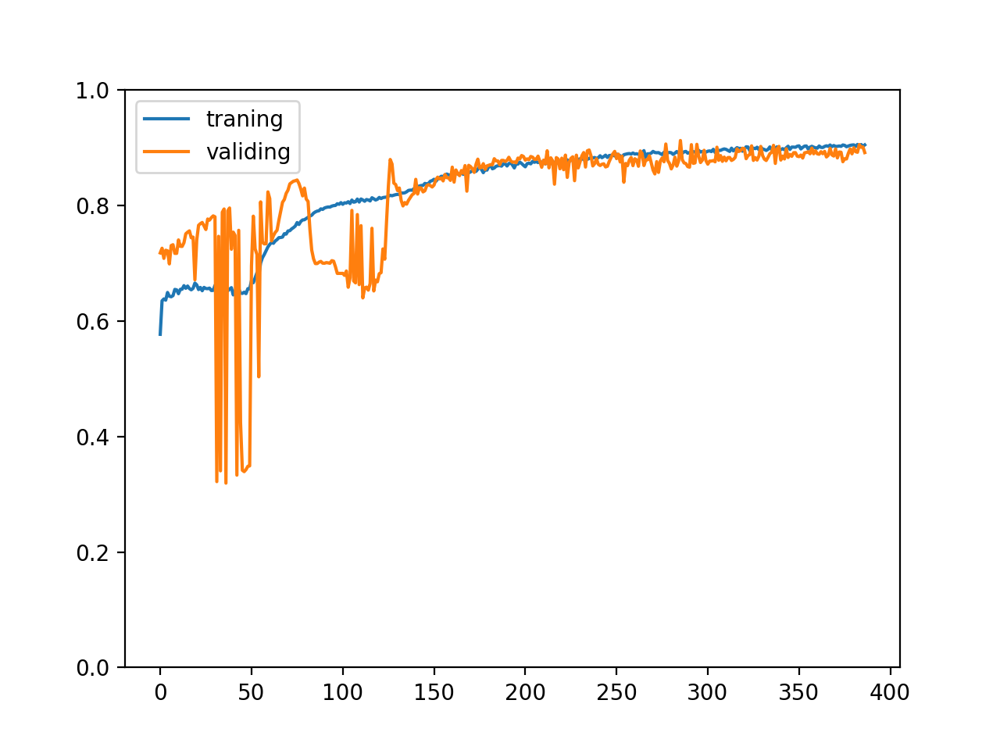

## 正规化输入和输出值

目前为止我们在训练的时候都是直接给模型原始的输入值，然后用原始的输出值去调整参数，这样做的问题是，如果输入值非常大导函数值也会非常大，如果输出值非常大需要调整参数的次数会非常多，过去我们用一个非常非常小的学习比率 (0.0000001) 来避开这个问题，但其实有更好的办法，那就是正规化输入和输出值。这里的正规化指的是让输入值和输出值按一定比例缩放，让大部分的值都落在 -1 ~ 1 的区间中。在根据码农条件预测工资的例子中，我们可以把年龄和工作经验年数乘以 0.01 (范围 0 ~ 100 年)，各项技能乘以 0.02 (范围 0 ~ 5)，工资乘以 0.0001 (以万为单位)，对 `dataset_tensor` 进行以下操作即可实现：

``` python
# 对每一行乘以指定的系数
dataset_tensor *= torch.tensor([0.01, 1, 0.01, 0.2, 0.2, 0.2, 0.2, 0.2, 0.0001])
```

然后再修改学习比率为 0.01:

``` python
optimizer = torch.optim.SGD(model.parameters(), lr=0.01)
```

比较训练 300 次的正确率变化如下：

正规化输入和输出值前

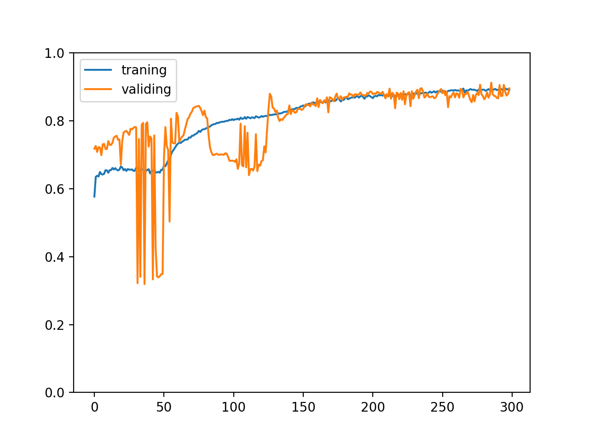

正规化输入和输出值后

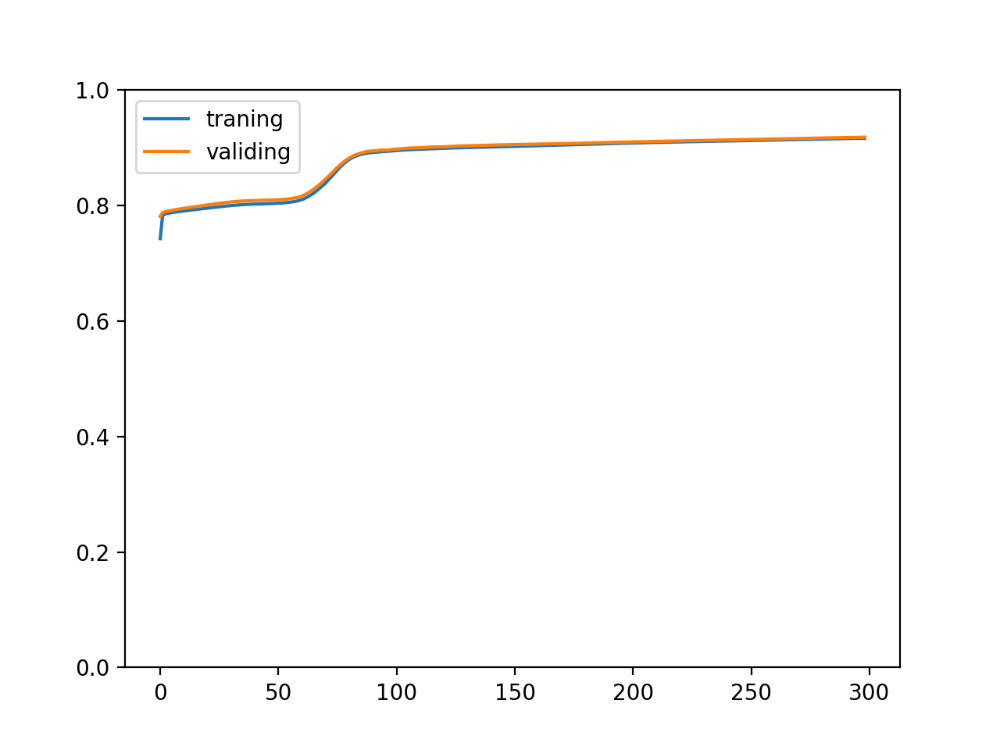

可以看到效果相当惊人😈，正规化输入和输出值后训练速度变快了并且正确率的变化曲线平滑了很多。实际上这是必须做的，部分数据集如果没有经过正规化根本无法学习，让模型接收和输出更小的值 (-1 ~ 1 的区间) 可以防止导函数值爆炸和使用更高的学习比率加快训练速度。

此外，别忘了在使用模型的时候缩放输入和输出值：

``` python
x = torch.tensor([int(input(f"Your {p}: ")) for p in parameters], dtype=torch.float)
x *= torch.tensor([0.01, 1, 0.01, 0.2, 0.2, 0.2, 0.2, 0.2])
# 转换到 1 行 1 列的矩阵，这里其实可以不转换但推荐这么做，因为不是所有模型都支持非批次输入
x = x.view(1, len(x))
y = model(x) * 10000
print("Your estimated salary:", y[0,0].item(), "\n")
```

## 使用 Dropout 帮助泛化模型

在之前的内容中已经提到过，如果模型能力过于强大或者数据杂质较多，则模型有可能会适应数据中的杂质以达到更高的正确率 (过拟合现象)，这时候虽然训练集的正确率会上升，但验证集的正确率会维持甚至下降，模型应对未知数据的能力会降低。防止过拟合现象，增强模型应对未知数据的能力又称泛化模型 (Generalize Model)，泛化模型的手段之一是使用 Dropout，Dropout 会在训练过程中随机屏蔽一部分的神经元，让这些神经元的输出为 0，同时增幅没有被屏蔽的神经元输出让输出值合计接近原有的水平，这样做的好处是模型会尝试摸索怎样在一部分神经元被屏蔽后仍然可以正确预测结果 (减弱跨层神经元之间的关联)，最终导致模型更充分的掌握数据的规律。

下图是使用 Dropout 以后的神经元网络例子 (3 输入 2 输出，3 层每层各 5 隐藏值)：

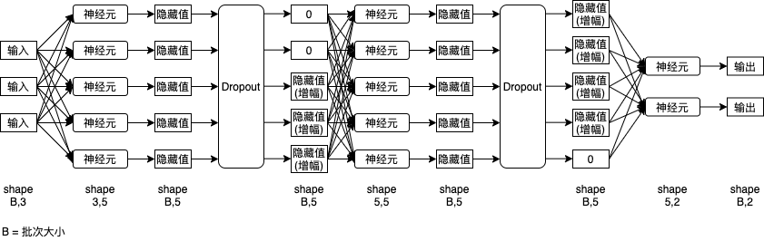

接下来我们看看在 Pytorch 中怎么使用 Dropout：

``` python
# 引用 pytorch 类库
>>> import torch

# 创建屏蔽 20% 的 Dropout 函数
>>> dropout = torch.nn.Dropout(0.2)

# 定义一个 tensor (假设这个 tensor 是某个神经元网络层的输出结果)
>>> a = torch.tensor(range(1, 11), dtype=torch.float)
>>> a
tensor([ 1.,  2.,  3.,  4.,  5.,  6.,  7.,  8.,  9., 10.])

# 应用 Dropout 函数
# 我们可以看到没有屏蔽的值都会相应的增加 (除以 0.8) 以让合计值维持原有的水平
# 此外屏蔽的数量会根据概率浮动，不一定 100% 等于我们设置的比例 (这里有屏蔽 1 个值的也有屏蔽 3 个值的)
>>> dropout(a)
tensor([ 0.0000,  2.5000,  3.7500,  5.0000,  6.2500,  7.5000,  8.7500, 10.0000,
        11.2500, 12.5000])
>>> dropout(a)
tensor([ 1.2500,  2.5000,  3.7500,  5.0000,  6.2500,  7.5000,  8.7500,  0.0000,
        11.2500,  0.0000])
>>> dropout(a)
tensor([ 1.2500,  2.5000,  3.7500,  5.0000,  6.2500,  7.5000,  8.7500,  0.0000,
        11.2500, 12.5000])
>>> dropout(a)
tensor([ 1.2500,  2.5000,  3.7500,  5.0000,  6.2500,  7.5000,  0.0000, 10.0000,
        11.2500,  0.0000])
>>> dropout(a)
tensor([ 1.2500,  2.5000,  3.7500,  5.0000,  0.0000,  7.5000,  8.7500, 10.0000,
        11.2500,  0.0000])
>>> dropout(a)
tensor([ 1.2500,  2.5000,  0.0000,  5.0000,  0.0000,  7.5000,  8.7500, 10.0000,
        11.2500, 12.5000])
>>> dropout(a)
tensor([ 0.0000,  2.5000,  3.7500,  5.0000,  6.2500,  7.5000,  0.0000, 10.0000,
         0.0000,  0.0000])
```

接下来我们看看怎样应用 Dropout 到模型中，首先我们重现一下过拟合现象，增加模型的神经元数量并且减少训练集的数据量即可：

模型部分的代码：

``` python
class MyModel(nn.Module):
    """根据码农条件预测工资的模型"""
    def __init__(self):
        super().__init__()
        self.layer1 = nn.Linear(in_features=8, out_features=200)
        self.layer2 = nn.Linear(in_features=200, out_features=100)
        self.layer3 = nn.Linear(in_features=100, out_features=1)

    def forward(self, x):
        hidden1 = nn.functional.relu(self.layer1(x))
        hidden2 = nn.functional.relu(self.layer2(hidden1))
        y = self.layer3(hidden2)
        return y
```

训练部分的代码 (每个批次只训练前 16 个数据)：

``` python
for batch in read_batches("data/training_set"):
    # 切分小批次，有助于泛化模型
     for index in range(0, batch.shape[0], 16):
        # 划分输入和输出
        batch_x = batch[index:index+16,:-1]
        batch_y = batch[index:index+16,-1:]
        # 计算预测值
        predicted = model(batch_x)
        # 计算损失
        loss = loss_function(predicted, batch_y)
        # 从损失自动微分求导函数值
        loss.backward()
        # 使用参数调整器调整参数
        optimizer.step()
        # 清空导函数值
        optimizer.zero_grad()
        # 记录这一个批次的正确率，torch.no_grad 代表临时禁用自动微分功能
        with torch.no_grad():
            traning_accuracy_list.append(calc_accuracy(batch_y, predicted))
        # 只训练前 16 个数据
        break
```

固定训练 1000 次以后的正确率：

``` text
training accuracy: 0.9706422178819776
validating accuracy: 0.8514168351888657
highest validating accuracy: 0.8607834208011628 from epoch 223
testing accuracy: 0.8603586450219154
```

以及正确率变化的趋势：

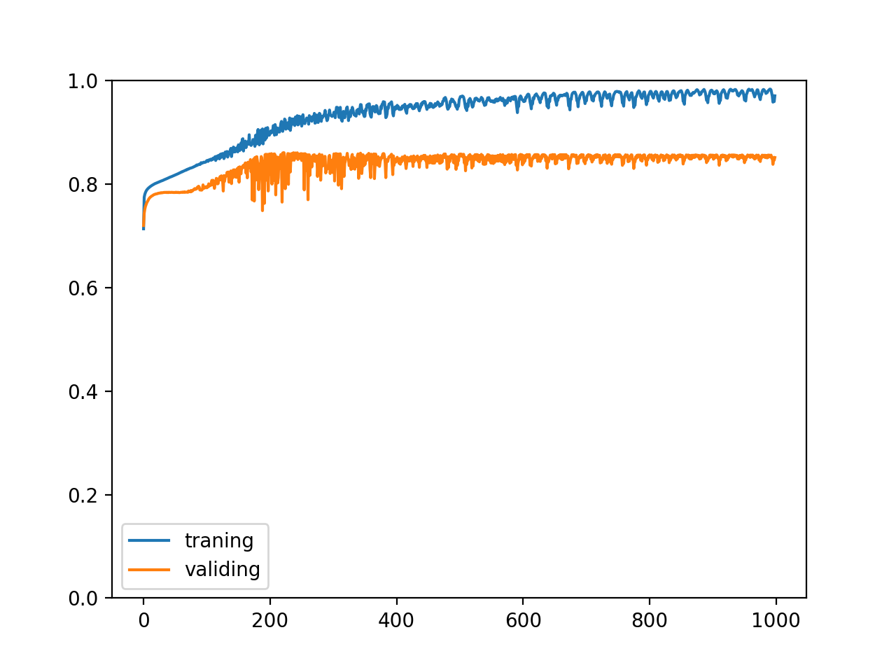

试着在模型中加入两个 Dropout，分别对应第一层与第二层的输出 (隐藏值)：

``` python
class MyModel(nn.Module):
    """根据码农条件预测工资的模型"""
    def __init__(self):
        super().__init__()
        self.layer1 = nn.Linear(in_features=8, out_features=200)
        self.layer2 = nn.Linear(in_features=200, out_features=100)
        self.layer3 = nn.Linear(in_features=100, out_features=1)
        self.dropout1 = nn.Dropout(0.2)
        self.dropout2 = nn.Dropout(0.2)

    def forward(self, x):
        hidden1 = self.dropout1(nn.functional.relu(self.layer1(x)))
        hidden2 = self.dropout2(nn.functional.relu(self.layer2(hidden1)))
        y = self.layer3(hidden2)
        return y
```

这时候再来训练会得出以下的正确率：

``` text
training accuracy: 0.9326518730819225
validating accuracy: 0.8692235469818115
highest validating accuracy: 0.8728838726878166 from epoch 867
testing accuracy: 0.8733032837510109
```

以及正确率变化的趋势：

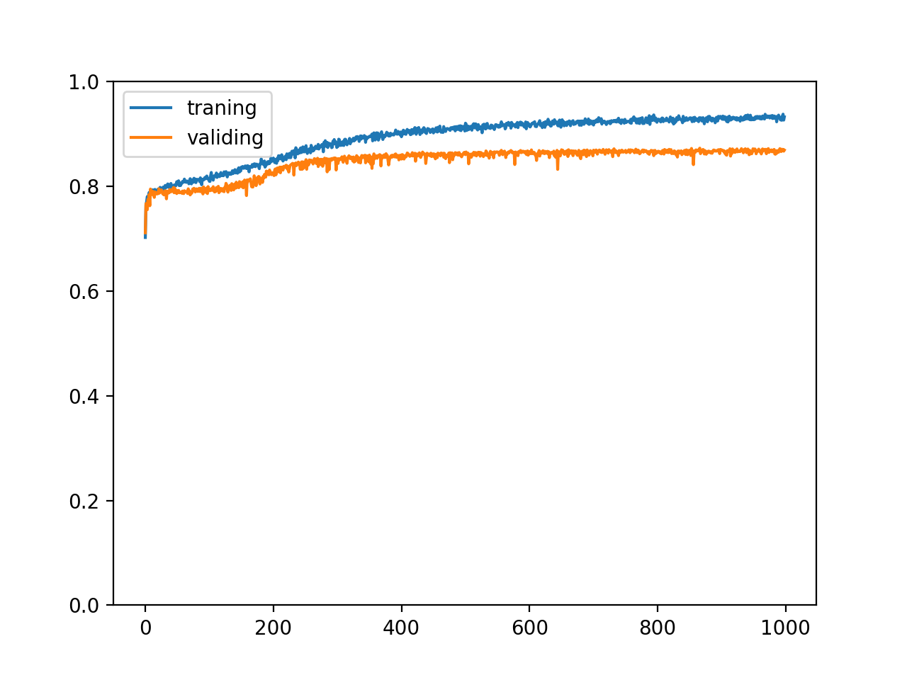

我们可以看到训练集的正确率没有盲目的上升，并且验证集与测试集的正确率都各上升了 1% 以上，说明 Dropout 是有一定效果的。

使用 Dropout 时应该注意以下的几点：

- Dropout 应该针对隐藏值使用，不能放在第一层的前面 (针对输入) 或者最后一层的后面 (针对输出)
- Dropout 应该放在激活函数后面 (因为激活函数是神经元的一部分)
- Dropout 只应该在训练过程中使用，评价或实际使用模型时应该调用 `model.eval()` 切换模型到评价模式，以禁止 Dropout
- Dropout 函数应该定义为模型的成员，这样调用 `model.eval()` 可以索引到模型对应的所有 Dropout 函数
- Dropout 的屏蔽比例没有最佳值，你可以针对当前的数据和模型多试几次找出最好的结果

提出 Dropout 手法的原始论文在[这里](https://arxiv.org/abs/1207.0580)，如果你有兴趣可以查看。

## 使用 BatchNorm 正规化批次

BatchNorm 是另外一种提升训练效果的手法，在一些场景下可以提升训练效率和抑制过拟合，BatchNorm 和 Dropout 一样针对隐藏值使用，会对每个批次的各项值 (每一列) 进行正规化，计算公式如下：

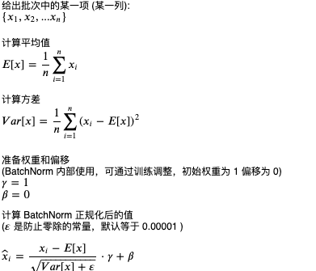

总结来说就是让每一列中的各个值减去这一列的平均值，然后除以这一列的标准差，再按一定比例调整。

在 python 中使用 BatchNorm 的例子如下：

``` python
# 创建 batchnorm 函数，3 代表列数
>>> batchnorm = torch.nn.BatchNorm1d(3)

# 查看 batchnorm 函数内部的权重与偏移
>>> list(batchnorm.parameters())
[Parameter containing:
tensor([1., 1., 1.], requires_grad=True), Parameter containing:
tensor([0., 0., 0.], requires_grad=True)]

# 随机创建一个 10 行 3 列的 tensor
>>> a = torch.rand((10, 3))
>>> a
tensor([[0.9643, 0.6933, 0.0039],
        [0.3967, 0.8239, 0.3490],
        [0.4011, 0.8903, 0.3053],
        [0.0666, 0.5766, 0.4976],
        [0.4928, 0.1403, 0.8900],
        [0.7317, 0.9461, 0.1816],
        [0.4461, 0.9987, 0.8324],
        [0.3714, 0.6550, 0.9961],
        [0.4852, 0.7415, 0.1779],
        [0.6876, 0.1538, 0.3429]])

# 应用 batchnorm 函数
>>> batchnorm(a)
tensor([[ 1.9935,  0.1096, -1.4156],
        [-0.4665,  0.5665, -0.3391],
        [-0.4477,  0.7985, -0.4754],
        [-1.8972, -0.2986,  0.1246],
        [-0.0501, -1.8245,  1.3486],
        [ 0.9855,  0.9939, -0.8611],
        [-0.2523,  1.1776,  1.1691],
        [-0.5761, -0.0243,  1.6798],
        [-0.0831,  0.2783, -0.8727],
        [ 0.7941, -1.7770, -0.3581]], grad_fn=<NativeBatchNormBackward>)

# 手动重现 batchnorm 对第一列的计算
>>> aa = a[:,:1]
>>> aa
tensor([[0.9643],
        [0.3967],
        [0.4011],
        [0.0666],
        [0.4928],
        [0.7317],
        [0.4461],
        [0.3714],
        [0.4852],
        [0.6876]])
>>> (aa - aa.mean()) / (((aa - aa.mean()) ** 2).mean() + 0.00001).sqrt()
tensor([[ 1.9935],
        [-0.4665],
        [-0.4477],
        [-1.8972],
        [-0.0501],
        [ 0.9855],
        [-0.2523],
        [-0.5761],
        [-0.0831],
        [ 0.7941]])
```

修改模型使用 BatchNorm 的代码如下：

``` python
class MyModel(nn.Module):
    """根据码农条件预测工资的模型"""
    def __init__(self):
        super().__init__()
        self.layer1 = nn.Linear(in_features=8, out_features=200)
        self.layer2 = nn.Linear(in_features=200, out_features=100)
        self.layer3 = nn.Linear(in_features=100, out_features=1)
        self.batchnorm1 = nn.BatchNorm1d(200)
        self.batchnorm2 = nn.BatchNorm1d(100)
        self.dropout1 = nn.Dropout(0.1)
        self.dropout2 = nn.Dropout(0.1)

    def forward(self, x):
        hidden1 = self.dropout1(self.batchnorm1(nn.functional.relu(self.layer1(x))))
        hidden2 = self.dropout2(self.batchnorm2(nn.functional.relu(self.layer2(hidden1))))
        y = self.layer3(hidden2)
        return y
```

需要同时调整学习比率：

``` text
# 创建参数调整器
optimizer = torch.optim.SGD(model.parameters(), lr=0.05)
```

固定训练 1000 次的结果如下，可以看到在这个场景下 BatchNorm 没有发挥作用🤕，反而减慢了学习速度和影响可达到的最高正确率 (你可以试试增加训练次数)：

``` text
training accuracy: 0.9048486271500588
validating accuracy: 0.8341873311996459
highest validating accuracy: 0.8443503141403198 from epoch 946
testing accuracy: 0.8452585405111313
```

使用 BatchNorm 时应该注意以下的几点：

- BatchNorm 应该针对隐藏值使用，和 Dropout 一样
- BatchNorm 需要指定隐藏值数量，应该与对应层的输出数量匹配
- BatchNorm 应该放在 Dropout 前面，有部分人会选择把 BatchNorm 放在激活函数前，也有部分人选择放在激活函数后
    - Linear => ReLU => BatchNorm => Dropout
    - Linear => BatchNorm => ReLU => Dropout
- BatchNorm 只应该在训练过程中使用，和 Dropout 一样
- BatchNorm 函数应该定义为模型的成员，和 Dropout 一样
- 使用 BatchNorm 的时候应该相应的减少 Dropout 的屏蔽比例
- 部分场景可能不适用 BatchNorm (据说更适用于对象识别和图片分类)，需要实践才能出真知 ☭

提出 BatchNorm 手法的原始论文在[这里](https://arxiv.org/abs/1502.03167)，如果你有兴趣可以查看。

## 理解模型的 eval 和 train 模式

在前面的例子中我们使用了 `eval` 和 `train` 函数切换模型到评价模式和训练模式，评价模式会禁用自动微分，Dropout 和 BatchNorm，那么这两个模式是如何实现的呢？

pytorch 的模型都基于 `torch.nn.Module` 这个类，不仅是我们自己定义的模型，`nn.Sequential`, `nn.Linear`, `nn.ReLU`, `nn.Dropout`, `nn.BatchNorm1d` 等等的类型都会基于 `torch.nn.Module`，`torch.nn.Module` 有一个 `training` 成员代表模型是否处于训练模式，而 `eval` 函数用于递归设置所有 `Module` 的 `training` 为 `False`，`train` 函数用于递归设置所有 `Module` 的 `training` 为 True。我们可以手动设置这个成员看看是否能起到相同效果：

``` python
>>> a = torch.tensor(range(1, 11), dtype=torch.float)
>>> dropout = torch.nn.Dropout(0.2)

>>> dropout.training = False
>>> dropout(a)
tensor([ 1.,  2.,  3.,  4.,  5.,  6.,  7.,  8.,  9., 10.])

>>> dropout.training = True
>>> dropout(a)
tensor([ 1.2500,  2.5000,  3.7500,  0.0000,  0.0000,  7.5000,  8.7500, 10.0000,
         0.0000, 12.5000])
```

理解这一点后，你可以在模型中添加只在训练或者评价的时候执行的代码，根据 `self.training` 判断即可。

## 最终代码

根据码农条件预测工资的最终代码如下：

``` python
import os
import sys
import pandas
import torch
import gzip
import itertools
from torch import nn
from matplotlib import pyplot

class MyModel(nn.Module):
    """根据码农条件预测工资的模型"""
    def __init__(self):
        super().__init__()
        self.layer1 = nn.Linear(in_features=8, out_features=200)
        self.layer2 = nn.Linear(in_features=200, out_features=100)
        self.layer3 = nn.Linear(in_features=100, out_features=1)
        self.batchnorm1 = nn.BatchNorm1d(200)
        self.batchnorm2 = nn.BatchNorm1d(100)
        self.dropout1 = nn.Dropout(0.1)
        self.dropout2 = nn.Dropout(0.1)

    def forward(self, x):
        hidden1 = self.dropout1(self.batchnorm1(nn.functional.relu(self.layer1(x))))
        hidden2 = self.dropout2(self.batchnorm2(nn.functional.relu(self.layer2(hidden1))))
        y = self.layer3(hidden2)
        return y

def save_tensor(tensor, path):
    """保存 tensor 对象到文件"""
    torch.save(tensor, gzip.GzipFile(path, "wb"))

def load_tensor(path):
    """从文件读取 tensor 对象"""
    return torch.load(gzip.GzipFile(path, "rb"))

def prepare():
    """准备训练"""
    # 数据集转换到 tensor 以后会保存在 data 文件夹下
    if not os.path.isdir("data"):
        os.makedirs("data")

    # 从 csv 读取原始数据集，分批每次读取 2000 行
    for batch, df in enumerate(pandas.read_csv('salary.csv', chunksize=2000)):
        dataset_tensor = torch.tensor(df.values, dtype=torch.float)

        # 正规化输入和输出
        dataset_tensor *= torch.tensor([0.01, 1, 0.01, 0.2, 0.2, 0.2, 0.2, 0.2, 0.0001])

        # 切分训练集 (60%)，验证集 (20%) 和测试集 (20%)
        random_indices = torch.randperm(dataset_tensor.shape[0])
        traning_indices = random_indices[:int(len(random_indices)*0.6)]
        validating_indices = random_indices[int(len(random_indices)*0.6):int(len(random_indices)*0.8):]
        testing_indices = random_indices[int(len(random_indices)*0.8):]
        training_set = dataset_tensor[traning_indices]
        validating_set = dataset_tensor[validating_indices]
        testing_set = dataset_tensor[testing_indices]

        # 保存到硬盘
        save_tensor(training_set, f"data/training_set.{batch}.pt")
        save_tensor(validating_set, f"data/validating_set.{batch}.pt")
        save_tensor(testing_set, f"data/testing_set.{batch}.pt")
        print(f"batch {batch} saved")

def train():
    """开始训练"""
    # 创建模型实例
    model = MyModel()

    # 创建损失计算器
    loss_function = torch.nn.MSELoss()

    # 创建参数调整器
    optimizer = torch.optim.SGD(model.parameters(), lr=0.05)

    # 记录训练集和验证集的正确率变化
    traning_accuracy_history = []
    validating_accuracy_history = []

    # 记录最高的验证集正确率
    validating_accuracy_highest = 0
    validating_accuracy_highest_epoch = 0

    # 读取批次的工具函数
    def read_batches(base_path):
        for batch in itertools.count():
            path = f"{base_path}.{batch}.pt"
            if not os.path.isfile(path):
                break
            yield load_tensor(path)

    # 计算正确率的工具函数
    def calc_accuracy(actual, predicted):
        return max(0, 1 - ((actual - predicted).abs() / actual.abs()).mean().item())

    # 开始训练过程
    for epoch in range(1, 10000):
        print(f"epoch: {epoch}")

        # 根据训练集训练并修改参数
        # 切换模型到训练模式，将会启用自动微分，批次正规化 (BatchNorm) 与 Dropout
        model.train()
        traning_accuracy_list = []
        for batch in read_batches("data/training_set"):
            # 切分小批次，有助于泛化模型
             for index in range(0, batch.shape[0], 100):
                # 划分输入和输出
                batch_x = batch[index:index+100,:-1]
                batch_y = batch[index:index+100,-1:]
                # 计算预测值
                predicted = model(batch_x)
                # 计算损失
                loss = loss_function(predicted, batch_y)
                # 从损失自动微分求导函数值
                loss.backward()
                # 使用参数调整器调整参数
                optimizer.step()
                # 清空导函数值
                optimizer.zero_grad()
                # 记录这一个批次的正确率，torch.no_grad 代表临时禁用自动微分功能
                with torch.no_grad():
                    traning_accuracy_list.append(calc_accuracy(batch_y, predicted))
        traning_accuracy = sum(traning_accuracy_list) / len(traning_accuracy_list)
        traning_accuracy_history.append(traning_accuracy)
        print(f"training accuracy: {traning_accuracy}")

        # 检查验证集
        # 切换模型到验证模式，将会禁用自动微分，批次正规化 (BatchNorm) 与 Dropout
        model.eval()
        validating_accuracy_list = []
        for batch in read_batches("data/validating_set"):
            validating_accuracy_list.append(calc_accuracy(batch[:,-1:],  model(batch[:,:-1])))
        validating_accuracy = sum(validating_accuracy_list) / len(validating_accuracy_list)
        validating_accuracy_history.append(validating_accuracy)
        print(f"validating accuracy: {validating_accuracy}")

        # 记录最高的验证集正确率与当时的模型状态，判断是否在 100 次训练后仍然没有刷新记录
        if validating_accuracy > validating_accuracy_highest:
            validating_accuracy_highest = validating_accuracy
            validating_accuracy_highest_epoch = epoch
            save_tensor(model.state_dict(), "model.pt")
            print("highest validating accuracy updated")
        elif epoch - validating_accuracy_highest_epoch > 100:
            # 在 100 次训练后仍然没有刷新记录，结束训练
            print("stop training because highest validating accuracy not updated in 100 epoches")
            break

    # 使用达到最高正确率时的模型状态
    print(f"highest validating accuracy: {validating_accuracy_highest}",
        f"from epoch {validating_accuracy_highest_epoch}")
    model.load_state_dict(load_tensor("model.pt"))

    # 检查测试集
    testing_accuracy_list = []
    for batch in read_batches("data/testing_set"):
        testing_accuracy_list.append(calc_accuracy(batch[:,-1:],  model(batch[:,:-1])))
    testing_accuracy = sum(testing_accuracy_list) / len(testing_accuracy_list)
    print(f"testing accuracy: {testing_accuracy}")

    # 显示训练集和验证集的正确率变化
    pyplot.plot(traning_accuracy_history, label="traning")
    pyplot.plot(validating_accuracy_history, label="validing")
    pyplot.ylim(0, 1)
    pyplot.legend()
    pyplot.show()

def eval_model():
    """使用训练好的模型"""
    parameters = [
        "Age",
        "Gender (0: Male, 1: Female)",
        "Years of work experience",
        "Java Skill (0 ~ 5)",
        "NET Skill (0 ~ 5)",
        "JS Skill (0 ~ 5)",
        "CSS Skill (0 ~ 5)",
        "HTML Skill (0 ~ 5)"
    ]

    # 创建模型实例，加载训练好的状态，然后切换到验证模式
    model = MyModel()
    model.load_state_dict(load_tensor("model.pt"))
    model.eval()

    # 询问输入并预测输出
    while True:
        try:
            x = torch.tensor([int(input(f"Your {p}: ")) for p in parameters], dtype=torch.float)
            # 正规化输入
            x *= torch.tensor([0.01, 1, 0.01, 0.2, 0.2, 0.2, 0.2, 0.2])
            # 转换到 1 行 1 列的矩阵，这里其实可以不转换但推荐这么做，因为不是所有模型都支持非批次输入
            x = x.view(1, len(x))
            # 预测输出
            y = model(x)
            # 反正规化输出
            y *= 10000
            print("Your estimated salary:", y[0,0].item(), "\n")except Exception as e:
            print("error:", e)

def main():
    """主函数"""
    if len(sys.argv) < 2:
        print(f"Please run: {sys.argv[0]} prepare|train|eval")
        exit()

    # 给随机数生成器分配一个初始值，使得每次运行都可以生成相同的随机数
    # 这是为了让过程可重现，你也可以选择不这样做
    torch.random.manual_seed(0)

    # 根据命令行参数选择操作
    operation = sys.argv[1]
    if operation == "prepare":
        prepare()
    elif operation == "train":
        train()
    elif operation == "eval":
        eval_model()
    else:
        raise ValueError(f"Unsupported operation: {operation}")

if __name__ == "__main__":
    main()
```

最终训练结果如下，验证集和测试集正确率达到了 94.3% (前一篇分别是 93.3% 和 93.1%)：

``` text
epoch: 848
training accuracy: 0.929181088420252
validating accuracy: 0.9417830203473568
stop training because highest validating accuracy not updated in 100 epoches
highest validating accuracy: 0.9437697219848633 from epoch 747
testing accuracy: 0.9438129015266895
```

正确率变化如下：

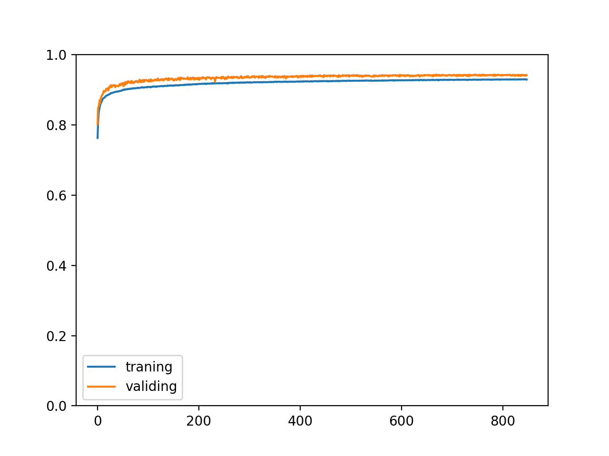

算是圆满成功了叭🥳。

## 写在最后

在这一篇我们看到了各种改进训练过程和改善训练效果的手法，预测了各种各样码农的工资🙀，接下来我们可以试着做一些不同的事情了。下一篇会介绍递归模型 RNN，LSTM 与 GRU，它们可以用于处理不定长度的数据，实现根据上下文分类，预测趋势，自动补全等功能。
