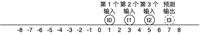
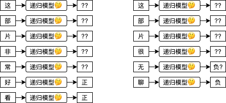
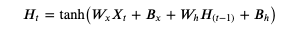
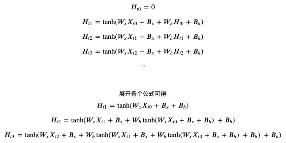
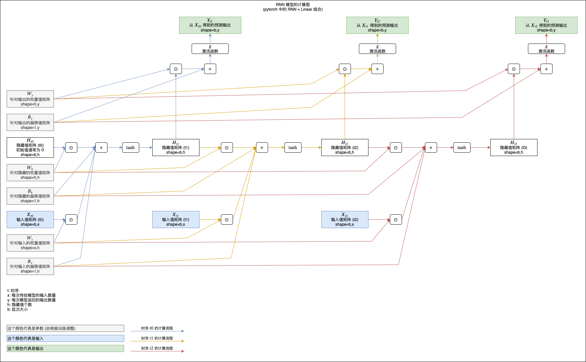
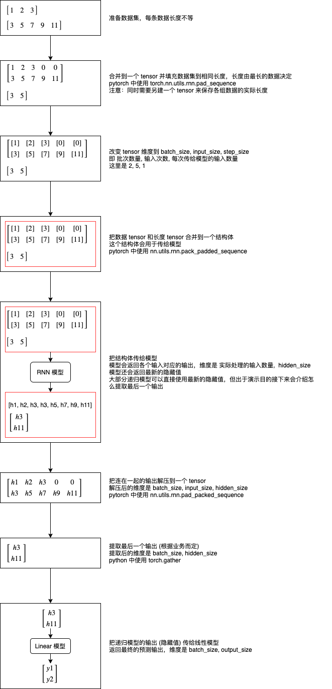
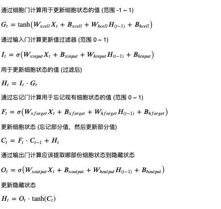
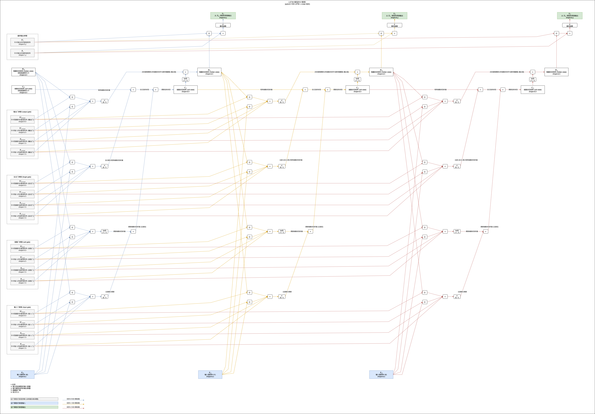
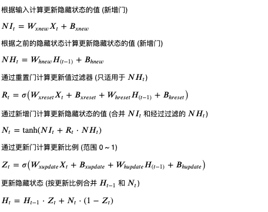
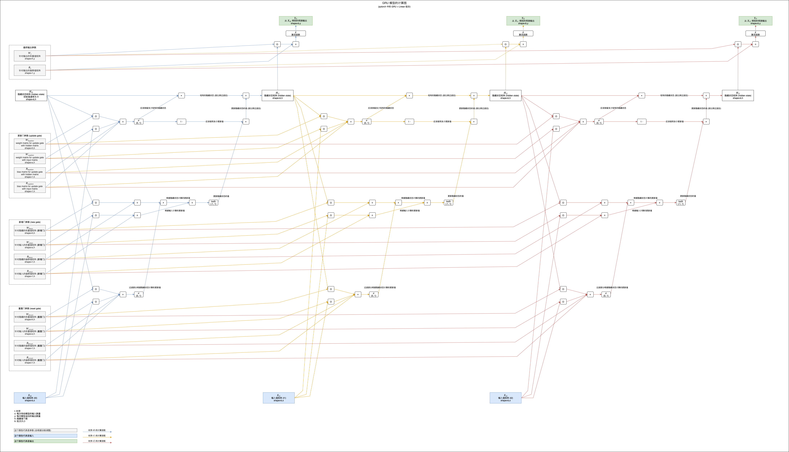

# 写给程序员的机器学习入门 (五) - 递归模型 RNN，LSTM 与 GRU

## 递归模型的应用场景

在前面的文章中我们看到的多层线性模型能处理的输入数量是固定的，如果一个模型能接收两个输入那么你就不能给它传一个或者三个。而有时候我们需要根据数量不一定的输入来预测输出，例如文本就是数量不一定的输入，“这部片非常好看” 有 7 个字，“这部片很无聊” 有 6 个字，如果我们想根据文本判断是正面评价还是负面评价，那么就需要使用支持不定长度 (即可以接收 6 个又可以接收 7 个) 输入的模型。时序性的数据数量也是不一定的，例如一个运动中的球，从某个时间点开始的第 0 秒在位置 1，第 1 秒在位置 3，第 2 秒在位置 5，那么正确的模型应该可以预测出第 3 秒在位置 7，如下图所示。当然，时序性的数据可以固定一个窗口（例如最近的 5 条数据）来处理，这样输入数量就是一定的，但灵活性就降低了，窗口设置过小可能会导致没有足够的信息用于预测输出，过大则会影响性能。



递归模型 (Recursive Model) 可以用于处理不定长度的输入，用法是一次只传固定数量的输入给模型，可以分多次传，传的次数根据数据而定。以上述例子来说，“这部片非常好看” 每次传一个字需要传 7 次，“这部片很无聊” 每次传一个字需要传 6 次。而递归模型每收到一次输入都会返回一次输出，有的场景只会使用最后一次输出的结果 (例如这个例子)，而有的场景则会使用每一次输出的结果。



换成代码可以这样理解：

``` text
model = MyRecursiveModel()
model('这')
model('部')
model('片')
model('非')
model('常')
model('好')
last_output = model('看')
print(last_output)
```

接下来我们看看几个经典的递归模型是怎么实现的。

## 最简单的递归模型 - RNN (tanh)

RNN tanh (Recurrent Neural Network - tanh) 是最简单的递归模型，计算公式如下，数学不好的第一印象可能会觉得妈呀一看数学公式就头昏脑胀了🙀，我们先一个个参数来分析，`H` 是递归模型内部记录的一个隐藏值矩阵，`Ht` 代表当前时序的值，而 `H(t-1)` 代表前一个时序的值，`t` 可以置换到具体的数字，例如 `Ht0` 代表隐藏值矩阵最开始的状态 (一般会使用 0 初始化)，`Ht1` 代表隐藏值矩阵第一次更新以后的状态，`Ht2` 代笔隐藏值矩阵第二次更新以后的状态，计算 `Ht1` 时 `H(t-1)` 代表 `Ht0`，计算 `Ht2` 时 `H(t-1)` 代表 `Ht1`；`Wx` 是针对输入的权重值，`Bx` 是针对输入的偏移值，`Wh` 是针对隐藏的权重值，`Bh` 是针对隐藏的偏移值；tanh 用于把实数转换为 `-1 ~ 1` 之间的范围。这个公式和之前我们看到的人工神经元很相似，只是把每一次的输入和当前隐藏值经过计算后的值加在一起，然后使用 tanh 作为激活函数生成新的隐藏值，隐藏值会当作每一次的输出使用。



如果你觉得文本难以理解，可以看展开以后的公式：



可以看到每次的输出结果都会根据之前的输入计算，tanh 用于非线性过滤和控制值范围在 `-1 ~ 1` 之间。

你也可以参考下面的计算图来理解，图中展示了 RNN tanh 模型如何计算三次输入和返回三次输出 (注意最后加了一层额外的线性模型用于把 RNN 返回的隐藏值转换为预测输出)：

(看不清请在新标签单独打开图片，或者另存为到本地以后查看)



## 在 pytorch 中使用 RNN

因为递归模型支持不定长度的数据，而 pytorch 围绕 tensor 来进行运算，tensor 的维度又是固定的，要在 pytorch 中使用递归模型需要很繁琐的处理，下图说明了处理的整个流程：



我们再来看看怎样在代码里面实现这个流程：

``` python
# 引用 pytorch 类库
>>> import torch

# 准备数据集
>>> data1 = torch.tensor([1, 2, 3], dtype=torch.float)
>>> data2 = torch.tensor([3, 5, 7, 9, 11], dtype=torch.float)
>>> datalist = [data1, data2]

# 合并到一个 tensor 并填充数据集到相同长度
# 这里使用 batch_first 指定第一维度为批次数量
>>> padded = torch.nn.utils.rnn.pad_sequence(datalist, batch_first=True)
>>> padded
tensor([[ 1.,  2.,  3.,  0.,  0.],
        [ 3.,  5.,  7.,  9., 11.]])

# 另建一个 tensor 来保存各组数据的实际长度
>>> lengths = torch.tensor([len(x) for x in datalist])
>>> lengths
tensor([3, 5])

# 建立 RNN 模型，每次接收 1 个输入，内部拥有 8 个隐藏值 (每次都会返回 8 个最新的隐藏值)
# 指定 num_layers 可以在内部叠加 RNN 模型，这里不叠加所以只指定 1
>>> rnn_model = torch.nn.RNN(input_size = 1, hidden_size = 8, num_layers = 1, batch_first = True)

# 建立 Linear 模型，每次接收 8 个输入 (RNN 模型返回的隐藏值)，返回 1 个输出
>>> linear_model = torch.nn.Linear(in_features = 8, out_features = 1)

# 改变 tensor 维度到 batch_size, input_size, step_size
# 即 批次数量, 输入次数, 每次传给模型的输入数量
>>> x = padded.reshape(padded.shape[0], padded.shape[1], 1)
>>> x
tensor([[[ 1.],
         [ 2.],
         [ 3.],
         [ 0.],
         [ 0.]],

        [[ 3.],
         [ 5.],
         [ 7.],
         [ 9.],
         [11.]]])

# 把数据 tensor 和长度 tensor 合并到一个结构体
# 这样做的意义是可以避免 RNN 计算填充的那些 0
# enforce_sorted 表示数据事先没有排序过，如果不指定这个选项会出错
>>> packed = torch.nn.utils.rnn.pack_padded_sequence(x, lengths, batch_first=True, enforce_sorted=False)
>>> packed
PackedSequence(data=tensor([[ 3.],
        [ 1.],
        [ 5.],
        [ 2.],
        [ 7.],
        [ 3.],
        [ 9.],
        [11.]]), batch_sizes=tensor([2, 2, 2, 1, 1]), sorted_indices=tensor([1, 0]), unsorted_indices=tensor([1, 0]))

# 把结构体传给模型
# 模型会返回各个输入对应的输出，维度是 实际处理的输入数量,  hidden_size
# 模型还会返回最新的隐藏值
>>> output, hidden = rnn_model(packed)
>>> output
PackedSequence(data=tensor([[-0.3055,  0.2916,  0.2736, -0.0502, -0.4033, -0.1438, -0.6981,  0.6284],
        [-0.2343,  0.2279,  0.0595,  0.1867, -0.2527, -0.0518, -0.1913,  0.5276],
        [-0.0556,  0.2870,  0.3035, -0.3519, -0.4015,  0.1584, -0.9157,  0.6472],
        [-0.1488,  0.2706,  0.1115, -0.0131, -0.2350,  0.1252, -0.4981,  0.5706],
        [-0.0179,  0.1201,  0.4751, -0.5256, -0.3701,  0.1289, -0.9834,  0.7087],
        [-0.1094,  0.1283,  0.1698, -0.1136, -0.1999,  0.1847, -0.7394,  0.5756],
        [ 0.0426,  0.1866,  0.5581, -0.6716, -0.4857,  0.0039, -0.9964,  0.7603],
        [ 0.0931,  0.2418,  0.6602, -0.7674, -0.6003, -0.0989, -0.9991,  0.8172]],
       grad_fn=<CatBackward>), batch_sizes=tensor([2, 2, 2, 1, 1]), sorted_indices=tensor([1, 0]), unsorted_indices=tensor([1, 0]))
>>> hidden
tensor([[[-0.1094,  0.1283,  0.1698, -0.1136, -0.1999,  0.1847, -0.7394,
           0.5756],
         [ 0.0931,  0.2418,  0.6602, -0.7674, -0.6003, -0.0989, -0.9991,
           0.8172]]], grad_fn=<IndexSelectBackward>)

# 把连在一起的输出解压到一个 tensor
# 解压后的维度是 batch_size, input_size, hidden_size
# 注意第二个返回值是各组输出的实际长度，等于之前的 lengths，所以我们不需要
>>> unpacked, _ = torch.nn.utils.rnn.pad_packed_sequence(output, batch_first=True)
>>> unpacked
tensor([[[-0.2343,  0.2279,  0.0595,  0.1867, -0.2527, -0.0518, -0.1913,
           0.5276],
         [-0.1488,  0.2706,  0.1115, -0.0131, -0.2350,  0.1252, -0.4981,
           0.5706],
         [-0.1094,  0.1283,  0.1698, -0.1136, -0.1999,  0.1847, -0.7394,
           0.5756],
         [ 0.0000,  0.0000,  0.0000,  0.0000,  0.0000,  0.0000,  0.0000,
           0.0000],
         [ 0.0000,  0.0000,  0.0000,  0.0000,  0.0000,  0.0000,  0.0000,
           0.0000]],

        [[-0.3055,  0.2916,  0.2736, -0.0502, -0.4033, -0.1438, -0.6981,
           0.6284],
         [-0.0556,  0.2870,  0.3035, -0.3519, -0.4015,  0.1584, -0.9157,
           0.6472],
         [-0.0179,  0.1201,  0.4751, -0.5256, -0.3701,  0.1289, -0.9834,
           0.7087],
         [ 0.0426,  0.1866,  0.5581, -0.6716, -0.4857,  0.0039, -0.9964,
           0.7603],
         [ 0.0931,  0.2418,  0.6602, -0.7674, -0.6003, -0.0989, -0.9991,
           0.8172]]], grad_fn=<IndexSelectBackward>)

# 提取最后一个输出 (根据业务而定)
# 提取后的维度是 batch_size, hidden_size
# 可以看到使用 RNN tanh 时最后一个输出的值等于之前返回的 hidden
>>> last_hidden = unpacked.gather(1, (lengths - 1).reshape(-1, 1, 1).repeat(1, 1, unpacked.shape[2]))
>>> last_hidden
tensor([[[-0.1094,  0.1283,  0.1698, -0.1136, -0.1999,  0.1847, -0.7394,
           0.5756]],

        [[ 0.0931,  0.2418,  0.6602, -0.7674, -0.6003, -0.0989, -0.9991,
           0.8172]]], grad_fn=<GatherBackward>)

# 把 RNN 模型返回的隐藏值传给 Linear 模型，得出预测输出
>>> predicted = linear_model(last_hidden)
>>> predicted
tensor([[[0.1553]],

        [[0.1431]]], grad_fn=<AddBackward0>)
```

之后根据实际输出计算误差，然后根据自动微分调整参数即可进行训练。

## RNN 的简单例子

现在我们来通过一个简单的例子实践 RNN 模型，假设有一个球，球只可以双方向匀速移动，把某一点定做位置 0，点的右边按一定间隔定做位置 1, 2, 3 ...，点的左边按一定间隔定做位置 -1, -2, -3, 现在有球的移动位置数据，例如：

``` text
1,3,5,7,9
```

表示记录了 5 次球的移动位置，每次球都移动了 2 个位置的距离，如果我们要建立一个 RNN 模型根据球的历史位置预测将来位置，那么传入 `1,3,5,7` 模型应该可以返回 `9`，如果球向反方向运动，传入 `9,7,5,3` 模型应该可以返回 `1`。

我准备了 10000 条这样的数据，可以从 https://github.com/303248153/BlogArchive/tree/master/ml-05/ball.csv 下载。

以下是训练和使用模型的代码，跟上一篇文章介绍的代码结构基本上相同，注意代码会切分数据到输入 (除了最后一个位置) 和输出 (最后一个位置)：

``` python
import os
import sys
import torch
import gzip
import itertools
from torch import nn
from matplotlib import pyplot

class MyModel(nn.Module):
    """根据球的历史位置预测将来位置的模型，假设球只能双方向匀速移动"""
    def __init__(self):
        super().__init__()
        self.rnn = nn.RNN(
            input_size = 1,
            hidden_size = 8,
            num_layers = 1,
            batch_first = True
        )
        self.linear = nn.Linear(in_features=8, out_features=1)

    def forward(self, x, lengths):
        # 附加长度信息，避免 RNN 计算填充的数据
        packed = nn.utils.rnn.pack_padded_sequence(
            x, lengths, batch_first=True, enforce_sorted=False)
        # 使用递归模型计算，返回各个输入对应的输出和最终的隐藏状态
        # 因为 RNN tanh 直接把隐藏值作为输出，所以 output 的最后一个值提取出来会等于 hidden
        # 平时为了方便可以直接使用 hidden，但这里为了演示怎么提取会使用 output
        output, hidden = self.rnn(packed)
        # output 内部会连接所有隐藏状态，shape = 实际输入数量合计, hidden_size
        # 为了接下来的处理，需要先整理 shape = batch_size, 每组的最大输入数量, hidden_size
        # 第二个返回值是各个 tensor 的实际长度，内容和 lengths 相同，所以可以省略掉
        unpacked, _ = nn.utils.rnn.pad_packed_sequence(output, batch_first=True)
        # 提取最后一个输入对应的输出, shape = batch_size, 1, hidden_size
        # 对于大部分递归模型, last_hidden 的值实际上会等于 hidden
        last_hidden = unpacked.gather(1, (lengths - 1).reshape(-1, 1, 1).repeat(1, 1, unpacked.shape[2]))
        # 传给线性模型把隐藏值转换到预测输出
        y = self.linear(last_hidden.reshape(last_hidden.shape[0], last_hidden.shape[2]))
        return y

def save_tensor(tensor, path):
    """保存 tensor 对象到文件"""
    torch.save(tensor, gzip.GzipFile(path, "wb"))

def load_tensor(path):
    """从文件读取 tensor 对象"""
    return torch.load(gzip.GzipFile(path, "rb"))

def prepare_save_batch(batch, pending_tensors):
    """准备训练 - 保存单个批次的数据"""
    # 整合长度不等的 tensor 列表到一个 tensor，不足的长度会填充 0
    dataset_tensor = nn.utils.rnn.pad_sequence(pending_tensors, batch_first=True)

    # 正规化数据，因为大部分数据都落在 -50 ~ 50 的区间中，这里可以全部除以 50
    dataset_tensor /= 50

    # 另外保存各个 tensor 的长度
    lengths_tensor = torch.tensor([t.shape[0] for t in pending_tensors])

    # 切分训练集 (60%)，验证集 (20%) 和测试集 (20%)
    random_indices = torch.randperm(dataset_tensor.shape[0])
    training_indices = random_indices[:int(len(random_indices)*0.6)]
    validating_indices = random_indices[int(len(random_indices)*0.6):int(len(random_indices)*0.8):]
    testing_indices = random_indices[int(len(random_indices)*0.8):]
    training_set = (dataset_tensor[training_indices], lengths_tensor[training_indices])
    validating_set = (dataset_tensor[validating_indices], lengths_tensor[validating_indices])
    testing_set = (dataset_tensor[testing_indices], lengths_tensor[testing_indices])

    # 保存到硬盘
    save_tensor(training_set, f"data/training_set.{batch}.pt")
    save_tensor(validating_set, f"data/validating_set.{batch}.pt")
    save_tensor(testing_set, f"data/testing_set.{batch}.pt")
    print(f"batch {batch} saved")

def prepare():
    """准备训练"""
    # 数据集转换到 tensor 以后会保存在 data 文件夹下
    if not os.path.isdir("data"):
        os.makedirs("data")

    # 从 csv 读取原始数据集，分批每次处理 2000 行
    # 因为 pandas 不支持读取动态长度的 csv 文件，这里需要使用原始方法读取
    batch = 0
    pending_tensors = []
    for line in open('ball.csv', 'r'):
        t = torch.tensor([int(x) for x in line.split(',')], dtype=torch.float)
        pending_tensors.append(t)
        if len(pending_tensors) >= 2000:
            prepare_save_batch(batch, pending_tensors)
            batch += 1
            pending_tensors.clear()
    if pending_tensors:
        prepare_save_batch(batch, pending_tensors)
        batch += 1
        pending_tensors.clear()

def train():
    """开始训练"""
    # 创建模型实例
    model = MyModel()

    # 创建损失计算器
    loss_function = torch.nn.MSELoss()

    # 创建参数调整器
    optimizer = torch.optim.SGD(model.parameters(), lr=0.1)

    # 记录训练集和验证集的正确率变化
    training_accuracy_history = []
    validating_accuracy_history = []

    # 记录最高的验证集正确率
    validating_accuracy_highest = 0
    validating_accuracy_highest_epoch = 0

    # 读取批次的工具函数
    def read_batches(base_path):
        for batch in itertools.count():
            path = f"{base_path}.{batch}.pt"
            if not os.path.isfile(path):
                break
            yield load_tensor(path)

    # 计算正确率的工具函数
    def calc_accuracy(actual, predicted):
        return 1 - ((actual - predicted).abs() / (actual.abs() + 0.0001)).mean().item()

    # 划分输入和输出的工具函数，输出为最后一个位置，输入为之前的位置
    def split_batch_xy(batch, begin=None, end=None):
        # shape = batch_size, input_size
        batch_x = batch[0][begin:end]
        # shape = batch_size, 1
        batch_x_lengths = batch[1][begin:end] - 1
        # shape = batch_size, 1
        batch_y = batch_x.gather(1, batch_x_lengths.reshape(-1, 1))
        # shape = batch_size, input_size, step_size = batch_size, input_size, 1
        batch_x = batch_x.reshape(batch_x.shape[0], batch_x.shape[1], 1)
        return batch_x, batch_x_lengths, batch_y

    # 开始训练过程
    for epoch in range(1, 10000):
        print(f"epoch: {epoch}")

        # 根据训练集训练并修改参数
        # 切换模型到训练模式，将会启用自动微分，批次正规化 (BatchNorm) 与 Dropout
        model.train()
        training_accuracy_list = []
        for batch in read_batches("data/training_set"):
            # 切分小批次，有助于泛化模型
             for index in range(0, batch[0].shape[0], 100):
                # 划分输入和输出
                batch_x, batch_x_lengths, batch_y = split_batch_xy(batch, index, index+100)
                # 计算预测值
                predicted = model(batch_x, batch_x_lengths)
                # 计算损失
                loss = loss_function(predicted, batch_y)
                # 从损失自动微分求导函数值
                loss.backward()
                # 使用参数调整器调整参数
                optimizer.step()
                # 清空导函数值
                optimizer.zero_grad()
                # 记录这一个批次的正确率，torch.no_grad 代表临时禁用自动微分功能
                with torch.no_grad():
                    training_accuracy_list.append(calc_accuracy(batch_y, predicted))
        training_accuracy = sum(training_accuracy_list) / len(training_accuracy_list)
        training_accuracy_history.append(training_accuracy)
        print(f"training accuracy: {training_accuracy}")

        # 检查验证集
        # 切换模型到验证模式，将会禁用自动微分，批次正规化 (BatchNorm) 与 Dropout
        model.eval()
        validating_accuracy_list = []
        for batch in read_batches("data/validating_set"):
            batch_x, batch_x_lengths, batch_y = split_batch_xy(batch)
            predicted = model(batch_x, batch_x_lengths)
            validating_accuracy_list.append(calc_accuracy(batch_y, predicted))
        validating_accuracy = sum(validating_accuracy_list) / len(validating_accuracy_list)
        validating_accuracy_history.append(validating_accuracy)
        print(f"validating accuracy: {validating_accuracy}")

        # 记录最高的验证集正确率与当时的模型状态，判断是否在 100 次训练后仍然没有刷新记录
        if validating_accuracy > validating_accuracy_highest:
            validating_accuracy_highest = validating_accuracy
            validating_accuracy_highest_epoch = epoch
            save_tensor(model.state_dict(), "model.pt")
            print("highest validating accuracy updated")
        elif epoch - validating_accuracy_highest_epoch > 100:
            # 在 100 次训练后仍然没有刷新记录，结束训练
            print("stop training because highest validating accuracy not updated in 100 epoches")
            break

    # 使用达到最高正确率时的模型状态
    print(f"highest validating accuracy: {validating_accuracy_highest}",
        f"from epoch {validating_accuracy_highest_epoch}")
    model.load_state_dict(load_tensor("model.pt"))

    # 检查测试集
    testing_accuracy_list = []
    for batch in read_batches("data/testing_set"):
        batch_x, batch_x_lengths, batch_y = split_batch_xy(batch)
        predicted = model(batch_x, batch_x_lengths)
        testing_accuracy_list.append(calc_accuracy(batch_y, predicted))
    testing_accuracy = sum(testing_accuracy_list) / len(testing_accuracy_list)
    print(f"testing accuracy: {testing_accuracy}")

    # 显示训练集和验证集的正确率变化
    pyplot.plot(training_accuracy_history, label="training")
    pyplot.plot(validating_accuracy_history, label="validing")
    pyplot.ylim(0, 1)
    pyplot.legend()
    pyplot.show()

def eval_model():
    """使用训练好的模型"""
    # 创建模型实例，加载训练好的状态，然后切换到验证模式
    model = MyModel()
    model.load_state_dict(load_tensor("model.pt"))
    model.eval()

    # 询问输入并预测输出
    while True:
        try:
            x = torch.tensor([int(x) for x in input("History ball locations: ").split(",")], dtype=torch.float)
            # 正规化输入
            x /= 50
            # 转换矩阵大小，shape = batch_size, input_size, step_size
            x = x.reshape(1, x.shape[0], 1)
            lengths = torch.tensor([x.shape[1]])
            # 预测输出
            y = model(x, lengths)
            # 反正规化输出
            y *= 50
            print("Next ball location:", y[0, 0].item(), "\n")
        except Exception as e:
            print("error:", e)

def main():
    """主函数"""
    if len(sys.argv) < 2:
        print(f"Please run: {sys.argv[0]} prepare|train|eval")
        exit()

    # 给随机数生成器分配一个初始值，使得每次运行都可以生成相同的随机数
    # 这是为了让过程可重现，你也可以选择不这样做
    torch.random.manual_seed(0)

    # 根据命令行参数选择操作
    operation = sys.argv[1]
    if operation == "prepare":
        prepare()
    elif operation == "train":
        train()
    elif operation == "eval":
        eval_model()
    else:
        raise ValueError(f"Unsupported operation: {operation}")

if __name__ == "__main__":
    main()
```

执行以下命令即可准备数据集并训练模型：

``` text
python3 example.py prepare
python3 example.py train
```

最终输出如下，验证集和测试集正确度都达到了 92% (这个例子仅用于演示怎样使用 RNN，如果你有兴趣可以试试怎样提高正确度)：

``` text
epoch: 2351
training accuracy: 0.9427350702928379
validating accuracy: 0.9283818986266852
stop training because highest validating accuracy not updated in 100 epoches
highest validating accuracy: 0.9284620460122823 from epoch 2250
testing accuracy: 0.9274853881448507
```

接下来执行以下命令即可使用模型：

``` text
python3 example.py eval
```

试试根据历史位置预测将来位置，可以看到预测值比较接近我们预期的实际值🙂️：

``` text
History ball locations: 1,2,3
Next ball location: 3.8339991569519043

History ball locations: 3,5,7
Next ball location: 9.035120964050293

History ball locations: 9,7,5,3
Next ball location: 0.9755149483680725

History ball locations: 2,0,-2
Next ball location: -3.913722276687622

History ball locations: 0,-3,-6
Next ball location: -9.093448638916016
```

## 长短记忆模型 - LSTM

在看 RNN tanh 计算公式的时候，你可能会想起第三篇文章在介绍激活函数时提到的梯度消失 (Vanishing Gradient) 问题，如果给模型传了 10 次输入，那么输出就会叠加 10 次 tanh，这就导致前面的输入对最终输出的影响非常非常的小，例如 `我对这部电视机非常满意，便宜又清晰，我之前买的 LG 电视机经常失灵送去维修好几次都没有解决实在是太垃圾了`，判断这句话是正面评价还是负面评价需要看前半部分，但 RNN tanh 的最终输出受后半部分的影响更多，前半部分基本上会被忽略，所以无法作出正确的判断。把 tanh 函数换成 relu 函数一定程度上可以缓解这个问题，但输入的传递次数非常多的时候还是无法避免出现梯度消失。

为了解决这个问题发明出来的就是长短记忆模型，略称 LSTM (Long Short-Term Memory)。长短记忆模型的特征是除了隐藏状态 (Hidden State) 以外还有一个细胞状态 (Cell State)，并且有输入门 (Input Gate)，细胞门 (Cell Gate)，忘记门 (Forget Gate) 负责更新细胞状态，和输出门 (Output Gate) 负责从细胞状态提取隐藏状态，具体的计算公式如下：



如果你觉得公式难以理解可以参考下面的计算图，图中展示了 LSTM 模型如何计算三次输入和返回三次输出 (注意最后加了线性模型用于转换隐藏值到预测输出)：

(看不清请在新标签单独打开图片，或者另存为到本地以后查看)



LSTM 模型的细胞状态在叠加的过程中只会使用乘法和加法，所以可以避免梯度消失问题，并且输入门可以决定输入是否重要，如果不重要则减少对细胞状态的影响 (返回接近 0 的值)，忘记门可以在遇到某些输入的时候忘记细胞状态中记录的部分值，输出门可以根据输入决定如何提取细胞状态到隐藏值 (输出)，这些门让 LSTM 可以学习更长的数据，并且可以发挥更强的判断能力，但同时也让 LSTM 的计算量变大，需要使用更长的时间才能训练成功。

## 简化版长短记忆模型 - GRU

GRU (Gated Recurrent Unit) 是简化版的长短记忆模型，去掉了细胞状态并且只使用三个门，新增门负责计算更新隐藏状态的值，重置门负责过滤部分更新隐藏状态的值 (针对根据之前隐藏值计算的部分)，更新门负责计算更新比例，具体的计算公式如下：



如果你觉得公式难以理解可以参考下面的计算图，图中展示了 GRU 模型如何计算三次输入和返回三次输出 (注意最后加了线性模型用于转换隐藏值到预测输出)：

(看不清请在新标签单独打开图片，或者另存为到本地以后查看)



可以看到 GRU 模型的隐藏状态在叠加的过程中也是只使用了乘法和加法，所以可以避免梯度消失问题。GRU 模型比 LSTM 模型稍弱，但是计算量也相应减少了，给我们多了一个不错的中间选择😼。

## 在 pytorch 中使用 LSTM 和 GRU

pytorch 帮我们封装了 LSTM 和 GRU 模型，基本上我们只需要替换代码中的 `RNN` 到 `LSTM` 或 `GRU` 即可，示例代码如下：

``` text
>>> rnn_model = torch.nn.RNN(input_size = 1, hidden_size = 8, num_layers = 1, batch_first = True)

>>> rnn_model = torch.nn.LSTM(input_size = 1, hidden_size = 8, num_layers = 1, batch_first = True)

>>> rnn_model = torch.nn.GRU(input_size = 1, hidden_size = 8, num_layers = 1, batch_first = True)
```

## 写在最后

这一篇着重介绍了 RNN tanh，LSTM 与 GRU 的计算方式，并且给出了一个非常简单的例子说明如何在 pytorch 中应用 RNN。下一篇将会介绍更多实用的例子，包括自然语言处理和趋势预测等，同时也会讲解如何使用双向递归模型。

最后喊一句口号😡：中国加油，中国必胜！
