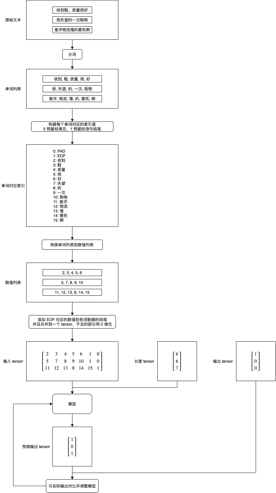
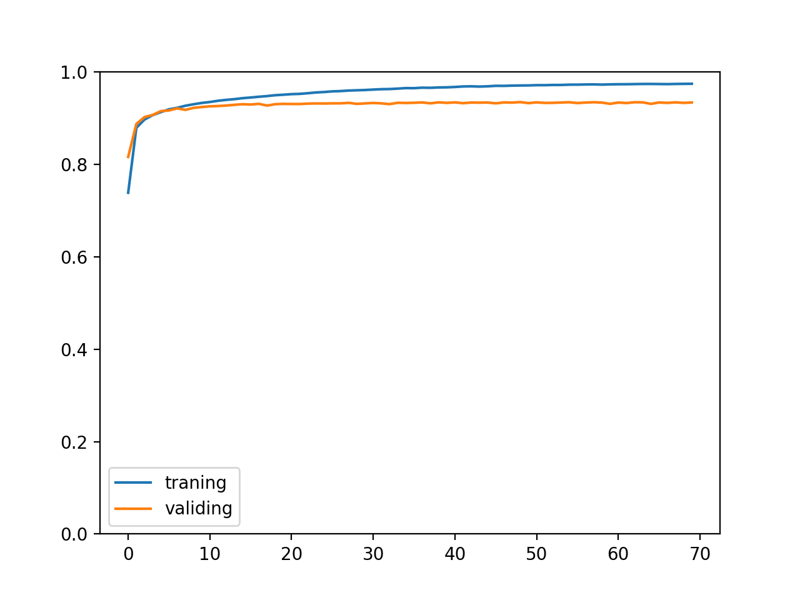
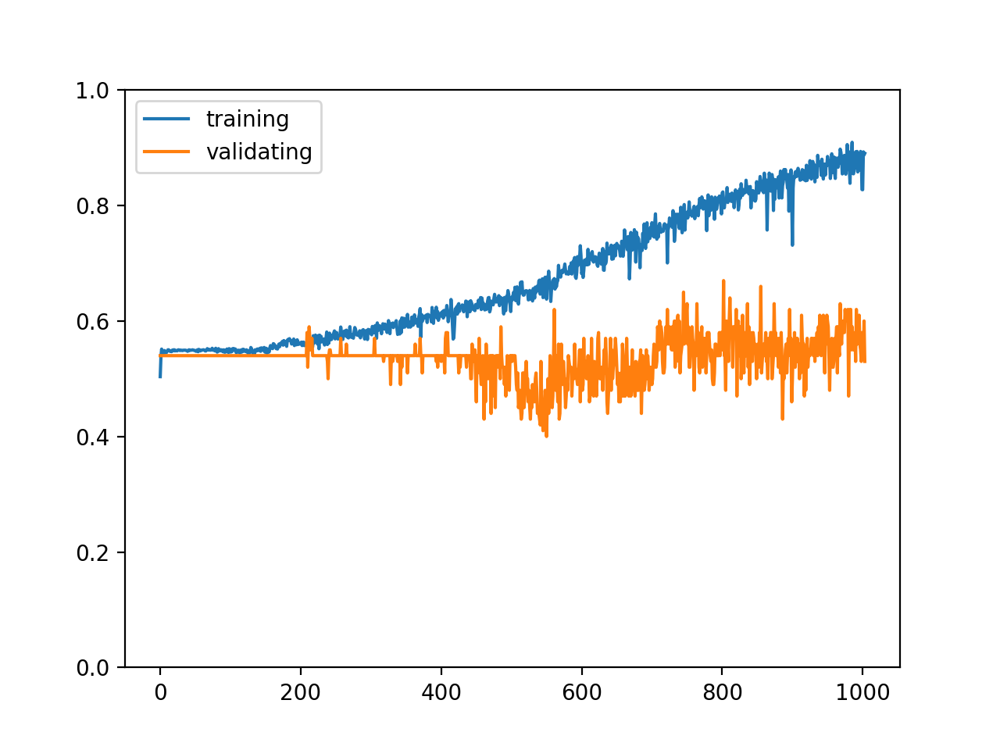
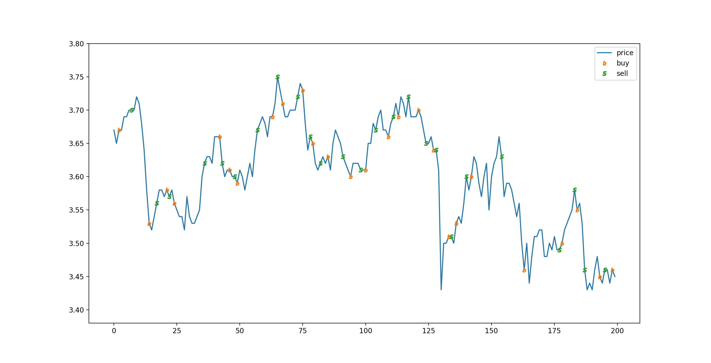

# 写给程序员的机器学习入门 (六) - 应用递归模型的例子

这一篇将会举两个例子说明怎么应用递归模型，包括文本情感分类和预测股价走势。与前几篇不同，这一篇使用的数据是现实存在的数据，我们将可以看到更高级的模型和手法🤠。

## 例子①  - 文本感情分类

文本感情分类是一个典型的例子，简单的来说就是给出一段话，判断这段话是正面还是负面的，例如淘宝或者京东上对商品的评价，豆瓣上对电影的评价，更高级的情感分类还能对文本中的感情进行细分。因为涉及到自然语言，文本感情分类也属于自然语言处理 (NLP, Nature Langure Processing)，我们接下来将会使用 ami66 在 github 上[公开的数据](https://github.com/303248153/ChineseTextClassifier)，来实现根据商品评论内容识别是正面评论还是负面评论。


在处理文本之前我们需要对文本进行切分，切分方法可以分为按字切分和按单词切分，按单词切分的精度更高但要求使用分词类库。处理中文时我们可以使用开源的 [jieba](https://github.com/fxsjy/jieba) 类库来按单词切分，执行 `pip3 install jieba --user` 即可安装，使用例子如下：

``` python
# 按字切分
>>> words = [c for c in "我来到北京清华大学"]
>>> words
['我', '来', '到', '北', '京', '清', '华', '大', '学']

# 按单词切分
>>> import jieba
>>> words = list(jieba.cut("我来到北京清华大学"))
>>> words
['我', '来到', '北京', '清华大学']
```

接下来我们需要使用数值来表示字或者单词，这也有几种方法，第一种方法是 onehot，即准备一个和字数量一样的序列，然后用每个元素代表每个字，这种方法并不实用，因为如果要处理的文本里面有几万种不同的字，那么就需要几万长度的序列，处理起来将会非常非常慢；第二种方法是 binary，即使用二进制来表示每个字的索引值，这种方法可以减少序列长度但是会影响训练效果；第三种方法是 embedding，使用向量 (浮点数组成的序列) 来表示每个字或者单词，这个向量可以预先根据某种规律生成，也可以在训练过程中调整，这种方法是目前最流行的方法。预先根据某种规律生成的 embedding 编码还会让语义近似的单词的值更接近，例如 `苹果` 和 `橙子` 的向量将会比较接近。接下来的例子将会使用在训练过程中调整的 embedding 编码，然后再介绍几种预先生成的 embedding 编码库。


处理文本并传给模型的流程如下，这里仅负责把单词转换为数值，embedding 处理在模型中 (后面介绍的预生成 embedding 编码会在传给模型前处理)：



模型的结构如下，首先用 Embedding 负责转换各个单词的数值到向量，然后用 LSTM 处理各个单词对应的向量，之后用两层线性模型来识别 LSTM 返回的最终隐藏值，最后用 sigmoid 函数把值转换到 0 ~ 1 之间：


pytorch 中的 `torch.nn.Embedding` 会随机给每个数值分配一个向量，序列中的值会在训练过程中自动调整，最终这个向量会代表单词的某些属性，含义接近的单词向量的值也会接近。

最终的 sigmoid 不仅用于控制值范围，还可以让调整参数更容易，试想两个句子都是好评，如果没有 sigmoid，那么则需要调整线性模型的输出值接近 1，大于或小于都得调整，如果有 sigmoid，那么只需要调整线性模型的输出值大于 6 即可，例如第一个句子输出 8，第二个句子输出 16，两个经过 sigmoid 以后都是 1。

训练和使用模型的代码如下，与之前的代码相比需要注意以下几点：

- 预测输出超过 0.5 的时候会判断是好评，未超过 0.5 的时候会判断是差评
- 计算正确率的时候会使用预测输出和实际输出的匹配数量和总数量之间的比例
- 需要保存单词到数值的索引，用于计算总单词数量和实际使用模型时转换单词到数值
- 为了加快训练速度，参数调整器从 SGD 换成了 Adadelta
    - Adadelta 是 SGD 的一个扩展，支持自动调整学习比例 (SGD 只能固定学习比例)，你可以参考[这篇文章](https://ruder.io/optimizing-gradient-descent/)了解工作原理

``` python
import os
import sys
import torch
import gzip
import itertools
import jieba
import json
import random
from torch import nn
from matplotlib import pyplot

class MyModel(nn.Module):
    """根据评论分析是好评还是差评"""
    def __init__(self, total_words):
        super().__init__()
        self.embedding = nn.Embedding(
            num_embeddings=total_words,
            embedding_dim=16,
            padding_idx=0
        )
        self.rnn = nn.LSTM(
            input_size = 16,
            hidden_size = 32,
            num_layers = 1,
            batch_first = True
        )
        self.linear = nn.Sequential(
            nn.Linear(in_features=32, out_features=16),
            nn.ReLU(),
            nn.Dropout(0.2),
            nn.Linear(in_features=16, out_features=1),
            nn.Sigmoid())

    def forward(self, x, lengths):
        # 转换单词对应的数值到向量
        embedded = self.embedding(x)
        # 附加长度信息，避免 RNN 计算填充的数据
        packed = nn.utils.rnn.pack_padded_sequence(
            embedded, lengths, batch_first=True, enforce_sorted=False)
        # 使用递归模型计算，因为当前场景只需要最后一个输出，所以直接使用 hidden
        # 注意 LSTM 的第二个返回值同时包含最新的隐藏状态和细胞状态
        output, (hidden, cell) = self.rnn(packed)
        # 转换隐藏状态的维度到 批次大小, 隐藏值数量
        hidden = hidden.reshape(hidden.shape[1], hidden.shape[2])
        # 使用多层线性模型识别递归模型返回的隐藏值
        # 最后使用 sigmoid 把值范围控制在 0 ~ 1
        y = self.linear(hidden)
        return y

def save_tensor(tensor, path):
    """保存 tensor 对象到文件"""
    torch.save(tensor, gzip.GzipFile(path, "wb"))

def load_tensor(path):
    """从文件读取 tensor 对象"""
    return torch.load(gzip.GzipFile(path, "rb"))

def save_word_to_index(word_to_index):
    """保存单词到数值的索引"""
    json.dump(word_to_index, open('data/word_to_index.json', 'w'), indent=2, ensure_ascii=False)

def load_word_to_index():
    """读取单词到数值的索引"""
    return json.load(open('data/word_to_index.json', 'r'))

def prepare_save_batch(batch, pending_tensors):
    """准备训练 - 保存单个批次的数据"""
    # 打乱单个批次的数据
    random.shuffle(pending_tensors)

    # 划分输入和输出 tensor，另外保存各个输入 tensor 的长度
    in_tensor_unpadded = [p[0] for p in pending_tensors]
    in_tensor_lengths = torch.tensor([t.shape[0] for t in in_tensor_unpadded])
    out_tensor = torch.tensor([p[1] for p in pending_tensors])

    # 整合长度不等的 in_tensor_unpadded 到单个 tensor，不足的长度会填充 0
    in_tensor = nn.utils.rnn.pad_sequence(in_tensor_unpadded, batch_first=True)

    # 切分训练集 (60%)，验证集 (20%) 和测试集 (20%)
    random_indices = torch.randperm(in_tensor.shape[0])
    training_indices = random_indices[:int(len(random_indices)*0.6)]
    validating_indices = random_indices[int(len(random_indices)*0.6):int(len(random_indices)*0.8):]
    testing_indices = random_indices[int(len(random_indices)*0.8):]
    training_set = (in_tensor[training_indices], in_tensor_lengths[training_indices], out_tensor[training_indices])
    validating_set = (in_tensor[validating_indices], in_tensor_lengths[validating_indices], out_tensor[validating_indices])
    testing_set = (in_tensor[testing_indices], in_tensor_lengths[testing_indices], out_tensor[testing_indices])

    # 保存到硬盘
    save_tensor(training_set, f"data/training_set.{batch}.pt")
    save_tensor(validating_set, f"data/validating_set.{batch}.pt")
    save_tensor(testing_set, f"data/testing_set.{batch}.pt")
    print(f"batch {batch} saved")

def prepare():
    """准备训练"""
    # 数据集转换到 tensor 以后会保存在 data 文件夹下
    if not os.path.isdir("data"):
        os.makedirs("data")

    # 准备词语到数值的索引
    # 预留 PAD 为填充，EOF 为语句结束
    word_to_index = { '<PAD>': 0, '<EOF>': 1 }

    # 从 txt 读取原始数据集，分批每次处理 2000 行
    # 这里使用原始方法读取，最后一个标注为 1 代表好评，为 0 代表差评
    batch = 0
    pending_tensors = []
    for line in open('goods_zh.txt', 'r'):
        parts = line.split(',')
        phase = ",".join(parts[:-2])
        positive = int(parts[-1])
        # 使用 jieba 分词，然后转换单词到索引
        words = jieba.cut(phase)
        word_indices = []
        for word in words:
            if word.isascii() or word in ('，', '。', '！'):
                continue # 过滤标点符号
            if word in word_to_index:
                word_indices.append(word_to_index[word])
            else:
                new_index = len(word_to_index)
                word_to_index[word] = new_index
                word_indices.append(new_index)
        word_indices.append(1) # 代表语句结束
        # 输入是各个单词对应的索引，输出是是否正面评价
        pending_tensors.append((torch.tensor(word_indices), torch.tensor([positive])))
        if len(pending_tensors) >= 2000:
            prepare_save_batch(batch, pending_tensors)
            batch += 1
            pending_tensors.clear()
    if pending_tensors:
        prepare_save_batch(batch, pending_tensors)
        batch += 1
        pending_tensors.clear()

    # 保存词语到单词的索引
    save_word_to_index(word_to_index)

def train():
    """开始训练"""
    # 创建模型实例
    total_words = len(load_word_to_index())
    model = MyModel(total_words)

    # 创建损失计算器
    loss_function = torch.nn.MSELoss()

    # 创建参数调整器
    optimizer = torch.optim.Adadelta(model.parameters())

    # 记录训练集和验证集的正确率变化
    training_accuracy_history = []
    validating_accuracy_history = []

    # 记录最高的验证集正确率
    validating_accuracy_highest = 0
    validating_accuracy_highest_epoch = 0

    # 读取批次的工具函数
    def read_batches(base_path):
        for batch in itertools.count():
            path = f"{base_path}.{batch}.pt"
            if not os.path.isfile(path):
                break
            yield load_tensor(path)

    # 计算正确率的工具函数
    def calc_accuracy(actual, predicted):
        return ((actual >= 0.5) == (predicted >= 0.5)).sum().item() / actual.shape[0]

    # 划分输入和输出的工具函数
    def split_batch_xy(batch, begin=None, end=None):
        # shape = batch_size, input_size
        batch_x = batch[0][begin:end]
        # shape = batch_size, 1
        batch_x_lengths = batch[1][begin:end]
        # shape = batch_size, 1
        batch_y = batch[2][begin:end].reshape(-1, 1).float()
        return batch_x, batch_x_lengths, batch_y

    # 开始训练过程
    for epoch in range(1, 10000):
        print(f"epoch: {epoch}")

        # 根据训练集训练并修改参数
        # 切换模型到训练模式，将会启用自动微分，批次正规化 (BatchNorm) 与 Dropout
        model.train()
        training_accuracy_list = []
        for batch in read_batches("data/training_set"):
            # 切分小批次，有助于泛化模型
            for index in range(0, batch[0].shape[0], 100):
                # 划分输入和输出
                batch_x, batch_x_lengths, batch_y = split_batch_xy(batch, index, index+100)
                # 计算预测值
                predicted = model(batch_x, batch_x_lengths)
                # 计算损失
                loss = loss_function(predicted, batch_y)
                # 从损失自动微分求导函数值
                loss.backward()
                # 使用参数调整器调整参数
                optimizer.step()
                # 清空导函数值
                optimizer.zero_grad()
                # 记录这一个批次的正确率，torch.no_grad 代表临时禁用自动微分功能
                with torch.no_grad():
                    training_accuracy_list.append(calc_accuracy(batch_y, predicted))
        training_accuracy = sum(training_accuracy_list) / len(training_accuracy_list)
        training_accuracy_history.append(training_accuracy)
        print(f"training accuracy: {training_accuracy}")

        # 检查验证集
        # 切换模型到验证模式，将会禁用自动微分，批次正规化 (BatchNorm) 与 Dropout
        model.eval()
        validating_accuracy_list = []
        for batch in read_batches("data/validating_set"):
            batch_x, batch_x_lengths, batch_y = split_batch_xy(batch)
            predicted = model(batch_x, batch_x_lengths)
            validating_accuracy_list.append(calc_accuracy(batch_y, predicted))
        validating_accuracy = sum(validating_accuracy_list) / len(validating_accuracy_list)
        validating_accuracy_history.append(validating_accuracy)
        print(f"validating accuracy: {validating_accuracy}")

        # 记录最高的验证集正确率与当时的模型状态，判断是否在 20 次训练后仍然没有刷新记录
        if validating_accuracy > validating_accuracy_highest:
            validating_accuracy_highest = validating_accuracy
            validating_accuracy_highest_epoch = epoch
            save_tensor(model.state_dict(), "model.pt")
            print("highest validating accuracy updated")
        elif epoch - validating_accuracy_highest_epoch > 20:
            # 在 20 次训练后仍然没有刷新记录，结束训练
            print("stop training because highest validating accuracy not updated in 20 epoches")
            break

    # 使用达到最高正确率时的模型状态
    print(f"highest validating accuracy: {validating_accuracy_highest}",
        f"from epoch {validating_accuracy_highest_epoch}")
    model.load_state_dict(load_tensor("model.pt"))

    # 检查测试集
    testing_accuracy_list = []
    for batch in read_batches("data/testing_set"):
        batch_x, batch_x_lengths, batch_y = split_batch_xy(batch)
        predicted = model(batch_x, batch_x_lengths)
        testing_accuracy_list.append(calc_accuracy(batch_y, predicted))
    testing_accuracy = sum(testing_accuracy_list) / len(testing_accuracy_list)
    print(f"testing accuracy: {testing_accuracy}")

    # 显示训练集和验证集的正确率变化
    pyplot.plot(training_accuracy_history, label="training")
    pyplot.plot(validating_accuracy_history, label="validing")
    pyplot.ylim(0, 1)
    pyplot.legend()
    pyplot.show()

def eval_model():
    """使用训练好的模型"""
    # 读取词语到单词的索引
    word_to_index = load_word_to_index()

    # 创建模型实例，加载训练好的状态，然后切换到验证模式
    model = MyModel(len(word_to_index))
    model.load_state_dict(load_tensor("model.pt"))
    model.eval()

    # 询问输入并预测输出
    while True:
        try:
            phase = input("Review: ")
            # 分词
            words = list(jieba.cut(phase))
            # 转换到数值列表
            word_indices = [word_to_index[w] for w in words if w in word_to_index]
            word_indices.append(word_to_index['EOF'])
            # 构建输入
            x = torch.tensor(word_indices).reshape(1, -1)
            lengths = torch.tensor([len(word_indices)])
            # 预测输出
            y = model(x, lengths)
            print("Positive Score:", y[0, 0].item(), "\n")
        except Exception as e:
            print("error:", e)

def main():
    """主函数"""
    if len(sys.argv) < 2:
        print(f"Please run: {sys.argv[0]} prepare|train|eval")
        exit()

    # 给随机数生成器分配一个初始值，使得每次运行都可以生成相同的随机数
    # 这是为了让过程可重现，你也可以选择不这样做
    random.seed(0)
    torch.random.manual_seed(0)

    # 根据命令行参数选择操作
    operation = sys.argv[1]
    if operation == "prepare":
        prepare()
    elif operation == "train":
        train()
    elif operation == "eval":
        eval_model()
    else:
        raise ValueError(f"Unsupported operation: {operation}")

if __name__ == "__main__":
    main()
```

执行以下命令即可准备数据集和训练模型：

``` text
python3 example.py prepare
python3 example.py train
```

训练成功以后的输出如下，我们可以看到验证集和测试集正确率都达到了 93%：

``` text
epoch: 70
training accuracy: 0.9745314468456309
validating accuracy: 0.9339881613022567
stop training because highest validating accuracy not updated in 20 epoches
highest validating accuracy: 0.9348816130225674 from epoch 49
testing accuracy: 0.933661672216056
```

正确率的变化如下：



执行以下命令即可使用训练好的模型：

``` text
python3 example.py eval
```

使用例子如下：

``` text
Review: 这手机吃后台特别严重，不建议购买
Positive Score: 0.010371988639235497

Review: 这样很好，穿着特别舒适，很喜欢的一双鞋子，夏天也比较透气
Positive Score: 1.0

Review: 性价比还是不错的，使用到现在还没有出现问题
Positive Score: 1.0

Review: 服务态度差，物流慢
Positive Score: 0.009614041075110435

Review: 这手机有问题，反应到客服没人理
Positive Score: 0.00456244358792901

Review: 强烈建议购买
Positive Score: 0.9984269142150879

Review: 强烈不建议购买
Positive Score: 0.03579584136605263
```

注意如果使用的单词不在索引中那么这个单词会被忽略，要解决这个问题可以增加数据量涵盖尽量多的单词，或者使用接下来介绍的预生成 embedding 编码库。

现在我们有一个程序可以智能判断对方说的是好话还是坏话了😤，因为现实中的商城或者电影评价网站一般都会同时要求用户打分所以这个例子的实用价值不大，但它仍然是一个很好的例子帮助我们理解怎样使用递归模型处理自然语言。

## 使用预生成 embedding 编码库

以上的例子会在训练过程中调整 embedding 编码，这种做法很方便，但只能识别在索引中的单词 (数据集中包含的单词)，如果使用了未知的单词那么模型有可能无法正确预测结果。我们可以使用预生成的 embedding 编码库来解决这个问题，这些库是根据海量数据生成的（通常使用百科问答或者新闻等公开数据），包含了非常非常多的单词，并且语义接近的单词的向量也会很接近，训练的时候只要使用部分单词就可以同时适用于语义接近的更多单词。

注意使用这些库不需要在训练过程中调整向量，`torch.nn.Embedding.from_pretrained` 支持导入预先训练好的编码库，并且不会在训练过程中调整它们。

### word2vec

使用 word2vec 首先我们需要安装 gensim 库，使用以下命令即可安装：

``` text
pip3 install gensim --user
```

接下来我们需要一个预先生成好的编码库，你可以在 github 上搜索 `word2vec chinese` 或者 `word2vec 中文`，也可以用自己的语料库生成。这里我简单介绍怎样使用自己的语料库生成，来源是上面的评论数据，你也可以试着从[这里](https://github.com/brightmart/nlp_chinese_corpus)下载更大的文本数据。

第一步是使用 jieba 分词，然后全部写到一个文件，单词之间用空格隔开：

``` python
import jieba
f = open('chinese.text8', 'w')
for line in open('goods_zh.txt', 'r'):
    line = "".join(line.split(',')[:-2])
    words = jieba.cut(line)
    words = [w for w in words if not (w.isascii() or w in ("，", "。", "！"))]
    f.write(" ".join(words))
    f.write(" ")
```

第二步是使用 word2vec 生成并保存编码库：

``` python
from gensim.models import word2vec
sentences = word2vec.Text8Corpus('chinese.text8')
model = word2vec.Word2Vec(sentences, size=200)
model.save("chinese.model")
```

试着使用生成好的编码库：

``` python
# 寻找语义接近的单词，挺准确的吧🙀
>>> from gensim.models import word2vec
>>> w = word2vec.Word2Vec.load("chinese.model")
>>> w.wv.most_similar(["手机"])
[('机子', 0.6180450916290283), ('新手机', 0.5946457386016846), ('新机', 0.4700007736682892), ('机器', 0.4531888961791992), ('荣耀', 0.4304167628288269), ('红米', 0.42995956540107727), ('电脑', 0.4163869023323059), ('笔记本', 0.4093247652053833), ('坚果', 0.4016817808151245), ('产品', 0.3963530957698822)]
>>> w.wv.most_similar(["物流"])
[('送货', 0.8435776233673096), ('快递', 0.7946128249168396), ('发货', 0.7307696342468262), ('递给', 0.7279399037361145), ('配送', 0.6557953357696533), ('处理速度', 0.6505168676376343), ('用电', 0.6292495131492615), ('速递', 0.6150853633880615), ('货发', 0.6149879693984985), ('反应速度', 0.5916593074798584)]

# 定位单词对应的数值
>>> w.wv.vocab.get("手机").index
5

# 定位单词对应的数值对应的向量
>>> w.wv.vectors[5]
array([-1.4774184e-01,  5.9569430e-01,  9.1274220e-01,  8.2012570e-01,
       省略途中输出
       -7.7284634e-01, -8.3093870e-01,  9.6443129e-01, -1.6938221e+00],
      dtype=float32)
```

在前面的例子中使用这个编码库的代码如下，改动了 `prepare` 和模型部分，虽然模型使用了 `torch.nn.Embedding` 但预生成的编码库不会随着训练而变化，此外这份代码不会在语句结尾添加 EOF 对应的向量 (在这个例子中不影响效果)：

``` python
import os
import sys
import torch
import gzip
import itertools
import jieba
import json
import random
from gensim.models import word2vec
from torch import nn
from matplotlib import pyplot

class MyModel(nn.Module):
    """根据评论分析是好评还是差评"""
    def __init__(self, w2v):
        super().__init__()
        self.embedding = nn.Embedding.from_pretrained(
            torch.FloatTensor(w2v.wv.vectors))
        self.rnn = nn.LSTM(
            input_size = 200,
            hidden_size = 32,
            num_layers = 1,
            batch_first = True
        )
        self.linear = nn.Sequential(
            nn.Linear(in_features=32, out_features=16),
            nn.ReLU(),
            nn.Dropout(0.2),
            nn.Linear(in_features=16, out_features=1),
            nn.Sigmoid())

    def forward(self, x, lengths):
        # 转换单词对应的数值到向量
        embedded = self.embedding(x)
        # 附加长度信息，避免 RNN 计算填充的数据
        packed = nn.utils.rnn.pack_padded_sequence(
            embedded, lengths, batch_first=True, enforce_sorted=False)
        # 使用递归模型计算，因为当前场景只需要最后一个输出，所以直接使用 hidden
        # 注意 LSTM 的第二个返回值同时包含最新的隐藏状态和细胞状态
        output, (hidden, cell) = self.rnn(packed)
        # 转换隐藏状态的维度到 批次大小, 隐藏值数量
        hidden = hidden.reshape(hidden.shape[1], hidden.shape[2])
        # 使用多层线性模型识别递归模型返回的隐藏值
        # 最后使用 sigmoid 把值范围控制在 0 ~ 1
        y = self.linear(hidden)
        return y

def save_tensor(tensor, path):
    """保存 tensor 对象到文件"""
    torch.save(tensor, gzip.GzipFile(path, "wb"))

def load_tensor(path):
    """从文件读取 tensor 对象"""
    return torch.load(gzip.GzipFile(path, "rb"))

def load_word2vec_model():
    """读取 word2vec 编码库"""
    return word2vec.Word2Vec.load("chinese.model")

def prepare_save_batch(batch, pending_tensors):
    """准备训练 - 保存单个批次的数据"""
    # 打乱单个批次的数据
    random.shuffle(pending_tensors)

    # 划分输入和输出 tensor，另外保存各个输入 tensor 的长度
    in_tensor_unpadded = [p[0] for p in pending_tensors]
    in_tensor_lengths = torch.tensor([t.shape[0] for t in in_tensor_unpadded])
    out_tensor = torch.tensor([p[1] for p in pending_tensors])

    # 整合长度不等的 in_tensor_unpadded 到单个 tensor，不足的长度会填充 0
    in_tensor = nn.utils.rnn.pad_sequence(in_tensor_unpadded, batch_first=True)

    # 切分训练集 (60%)，验证集 (20%) 和测试集 (20%)
    random_indices = torch.randperm(in_tensor.shape[0])
    training_indices = random_indices[:int(len(random_indices)*0.6)]
    validating_indices = random_indices[int(len(random_indices)*0.6):int(len(random_indices)*0.8):]
    testing_indices = random_indices[int(len(random_indices)*0.8):]
    training_set = (in_tensor[training_indices], in_tensor_lengths[training_indices], out_tensor[training_indices])
    validating_set = (in_tensor[validating_indices], in_tensor_lengths[validating_indices], out_tensor[validating_indices])
    testing_set = (in_tensor[testing_indices], in_tensor_lengths[testing_indices], out_tensor[testing_indices])

    # 保存到硬盘
    save_tensor(training_set, f"data/training_set.{batch}.pt")
    save_tensor(validating_set, f"data/validating_set.{batch}.pt")
    save_tensor(testing_set, f"data/testing_set.{batch}.pt")
    print(f"batch {batch} saved")

def prepare():
    """准备训练"""
    # 数据集转换到 tensor 以后会保存在 data 文件夹下
    if not os.path.isdir("data"):
        os.makedirs("data")

    # 准备词语到数值的索引
    w2v = load_word2vec_model()

    # 从 txt 读取原始数据集，分批每次处理 2000 行
    # 这里使用原始方法读取，最后一个标注为 1 代表好评，为 0 代表差评
    batch = 0
    pending_tensors = []
    for line in open('goods_zh.txt', 'r'):
        parts = line.split(',')
        phase = ",".join(parts[:-2])
        positive = int(parts[-1])
        # 使用 jieba 分词，然后转换单词到索引
        words = jieba.cut(phase)
        word_indices = []
        for word in words:
            if word.isascii() or word in ('，', '。', '！'):
                continue # 过滤标点符号
            vocab = w2v.wv.vocab.get(word)
            if vocab:
                word_indices.append(vocab.index)
        if not word_indices:
            continue # 没有单词在编码库中
        # 输入是各个单词对应的索引，输出是是否正面评价
        pending_tensors.append((torch.tensor(word_indices), torch.tensor([positive])))
        if len(pending_tensors) >= 2000:
            prepare_save_batch(batch, pending_tensors)
            batch += 1
            pending_tensors.clear()
    if pending_tensors:
        prepare_save_batch(batch, pending_tensors)
        batch += 1
        pending_tensors.clear()

def train():
    """开始训练"""
    # 创建模型实例
    w2v = load_word2vec_model()
    model = MyModel(w2v)

    # 创建损失计算器
    loss_function = torch.nn.MSELoss()

    # 创建参数调整器
    optimizer = torch.optim.Adadelta(model.parameters())

    # 记录训练集和验证集的正确率变化
    training_accuracy_history = []
    validating_accuracy_history = []

    # 记录最高的验证集正确率
    validating_accuracy_highest = 0
    validating_accuracy_highest_epoch = 0

    # 读取批次的工具函数
    def read_batches(base_path):
        for batch in itertools.count():
            path = f"{base_path}.{batch}.pt"
            if not os.path.isfile(path):
                break
            yield load_tensor(path)

    # 计算正确率的工具函数
    def calc_accuracy(actual, predicted):
        return ((actual >= 0.5) == (predicted >= 0.5)).sum().item() / actual.shape[0]

    # 划分输入和输出的工具函数
    def split_batch_xy(batch, begin=None, end=None):
        # shape = batch_size, input_size
        batch_x = batch[0][begin:end]
        # shape = batch_size, 1
        batch_x_lengths = batch[1][begin:end]
        # shape = batch_size, 1
        batch_y = batch[2][begin:end].reshape(-1, 1).float()
        return batch_x, batch_x_lengths, batch_y

    # 开始训练过程
    for epoch in range(1, 10000):
        print(f"epoch: {epoch}")

        # 根据训练集训练并修改参数
        # 切换模型到训练模式，将会启用自动微分，批次正规化 (BatchNorm) 与 Dropout
        model.train()
        training_accuracy_list = []
        for batch in read_batches("data/training_set"):
            # 切分小批次，有助于泛化模型
            for index in range(0, batch[0].shape[0], 100):
                # 划分输入和输出
                batch_x, batch_x_lengths, batch_y = split_batch_xy(batch, index, index+100)
                # 计算预测值
                predicted = model(batch_x, batch_x_lengths)
                # 计算损失
                loss = loss_function(predicted, batch_y)
                # 从损失自动微分求导函数值
                loss.backward()
                # 使用参数调整器调整参数
                optimizer.step()
                # 清空导函数值
                optimizer.zero_grad()
                # 记录这一个批次的正确率，torch.no_grad 代表临时禁用自动微分功能
                with torch.no_grad():
                    training_accuracy_list.append(calc_accuracy(batch_y, predicted))
        training_accuracy = sum(training_accuracy_list) / len(training_accuracy_list)
        training_accuracy_history.append(training_accuracy)
        print(f"training accuracy: {training_accuracy}")

        # 检查验证集
        # 切换模型到验证模式，将会禁用自动微分，批次正规化 (BatchNorm) 与 Dropout
        model.eval()
        validating_accuracy_list = []
        for batch in read_batches("data/validating_set"):
            batch_x, batch_x_lengths, batch_y = split_batch_xy(batch)
            predicted = model(batch_x, batch_x_lengths)
            validating_accuracy_list.append(calc_accuracy(batch_y, predicted))
        validating_accuracy = sum(validating_accuracy_list) / len(validating_accuracy_list)
        validating_accuracy_history.append(validating_accuracy)
        print(f"validating accuracy: {validating_accuracy}")

        # 记录最高的验证集正确率与当时的模型状态，判断是否在 20 次训练后仍然没有刷新记录
        if validating_accuracy > validating_accuracy_highest:
            validating_accuracy_highest = validating_accuracy
            validating_accuracy_highest_epoch = epoch
            save_tensor(model.state_dict(), "model.pt")
            print("highest validating accuracy updated")
        elif epoch - validating_accuracy_highest_epoch > 20:
            # 在 20 次训练后仍然没有刷新记录，结束训练
            print("stop training because highest validating accuracy not updated in 20 epoches")
            break

    # 使用达到最高正确率时的模型状态
    print(f"highest validating accuracy: {validating_accuracy_highest}",
        f"from epoch {validating_accuracy_highest_epoch}")
    model.load_state_dict(load_tensor("model.pt"))

    # 检查测试集
    testing_accuracy_list = []
    for batch in read_batches("data/testing_set"):
        batch_x, batch_x_lengths, batch_y = split_batch_xy(batch)
        predicted = model(batch_x, batch_x_lengths)
        testing_accuracy_list.append(calc_accuracy(batch_y, predicted))
    testing_accuracy = sum(testing_accuracy_list) / len(testing_accuracy_list)
    print(f"testing accuracy: {testing_accuracy}")

    # 显示训练集和验证集的正确率变化
    pyplot.plot(training_accuracy_history, label="training")
    pyplot.plot(validating_accuracy_history, label="validing")
    pyplot.ylim(0, 1)
    pyplot.legend()
    pyplot.show()

def eval_model():
    """使用训练好的模型"""
    # 读取 word2vec 编码库
    w2v = load_word2vec_model()

    # 创建模型实例，加载训练好的状态，然后切换到验证模式
    model = MyModel(w2v)
    model.load_state_dict(load_tensor("model.pt"))
    model.eval()

    # 询问输入并预测输出
    while True:
        try:
            phase = input("Review: ")
            # 分词
            words = list(jieba.cut(phase))
            # 转换到数值列表
            word_indices = []
            for word in words:
                if word.isascii() or word in ('，', '。', '！'):
                    continue # 过滤标点符号
                vocab = w2v.wv.vocab.get(word)
                if vocab:
                    word_indices.append(vocab.index)
            if not word_indices:
                raise ValueError("No known words")
            # 构建输入
            x = torch.tensor(word_indices).reshape(1, -1)
            lengths = torch.tensor([len(word_indices)])
            # 预测输出
            y = model(x, lengths)
            print("Positive Score:", y[0, 0].item(), "\n")
        except Exception as e:
            print("error:", e)

def main():
    """主函数"""
    if len(sys.argv) < 2:
        print(f"Please run: {sys.argv[0]} prepare|train|eval")
        exit()

    # 给随机数生成器分配一个初始值，使得每次运行都可以生成相同的随机数
    # 这是为了让过程可重现，你也可以选择不这样做
    random.seed(0)
    torch.random.manual_seed(0)

    # 根据命令行参数选择操作
    operation = sys.argv[1]
    if operation == "prepare":
        prepare()
    elif operation == "train":
        train()
    elif operation == "eval":
        eval_model()
    else:
        raise ValueError(f"Unsupported operation: {operation}")

if __name__ == "__main__":
    main()
```

如果你试着用这份代码来训练会发现第一个 epoch 就已经达到 90% 以上的正确率，并且继续训练下去可以达到比直接使用 `torch.nn.Embedding` 更高的正确率，使用预生成编码库的效果惊人呀🥳。

如果你对 word2vec 的原理感兴趣可以参考这篇[文章](https://www.cnblogs.com/peghoty/p/3857839.html)，同样在博客园上。

### transfomers (BERT)

transfomers 是一个用于处理自然语言的类库，包含了目前世界上最先进的模型，我们将会看到如何使用其中的 BERT 模型来处理中文。

使用以下命令安装：

``` text
pip3 install transformers
```

transfomers 支持自动下载和使用预先训练好的模型，以下是使用 BERT 中文模型的代码 (第一次使用時会自动下载)，有分词器和模型两部分：

``` python
>>> from transformers import AutoTokenizer, AutoModel
>>> tt = AutoTokenizer.from_pretrained("bert-base-chinese")
>>> tm = AutoModel.from_pretrained("bert-base-chinese")

# 转换中文语句到数值列表
>>> tt.encode("五星好评赞")
[101, 758, 3215, 1962, 6397, 6614, 102]

# 生成各个单词对应的向量
>>> codes, hidden = tm(torch.tensor([[101, 758, 3215, 1962, 6397, 6614, 102]]))
>>> codes.shape
torch.Size([1, 7, 768])
>>> hidden.shape
torch.Size([1, 768])
```

如果你细心观察可能会发现上面并没有实际分词，而是根据每个字单独生成了索引，这是因为 `bert-base-chinese` 是按字来划分的，你可以试试其他模型 (我不确定是否有这样的现成模型😫)。另外转换为向量时，第二个返回值代表了最终的内部状态，这点跟递归模型比较像，第二个返回值还可以用来代表整个句子的编码，尽管精度会有所降低。

在前面的例子中使用 transfomers 的代码如下，注意准备数据集和训练都需要相当长的时间，这可以说是用牛刀杀鸡👿：

``` python
import os
import sys
import torch
import gzip
import itertools
import json
import random
from transformers import AutoTokenizer, AutoModel
from torch import nn
from matplotlib import pyplot

class MyModel(nn.Module):
    """根据评论分析是好评还是差评"""
    def __init__(self):
        super().__init__()
        self.rnn = nn.LSTM(
            input_size = 768,
            hidden_size = 32,
            num_layers = 1,
            batch_first = True
        )
        self.linear = nn.Sequential(
            nn.Linear(in_features=32, out_features=16),
            nn.ReLU(),
            nn.Dropout(0.2),
            nn.Linear(in_features=16, out_features=1),
            nn.Sigmoid())

    def forward(self, x, lengths):
        # transformers 已经帮我们转换为向量
        embedded = x
        # 附加长度信息，避免 RNN 计算填充的数据
        packed = nn.utils.rnn.pack_padded_sequence(
            embedded, lengths, batch_first=True, enforce_sorted=False)
        # 使用递归模型计算，因为当前场景只需要最后一个输出，所以直接使用 hidden
        # 注意 LSTM 的第二个返回值同时包含最新的隐藏状态和细胞状态
        output, (hidden, cell) = self.rnn(packed)
        # 转换隐藏状态的维度到 批次大小, 隐藏值数量
        hidden = hidden.reshape(hidden.shape[1], hidden.shape[2])
        # 使用多层线性模型识别递归模型返回的隐藏值
        # 最后使用 sigmoid 把值范围控制在 0 ~ 1
        y = self.linear(hidden)
        return y

def save_tensor(tensor, path):
    """保存 tensor 对象到文件"""
    torch.save(tensor, gzip.GzipFile(path, "wb"))

def load_tensor(path):
    """从文件读取 tensor 对象"""
    return torch.load(gzip.GzipFile(path, "rb"))

def load_transfomer_tokenizer():
    """获取 transformers 的分词器"""
    return AutoTokenizer.from_pretrained("bert-base-chinese")

def load_transfomer_model():
    """获取 transofrmers 的模型"""
    return AutoModel.from_pretrained("bert-base-chinese")

def prepare_save_batch(batch, pending_tensors):
    """准备训练 - 保存单个批次的数据"""
    # 打乱单个批次的数据
    random.shuffle(pending_tensors)

    # 划分输入和输出 tensor，另外保存各个输入 tensor 的长度
    in_tensor_unpadded = [p[0] for p in pending_tensors]
    in_tensor_lengths = torch.tensor([t.shape[0] for t in in_tensor_unpadded])
    out_tensor = torch.tensor([p[1] for p in pending_tensors])

    # 整合长度不等的 in_tensor_unpadded 到单个 tensor，不足的长度会填充 0
    in_tensor = nn.utils.rnn.pad_sequence(in_tensor_unpadded, batch_first=True)

    # 切分训练集 (60%)，验证集 (20%) 和测试集 (20%)
    random_indices = torch.randperm(in_tensor.shape[0])
    training_indices = random_indices[:int(len(random_indices)*0.6)]
    validating_indices = random_indices[int(len(random_indices)*0.6):int(len(random_indices)*0.8):]
    testing_indices = random_indices[int(len(random_indices)*0.8):]
    training_set = (in_tensor[training_indices], in_tensor_lengths[training_indices], out_tensor[training_indices])
    validating_set = (in_tensor[validating_indices], in_tensor_lengths[validating_indices], out_tensor[validating_indices])
    testing_set = (in_tensor[testing_indices], in_tensor_lengths[testing_indices], out_tensor[testing_indices])

    # 保存到硬盘
    save_tensor(training_set, f"data/training_set.{batch}.pt")
    save_tensor(validating_set, f"data/validating_set.{batch}.pt")
    save_tensor(testing_set, f"data/testing_set.{batch}.pt")
    print(f"batch {batch} saved")

def prepare():
    """准备训练"""
    # 数据集转换到 tensor 以后会保存在 data 文件夹下
    if not os.path.isdir("data"):
        os.makedirs("data")

    # 加载 transformer 分词器和模型
    tt = load_transfomer_tokenizer()
    tm = load_transfomer_model()

    # 从 txt 读取原始数据集，分批每次处理 2000 行
    # 这里使用原始方法读取，最后一个标注为 1 代表好评，为 0 代表差评
    batch = 0
    pending_tensors = []
    for line in open('goods_zh.txt', 'r'):
        parts = line.split(',')
        phase = ",".join(parts[:-2])
        positive = int(parts[-1])

        # 使用 transformer 分词，然后转换各个数值到向量
        word_indices = tt.encode(phase)
        word_indices = word_indices[:510] # bert-base-chinese 不支持过长的序列
        words_tensor, hidden = tm(torch.tensor([word_indices]))
        words_tensor = words_tensor.reshape(words_tensor.shape[1], words_tensor.shape[2])
        # 输入是各个单词对应的向量，输出是是否正面评价
        pending_tensors.append((words_tensor, torch.tensor([positive])))
        if len(pending_tensors) >= 500:
            prepare_save_batch(batch, pending_tensors)
            batch += 1
            pending_tensors.clear()
    if pending_tensors:
        prepare_save_batch(batch, pending_tensors)
        batch += 1
        pending_tensors.clear()

def train():
    """开始训练"""
    # 创建模型实例
    model = MyModel()

    # 创建损失计算器
    loss_function = torch.nn.MSELoss()

    # 创建参数调整器
    optimizer = torch.optim.Adadelta(model.parameters())

    # 记录训练集和验证集的正确率变化
    training_accuracy_history = []
    validating_accuracy_history = []

    # 记录最高的验证集正确率
    validating_accuracy_highest = 0
    validating_accuracy_highest_epoch = 0

    # 读取批次的工具函数
    def read_batches(base_path):
        for batch in itertools.count():
            path = f"{base_path}.{batch}.pt"
            if not os.path.isfile(path):
                break
            yield load_tensor(path)

    # 计算正确率的工具函数
    def calc_accuracy(actual, predicted):
        return ((actual >= 0.5) == (predicted >= 0.5)).sum().item() / actual.shape[0]

    # 划分输入和输出的工具函数
    def split_batch_xy(batch, begin=None, end=None):
        # shape = batch_size, input_size
        batch_x = batch[0][begin:end]
        # shape = batch_size, 1
        batch_x_lengths = batch[1][begin:end]
        # shape = batch_size, 1
        batch_y = batch[2][begin:end].reshape(-1, 1).float()
        return batch_x, batch_x_lengths, batch_y

    # 开始训练过程
    for epoch in range(1, 10000):
        print(f"epoch: {epoch}")

        # 根据训练集训练并修改参数
        # 切换模型到训练模式，将会启用自动微分，批次正规化 (BatchNorm) 与 Dropout
        model.train()
        training_accuracy_list = []
        for batch in read_batches("data/training_set"):
            # 切分小批次，有助于泛化模型
            for index in range(0, batch[0].shape[0], 100):
                # 划分输入和输出
                batch_x, batch_x_lengths, batch_y = split_batch_xy(batch, index, index+100)
                # 计算预测值
                predicted = model(batch_x, batch_x_lengths)
                # 计算损失
                loss = loss_function(predicted, batch_y)
                # 从损失自动微分求导函数值
                loss.backward()
                # 使用参数调整器调整参数
                optimizer.step()
                # 清空导函数值
                optimizer.zero_grad()
                # 记录这一个批次的正确率，torch.no_grad 代表临时禁用自动微分功能
                with torch.no_grad():
                    training_accuracy_list.append(calc_accuracy(batch_y, predicted))
        training_accuracy = sum(training_accuracy_list) / len(training_accuracy_list)
        training_accuracy_history.append(training_accuracy)
        print(f"training accuracy: {training_accuracy}")

        # 检查验证集
        # 切换模型到验证模式，将会禁用自动微分，批次正规化 (BatchNorm) 与 Dropout
        model.eval()
        validating_accuracy_list = []
        for batch in read_batches("data/validating_set"):
            batch_x, batch_x_lengths, batch_y = split_batch_xy(batch)
            predicted = model(batch_x, batch_x_lengths)
            validating_accuracy_list.append(calc_accuracy(batch_y, predicted))
        validating_accuracy = sum(validating_accuracy_list) / len(validating_accuracy_list)
        validating_accuracy_history.append(validating_accuracy)
        print(f"validating accuracy: {validating_accuracy}")

        # 记录最高的验证集正确率与当时的模型状态，判断是否在 20 次训练后仍然没有刷新记录
        if validating_accuracy > validating_accuracy_highest:
            validating_accuracy_highest = validating_accuracy
            validating_accuracy_highest_epoch = epoch
            save_tensor(model.state_dict(), "model.pt")
            print("highest validating accuracy updated")
        elif epoch - validating_accuracy_highest_epoch > 20:
            # 在 20 次训练后仍然没有刷新记录，结束训练
            print("stop training because highest validating accuracy not updated in 20 epoches")
            break

    # 使用达到最高正确率时的模型状态
    print(f"highest validating accuracy: {validating_accuracy_highest}",
        f"from epoch {validating_accuracy_highest_epoch}")
    model.load_state_dict(load_tensor("model.pt"))

    # 检查测试集
    testing_accuracy_list = []
    for batch in read_batches("data/testing_set"):
        batch_x, batch_x_lengths, batch_y = split_batch_xy(batch)
        predicted = model(batch_x, batch_x_lengths)
        testing_accuracy_list.append(calc_accuracy(batch_y, predicted))
    testing_accuracy = sum(testing_accuracy_list) / len(testing_accuracy_list)
    print(f"testing accuracy: {testing_accuracy}")

    # 显示训练集和验证集的正确率变化
    pyplot.plot(training_accuracy_history, label="training")
    pyplot.plot(validating_accuracy_history, label="validing")
    pyplot.ylim(0, 1)
    pyplot.legend()
    pyplot.show()

def eval_model():
    """使用训练好的模型"""
    # 加载 transformer 分词器和模型
    tt = load_transfomer_tokenizer()
    tm = load_transfomer_model()

    # 创建模型实例，加载训练好的状态，然后切换到验证模式
    model = MyModel()
    model.load_state_dict(load_tensor("model.pt"))
    model.eval()

    # 询问输入并预测输出
    while True:
        try:
            phase = input("Review: ")
            # 使用 transformer 分词，然后转换各个数值到向量
            word_indices = tt.encode(phase)
            word_indices = word_indices[:510] # bert-base-chinese 不支持过长的序列
            words_tensor, hidden = tm(torch.tensor([word_indices]))
            # 构建输入
            x = words_tensor
            lengths = torch.tensor([len(word_indices)])
            # 预测输出
            y = model(x, lengths)
            print("Positive Score:", y[0, 0].item(), "\n")
        except Exception as e:
            print("error:", e)

def main():
    """主函数"""
    if len(sys.argv) < 2:
        print(f"Please run: {sys.argv[0]} prepare|train|eval")
        exit()

    # 给随机数生成器分配一个初始值，使得每次运行都可以生成相同的随机数
    # 这是为了让过程可重现，你也可以选择不这样做
    random.seed(0)
    torch.random.manual_seed(0)

    # 根据命令行参数选择操作
    operation = sys.argv[1]
    if operation == "prepare":
        prepare()
    elif operation == "train":
        train()
    elif operation == "eval":
        eval_model()
    else:
        raise ValueError(f"Unsupported operation: {operation}")

if __name__ == "__main__":
    main()
```

如果你实际训练使用会发现它不仅能判断商品评论是正面还是负面的，也能判断普通语句是好话还是坏话，可以说相当的神奇。

transfomers 还可以用来做翻译和文本自动生成，因为里面的模型太高级了所以我目前没有理解它们是怎么工作的🙉，希望以后有机会可以详细介绍。

## 例子②  - 预测股价走势

如果你是一个股民，你可能会试图找出那些涨涨跌跌之间的规律，包括使用 MACD, KDJ 等指标，这里我们试试应用机器学习预测股价走势，看看结果如何。

训练和验证使用的数据是中国银行 (601988) 的每日收盘价和交易量，可以从以下地址下载：

- (最新数据) https://finance.yahoo.com/quote/601988.SS/history?period1=1152057600&period2=1589500800&interval=1d&filter=history&frequency=1d
- (这篇文章使用的数据) https://github.com/303248153/BlogArchive/tree/master/ml-06/601988.SS.csv

csv 中包含了 `日期,开盘价,最高价,最低价,收盘价,调整后收盘价,交易量`，输入和输出规定如下

- 输入: 收盘价 (标准化除以 100), 交易量 (标准化除以 1 亿)
- 输出: T+2 的涨跌 (涨 1 跌 0, T+2 指下下个交易日)

模型是 GRU + 2 层线性模型，最终使用 sigmoid 转换输出到 0 ~ 1 之间的值，数据划分训练集包含 1500 条数据，验证集和测试集包含 100 条数据，时序按 `训练集 => 验证集 => 测试集` 排列。

注意传递数据给模型的时候会按 32 条数据分批传递，模型需要保留隐藏状态使得分批传递与完整传递可以得出相同的结果。

训练和使用模型的代码如下：

``` python
import os
import sys
import torch
import gzip
import itertools
import random
import pandas
import math
from torch import nn
from matplotlib import pyplot

CSV_FILENAME = "601988.SS.csv"
TRAINING_RECORDS = 1500
VALIDATING_RECORDS = 100
TESTING_RECORDS = 100

class MyModel(nn.Module):
    """根据历史收盘价和成交量预测股价走势"""
    def __init__(self):
        super().__init__()
        self.rnn = nn.GRU(
            input_size = 2,
            hidden_size = 50,
            num_layers = 1,
            batch_first = True
        )
        self.linear = nn.Sequential(
            nn.Linear(in_features=50, out_features=20),
            nn.ReLU(),
            nn.Dropout(0.2),
            nn.Linear(in_features=20, out_features=1),
            nn.Sigmoid())
        self.reset_hidden()

    def forward(self, x):
        # 调整维度
        x = x.reshape(1, x.shape[0], x.shape[1])
        # 使用递归模型计算，需要所有输出，并且还需要保存隐藏状态
        # 保存隐藏状态时需要使用 detach 切断内部的计算路径
        output, hidden = self.rnn(x, self.rnn_hidden)
        self.rnn_hidden = hidden.detach()
        # 转换输出的维度到 批次大小, 隐藏值数量
        output = output.reshape(output.shape[1], output.shape[2])
        # 使用多层线性模型计算递归模型返回的输出
        y = self.linear(output)
        return y

    def reset_hidden(self):
        """重置隐藏状态"""
        self.rnn_hidden = torch.zeros(1, 1, 50)

def save_tensor(tensor, path):
    """保存 tensor 对象到文件"""
    torch.save(tensor, gzip.GzipFile(path, "wb"))

def load_tensor(path):
    """从文件读取 tensor 对象"""
    return torch.load(gzip.GzipFile(path, "rb"))

def prepare():
    """准备训练"""
    # 数据集转换到 tensor 以后会保存在 data 文件夹下
    if not os.path.isdir("data"):
        os.makedirs("data")

    # 从 csv 读取原始数据集
    df = pandas.read_csv(CSV_FILENAME)
    in_list = [] # 收盘价和成交量作为输入
    out_list = [] # T+2 的涨跌作为输出
    for value in df.values:
        volume = value[-1] / 100000000 # 成交量除以一亿
        price = value[-3] / 100 # 收盘价除以 100
        if math.isnan(volume) or math.isnan(price):
            continue # 原始数据中是 null
        in_list.append((price, volume))
    for index in range(len(in_list)-2):
        price_t0 = in_list[index][0]
        price_t2 = in_list[index+2][0]
        out_list.append(1. if price_t2 > price_t0 else 0.)
    in_list = in_list[:len(out_list)]

    # 生成输入和输出
    in_tensor = torch.tensor(in_list)
    out_tensor = torch.tensor(out_list).reshape(-1, 1)

    # 划分训练集，验证集和测试集
    testing_start = -TESTING_RECORDS
    validating_start = testing_start - VALIDATING_RECORDS
    training_start = validating_start - TRAINING_RECORDS
    training_in = in_tensor[training_start:validating_start]
    training_out = out_tensor[training_start:validating_start]
    validating_in = in_tensor[validating_start:testing_start]
    validating_out = out_tensor[validating_start:testing_start]
    testing_in = in_tensor[testing_start:]
    testing_out = out_tensor[testing_start:]

    # 保存到硬盘
    save_tensor((training_in, training_out), f"data/training_set.pt")
    save_tensor((validating_in, validating_out), f"data/validating_set.pt")
    save_tensor((testing_in, testing_out), f"data/testing_set.pt")
    print("saved dataset")

def train():
    """开始训练"""
    # 创建模型实例
    model = MyModel()

    # 创建损失计算器
    loss_function = torch.nn.MSELoss()

    # 创建参数调整器
    optimizer = torch.optim.Adadelta(model.parameters())

    # 记录训练集和验证集的正确率变化
    training_accuracy_history = []
    validating_accuracy_history = []

    # 记录最高的验证集正确率
    validating_accuracy_highest = 0
    validating_accuracy_highest_epoch = 0

    # 计算正确率的工具函数
    def calc_accuracy(actual, predicted):
        return ((actual >= 0.5) == (predicted >= 0.5)).sum().item() / actual.shape[0]
 
    # 开始训练过程
    for epoch in range(1, 10000):
        print(f"epoch: {epoch}")

        # 重置模型的隐藏状态
        model.reset_hidden()

        # 根据训练集训练并修改参数
        # 切换模型到训练模式，将会启用自动微分，批次正规化 (BatchNorm) 与 Dropout
        model.train()
        training_accuracy_list = []
        training_in, training_out = load_tensor("data/training_set.pt")
        for index in range(0, training_in.shape[0], 32):
            # 划分输入和输出
            batch_x = training_in[index:index+32]
            batch_y = training_out[index:index+32]
            # 计算预测值
            predicted = model(batch_x)
            # 计算损失
            loss = loss_function(predicted, batch_y)
            # 从损失自动微分求导函数值
            loss.backward()
            # 使用参数调整器调整参数
            optimizer.step()
            # 清空导函数值
            optimizer.zero_grad()
            # 记录这一个批次的正确率，torch.no_grad 代表临时禁用自动微分功能
            with torch.no_grad():
                training_accuracy_list.append(calc_accuracy(batch_y, predicted))
        training_accuracy = sum(training_accuracy_list) / len(training_accuracy_list)
        training_accuracy_history.append(training_accuracy)
        print(f"training accuracy: {training_accuracy}")

        # 检查验证集
        # 切换模型到验证模式，将会禁用自动微分，批次正规化 (BatchNorm) 与 Dropout
        model.eval()
        validating_in, validating_out = load_tensor("data/validating_set.pt")
        predicted = model(validating_in)
        validating_accuracy = calc_accuracy(validating_out, predicted)
        validating_accuracy_history.append(validating_accuracy)
        print(f"validating accuracy: {validating_accuracy}")

        # 记录最高的验证集正确率与当时的模型状态，判断是否在 200 次训练后仍然没有刷新记录
        # 因为数据量很少，仅在训练集正确率超过 70% 时执行这里的逻辑
        if training_accuracy > 0.7:
            if validating_accuracy > validating_accuracy_highest:
                validating_accuracy_highest = validating_accuracy
                validating_accuracy_highest_epoch = epoch
                save_tensor(model.state_dict(), "model.pt")
                print("highest validating accuracy updated")
            elif epoch - validating_accuracy_highest_epoch > 200:
                # 在 200 次训练后仍然没有刷新记录，结束训练
                print("stop training because highest validating accuracy not updated in 200 epoches")
                break

    # 使用达到最高正确率时的模型状态
    print(f"highest validating accuracy: {validating_accuracy_highest}",
        f"from epoch {validating_accuracy_highest_epoch}")
    model.load_state_dict(load_tensor("model.pt"))

    # 检查测试集
    testing_in, testing_out = load_tensor("data/testing_set.pt")
    predicted = model(testing_in)
    testing_accuracy = calc_accuracy(testing_out, predicted)
    print(f"testing accuracy: {testing_accuracy}")

    # 显示训练集的误差变化
    pyplot.plot(training_accuracy_history, label="training")
    pyplot.plot(validating_accuracy_history, label="validating")
    pyplot.ylim(0, 1)
    pyplot.legend()
    pyplot.show()

def eval_model():
    """使用训练好的模型"""
    # 创建模型实例，加载训练好的状态，然后切换到验证模式
    model = MyModel()
    model.load_state_dict(load_tensor("model.pt"))
    model.eval()

    # 加载历史数据
    training_in, _ = load_tensor("data/training_set.pt")
    model(training_in)

    # 预测未来数据
    price_list = []
    trend_list = []
    df = pandas.read_csv(CSV_FILENAME)
    for value in df.values[-TESTING_RECORDS-VALIDATING_RECORDS:]:
        volume = float(value[-1])
        price = float(value[-3])
        if math.isnan(volume) or math.isnan(price):
            continue # 原始数据中是 null
        in_tensor = torch.tensor([[price / 100, volume / 100000000]])
        trend = model(in_tensor)[0].item()
        price_list.append(price)
        trend_list.append(trend)

    # 根据预测数据模拟买卖 100 万
    # 规则为预测 T+2 涨则买入，预测 T+2 跌则卖出，不计算印花税和分红
    money = 1000000
    stock = 0
    matched = 0
    total = 0
    buy_list = []
    sell_list = []
    for index in range(len(price_list)):
        price = price_list[index]
        trend = trend_list[index]
        will_rise = trend > 0.5
        will_drop = trend < 0.5
        if stock == 0 and will_rise:
            unit = int(money / price / 100) # 1 手 100 股
            money -= price * unit * 100
            stock += unit
            buy_list.append(price)
            sell_list.append(0)
            print(f"buy {unit}, money {money}, stock {stock}")
        elif stock != 0 and will_drop:
            unit = stock
            money += price * unit * 100
            stock -= unit
            buy_list.append(0)
            sell_list.append(price)
            print(f"sell {unit}, money {money}, stock {stock}")
        else:
            buy_list.append(0)
            sell_list.append(0)
    money_final = money + price_list[-1] * stock * 100
    print(f"final money {money_final}")
    print(f"stock price goes from {price_list[0]} to {price_list[-1]} in this range")

    # 显示为图表
    pyplot.plot(price_list, label="price")
    pyplot.plot(buy_list, label="buy", marker="$b$", linestyle = "None")
    pyplot.plot(sell_list, label="sell", marker="$s$", linestyle = "None")
    pyplot.ylim(min(price_list) - 0.05, max(price_list) + 0.05)
    pyplot.legend()
    pyplot.show()

def main():
    """主函数"""
    if len(sys.argv) < 2:
        print(f"Please run: {sys.argv[0]} prepare|train|eval")
        exit()

    # 给随机数生成器分配一个初始值，使得每次运行都可以生成相同的随机数
    # 这是为了让过程可重现，你也可以选择不这样做
    random.seed(0)
    torch.random.manual_seed(0)

    # 根据命令行参数选择操作
    operation = sys.argv[1]
    if operation == "prepare":
        prepare()
    elif operation == "train":
        train()
    elif operation == "eval":
        eval_model()
    else:
        raise ValueError(f"Unsupported operation: {operation}")

if __name__ == "__main__":
    main()
```

训练结束以后的输出如下，这不是一个理想的结果🙄:

``` text
epoch: 1004
training accuracy: 0.8902925531914894
validating accuracy: 0.53
stop training because highest validating accuracy not updated in 200 epoches
highest validating accuracy: 0.67 from epoch 803
testing accuracy: 0.5
```

训练集和验证集的正确率变化如下：



验证模型的部分会基于没有训练过的未知数据 (合计 200 条) 模拟交易，首先准备 100 万，预测 T+2 涨就买，预测 T+2 跌就卖，一天只操作一次，每次买卖都是最大数量，不考虑印花税和分红，模拟结果如下：

``` text
final money 1089605.9999999998
stock price goes from 3.67 to 3.45 in this range
```

模拟交易的图表表现如下：



只看模拟结果可能会觉得模型很厉害，但实际上这只是个偶然，这次训练不能算是成功，因为正确率不高，和瞎猜差不多🤢。训练没有成功的原因有下：

- 股价的不确定因素太多了，只靠每天的收盘价和交易量是没有办法正确预测出趋势的
- 一般来说股价趋势短期预测比长期预测的准确率要高很多，因为短期预测的不确定因素比较少，但我没有找到公开的高频股价数据
- 单只股票的数据量很少，而且每只股票的股性都不一样 (依赖于操盘手)，很难训练出通用的模型

除了上面的模型以外我还试了很多方式，例如把涨跌幅作为输入或者输出与加大减少模型的结构，但都没有找到可以确切预测出走势的模型。

你可能会忍不住去试试更多方式，甚至找到效果比较好的模型，但我作为一个老股民劝你一句，股海无边，回头是岸呀🤕。


## 写在最后

这篇本来还准备介绍双向递归模型的例子，但遇到一些技术问题加上机器配置较低所以拖了半个月都未能完成😫，预计下一篇还是介绍递归模型的例子，再下一篇开始就会介绍处理图像的 CNN 模型，敬请期待。
