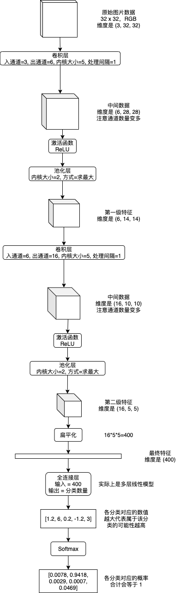
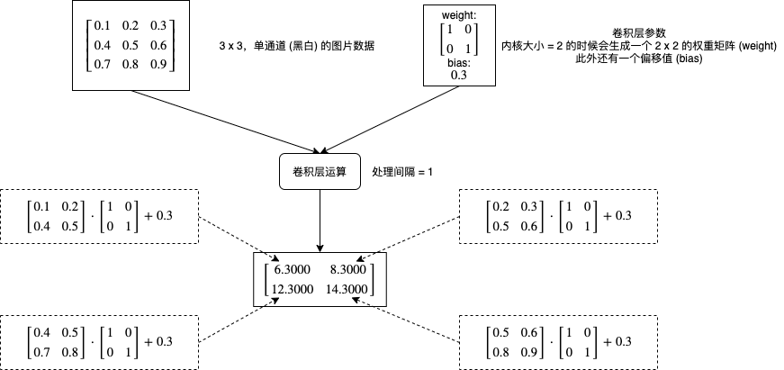
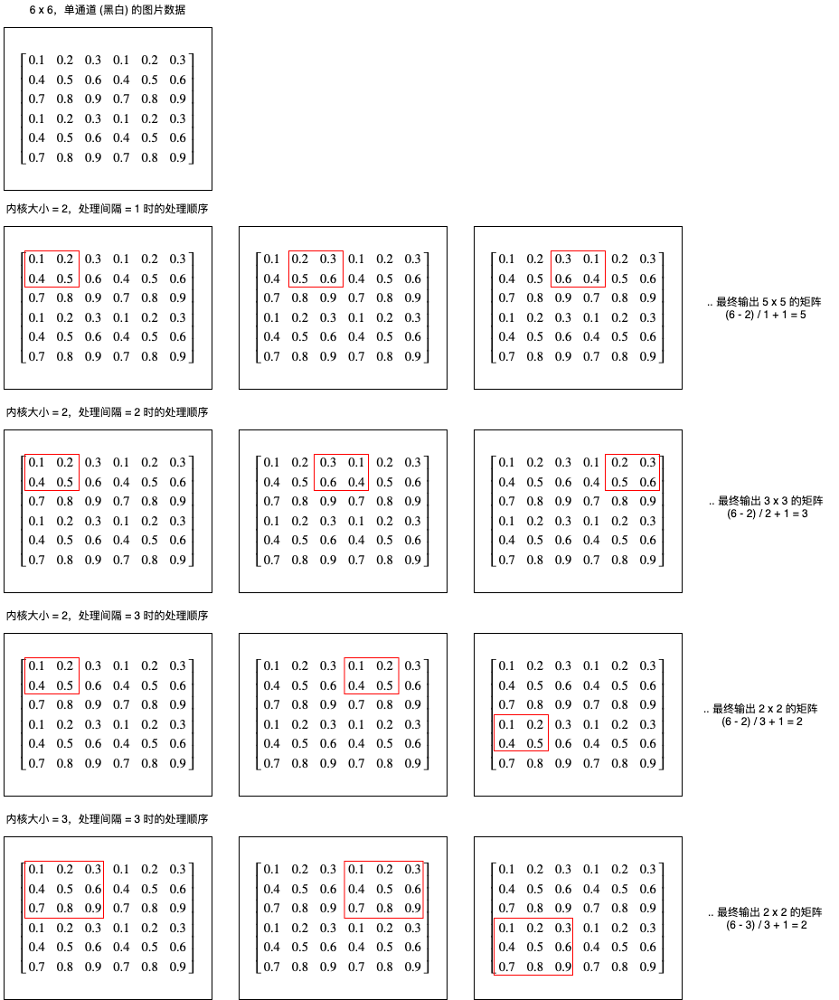
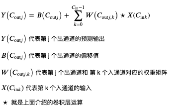
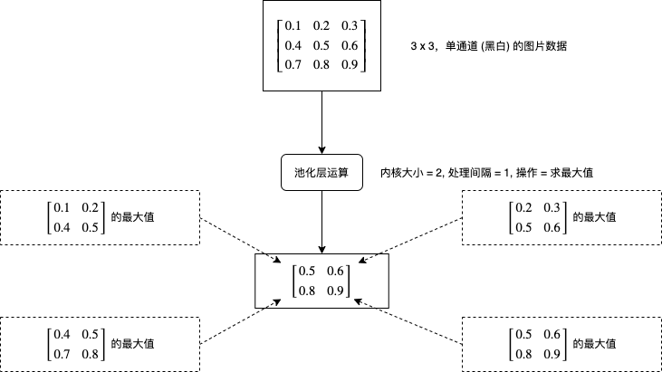
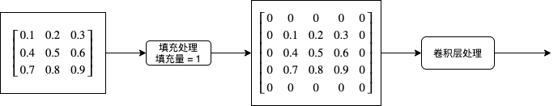
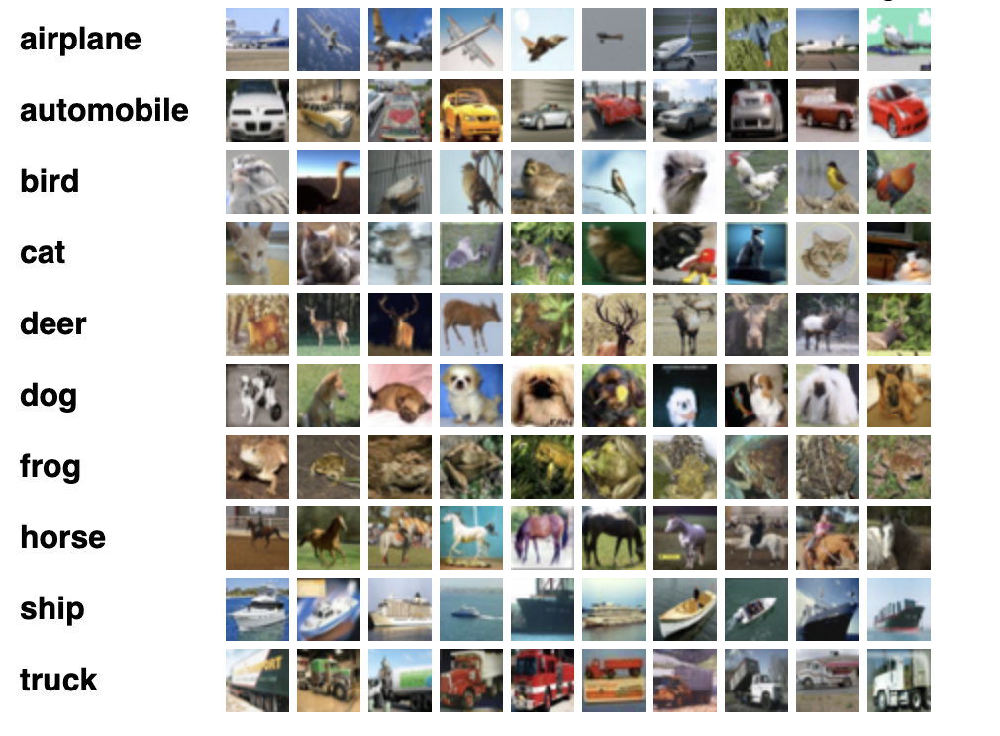
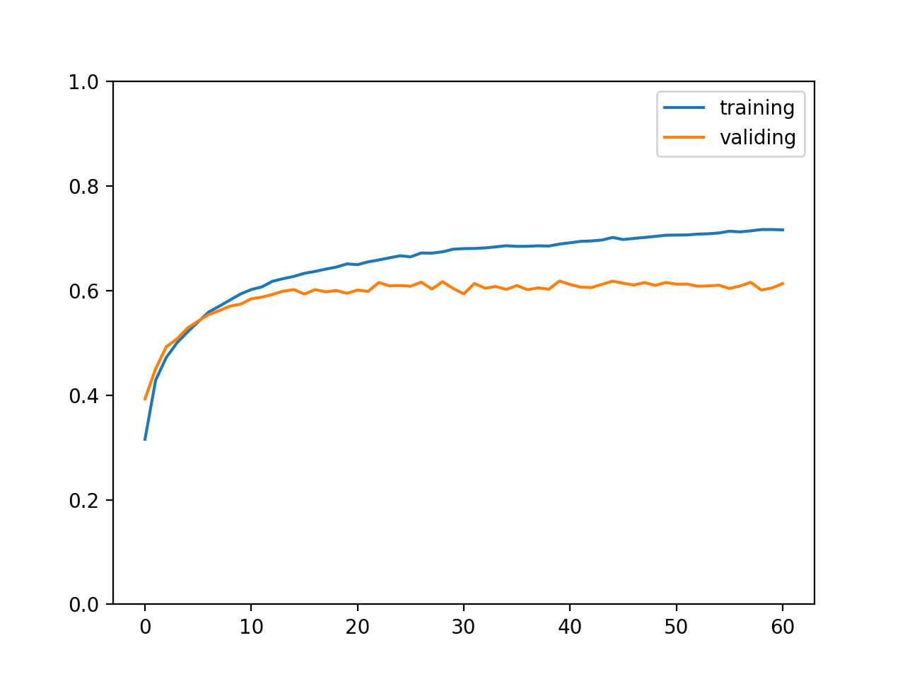
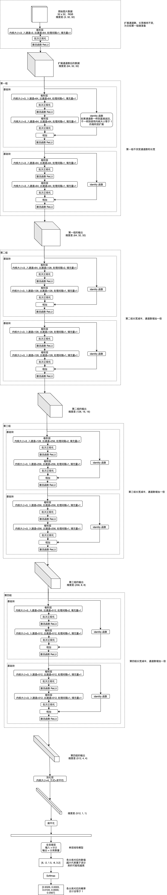

# 写给程序员的机器学习入门 (八) - 卷积神经网络 (CNN) - 图片分类和验证码识别

这一篇将会介绍卷积神经网络 (CNN)，CNN 模型非常适合用来进行图片相关的学习，例如图片分类和验证码识别，也可以配合其他模型实现 OCR。

## 使用 Python 处理图片

在具体介绍 CNN 之前，我们先来看看怎样使用 Python 处理图片。Python 处理图片最主要使用的类库是 Pillow (Python2 PIL 的 fork)，使用以下命令即可安装：

``` text
pip3 install Pillow
```

一些简单操作的例子如下，如果你想了解更多可以参考 Pillow 的[文档](https://pillow.readthedocs.io/en/stable/)：

``` python
# 打开图片
>>> from PIL import Image
>>> img = Image.open("1.png")

# 查看图片信息
>>> img.size
(175, 230)
>>> img.mode
'RGB'
>>> img
<PIL.PngImagePlugin.PngImageFile image mode=RGB size=175x230 at 0x10B807B50>

# 缩放图片
>>> img1 = img.resize((20, 30))
>>> img1
<PIL.Image.Image image mode=RGB size=20x30 at 0x106426FD0>

# 裁剪图片
>>> img2 = img.crop((0, 0, 16, 16))
>>> img2
<PIL.Image.Image image mode=RGB size=16x16 at 0x105E0EFD0>

# 保存图片
>>> img1.save("11.png")
>>> img2.save("12.png")
```

使用 pytorch 处理图片时要首先获取图片的数据，即各个像素对应的颜色值，例如大小为 175 * 230，模式是 RGB 的图片会拥有 175 * 230 * 3 的数据，3 分别代表红绿蓝的值，范围是 0 ～ 255，把图片转换为 pytorch 的 tensor 对象需要经过 numpy 中转，以下是转换的例子：

``` python
>>> import numpy
>>> import torch
>>> v = numpy.asarray(img)
>>> t = torch.tensor(v)
>>> t
tensor([[[255, 253, 254],
         [255, 253, 254],
         [255, 253, 254],
         ...,
         [255, 253, 254],
         [255, 253, 254],
         [255, 253, 254]],

        [[255, 253, 254],
         [255, 253, 254],
         [255, 253, 254],
         ...,
         [255, 253, 254],
         [255, 253, 254],
         [255, 253, 254]],

        [[255, 253, 254],
         [255, 253, 254],
         [255, 253, 254],
         ...,
         [255, 253, 254],
         [255, 253, 254],
         [255, 253, 254]],

        ...,

        [[255, 253, 254],
         [255, 253, 254],
         [255, 253, 254],
         ...,
         [255, 253, 254],
         [255, 253, 254],
         [255, 253, 254]],

        [[255, 253, 254],
         [255, 253, 254],
         [255, 253, 254],
         ...,
         [255, 253, 254],
         [255, 253, 254],
         [255, 253, 254]],

        [[255, 253, 254],
         [255, 253, 254],
         [255, 253, 254],
         ...,
         [255, 253, 254],
         [255, 253, 254],
         [255, 253, 254]]], dtype=torch.uint8)
>>> t.shape
torch.Size([230, 175, 3])
```

可以看到 tensor 的维度是 `高度 x 宽度 x 通道数` (RGB 图片为 3，黑白图片为 1），可是 pytorch 的 CNN 模型会要求维度为 `通道数 x 宽度 x 高度`，并且数值应该正规化到 0 ~ 1 的范围内，使用以下代码可以实现：

``` python
# 交换维度 0 (高度) 和 维度 2 (通道数)
>>> t1 = t.transpose(0, 2)
>>> t1.shape
torch.Size([3, 175, 230])

>>> t2 = t1 / 255.0
>>> t2
tensor([[[1.0000, 1.0000, 1.0000,  ..., 1.0000, 1.0000, 1.0000],
         [1.0000, 1.0000, 1.0000,  ..., 1.0000, 1.0000, 1.0000],
         [1.0000, 1.0000, 1.0000,  ..., 1.0000, 1.0000, 1.0000],
         ...,
         [1.0000, 1.0000, 1.0000,  ..., 1.0000, 1.0000, 1.0000],
         [1.0000, 1.0000, 1.0000,  ..., 1.0000, 1.0000, 1.0000],
         [1.0000, 1.0000, 1.0000,  ..., 1.0000, 1.0000, 1.0000]],

        [[0.9922, 0.9922, 0.9922,  ..., 0.9922, 0.9922, 0.9922],
         [0.9922, 0.9922, 0.9922,  ..., 0.9922, 0.9922, 0.9922],
         [0.9922, 0.9922, 0.9922,  ..., 0.9922, 0.9922, 0.9922],
         ...,
         [0.9922, 0.9922, 0.9922,  ..., 0.9922, 0.9922, 0.9922],
         [0.9922, 0.9922, 0.9922,  ..., 0.9922, 0.9922, 0.9922],
         [0.9922, 0.9922, 0.9922,  ..., 0.9922, 0.9922, 0.9922]],

        [[0.9961, 0.9961, 0.9961,  ..., 0.9961, 0.9961, 0.9961],
         [0.9961, 0.9961, 0.9961,  ..., 0.9961, 0.9961, 0.9961],
         [0.9961, 0.9961, 0.9961,  ..., 0.9961, 0.9961, 0.9961],
         ...,
         [0.9961, 0.9961, 0.9961,  ..., 0.9961, 0.9961, 0.9961],
         [0.9961, 0.9961, 0.9961,  ..., 0.9961, 0.9961, 0.9961],
         [0.9961, 0.9961, 0.9961,  ..., 0.9961, 0.9961, 0.9961]]])
```

之后就可以围绕类似上面例子中 `t2` 这样的 tensor 对象做文章了🥳。

## 卷积神经网络 (CNN)

卷积神经网络 (CNN) 会从图片的各个部分提取特征，然后再从一级特征提取二级特征，如有必要再提取三级特征 (以此类推)，提取结束以后扁平化到最终特征，然后使用多层或单层线性模型来实现分类识别。提取各级特征会使用卷积层 (Convolution Layer) 和池化层 (Pooling Layer)，提取特征时可以选择添加通道数量以增加各个部分的信息量，分类识别最终特征使用的线性模型又称全连接层 (Fully Connected Layer)，下图是流程示例：



之前的文章介绍线性模型和递归模型的时候我使用了数学公式，但只用数学公式说明 CNN 将会非常难以理解，所以接下来我会伴随例子逐步讲解各个层具体做了怎样的运算。

### 卷积层 (Convolution Layer)

卷积层会对图片的各个部分做矩阵乘法操作，然后把结果作为一个新的矩阵，每个卷积层有两个主要的参数，一个是内核大小 (`kernel_size`)，一个是处理间隔 (`stride`)，下图是一个非常简单的计算流程例子：



如果增加处理间隔会怎样呢？下图展示了不同处理间隔的计算部分和输出结果维度的区别：



我们可以看到处理间隔决定了每次向右或者向下移动的距离，输出长度可以使用公式 `(长度 - 内核大小) / 处理间隔 + 1` 计算，输出宽度可以使用公式 `(长度 - 内核大小) / 处理间隔 + 1` 计算。

现在再来看看 pytorch 中怎样使用卷积层，创建卷积层可以使用 `torch.nn.Conv2d`：

``` python
# 创建卷积层，入通道 = 1，出通道 = 1，内核大小 = 2，处理间隔 = 1
>>> conv2d = torch.nn.Conv2d(in_channels = 1, out_channels = 1, kernel_size = 2, stride = 1)

# 查看卷积层内部的参数，第一个是内核对应的权重矩阵，第二个是偏移值
>>> p = list(conv2d.parameters())
>>> p
[Parameter containing:
tensor([[[[-0.0650, -0.0575],
          [-0.0313, -0.3539]]]], requires_grad=True), Parameter containing:
tensor([0.1482], requires_grad=True)]

# 现在生成一个 5 x 5，单通道的图片数据，为了方便理解这里使用了 1 ~ 25，实际应该使用 0 ~ 1 之间的值
>>> x = torch.tensor(list(range(1, 26)), dtype=torch.float).reshape(1, 1, 5, 5)
>>> x
tensor([[[[ 1.,  2.,  3.,  4.,  5.],
          [ 6.,  7.,  8.,  9., 10.],
          [11., 12., 13., 14., 15.],
          [16., 17., 18., 19., 20.],
          [21., 22., 23., 24., 25.]]]])

# 使用卷积层计算输出
>>> y = conv2d(x)
>>> y
tensor([[[[ -2.6966,  -3.2043,  -3.7119,  -4.2196],
          [ -5.2349,  -5.7426,  -6.2502,  -6.7579],
          [ -7.7732,  -8.2809,  -8.7885,  -9.2962],
          [-10.3115, -10.8192, -11.3268, -11.8345]]]],
       grad_fn=<MkldnnConvolutionBackward>)

# 我们可以模拟一下处理单个部分的计算，看看和上面的输出是否一致

# 第 1 部分
>>> x[0,0,0:2,0:2]
tensor([[1., 2.],
        [6., 7.]])
>>> (p[0][0,0,:,:] * x[0,0,0:2,0:2]).sum() + p[1]
tensor([-2.6966], grad_fn=<AddBackward0>)

# 第 2 部分
>>> x[0,0,0:2,1:3]
tensor([[2., 3.],
        [7., 8.]])
>>> (p[0][0,0,:,:] * x[0,0,0:2,1:3]).sum() + p[1]
tensor([-3.2043], grad_fn=<AddBackward0>)

# 第 3 部分
>>> (p[0][0,0,:,:] * x[0,0,0:2,2:4]).sum() + p[1]
tensor([-3.7119], grad_fn=<AddBackward0>)

# 一致吧🥳
```

到这里你应该了解单通道的卷积层是怎样计算的，那么多通道呢？如果有多个入通道，那么卷积层的权重矩阵会相应有多份，如果有多个出通道，那么卷积层的权重矩阵数量也会乘以出通道的倍数，例如有 3 个入通道，2 个出通道时，卷积层的权重矩阵会有 6 个 (`3 * 2`)，偏移值会有 2 个，计算规则如下：

``` text
部分输出[出通道1] = 部分输入[入通道1] * 权重矩阵[0][0] + 部分输入[入通道2] * 权重矩阵[0][1] + 部分输入[入通道3] * 权重矩阵[0][2] + 偏移值1
部分输出[出通道2] = 部分输入[入通道1] * 权重矩阵[1][0] + 部分输入[入通道2] * 权重矩阵[1][1] + 部分输入[入通道3] * 权重矩阵[1][2] + 偏移值2
```

从计算规则可以看出，出通道越多每个部分可提取的特征数量 (信息量) 也就越多，但计算量也会相应增大。

最后看看卷积层的数学公式 (基本和 pytorch 文档的公式相同)，现在应该可以理解了吧🤢？



### 池化层 (Pooling Layer)

池化层的处理比较好理解，它会对每个图片每个区域进行求最大值或者求平均值等运算，如下图所示：



现在再来看看 pytorch 中怎样使用卷积层，创建求最大值的池化层可以使用 `torch.nn.MaxPool2d`，创建求平均值的池化层可以使用 `torch.nn.AvgPool2d`：

``` python
# 创建池化层，内核大小 = 2，处理间隔 = 2
>>> maxPool = torch.nn.MaxPool2d(2, stride=2)

# 生成一个 6 x 6，单通道的图片数据
>>> x = torch.tensor(range(1, 37), dtype=float).reshape(1, 1, 6, 6)
>>> x
tensor([[[[ 1.,  2.,  3.,  4.,  5.,  6.],
          [ 7.,  8.,  9., 10., 11., 12.],
          [13., 14., 15., 16., 17., 18.],
          [19., 20., 21., 22., 23., 24.],
          [25., 26., 27., 28., 29., 30.],
          [31., 32., 33., 34., 35., 36.]]]], dtype=torch.float64)

# 使用池化层计算输出
>>> maxPool(x)
tensor([[[[ 8., 10., 12.],
          [20., 22., 24.],
          [32., 34., 36.]]]], dtype=torch.float64)

# 很好理解吧🥳

# 创建和使用求平均值的池化层也很简单
>>> avgPool = torch.nn.AvgPool2d(2, stride=2)
>>> avgPool(x)
tensor([[[[ 4.5000,  6.5000,  8.5000],
          [16.5000, 18.5000, 20.5000],
          [28.5000, 30.5000, 32.5000]]]], dtype=torch.float64)
```

### 全连接层 (Fully Connected Layer)

全连接层实际上就是多层或单层线性模型，但把特征传到全连接层之前还需要进行扁平化 (Flatten)，例子如下所示：

``` python
# 模拟创建一个批次数量为 2，通道数为 3，长宽各为 2 的特征
>>> x = torch.rand((2, 3, 2, 2))
>>> x
tensor([[[[0.6395, 0.6240],
          [0.4194, 0.6054]],

         [[0.4798, 0.4690],
          [0.2647, 0.6087]],

         [[0.5727, 0.7567],
          [0.8287, 0.1382]]],


        [[[0.7903, 0.8635],
          [0.0053, 0.6417]],

         [[0.7093, 0.7740],
          [0.3115, 0.7587]],

         [[0.5875, 0.8268],
          [0.2923, 0.6016]]]])

# 对它进行扁平化，维度会变为 批次数量, 通道数*长*宽
>>> x_flatten = x.view(x.shape[0], -1)
>>> x_flatten
tensor([[0.6395, 0.6240, 0.4194, 0.6054, 0.4798, 0.4690, 0.2647, 0.6087, 0.5727,
         0.7567, 0.8287, 0.1382],
        [0.7903, 0.8635, 0.0053, 0.6417, 0.7093, 0.7740, 0.3115, 0.7587, 0.5875,
         0.8268, 0.2923, 0.6016]])

# 之后再传给线性模型即可
>>> linear = torch.nn.Linear(in_features=12, out_features=2)
>>> linear(x_flatten)
tensor([[-0.3067, -0.5534],
        [-0.1876, -0.6523]], grad_fn=<AddmmBackward>)
```

### 填充处理

在看前面提到的卷积层操作的时候，你可能会发现如果处理间隔 (stride) 小于内核大小 (kernel_size)，那么图片边缘的像素参与运算的次数会比图片中间的像素要少，也就是说图片边缘对运算结果的影响会更小，如果图片边缘的信息同样比较重要，那么就会影响预测输出的精度。为了解决这个问题发明的就是填充处理，填充处理简单的来说就是在卷积层初期前给图片的周边添加 0，如果填充量等于 1，那么长宽会各增加 2，如下图所示：



在 pytorch 中添加填充处理可以在创建 `Conv2d` 的时候指定 `padding` 参数：

``` python
# 创建卷积层，入通道 = 1，出通道 = 1，内核大小 = 2，处理间隔 = 1, 填充量 = 1
>>> conv2d = torch.nn.Conv2d(in_channels = 1, out_channels = 1, kernel_size = 2, stride = 1, padding = 1)
```

## 使用 CNN 实现图片分类 (LeNet)

接下来我们试试使用 CNN 实现图片分类，也就是给出一张图片让程序识别里面的是什么东西，使用的数据集是 cifar-10，这是一个很经典的数据集，包含了 60000 张 32x32 的小图片，图片有十个分类 (飞机，汽车，鸟，猫，鹿，狗，青蛙，马，船，货车)，官方下载地址在[这里](https://www.cs.toronto.edu/~kriz/cifar.html)。



需要注意的是，官方下载地址只包含二进制数据，通常很多文章或者教程都会让我们使用 `torchvision.datasets.CIFAR10` 等现成的加载器来加载这个数据集，但我不推荐使用这种方法，因为如果我们需要训练实际业务上的数据，那么肯定不会有现成的加载器可以用，还是得一张张图片的加载和转换。所以这里我使用了 cifar-10 的[原始图片库](https://pjreddie.com/projects/cifar-10-dataset-mirror/)，然后演示怎样从代码加载图片和标签，然后转换到训练使用的 tensor 对象。

以下的代码使用了 [LeNet 模型](https://en.wikipedia.org/wiki/LeNet)，这是 30 年前就已经被提出的模型，结构和本文第一个图片介绍的一样。此外还有一些需要注意的地方：

- cifar-10 官方默认划分了 50000 张图片作为训练集，10000 张图片作为验证集；而我的代码划分了 48000 张图片作为训练集，6000 张图片作为验证集，6000 张图片作为测试集，所以正确率等数据会和其他文章或者论文不一致
- 训练时的损失计算器使用了 `CrossEntropyLoss`, 这个计算器的特征是要求预测输出是 onehot，实际输出是索引值 (只有一个分类是正确输出)，例如图片分类为 `鸟` 时，预测输出应该为 `[0, 0, 1, 0, 0, 0, 0, 0, 0, 0]` 实际输出应该为 `2`
- 转换各个分类的数值到概率使用了 [Softmax 函数](https://en.wikipedia.org/wiki/Softmax_function), 这个函数必须放在模型之外，如果放在模型内部会导致训练效果变差，因为 `CrossEntropyLoss` 损失计算器会尽量让正确输出的数值更高，错误输出的数值更低，而不是分别接近 1 和 0，使用 softmax 会干扰损失的计算

``` python
import os
import sys
import torch
import gzip
import itertools
import random
import numpy
import json
from PIL import Image
from torch import nn
from matplotlib import pyplot

# 分析目标的图片大小，全部图片都会先缩放到这个大小
IMAGE_SIZE = (32, 32)
# 分析目标的图片所在的文件夹
IMAGE_DIR = "./cifar"
# 包含所有图片标签的文本文件
IMAGE_LABELS_PATH = "./cifar/labels.txt"

class MyModel(nn.Module):
    """图片分类 (LeNet)"""
    def __init__(self, num_labels):
        super().__init__()
        # 卷积层和池化层
        self.cnn_model = nn.Sequential(
            nn.Conv2d(3, 6, kernel_size=5), # 维度: B,3,32,32 => B,6,28,28
            nn.ReLU(),
            nn.MaxPool2d(2, stride=2), # 维度: B,6,14,14
            nn.Conv2d(6, 16, kernel_size=5), # 维度: B,16,10,10
            nn.ReLU(),
            nn.MaxPool2d(2, stride=2) # 维度: B,16,5,5
        )
        # 全连接层
        self.fc_model = nn.Sequential(
            nn.Linear(16 * 5 * 5, 120), # 维度: B,120
            nn.ReLU(),
            nn.Dropout(0.1),
            nn.Linear(120, 60), # 维度: B,60
            nn.ReLU(),
            nn.Dropout(0.1),
            nn.Linear(60, num_labels), # 维度: B,num_labels
        )

    def forward(self, x):
        # 应用卷积层和池化层
        cnn_features = self.cnn_model(x)
        # 扁平化输出的特征
        cnn_features_flatten = cnn_features.view(cnn_features.shape[0], -1)
        # 应用全连接层
        y = self.fc_model(cnn_features_flatten)
        return y

def save_tensor(tensor, path):
    """保存 tensor 对象到文件"""
    torch.save(tensor, gzip.GzipFile(path, "wb"))

def load_tensor(path):
    """从文件读取 tensor 对象"""
    return torch.load(gzip.GzipFile(path, "rb"))

def image_to_tensor(img):
    """转换图片对象到 tensor 对象"""
    in_img = img.resize(IMAGE_SIZE)
    arr = numpy.asarray(in_img)
    t = torch.from_numpy(arr)
    t = t.transpose(0, 2) # 转换维度 H,W,C 到 C,W,H
    t = t / 255.0 # 正规化数值使得范围在 0 ~ 1
    return t

def load_image_labels():
    """读取图片分类列表"""
    return list(filter(None, open(IMAGE_LABELS_PATH).read().split()))

def prepare_save_batch(batch, tensor_in, tensor_out):
    """准备训练 - 保存单个批次的数据"""
    # 切分训练集 (80%)，验证集 (10%) 和测试集 (10%)
    random_indices = torch.randperm(tensor_in.shape[0])
    training_indices = random_indices[:int(len(random_indices)*0.8)]
    validating_indices = random_indices[int(len(random_indices)*0.8):int(len(random_indices)*0.9):]
    testing_indices = random_indices[int(len(random_indices)*0.9):]
    training_set = (tensor_in[training_indices], tensor_out[training_indices])
    validating_set = (tensor_in[validating_indices], tensor_out[validating_indices])
    testing_set = (tensor_in[testing_indices], tensor_out[testing_indices])

    # 保存到硬盘
    save_tensor(training_set, f"data/training_set.{batch}.pt")
    save_tensor(validating_set, f"data/validating_set.{batch}.pt")
    save_tensor(testing_set, f"data/testing_set.{batch}.pt")
    print(f"batch {batch} saved")

def prepare():
    """准备训练"""
    # 数据集转换到 tensor 以后会保存在 data 文件夹下
    if not os.path.isdir("data"):
        os.makedirs("data")

    # 准备图片分类到序号的索引
    labels_to_index = { label: index for index, label in enumerate(load_image_labels()) }

    # 查找所有图片
    image_paths = []
    for root, dirs, files in os.walk(IMAGE_DIR):
        for filename in files:
            path = os.path.join(root, filename)
            if not path.endswith(".png"):
                continue
            # 分类名称在文件名中，例如
            # 2598_cat.png => cat
            label = filename.split(".")[0].split("_")[1]
            label_index = labels_to_index.get(label)
            if label_index is None:
                continue
            image_paths.append((path, label_index))

    # 打乱图片顺序
    random.shuffle(image_paths)

    # 分批读取和保存图片
    batch_size = 1000
    for batch in range(0, len(image_paths) // batch_size):
        image_tensors = []
        image_labels = []
        for path, label_index in image_paths[batch*batch_size:(batch+1)*batch_size]:
            with Image.open(path) as img:
                t = image_to_tensor(img)
                image_tensors.append(t)
            image_labels.append(label_index)
        tensor_in = torch.stack(image_tensors) # 维度: B,C,W,H
        tensor_out = torch.tensor(image_labels) # 维度: B
        prepare_save_batch(batch, tensor_in, tensor_out)

def train():
    """开始训练"""
    # 创建模型实例
    num_labels = len(load_image_labels())
    model = MyModel(num_labels)

    # 创建损失计算器
    # 计算单分类输出最好使用 CrossEntropyLoss, 多分类输出最好使用 BCELoss
    # 使用 CrossEntropyLoss 时实际输出应该为标签索引值，不需要转换为 onehot
    loss_function = torch.nn.CrossEntropyLoss()

    # 创建参数调整器
    optimizer = torch.optim.Adam(model.parameters())

    # 记录训练集和验证集的正确率变化
    training_accuracy_history = []
    validating_accuracy_history = []

    # 记录最高的验证集正确率
    validating_accuracy_highest = -1
    validating_accuracy_highest_epoch = 0

    # 读取批次的工具函数
    def read_batches(base_path):
        for batch in itertools.count():
            path = f"{base_path}.{batch}.pt"
            if not os.path.isfile(path):
                break
            yield load_tensor(path)

    # 计算正确率的工具函数
    def calc_accuracy(actual, predicted):
        # 把最大的值当作正确分类，然后比对有多少个分类相等
        predicted_labels = predicted.argmax(dim=1)
        acc = (actual == predicted_labels).sum().item() / actual.shape[0]
        return acc

    # 划分输入和输出的工具函数
    def split_batch_xy(batch, begin=None, end=None):
        # shape = batch_size, channels, width, height
        batch_x = batch[0][begin:end]
        # shape = batch_size
        batch_y = batch[1][begin:end]
        return batch_x, batch_y

    # 开始训练过程
    for epoch in range(1, 10000):
        print(f"epoch: {epoch}")

        # 根据训练集训练并修改参数
        # 切换模型到训练模式，将会启用自动微分，批次正规化 (BatchNorm) 与 Dropout
        model.train()
        training_accuracy_list = []
        for batch_index, batch in enumerate(read_batches("data/training_set")):
            # 切分小批次，有助于泛化模型
            training_batch_accuracy_list = []
            for index in range(0, batch[0].shape[0], 100):
                # 划分输入和输出
                batch_x, batch_y = split_batch_xy(batch, index, index+100)
                # 计算预测值
                predicted = model(batch_x)
                # 计算损失
                loss = loss_function(predicted, batch_y)
                # 从损失自动微分求导函数值
                loss.backward()
                # 使用参数调整器调整参数
                optimizer.step()
                # 清空导函数值
                optimizer.zero_grad()
                # 记录这一个批次的正确率，torch.no_grad 代表临时禁用自动微分功能
                with torch.no_grad():
                    training_batch_accuracy_list.append(calc_accuracy(batch_y, predicted))
            # 输出批次正确率
            training_batch_accuracy = sum(training_batch_accuracy_list) / len(training_batch_accuracy_list)
            training_accuracy_list.append(training_batch_accuracy)
            print(f"epoch: {epoch}, batch: {batch_index}: batch accuracy: {training_batch_accuracy}")
        training_accuracy = sum(training_accuracy_list) / len(training_accuracy_list)
        training_accuracy_history.append(training_accuracy)
        print(f"training accuracy: {training_accuracy}")

        # 检查验证集
        # 切换模型到验证模式，将会禁用自动微分，批次正规化 (BatchNorm) 与 Dropout
        model.eval()
        validating_accuracy_list = []
        for batch in read_batches("data/validating_set"):
            batch_x, batch_y = split_batch_xy(batch)
            predicted = model(batch_x)
            validating_accuracy_list.append(calc_accuracy(batch_y, predicted))
        validating_accuracy = sum(validating_accuracy_list) / len(validating_accuracy_list)
        validating_accuracy_history.append(validating_accuracy)
        print(f"validating accuracy: {validating_accuracy}")

        # 记录最高的验证集正确率与当时的模型状态，判断是否在 20 次训练后仍然没有刷新记录
        if validating_accuracy > validating_accuracy_highest:
            validating_accuracy_highest = validating_accuracy
            validating_accuracy_highest_epoch = epoch
            save_tensor(model.state_dict(), "model.pt")
            print("highest validating accuracy updated")
        elif epoch - validating_accuracy_highest_epoch > 20:
            # 在 20 次训练后仍然没有刷新记录，结束训练
            print("stop training because highest validating accuracy not updated in 20 epoches")
            break

    # 使用达到最高正确率时的模型状态
    print(f"highest validating accuracy: {validating_accuracy_highest}",
        f"from epoch {validating_accuracy_highest_epoch}")
    model.load_state_dict(load_tensor("model.pt"))

    # 检查测试集
    testing_accuracy_list = []
    for batch in read_batches("data/testing_set"):
        batch_x, batch_y = split_batch_xy(batch)
        predicted = model(batch_x)
        testing_accuracy_list.append(calc_accuracy(batch_y, predicted))
    testing_accuracy = sum(testing_accuracy_list) / len(testing_accuracy_list)
    print(f"testing accuracy: {testing_accuracy}")

    # 显示训练集和验证集的正确率变化
    pyplot.plot(training_accuracy_history, label="training")
    pyplot.plot(validating_accuracy_history, label="validing")
    pyplot.ylim(0, 1)
    pyplot.legend()
    pyplot.show()

def eval_model():
    """使用训练好的模型"""
    # 创建模型实例，加载训练好的状态，然后切换到验证模式
    labels = load_image_labels()
    num_labels = len(labels)
    model = MyModel(num_labels)
    model.load_state_dict(load_tensor("model.pt"))
    model.eval()

    # 询问图片路径，并显示可能的分类一览
    while True:
        try:
            # 构建输入
            image_path = input("Image path: ")
            if not image_path:
                continue
            with Image.open(image_path) as img:
                tensor_in = image_to_tensor(img).unsqueeze(0) # 维度 C,W,H => 1,C,W,H
            # 预测输出
            tensor_out = model(tensor_in)
            # 转换到各个分类对应的概率
            tensor_out = nn.functional.softmax(tensor_out, dim=1)
            # 显示按概率排序后的分类一览
            rates = (t.item() for t in tensor_out[0])
            label_with_rates = list(zip(labels, rates))
            label_with_rates.sort(key=lambda p:-p[1])
            for label, rate in label_with_rates[:5]:
                rate = rate * 100
                print(f"{label}: {rate:0.2f}%")
            print()
        except Exception as e:
            print("error:", e)

def main():
    """主函数"""
    if len(sys.argv) < 2:
        print(f"Please run: {sys.argv[0]} prepare|train|eval")
        exit()

    # 给随机数生成器分配一个初始值，使得每次运行都可以生成相同的随机数
    # 这是为了让过程可重现，你也可以选择不这样做
    random.seed(0)
    torch.random.manual_seed(0)

    # 根据命令行参数选择操作
    operation = sys.argv[1]
    if operation == "prepare":
        prepare()
    elif operation == "train":
        train()
    elif operation == "eval":
        eval_model()
    else:
        raise ValueError(f"Unsupported operation: {operation}")

if __name__ == "__main__":
    main()
```

准备训练使用的数据和开始训练需要分别执行以下命令：

``` text
python3 example.py prepare
python3 example.py train
```

最终输出结果如下，可以看到训练集正确率达到了 71%，验证集和测试集正确率达到了 61%，这个正确率代表可以精准说出图片所属的分类，也称 top 1 正确率；此外计算正确分类在概率排前三的分类之中的比率称为 top 3 正确率，如果是电商上传图片以后给出三个可能的商品分类让商家选择，那么计算 top 3 正确率就有意义了。

``` text
training accuracy: 0.7162083333333331
validating accuracy: 0.6134999999999998
stop training because highest validating accuracy not updated in 20 epoches
highest validating accuracy: 0.6183333333333333 from epoch 40
testing accuracy: 0.6168333333333332
```

训练集与验证集正确率变化如下图所示：



实际使用模型的例子如下，输出代表预测图片有 79.23% 的概率是飞机，你也可以试试在互联网上随便找一张图片让这个模型识别：

``` text
$ python3 example.py eval
Image path: ./cifar/test/2257_airplane.png
airplane: 79.23%
deer: 6.06%
automobile: 4.04%
cat: 2.89%
frog: 2.11%
```

## 使用 CNN 实现图片分类 (ResNet)

上述的模型 top 1 正确率只达到了 61%, 毕竟是 30 年前的老模型了🧔，这里我再介绍一个相对比较新的模型，ResNet 是在 2015 年中提出的模型，论文地址在[这里](https://arxiv.org/abs/1512.03385)，特征是会把输入和输出结合在一块，例如原来计算 `y = f(x)` 会变为 `y = f(x) + x`，从而抵消层数变多带来的梯度消失问题 (参考我之前写的[训练过程中常用的技巧](https://www.cnblogs.com/zkweb/p/12843741.html))。

下图是 ResNet-18 模型的结构，内部可以分为 4 组，每个组都包括 2 个基础块和 4 个卷积层，并且每个基础块会把输入和输出结合在一起，层数合计一共有 16，加上最开始转换输入的层和全连接层一共有 18 层，所以称为 ResNet-18，除此之外还有 ResNet-34，ResNet-50 等等变种，如果有兴趣可以参考本节末尾给出的 `torchvision` 的实现代码。



从图中可以看到，从第二组开始会把长宽变为一半，同时通道数增加一倍，然后维持通道数和长宽不变，所有组结束后使用一个 `AvgPool2d` 来让长宽强制变为 `1x1`，最后交给全连接层。计算卷积层输出长宽的公式是 `(长度 - 内核大小 + 填充量*2) / 处理间隔 + 1`，让长宽变为一半会使用内核大小 3，填充量 1，处理间隔 2 ，例如长度为 32 可以计算得出 `(32 - 3 + 2) / 2 + 1 == 16`；而维持长宽的则会使用内核大小 3，填充量 1，处理间隔 1，例如长度为 32 可以计算得出 `(32 - 3 + 2) / 1 + 1 == 32`。

以下是使用 ResNet-18 进行训练的代码：

``` python
import os
import sys
import torch
import gzip
import itertools
import random
import numpy
import json
from PIL import Image
from torch import nn
from matplotlib import pyplot

# 分析目标的图片大小，全部图片都会先缩放到这个大小
IMAGE_SIZE = (32, 32)
# 分析目标的图片所在的文件夹
IMAGE_DIR = "./cifar"
# 包含所有图片标签的文本文件
IMAGE_LABELS_PATH = "./cifar/labels.txt"

class BasicBlock(nn.Module):
    """ResNet 使用的基础块"""
    expansion = 1 # 定义这个块的实际出通道是 channels_out 的几倍，这里的实现固定是一倍
    def __init__(self, channels_in, channels_out, stride):
        super().__init__()
        # 生成 3x3 的卷积层
        # 处理间隔 stride = 1 时，输出的长宽会等于输入的长宽，例如 (32-3+2)//1+1 == 32
        # 处理间隔 stride = 2 时，输出的长宽会等于输入的长宽的一半，例如 (32-3+2)//2+1 == 16
        # 此外 resnet 的 3x3 卷积层不使用偏移值 bias
        self.conv1 = nn.Sequential(
            nn.Conv2d(channels_in, channels_out, kernel_size=3, stride=stride, padding=1, bias=False),
            nn.BatchNorm2d(channels_out))
        # 再定义一个让输出和输入维度相同的 3x3 卷积层
        self.conv2 = nn.Sequential(
            nn.Conv2d(channels_out, channels_out, kernel_size=3, stride=1, padding=1, bias=False),
            nn.BatchNorm2d(channels_out))
        # 让原始输入和输出相加的时候，需要维度一致，如果维度不一致则需要整合
        self.identity = nn.Sequential()
        if stride != 1 or channels_in != channels_out * self.expansion:
            self.identity = nn.Sequential(
                nn.Conv2d(channels_in, channels_out * self.expansion, kernel_size=1, stride=stride, bias=False),
                nn.BatchNorm2d(channels_out * self.expansion))

    def forward(self, x):
        # x => conv1 => relu => conv2 => + => relu
        # |                              ^
        # |==============================|
        tmp = self.conv1(x)
        tmp = nn.functional.relu(tmp)
        tmp = self.conv2(tmp)
        tmp += self.identity(x)
        y = nn.functional.relu(tmp)
        return y

class MyModel(nn.Module):
    """图片分类 (ResNet-18)"""
    def __init__(self, num_labels, block_type = BasicBlock):
        super().__init__()
        # 记录上一层的出通道数量
        self.previous_channels_out = 64
        # 把 3 通道转换到 64 通道，长宽不变
        self.conv1 = nn.Sequential(
            nn.Conv2d(3, self.previous_channels_out, kernel_size=3, stride=1, padding=1, bias=False),
            nn.BatchNorm2d(self.previous_channels_out))
        # ResNet 使用的各个层
        self.layer1 = self._make_layer(block_type, channels_out=64, num_blocks=2, stride=1)
        self.layer2 = self._make_layer(block_type, channels_out=128, num_blocks=2, stride=2)
        self.layer3 = self._make_layer(block_type, channels_out=256, num_blocks=2, stride=2)
        self.layer4 = self._make_layer(block_type, channels_out=512, num_blocks=2, stride=2)
        # 把最后一层的长宽转换为 1x1 的池化层，Adaptive 表示会自动检测原有长宽
        # 例如 B,512,4,4 的矩阵会转换为 B,512,1,1，每个通道的单个值会是原有 16 个值的平均
        self.avgPool = nn.AdaptiveAvgPool2d((1, 1))
        # 全连接层，只使用单层线性模型
        self.fc_model = nn.Linear(512 * block_type.expansion, num_labels)

    def _make_layer(self, block_type, channels_out, num_blocks, stride):
        blocks = []
        # 添加第一个块
        blocks.append(block_type(self.previous_channels_out, channels_out, stride))
        self.previous_channels_out = channels_out * block_type.expansion
        # 添加剩余的块，剩余的块固定处理间隔为 1，不会改变长宽
        for _ in range(num_blocks-1):
            blocks.append(block_type(self.previous_channels_out, self.previous_channels_out, 1))
            self.previous_channels_out *= block_type.expansion
        return nn.Sequential(*blocks)

    def forward(self, x):
        # 转换出通道到 64
        tmp = self.conv1(x)
        tmp = nn.functional.relu(tmp)
        # 应用 ResNet 的各个层
        tmp = self.layer1(tmp)
        tmp = self.layer2(tmp)
        tmp = self.layer3(tmp)
        tmp = self.layer4(tmp)
        # 转换长宽到 1x1
        tmp = self.avgPool(tmp)
        # 扁平化，维度会变为 B,512
        tmp = tmp.view(tmp.shape[0], -1)
        # 应用全连接层
        y = self.fc_model(tmp)
        return y

def save_tensor(tensor, path):
    """保存 tensor 对象到文件"""
    torch.save(tensor, gzip.GzipFile(path, "wb"))

def load_tensor(path):
    """从文件读取 tensor 对象"""
    return torch.load(gzip.GzipFile(path, "rb"))

def image_to_tensor(img):
    """转换图片对象到 tensor 对象"""
    in_img = img.resize(IMAGE_SIZE)
    arr = numpy.asarray(in_img)
    t = torch.from_numpy(arr)
    t = t.transpose(0, 2) # 转换维度 H,W,C 到 C,W,H
    t = t / 255.0 # 正规化数值使得范围在 0 ~ 1
    return t

def load_image_labels():
    """读取图片分类列表"""
    return list(filter(None, open(IMAGE_LABELS_PATH).read().split()))

def prepare_save_batch(batch, tensor_in, tensor_out):
    """准备训练 - 保存单个批次的数据"""
    # 切分训练集 (80%)，验证集 (10%) 和测试集 (10%)
    random_indices = torch.randperm(tensor_in.shape[0])
    training_indices = random_indices[:int(len(random_indices)*0.8)]
    validating_indices = random_indices[int(len(random_indices)*0.8):int(len(random_indices)*0.9):]
    testing_indices = random_indices[int(len(random_indices)*0.9):]
    training_set = (tensor_in[training_indices], tensor_out[training_indices])
    validating_set = (tensor_in[validating_indices], tensor_out[validating_indices])
    testing_set = (tensor_in[testing_indices], tensor_out[testing_indices])

    # 保存到硬盘
    save_tensor(training_set, f"data/training_set.{batch}.pt")
    save_tensor(validating_set, f"data/validating_set.{batch}.pt")
    save_tensor(testing_set, f"data/testing_set.{batch}.pt")
    print(f"batch {batch} saved")

def prepare():
    """准备训练"""
    # 数据集转换到 tensor 以后会保存在 data 文件夹下
    if not os.path.isdir("data"):
        os.makedirs("data")

    # 准备图片分类到序号的索引
    labels_to_index = { label: index for index, label in enumerate(load_image_labels()) }

    # 查找所有图片
    image_paths = []
    for root, dirs, files in os.walk(IMAGE_DIR):
        for filename in files:
            path = os.path.join(root, filename)
            if not path.endswith(".png"):
                continue
            # 分类名称在文件名中，例如
            # 2598_cat.png => cat
            label = filename.split(".")[0].split("_")[1]
            label_index = labels_to_index.get(label)
            if label_index is None:
                continue
            image_paths.append((path, label_index))

    # 打乱图片顺序
    random.shuffle(image_paths)

    # 分批读取和保存图片
    batch_size = 1000
    for batch in range(0, len(image_paths) // batch_size):
        image_tensors = []
        image_labels = []
        for path, label_index in image_paths[batch*batch_size:(batch+1)*batch_size]:
            with Image.open(path) as img:
                t = image_to_tensor(img)
                image_tensors.append(t)
            image_labels.append(label_index)
        tensor_in = torch.stack(image_tensors) # 维度: B,C,W,H
        tensor_out = torch.tensor(image_labels) # 维度: B
        prepare_save_batch(batch, tensor_in, tensor_out)

def train():
    """开始训练"""
    # 创建模型实例
    num_labels = len(load_image_labels())
    model = MyModel(num_labels)

    # 创建损失计算器
    # 计算单分类输出最好使用 CrossEntropyLoss, 多分类输出最好使用 BCELoss
    # 使用 CrossEntropyLoss 时实际输出应该为标签索引值，不需要转换为 onehot
    loss_function = torch.nn.CrossEntropyLoss()

    # 创建参数调整器
    optimizer = torch.optim.Adam(model.parameters())

    # 记录训练集和验证集的正确率变化
    training_accuracy_history = []
    validating_accuracy_history = []

    # 记录最高的验证集正确率
    validating_accuracy_highest = -1
    validating_accuracy_highest_epoch = 0

    # 读取批次的工具函数
    def read_batches(base_path):
        for batch in itertools.count():
            path = f"{base_path}.{batch}.pt"
            if not os.path.isfile(path):
                break
            yield load_tensor(path)

    # 计算正确率的工具函数
    def calc_accuracy(actual, predicted):
        # 把最大的值当作正确分类，然后比对有多少个分类相等
        predicted_labels = predicted.argmax(dim=1)
        acc = (actual == predicted_labels).sum().item() / actual.shape[0]
        return acc

    # 划分输入和输出的工具函数
    def split_batch_xy(batch, begin=None, end=None):
        # shape = batch_size, channels, width, height
        batch_x = batch[0][begin:end]
        # shape = batch_size
        batch_y = batch[1][begin:end]
        return batch_x, batch_y

    # 开始训练过程
    for epoch in range(1, 10000):
        print(f"epoch: {epoch}")

        # 根据训练集训练并修改参数
        # 切换模型到训练模式，将会启用自动微分，批次正规化 (BatchNorm) 与 Dropout
        model.train()
        training_accuracy_list = []
        for batch_index, batch in enumerate(read_batches("data/training_set")):
            # 切分小批次，有助于泛化模型
            training_batch_accuracy_list = []
            for index in range(0, batch[0].shape[0], 100):
                # 划分输入和输出
                batch_x, batch_y = split_batch_xy(batch, index, index+100)
                # 计算预测值
                predicted = model(batch_x)
                # 计算损失
                loss = loss_function(predicted, batch_y)
                # 从损失自动微分求导函数值
                loss.backward()
                # 使用参数调整器调整参数
                optimizer.step()
                # 清空导函数值
                optimizer.zero_grad()
                # 记录这一个批次的正确率，torch.no_grad 代表临时禁用自动微分功能
                with torch.no_grad():
                    training_batch_accuracy_list.append(calc_accuracy(batch_y, predicted))
            # 输出批次正确率
            training_batch_accuracy = sum(training_batch_accuracy_list) / len(training_batch_accuracy_list)
            training_accuracy_list.append(training_batch_accuracy)
            print(f"epoch: {epoch}, batch: {batch_index}: batch accuracy: {training_batch_accuracy}")
        training_accuracy = sum(training_accuracy_list) / len(training_accuracy_list)
        training_accuracy_history.append(training_accuracy)
        print(f"training accuracy: {training_accuracy}")

        # 检查验证集
        # 切换模型到验证模式，将会禁用自动微分，批次正规化 (BatchNorm) 与 Dropout
        model.eval()
        validating_accuracy_list = []
        for batch in read_batches("data/validating_set"):
            batch_x, batch_y = split_batch_xy(batch)
            predicted = model(batch_x)
            validating_accuracy_list.append(calc_accuracy(batch_y, predicted))
        validating_accuracy = sum(validating_accuracy_list) / len(validating_accuracy_list)
        validating_accuracy_history.append(validating_accuracy)
        print(f"validating accuracy: {validating_accuracy}")

        # 记录最高的验证集正确率与当时的模型状态，判断是否在 20 次训练后仍然没有刷新记录
        if validating_accuracy > validating_accuracy_highest:
            validating_accuracy_highest = validating_accuracy
            validating_accuracy_highest_epoch = epoch
            save_tensor(model.state_dict(), "model.pt")
            print("highest validating accuracy updated")
        elif epoch - validating_accuracy_highest_epoch > 20:
            # 在 20 次训练后仍然没有刷新记录，结束训练
            print("stop training because highest validating accuracy not updated in 20 epoches")
            break

    # 使用达到最高正确率时的模型状态
    print(f"highest validating accuracy: {validating_accuracy_highest}",
        f"from epoch {validating_accuracy_highest_epoch}")
    model.load_state_dict(load_tensor("model.pt"))

    # 检查测试集
    testing_accuracy_list = []
    for batch in read_batches("data/testing_set"):
        batch_x, batch_y = split_batch_xy(batch)
        predicted = model(batch_x)
        testing_accuracy_list.append(calc_accuracy(batch_y, predicted))
    testing_accuracy = sum(testing_accuracy_list) / len(testing_accuracy_list)
    print(f"testing accuracy: {testing_accuracy}")

    # 显示训练集和验证集的正确率变化
    pyplot.plot(training_accuracy_history, label="training")
    pyplot.plot(validating_accuracy_history, label="validing")
    pyplot.ylim(0, 1)
    pyplot.legend()
    pyplot.show()

def eval_model():
    """使用训练好的模型"""
    # 创建模型实例，加载训练好的状态，然后切换到验证模式
    labels = load_image_labels()
    num_labels = len(labels)
    model = MyModel(num_labels)
    model.load_state_dict(load_tensor("model.pt"))
    model.eval()

    # 询问图片路径，并显示可能的分类一览
    while True:
        try:
            # 构建输入
            image_path = input("Image path: ")
            if not image_path:
                continue
            with Image.open(image_path) as img:
                tensor_in = image_to_tensor(img).unsqueeze(0) # 维度 C,W,H => 1,C,W,H
            # 预测输出
            tensor_out = model(tensor_in)
            # 转换到各个分类对应的概率
            tensor_out = nn.functional.softmax(tensor_out, dim=1)
            # 显示按概率排序后的分类一览
            rates = (t.item() for t in tensor_out[0])
            label_with_rates = list(zip(labels, rates))
            label_with_rates.sort(key=lambda p:-p[1])
            for label, rate in label_with_rates[:5]:
                rate = rate * 100
                print(f"{label}: {rate:0.2f}%")
            print()
        except Exception as e:
            print("error:", e)

def main():
    """主函数"""
    if len(sys.argv) < 2:
        print(f"Please run: {sys.argv[0]} prepare|train|eval")
        exit()

    # 给随机数生成器分配一个初始值，使得每次运行都可以生成相同的随机数
    # 这是为了让过程可重现，你也可以选择不这样做
    random.seed(0)
    torch.random.manual_seed(0)

    # 根据命令行参数选择操作
    operation = sys.argv[1]
    if operation == "prepare":
        prepare()
    elif operation == "train":
        train()
    elif operation == "eval":
        eval_model()
    else:
        raise ValueError(f"Unsupported operation: {operation}")

if __name__ == "__main__":
    main()
```

最终输出结果如下，可以看到训练集正确率达到了 99%，验证集正确率达到了 85%，测试集正确率达到了 84%，比起上面的 LeNet 模型改进了很多吧🤗。

``` text
training accuracy: 0.9972708333333337
validating accuracy: 0.8373333333333337
stop training because highest validating accuracy not updated in 20 epoches
highest validating accuracy: 0.8521666666666667 from epoch 38
testing accuracy: 0.8464999999999996
```

随便在网上找的猫狗图片：


输出结果如下，不错吧：

``` text
Image path: BlogArchive/ml-08/cat.jpg
cat: 100.00%
dog: 0.00%
frog: 0.00%
deer: 0.00%
horse: 0.00%

Image path: BlogArchive/ml-08/dog.jpg
dog: 100.00%
bird: 0.00%
deer: 0.00%
frog: 0.00%
horse: 0.00%
```

pytorch 有专门用于处理视觉信息的 [torchvision](https://pytorch.org/docs/stable/torchvision/index.html)，其中包含了 ResNet 的实现，也就是说其实我们不用自己去写🤒，如果你有兴趣可以参考里面的[实现代码](https://github.com/pytorch/vision/blob/master/torchvision/models/resnet.py)，再试试 ResNet-50 等层数更多的模型是否可以带来更好的效果。

## AI 鉴黄

相信很多人都看过 AI 鉴黄的新闻🥴🤭🥺，如果你想自己实现一个，可以从 [nsfw_data_scraper](https://github.com/alex000kim/nsfw_data_scraper) 下载图片资源然后使用上面介绍的方法训练，识别起来会比 cifar 简单很多。因为实际只需要两个标签（1 黄色图片，0 正常图片），所以也可以使用单个值代表结果，然后用 sigmoid 代替 softmax。此外你也可以在 github 上搜索 nsfw 找到现成的模型，

## 使用 CNN 实现验证码识别 (ResNet-18)

最后再给出一个实用的例子。很多网站为了防机器人操作会使用验证码机制，传统的验证码会显示一张包含数字字母的图片，然后让用户填写里面的内容再对比是否正确，来判断用户是普通人还是机器人，这样的验证码可以用本篇介绍的 CNN 模型识别出来😈。

首先我们来选一个生成验证码的类库，github 上搜索 captcha c# 里面难度相对比较高的是 [Hei.Captcha](https://github.com/gebiWangshushu/Hei.Captcha)，这篇就使用 CNN 模型识别这个类库生成的验证码。(我的 zkweb 里面也有[生成验证码的模块](https://github.com/zkweb-framework/ZKWeb.Plugins/blob/master/src/ZKWeb.Plugins/Common.Captcha/src/Domain/Services/CaptchaManager.cs)，但难度比较低所以就不用了)

以下步骤和代码会生成十万张用于训练和测试使用的验证码图片：

``` text
mkdir generate-captcha
cd generate-captcha
dotnet new console
dotnet add package Hei.Captcha
mkdir output
mkdir fonts
cd fonts
curl -L 'https://github.com/gebiWangshushu/Hei.Captcha/blob/master/Demo/fonts/Candara.ttf?raw=true' -o Candara.ttf
curl -L 'https://github.com/gebiWangshushu/Hei.Captcha/blob/master/Demo/fonts/STCAIYUN.ttf?raw=true' -o STCAIYUN.ttf
curl -L 'https://github.com/gebiWangshushu/Hei.Captcha/blob/master/Demo/fonts/impact.ttf?raw=true' -o impact.ttf
curl -L 'https://github.com/gebiWangshushu/Hei.Captcha/blob/master/Demo/fonts/monbaiti.ttf?raw=true' -o monbaiti.ttf
cd ..
# 添加程序代码
dotnet run -c Release
```

``` csharp
using System;
using System.IO;
using Hei.Captcha;

namespace generate_captcha
{
    class Program
    {
        static void Main(string[] args)
        {
            var helper = new SecurityCodeHelper();
            var iterations = 100000;
            for (var x = 0; x < iterations; ++x)
            {
                var code = helper.GetRandomEnDigitalText(4);
                var bytes = helper.GetEnDigitalCodeByte(code);
                File.WriteAllBytes($"output/{x:D5}-{code}.png", bytes);
                if (x % 100 == 0)
                    Console.WriteLine($"{x}/{iterations}");
            }
        }
    }
}
```

以下是生成的验证码图片例子，变形旋转干扰线动态背景色该有的都有😠：


接下来我们想想应该用什么数据结构来表达验证码。在图片识别的例子中有十个分类，我们用了 onehot 编码，即使用长度为 10 的 tensor 对象来表示结果，正确的分类为 1，不正确的分类为 0。换成验证码以后，可以用长度为 36 的 tensor 对象来表示 1 位验证码 (26 个英文数字 + 10 个字母，假设验证码不分大小写)，如果有多位则可以 36 * 位数的 tensor 对象来表达多位验证码。以下函数可以把验证码转换为对应的 tensor 对象：

``` python
# 字母数字列表
ALPHA_NUMS = "abcdefghijklmnopqrstuvwxyz0123456789"
ALPHA_NUMS_MAP = { c: index for index, c in enumerate(ALPHA_NUMS) }
# 验证码位数
DIGITS = 4
# 标签数量，字母数字混合*位数
NUM_LABELS = len(ALPHA_NUMS)*DIGITS

def code_to_tensor(code):
    """转换验证码到 tensor 对象，使用 onehot 编码"""
    t = torch.zeros((NUM_LABELS,))
    code = code.lower() # 验证码不分大小写
    for index, c in enumerate(code):
        p = ALPHA_NUMS_MAP[c]
        t[index*len(ALPHA_NUMS)+p] = 1
    return t
```

转换例子如下：

``` python
>>> code_to_tensor("abcd")
tensor([1., 0., 0., 0., 0., 0., 0., 0., 0., 0., 0., 0., 0., 0., 0., 0., 0., 0.,
        0., 0., 0., 0., 0., 0., 0., 0., 0., 0., 0., 0., 0., 0., 0., 0., 0., 0.,
        0., 1., 0., 0., 0., 0., 0., 0., 0., 0., 0., 0., 0., 0., 0., 0., 0., 0.,
        0., 0., 0., 0., 0., 0., 0., 0., 0., 0., 0., 0., 0., 0., 0., 0., 0., 0.,
        0., 0., 1., 0., 0., 0., 0., 0., 0., 0., 0., 0., 0., 0., 0., 0., 0., 0.,
        0., 0., 0., 0., 0., 0., 0., 0., 0., 0., 0., 0., 0., 0., 0., 0., 0., 0.,
        0., 0., 0., 1., 0., 0., 0., 0., 0., 0., 0., 0., 0., 0., 0., 0., 0., 0.,
        0., 0., 0., 0., 0., 0., 0., 0., 0., 0., 0., 0., 0., 0., 0., 0., 0., 0.])
>>> code_to_tensor("a123")
tensor([1., 0., 0., 0., 0., 0., 0., 0., 0., 0., 0., 0., 0., 0., 0., 0., 0., 0.,
        0., 0., 0., 0., 0., 0., 0., 0., 0., 0., 0., 0., 0., 0., 0., 0., 0., 0.,
        0., 0., 0., 0., 0., 0., 0., 0., 0., 0., 0., 0., 0., 0., 0., 0., 0., 0.,
        0., 0., 0., 0., 0., 0., 0., 0., 0., 1., 0., 0., 0., 0., 0., 0., 0., 0.,
        0., 0., 0., 0., 0., 0., 0., 0., 0., 0., 0., 0., 0., 0., 0., 0., 0., 0.,
        0., 0., 0., 0., 0., 0., 0., 0., 0., 0., 1., 0., 0., 0., 0., 0., 0., 0.,
        0., 0., 0., 0., 0., 0., 0., 0., 0., 0., 0., 0., 0., 0., 0., 0., 0., 0.,
        0., 0., 0., 0., 0., 0., 0., 0., 0., 0., 0., 1., 0., 0., 0., 0., 0., 0.])
```

反过来也一样，我们可以把 tensor 的长度按 36 分为多组，然后求每一组最大的值所在的索引，再根据该索引找到对应的字母或者数字，就可以把 tensor 对象转换回验证码：

``` python
def tensor_to_code(tensor):
    """转换 tensor 对象到验证码"""
    tensor = tensor.reshape(DIGITS, len(ALPHA_NUMS))
    indices = tensor.max(dim=1).indices
    code = "".join(ALPHA_NUMS[index] for index in indices)
    return code
```

接下来就可以用前面介绍过的 ResNet-18 模型进行训练了😎，相比前面的图片分类，这份代码有以下几点不同：

- 因为是多分类，损失计算器应该使用 `BCELoss` 代替 `CrossEntropyLoss`
- `BCELoss` 要求模型输出值范围在 0 ~ 1 之间，所以需要在模型内部添加控制函数 (`CrossEntropyLoss` 这么做会影响训练效果，但 `BCELoss` 不会)
- 因为每一组都只有一个值是正确的，用 `softmax` 效果会比 `sigmoid` 要好 (普通的多分类问题会使用 `sigmoid`)

``` python
import os
import sys
import torch
import gzip
import itertools
import random
import numpy
import json
from PIL import Image
from torch import nn
from matplotlib import pyplot

# 分析目标的图片大小，全部图片都会先缩放到这个大小
# 验证码原图是 120x50
IMAGE_SIZE = (56, 24)
# 分析目标的图片所在的文件夹
IMAGE_DIR = "./generate-captcha/output/"
# 字母数字列表
ALPHA_NUMS = "abcdefghijklmnopqrstuvwxyz0123456789"
ALPHA_NUMS_MAP = { c: index for index, c in enumerate(ALPHA_NUMS) }
# 验证码位数
DIGITS = 4
# 标签数量，字母数字混合*位数
NUM_LABELS = len(ALPHA_NUMS)*DIGITS

class BasicBlock(nn.Module):
    """ResNet 使用的基础块"""
    expansion = 1 # 定义这个块的实际出通道是 channels_out 的几倍，这里的实现固定是一倍
    def __init__(self, channels_in, channels_out, stride):
        super().__init__()
        # 生成 3x3 的卷积层
        # 处理间隔 stride = 1 时，输出的长宽会等于输入的长宽，例如 (32-3+2)//1+1 == 32
        # 处理间隔 stride = 2 时，输出的长宽会等于输入的长宽的一半，例如 (32-3+2)//2+1 == 16
        # 此外 resnet 的 3x3 卷积层不使用偏移值 bias
        self.conv1 = nn.Sequential(
            nn.Conv2d(channels_in, channels_out, kernel_size=3, stride=stride, padding=1, bias=False),
            nn.BatchNorm2d(channels_out))
        # 再定义一个让输出和输入维度相同的 3x3 卷积层
        self.conv2 = nn.Sequential(
            nn.Conv2d(channels_out, channels_out, kernel_size=3, stride=1, padding=1, bias=False),
            nn.BatchNorm2d(channels_out))
        # 让原始输入和输出相加的时候，需要维度一致，如果维度不一致则需要整合
        self.identity = nn.Sequential()
        if stride != 1 or channels_in != channels_out * self.expansion:
            self.identity = nn.Sequential(
                nn.Conv2d(channels_in, channels_out * self.expansion, kernel_size=1, stride=stride, bias=False),
                nn.BatchNorm2d(channels_out * self.expansion))

    def forward(self, x):
        # x => conv1 => relu => conv2 => + => relu
        # |                              ^
        # |==============================|
        tmp = self.conv1(x)
        tmp = nn.functional.relu(tmp)
        tmp = self.conv2(tmp)
        tmp += self.identity(x)
        y = nn.functional.relu(tmp)
        return y

class MyModel(nn.Module):
    """识别验证码 (ResNet-18)"""
    def __init__(self, block_type = BasicBlock):
        super().__init__()
        # 记录上一层的出通道数量
        self.previous_channels_out = 64
        # 把 3 通道转换到 64 通道，长宽不变
        self.conv1 = nn.Sequential(
            nn.Conv2d(3, self.previous_channels_out, kernel_size=3, stride=1, padding=1, bias=False),
            nn.BatchNorm2d(self.previous_channels_out))
        # ResNet 使用的各个层
        self.layer1 = self._make_layer(block_type, channels_out=64, num_blocks=2, stride=1)
        self.layer2 = self._make_layer(block_type, channels_out=128, num_blocks=2, stride=2)
        self.layer3 = self._make_layer(block_type, channels_out=256, num_blocks=2, stride=2)
        self.layer4 = self._make_layer(block_type, channels_out=512, num_blocks=2, stride=2)
        # 把最后一层的长宽转换为 1x1 的池化层，Adaptive 表示会自动检测原有长宽
        # 例如 B,512,4,4 的矩阵会转换为 B,512,1,1，每个通道的单个值会是原有 16 个值的平均
        self.avgPool = nn.AdaptiveAvgPool2d((1, 1))
        # 全连接层，只使用单层线性模型
        self.fc_model = nn.Linear(512 * block_type.expansion, NUM_LABELS)
        # 控制输出在 0 ~ 1 之间，BCELoss 需要
        # 因为每组只应该有一个值为真，使用 softmax 效果会比 sigmoid 好
        self.softmax = nn.Softmax(dim=2)

    def _make_layer(self, block_type, channels_out, num_blocks, stride):
        blocks = []
        # 添加第一个块
        blocks.append(block_type(self.previous_channels_out, channels_out, stride))
        self.previous_channels_out = channels_out * block_type.expansion
        # 添加剩余的块，剩余的块固定处理间隔为 1，不会改变长宽
        for _ in range(num_blocks-1):
            blocks.append(block_type(self.previous_channels_out, self.previous_channels_out, 1))
            self.previous_channels_out *= block_type.expansion
        return nn.Sequential(*blocks)

    def forward(self, x):
        # 转换出通道到 64
        tmp = self.conv1(x)
        tmp = nn.functional.relu(tmp)
        # 应用 ResNet 的各个层
        tmp = self.layer1(tmp)
        tmp = self.layer2(tmp)
        tmp = self.layer3(tmp)
        tmp = self.layer4(tmp)
        # 转换长宽到 1x1
        tmp = self.avgPool(tmp)
        # 扁平化，维度会变为 B,512
        tmp = tmp.view(tmp.shape[0], -1)
        # 应用全连接层
        tmp = self.fc_model(tmp)
        # 划分每个字符对应的组，之后维度为 batch_size, digits, alpha_nums
        tmp = tmp.reshape(tmp.shape[0], DIGITS, len(ALPHA_NUMS))
        # 应用 softmax 到每一组
        tmp = self.softmax(tmp)
        # 重新扁平化，之后维度为 batch_size, num_labels
        y = tmp.reshape(tmp.shape[0], NUM_LABELS)
        return y

def save_tensor(tensor, path):
    """保存 tensor 对象到文件"""
    torch.save(tensor, gzip.GzipFile(path, "wb"))

def load_tensor(path):
    """从文件读取 tensor 对象"""
    return torch.load(gzip.GzipFile(path, "rb"))

def image_to_tensor(img):
    """转换图片对象到 tensor 对象"""
    in_img = img.resize(IMAGE_SIZE)
    in_img = in_img.convert("RGB") # 转换图片模式到 RGB
    arr = numpy.asarray(in_img)
    t = torch.from_numpy(arr)
    t = t.transpose(0, 2) # 转换维度 H,W,C 到 C,W,H
    t = t / 255.0 # 正规化数值使得范围在 0 ~ 1
    return t

def code_to_tensor(code):
    """转换验证码到 tensor 对象，使用 onehot 编码"""
    t = torch.zeros((NUM_LABELS,))
    code = code.lower() # 验证码不分大小写
    for index, c in enumerate(code):
        p = ALPHA_NUMS_MAP[c]
        t[index*len(ALPHA_NUMS)+p] = 1
    return t

def tensor_to_code(tensor):
    """转换 tensor 对象到验证码"""
    tensor = tensor.reshape(DIGITS, len(ALPHA_NUMS))
    indices = tensor.max(dim=1).indices
    code = "".join(ALPHA_NUMS[index] for index in indices)
    return code

def prepare_save_batch(batch, tensor_in, tensor_out):
    """准备训练 - 保存单个批次的数据"""
    # 切分训练集 (80%)，验证集 (10%) 和测试集 (10%)
    random_indices = torch.randperm(tensor_in.shape[0])
    training_indices = random_indices[:int(len(random_indices)*0.8)]
    validating_indices = random_indices[int(len(random_indices)*0.8):int(len(random_indices)*0.9):]
    testing_indices = random_indices[int(len(random_indices)*0.9):]
    training_set = (tensor_in[training_indices], tensor_out[training_indices])
    validating_set = (tensor_in[validating_indices], tensor_out[validating_indices])
    testing_set = (tensor_in[testing_indices], tensor_out[testing_indices])

    # 保存到硬盘
    save_tensor(training_set, f"data/training_set.{batch}.pt")
    save_tensor(validating_set, f"data/validating_set.{batch}.pt")
    save_tensor(testing_set, f"data/testing_set.{batch}.pt")
    print(f"batch {batch} saved")

def prepare():
    """准备训练"""
    # 数据集转换到 tensor 以后会保存在 data 文件夹下
    if not os.path.isdir("data"):
        os.makedirs("data")

    # 查找所有图片
    image_paths = []
    for root, dirs, files in os.walk(IMAGE_DIR):
        for filename in files:
            path = os.path.join(root, filename)
            if not path.endswith(".png"):
                continue
            # 验证码在文件名中，例如
            # 00000-R865.png => R865
            code = filename.split(".")[0].split("-")[1]
            image_paths.append((path, code))

    # 打乱图片顺序
    random.shuffle(image_paths)

    # 分批读取和保存图片
    batch_size = 1000
    for batch in range(0, len(image_paths) // batch_size):
        image_tensors = []
        image_labels = []
        for path, code in image_paths[batch*batch_size:(batch+1)*batch_size]:
            with Image.open(path) as img:
                image_tensors.append(image_to_tensor(img))
            image_labels.append(code_to_tensor(code))
        tensor_in = torch.stack(image_tensors) # 维度: B,C,W,H
        tensor_out = torch.stack(image_labels) # 维度: B,N
        prepare_save_batch(batch, tensor_in, tensor_out)

def train():
    """开始训练"""
    # 创建模型实例
    model = MyModel()

    # 创建损失计算器
    # 计算多分类输出最好使用 BCELoss
    loss_function = torch.nn.BCELoss()

    # 创建参数调整器
    optimizer = torch.optim.Adam(model.parameters())

    # 记录训练集和验证集的正确率变化
    training_accuracy_history = []
    validating_accuracy_history = []

    # 记录最高的验证集正确率
    validating_accuracy_highest = -1
    validating_accuracy_highest_epoch = 0

    # 读取批次的工具函数
    def read_batches(base_path):
        for batch in itertools.count():
            path = f"{base_path}.{batch}.pt"
            if not os.path.isfile(path):
                break
            yield load_tensor(path)

    # 计算正确率的工具函数
    def calc_accuracy(actual, predicted):
        # 把每一位的最大值当作正确字符，然后比对有多少个字符相等
        actual_indices = actual.reshape(actual.shape[0], DIGITS, len(ALPHA_NUMS)).max(dim=2).indices
        predicted_indices = predicted.reshape(predicted.shape[0], DIGITS, len(ALPHA_NUMS)).max(dim=2).indices
        matched = (actual_indices - predicted_indices).abs().sum(dim=1) == 0
        acc = matched.sum().item() / actual.shape[0]
        return acc
 
    # 划分输入和输出的工具函数
    def split_batch_xy(batch, begin=None, end=None):
        # shape = batch_size, channels, width, height
        batch_x = batch[0][begin:end]
        # shape = batch_size, num_labels
        batch_y = batch[1][begin:end]
        return batch_x, batch_y

    # 开始训练过程
    for epoch in range(1, 10000):
        print(f"epoch: {epoch}")

        # 根据训练集训练并修改参数
        # 切换模型到训练模式，将会启用自动微分，批次正规化 (BatchNorm) 与 Dropout
        model.train()
        training_accuracy_list = []
        for batch_index, batch in enumerate(read_batches("data/training_set")):
            # 切分小批次，有助于泛化模型
            training_batch_accuracy_list = []
            for index in range(0, batch[0].shape[0], 100):
                # 划分输入和输出
                batch_x, batch_y = split_batch_xy(batch, index, index+100)
                # 计算预测值
                predicted = model(batch_x)
                # 计算损失
                loss = loss_function(predicted, batch_y)
                # 从损失自动微分求导函数值
                loss.backward()
                # 使用参数调整器调整参数
                optimizer.step()
                # 清空导函数值
                optimizer.zero_grad()
                # 记录这一个批次的正确率，torch.no_grad 代表临时禁用自动微分功能
                with torch.no_grad():
                    training_batch_accuracy_list.append(calc_accuracy(batch_y, predicted))
            # 输出批次正确率
            training_batch_accuracy = sum(training_batch_accuracy_list) / len(training_batch_accuracy_list)
            training_accuracy_list.append(training_batch_accuracy)
            print(f"epoch: {epoch}, batch: {batch_index}: batch accuracy: {training_batch_accuracy}")
        training_accuracy = sum(training_accuracy_list) / len(training_accuracy_list)
        training_accuracy_history.append(training_accuracy)
        print(f"training accuracy: {training_accuracy}")

        # 检查验证集
        # 切换模型到验证模式，将会禁用自动微分，批次正规化 (BatchNorm) 与 Dropout
        model.eval()
        validating_accuracy_list = []
        for batch in read_batches("data/validating_set"):
            batch_x, batch_y = split_batch_xy(batch)
            predicted = model(batch_x)
            validating_accuracy_list.append(calc_accuracy(batch_y, predicted))
        validating_accuracy = sum(validating_accuracy_list) / len(validating_accuracy_list)
        validating_accuracy_history.append(validating_accuracy)
        print(f"validating accuracy: {validating_accuracy}")

        # 记录最高的验证集正确率与当时的模型状态，判断是否在 20 次训练后仍然没有刷新记录
        if validating_accuracy > validating_accuracy_highest:
            validating_accuracy_highest = validating_accuracy
            validating_accuracy_highest_epoch = epoch
            save_tensor(model.state_dict(), "model.pt")
            print("highest validating accuracy updated")
        elif epoch - validating_accuracy_highest_epoch > 20:
            # 在 20 次训练后仍然没有刷新记录，结束训练
            print("stop training because highest validating accuracy not updated in 20 epoches")
            break

    # 使用达到最高正确率时的模型状态
    print(f"highest validating accuracy: {validating_accuracy_highest}",
        f"from epoch {validating_accuracy_highest_epoch}")
    model.load_state_dict(load_tensor("model.pt"))

    # 检查测试集
    testing_accuracy_list = []
    for batch in read_batches("data/testing_set"):
        batch_x, batch_y = split_batch_xy(batch)
        predicted = model(batch_x)
        testing_accuracy_list.append(calc_accuracy(batch_y, predicted))
    testing_accuracy = sum(testing_accuracy_list) / len(testing_accuracy_list)
    print(f"testing accuracy: {testing_accuracy}")

    # 显示训练集和验证集的正确率变化
    pyplot.plot(training_accuracy_history, label="training")
    pyplot.plot(validating_accuracy_history, label="validing")
    pyplot.ylim(0, 1)
    pyplot.legend()
    pyplot.show()

def eval_model():
    """使用训练好的模型"""
    # 创建模型实例，加载训练好的状态，然后切换到验证模式
    model = MyModel()
    model.load_state_dict(load_tensor("model.pt"))
    model.eval()

    # 询问图片路径，并显示可能的分类一览
    while True:
        try:
            # 构建输入
            image_path = input("Image path: ")
            if not image_path:
                continue
            with Image.open(image_path) as img:
                tensor_in = image_to_tensor(img).unsqueeze(0) # 维度 C,W,H => 1,C,W,H
            # 预测输出
            tensor_out = model(tensor_in)
            # 转换到验证码
            code = tensor_to_code(tensor_out[0])
            print(f"code: {code}")
            print()
        except Exception as e:
            print("error:", e)

def main():
    """主函数"""
    if len(sys.argv) < 2:
        print(f"Please run: {sys.argv[0]} prepare|train|eval")
        exit()

    # 给随机数生成器分配一个初始值，使得每次运行都可以生成相同的随机数
    # 这是为了让过程可重现，你也可以选择不这样做
    random.seed(0)
    torch.random.manual_seed(0)

    # 根据命令行参数选择操作
    operation = sys.argv[1]
    if operation == "prepare":
        prepare()
    elif operation == "train":
        train()
    elif operation == "eval":
        eval_model()
    else:
        raise ValueError(f"Unsupported operation: {operation}")

if __name__ == "__main__":
    main()
```

因为训练需要大量时间而我机器只有 CPU 可以用，所以这次我就只训练到 epoch 23 🤢，训练结果如下。可以看到训练集正确率达到了 98%，验证集正确率达到了 91%，已经是实用的级别了。

``` text
epoch: 23, batch: 98: batch accuracy: 0.99125
epoch: 23, batch: 99: batch accuracy: 0.9862500000000001
training accuracy: 0.9849874999999997
validating accuracy: 0.9103000000000003
highest validating accuracy updated
```

使用训练好的模型识别验证码，你可以对比上面的图片看看是不是识别对了 (第二张的 P 看起来很像 D 🤒)：

``` text
$ python3 example.py eval
Image path: BlogArchive/ml-08/captcha-1.png
code: 8ca6

Image path: BlogArchive/ml-08/captcha-2.png
code: tp8s

Image path: BlogArchive/ml-08/captcha-3.png
code: k225
```

注意这里介绍出来的模型只能识别这一种验证码，其他不同种类的验证码需要分别训练和生成模型，做打码平台的话会先识别验证码种类再使用该种类对应的模型识别验证码内容。如果你的目标只是单种验证码，那么用这篇文章介绍的方法应该可以帮你节省调打码平台的钱 🤠。如果你机器有好显卡，也可以试试用更高级的模型提升正确率。

此外，有很多人问我现在流行的滑动验证码如何破解，其实破解这种验证码只需要做简单的图片分析，例如[这里](https://github.com/Python3WebSpider/CrackWeiboSlide)和[这里](https://github.com/chxj1992/slide_captcha_cracker)都没有使用机器学习。但滑动验证码一般会配合浏览器指纹和鼠标轨迹采集一起使用，后台会根据大量数据分析用户是普通人还是机器人，所以破解几次很简单，但一直破解下去则会有很大几率被检测出来。

## 使用 torchvision 里面的 resnet 模型

在前文我们看到了怎么组合卷积层和池化层自己实现 LeNet 和 ResNet-18，我们还可以使用 torchvision 中现成的模型，以下是修改识别验证码的模型到 torchvision 提供的 ResNet 实现的代码：

``` python
# 文件开头引用 torchvision 库
import torchvision

# 替换原有代码中的 MyModel 类，BasicBlock 可以删掉
class MyModel(nn.Module):
    """识别验证码 (ResNet-18)"""
    def __init__(self):
        super().__init__()
        # Resnet 的实现
        self.resnet = torchvision.models.resnet18(num_classes=NUM_LABELS)
        # 控制输出在 0 ~ 1 之间，BCELoss 需要
        # 因为每组只应该有一个值为真，使用 softmax 效果会比 sigmoid 好
        self.softmax = nn.Softmax(dim=2)

    def forward(self, x):
        # 应用 ResNet
        tmp = self.resnet(x)
        # 划分每个字符对应的组，之后维度为 batch_size, digits, alpha_nums
        tmp = tmp.reshape(tmp.shape[0], DIGITS, len(ALPHA_NUMS))
        # 应用 softmax 到每一组
        tmp = self.softmax(tmp)
        # 重新扁平化，之后维度为 batch_size, num_labels
        y = tmp.reshape(tmp.shape[0], NUM_LABELS)
        return y
```

是不是简单了很多？如果我们想使用 ResNet-50 可以把 `resnet18` 改为 `resnet50` 即可切换。虽然使用现成的模型方便，但了解下它们的原理和计算方式总是有好处的😇。

## 写在最后

这个系列中预定要写的内容已经全部写出来了，接下来要写什么还不确定，有时间可能会重新维护那些放了半年以上的项目，也可能会想办法搞好饭店的生意，最近生意实在不好啊🤒。
