# 写给程序员的机器学习入门 (九) - 对象识别 RCNN 与 Fast-RCNN

因为这几个月饭店生意恢复，加上研究 Faster-RCNN 用掉了很多时间，就没有更新博客了🐶。这篇开始会介绍对象识别的模型与实现方法，首先会介绍最简单的 RCNN 与 Fast-RCNN 模型，下一篇会介绍 Faster-RCNN 模型，再下一篇会介绍 YOLO 模型。

## 图片分类与对象识别

在前面的文章中我们看到了如何使用 CNN 模型识别图片里面的物体是什么类型，或者识别图片中固定的文字 (即验证码)，因为模型会把整个图片当作输入并输出固定的结果，所以图片中只能有一个主要的物体或者固定数量的文字。

如果图片包含了多个物体，我们想识别有哪些物体，各个物体在什么位置，那么只用 CNN 模型是无法实现的。我们需要可以找出图片哪些区域包含物体并且判断每个区域包含什么物体的模型，这样的模型称为对象识别模型 (Object Detection Model)，最早期的对象识别模型是 RCNN 模型，后来又发展出 Fast-RCNN (SPPnet)，Faster-RCNN ，和 YOLO 等模型。因为对象识别需要处理的数据量多，速度会比较慢 (例如 RCNN 检测单张图片包含的物体可能需要几十秒)，而对象识别通常又要求实时性 (例如来源是摄像头提供的视频)，所以如何提升对象识别的速度是一个主要的命题，后面发展出的 Faster-RCNN 与 YOLO 都可以在一秒钟检测几十张图片。

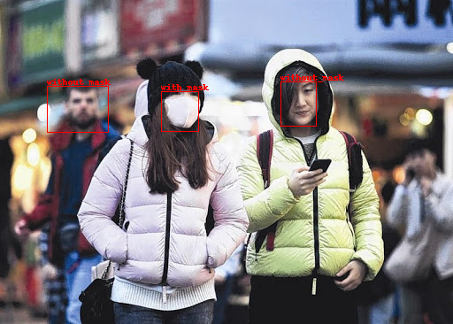

对象识别的应用范围比较广，例如人脸识别，车牌识别，自动驾驶等等都用到了对象识别的技术。对象识别是当今机器学习领域的一个前沿，2017 年研发出来的 Mask-RCNN 模型还可以检测对象的轮廓。


因为看上去越神奇的东西实现起来越难，对象识别模型相对于之前介绍的模型难度会高很多，请做好心理准备😱。

## 对象识别模型需要的训练数据

在介绍具体的模型之前，我们首先看看对象识别模型需要什么样的训练数据：

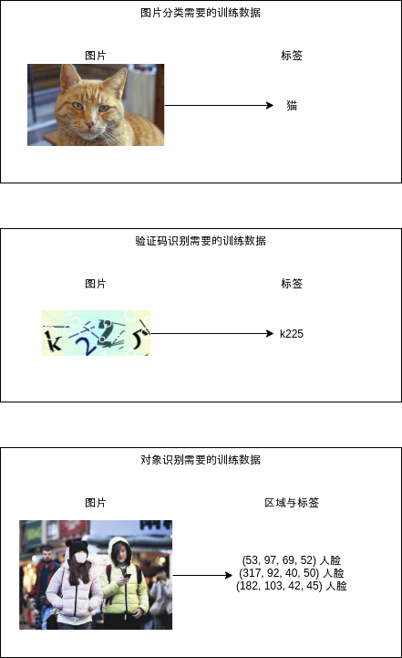

对象识别模型需要给每个图片标记有哪些区域，与每个区域对应的标签，也就是训练数据需要是列表形式的。区域的格式通常有两种，(x, y, w, h) => 左上角的坐标与长宽，与 (x1, y1, x2, y2) => 左上角与右下角的坐标，这两种格式可以互相转换，处理的时候只需要注意是哪种格式即可。标签除了需要识别的各个分类之外，还需要有一个特殊的非对象 (背景) 标签，表示这个区域不包含任何可以识别的对象，因为非对象区域通常可以自动生成，所以训练数据不需要包含非对象区域与标签。

## RCNN

RCNN (Region Based Convolutional Neural Network) 是最早期的对象识别模型，实现比较简单，可以分为以下步骤：

- 用某种算法在图片中选取 2000 个**可能**出现对象的区域
- 截取这 2000 个区域到 2000 个子图片，然后缩放它们到一个固定的大小
- 用普通的 CNN 模型分别识别这 2000 个子图片，得出它们的分类
- 排除标记为 "非对象" 分类的区域
- 把剩余的区域作为输出结果

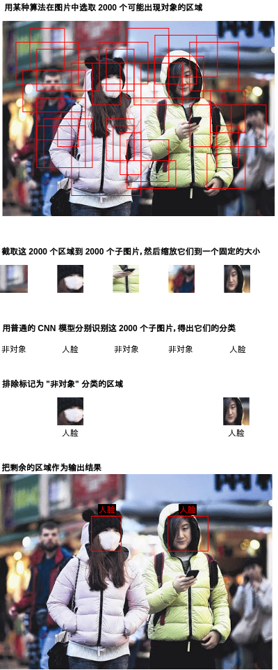

你可能已经从步骤里看出，RCNN 有几个大问题😠：

- 结果的精度很大程度取决于选取区域使用的算法
- 选取区域使用的算法是固定的，不参与学习，如果算法没有选出某个包含对象区域那么怎么学习都无法识别这个区域出来
- 慢，贼慢🐢，识别 1 张图片实际等于识别 2000 张图片

后面介绍模型结果会解决这些问题，但首先我们需要理解最简单的 RCNN 模型，接下来我们细看一下 RCNN 实现中几个重要的部分吧。

### 选取可能出现对象的区域

选取可能出现对象的区域的算法有很多种，例如滑动窗口法 (Sliding Window) 和选择性搜索法 (Selective Search)。滑动窗口法非常简单，决定一个固定大小的区域，然后按一定距离滑动得出下一个区域即可。滑动窗口法实现简单但选取出来的区域数量非常庞大并且精度很低，所以通常不会使用这种方法，除非物体大小固定并且出现的位置有一定规律。

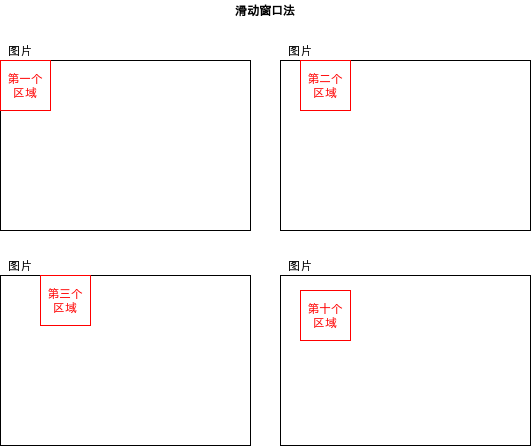

选择性搜索法则比较高级，以下是简单的说明，摘自 [opencv 的文章](https://www.learnopencv.com/selective-search-for-object-detection-cpp-python/)：

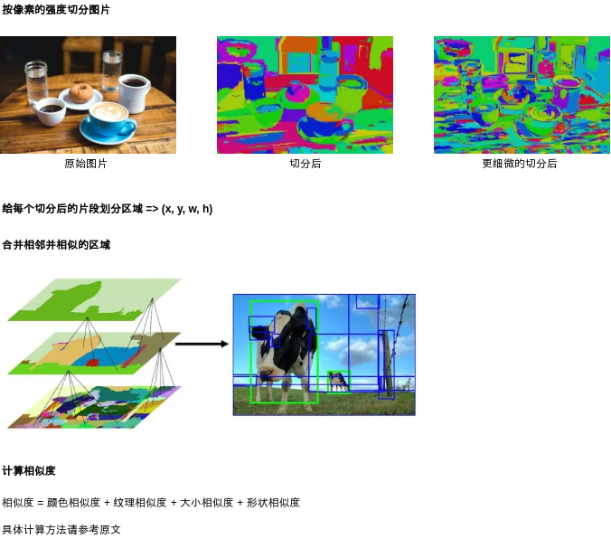

你还可以参考 [这篇文章](https://www.jianshu.com/p/351a1afc0d52) 或 [原始论文](http://www.huppelen.nl/publications/selectiveSearchDraft.pdf) 了解具体的计算方法。

如果你觉得难以理解可以跳过，因为接下来我们会直接使用 opencv 类库中提供的选择搜索函数。而且选择搜索法精度也不高，后面介绍的模型将会使用更好的方法。

``` python
# 使用 opencv 类库中提供的选择搜索函数的代码例子
import cv2

img = cv2.imread("图片路径")
s = cv2.ximgproc.segmentation.createSelectiveSearchSegmentation()
s.setBaseImage(img)
s.switchToSelectiveSearchFast()
boxes = s.process() # 可能出现对象的所有区域，会按可能性排序
candidate_boxes = boxes[:2000] # 选取头 2000 个区域
```

### 按重叠率 (IOU) 判断每个区域是否包含对象

使用算法选取出来的区域与实际区域通常不会完全重叠，只会重叠一部分，在学习的过程中我们需要根据手头上的真实区域预先判断选取出来的区域是否包含对象，再告诉模型预测结果是否正确。判断选取区域是否包含对象会依据重叠率 (IOU - Intersection Over Union)，所谓重叠率就是两个区域重叠的面积占两个区域合并的面积的比率，如下图所示。

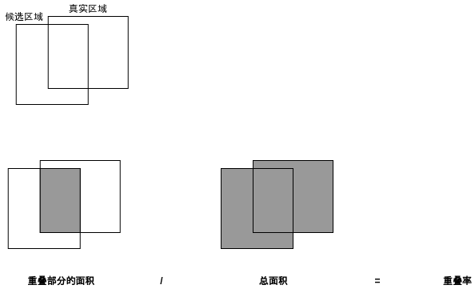

我们可以规定重叠率大于 70% 的候选区域包含对象，重叠率小于 30% 的区域不包含对象，而重叠率介于 30% ~ 70% 的区域不应该参与学习，这是为了给模型提供比较明确的数据，使得学习效果更好。

计算重叠率的代码如下，如果两个区域没有重叠则重叠率会为 0：

``` python
def calc_iou(rect1, rect2):
    """计算两个区域重叠部分 / 合并部分的比率 (intersection over union)"""
    x1, y1, w1, h1 = rect1
    x2, y2, w2, h2 = rect2
    xi = max(x1, x2)
    yi = max(y1, y2)
    wi = min(x1+w1, x2+w2) - xi
    hi = min(y1+h1, y2+h2) - yi
    if wi > 0 and hi > 0: # 有重叠部分
        area_overlap = wi*hi
        area_all = w1*h1 + w2*h2 - area_overlap
        iou = area_overlap / area_all
    else: # 没有重叠部分
        iou = 0
    return iou
```

### 原始论文

如果你想看 RCNN 的原始论文可以到以下的地址：

https://arxiv.org/pdf/1311.2524.pdf

## 使用 RCNN 识别图片中的人脸

好了，到这里你应该大致了解 RCNN 的实现原理，接下来我们试着用 RCNN 学习识别一些图片。

因为收集图片和标记图片非常累人🤕，为了偷懒这篇我还是使用现成的数据集。以下是包含人脸图片的数据集，并且带了各个人脸所在的区域的标记，格式是 (x1, y1, x2, y2)。下载需要注册帐号，但不需要交钱🤒。

https://www.kaggle.com/vin1234/count-the-number-of-faces-present-in-an-image

下载解压后可以看到图片在 train/image_data 下，标记在 bbox_train.csv 中。

例如以下的图片：

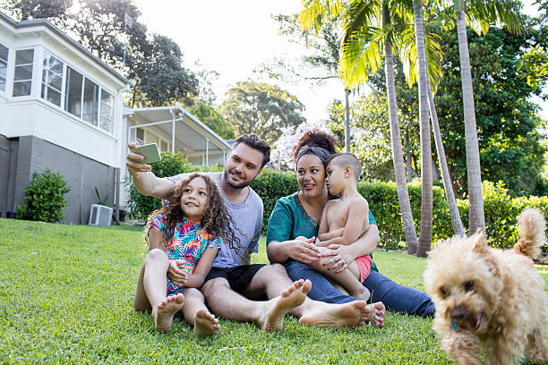

对应 csv 中的以下标记：

``` text
Name,width,height,xmin,ymin,xmax,ymax
10001.jpg,612,408,192,199,230,235
10001.jpg,612,408,247,168,291,211
10001.jpg,612,408,321,176,366,222
10001.jpg,612,408,355,183,387,214
```

数据的意义如下：

- Name: 文件名
- width: 图片整体宽度
- height: 图片整体高度
- xmin: 人脸区域的左上角的 x 坐标
- ymin: 人脸区域的左上角的 y 坐标
- xmax: 人脸区域的右下角的 x 坐标
- ymax: 人脸区域的右下角的 y 坐标

使用 RCNN 学习与识别这些图片中的人脸区域的代码如下：

``` python
import os
import sys
import torch
import gzip
import itertools
import random
import numpy
import pandas
import torchvision
import cv2
from torch import nn
from matplotlib import pyplot
from collections import defaultdict

# 各个区域缩放到的图片大小
REGION_IMAGE_SIZE = (32, 32)
# 分析目标的图片所在的文件夹
IMAGE_DIR = "./784145_1347673_bundle_archive/train/image_data"
# 定义各个图片中人脸区域的 CSV 文件
BOX_CSV_PATH = "./784145_1347673_bundle_archive/train/bbox_train.csv"

# 用于启用 GPU 支持
device = torch.device("cuda" if torch.cuda.is_available() else "cpu")

class MyModel(nn.Module):
    """识别是否人脸 (ResNet-18)"""
    def __init__(self):
        super().__init__()
        # Resnet 的实现
        # 输出两个分类 [非人脸, 人脸]
        self.resnet = torchvision.models.resnet18(num_classes=2)

    def forward(self, x):
        # 应用 ResNet
        y = self.resnet(x)
        return y

def save_tensor(tensor, path):
    """保存 tensor 对象到文件"""
    torch.save(tensor, gzip.GzipFile(path, "wb"))

def load_tensor(path):
    """从文件读取 tensor 对象"""
    return torch.load(gzip.GzipFile(path, "rb"))

def image_to_tensor(img):
    """转换 opencv 图片对象到 tensor 对象"""
    # 注意 opencv 是 BGR，但对训练没有影响所以不用转为 RGB
    img = cv2.resize(img, dsize=REGION_IMAGE_SIZE)
    arr = numpy.asarray(img)
    t = torch.from_numpy(arr)
    t = t.transpose(0, 2) # 转换维度 H,W,C 到 C,W,H
    t = t / 255.0 # 正规化数值使得范围在 0 ~ 1
    return t

def calc_iou(rect1, rect2):
    """计算两个区域重叠部分 / 合并部分的比率 (intersection over union)"""
    x1, y1, w1, h1 = rect1
    x2, y2, w2, h2 = rect2
    xi = max(x1, x2)
    yi = max(y1, y2)
    wi = min(x1+w1, x2+w2) - xi
    hi = min(y1+h1, y2+h2) - yi
    if wi > 0 and hi > 0: # 有重叠部分
        area_overlap = wi*hi
        area_all = w1*h1 + w2*h2 - area_overlap
        iou = area_overlap / area_all
    else: # 没有重叠部分
        iou = 0
    return iou

def selective_search(img):
    """计算 opencv 图片中可能出现对象的区域，只返回头 2000 个区域"""
    # 算法参考 https://www.learnopencv.com/selective-search-for-object-detection-cpp-python/
    s = cv2.ximgproc.segmentation.createSelectiveSearchSegmentation()
    s.setBaseImage(img)
    s.switchToSelectiveSearchFast()
    boxes = s.process()
    return boxes[:2000]

def prepare_save_batch(batch, image_tensors, image_labels):
    """准备训练 - 保存单个批次的数据"""
    # 生成输入和输出 tensor 对象
    tensor_in = torch.stack(image_tensors) # 维度: B,C,W,H
    tensor_out = torch.tensor(image_labels, dtype=torch.long) # 维度: B

    # 切分训练集 (80%)，验证集 (10%) 和测试集 (10%)
    random_indices = torch.randperm(tensor_in.shape[0])
    training_indices = random_indices[:int(len(random_indices)*0.8)]
    validating_indices = random_indices[int(len(random_indices)*0.8):int(len(random_indices)*0.9):]
    testing_indices = random_indices[int(len(random_indices)*0.9):]
    training_set = (tensor_in[training_indices], tensor_out[training_indices])
    validating_set = (tensor_in[validating_indices], tensor_out[validating_indices])
    testing_set = (tensor_in[testing_indices], tensor_out[testing_indices])

    # 保存到硬盘
    save_tensor(training_set, f"data/training_set.{batch}.pt")
    save_tensor(validating_set, f"data/validating_set.{batch}.pt")
    save_tensor(testing_set, f"data/testing_set.{batch}.pt")
    print(f"batch {batch} saved")

def prepare():
    """准备训练"""
    # 数据集转换到 tensor 以后会保存在 data 文件夹下
    if not os.path.isdir("data"):
        os.makedirs("data")

    # 加载 csv 文件，构建图片到区域列表的索引 { 图片名: [ 区域, 区域, .. ] }
    box_map = defaultdict(lambda: [])
    df = pandas.read_csv(BOX_CSV_PATH)
    for row in df.values:
        filename, width, height, x1, y1, x2, y2 = row[:7]
        box_map[filename].append((x1, y1, x2-x1, y2-y1))

    # 从图片里面提取人脸 (正样本) 和非人脸 (负样本) 的图片
    batch_size = 1000
    batch = 0
    image_tensors = []
    image_labels = []
    for filename, true_boxes in box_map.items():
        path = os.path.join(IMAGE_DIR, filename)
        img = cv2.imread(path) # 加载原始图片
        candidate_boxes = selective_search(img) # 查找候选区域
        positive_samples = 0
        negative_samples = 0
        for candidate_box in candidate_boxes:
            # 如果候选区域和任意一个实际区域重叠率大于 70%，则认为是正样本
            # 如果候选区域和所有实际区域重叠率都小于 30%，则认为是负样本
            # 每个图片最多添加正样本数量 + 10 个负样本，需要提供足够多负样本避免伪阳性判断
            iou_list = [ calc_iou(candidate_box, true_box) for true_box in true_boxes ]
            positive_index = next((index for index, iou in enumerate(iou_list) if iou > 0.70), None)
            is_negative = all(iou < 0.30 for iou in iou_list)
            result = None
            if positive_index is not None:
                result = True
                positive_samples += 1
            elif is_negative and negative_samples < positive_samples + 10:
                result = False
                negative_samples += 1
            if result is not None:
                x, y, w, h = candidate_box
                child_img = img[y:y+h, x:x+w].copy()
                # 检验计算是否有问题
                # cv2.imwrite(f"{filename}_{x}_{y}_{w}_{h}_{int(result)}.png", child_img)
                image_tensors.append(image_to_tensor(child_img))
                image_labels.append(int(result))
                if len(image_tensors) >= batch_size:
                    # 保存批次
                    prepare_save_batch(batch, image_tensors, image_labels)
                    image_tensors.clear()
                    image_labels.clear()
                    batch += 1
    # 保存剩余的批次
    if len(image_tensors) > 10:
        prepare_save_batch(batch, image_tensors, image_labels)

def train():
    """开始训练"""
    # 创建模型实例
    model = MyModel().to(device)

    # 创建损失计算器
    loss_function = torch.nn.CrossEntropyLoss()

    # 创建参数调整器
    optimizer = torch.optim.Adam(model.parameters())

    # 记录训练集和验证集的正确率变化
    training_accuracy_history = []
    validating_accuracy_history = []

    # 记录最高的验证集正确率
    validating_accuracy_highest = -1
    validating_accuracy_highest_epoch = 0

    # 读取批次的工具函数
    def read_batches(base_path):
        for batch in itertools.count():
            path = f"{base_path}.{batch}.pt"
            if not os.path.isfile(path):
                break
            yield [ t.to(device) for t in load_tensor(path) ]

    # 计算正确率的工具函数，正样本和负样本的正确率分别计算再平均
    def calc_accuracy(actual, predicted):
        predicted = torch.max(predicted, 1).indices
        acc_positive = ((actual > 0.5) & (predicted > 0.5)).sum().item() / ((actual > 0.5).sum().item() + 0.00001)
        acc_negative = ((actual <= 0.5) & (predicted <= 0.5)).sum().item() / ((actual <= 0.5).sum().item() + 0.00001)
        acc = (acc_positive + acc_negative) / 2
        return acc
 
    # 划分输入和输出的工具函数
    def split_batch_xy(batch, begin=None, end=None):
        # shape = batch_size, channels, width, height
        batch_x = batch[0][begin:end]
        # shape = batch_size, num_labels
        batch_y = batch[1][begin:end]
        return batch_x, batch_y

    # 开始训练过程
    for epoch in range(1, 10000):
        print(f"epoch: {epoch}")

        # 根据训练集训练并修改参数
        model.train()
        training_accuracy_list = []
        for batch_index, batch in enumerate(read_batches("data/training_set")):
            # 切分小批次，有助于泛化模型
            training_batch_accuracy_list = []
            for index in range(0, batch[0].shape[0], 100):
                # 划分输入和输出
                batch_x, batch_y = split_batch_xy(batch, index, index+100)
                # 计算预测值
                predicted = model(batch_x)
                # 计算损失
                loss = loss_function(predicted, batch_y)
                # 从损失自动微分求导函数值
                loss.backward()
                # 使用参数调整器调整参数
                optimizer.step()
                # 清空导函数值
                optimizer.zero_grad()
                # 记录这一个批次的正确率，torch.no_grad 代表临时禁用自动微分功能
                with torch.no_grad():
                    training_batch_accuracy_list.append(calc_accuracy(batch_y, predicted))
            # 输出批次正确率
            training_batch_accuracy = sum(training_batch_accuracy_list) / len(training_batch_accuracy_list)
            training_accuracy_list.append(training_batch_accuracy)
            print(f"epoch: {epoch}, batch: {batch_index}: batch accuracy: {training_batch_accuracy}")
        training_accuracy = sum(training_accuracy_list) / len(training_accuracy_list)
        training_accuracy_history.append(training_accuracy)
        print(f"training accuracy: {training_accuracy}")

        # 检查验证集
        model.eval()
        validating_accuracy_list = []
        for batch in read_batches("data/validating_set"):
            batch_x, batch_y = split_batch_xy(batch)
            predicted = model(batch_x)
            validating_accuracy_list.append(calc_accuracy(batch_y, predicted))
        validating_accuracy = sum(validating_accuracy_list) / len(validating_accuracy_list)
        validating_accuracy_history.append(validating_accuracy)
        print(f"validating accuracy: {validating_accuracy}")

        # 记录最高的验证集正确率与当时的模型状态，判断是否在 20 次训练后仍然没有刷新记录
        if validating_accuracy > validating_accuracy_highest:
            validating_accuracy_highest = validating_accuracy
            validating_accuracy_highest_epoch = epoch
            save_tensor(model.state_dict(), "model.pt")
            print("highest validating accuracy updated")
        elif epoch - validating_accuracy_highest_epoch > 20:
            # 在 20 次训练后仍然没有刷新记录，结束训练
            print("stop training because highest validating accuracy not updated in 20 epoches")
            break

    # 使用达到最高正确率时的模型状态
    print(f"highest validating accuracy: {validating_accuracy_highest}",
        f"from epoch {validating_accuracy_highest_epoch}")
    model.load_state_dict(load_tensor("model.pt"))

    # 检查测试集
    testing_accuracy_list = []
    for batch in read_batches("data/testing_set"):
        batch_x, batch_y = split_batch_xy(batch)
        predicted = model(batch_x)
        testing_accuracy_list.append(calc_accuracy(batch_y, predicted))
    testing_accuracy = sum(testing_accuracy_list) / len(testing_accuracy_list)
    print(f"testing accuracy: {testing_accuracy}")

    # 显示训练集和验证集的正确率变化
    pyplot.plot(training_accuracy_history, label="training")
    pyplot.plot(validating_accuracy_history, label="validing")
    pyplot.ylim(0, 1)
    pyplot.legend()
    pyplot.show()

def eval_model():
    """使用训练好的模型"""
    # 创建模型实例，加载训练好的状态，然后切换到验证模式
    model = MyModel().to(device)
    model.load_state_dict(load_tensor("model.pt"))
    model.eval()

    # 询问图片路径，并显示所有可能是人脸的区域
    while True:
        try:
            # 选取可能出现对象的区域一览
            image_path = input("Image path: ")
            if not image_path:
                continue
            img = cv2.imread(image_path)
            candidate_boxes = selective_search(img)
            # 构建输入
            image_tensors = []
            for candidate_box in candidate_boxes:
                x, y, w, h = candidate_box
                child_img = img[y:y+h, x:x+w].copy()
                image_tensors.append(image_to_tensor(child_img))
            tensor_in = torch.stack(image_tensors).to(device)
            # 预测输出
            tensor_out = model(tensor_in)
            # 使用 softmax 计算是人脸的概率
            tensor_out = nn.functional.softmax(tensor_out, dim=1)
            tensor_out = tensor_out[:,1].resize(tensor_out.shape[0])
            # 判断概率大于 99% 的是人脸，添加边框到图片并保存
            img_output = img.copy()
            indices = torch.where(tensor_out > 0.99)[0]
            result_boxes = []
            result_boxes_all = []
            for index in indices:
                box = candidate_boxes[index]
                for exists_box in result_boxes_all:
                    # 如果和现存找到的区域重叠度大于 30% 则跳过
                    if calc_iou(exists_box, box) > 0.30:
                        break
                else:
                    result_boxes.append(box)
                result_boxes_all.append(box)
            for box in result_boxes:
                x, y, w, h = box
                print(x, y, w, h)
                cv2.rectangle(img_output, (x, y), (x+w, y+h), (0, 0, 0xff), 1)
            cv2.imwrite("img_output.png", img_output)
            print("saved to img_output.png")
            print()
        except Exception as e:
            print("error:", e)

def main():
    """主函数"""
    if len(sys.argv) < 2:
        print(f"Please run: {sys.argv[0]} prepare|train|eval")
        exit()

    # 给随机数生成器分配一个初始值，使得每次运行都可以生成相同的随机数
    # 这是为了让过程可重现，你也可以选择不这样做
    random.seed(0)
    torch.random.manual_seed(0)

    # 根据命令行参数选择操作
    operation = sys.argv[1]
    if operation == "prepare":
        prepare()
    elif operation == "train":
        train()
    elif operation == "eval":
        eval_model()
    else:
        raise ValueError(f"Unsupported operation: {operation}")

if __name__ == "__main__":
    main()
```

和之前文章给出的代码例子一样，这份代码也分为了 prepare, train, eval 三个部分，其中 prepare 部分负责选取区域，提取正样本 (包含人脸的区域) 和负样本 (不包含人脸的区域) 的子图片；train 使用普通的 resnet 模型学习子图片；eval 针对给出的图片选取区域并识别所有区域中是否包含人脸。

除了选取区域和提取子图片的处理以外，基本上和之前介绍的 CNN 模型一样吧🥳。

执行以下命令以后：

``` text
python3 example.py prepare
python3 example.py train
```

的最终输出如下：

``` text
epoch: 101, batch: 106: batch accuracy: 0.9999996838862198
epoch: 101, batch: 107: batch accuracy: 0.999218446914751
epoch: 101, batch: 108: batch accuracy: 0.9999996211125055
training accuracy: 0.999441394076678
validating accuracy: 0.9687856357743619
stop training because highest validating accuracy not updated in 20 epoches
highest validating accuracy: 0.9766918253771755 from epoch 80
testing accuracy: 0.9729761086851993
```

训练集和验证集的正确率变化如下：

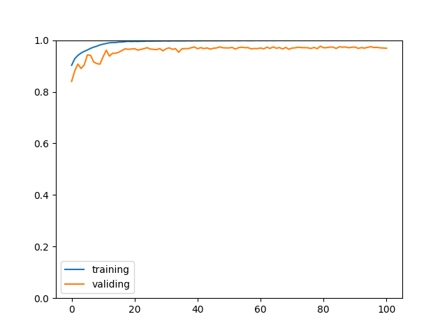

正确率看起来很高，但这只是针对选取后的区域判断的正确率，因为选取算法效果比较一般并且样本数量比较少，所以最终效果不能说令人满意😕。

执行以下命令，再输入图片路径可以使用学习好的模型识别图片：

``` text
python3 example.py eval
```

以下是部分识别结果：

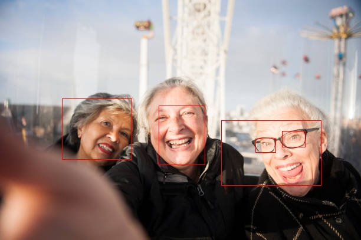


精度一般般😕。

## Fast-RCNN

RCNN 慢的原因主要是因为识别几千个子图片的计算量非常庞大，特别是这几千个子图片的范围很多是重合的，导致了很多重复的计算。Fast-RCNN 着重改善了这一部分，首先会针对整张图片生成一个与图片长宽相同 (或者等比例缩放) 的特征数据，然后再根据可能包含对象的区域截取特征数据，然后再根据截取后的子特征数据识别分类。RCNN 与 Fast-RCNN 的区别如下图所示：

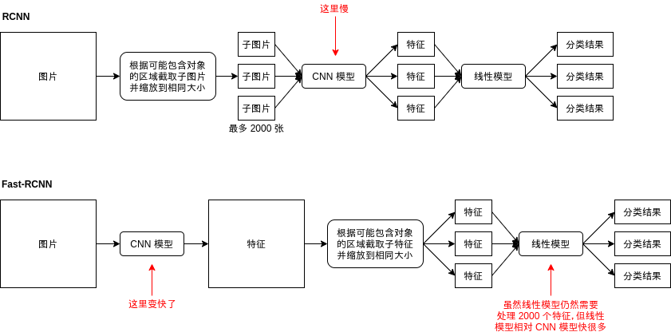

遗憾的是 Fast-RCNN 只是改善了速度，并不会改善正确率。但下面介绍的例子会引入一个比较重要的处理，即调整区域范围，它可以让模型给出的区域更接近实际的区域。

以下是 Fast-RCNN 模型中的一些处理细节。

### 缩放来源图片

在 RCNN 中，传给 CNN 模型的图片是经过缩放的子图片，而在 Fast-RCNN 中我们需要传原图片给 CNN 模型，那么原图片也需要进行缩放。缩放使用的方法是填充法，如下图所示：

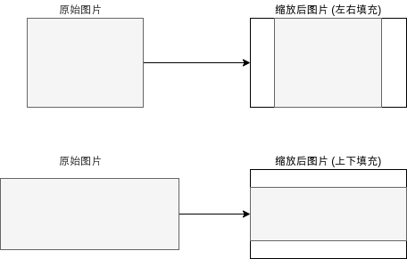

缩放图片使用的代码如下 (opencv 版)：

``` python
IMAGE_SIZE = (128, 88)

def calc_resize_parameters(sw, sh):
    """计算缩放图片的参数"""
    sw_new, sh_new = sw, sh
    dw, dh = IMAGE_SIZE
    pad_w, pad_h = 0, 0
    if sw / sh < dw / dh:
        sw_new = int(dw / dh * sh)
        pad_w = (sw_new - sw) // 2 # 填充左右
    else:
        sh_new = int(dh / dw * sw)
        pad_h = (sh_new - sh) // 2 # 填充上下
    return sw_new, sh_new, pad_w, pad_h

def resize_image(img):
    """缩放 opencv 图片，比例不一致时填充"""
    sh, sw, _ = img.shape
    sw_new, sh_new, pad_w, pad_h = calc_resize_parameters(sw, sh)
    img = cv2.copyMakeBorder(img, pad_h, pad_h, pad_w, pad_w, cv2.BORDER_CONSTANT, (0, 0, 0))
    img = cv2.resize(img, dsize=IMAGE_SIZE)
    return img
```

缩放图片后区域的坐标也需要转换，转换的代码如下 (都是枯燥的代码🤒)：

``` python
IMAGE_SIZE = (128, 88)

def map_box_to_resized_image(box, sw, sh):
    """把原始区域转换到缩放后的图片对应的区域"""
    x, y, w, h = box
    sw_new, sh_new, pad_w, pad_h = calc_resize_parameters(sw, sh)
    scale = IMAGE_SIZE[0] / sw_new
    x = int((x + pad_w) * scale)
    y = int((y + pad_h) * scale)
    w = int(w * scale)
    h = int(h * scale)
    if x + w > IMAGE_SIZE[0] or y + h > IMAGE_SIZE[1] or w == 0 or h == 0:
        return 0, 0, 0, 0
    return x, y, w, h

def map_box_to_original_image(box, sw, sh):
    """把缩放后图片对应的区域转换到缩放前的原始区域"""
    x, y, w, h = box
    sw_new, sh_new, pad_w, pad_h = calc_resize_parameters(sw, sh)
    scale = IMAGE_SIZE[0] / sw_new
    x = int(x / scale - pad_w)
    y = int(y / scale - pad_h)
    w = int(w / scale)
    h = int(h / scale)
    if x + w > sw or y + h > sh or x < 0 or y < 0 or w == 0 or h == 0:
        return 0, 0, 0, 0
    return x, y, w, h
```

### 计算区域特征

在前面的文章中我们已经了解过，CNN 模型可以分为卷积层，池化层和全连接层，卷积层，池化层用于抽取图片中各个区域的特征，全连接层用于把特征扁平化并交给线性模型处理。在 Fast-RCNN 中，我们不需要使用整张图片的特征，只需要使用部分区域的特征，所以 Fast-RCNN 使用的 CNN 模型只需要卷积层和池化层 (部分模型池化层可以省略)，卷积层输出的通道数量通常会比图片原有的通道数量多，并且长宽会按原来图片的长宽等比例缩小，例如原图的大小是 3,256,256 的时候，经过处理可能会输出 512,32,32，代表每个 8x8 像素的区域都对应 512 个特征。

这篇给出的 Fast-RCN 代码为了易于理解，会让 CNN 模型输出和原图一模一样的大小，这样抽取区域特征的时候只需要使用 `[]` 操作符即可。

### 抽取区域特征 (ROI Pooling)

Fast-RCNN 根据整张图片生成特征以后，下一步就是抽取区域特征 (Region of interest Pooling) 了，抽取区域特征简单的来说就是根据区域在图片中的位置，截区域中该位置的数据，然后再缩放到相同大小，如下图所示：


抽取区域特征的层又称为 ROI 层。

如果特征的长宽和图片的长宽相同，那么截取特征只需要简单的 `[]` 操作，但如果特征的长宽比图片的长宽要小，那么就需要使用近邻插值法 (Nearest Neighbor Interpolation) 或者双线插值法 (Bilinear Interpolation) 进行截取，使用双线插值法进行截取的 ROI 层又称作 ROI Align。截取以后的缩放可以使用 MaxPool，近邻插值法或双线插值法等算法。

想更好的理解 ROI Align 与双线插值法可以参考[这篇文章](https://chao-ji.github.io/jekyll/update/2018/07/20/ROIAlign.html)。

### 调整区域范围

在前面已经提到过，使用选择搜索法等算法选取出来的区域与对象实际所在的区域可能有一定偏差，这个偏差是可以通过模型来调整的。举个简单的例子，如果区域内有脸的左半部分，那么模型在经过学习后应该可以判断出区域应该向右扩展一些。

区域调整可以分为四个参数：

- 对左上角 x 坐标的调整
- 对左上角 y 坐标的调整
- 对长度的调整
- 对宽度的调整

因为坐标和长宽的值大小不一定，例如同样是脸的左半部分，出现在图片的左上角和图片的右下角就会让 x y 坐标不一样，如果远近不同那么长宽也会不一样，我们需要把调整量作标准化，标准化的公式如下：

- x1, y1, w1, h1 = 候选区域
- x2, y2, w2, h2 = 真实区域
- x 偏移 = (x2 - x1) / w1
- y 偏移 = (y2 - y1) / h1
- w 偏移 = log(w2 / w1)
- h 偏移 = log(h2 / h1)

经过标准化后，偏移的值就会作为比例而不是绝对值，不会受具体坐标和长宽的影响。此外，公式中使用 log 是为了减少偏移的增幅，使得偏移比较大的时候模型仍然可以达到比较好的学习效果。

计算区域调整偏移和根据偏移调整区域的代码如下：

``` python
def calc_box_offset(candidate_box, true_box):
    """计算候选区域与实际区域的偏移值"""
    x1, y1, w1, h1 = candidate_box
    x2, y2, w2, h2 = true_box
    x_offset = (x2 - x1) / w1
    y_offset = (y2 - y1) / h1
    w_offset = math.log(w2 / w1)
    h_offset = math.log(h2 / h1)
    return (x_offset, y_offset, w_offset, h_offset)

def adjust_box_by_offset(candidate_box, offset):
    """根据偏移值调整候选区域"""
    x1, y1, w1, h1 = candidate_box
    x_offset, y_offset, w_offset, h_offset = offset
    x2 = w1 * x_offset + x1
    y2 = h1 * y_offset + y1
    w2 = math.exp(w_offset) * w1
    h2 = math.exp(h_offset) * h1
    return (x2, y2, w2, h2)
```

### 计算损失

Fast-RCNN 模型会针对各个区域输出两个结果，第一个是区域对应的标签 (人脸，非人脸)，第二个是上面提到的区域偏移，调整参数的时候也需要同时根据这两个结果调整。实现同时调整多个结果可以把损失相加起来再计算各个参数的导函数值：

``` text
各个区域的特征 = ROI层(CNN模型(图片数据))

计算标签的线性模型(各个区域的特征) - 真实标签 = 标签损失
计算偏移的线性模型(各个区域的特征) - 真实偏移 = 偏移损失

损失 = 标签损失 + 偏移损失
```

有一个需要注意的地方是，在这个例子里计算标签损失需要分别根据正负样本计算，否则模型在经过调整以后只会输出负结果。这是因为线性模型计算抽取出来的特征时有可能输出正 (人脸)，也有可能输出负 (非人脸)，而 ROI 层抽取的特征很多是重合的，也就是来源相同，当负样本比正样本要多的时候，结果的方向就会更偏向于负，这样每次调整参数的时候都会向输出负的方向调整。如果把损失分开计算，那么不重合的特征可以分别向输出正负的方向调整，从而达到学习的效果。

此外，偏移损失只应该根据正样本计算，负样本没有必要学习偏移。

最终的损失计算处理如下：

``` text
各个区域的特征 = ROI层(CNN模型(图片数据))

计算标签的线性模型(各个区域的特征)[正样本] - 真实标签[正样本] = 正样本标签损失
计算标签的线性模型(各个区域的特征)[负样本] - 真实标签[负样本] = 负样本标签损失
计算偏移的线性模型(各个区域的特征)[正样本] - 真实偏移[正样本] = 正样本偏移损失

损失 = 正样本标签损失 + 负样本标签损失 + 正样本偏移损失
```

### 合并结果区域

因为选取区域的算法本来就会返回很多重合的区域，可能会有有好几个区域同时和真实区域重叠率大于一定值 (70%)，导致这几个区域都会被认为是包含对象的区域：


模型经过学习后，针对图片预测得出结果时也有可能返回这样的重合区域，合并这样的区域有几种方法：

- 使用最左，最右，最上，或者最下的区域
- 使用第一个区域 (区域选取算法会按出现对象的可能性排序)
- 结合所有重合的区域 (如果区域调整效果不行，则可能出现结果区域比真实区域大很多的问题)

上面给出的 RCNN 代码例子已经使用第二个方法合并结果区域，下面给出的例子也会使用同样的方法。但下一篇文章的 Faster-RCNN 则会使用第三个方法，因为 Faster-RCNN 的区域调整效果相对比较好。

### 原始论文

如果你想看 Fast-RCNN 的原始论文可以到以下的地址：

https://arxiv.org/pdf/1504.08083.pdf

## 使用 Fast-RCNN 识别图片中的人脸

代码时间到了😱，这份代码会使用 Fast-RCNN 模型来图片中的人脸，使用的数据集和前面的例子一样。

``` python
import os
import sys
import torch
import gzip
import itertools
import random
import numpy
import math
import pandas
import cv2
from torch import nn
from matplotlib import pyplot
from collections import defaultdict

# 缩放图片的大小
IMAGE_SIZE = (256, 256)
# 分析目标的图片所在的文件夹
IMAGE_DIR = "./784145_1347673_bundle_archive/train/image_data"
# 定义各个图片中人脸区域的 CSV 文件
BOX_CSV_PATH = "./784145_1347673_bundle_archive/train/bbox_train.csv"

# 用于启用 GPU 支持
device = torch.device("cuda" if torch.cuda.is_available() else "cpu")

class BasicBlock(nn.Module):
    """ResNet 使用的基础块"""
    expansion = 1 # 定义这个块的实际出通道是 channels_out 的几倍，这里的实现固定是一倍
    def __init__(self, channels_in, channels_out, stride):
        super().__init__()
        # 生成 3x3 的卷积层
        # 处理间隔 stride = 1 时，输出的长宽会等于输入的长宽，例如 (32-3+2)//1+1 == 32
        # 处理间隔 stride = 2 时，输出的长宽会等于输入的长宽的一半，例如 (32-3+2)//2+1 == 16
        # 此外 resnet 的 3x3 卷积层不使用偏移值 bias
        self.conv1 = nn.Sequential(
            nn.Conv2d(channels_in, channels_out, kernel_size=3, stride=stride, padding=1, bias=False),
            nn.BatchNorm2d(channels_out))
        # 再定义一个让输出和输入维度相同的 3x3 卷积层
        self.conv2 = nn.Sequential(
            nn.Conv2d(channels_out, channels_out, kernel_size=3, stride=1, padding=1, bias=False),
            nn.BatchNorm2d(channels_out))
        # 让原始输入和输出相加的时候，需要维度一致，如果维度不一致则需要整合
        self.identity = nn.Sequential()
        if stride != 1 or channels_in != channels_out * self.expansion:
            self.identity = nn.Sequential(
                nn.Conv2d(channels_in, channels_out * self.expansion, kernel_size=1, stride=stride, bias=False),
                nn.BatchNorm2d(channels_out * self.expansion))

    def forward(self, x):
        # x => conv1 => relu => conv2 => + => relu
        # |                              ^
        # |==============================|
        tmp = self.conv1(x)
        tmp = nn.functional.relu(tmp, inplace=True)
        tmp = self.conv2(tmp)
        tmp += self.identity(x)
        y = nn.functional.relu(tmp, inplace=True)
        return y

class MyModel(nn.Module):
    """Fast-RCNN (基于 ResNet-18 的变种)"""
    def __init__(self):
        super().__init__()
        # 记录上一层的出通道数量
        self.previous_channels_out = 4
        # 把 3 通道转换到 4 通道，长宽不变
        self.conv1 = nn.Sequential(
            nn.Conv2d(3, self.previous_channels_out, kernel_size=3, stride=1, padding=1, bias=False),
            nn.BatchNorm2d(self.previous_channels_out))
        # 抽取图片各个区域特征的 ResNet (除去 AvgPool 和全连接层)
        # 和原始的 Resnet 不一样的是输出的长宽和输入的长宽会相等，以便 ROI 层按区域抽取R征
        # 此外，为了可以让模型跑在 4GB 显存上，这里减少了模型的通道数量
        self.layer1 = self._make_layer(BasicBlock, channels_out=4, num_blocks=2, stride=1)
        self.layer2 = self._make_layer(BasicBlock, channels_out=4, num_blocks=2, stride=1)
        self.layer3 = self._make_layer(BasicBlock, channels_out=8, num_blocks=2, stride=1)
        self.layer4 = self._make_layer(BasicBlock, channels_out=8, num_blocks=2, stride=1)
        # ROI 层抽取各个子区域特征后转换到固定大小
        self.roi_pool = nn.AdaptiveMaxPool2d((5, 5))
        # 输出两个分类 [非人脸, 人脸]
        self.fc_labels_model = nn.Sequential(
            nn.Linear(8*5*5, 32),
            nn.ReLU(),
            nn.Dropout(0.1),
            nn.Linear(32, 2))
        # 计算区域偏移，分别输出 x, y, w, h 的偏移
        self.fc_offsets_model = nn.Sequential(
            nn.Linear(8*5*5, 128),
            nn.ReLU(),
            nn.Dropout(0.1),
            nn.Linear(128, 4))

    def _make_layer(self, block_type, channels_out, num_blocks, stride):
        blocks = []
        # 添加第一个块
        blocks.append(block_type(self.previous_channels_out, channels_out, stride))
        self.previous_channels_out = channels_out * block_type.expansion
        # 添加剩余的块，剩余的块固定处理间隔为 1，不会改变长宽
        for _ in range(num_blocks-1):
            blocks.append(block_type(self.previous_channels_out, self.previous_channels_out, 1))
            self.previous_channels_out *= block_type.expansion
        return nn.Sequential(*blocks)

    def _roi_pooling(self, feature_mapping, roi_boxes):
        result = []
        for box in roi_boxes:
            image_index, x, y, w, h = map(int, box.tolist())
            feature_sub_region = feature_mapping[image_index][:,x:x+w,y:y+h]
            fixed_features = self.roi_pool(feature_sub_region).reshape(-1) # 顺道扁平化
            result.append(fixed_features)
        return torch.stack(result)

    def forward(self, x):
        images_tensor = x[0]
        candidate_boxes_tensor = x[1]
        # 转换出通道
        tmp = self.conv1(images_tensor)
        tmp = nn.functional.relu(tmp)
        # 应用 ResNet 的各个层
        # 结果维度是 B,32,W,H
        tmp = self.layer1(tmp)
        tmp = self.layer2(tmp)
        tmp = self.layer3(tmp)
        tmp = self.layer4(tmp)
        # 使用 ROI 层抽取各个子区域的特征并转换到固定大小
        # 结果维度是 B,32*9*9
        tmp = self._roi_pooling(tmp, candidate_boxes_tensor)
        # 根据抽取出来的子区域特征分别计算分类 (是否人脸) 和区域偏移
        labels = self.fc_labels_model(tmp)
        offsets = self.fc_offsets_model(tmp)
        y = (labels, offsets)
        return y

def save_tensor(tensor, path):
    """保存 tensor 对象到文件"""
    torch.save(tensor, gzip.GzipFile(path, "wb"))

def load_tensor(path):
    """从文件读取 tensor 对象"""
    return torch.load(gzip.GzipFile(path, "rb"))

def calc_resize_parameters(sw, sh):
    """计算缩放图片的参数"""
    sw_new, sh_new = sw, sh
    dw, dh = IMAGE_SIZE
    pad_w, pad_h = 0, 0
    if sw / sh < dw / dh:
        sw_new = int(dw / dh * sh)
        pad_w = (sw_new - sw) // 2 # 填充左右
    else:
        sh_new = int(dh / dw * sw)
        pad_h = (sh_new - sh) // 2 # 填充上下
    return sw_new, sh_new, pad_w, pad_h

def resize_image(img):
    """缩放 opencv 图片，比例不一致时填充"""
    sh, sw, _ = img.shape
    sw_new, sh_new, pad_w, pad_h = calc_resize_parameters(sw, sh)
    img = cv2.copyMakeBorder(img, pad_h, pad_h, pad_w, pad_w, cv2.BORDER_CONSTANT, (0, 0, 0))
    img = cv2.resize(img, dsize=IMAGE_SIZE)
    return img

def image_to_tensor(img):
    """转换 opencv 图片对象到 tensor 对象"""
    # 注意 opencv 是 BGR，但对训练没有影响所以不用转为 RGB
    arr = numpy.asarray(img)
    t = torch.from_numpy(arr)
    t = t.transpose(0, 2) # 转换维度 H,W,C 到 C,W,H
    t = t / 255.0 # 正规化数值使得范围在 0 ~ 1
    return t

def map_box_to_resized_image(box, sw, sh):
    """把原始区域转换到缩放后的图片对应的区域"""
    x, y, w, h = box
    sw_new, sh_new, pad_w, pad_h = calc_resize_parameters(sw, sh)
    scale = IMAGE_SIZE[0] / sw_new
    x = int((x + pad_w) * scale)
    y = int((y + pad_h) * scale)
    w = int(w * scale)
    h = int(h * scale)
    if x + w > IMAGE_SIZE[0] or y + h > IMAGE_SIZE[1] or w == 0 or h == 0:
        return 0, 0, 0, 0
    return x, y, w, h

def map_box_to_original_image(box, sw, sh):
    """把缩放后图片对应的区域转换到缩放前的原始区域"""
    x, y, w, h = box
    sw_new, sh_new, pad_w, pad_h = calc_resize_parameters(sw, sh)
    scale = IMAGE_SIZE[0] / sw_new
    x = int(x / scale - pad_w)
    y = int(y / scale - pad_h)
    w = int(w / scale)
    h = int(h / scale)
    if x + w > sw or y + h > sh or x < 0 or y < 0 or w == 0 or h == 0:
        return 0, 0, 0, 0
    return x, y, w, h

def calc_iou(rect1, rect2):
    """计算两个区域重叠部分 / 合并部分的比率 (intersection over union)"""
    x1, y1, w1, h1 = rect1
    x2, y2, w2, h2 = rect2
    xi = max(x1, x2)
    yi = max(y1, y2)
    wi = min(x1+w1, x2+w2) - xi
    hi = min(y1+h1, y2+h2) - yi
    if wi > 0 and hi > 0: # 有重叠部分
        area_overlap = wi*hi
        area_all = w1*h1 + w2*h2 - area_overlap
        iou = area_overlap / area_all
    else: # 没有重叠部分
        iou = 0
    return iou

def calc_box_offset(candidate_box, true_box):
    """计算候选区域与实际区域的偏移值"""
    # 这里计算出来的偏移值基于比例，而不受具体位置和大小影响
    # w h 使用 log 是为了减少过大的值的影响
    x1, y1, w1, h1 = candidate_box
    x2, y2, w2, h2 = true_box
    x_offset = (x2 - x1) / w1
    y_offset = (y2 - y1) / h1
    w_offset = math.log(w2 / w1)
    h_offset = math.log(h2 / h1)
    return (x_offset, y_offset, w_offset, h_offset)

def adjust_box_by_offset(candidate_box, offset):
    """根据偏移值调整候选区域"""
    x1, y1, w1, h1 = candidate_box
    x_offset, y_offset, w_offset, h_offset = offset
    x2 = w1 * x_offset + x1
    y2 = h1 * y_offset + y1
    w2 = math.exp(w_offset) * w1
    h2 = math.exp(h_offset) * h1
    return (x2, y2, w2, h2)

def selective_search(img):
    """计算 opencv 图片中可能出现对象的区域，只返回头 2000 个区域"""
    # 算法参考 https://www.learnopencv.com/selective-search-for-object-detection-cpp-python/
    s = cv2.ximgproc.segmentation.createSelectiveSearchSegmentation()
    s.setBaseImage(img)
    s.switchToSelectiveSearchFast()
    boxes = s.process()
    return boxes[:2000]

def prepare_save_batch(batch, image_tensors, image_candidate_boxes, image_labels, image_box_offsets):
    """准备训练 - 保存单个批次的数据"""
    # 按索引值列表生成输入和输出 tensor 对象的函数
    def split_dataset(indices):
        image_in = []
        candidate_boxes_in = []
        labels_out = []
        offsets_out = []
        for new_image_index, original_image_index in enumerate(indices):
            image_in.append(image_tensors[original_image_index])
            for box, label, offset in zip(image_candidate_boxes, image_labels, image_box_offsets):
                box_image_index, x, y, w, h = box
                if box_image_index == original_image_index:
                    candidate_boxes_in.append((new_image_index, x, y, w, h))
                    labels_out.append(label)
                    offsets_out.append(offset)
        # 检查计算是否有问题
        # for box, label in zip(candidate_boxes_in, labels_out):
        #    image_index, x, y, w, h = box
        #    child_img = image_in[image_index][:, x:x+w, y:y+h].transpose(0, 2) * 255
        #    cv2.imwrite(f"{image_index}_{x}_{y}_{w}_{h}_{label}.png", child_img.numpy())
        tensor_image_in = torch.stack(image_in) # 维度: B,C,W,H
        tensor_candidate_boxes_in = torch.tensor(candidate_boxes_in, dtype=torch.float) # 维度: N,5 (index, x, y, w, h)
        tensor_labels_out = torch.tensor(labels_out, dtype=torch.long) # 维度: N
        tensor_box_offsets_out = torch.tensor(offsets_out, dtype=torch.float) # 维度: N,4 (x_offset, y_offset, ..)
        return (tensor_image_in, tensor_candidate_boxes_in), (tensor_labels_out, tensor_box_offsets_out)

    # 切分训练集 (80%)，验证集 (10%) 和测试集 (10%)
    random_indices = torch.randperm(len(image_tensors))
    training_indices = random_indices[:int(len(random_indices)*0.8)]
    validating_indices = random_indices[int(len(random_indices)*0.8):int(len(random_indices)*0.9):]
    testing_indices = random_indices[int(len(random_indices)*0.9):]
    training_set = split_dataset(training_indices)
    validating_set = split_dataset(validating_indices)
    testing_set = split_dataset(testing_indices)

    # 保存到硬盘
    save_tensor(training_set, f"data/training_set.{batch}.pt")
    save_tensor(validating_set, f"data/validating_set.{batch}.pt")
    save_tensor(testing_set, f"data/testing_set.{batch}.pt")
    print(f"batch {batch} saved")

def prepare():
    """准备训练"""
    # 数据集转换到 tensor 以后会保存在 data 文件夹下
    if not os.path.isdir("data"):
        os.makedirs("data")

    # 加载 csv 文件，构建图片到区域列表的索引 { 图片名: [ 区域, 区域, .. ] }
    box_map = defaultdict(lambda: [])
    df = pandas.read_csv(BOX_CSV_PATH)
    for row in df.values:
        filename, width, height, x1, y1, x2, y2 = row[:7]
        box_map[filename].append((x1, y1, x2-x1, y2-y1))

    # 从图片里面提取人脸 (正样本) 和非人脸 (负样本) 的图片
    batch_size = 50
    max_samples = 10
    batch = 0
    image_tensors = [] # 图片列表
    image_candidate_boxes = [] # 各个图片的候选区域列表
    image_labels = [] # 各个图片的候选区域对应的标签 (1 人脸 0 非人脸)
    image_box_offsets = [] # 各个图片的候选区域与真实区域的偏移值
    for filename, true_boxes in box_map.items():
        path = os.path.join(IMAGE_DIR, filename)
        img_original = cv2.imread(path) # 加载原始图片
        sh, sw, _ = img_original.shape # 原始图片大小
        img = resize_image(img_original) # 缩放图片
        candidate_boxes = selective_search(img) # 查找候选区域
        true_boxes = [ map_box_to_resized_image(b, sw, sh) for b in true_boxes ] # 缩放实际区域
        image_index = len(image_tensors) # 图片在批次中的索引值
        image_tensors.append(image_to_tensor(img.copy()))
        positive_samples = 0
        negative_samples = 0
        for candidate_box in candidate_boxes:
            # 如果候选区域和任意一个实际区域重叠率大于 70%，则认为是正样本
            # 如果候选区域和所有实际区域重叠率都小于 30%，则认为是负样本
            # 每个图片最多添加正样本数量 + 10 个负样本，需要提供足够多负样本避免伪阳性判断
            iou_list = [ calc_iou(candidate_box, true_box) for true_box in true_boxes ]
            positive_index = next((index for index, iou in enumerate(iou_list) if iou > 0.70), None)
            is_negative = all(iou < 0.30 for iou in iou_list)
            result = None
            if positive_index is not None:
                result = True
                positive_samples += 1
            elif is_negative and negative_samples < positive_samples + 10:
                result = False
                negative_samples += 1
            if result is not None:
                x, y, w, h = candidate_box
                # 检验计算是否有问题
                # child_img = img[y:y+h, x:x+w].copy()
                # cv2.imwrite(f"{filename}_{x}_{y}_{w}_{h}_{int(result)}.png", child_img)
                image_candidate_boxes.append((image_index, x, y, w, h))
                image_labels.append(int(result))
                if positive_index is not None:
                    image_box_offsets.append(calc_box_offset(
                        candidate_box, true_boxes[positive_index])) # 正样本添加偏移值
                else:
                    image_box_offsets.append((0, 0, 0, 0)) # 负样本无偏移
            if positive_samples >= max_samples:
                break
        # 保存批次
        if len(image_tensors) >= batch_size:
            prepare_save_batch(batch, image_tensors, image_candidate_boxes, image_labels, image_box_offsets)
            image_tensors.clear()
            image_candidate_boxes.clear()
            image_labels.clear()
            image_box_offsets.clear()
            batch += 1
    # 保存剩余的批次
    if len(image_tensors) > 10:
        prepare_save_batch(batch, image_tensors, image_candidate_boxes, image_labels, image_box_offsets)

def train():
    """开始训练"""
    # 创建模型实例
    model = MyModel().to(device)

    # 创建多任务损失计算器
    celoss = torch.nn.CrossEntropyLoss()
    mseloss = torch.nn.MSELoss()
    def loss_function(predicted, actual):
        # 标签损失必须根据正负样本分别计算，否则会导致预测结果总是为负的问题
        positive_indices = actual[0].nonzero(as_tuple=True)[0] # 正样本的索引值列表
        negative_indices = (actual[0] == 0).nonzero(as_tuple=True)[0] # 负样本的索引值列表
        loss1 = celoss(predicted[0][positive_indices], actual[0][positive_indices]) # 正样本标签的损失
        loss2 = celoss(predicted[0][negative_indices], actual[0][negative_indices]) # 负样本标签的损失
        loss3 = mseloss(predicted[1][positive_indices], actual[1][positive_indices]) # 偏移值的损失，仅针对正样本计算
        return loss1 + loss2 + loss3

    # 创建参数调整器
    optimizer = torch.optim.Adam(model.parameters())

    # 记录训练集和验证集的正确率变化
    training_label_accuracy_history = []
    training_offset_accuracy_history = []
    validating_label_accuracy_history = []
    validating_offset_accuracy_history = []

    # 记录最高的验证集正确率
    validating_label_accuracy_highest = -1
    validating_label_accuracy_highest_epoch = 0
    validating_offset_accuracy_highest = -1
    validating_offset_accuracy_highest_epoch = 0

    # 读取批次的工具函数
    def read_batches(base_path):
        for batch in itertools.count():
            path = f"{base_path}.{batch}.pt"
            if not os.path.isfile(path):
                break
            yield [ [ tt.to(device) for tt in t ] for t in load_tensor(path) ]

    # 计算正确率的工具函数
    def calc_accuracy(actual, predicted):
        # 标签正确率，正样本和负样本的正确率分别计算再平均
        predicted_i = torch.max(predicted[0], 1).indices
        acc_positive = ((actual[0] > 0.5) & (predicted_i > 0.5)).sum().item() / ((actual[0] > 0.5).sum().item() + 0.00001)
        acc_negative = ((actual[0] <= 0.5) & (predicted_i <= 0.5)).sum().item() / ((actual[0] <= 0.5).sum().item() + 0.00001)
        acc_label = (acc_positive + acc_negative) / 2
        # print(acc_positive, acc_negative)
        # 偏移值正确率
        valid_indices = actual[1].nonzero(as_tuple=True)[0]
        if valid_indices.shape[0] == 0:
            acc_offset = 1
        else:
            acc_offset = (1 - (predicted[1][valid_indices] - actual[1][valid_indices]).abs().mean()).item()
            acc_offset = max(acc_offset, 0)
        return acc_label, acc_offset

    # 开始训练过程
    for epoch in range(1, 10000):
        print(f"epoch: {epoch}")

        # 根据训练集训练并修改参数
        model.train()
        training_label_accuracy_list = []
        training_offset_accuracy_list = []
        for batch_index, batch in enumerate(read_batches("data/training_set")):
            # 划分输入和输出
            batch_x, batch_y = batch
            # 计算预测值
            predicted = model(batch_x)
            # 计算损失
            loss = loss_function(predicted, batch_y)
            # 从损失自动微分求导函数值
            loss.backward()
            # 使用参数调整器调整参数
            optimizer.step()
            # 清空导函数值
            optimizer.zero_grad()
            # 记录这一个批次的正确率，torch.no_grad 代表临时禁用自动微分功能
            with torch.no_grad():
                training_batch_label_accuracy, training_batch_offset_accuracy = calc_accuracy(batch_y, predicted)
            # 输出批次正确率
            training_label_accuracy_list.append(training_batch_label_accuracy)
            training_offset_accuracy_list.append(training_batch_offset_accuracy)
            print(f"epoch: {epoch}, batch: {batch_index}: " +
                f"batch label accuracy: {training_batch_label_accuracy}, offset accuracy: {training_batch_offset_accuracy}")
        training_label_accuracy = sum(training_label_accuracy_list) / len(training_label_accuracy_list)
        training_offset_accuracy = sum(training_offset_accuracy_list) / len(training_offset_accuracy_list)
        training_label_accuracy_history.append(training_label_accuracy)
        training_offset_accuracy_history.append(training_offset_accuracy)
        print(f"training label accuracy: {training_label_accuracy}, offset accuracy: {training_offset_accuracy}")

        # 检查验证集
        model.eval()
        validating_label_accuracy_list = []
        validating_offset_accuracy_list = []
        for batch in read_batches("data/validating_set"):
            batch_x, batch_y = batch
            predicted = model(batch_x)
            validating_batch_label_accuracy, validating_batch_offset_accuracy = calc_accuracy(batch_y, predicted)
            validating_label_accuracy_list.append(validating_batch_label_accuracy)
            validating_offset_accuracy_list.append(validating_batch_offset_accuracy)
        validating_label_accuracy = sum(validating_label_accuracy_list) / len(validating_label_accuracy_list)
        validating_offset_accuracy = sum(validating_offset_accuracy_list) / len(validating_offset_accuracy_list)
        validating_label_accuracy_history.append(validating_label_accuracy)
        validating_offset_accuracy_history.append(validating_offset_accuracy)
        print(f"validating label accuracy: {validating_label_accuracy}, offset accuracy: {validating_offset_accuracy}")

        # 记录最高的验证集正确率与当时的模型状态，判断是否在 20 次训练后仍然没有刷新记录
        if validating_label_accuracy > validating_label_accuracy_highest:
            validating_label_accuracy_highest = validating_label_accuracy
            validating_label_accuracy_highest_epoch = epoch
            save_tensor(model.state_dict(), "model.pt")
            print("highest label validating accuracy updated")
        elif validating_offset_accuracy > validating_offset_accuracy_highest:
            validating_offset_accuracy_highest = validating_offset_accuracy
            validating_offset_accuracy_highest_epoch = epoch
            save_tensor(model.state_dict(), "model.pt")
            print("highest offset validating accuracy updated")
        elif (epoch - validating_label_accuracy_highest_epoch > 20 and
            epoch - validating_offset_accuracy_highest_epoch > 20):
            # 在 20 次训练后仍然没有刷新记录，结束训练
            print("stop training because highest validating accuracy not updated in 20 epoches")
            break

    # 使用达到最高正确率时的模型状态
    print(f"highest label validating accuracy: {validating_label_accuracy_highest}",
        f"from epoch {validating_label_accuracy_highest_epoch}")
    print(f"highest offset validating accuracy: {validating_offset_accuracy_highest}",
        f"from epoch {validating_offset_accuracy_highest_epoch}")
    model.load_state_dict(load_tensor("model.pt"))

    # 检查测试集
    testing_label_accuracy_list = []
    testing_offset_accuracy_list = []
    for batch in read_batches("data/testing_set"):
        batch_x, batch_y = batch
        predicted = model(batch_x)
        testing_batch_label_accuracy, testing_batch_offset_accuracy = calc_accuracy(batch_y, predicted)
        testing_label_accuracy_list.append(testing_batch_label_accuracy)
        testing_offset_accuracy_list.append(testing_batch_offset_accuracy)
    testing_label_accuracy = sum(testing_label_accuracy_list) / len(testing_label_accuracy_list)
    testing_offset_accuracy = sum(testing_offset_accuracy_list) / len(testing_offset_accuracy_list)
    print(f"testing label accuracy: {testing_label_accuracy}, offset accuracy: {testing_offset_accuracy}")

    # 显示训练集和验证集的正确率变化
    pyplot.plot(training_label_accuracy_history, label="training_label_accuracy")
    pyplot.plot(training_offset_accuracy_history, label="training_offset_accuracy")
    pyplot.plot(validating_label_accuracy_history, label="validing_label_accuracy")
    pyplot.plot(validating_offset_accuracy_history, label="validing_offset_accuracy")
    pyplot.ylim(0, 1)
    pyplot.legend()
    pyplot.show()

def eval_model():
    """使用训练好的模型"""
    # 创建模型实例，加载训练好的状态，然后切换到验证模式
    model = MyModel().to(device)
    model.load_state_dict(load_tensor("model.pt"))
    model.eval()

    # 询问图片路径，并显示所有可能是人脸的区域
    while True:
        try:
            # 选取可能出现对象的区域一览
            image_path = input("Image path: ")
            if not image_path:
                continue
            img_original = cv2.imread(image_path) # 加载原始图片
            sh, sw, _ = img_original.shape # 原始图片大小
            img = resize_image(img_original) # 缩放图片
            candidate_boxes = selective_search(img) # 查找候选区域
            # 构建输入
            image_tensor = image_to_tensor(img).unsqueeze(dim=0).to(device) # 维度: 1,C,W,H
            candidate_boxes_tensor = torch.tensor(
                [ (0, x, y, w, h) for x, y, w, h in candidate_boxes ],
                dtype=torch.float).to(device) # 维度: N,5
            tensor_in = (image_tensor, candidate_boxes_tensor)
            # 预测输出
            labels, offsets = model(tensor_in)
            labels = nn.functional.softmax(labels, dim=1)
            labels = labels[:,1].resize(labels.shape[0])
            # 判断概率大于 90% 的是人脸，按偏移值调整区域，添加边框到图片并保存
            img_output = img_original.copy()
            for box, label, offset in zip(candidate_boxes, labels, offsets):
                if label.item() <= 0.99:
                    continue
                box = adjust_box_by_offset(box, offset.tolist())
                x, y, w, h = map_box_to_original_image(box, sw, sh)
                if w == 0 or h == 0:
                    continue
                print(x, y, w, h)
                cv2.rectangle(img_output, (x, y), (x+w, y+h), (0, 0, 0xff), 1)
            cv2.imwrite("img_output.png", img_output)
            print("saved to img_output.png")
            print()
        except Exception as e:
            print("error:", e)

def main():
    """主函数"""
    if len(sys.argv) < 2:
        print(f"Please run: {sys.argv[0]} prepare|train|eval")
        exit()

    # 给随机数生成器分配一个初始值，使得每次运行都可以生成相同的随机数
    # 这是为了让过程可重现，你也可以选择不这样做
    random.seed(0)
    torch.random.manual_seed(0)

    # 根据命令行参数选择操作
    operation = sys.argv[1]
    if operation == "prepare":
        prepare()
    elif operation == "train":
        train()
    elif operation == "eval":
        eval_model()
    else:
        raise ValueError(f"Unsupported operation: {operation}")

if __name__ == "__main__":
    main()
```

执行以下命令以后：

``` text
python3 example.py prepare
python3 example.py train
```

在 31 轮训练以后的输出如下 (因为训练时间实在长，这里偷懒了🥺)：

``` text
epoch: 31, batch: 112: batch label accuracy: 0.9805490565092065, offset accuracy: 0.9293316006660461
epoch: 31, batch: 113: batch label accuracy: 0.9776784565994586, offset accuracy: 0.9191392660140991
epoch: 31, batch: 114: batch label accuracy: 0.9469732184008024, offset accuracy: 0.9101274609565735
training label accuracy: 0.9707166603858259, offset accuracy: 0.9191886570142663
validating label accuracy: 0.9306134214845806, offset accuracy: 0.9205827381299889
highest offset validating accuracy updated
```

执行以下命令，再输入图片路径可以使用学习好的模型识别图片：

``` text
python3 example.py eval
```

以下是部分识别结果：

调整区域前

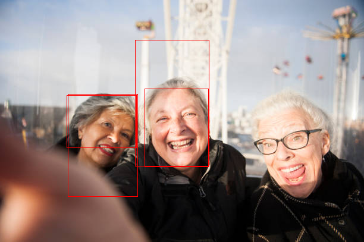

调整区域后


调整区域前


调整区域后

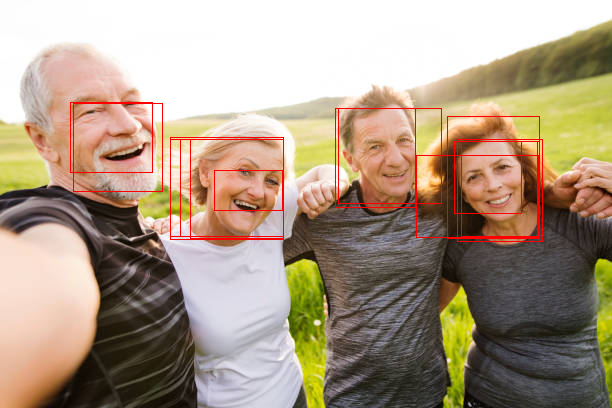

精度和 RCNN 差不多，甚至有些降低了 (为了支持 4G 显存缩放图片了)。不过识别速度有很大的提升，在同一个环境下，Fast-RCNN 处理单张图片只需要 0.4~0.5 秒，而 RCNN 则需要 2 秒左右。

## 写在最后

这篇介绍的 RCNN 与 Fast-RCNN 只是用于入门对象识别的，实用价值并不大 (速度慢，识别精度低)。下一篇介绍的 Faster-RCNN 则是可以用于生产的模型，但复杂程度也会高一个等级🤒。

此外，这篇文章和下一篇文章的代码实现和论文中的实现、网上的其他实现不完全一样，这是因为我的机器显存较低，并且我想用尽量少的代码来实现相同的原理，使得代码更容易理解 (网上很多实现都是分一堆文件，甚至把部分逻辑使用 c/c++ 扩展实现，性能上有好处但是初学者看了会头大)。

对了，如果有什么问题或者想讨论机器学习可以加下面的微信群🤗，7 天内有效。