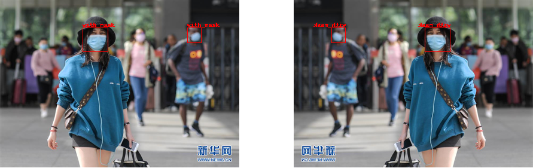
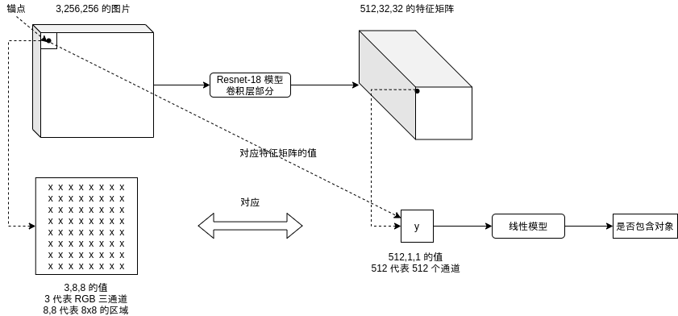
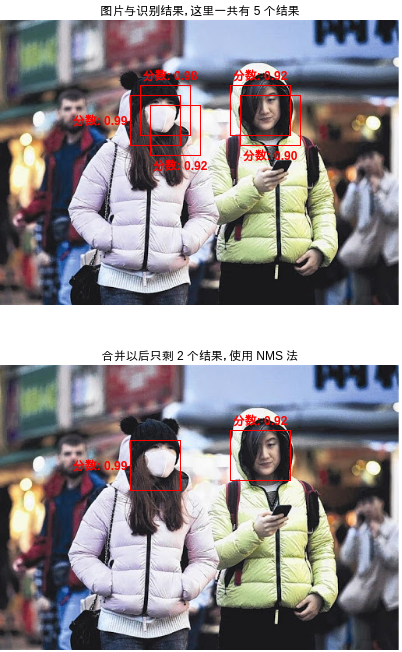

# 写给程序员的机器学习入门 (十 补充) - 对象识别 Faster-RCNN - 改进识别人脸位置与是否戴口罩的模型

在[前一篇文章](https://www.cnblogs.com/zkweb/p/14078501.html)中我介绍了如何使用 Faster-RCNN 模型实现识别人脸位置与是否戴口罩，这一篇我将介绍如何改进模型的精度，并且介绍如何支持视频识别。过去的文章我基本上都只介绍模型的实现原理与使用例子，没有过度追求精确率，这是为了让读者抛开细节理解，但实际应用机器学习的时候我们还是需要对模型作出各种修改以达到更好的结果。本篇文章就是改进对象识别模型的例子，这个例子使用的方法不一定适用于其他场景，但应该可以给你带来一些启发🤗。

首先展示下改进前后的效果：

改进前 (视频 1)


改进后 (视频 1)


改进前 (视频 2)


改进后 (视频 2)


接下来我将会介绍改进了哪些地方，并且最后会给出改进后的完整代码。

## 改进内容

### 扩充数据集

决定机器学习训练效果最关键的因素是什么，是模型吗🥺？并不是，比模型更关键的是数据集的质量😠，即使模型再强大没有足够的数据一样训练不出什么成果。我们来看看前一篇使用的数据集：

https://www.kaggle.com/andrewmvd/face-mask-detection

这个数据集包含了 853 张图片 (部分图片没有使用)，其中各个分类的数量如下：

- 戴口罩的区域 (with_mask): 3232 个
- 不戴口罩的区域 (without_mask): 717 个
- 带了口罩但姿势不正确的区域 (mask_weared_incorrect): 123 个

是不是感觉比较少？如果需要自己采集数据，那么就得加班加点多采集一些😕。而这次用的是现成的数据集，那么我们可以去找一找有没有其他数据集可以一起用，还记得[介绍 Fast-RCNN 的文章](https://www.cnblogs.com/zkweb/p/14048685.html)吗？这篇文章用的数据集只包含了人脸区域，没有包含是否戴口罩的标记，但仔细看数据内容会发现图片里面的人脸都没有戴口罩，那么我们可以把这些数据全部当成不戴口罩的区域，一共有 24533 个：

https://www.kaggle.com/vin1234/count-the-number-of-faces-present-in-an-image

加在一起以后：

- 戴口罩的区域 (with_mask): 3232 个
- 不戴口罩的区域 (without_mask): 717+24533 = 25250 个
- 带了口罩但姿势不正确的区域 (mask_weared_incorrect): 123 个

再仔细看一下，带了口罩但姿势不正确的区域的数量明显太少了，不足以做出正确的判断，我们可以把这些区域全部归到戴口罩的区域里面，也就是只判断你戴口罩，你戴的姿势对不对老子管不着🤬。加在一起以后：

- 戴口罩的区域 (with_mask): 3232+123=3355 个
- 不戴口罩的区域 (without_mask): 717+24533 = 25250 个

好了，再想想有没有办法可以增加数据量？其实有一个非常简单的方法，把图片左右翻转就可以让数据量变成两倍：



除了左右翻转以外我们还可以使用旋转图片，扩大缩小图片，添加噪点等方式增加数据量。左右翻转以后的最终数据量如下，总数据量大概是原来的 14 倍😱：

- 戴口罩的区域 (with_mask): (3232+123)*2=6710 个
- 不戴口罩的区域 (without_mask): (717+24533)*2 = 50500 个

读取两个数据集的代码如下（最后会给出完整代码）：

``` python
# 加载图片和图片对应的区域与分类列表
# { (路径, 是否左右翻转): [ 区域与分类, 区域与分类, .. ] }
# 同一张图片左右翻转可以生成一个新的数据，让数据量翻倍
box_map = defaultdict(lambda: [])
for filename in os.listdir(DATASET_1_IMAGE_DIR):
    # 从第一个数据集加载
    xml_path = os.path.join(DATASET_1_ANNOTATION_DIR, filename.split(".")[0] + ".xml")
    if not os.path.isfile(xml_path):
        continue
    tree = ET.ElementTree(file=xml_path)
    objects = tree.findall("object")
    path = os.path.join(DATASET_1_IMAGE_DIR, filename)
    for obj in objects:
        class_name = obj.find("name").text
        x1 = int(obj.find("bndbox/xmin").text)
        x2 = int(obj.find("bndbox/xmax").text)
        y1 = int(obj.find("bndbox/ymin").text)
        y2 = int(obj.find("bndbox/ymax").text)
        if class_name == "mask_weared_incorrect":
            # 佩戴口罩不正确的样本数量太少 (只有 123)，模型无法学习，这里全合并到戴口罩的样本
            class_name = "with_mask"
        box_map[(path, False)].append((x1, y1, x2-x1, y2-y1, CLASSES_MAPPING[class_name]))
        box_map[(path, True)].append((x1, y1, x2-x1, y2-y1, CLASSES_MAPPING[class_name]))
df = pandas.read_csv(DATASET_2_BOX_CSV_PATH)
for row in df.values:
    # 从第二个数据集加载，这个数据集只包含没有戴口罩的图片
    filename, width, height, x1, y1, x2, y2 = row[:7]
    path = os.path.join(DATASET_2_IMAGE_DIR, filename)
    box_map[(path, False)].append((x1, y1, x2-x1, y2-y1, CLASSES_MAPPING["without_mask"]))
    box_map[(path, True)].append((x1, y1, x2-x1, y2-y1, CLASSES_MAPPING["without_mask"]))
# 打乱数据集 (因为第二个数据集只有不戴口罩的图片)
box_list = list(box_map.items())
random.shuffle(box_list)
print(f"found {len(box_list)} images")
```

翻转图片的代码如下，同时会翻转区域的 x 坐标 (图片宽度 - 原 x 坐标 - 区域宽度)：

``` python
for (image_path, flip), original_boxes_labels in box_list:
    with Image.open(image_path) as img_original: # 加载原始图片
        sw, sh = img_original.size # 原始图片大小
        if flip:
            img = resize_image(img_original.transpose(Image.FLIP_LEFT_RIGHT)) # 翻转然后缩放图片
        else:
            img = resize_image(img_original) # 缩放图片
        image_index = len(image_tensors) # 图片在批次中的索引值
        image_tensors.append(image_to_tensor(img)) # 添加图片到列表
        true_boxes_labels = [] # 图片对应的真实区域与分类列表
    # 添加真实区域与分类列表
    for box_label in original_boxes_labels:
        x, y, w, h, label = box_label
        if flip: # 翻转坐标
            x = sw - x - w
```

数据量变多以后会需要更多的训练时间，前一篇文章在 GTX1650 显卡上训练大概需要 3 小时，而这一篇则需要 15 小时左右🐍。

### 调整生成锚点的参数

我们可以让模型更贴合数据以改进训练效果。在前一篇文章我介绍了 Faster-RCNN 的区域生成网络会根据锚点 (Anchor) 判断图片中的各个部分是否包含对象：



因为 CNN 模型输出矩阵的大小是 `通道数量,图片长度/8,图片宽度/8`，也就是每个锚点对应 8x8 像素的区域，区域生成网络需要根据 8x8 像素的区域判断这个区域是否有可能包含对象。这篇使用的代码在处理图片之前会先把图片缩放到 256x192，8x8 的区域相对起来似乎过小了，我们可以把锚点区域扩大到 16x16，使得区域生成网络判断起来有更充分的依据。扩大锚点区域同时需要修改 CNN 模型，使得输出矩阵大小为 `通道数量,图片长度/16,图片宽度/16`，这个修改将会在后面介绍。

需要注意的是扩大锚点区域以后会减弱检测小对象的能力，但这篇的图片中的人脸区域基本上都在 16x16 以上，所以不会受到影响。

此外，前一篇还介绍了每个锚点都会对应多个形状：


通过观察数据我们可以发现人脸的长宽比例接近 1:1，并且我们不需要检测人脸以外的东西，所以我们可以删掉长宽比例 1:2 与 2:1 的形状，减少模型的计算量。

总结起来我们可以这样修改生成锚点的参数：

修改前

``` python
AnchorSpan = 8 # 锚点之间的距离，应该等于原有长宽 / resnet 输出长宽
AnchorScales = (0.5, 1, 2, 3, 4, 5, 6) # 锚点对应区域的缩放比例列表
AnchorAspects = ((1, 2), (1, 1), (2, 1)) # 锚点对应区域的长宽比例列表
```

修改后

``` python
AnchorSpan = 16 # 锚点之间的距离，应该等于原有长宽 / resnet 输出长宽
AnchorScales = (1, 2, 4, 6, 8) # 锚点对应区域的缩放比例列表
AnchorAspects = ((1, 1),) # 锚点对应区域的长宽比例列表
```

在这里我们学到了应该根据数据和检测场景来决定锚点区域大小和长宽比例，如果需要检测的物体相对图片都比较大，那么就可以相应的增加锚点区域大小；如果需要检测的物体形状比较固定，那么就可以相应调整长宽比例，例如检测车辆可以用 1:2，检测行人可以用 3:1，检测车牌可以用 1:3 等等。

### 修改模型

因为上面修改了锚点之间的距离从 8x8 到 16x16，我们需要把 CNN 模型输出的矩阵大小从 `通道数量,图片长度/8,图片宽度/8` 修改到 `通道数量,图片长度/16,图片宽度/16`，这个修改非常的简单，再加一层卷积层即可。因为这篇使用的是 Resnet 模型，这里会在后面多加一个块，代码如下：

修改前

``` python
self.rpn_resnet = nn.Sequential(
    nn.Conv2d(3, self.previous_channels_out, kernel_size=3, stride=1, padding=1, bias=False),
    nn.BatchNorm2d(self.previous_channels_out),
    nn.ReLU(inplace=True),
    self._make_layer(BasicBlock, channels_out=16, num_blocks=2, stride=1),
    self._make_layer(BasicBlock, channels_out=32, num_blocks=2, stride=2),
    self._make_layer(BasicBlock, channels_out=64, num_blocks=2, stride=2),
    self._make_layer(BasicBlock, channels_out=128, num_blocks=2, stride=2))
```

修改后

``` python
self.rpn_resnet = nn.Sequential(
    nn.Conv2d(3, self.previous_channels_out, kernel_size=3, stride=1, padding=1, bias=False),
    nn.BatchNorm2d(self.previous_channels_out),
    nn.ReLU(inplace=True),
    self._make_layer(BasicBlock, channels_out=8, num_blocks=2, stride=1),
    self._make_layer(BasicBlock, channels_out=16, num_blocks=2, stride=2),
    self._make_layer(BasicBlock, channels_out=32, num_blocks=2, stride=2),
    self._make_layer(BasicBlock, channels_out=64, num_blocks=2, stride=2),
    self._make_layer(BasicBlock, channels_out=128, num_blocks=2, stride=2))
```

`self.cls_resnet` 也需要做出同样的修改。

此外为了适应更多的数据量，这里还增加了根据区域截取特征后缩放到的大小：

``` python
# 根据区域截取特征后缩放到的大小
self.pooling_size = 16
```

这样判断分类的时候会使用 `通道数量x16x16`，即 `128x16x16` 的数据。需要注意的是这么做不一定有好处，判断分类使用的数据越大就越有可能发生过拟合现象 (训练集正确率很高但验证集正确率却不行，不能用于识别未知数据)，实际需要根据训练结果做出调整。

### 输出分数

我们知道区域生成网络会针对各个锚点的各个形状输出是否可能包含对象，输出值越接近 1 那么就越可能包含对象，越接近 0 那么就越不可能包含对象，我们可以把这个输出值当作分数，分数越高代表区域越有可能包含对象。接下来标签分类网络会针对区域生成网络给出的区域进行识别，每个区域的每个分类都会输出一个值，经过 softmax 计算以后得出各个分类的概率 (加起来会等于 1)，这个概率也可以拿来作为分数使用。

最终我们可以给 Faster-RCNN 输出的各个包含对象的区域赋予一个分数：

分数 = 区域生成网络输出值 * 最大值(softmax(标签分类网络各个分类输出值))

分数将会介于 0 ~ 1 之间。

原则上分数越高代表模型对这个区域越有把握，我们可以根据这个分数可以用来调整阈值，也可以根据这个分数来更高合并预测结果区域的算法。但实际上你可能会看到分数为 1 但结果是错误的区域，所以只能说原则上。

返回分数的代码请参考后面完整代码的 `MyModel.forward` 函数中关于 `rpn_score` 与 `cls_score` 的部分。

### 更改合并预测结果区域的算法

还记得[介绍 Fast-RCNN 的文章](https://www.cnblogs.com/zkweb/p/14048685.html)里面，我提到了合并结果区域的几个方法：

- 使用最左，最右，最上，或者最下的区域
- 使用第一个区域 (区域选取算法会按出现对象的可能性排序)
- 结合所有重合的区域 (如果区域调整效果不行，则可能出现结果区域比真实区域大很多的问题)

前一篇文章的 Faster-RCNN 模型使用了第三个方法，但上面我们输出分数以后可以选择第二个方法，即先按分数对区域进行排序，然后选择重合的区域中分数最高的区域作为结果，并去除其他重合的区域。这个方法也称作 NMS (Non Max Suppression) 法：



使用这种方法的好处是输出的区域将会更小，看起来更精确，但如果场景是检测障碍物那么最好还是使用第三种方法🤕。

合并预测结果区域的代码如下，这里我把函数写到 `MyModel` 类里面了：

``` python
# 判断是否应该合并重叠区域的重叠率阈值
IOU_MERGE_THRESHOLD = 0.30
# 是否使用 NMS 算法合并区域
USE_NMS_ALGORITHM = True

@staticmethod
def merge_predicted_result(cls_result):
    """合并预测结果区域"""
    # 记录重叠的结果区域, 结果是 [ [(标签, 区域, RPN 分数, 标签识别分数)], ... ]
    final_result = []
    for label, box, rpn_score, cls_score in cls_result:
        for index in range(len(final_result)):
            exists_results = final_result[index]
            if any(calc_iou(box, r[1]) > IOU_MERGE_THRESHOLD for r in exists_results):
                exists_results.append((label, box, rpn_score, cls_score))
                break
        else:
            final_result.append([(label, box, rpn_score, cls_score)])
    # 合并重叠的结果区域
    # 使用 NMS 算法: RPN 分数 * 标签识别分数 最高的区域为结果区域
    # 不使用 NMS 算法: 使用所有区域的合并，并且选取数量最多的标签 (投票式)
    for index in range(len(final_result)):
        exists_results = final_result[index]
        if USE_NMS_ALGORITHM:
            exists_results.sort(key=lambda r: r[2]*r[3])
            final_result[index] = exists_results[-1]
        else:
            cls_groups = defaultdict(lambda: [])
            for r in exists_results:
                cls_groups[r[0]].append(r)
            most_common = sorted(cls_groups.values(), key=len)[-1]
            label = most_common[0][0]
            box_merged = most_common[0][1]
            for _, box, _, _ in most_common[1:]:
                box_merged = merge_box(box_merged, box)
            rpn_score_mean = sum(x for _, _, x, _ in most_common) / len(most_common)
            cls_score_mean = sum(x for _, _, _, x in most_common) / len(most_common)
            final_result[index] = (label, box_merged, rpn_score_mean, cls_score_mean)
    return final_result
```

### 只根据标签分类正确率判断是否停止训练

最后我们修改以下判断是否停止训练的逻辑，之前的判断依据是 `验证集的区域生成正确率或标签分类正确率在 20 次训练以后没有更新` 则停止训练，但计算标签分类正确率的时候用的是 `预测结果中区域范围与实际范围重叠率超过阈值并且分类一致的结果数量 / 实际范围的总数量`，也就是标签分类正确率代表了模型可以找出百分之多少的区域并且正确判断它们的分类，因为标签分类正确率会基于区域生成正确率，所以我们可以只使用标签分类正确率判断是否停止训练。修改以后的判断依据为 `验证集的标签分类正确率在 20 次训练以后没有更新` 则停止训练。

``` python
# 记录最高的验证集正确率与当时的模型状态，判断是否在 20 次训练后仍然没有刷新记录
# 只依据标签分类正确率判断，因为标签分类正确率同时基于 RPN 正确率
if validating_cls_accuracy > validating_cls_accuracy_highest:
    validating_rpn_accuracy_highest = validating_rpn_accuracy
    validating_rpn_accuracy_highest_epoch = epoch
    validating_cls_accuracy_highest = validating_cls_accuracy
    validating_cls_accuracy_highest_epoch = epoch
    save_tensor(model.state_dict(), "model.pt")
    print("highest cls validating accuracy updated")
elif (epoch - validating_rpn_accuracy_highest_epoch > 20 and
    epoch - validating_cls_accuracy_highest_epoch > 20):
    # 在 20 次训练后仍然没有刷新记录，结束训练
    print("stop training because highest validating accuracy not updated in 20 epoches")
    break
```

需要注意的是我给出的计算正确率的方法是比较简单的，更准确的方法是计算 mAP (mean Average Precision)，具体可以参考[这篇文章](https://jonathan-hui.medium.com/map-mean-average-precision-for-object-detection-45c121a31173)，我给出的方法实际只相当于文章中的 `Recall`。

### 支持视频识别

上一篇文章给出的代码只能识别单张图片，而对象识别的应用场景通常要求识别视频，所以这里我再给出支持视频识别的代码。读取视频文件 (或者摄像头) 使用的类库是 opencv，针对上一篇文章的识别代码如下 (这一篇文章的识别代码请参考后面给出的完整代码)：

``` python
def eval_video():
    """使用训练好的模型识别视频"""
    # 创建模型实例，加载训练好的状态，然后切换到验证模式
    model = MyModel().to(device)
    model.load_state_dict(load_tensor("model.pt"))
    model.eval()

    # 询问视频路径，给可能是人脸的区域添加标记并保存新视频
    import cv2
    from PIL import ImageFont
    font = ImageFont.truetype("FreeMonoBold.ttf", 20)
    while True:
        try:
            video_path = input("Video path: ")
            if not video_path:
                continue
            # 读取输入视频
            video = cv2.VideoCapture(video_path)
            # 获取每秒的帧数
            fps = int(video.get(cv2.CAP_PROP_FPS))
            # 获取视频长宽
            size = (int(video.get(cv2.CAP_PROP_FRAME_WIDTH)), int(video.get(cv2.CAP_PROP_FRAME_HEIGHT)))
            # 创建输出视频
            video_output_path = os.path.join(
                os.path.dirname(video_path),
                os.path.splitext(os.path.basename(video_path))[0] + ".output.avi")
            result = cv2.VideoWriter(video_output_path, cv2.VideoWriter_fourcc(*"XVID"), fps, size)
            # 逐帧处理
            count = 0
            while(True):
                ret, frame = video.read()
                if not ret:
                    break
                # opencv 使用的是 BGR, Pillow 使用的是 RGB, 需要转换通道顺序
                frame_rgb = cv2.cvtColor(frame, cv2.COLOR_BGR2RGB)
                # 构建输入
                img_original = Image.fromarray(frame_rgb) # 加载原始图片
                sw, sh = img_original.size # 原始图片大小
                img = resize_image(img_original) # 缩放图片
                img_output = img_original.copy() # 复制图片，用于后面添加标记
                tensor_in = image_to_tensor(img)
                # 预测输出
                cls_result = model(tensor_in.unsqueeze(0).to(device))[-1][0] or []
                # 合并重叠的结果区域, 结果是 [ [标签列表, 合并后的区域], ... ]
                final_result = []
                for label, box in cls_result:
                    for index in range(len(final_result)):
                        exists_labels, exists_box = final_result[index]
                        if calc_iou(box, exists_box) > IOU_MERGE_THRESHOLD:
                            exists_labels.append(label)
                            final_result[index] = (exists_labels, merge_box(box, exists_box))
                            break
                    else:
                        final_result.append(([label], box))
                # 合并标签 (重叠区域的标签中数量最多的分类为最终分类)
                for index in range(len(final_result)):
                    labels, box = final_result[index]
                    final_label = Counter(labels).most_common(1)[0][0]
                    final_result[index] = (final_label, box)
                # 标记在图片上
                draw = ImageDraw.Draw(img_output)
                for label, box  in final_result:
                    x, y, w, h = map_box_to_original_image(box, sw, sh)
                    color = "#00FF00" if CLASSES[label] == "with_mask" else "#FF0000"
                    draw.rectangle((x, y, x+w, y+h), outline=color, width=3)
                    draw.text((x, y-20), CLASSES[label], fill=color, font=font)
                # 写入帧到输出视频
                frame_rgb_annotated = numpy.asarray(img_output)
                frame_bgr_annotated = cv2.cvtColor(frame_rgb_annotated, cv2.COLOR_RGB2BGR)
                result.write(frame_bgr_annotated)
                count += 1
                if count % fps == 0:
                    print(f"handled {count//fps}s")
            video.release()
            result.release()
            cv2.destroyAllWindows()
            print(f"saved to {video_output_path}")
            print()
        except Exception as e:
            raise
            print("error:", e)
```

有几点需要注意的是：

- 这个例子是读取现有的视频文件，如果你想从摄像头读取可以把 `video = cv2.VideoCapture(video_path)` 改为 ` video = cv2.VideoCapture(0)`，0 代表第一个摄像头，1 代表第二个摄像头，以此类推
- opencv 读取出来的通道顺序是 BGR (Blue, Green, Red)，而 Pillow 使用的通道顺序是 RGB (Red, Blue, Green)，所以需要使用 `cv2.cvtColor` 进行转换
- 输入视频会定义每秒的帧数 (FPS)，创建输出视频的时候需要保证 FPS 一致，否则会出现播放速度不一样的问题
- 这里为了方便看，戴口罩的区域会使用绿色标记，而不带口罩的区域会使用红色标记
- Pillow 默认标记文本使用的字体是固定大小的，不支持缩放，这里我使用了 `FreeMonoBold.ttf` 字体并指定字体大小为 20，如果你的环境没有这个字体应该换一个名称 (Windows 的话可以用 `arial.ttf`)

### 减少视频识别中的误判

视频识别有一个特性是内容通常是有连续性的，视频中的物体通常会出现在连续的几帧里面，利用这个特性我们可以减少视频识别中的误判。我们首先定义一个帧数，例如 10 帧，如果物体出现在过去 10 帧的 5 帧以上那么就判断物体存在，这样做可以排除模型针对某一帧忽然出现的误判。我们还可以统计过去 10 帧里面识别出来的分类，然后选择出现数量最多的分类，投票决定结果。

具体实现代码如下：

``` python
@staticmethod
def fix_predicted_result_from_history(cls_result, history_results):
    """根据历史结果减少预测结果中的误判，适用于视频识别，history_results 应为指定了 maxlen 的 deque"""
    # 要求历史结果中 50% 以上存在类似区域，并且选取历史结果中最多的分类
    history_results.append(cls_result)
    final_result = []
    if len(history_results) < history_results.maxlen:
        # 历史结果不足，不返回任何识别结果
        return final_result
    for label, box, rpn_score, cls_score in cls_result:
        # 查找历史中的近似区域
        similar_results = []
        for history_result in history_results:
            history_result = [(calc_iou(r[1], box), r) for r in history_result]
            history_result.sort(key = lambda r: r[0])
            if history_result and history_result[-1][0] > IOU_MERGE_THRESHOLD:
                similar_results.append(history_result[-1][1])
        # 判断近似区域数量是否过半
        if len(similar_results) < history_results.maxlen // 2:
            continue
        # 选取历史结果中最多的分类
        cls_groups = defaultdict(lambda: [])
        for r in similar_results:
            cls_groups[r[0]].append(r)
        most_common = sorted(cls_groups.values(), key=len)[-1]
        # 添加最多的分类中的最新的结果
        final_result.append(most_common[-1])
    return final_result
```

`history_results` 是一个指定了最大数量的队列类型，可以用以下代码生成：

``` python
from collections import deque

history_results = deque(maxlen = 10)
```

每次添加元素到 `history_results` 以后如果数量超出指定的最大数量则它会自动弹出最早添加的元素。

这个做法提高了视频识别的稳定性，但同时会损失一定的实时性并且带来一些副作用。例如 FPS 为 30 的时候，人需要在同一个位置停留 1/3 秒以后才会被识别出来，如果人一直快速走动那么就不会被识别出来。此外如果戴口罩的人把口罩脱掉，那么脱掉以后的 1/6 秒模型仍然会识别这个人戴着口罩。是使用这个做法需要根据使用场景决定。

## 完整代码

好了，改进以后的完整代码如下😤：

``` python
import os
import sys
import torch
import gzip
import itertools
import random
import numpy
import math
import pandas
import json
from PIL import Image
from PIL import ImageDraw
from PIL import ImageFont
from torch import nn
from matplotlib import pyplot
from collections import defaultdict
from collections import deque
import xml.etree.cElementTree as ET

# 缩放图片的大小
IMAGE_SIZE = (256, 192)
# 训练使用的数据集路径
DATASET_1_IMAGE_DIR = "./archive/images"
DATASET_1_ANNOTATION_DIR = "./archive/annotations"
DATASET_2_IMAGE_DIR = "./784145_1347673_bundle_archive/train/image_data"
DATASET_2_BOX_CSV_PATH = "./784145_1347673_bundle_archive/train/bbox_train.csv"
# 分类列表
CLASSES = [ "other", "with_mask", "without_mask" ]
CLASSES_MAPPING = { c: index for index, c in enumerate(CLASSES) }
# 判断是否存在对象使用的区域重叠率的阈值
IOU_POSITIVE_THRESHOLD = 0.30
IOU_NEGATIVE_THRESHOLD = 0.10
# 判断是否应该合并重叠区域的重叠率阈值
IOU_MERGE_THRESHOLD = 0.30
# 是否使用 NMS 算法合并区域
USE_NMS_ALGORITHM = True

# 用于启用 GPU 支持
device = torch.device("cuda" if torch.cuda.is_available() else "cpu")

class BasicBlock(nn.Module):
    """ResNet 使用的基础块"""
    expansion = 1 # 定义这个块的实际出通道是 channels_out 的几倍，这里的实现固定是一倍
    def __init__(self, channels_in, channels_out, stride):
        super().__init__()
        # 生成 3x3 的卷积层
        # 处理间隔 stride = 1 时，输出的长宽会等于输入的长宽，例如 (32-3+2)//1+1 == 32
        # 处理间隔 stride = 2 时，输出的长宽会等于输入的长宽的一半，例如 (32-3+2)//2+1 == 16
        # 此外 resnet 的 3x3 卷积层不使用偏移值 bias
        self.conv1 = nn.Sequential(
            nn.Conv2d(channels_in, channels_out, kernel_size=3, stride=stride, padding=1, bias=False),
            nn.BatchNorm2d(channels_out))
        # 再定义一个让输出和输入维度相同的 3x3 卷积层
        self.conv2 = nn.Sequential(
            nn.Conv2d(channels_out, channels_out, kernel_size=3, stride=1, padding=1, bias=False),
            nn.BatchNorm2d(channels_out))
        # 让原始输入和输出相加的时候，需要维度一致，如果维度不一致则需要整合
        self.identity = nn.Sequential()
        if stride != 1 or channels_in != channels_out * self.expansion:
            self.identity = nn.Sequential(
                nn.Conv2d(channels_in, channels_out * self.expansion, kernel_size=1, stride=stride, bias=False),
                nn.BatchNorm2d(channels_out * self.expansion))

    def forward(self, x):
        # x => conv1 => relu => conv2 => + => relu
        # |                              ^
        # |==============================|
        tmp = self.conv1(x)
        tmp = nn.functional.relu(tmp, inplace=True)
        tmp = self.conv2(tmp)
        tmp += self.identity(x)
        y = nn.functional.relu(tmp, inplace=True)
        return y

class MyModel(nn.Module):
    """Faster-RCNN (基于 ResNet 的变种)"""
    Anchors = None # 锚点列表，包含 锚点数量 * 形状数量 的范围
    AnchorSpan = 16 # 锚点之间的距离，应该等于原有长宽 / resnet 输出长宽
    AnchorScales = (1, 2, 4, 6, 8) # 锚点对应区域的缩放比例列表
    AnchorAspects = ((1, 1),) # 锚点对应区域的长宽比例列表
    AnchorBoxes = len(AnchorScales) * len(AnchorAspects) # 每个锚点对应的形状数量

    def __init__(self):
        super().__init__()
        # 抽取图片各个区域特征的 ResNet (除去 AvgPool 和全连接层)
        # 和 Fast-RCNN 例子不同的是输出的长宽会是原有的 1/16，后面会根据锚点与 affine_grid 截取区域
        # 此外，为了可以让模型跑在 4GB 显存上，这里减少了模型的通道数量
        # 注意:
        # RPN 使用的模型和标签分类使用的模型需要分开，否则会出现无法学习 (RPN 总是输出负) 的问题
        self.previous_channels_out = 4
        self.rpn_resnet = nn.Sequential(
            nn.Conv2d(3, self.previous_channels_out, kernel_size=3, stride=1, padding=1, bias=False),
            nn.BatchNorm2d(self.previous_channels_out),
            nn.ReLU(inplace=True),
            self._make_layer(BasicBlock, channels_out=8, num_blocks=2, stride=1),
            self._make_layer(BasicBlock, channels_out=16, num_blocks=2, stride=2),
            self._make_layer(BasicBlock, channels_out=32, num_blocks=2, stride=2),
            self._make_layer(BasicBlock, channels_out=64, num_blocks=2, stride=2),
            self._make_layer(BasicBlock, channels_out=128, num_blocks=2, stride=2))
        self.previous_channels_out = 4
        self.cls_resnet = nn.Sequential(
            nn.Conv2d(3, self.previous_channels_out, kernel_size=3, stride=1, padding=1, bias=False),
            nn.BatchNorm2d(self.previous_channels_out),
            nn.ReLU(inplace=True),
            self._make_layer(BasicBlock, channels_out=8, num_blocks=2, stride=1),
            self._make_layer(BasicBlock, channels_out=16, num_blocks=2, stride=2),
            self._make_layer(BasicBlock, channels_out=32, num_blocks=2, stride=2),
            self._make_layer(BasicBlock, channels_out=64, num_blocks=2, stride=2),
            self._make_layer(BasicBlock, channels_out=128, num_blocks=2, stride=2))
        self.features_channels = 128
        # 根据区域特征生成各个锚点对应的对象可能性的模型
        self.rpn_labels_model = nn.Sequential(
            nn.Linear(self.features_channels, self.features_channels),
            nn.ReLU(inplace=True),
            nn.Dropout(0.1),
            nn.Linear(self.features_channels, MyModel.AnchorBoxes*2))
        # 根据区域特征生成各个锚点对应的区域偏移的模型
        self.rpn_offsets_model = nn.Sequential(
            nn.Linear(self.features_channels, self.features_channels),
            nn.ReLU(inplace=True),
            nn.Dropout(0.1),
            nn.Linear(self.features_channels, MyModel.AnchorBoxes*4))
        # 选取可能出现对象的区域需要的最小可能性
        self.rpn_score_threshold = 0.9
        # 每张图片最多选取的区域列表
        self.rpn_max_candidates = 32
        # 根据区域截取特征后缩放到的大小
        self.pooling_size = 16
        # 根据区域特征判断分类的模型
        self.cls_labels_model = nn.Sequential(
            nn.Linear(self.features_channels * (self.pooling_size ** 2), self.features_channels),
            nn.ReLU(inplace=True),
            nn.Dropout(0.1),
            nn.Linear(self.features_channels, len(CLASSES)))
        # 根据区域特征再次生成区域偏移的模型，注意区域偏移会针对各个分类分别生成
        self.cls_offsets_model = nn.Sequential(
            nn.Linear(self.features_channels * (self.pooling_size ** 2), self.features_channels*4),
            nn.ReLU(inplace=True),
            nn.Dropout(0.1),
            nn.Linear(self.features_channels*4, len(CLASSES)*4))

    def _make_layer(self, block_type, channels_out, num_blocks, stride):
        """创建 resnet 使用的层"""
        blocks = []
        # 添加第一个块
        blocks.append(block_type(self.previous_channels_out, channels_out, stride))
        self.previous_channels_out = channels_out * block_type.expansion
        # 添加剩余的块，剩余的块固定处理间隔为 1，不会改变长宽
        for _ in range(num_blocks-1):
            blocks.append(block_type(self.previous_channels_out, self.previous_channels_out, 1))
            self.previous_channels_out *= block_type.expansion
        return nn.Sequential(*blocks)

    @staticmethod
    def _generate_anchors():
        """根据锚点和形状生成锚点范围列表"""
        w, h = IMAGE_SIZE
        span = MyModel.AnchorSpan
        anchors = []
        for x in range(0, w, span):
            for y in range(0, h, span):
                xcenter, ycenter = x + span / 2, y + span / 2
                for scale in MyModel.AnchorScales:
                    for ratio in MyModel.AnchorAspects:
                        ww = span * scale * ratio[0]
                        hh = span * scale * ratio[1]
                        xx = xcenter - ww / 2
                        yy = ycenter - hh / 2
                        xx = max(int(xx), 0)
                        yy = max(int(yy), 0)
                        ww = min(int(ww), w - xx)
                        hh = min(int(hh), h - yy)
                        anchors.append((xx, yy, ww, hh))
        return anchors

    @staticmethod
    def _roi_crop(features, rois, pooling_size):
        """根据区域截取特征，每次只能处理单张图片"""
        width, height = IMAGE_SIZE
        theta = []
        results = []
        for roi in rois:
            x1, y1, w, h = roi
            x2, y2 = x1 + w, y1 + h
            theta = [[
                [
                    (y2 - y1) / height,
                    0,
                    (y2 + y1) / height - 1
                ],
                [
                    0,
                    (x2 - x1) / width,
                    (x2 + x1) / width - 1
                ]
            ]]
            theta_tensor = torch.tensor(theta)
            grid = nn.functional.affine_grid(
                theta_tensor,
                torch.Size((1, 1, pooling_size, pooling_size)),
                align_corners=False).to(device)
            result = nn.functional.grid_sample(
                features.unsqueeze(0), grid, align_corners=False)
            results.append(result)
        if not results:
            return None
        results = torch.cat(results, dim=0)
        return results

    def forward(self, x):
        # ***** 抽取特征部分 *****
        # 分别抽取 RPN 和标签分类使用的特征
        # 维度是 B,128,W/16,H/16
        rpn_features_original = self.rpn_resnet(x)
        # 维度是 B*W/16*H/16,128 (把通道放在最后，用于传给线性模型)
        rpn_features = rpn_features_original.permute(0, 2, 3, 1).reshape(-1, self.features_channels)
        # 维度是 B,128,W/16,H/16
        cls_features = self.cls_resnet(x)

        # ***** 选取区域部分 *****
        # 根据区域特征生成各个锚点对应的对象可能性
        # 维度是 B,W/16*H/16*AnchorBoxes,2
        rpn_labels = self.rpn_labels_model(rpn_features)
        rpn_labels = rpn_labels.reshape(
            rpn_features_original.shape[0],
            rpn_features_original.shape[2] * rpn_features_original.shape[3] * MyModel.AnchorBoxes,
            2)
        # 根据区域特征生成各个锚点对应的区域偏移
        # 维度是 B,W/16*H/16*AnchorBoxes,4
        rpn_offsets = self.rpn_offsets_model(rpn_features)
        rpn_offsets = rpn_offsets.reshape(
            rpn_features_original.shape[0],
            rpn_features_original.shape[2] * rpn_features_original.shape[3] * MyModel.AnchorBoxes,
            4)
        # 选取可能出现对象的区域，并调整区域范围
        with torch.no_grad():
            rpn_scores = nn.functional.softmax(rpn_labels, dim=2)[:,:,1]
            # 选取可能性最高的部分区域
            rpn_top_scores = torch.topk(rpn_scores, k=self.rpn_max_candidates, dim=1)
            rpn_candidates_batch = []
            for x in range(0, rpn_scores.shape[0]):
                rpn_candidates = []
                for score, index in zip(rpn_top_scores.values[x], rpn_top_scores.indices[x]):
                    # 过滤可能性低于指定阈值的区域
                    if score.item() < self.rpn_score_threshold:
                        continue
                    anchor_box = MyModel.Anchors[index.item()]
                    offset = rpn_offsets[x,index.item()].tolist()
                    # 调整区域范围
                    candidate_box = adjust_box_by_offset(anchor_box, offset)
                    rpn_candidates.append((candidate_box, score.item()))
                rpn_candidates_batch.append(rpn_candidates)

        # ***** 判断分类部分 *****
        cls_output = []
        cls_result = []
        for index in range(0, cls_features.shape[0]):
            rois = [c[0] for c in rpn_candidates_batch[index]]
            pooled = MyModel._roi_crop(cls_features[index], rois, self.pooling_size)
            if pooled is None:
                # 没有找到可能包含对象的区域
                cls_output.append(None)
                cls_result.append(None)
                continue
            pooled = pooled.reshape(pooled.shape[0], -1)
            labels = self.cls_labels_model(pooled)
            offsets = self.cls_offsets_model(pooled)
            cls_output.append((labels, offsets))
            # 使用 softmax 判断可能性最大的分类
            labels_max = nn.functional.softmax(labels, dim=1).max(dim=1)
            classes = labels_max.indices
            classes_scores = labels_max.values
            # 根据分类对应的偏移再次调整区域范围
            offsets_map = offsets.reshape(offsets.shape[0] * len(CLASSES), 4)
            result = []
            for box_index in range(0, classes.shape[0]):
                predicted_label = classes[box_index].item()
                if predicted_label == 0:
                    continue # 0 代表 other, 表示非对象
                candidate_box = rpn_candidates_batch[index][box_index][0]
                offset = offsets_map[box_index * len(CLASSES) + predicted_label].tolist()
                predicted_box = adjust_box_by_offset(candidate_box, offset)
                # 添加分类与最终预测区域
                rpn_score = rpn_candidates_batch[index][box_index][1]
                cls_score = classes_scores[box_index].item()
                result.append((predicted_label, predicted_box, rpn_score, cls_score))
            cls_result.append(result)

        # 前面的项目用于学习，最后一项是最终输出结果
        return rpn_labels, rpn_offsets, rpn_candidates_batch, cls_output, cls_result

    @staticmethod
    def loss_function(predicted, actual):
        """Faster-RCNN 使用的多任务损失计算器"""
        rpn_labels, rpn_offsets, rpn_candidates_batch, cls_output, _ = predicted
        rpn_labels_losses = []
        rpn_offsets_losses = []
        cls_labels_losses = []
        cls_offsets_losses = []
        for batch_index in range(len(actual)):
            # 计算 RPN 的损失
            (true_boxes_labels,
                actual_rpn_labels, actual_rpn_labels_mask,
                actual_rpn_offsets, actual_rpn_offsets_mask) = actual[batch_index]
            if actual_rpn_labels_mask.shape[0] > 0:
                rpn_labels_losses.append(nn.functional.cross_entropy(
                    rpn_labels[batch_index][actual_rpn_labels_mask],
                    actual_rpn_labels.to(device)))
            if actual_rpn_offsets_mask.shape[0] > 0:
                rpn_offsets_losses.append(nn.functional.smooth_l1_loss(
                    rpn_offsets[batch_index][actual_rpn_offsets_mask],
                    actual_rpn_offsets.to(device)))
            # 计算标签分类的损失
            if cls_output[batch_index] is None:
                continue
            cls_labels_mask = []
            cls_offsets_mask = []
            cls_actual_labels = []
            cls_actual_offsets = []
            cls_predicted_labels, cls_predicted_offsets = cls_output[batch_index]
            cls_predicted_offsets_map = cls_predicted_offsets.reshape(-1, 4)
            rpn_candidates = rpn_candidates_batch[batch_index]
            for box_index, (candidate_box, _) in enumerate(rpn_candidates):
                iou_list = [ calc_iou(candidate_box, true_box) for (_, true_box) in true_boxes_labels ]
                positive_index = next((index for index, iou in enumerate(iou_list) if iou > IOU_POSITIVE_THRESHOLD), None)
                is_negative = all(iou < IOU_NEGATIVE_THRESHOLD for iou in iou_list)
                if positive_index is not None:
                    true_label, true_box = true_boxes_labels[positive_index]
                    cls_actual_labels.append(true_label)
                    cls_labels_mask.append(box_index)
                    # 如果区域正确，则学习真实分类对应的区域偏移
                    cls_actual_offsets.append(calc_box_offset(candidate_box, true_box))
                    cls_offsets_mask.append(box_index * len(CLASSES) + true_label)
                elif is_negative:
                    cls_actual_labels.append(0) # 0 代表 other, 表示非对象
                    cls_labels_mask.append(box_index)
                # 如果候选区域与真实区域的重叠率介于两个阈值之间，则不参与学习
            if cls_labels_mask:
                cls_labels_losses.append(nn.functional.cross_entropy(
                    cls_predicted_labels[cls_labels_mask],
                    torch.tensor(cls_actual_labels).to(device)))
            if cls_offsets_mask:
                cls_offsets_losses.append(nn.functional.smooth_l1_loss(
                    cls_predicted_offsets_map[cls_offsets_mask],
                    torch.tensor(cls_actual_offsets).to(device)))
        # 合并损失值
        # 注意 loss 不可以使用 += 合并
        loss = torch.tensor(.0, requires_grad=True)
        loss = loss + torch.mean(torch.stack(rpn_labels_losses))
        loss = loss + torch.mean(torch.stack(rpn_offsets_losses))
        if cls_labels_losses:
            loss = loss + torch.mean(torch.stack(cls_labels_losses))
        if cls_offsets_losses:
            loss = loss + torch.mean(torch.stack(cls_offsets_losses))
        return loss

    @staticmethod
    def calc_accuracy(actual, predicted):
        """Faster-RCNN 使用的正确率计算器，这里只计算 RPN 与标签分类的正确率，区域偏移不计算"""
        rpn_labels, rpn_offsets, rpn_candidates_batch, cls_output, cls_result = predicted
        rpn_acc = 0
        cls_acc = 0
        for batch_index in range(len(actual)):
            # 计算 RPN 的正确率，正样本和负样本的正确率分别计算再平均
            (true_boxes_labels,
                actual_rpn_labels, actual_rpn_labels_mask,
                actual_rpn_offsets, actual_rpn_offsets_mask) = actual[batch_index]
            a = actual_rpn_labels.to(device)
            p = torch.max(rpn_labels[batch_index][actual_rpn_labels_mask], 1).indices
            rpn_acc_positive = ((a == 0) & (p == 0)).sum().item() / ((a == 0).sum().item() + 0.00001)
            rpn_acc_negative = ((a == 1) & (p == 1)).sum().item() / ((a == 1).sum().item() + 0.00001)
            rpn_acc += (rpn_acc_positive + rpn_acc_negative) / 2
            # 计算标签分类的正确率
            # 正确率 = 有对应预测区域并且预测分类正确的真实区域数量 / 总真实区域数量
            cls_correct = 0
            for true_label, true_box in true_boxes_labels:
                if cls_result[batch_index] is None:
                    continue
                for predicted_label, predicted_box, _, _ in cls_result[batch_index]:
                    if calc_iou(predicted_box, true_box) > IOU_POSITIVE_THRESHOLD and predicted_label == true_label:
                        cls_correct += 1
                        break
            cls_acc += cls_correct / len(true_boxes_labels)
        rpn_acc /= len(actual)
        cls_acc /= len(actual)
        return rpn_acc, cls_acc

    @staticmethod
    def merge_predicted_result(cls_result):
        """合并预测结果区域"""
        # 记录重叠的结果区域, 结果是 [ [(标签, 区域, RPN 分数, 标签识别分数)], ... ]
        final_result = []
        for label, box, rpn_score, cls_score in cls_result:
            for index in range(len(final_result)):
                exists_results = final_result[index]
                if any(calc_iou(box, r[1]) > IOU_MERGE_THRESHOLD for r in exists_results):
                    exists_results.append((label, box, rpn_score, cls_score))
                    break
            else:
                final_result.append([(label, box, rpn_score, cls_score)])
        # 合并重叠的结果区域
        # 使用 NMS 算法: RPN 分数 * 标签识别分数 最高的区域为结果区域
        # 不使用 NMS 算法: 使用所有区域的合并，并且选取数量最多的标签 (投票式)
        for index in range(len(final_result)):
            exists_results = final_result[index]
            if USE_NMS_ALGORITHM:
                exists_results.sort(key=lambda r: r[2]*r[3])
                final_result[index] = exists_results[-1]
            else:
                cls_groups = defaultdict(lambda: [])
                for r in exists_results:
                    cls_groups[r[0]].append(r)
                most_common = sorted(cls_groups.values(), key=len)[-1]
                label = most_common[0][0]
                box_merged = most_common[0][1]
                for _, box, _, _ in most_common[1:]:
                    box_merged = merge_box(box_merged, box)
                rpn_score_mean = sum(x for _, _, x, _ in most_common) / len(most_common)
                cls_score_mean = sum(x for _, _, _, x in most_common) / len(most_common)
                final_result[index] = (label, box_merged, rpn_score_mean, cls_score_mean)
        return final_result

    @staticmethod
    def fix_predicted_result_from_history(cls_result, history_results):
        """根据历史结果减少预测结果中的误判，适用于视频识别，history_results 应为指定了 maxlen 的 deque"""
        # 要求历史结果中 50% 以上存在类似区域，并且选取历史结果中最多的分类
        history_results.append(cls_result)
        final_result = []
        if len(history_results) < history_results.maxlen:
            # 历史结果不足，不返回任何识别结果
            return final_result
        for label, box, rpn_score, cls_score in cls_result:
            # 查找历史中的近似区域
            similar_results = []
            for history_result in history_results:
                history_result = [(calc_iou(r[1], box), r) for r in history_result]
                history_result.sort(key = lambda r: r[0])
                if history_result and history_result[-1][0] > IOU_MERGE_THRESHOLD:
                    similar_results.append(history_result[-1][1])
            # 判断近似区域数量是否过半
            if len(similar_results) < history_results.maxlen // 2:
                continue
            # 选取历史结果中最多的分类
            cls_groups = defaultdict(lambda: [])
            for r in similar_results:
                cls_groups[r[0]].append(r)
            most_common = sorted(cls_groups.values(), key=len)[-1]
            # 添加最多的分类中的最新的结果
            final_result.append(most_common[-1])
        return final_result

MyModel.Anchors = MyModel._generate_anchors()

def save_tensor(tensor, path):
    """保存 tensor 对象到文件"""
    torch.save(tensor, gzip.GzipFile(path, "wb"))

def load_tensor(path):
    """从文件读取 tensor 对象"""
    return torch.load(gzip.GzipFile(path, "rb"))

def calc_resize_parameters(sw, sh):
    """计算缩放图片的参数"""
    sw_new, sh_new = sw, sh
    dw, dh = IMAGE_SIZE
    pad_w, pad_h = 0, 0
    if sw / sh < dw / dh:
        sw_new = int(dw / dh * sh)
        pad_w = (sw_new - sw) // 2 # 填充左右
    else:
        sh_new = int(dh / dw * sw)
        pad_h = (sh_new - sh) // 2 # 填充上下
    return sw_new, sh_new, pad_w, pad_h

def resize_image(img):
    """缩放图片，比例不一致时填充"""
    sw, sh = img.size
    sw_new, sh_new, pad_w, pad_h = calc_resize_parameters(sw, sh)
    img_new = Image.new("RGB", (sw_new, sh_new))
    img_new.paste(img, (pad_w, pad_h))
    img_new = img_new.resize(IMAGE_SIZE)
    return img_new

def image_to_tensor(img):
    """转换图片对象到 tensor 对象"""
    arr = numpy.asarray(img)
    t = torch.from_numpy(arr)
    t = t.transpose(0, 2) # 转换维度 H,W,C 到 C,W,H
    t = t / 255.0 # 正规化数值使得范围在 0 ~ 1
    return t

def map_box_to_resized_image(box, sw, sh):
    """把原始区域转换到缩放后的图片对应的区域"""
    x, y, w, h = box
    sw_new, sh_new, pad_w, pad_h = calc_resize_parameters(sw, sh)
    scale = IMAGE_SIZE[0] / sw_new
    x = int((x + pad_w) * scale)
    y = int((y + pad_h) * scale)
    w = int(w * scale)
    h = int(h * scale)
    if x + w > IMAGE_SIZE[0] or y + h > IMAGE_SIZE[1] or w == 0 or h == 0:
        return 0, 0, 0, 0
    return x, y, w, h

def map_box_to_original_image(box, sw, sh):
    """把缩放后图片对应的区域转换到缩放前的原始区域"""
    x, y, w, h = box
    sw_new, sh_new, pad_w, pad_h = calc_resize_parameters(sw, sh)
    scale = IMAGE_SIZE[0] / sw_new
    x = int(x / scale - pad_w)
    y = int(y / scale - pad_h)
    w = int(w / scale)
    h = int(h / scale)
    if x + w > sw or y + h > sh or x < 0 or y < 0 or w == 0 or h == 0:
        return 0, 0, 0, 0
    return x, y, w, h

def calc_iou(rect1, rect2):
    """计算两个区域重叠部分 / 合并部分的比率 (intersection over union)"""
    x1, y1, w1, h1 = rect1
    x2, y2, w2, h2 = rect2
    xi = max(x1, x2)
    yi = max(y1, y2)
    wi = min(x1+w1, x2+w2) - xi
    hi = min(y1+h1, y2+h2) - yi
    if wi > 0 and hi > 0: # 有重叠部分
        area_overlap = wi*hi
        area_all = w1*h1 + w2*h2 - area_overlap
        iou = area_overlap / area_all
    else: # 没有重叠部分
        iou = 0
    return iou

def calc_box_offset(candidate_box, true_box):
    """计算候选区域与实际区域的偏移值"""
    # 这里计算出来的偏移值基于比例，而不受具体位置和大小影响
    # w h 使用 log 是为了减少过大的值的影响
    x1, y1, w1, h1 = candidate_box
    x2, y2, w2, h2 = true_box
    x_offset = (x2 - x1) / w1
    y_offset = (y2 - y1) / h1
    w_offset = math.log(w2 / w1)
    h_offset = math.log(h2 / h1)
    return (x_offset, y_offset, w_offset, h_offset)

def adjust_box_by_offset(candidate_box, offset):
    """根据偏移值调整候选区域"""
    # exp 需要限制值小于 log(16)，如果值过大可能会引发 OverflowError
    x1, y1, w1, h1 = candidate_box
    x_offset, y_offset, w_offset, h_offset = offset
    x2 = min(IMAGE_SIZE[0]-1,  max(0, w1 * x_offset + x1))
    y2 = min(IMAGE_SIZE[1]-1,  max(0, h1 * y_offset + y1))
    w2 = min(IMAGE_SIZE[0]-x2, max(1, math.exp(min(w_offset, 2.78)) * w1))
    h2 = min(IMAGE_SIZE[1]-y2, max(1, math.exp(min(h_offset, 2.78)) * h1))
    return (x2, y2, w2, h2)

def merge_box(box_a, box_b):
    """合并两个区域"""
    x1, y1, w1, h1 = box_a
    x2, y2, w2, h2 = box_b
    x = min(x1, x2)
    y = min(y1, y2)
    w = max(x1 + w1, x2 + w2) - x
    h = max(y1 + h1, y2 + h2) - y
    return (x, y, w, h)

def prepare_save_batch(batch, image_tensors, image_boxes_labels):
    """准备训练 - 保存单个批次的数据"""
    # 按索引值列表生成输入和输出 tensor 对象的函数
    def split_dataset(indices):
        image_in = []
        boxes_labels_out = {}
        for new_image_index, original_image_index in enumerate(indices.tolist()):
            image_in.append(image_tensors[original_image_index])
            boxes_labels_out[new_image_index] = image_boxes_labels[original_image_index]
        tensor_image_in = torch.stack(image_in) # 维度: B,C,W,H
        return tensor_image_in, boxes_labels_out

    # 切分训练集 (80%)，验证集 (10%) 和测试集 (10%)
    random_indices = torch.randperm(len(image_tensors))
    training_indices = random_indices[:int(len(random_indices)*0.8)]
    validating_indices = random_indices[int(len(random_indices)*0.8):int(len(random_indices)*0.9):]
    testing_indices = random_indices[int(len(random_indices)*0.9):]
    training_set = split_dataset(training_indices)
    validating_set = split_dataset(validating_indices)
    testing_set = split_dataset(testing_indices)

    # 保存到硬盘
    save_tensor(training_set, f"data/training_set.{batch}.pt")
    save_tensor(validating_set, f"data/validating_set.{batch}.pt")
    save_tensor(testing_set, f"data/testing_set.{batch}.pt")
    print(f"batch {batch} saved")

def prepare():
    """准备训练"""
    # 数据集转换到 tensor 以后会保存在 data 文件夹下
    if not os.path.isdir("data"):
        os.makedirs("data")

    # 加载图片和图片对应的区域与分类列表
    # { (路径, 是否左右翻转): [ 区域与分类, 区域与分类, .. ] }
    # 同一张图片左右翻转可以生成一个新的数据，让数据量翻倍
    box_map = defaultdict(lambda: [])
    for filename in os.listdir(DATASET_1_IMAGE_DIR):
        # 从第一个数据集加载
        xml_path = os.path.join(DATASET_1_ANNOTATION_DIR, filename.split(".")[0] + ".xml")
        if not os.path.isfile(xml_path):
            continue
        tree = ET.ElementTree(file=xml_path)
        objects = tree.findall("object")
        path = os.path.join(DATASET_1_IMAGE_DIR, filename)
        for obj in objects:
            class_name = obj.find("name").text
            x1 = int(obj.find("bndbox/xmin").text)
            x2 = int(obj.find("bndbox/xmax").text)
            y1 = int(obj.find("bndbox/ymin").text)
            y2 = int(obj.find("bndbox/ymax").text)
            if class_name == "mask_weared_incorrect":
                # 佩戴口罩不正确的样本数量太少 (只有 123)，模型无法学习，这里全合并到戴口罩的样本
                class_name = "with_mask"
            box_map[(path, False)].append((x1, y1, x2-x1, y2-y1, CLASSES_MAPPING[class_name]))
            box_map[(path, True)].append((x1, y1, x2-x1, y2-y1, CLASSES_MAPPING[class_name]))
    df = pandas.read_csv(DATASET_2_BOX_CSV_PATH)
    for row in df.values:
        # 从第二个数据集加载，这个数据集只包含没有带口罩的图片
        filename, width, height, x1, y1, x2, y2 = row[:7]
        path = os.path.join(DATASET_2_IMAGE_DIR, filename)
        box_map[(path, False)].append((x1, y1, x2-x1, y2-y1, CLASSES_MAPPING["without_mask"]))
        box_map[(path, True)].append((x1, y1, x2-x1, y2-y1, CLASSES_MAPPING["without_mask"]))
    # 打乱数据集 (因为第二个数据集只有不戴口罩的图片)
    box_list = list(box_map.items())
    random.shuffle(box_list)
    print(f"found {len(box_list)} images")

    # 保存图片和图片对应的分类与区域列表
    batch_size = 20
    batch = 0
    image_tensors = [] # 图片列表
    image_boxes_labels = {} # 图片对应的真实区域与分类列表，和候选区域与区域偏移
    for (image_path, flip), original_boxes_labels in box_list:
        with Image.open(image_path) as img_original: # 加载原始图片
            sw, sh = img_original.size # 原始图片大小
            if flip:
                img = resize_image(img_original.transpose(Image.FLIP_LEFT_RIGHT)) # 翻转然后缩放图片
            else:
                img = resize_image(img_original) # 缩放图片
            image_index = len(image_tensors) # 图片在批次中的索引值
            image_tensors.append(image_to_tensor(img)) # 添加图片到列表
            true_boxes_labels = [] # 图片对应的真实区域与分类列表
        # 添加真实区域与分类列表
        for box_label in original_boxes_labels:
            x, y, w, h, label = box_label
            if flip: # 翻转坐标
                x = sw - x - w
            x, y, w, h = map_box_to_resized_image((x, y, w, h), sw, sh) # 缩放实际区域
            if w < 20 or h < 20:
                continue # 缩放后区域过小
            # 检查计算是否有问题
            # child_img = img.copy().crop((x, y, x+w, y+h))
            # child_img.save(f"{os.path.basename(image_path)}_{x}_{y}_{w}_{h}_{label}.png")
            true_boxes_labels.append((label, (x, y, w, h)))
        # 如果图片中的所有区域都过小则跳过
        if not true_boxes_labels:
            image_tensors.pop()
            image_index = len(image_tensors)
            continue
        # 根据锚点列表寻找候选区域，并计算区域偏移
        actual_rpn_labels = []
        actual_rpn_labels_mask = []
        actual_rpn_offsets = []
        actual_rpn_offsets_mask = []
        positive_index_set = set()
        for index, anchor_box in enumerate(MyModel.Anchors):
            # 如果候选区域和任意一个实际区域重叠率大于阈值，则认为是正样本
            # 如果候选区域和所有实际区域重叠率都小于阈值，则认为是负样本
            # 重叠率介于两个阈值之间的区域不参与学习
            iou_list = [ calc_iou(anchor_box, true_box) for (_, true_box) in true_boxes_labels ]
            positive_index = next((index for index, iou in enumerate(iou_list) if iou > IOU_POSITIVE_THRESHOLD), None)
            is_negative = all(iou < IOU_NEGATIVE_THRESHOLD for iou in iou_list)
            if positive_index is not None:
                positive_index_set.add(positive_index)
                actual_rpn_labels.append(1)
                actual_rpn_labels_mask.append(index)
                # 只有包含对象的区域参需要调整偏移
                true_box = true_boxes_labels[positive_index][1]
                actual_rpn_offsets.append(calc_box_offset(anchor_box, true_box))
                actual_rpn_offsets_mask.append(index)
            elif is_negative:
                actual_rpn_labels.append(0)
                actual_rpn_labels_mask.append(index)
        # 输出找不到候选区域的真实区域，调整锚点生成参数时使用
        for index in range(len(true_boxes_labels)):
           if index not in positive_index_set:
               print("no candidate box found for:", true_boxes_labels[index][1])
        # 如果一个候选区域都找不到则跳过
        if not positive_index_set:
            image_tensors.pop()
            image_index = len(image_tensors)
            continue
        image_boxes_labels[image_index] = (
            true_boxes_labels,
            torch.tensor(actual_rpn_labels, dtype=torch.long),
            torch.tensor(actual_rpn_labels_mask, dtype=torch.long),
            torch.tensor(actual_rpn_offsets, dtype=torch.float),
            torch.tensor(actual_rpn_offsets_mask, dtype=torch.long))
        # 保存批次
        if len(image_tensors) >= batch_size:
            prepare_save_batch(batch, image_tensors, image_boxes_labels)
            image_tensors.clear()
            image_boxes_labels.clear()
            batch += 1
    # 保存剩余的批次
    if len(image_tensors) > 10:
        prepare_save_batch(batch, image_tensors, image_boxes_labels)

def train():
    """开始训练"""
    # 创建模型实例
    model = MyModel().to(device)

    # 创建多任务损失计算器
    loss_function = MyModel.loss_function

    # 创建参数调整器
    optimizer = torch.optim.Adam(model.parameters())

    # 记录训练集和验证集的正确率变化
    training_rpn_accuracy_history = []
    training_cls_accuracy_history = []
    validating_rpn_accuracy_history = []
    validating_cls_accuracy_history = []

    # 记录最高的验证集正确率
    validating_rpn_accuracy_highest = -1
    validating_rpn_accuracy_highest_epoch = 0
    validating_cls_accuracy_highest = -1
    validating_cls_accuracy_highest_epoch = 0

    # 读取批次的工具函数
    def read_batches(base_path):
        for batch in itertools.count():
            path = f"{base_path}.{batch}.pt"
            if not os.path.isfile(path):
                break
            x, y = load_tensor(path)
            yield x.to(device), y

    # 计算正确率的工具函数
    calc_accuracy = MyModel.calc_accuracy

    # 开始训练过程
    for epoch in range(1, 10000):
        print(f"epoch: {epoch}")

        # 根据训练集训练并修改参数
        # 切换模型到训练模式，将会启用自动微分，批次正规化 (BatchNorm) 与 Dropout
        model.train()
        training_rpn_accuracy_list = []
        training_cls_accuracy_list = []
        for batch_index, batch in enumerate(read_batches("data/training_set")):
            # 划分输入和输出
            batch_x, batch_y = batch
            # 计算预测值
            predicted = model(batch_x)
            # 计算损失
            loss = loss_function(predicted, batch_y)
            # 从损失自动微分求导函数值
            loss.backward()
            # 使用参数调整器调整参数
            optimizer.step()
            # 清空导函数值
            optimizer.zero_grad()
            # 记录这一个批次的正确率，torch.no_grad 代表临时禁用自动微分功能
            with torch.no_grad():
                training_batch_rpn_accuracy, training_batch_cls_accuracy = calc_accuracy(batch_y, predicted)
            # 输出批次正确率
            training_rpn_accuracy_list.append(training_batch_rpn_accuracy)
            training_cls_accuracy_list.append(training_batch_cls_accuracy)
            print(f"epoch: {epoch}, batch: {batch_index}: " +
                f"batch rpn accuracy: {training_batch_rpn_accuracy}, cls accuracy: {training_batch_cls_accuracy}")
        training_rpn_accuracy = sum(training_rpn_accuracy_list) / len(training_rpn_accuracy_list)
        training_cls_accuracy = sum(training_cls_accuracy_list) / len(training_cls_accuracy_list)
        training_rpn_accuracy_history.append(training_rpn_accuracy)
        training_cls_accuracy_history.append(training_cls_accuracy)
        print(f"training rpn accuracy: {training_rpn_accuracy}, cls accuracy: {training_cls_accuracy}")

        # 检查验证集
        # 切换模型到验证模式，将会禁用自动微分，批次正规化 (BatchNorm) 与 Dropout
        model.eval()
        validating_rpn_accuracy_list = []
        validating_cls_accuracy_list = []
        for batch in read_batches("data/validating_set"):
            batch_x, batch_y = batch
            predicted = model(batch_x)
            validating_batch_rpn_accuracy, validating_batch_cls_accuracy = calc_accuracy(batch_y, predicted)
            validating_rpn_accuracy_list.append(validating_batch_rpn_accuracy)
            validating_cls_accuracy_list.append(validating_batch_cls_accuracy)
            # 释放 predicted 占用的显存避免显存不足的错误
            predicted = None
        validating_rpn_accuracy = sum(validating_rpn_accuracy_list) / len(validating_rpn_accuracy_list)
        validating_cls_accuracy = sum(validating_cls_accuracy_list) / len(validating_cls_accuracy_list)
        validating_rpn_accuracy_history.append(validating_rpn_accuracy)
        validating_cls_accuracy_history.append(validating_cls_accuracy)
        print(f"validating rpn accuracy: {validating_rpn_accuracy}, cls accuracy: {validating_cls_accuracy}")

        # 记录最高的验证集正确率与当时的模型状态，判断是否在 20 次训练后仍然没有刷新记录
        # 只依据标签分类正确率判断，因为标签分类正确率同时基于 RPN 正确率
        if validating_cls_accuracy > validating_cls_accuracy_highest:
            validating_rpn_accuracy_highest = validating_rpn_accuracy
            validating_rpn_accuracy_highest_epoch = epoch
            validating_cls_accuracy_highest = validating_cls_accuracy
            validating_cls_accuracy_highest_epoch = epoch
            save_tensor(model.state_dict(), "model.pt")
            print("highest cls validating accuracy updated")
        elif (epoch - validating_rpn_accuracy_highest_epoch > 20 and
            epoch - validating_cls_accuracy_highest_epoch > 20):
            # 在 20 次训练后仍然没有刷新记录，结束训练
            print("stop training because highest validating accuracy not updated in 20 epoches")
            break

    # 使用达到最高正确率时的模型状态
    print(f"highest rpn validating accuracy: {validating_rpn_accuracy_highest}",
        f"from epoch {validating_rpn_accuracy_highest_epoch}")
    print(f"highest cls validating accuracy: {validating_cls_accuracy_highest}",
        f"from epoch {validating_cls_accuracy_highest_epoch}")
    model.load_state_dict(load_tensor("model.pt"))

    # 检查测试集
    testing_rpn_accuracy_list = []
    testing_cls_accuracy_list = []
    for batch in read_batches("data/testing_set"):
        batch_x, batch_y = batch
        predicted = model(batch_x)
        testing_batch_rpn_accuracy, testing_batch_cls_accuracy = calc_accuracy(batch_y, predicted)
        testing_rpn_accuracy_list.append(testing_batch_rpn_accuracy)
        testing_cls_accuracy_list.append(testing_batch_cls_accuracy)
    testing_rpn_accuracy = sum(testing_rpn_accuracy_list) / len(testing_rpn_accuracy_list)
    testing_cls_accuracy = sum(testing_cls_accuracy_list) / len(testing_cls_accuracy_list)
    print(f"testing rpn accuracy: {testing_rpn_accuracy}, cls accuracy: {testing_cls_accuracy}")

    # 显示训练集和验证集的正确率变化
    pyplot.plot(training_rpn_accuracy_history, label="training_rpn_accuracy")
    pyplot.plot(training_cls_accuracy_history, label="training_cls_accuracy")
    pyplot.plot(validating_rpn_accuracy_history, label="validating_rpn_accuracy")
    pyplot.plot(validating_cls_accuracy_history, label="validating_cls_accuracy")
    pyplot.ylim(0, 1)
    pyplot.legend()
    pyplot.show()

def eval_model():
    """使用训练好的模型识别图片"""
    # 创建模型实例，加载训练好的状态，然后切换到验证模式
    model = MyModel().to(device)
    model.load_state_dict(load_tensor("model.pt"))
    model.eval()

    # 询问图片路径，并显示所有可能是人脸的区域
    while True:
        try:
            image_path = input("Image path: ")
            if not image_path:
                continue
            # 构建输入
            with Image.open(image_path) as img_original: # 加载原始图片
                sw, sh = img_original.size # 原始图片大小
                img = resize_image(img_original) # 缩放图片
                img_output = img_original.copy() # 复制图片，用于后面添加标记
                tensor_in = image_to_tensor(img)
            # 预测输出
            cls_result = model(tensor_in.unsqueeze(0).to(device))[-1][0]
            final_result = MyModel.merge_predicted_result(cls_result)
            # 标记在图片上
            draw = ImageDraw.Draw(img_output)
            for label, box, rpn_score, cls_score in final_result:
                x, y, w, h = map_box_to_original_image(box, sw, sh)
                score = rpn_score * cls_score
                color = "#00FF00" if CLASSES[label] == "with_mask" else "#FF0000"
                draw.rectangle((x, y, x+w, y+h), outline=color)
                draw.text((x, y-10), CLASSES[label], fill=color)
                draw.text((x, y+h), f"{score:.2f}", fill=color)
                print((x, y, w, h), CLASSES[label], rpn_score, cls_score)
            img_output.save("img_output.png")
            print("saved to img_output.png")
            print()
        except Exception as e:
            print("error:", e)

def eval_video():
    """使用训练好的模型识别视频"""
    # 创建模型实例，加载训练好的状态，然后切换到验证模式
    model = MyModel().to(device)
    model.load_state_dict(load_tensor("model.pt"))
    model.eval()

    # 询问视频路径，给可能是人脸的区域添加标记并保存新视频
    import cv2
    font = ImageFont.truetype("FreeMonoBold.ttf", 20)
    while True:
        try:
            video_path = input("Video path: ")
            if not video_path:
                continue
            # 读取输入视频
            video = cv2.VideoCapture(video_path)
            # 获取每秒的帧数
            fps = int(video.get(cv2.CAP_PROP_FPS))
            # 获取视频长宽
            size = (int(video.get(cv2.CAP_PROP_FRAME_WIDTH)), int(video.get(cv2.CAP_PROP_FRAME_HEIGHT)))
            # 创建输出视频
            video_output_path = os.path.join(
                os.path.dirname(video_path),
                os.path.splitext(os.path.basename(video_path))[0] + ".output.avi")
            result = cv2.VideoWriter(video_output_path, cv2.VideoWriter_fourcc(*"XVID"), fps, size)
            # 用于减少误判的历史结果
            history_results = deque(maxlen = fps // 2)
            # 逐帧处理
            count = 0
            while(True):
                ret, frame = video.read()
                if not ret:
                    break
                # opencv 使用的是 BGR, Pillow 使用的是 RGB, 需要转换通道顺序
                frame_rgb = cv2.cvtColor(frame, cv2.COLOR_BGR2RGB)
                # 构建输入
                img_original = Image.fromarray(frame_rgb) # 加载原始图片
                sw, sh = img_original.size # 原始图片大小
                img = resize_image(img_original) # 缩放图片
                img_output = img_original.copy() # 复制图片，用于后面添加标记
                tensor_in = image_to_tensor(img)
                # 预测输出
                cls_result = model(tensor_in.unsqueeze(0).to(device))[-1][0] or []
                cls_result = MyModel.merge_predicted_result(cls_result)
                # 根据历史结果减少误判
                final_result = MyModel.fix_predicted_result_from_history(cls_result, history_results)
                # 标记在图片上
                draw = ImageDraw.Draw(img_output)
                for label, box, rpn_score, cls_score in final_result:
                    x, y, w, h = map_box_to_original_image(box, sw, sh)
                    score = rpn_score * cls_score
                    color = "#00FF00" if CLASSES[label] == "with_mask" else "#FF0000"
                    draw.rectangle((x, y, x+w, y+h), outline=color, width=3)
                    draw.text((x, y-20), CLASSES[label], fill=color, font=font)
                    draw.text((x, y+h), f"{score:.2f}", fill=color, font=font)
                # 写入帧到输出视频
                frame_rgb_annotated = numpy.asarray(img_output)
                frame_bgr_annotated = cv2.cvtColor(frame_rgb_annotated, cv2.COLOR_RGB2BGR)
                result.write(frame_bgr_annotated)
                count += 1
                if count % fps == 0:
                    print(f"handled {count//fps}s")
            video.release()
            result.release()
            cv2.destroyAllWindows()
            print(f"saved to {video_output_path}")
            print()
        except Exception as e:
            raise
            print("error:", e)

def main():
    """主函数"""
    if len(sys.argv) < 2:
        print(f"Please run: {sys.argv[0]} prepare|train|eval")
        exit()

    # 给随机数生成器分配一个初始值，使得每次运行都可以生成相同的随机数
    # 这是为了让过程可重现，你也可以选择不这样做
    random.seed(0)
    torch.random.manual_seed(0)

    # 根据命令行参数选择操作
    operation = sys.argv[1]
    if operation == "prepare":
        prepare()
    elif operation == "train":
        train()
    elif operation == "eval":
        eval_model()
    elif operation == "eval-video":
        eval_video()
    else:
        raise ValueError(f"Unsupported operation: {operation}")

if __name__ == "__main__":
    main()
```

训练以后使用 `python3 example.py eval-video` 即可识别视频。

如果你想要现成训练好的模型可以下载[这个文件](https://github.com/303248153/BlogArchive/releases/download/202001/faster-rcnn-10.5-model.pt)，改名为 `model.pt` 然后放在以上代码的所在的目录下。

## 视频识别结果

以下是视频识别结果🤗：

[视频 1](https://github.com/303248153/BlogArchive/releases/download/202001/wuhan.output.avi)

[视频 2](https://github.com/303248153/BlogArchive/releases/download/202001/shanghai.output.avi)

## 写在最后

这篇介绍了如何改进 Faster-RCNN 模型来更准确的识别人脸位置与是否戴口罩，不过中国目前已经开始接种疫苗了，我附近的镇区也出现疫苗接种点了（还是免费的），相信很快所有人都不再需要戴口罩，国家应对疫情的表现非常令人骄傲，喊一句：厉害了我的国😤！

下一篇将会介绍 YOLO 模型，场景同样是识别人脸位置与是否戴口罩，写完就会研究其他东西去了🤒。
