# 写给程序员的机器学习入门 (十) - 对象识别 Faster-RCNN - 识别人脸位置与是否戴口罩

每次看到大数据人脸识别抓逃犯的新闻我都会感叹技术发展的太快了，国家治安水平也越来越好了🤩。不过那种系统个人是没办法做出来的，今天我们只试着做个简单的，怎么根据图片把没有戴口罩的家伙抓出来🤬。这篇会介绍实用性比较强的对象识别模型 Faster-RCNN，需要的基础知识比较多，如果对机器学习和对象识别没有基础了解请看[这个系列之前的文章](https://www.cnblogs.com/zkweb/category/1690853.html)。

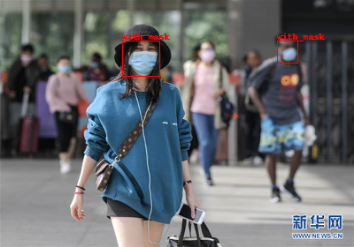

## RCNN, Fast-RCNN 的弱点

我在[上一篇](https://www.cnblogs.com/zkweb/p/14048685.html)文章介绍了对象识别使用的 RCNN, Fast-RCNN 模型，在这里我简单总结一下它们的缺点，Faster-RCNN 将会克服它们：

- 选取区域使用的算法是固定的，不参与学习
- 选取区域的算法本身消耗比较高 (搜索选择法)
- 选取区域的算法选出来的区域大部分都是重合的，并且只有很小一部分包含我们想要识别的对象
- 区域范围的精度比较低 (即使经过调整)
- 判断分类有时只能使用部分包含对象的区域 (例如选取区域的算法给出左半张脸所在的区域，那么就只能使用左半张脸判断分类)

## Faster-RCNN 概览

Faster-RCNN 是 RCNN 和 Fast-RCNN 的进化版，最大的特征是引入了区域生成网络 (RPN - Region Proposal Network)，区域生成网络支持使用机器学习代替固定的算法找出图片中可能包含对象的区域，精度比固定的算法要高很多，而且速度也变快了。

Faster-RCNN 的结构如下图所示，分成了两大部分，第一部分是区域生成网络，首先会把图片划分为多个小区域 (大小依赖于图片大小和 CNN 网络结构，详细会在后面说明)，每个小区域都对应一个锚点 (Anchor)，区域生成网络会判断锚点所在的区域是否包含对象，与包含的对象的形状 (例如只包含鼻子，就大约可以估计周围的几个区域是脸)；第二部分是标签分类网络，与上一篇文章介绍的 Fast-RCNN 基本上相同，会根据区域生成网络的输出截取特征，并根据特征判断属于什么分类。

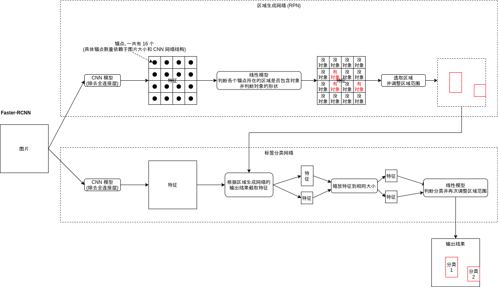

因为区域生成网络可以参与学习，我们可以定制一个只识别某几种对象的网络，例如图片中有人，狗，车，树，房子的时候，固定的算法可能会把他们全部提取出来，但区域生成网络经过训练可以只提取人所在的区域，其他对象所在的区域都会当作背景处理，这样区域生成网络输出的区域数量将会少很多，而且包含对象的可能性会很高。

Faster-RCNN 另一个比较强大的特征是会分两步来识别区域是否包含对象与调整区域范围，第一步在区域生成网络，第二步在标签分类网络。举一个通俗的例子，如果区域生成网络选取了某个包含了脸的左半部分的区域，它会判断这个区域可能包含对象，并且要求区域范围向右扩大一些，**接下来标签分类网络会截取范围扩大之后的区域，这个区域会同时包含脸的左半部分和右半部分**，也就是截取出来的特征会包含更多的信息，这时标签分类网络可以使用特征进一步判断这张脸所属的分类，如果范围扩大以后发现这不是一张脸而是别的什么东西那么区域分类网络会输出 "非对象" 的分类排除这个区域，如果判断是脸那么标签分类网络会进一步的调整区域范围，使得范围更精准。而 Fast-RCNN 遇到同样的情况只能根据脸的左半部分对应的特征判断分类，信息量不足可能会导致结果不准确。这种做法使得 Faster-RCNN 的识别精度相对于之前的模型提升了很多。

接下来看看 Faster-RCNN 的实现细节吧，部分内容有一定难度🤕，如果觉得难以理解可以先跳过去后面再参考代码实现。

Faster-RCNN 的原始论文在[这里](https://arxiv.org/pdf/1506.01497.pdf)，有兴趣的可以看看😈。

## Faster-RCNN 的实现

这篇给出的代码会使用 Pillow 类库实现，代替之前的 opencv，所以部分处理相同的步骤也会给出新的代码例子。

### 缩放来源图片

和 Fast-RCNN 一样，Faster-RCNN 也会使用 CNN 模型针对整张图片生成各个区域的特征，所以我们需要缩放原图片。(尽管 CNN 模型支持非固定大小的来源，但统一大小可以让后续的处理更简单，并且也可以批量处理大小不一样的图片。)

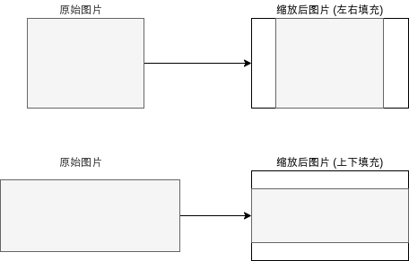

这篇文章会使用 Pillow 代替 opencv，缩放图片的代码如下所示：

``` python
# 缩放图片的大小
IMAGE_SIZE = (256, 192)

def calc_resize_parameters(sw, sh):
    """计算缩放图片的参数"""
    sw_new, sh_new = sw, sh
    dw, dh = IMAGE_SIZE
    pad_w, pad_h = 0, 0
    if sw / sh < dw / dh:
        sw_new = int(dw / dh * sh)
        pad_w = (sw_new - sw) // 2 # 填充左右
    else:
        sh_new = int(dh / dw * sw)
        pad_h = (sh_new - sh) // 2 # 填充上下
    return sw_new, sh_new, pad_w, pad_h

def resize_image(img):
    """缩放图片，比例不一致时填充"""
    sw, sh = img.size
    sw_new, sh_new, pad_w, pad_h = calc_resize_parameters(sw, sh)
    img_new = Image.new("RGB", (sw_new, sh_new))
    img_new.paste(img, (pad_w, pad_h))
    img_new = img_new.resize(IMAGE_SIZE)
    return img_new
```

### 计算区域特征

与 Fast-RCNN 一样，Faster-RCNN 计算区域特征的时候也会使用除去全连接层的 CNN 模型，例如 Resnet-18 模型在原图大小为 3,256,256 的时候 (3 代表 RGB 三通道)会输出 512,32,32 的矩阵，通道数量变多，长宽变为原有的 1/8，也就是每个 8x8 的区域经过处理以后都对应 512 个特征，如下图所示：

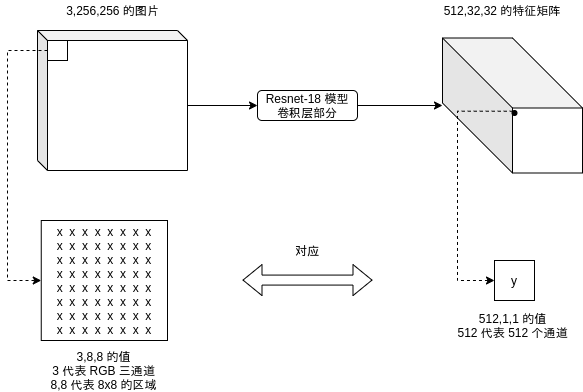

对 CNN 模型不熟悉的可以复习这个系列的[第八篇文章](https://www.cnblogs.com/zkweb/p/13354826.html)，详细介绍了 Resnet-18 的结构与计算流程。

上一篇文章的 Fast-RCNN 例子改动了 Resnet 模型使得输出的特征矩阵长宽与原图相同，以方便后面提取特征 (ROI Pooling) 的处理，这篇将不需要这么做，这篇使用的模型会输出长宽为原有的 1/8 的特征矩阵，但为了适应显存比较低的机器会减少输出的通道数量，具体请参考后面的实现代码。

### 定义锚点 (Anchor)

Faster-RCNN 的区域生成网络会基于锚点 (Anchor) 判断某个区域是否包含对象，与对象相对于锚点的形状。锚点对应的区域大小其实就是上面特征矩阵中每个点对应的区域大小，如下图所示：

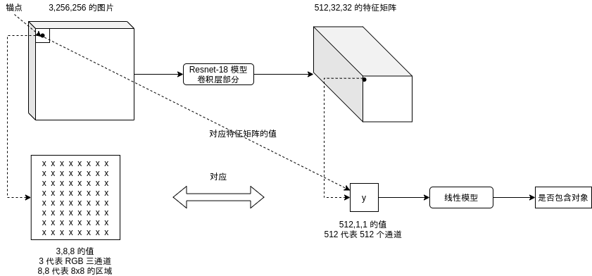

上面的例子中应该有 32x32 个锚点，每个锚点对应 512,1,1 的值。

之后各个锚点对应的值会交给线性模型，判断锚点所在的区域是否包含对象，如下图所示 (为了简化这张图用了 4x4 个锚点，红色的锚点代表包含对象)：

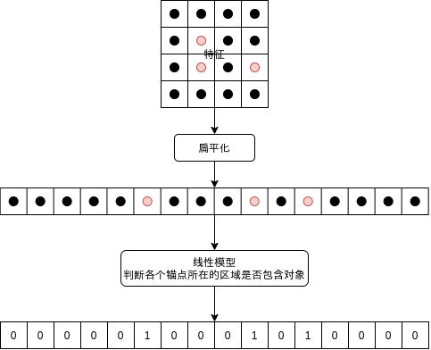

当然的，锚点所在的区域与对象实际所在的区域范围并不会完全一样，锚点所在的区域可能只包含对象的左半部分，右半部分，或者中心部分，对象可能比锚点所在区域大很多，也可能比锚点所在区域小，只判断锚点所在的区域是否包含对象并不够准确。

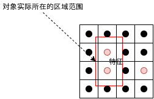

为了解决这个问题，Faster-RCNN 的区域生成网络为每个锚点定义了几个固定的形状，形状有两个参数，一个是大小比例，一个是长宽比例，如下图所示，对比上面的实际区域可以发现形状 6 和形状 7 的重叠率 (IOU) 是比较高的：

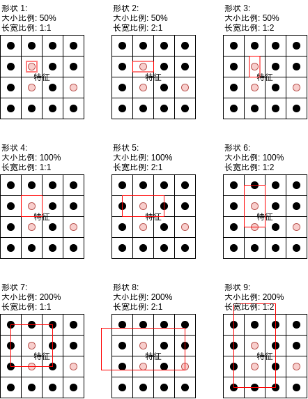

之后区域生成网络的线性模型可以分别判断各个形状是否包含对象：

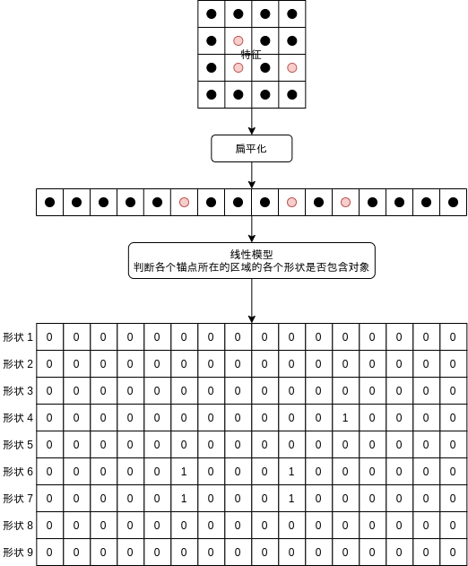

再输出各个形状对应的范围调整值，即可给出可能包含对象的区域。在上述的例子中，如果区域生成网络学习得当，形状 6 和形状 7 经过区域范围调整以后应该会输出很接近的区域。

需要注意的是，虽然锚点支持判断比自己对应的区域更大的范围是否包含对象，但判断的依据只来源于自己对应的区域。举例来说如果锚点对应的区域只包含鼻子，那么它可以判断形状 7 可能包含对象，之后再交给标签分类网络作进一步判断。如果扩大以后发现其实不是人脸，而是别的什么东西，那么标签分类网络将会输出 "非对象" 标签来排除这个区域，如前文介绍的一样。

生成锚点的代码如下，每个锚点会对应 `7 * 3 = 21` 个形状，span 代表 `原图片长宽 / CNN 模型输出长宽`：

``` python
# 缩放图片的大小
IMAGE_SIZE = (256, 192)
# 锚点对应区域的缩放比例列表
AnchorScales = (0.5, 1, 2, 3, 4, 5, 6)
# 锚点对应区域的长宽比例列表
AnchorAspects = ((1, 2), (1, 1), (2, 1))

def generate_anchors(span):
    """根据锚点和形状生成锚点范围列表"""
    w, h = IMAGE_SIZE
    anchors = []
    for x in range(0, w, span):
        for y in range(0, h, span):
            xcenter, ycenter = x + span / 2, y + span / 2
            for scale in AnchorScales:
                for ratio in AnchorAspects:
                    ww = span * scale * ratio[0]
                    hh = span * scale * ratio[1]
                    xx = xcenter - ww / 2
                    yy = ycenter - hh / 2
                    xx = max(int(xx), 0)
                    yy = max(int(yy), 0)
                    ww = min(int(ww), w - xx)
                    hh = min(int(hh), h - yy)
                    anchors.append((xx, yy, ww, hh))
    return anchors

Anchors = generate_anchors(8)
```

### 区域生成网络 (RPN)

看完上一段关于锚点的定义你应该对区域生成网络的工作方式有个大概的印象，这里我再给出区域生成网络的具体实现架构，这个架构跟后面的代码例子相同。

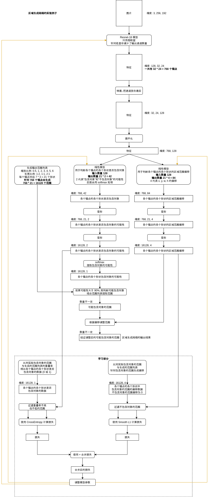

区域生成网络的处理本身应该不需要多解释了🤒，如果觉得难以理解请重新阅读这一篇前面的部分和[上一篇文章](https://www.cnblogs.com/zkweb/p/14048685.html)，特别是上一篇文章的以下部分：

- 按重叠率 (IOU) 判断每个区域是否包含对象
- 调整区域范围

计算区域范围偏移的损失这里使用了 Smooth L1 (上一篇是 MSELoss)，具体的计算方法会在后面计算损失的部分介绍。

区域生成网络最终会输出不定数量的可能包含对象的区域，接下来就是提取这些区域对应的特征了，**注意区域生成网络使用的特征和标签分类网络使用的特征需要分开**，很多文章或者实现介绍 Faster-RCNN 的时候都让两个网络使用相同的特征，但经过我实测使用相同的特征会在调整参数的时候发生干扰导致无法学习，与上一篇文章正负样本的损失需要分开计算的原因一样。部分实现的确使用了相同的特征，但这些实现调整参数使用的 `backward` 是自己手写的，可能这里有什么秘密吧🥺。

### 从区域提取特征 - 仿射变换 (ROI Pooling - Affine Transformation)

上一篇介绍的 Fast-RCNN 在生成特征的时候让长宽与原图片相同，所以 ROI 层提取特征只需要使用 `[]` 操作符，但这一篇生成特征的时候长宽变为了原来的 `1/8`，那么需要怎样提取特征呢？

最简单的方法是把坐标和长宽除以 `8` 再使用 `[]` 操作符提取，然后使用 `AdaptiveMaxPool` 缩放到固定的大小。但这里我要介绍一个更高级的方法，即仿射变换 (Affine Transformation)，使用仿射变换可以非常高效的对图片进行批量截取、缩放与旋转等操作。

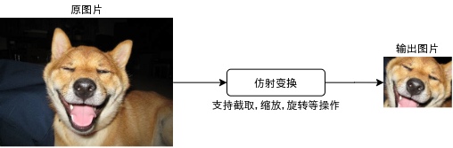

仿射变换的原理是给原图片和输出图片之间的像素坐标建立对应关系，一共有 6 个参数，其中 4 个参数用于给坐标做矩阵乘法 (支持缩放与旋转等变形操作)，2 个参数用于做完矩阵乘法以后相加 (支持平移等操作)，计算公式如下：

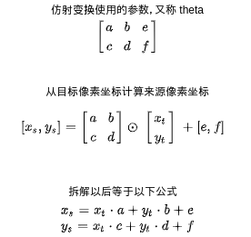

需要注意的是，仿射变换里面不会直接计算坐标的绝对值，而是把图片的左上角当作 `(-1, -1)`，右下角当作 `(1, 1)` 然后转换坐标到这个尺度里面，再进行计算。

举例来说，如果想把原图片的中心部分放大两倍到输出图片，可以使用以下参数：

``` text
0.5,   0, 0
  0, 0.5, 0
```

效果如下，如果你拿输出图片的四个角的坐标结合上面的参数计算，可以得出原图中心部分的范围：

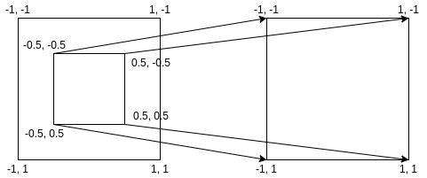

更多例子可以参考[这篇文章](https://www.jianshu.com/p/723af68beb2e)，对理解仿射变换非常有帮助。

那么从区域提取特征的时候，应该使用怎样的参数呢？计算参数的公式推导过程如下😫：

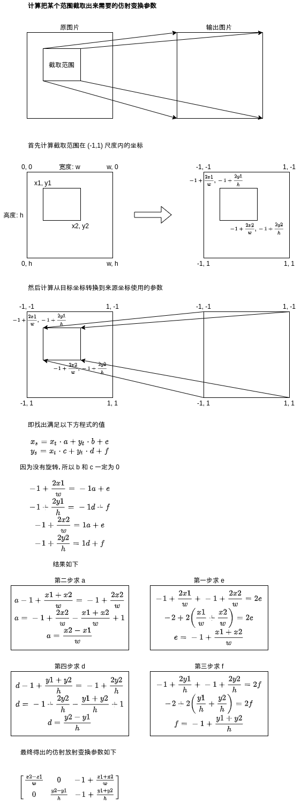

使用 pytorch 实现如下，注意 pytorch 的仿射变换要求数据维度是 `(C, H, W)`，而我们使用的数据维度是 `(C, W, H)`，所以需要调换参数的位置，`pooling_size` 代表输出图片的大小，这样仿射变换不仅可以截取范围还能帮我们缩放到指定的大小：

``` python
# 缩放图片的大小
IMAGE_SIZE = (256, 192)

def roi_crop(features, rois, pooling_size):
    """根据区域截取特征，每次只能处理单张图片"""
    width, height = IMAGE_SIZE
    theta = []
    results = []
    for roi in rois:
        x1, y1, w, h = roi
        x2, y2 = x1 + w, y1 + h
        theta = [[
            [
                (y2 - y1) / height,
                0,
                (y2 + y1) / height - 1
            ],
            [
                0,
                (x2 - x1) / width,
                (x2 + x1) / width - 1
            ]
        ]]
        theta_tensor = torch.tensor(theta)
        grid = nn.functional.affine_grid(
            theta_tensor,
            torch.Size((1, 1, pooling_size, pooling_size)),
            align_corners=False).to(device)
        result = nn.functional.grid_sample(
            features.unsqueeze(0), grid, align_corners=False)
        results.append(result)
    if not results:
        return None
    results = torch.cat(results, dim=0)
    return results
```

如果 `pooling_size` 为 7，那么 results 的维度就是 `范围的数量, 7, 7`。

仿射变换本来是用在 STN 网络里的，用于把旋转变形以后的图片还原，如果你有兴趣可以参考[这里](https://pytorch.org/tutorials/intermediate/spatial_transformer_tutorial.html)。

### 根据特征识别分类

接下来就是根据特征识别分类了🥳，处理上与之前的 Fast-RCNN 基本上相同，除了 Faster-RCNN 在生成范围调整参数的时候会针对每个分类分别生成，如果有 5 个分类，那么就会有 `5 * 4 = 20` 个输出，这会让范围调整变得更准确。

标签分类网络的具体实现架构如下，最终会输出包含对象的范围与各个范围对应的分类，整个 Faster-RCNN 的处理就到此为止了😤。

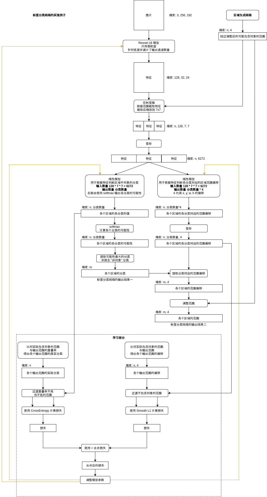

有一点需要注意的是，标签分类网络使用的分类需要额外包含一个 "非对象" 分类，例如原有分类列表为 `[戴口罩人脸，不戴口罩人脸]` 时，实际判断分类列表应该为 `[非人脸, 戴口罩人脸，不戴口罩人脸]`。这是因为标签分类网络的特征截取范围比区域生成网络要大，范围也更准确，标签范围网络可以根据更准确的特征来排除那些区域生成网络以为是对象但实际不是对象的范围。

### 计算损失

到此为止我们看到了以下的损失：

- 区域生成网络判断是否对象的损失
- 区域生成网络的范围调整参数的损失 (仅针对是对象的范围计算)
- 标签分类网络判断对象所属分类的损失
- 标签分类网络的范围调整参数的损失 (仅针对是对象，并且可能性最大的分类计算)

这些损失可以通过 `+` 合并，然后再通过 `backward` 反馈到各个网络的 CNN 模型与线性模型。需要注意的是，在批量训练的时候因为各个图片的输出范围数量不一样，上面的损失会先根据各张图片计算后再平均。你可能记得上一篇 Fast-RCNN 计算损失的时候需要根据正负样本分别计算，这一篇不需要，Faster-RCNN 的区域生成网络输出的范围比较准确，很少会出现来源特征相同但同时输出 "是对象" 和 "非对象" 结果的情况。此外，如前文所提到的，区域生成网络与标签分类网络应该使用不同的 CNN 模型生成不同的特征，以避免通过损失调整模型参数时发生干扰。

计算范围调整损失的时候用的是 `Smooth L1` 函数，这个函数我们之前没有看到过，所以我再简单介绍一下它的计算方法：

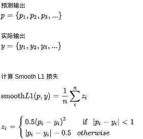

简单的来说就是如果预测输出和实际输出之间的差距比较小的时候，反过来增加损失使得调整速度更快，因为区域范围偏移需要让预测输出在数值上更接近实际输出 (不像标签分类可以只调整方向不管具体值)，使用 `Smooth L1` 调整起来效果会更好。

### 合并结果区域

Faster-RCNN 可能会针对同一个对象输出多个重合的范围，但因为 Faster-RCNN 的精确度比较高，这些重合的范围的重叠率应该也比较高，我们可以结合这些范围得出结果范围：

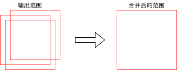

好了，对 Faster-RCNN 的介绍就到此为止了🤗，接下来我们看看代码实现吧。

## 使用 Faster-RCNN 识别人脸位置与是否戴口罩

这次的任务是识别图片中人脸的位置，与判断是否有正确佩戴口罩，一共有以下的分类：

- 非人脸: other
- 戴口罩: with_mask
- 没戴口罩: without_mask
- 戴了口罩但姿势不正确: mask_weared_incorrect

训练使用的数据也是来源于 kaggle，下载需要注册帐号但不用给钱：

https://www.kaggle.com/andrewmvd/face-mask-detection

例如下面这张图片：

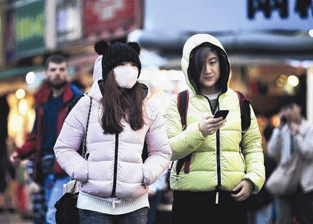

对应以下的标记 (xml 格式)：

``` xml
<annotation>
    <folder>images</folder>
    <filename>maksssksksss0.png</filename>
    <size>
        <width>512</width>
        <height>366</height>
        <depth>3</depth>
    </size>
    <segmented>0</segmented>
    <object>
        <name>without_mask</name>
        <pose>Unspecified</pose>
        <truncated>0</truncated>
        <occluded>0</occluded>
        <difficult>0</difficult>
        <bndbox>
            <xmin>79</xmin>
            <ymin>105</ymin>
            <xmax>109</xmax>
            <ymax>142</ymax>
        </bndbox>
    </object>
    <object>
        <name>with_mask</name>
        <pose>Unspecified</pose>
        <truncated>0</truncated>
        <occluded>0</occluded>
        <difficult>0</difficult>
        <bndbox>
            <xmin>185</xmin>
            <ymin>100</ymin>
            <xmax>226</xmax>
            <ymax>144</ymax>
        </bndbox>
    </object>
    <object>
        <name>without_mask</name>
        <pose>Unspecified</pose>
        <truncated>0</truncated>
        <occluded>0</occluded>
        <difficult>0</difficult>
        <bndbox>
            <xmin>325</xmin>
            <ymin>90</ymin>
            <xmax>360</xmax>
            <ymax>141</ymax>
        </bndbox>
    </object>
</annotation>
```

使用 Faster-RCNN 训练与识别的代码如下😈：

``` python
import os
import sys
import torch
import gzip
import itertools
import random
import numpy
import math
import pandas
import json
from PIL import Image
from PIL import ImageDraw
from torch import nn
from matplotlib import pyplot
from collections import defaultdict
import xml.etree.cElementTree as ET
from collections import Counter

# 缩放图片的大小
IMAGE_SIZE = (256, 192)
# 分析目标的图片所在的文件夹
IMAGE_DIR = "./archive/images"
# 定义各个图片中人脸区域与分类的 CSV 文件
ANNOTATION_DIR = "./archive/annotations"
# 分类列表
CLASSES = [ "other", "with_mask", "without_mask", "mask_weared_incorrect" ]
CLASSES_MAPPING = { c: index for index, c in enumerate(CLASSES) }
# 判断是否存在对象使用的区域重叠率的阈值
IOU_POSITIVE_THRESHOLD = 0.35
IOU_NEGATIVE_THRESHOLD = 0.10
# 判断是否应该合并重叠区域的重叠率阈值
IOU_MERGE_THRESHOLD = 0.35

# 用于启用 GPU 支持
device = torch.device("cuda" if torch.cuda.is_available() else "cpu")

class BasicBlock(nn.Module):
    """ResNet 使用的基础块"""
    expansion = 1 # 定义这个块的实际出通道是 channels_out 的几倍，这里的实现固定是一倍
    def __init__(self, channels_in, channels_out, stride):
        super().__init__()
        # 生成 3x3 的卷积层
        # 处理间隔 stride = 1 时，输出的长宽会等于输入的长宽，例如 (32-3+2)//1+1 == 32
        # 处理间隔 stride = 2 时，输出的长宽会等于输入的长宽的一半，例如 (32-3+2)//2+1 == 16
        # 此外 resnet 的 3x3 卷积层不使用偏移值 bias
        self.conv1 = nn.Sequential(
            nn.Conv2d(channels_in, channels_out, kernel_size=3, stride=stride, padding=1, bias=False),
            nn.BatchNorm2d(channels_out))
        # 再定义一个让输出和输入维度相同的 3x3 卷积层
        self.conv2 = nn.Sequential(
            nn.Conv2d(channels_out, channels_out, kernel_size=3, stride=1, padding=1, bias=False),
            nn.BatchNorm2d(channels_out))
        # 让原始输入和输出相加的时候，需要维度一致，如果维度不一致则需要整合
        self.identity = nn.Sequential()
        if stride != 1 or channels_in != channels_out * self.expansion:
            self.identity = nn.Sequential(
                nn.Conv2d(channels_in, channels_out * self.expansion, kernel_size=1, stride=stride, bias=False),
                nn.BatchNorm2d(channels_out * self.expansion))

    def forward(self, x):
        # x => conv1 => relu => conv2 => + => relu
        # |                              ^
        # |==============================|
        tmp = self.conv1(x)
        tmp = nn.functional.relu(tmp, inplace=True)
        tmp = self.conv2(tmp)
        tmp += self.identity(x)
        y = nn.functional.relu(tmp, inplace=True)
        return y

class MyModel(nn.Module):
    """Faster-RCNN (基于 ResNet-18 的变种)"""
    Anchors = None # 锚点列表，包含 锚点数量 * 形状数量 的范围
    AnchorSpan = 8 # 锚点之间的距离，应该等于原有长宽 / resnet 输出长宽
    AnchorScales = (0.5, 1, 2, 3, 4, 5, 6) # 锚点对应区域的缩放比例列表
    AnchorAspects = ((1, 2), (1, 1), (2, 1)) # 锚点对应区域的长宽比例列表
    AnchorBoxes = len(AnchorScales) * len(AnchorAspects) # 每个锚点对应的形状数量

    def __init__(self):
        super().__init__()
        # 抽取图片各个区域特征的 ResNet (除去 AvgPool 和全连接层)
        # 和 Fast-RCNN 例子不同的是输出的长宽会是原有的 1/8，后面会根据锚点与 affine_grid 截取区域
        # 此外，为了可以让模型跑在 4GB 显存上，这里减少了模型的通道数量
        # 注意:
        # RPN 使用的模型和标签分类使用的模型需要分开，否则会出现无法学习 (RPN 总是输出负) 的问题
        self.previous_channels_out = 4
        self.rpn_resnet = nn.Sequential(
            nn.Conv2d(3, self.previous_channels_out, kernel_size=3, stride=1, padding=1, bias=False),
            nn.BatchNorm2d(self.previous_channels_out),
            nn.ReLU(inplace=True),
            self._make_layer(BasicBlock, channels_out=16, num_blocks=2, stride=1),
            self._make_layer(BasicBlock, channels_out=32, num_blocks=2, stride=2),
            self._make_layer(BasicBlock, channels_out=64, num_blocks=2, stride=2),
            self._make_layer(BasicBlock, channels_out=128, num_blocks=2, stride=2))
        self.previous_channels_out = 4
        self.cls_resnet = nn.Sequential(
            nn.Conv2d(3, self.previous_channels_out, kernel_size=3, stride=1, padding=1, bias=False),
            nn.BatchNorm2d(self.previous_channels_out),
            nn.ReLU(inplace=True),
            self._make_layer(BasicBlock, channels_out=16, num_blocks=2, stride=1),
            self._make_layer(BasicBlock, channels_out=32, num_blocks=2, stride=2),
            self._make_layer(BasicBlock, channels_out=64, num_blocks=2, stride=2),
            self._make_layer(BasicBlock, channels_out=128, num_blocks=2, stride=2))
        self.features_channels = 128
        # 根据区域特征生成各个锚点对应的对象可能性的模型
        self.rpn_labels_model = nn.Sequential(
            nn.Linear(self.features_channels, 128),
            nn.ReLU(),
            nn.Dropout(0.1),
            nn.Linear(128, MyModel.AnchorBoxes*2))
        # 根据区域特征生成各个锚点对应的区域偏移的模型
        self.rpn_offsets_model = nn.Sequential(
            nn.Linear(self.features_channels, 128),
            nn.ReLU(),
            nn.Dropout(0.1),
            nn.Linear(128, MyModel.AnchorBoxes*4))
        # 选取可能出现对象的区域需要的最小可能性
        self.rpn_score_threshold = 0.9
        # 每张图片最多选取的区域列表
        self.rpn_max_candidates = 32
        # 根据区域截取特征后缩放到的大小
        self.pooling_size = 7
        # 根据区域特征判断分类的模型
        self.cls_labels_model = nn.Sequential(
            nn.Linear(self.features_channels * (self.pooling_size ** 2), 128),
            nn.ReLU(),
            nn.Dropout(0.1),
            nn.Linear(128, len(CLASSES)))
        # 根据区域特征再次生成区域偏移的模型，注意区域偏移会针对各个分类分别生成
        self.cls_offsets_model = nn.Sequential(
            nn.Linear(self.features_channels * (self.pooling_size ** 2), 128),
            nn.ReLU(),
            nn.Dropout(0.1),
            nn.Linear(128, len(CLASSES)*4))

    def _make_layer(self, block_type, channels_out, num_blocks, stride):
        """创建 resnet 使用的层"""
        blocks = []
        # 添加第一个块
        blocks.append(block_type(self.previous_channels_out, channels_out, stride))
        self.previous_channels_out = channels_out * block_type.expansion
        # 添加剩余的块，剩余的块固定处理间隔为 1，不会改变长宽
        for _ in range(num_blocks-1):
            blocks.append(block_type(self.previous_channels_out, self.previous_channels_out, 1))
            self.previous_channels_out *= block_type.expansion
        return nn.Sequential(*blocks)

    @staticmethod
    def _generate_anchors(span):
        """根据锚点和形状生成锚点范围列表"""
        w, h = IMAGE_SIZE
        anchors = []
        for x in range(0, w, span):
            for y in range(0, h, span):
                xcenter, ycenter = x + span / 2, y + span / 2
                for scale in MyModel.AnchorScales:
                    for ratio in MyModel.AnchorAspects:
                        ww = span * scale * ratio[0]
                        hh = span * scale * ratio[1]
                        xx = xcenter - ww / 2
                        yy = ycenter - hh / 2
                        xx = max(int(xx), 0)
                        yy = max(int(yy), 0)
                        ww = min(int(ww), w - xx)
                        hh = min(int(hh), h - yy)
                        anchors.append((xx, yy, ww, hh))
        return anchors

    @staticmethod
    def _roi_crop(features, rois, pooling_size):
        """根据区域截取特征，每次只能处理单张图片"""
        width, height = IMAGE_SIZE
        theta = []
        results = []
        for roi in rois:
            x1, y1, w, h = roi
            x2, y2 = x1 + w, y1 + h
            theta = [[
                [
                    (y2 - y1) / height,
                    0,
                    (y2 + y1) / height - 1
                ],
                [
                    0,
                    (x2 - x1) / width,
                    (x2 + x1) / width - 1
                ]
            ]]
            theta_tensor = torch.tensor(theta)
            grid = nn.functional.affine_grid(
                theta_tensor,
                torch.Size((1, 1, pooling_size, pooling_size)),
                align_corners=False).to(device)
            result = nn.functional.grid_sample(
                features.unsqueeze(0), grid, align_corners=False)
            results.append(result)
        if not results:
            return None
        results = torch.cat(results, dim=0)
        return results

    def forward(self, x):
        # ***** 抽取特征部分 *****
        # 分别抽取 RPN 和标签分类使用的特征
        # 维度是 B,128,W/8,H/8
        rpn_features_original = self.rpn_resnet(x)
        # 维度是 B*W/8*H/8,128 (把通道放在最后，用于传给线性模型)
        rpn_features = rpn_features_original.permute(0, 2, 3, 1).reshape(-1, self.features_channels)
        # 维度是 B,128,W/8,H/8
        cls_features = self.cls_resnet(x)

        # ***** 选取区域部分 *****
        # 根据区域特征生成各个锚点对应的对象可能性
        # 维度是 B,W/8*H/8*AnchorBoxes,2
        rpn_labels = self.rpn_labels_model(rpn_features)
        rpn_labels = rpn_labels.reshape(
            rpn_features_original.shape[0],
            rpn_features_original.shape[2] * rpn_features_original.shape[3] * MyModel.AnchorBoxes,
            2)
        # 根据区域特征生成各个锚点对应的区域偏移
        # 维度是 B,W/8*H/8*AnchorBoxes,4
        rpn_offsets = self.rpn_offsets_model(rpn_features)
        rpn_offsets = rpn_offsets.reshape(
            rpn_features_original.shape[0],
            rpn_features_original.shape[2] * rpn_features_original.shape[3] * MyModel.AnchorBoxes,
            4)
        # 选取可能出现对象的区域，并调整区域范围
        with torch.no_grad():
            rpn_scores = nn.functional.softmax(rpn_labels, dim=2)[:,:,1]
            # 选取可能性最高的部分区域
            rpn_top_scores = torch.topk(rpn_scores, k=self.rpn_max_candidates, dim=1)
            rpn_candidates_batch = []
            for x in range(0, rpn_scores.shape[0]):
                rpn_candidates = []
                for score, index in zip(rpn_top_scores.values[x], rpn_top_scores.indices[x]):
                    # 过滤可能性低于指定阈值的区域
                    if score.item() < self.rpn_score_threshold:
                        continue
                    anchor_box = MyModel.Anchors[index.item()]
                    offset = rpn_offsets[x,index.item()].tolist()
                    # 调整区域范围
                    candidate_box = adjust_box_by_offset(anchor_box, offset)
                    rpn_candidates.append(candidate_box)
                rpn_candidates_batch.append(rpn_candidates)

        # ***** 判断分类部分 *****
        cls_output = []
        cls_result = []
        for index in range(0, cls_features.shape[0]):
            pooled = MyModel._roi_crop(
                cls_features[index], rpn_candidates_batch[index], self.pooling_size)
            if pooled is None:
                # 没有找到可能包含对象的区域
                cls_output.append(None)
                cls_result.append(None)
                continue
            pooled = pooled.reshape(pooled.shape[0], -1)
            labels = self.cls_labels_model(pooled)
            offsets = self.cls_offsets_model(pooled)
            cls_output.append((labels, offsets))
            # 使用 softmax 判断可能性最大的分类
            classes = nn.functional.softmax(labels, dim=1).max(dim=1).indices
            # 根据分类对应的偏移再次调整区域范围
            offsets_map = offsets.reshape(offsets.shape[0] * len(CLASSES), 4)
            result = []
            for box_index in range(0, classes.shape[0]):
                predicted_label = classes[box_index].item()
                if predicted_label == 0:
                    continue # 0 代表 other, 表示非对象
                candidate_box = rpn_candidates_batch[index][box_index]
                offset = offsets_map[box_index * len(CLASSES) + predicted_label].tolist()
                predicted_box = adjust_box_by_offset(candidate_box, offset)
                # 添加分类与最终预测区域
                result.append((predicted_label, predicted_box))
            cls_result.append(result)

        # 前面的项目用于学习，最后一项是最终输出结果
        return rpn_labels, rpn_offsets, rpn_candidates_batch, cls_output, cls_result

    @staticmethod
    def loss_function(predicted, actual):
        """Faster-RCNN 使用的多任务损失计算器"""
        rpn_labels, rpn_offsets, rpn_candidates_batch, cls_output, _ = predicted
        rpn_labels_losses = []
        rpn_offsets_losses = []
        cls_labels_losses = []
        cls_offsets_losses = []
        for batch_index in range(len(actual)):
            # 计算 RPN 的损失
            (true_boxes_labels,
                actual_rpn_labels, actual_rpn_labels_mask,
                actual_rpn_offsets, actual_rpn_offsets_mask) = actual[batch_index]
            rpn_labels_losses.append(nn.functional.cross_entropy(
                rpn_labels[batch_index][actual_rpn_labels_mask],
                actual_rpn_labels.to(device)))
            rpn_offsets_losses.append(nn.functional.smooth_l1_loss(
                rpn_offsets[batch_index][actual_rpn_offsets_mask],
                actual_rpn_offsets.to(device)))
            # 计算标签分类的损失
            if cls_output[batch_index] is None:
                continue
            cls_labels_mask = []
            cls_offsets_mask = []
            cls_actual_labels = []
            cls_actual_offsets = []
            cls_predicted_labels, cls_predicted_offsets = cls_output[batch_index]
            cls_predicted_offsets_map = cls_predicted_offsets.reshape(-1, 4)
            rpn_candidates = rpn_candidates_batch[batch_index]
            for box_index, candidate_box in enumerate(rpn_candidates):
                iou_list = [ calc_iou(candidate_box, true_box) for (_, true_box) in true_boxes_labels ]
                positive_index = next((index for index, iou in enumerate(iou_list) if iou > IOU_POSITIVE_THRESHOLD), None)
                is_negative = all(iou < IOU_NEGATIVE_THRESHOLD for iou in iou_list)
                if positive_index is not None:
                    true_label, true_box = true_boxes_labels[positive_index]
                    cls_actual_labels.append(true_label)
                    cls_labels_mask.append(box_index)
                    # 如果区域正确，则学习真实分类对应的区域偏移
                    cls_actual_offsets.append(calc_box_offset(candidate_box, true_box))
                    cls_offsets_mask.append(box_index * len(CLASSES) + true_label)
                elif is_negative:
                    cls_actual_labels.append(0) # 0 代表 other, 表示非对象
                    cls_labels_mask.append(box_index)
                # 如果候选区域与真实区域的重叠率介于两个阈值之间，则不参与学习
            if cls_labels_mask:
                cls_labels_losses.append(nn.functional.cross_entropy(
                    cls_predicted_labels[cls_labels_mask],
                    torch.tensor(cls_actual_labels).to(device)))
            if cls_offsets_mask:
                cls_offsets_losses.append(nn.functional.smooth_l1_loss(
                    cls_predicted_offsets_map[cls_offsets_mask],
                    torch.tensor(cls_actual_offsets).to(device)))
        # 合并损失值
        # 注意 loss 不可以使用 += 合并
        loss = torch.tensor(.0, requires_grad=True)
        loss = loss + torch.mean(torch.stack(rpn_labels_losses))
        loss = loss + torch.mean(torch.stack(rpn_offsets_losses))
        if cls_labels_losses:
            loss = loss + torch.mean(torch.stack(cls_labels_losses))
        if cls_offsets_losses:
            loss = loss + torch.mean(torch.stack(cls_offsets_losses))
        return loss

    @staticmethod
    def calc_accuracy(actual, predicted):
        """Faster-RCNN 使用的正确率计算器，这里只计算 RPN 与标签分类的正确率，区域偏移不计算"""
        rpn_labels, rpn_offsets, rpn_candidates_batch, cls_output, cls_result = predicted
        rpn_acc = 0
        cls_acc = 0
        for batch_index in range(len(actual)):
            # 计算 RPN 的正确率，正样本和负样本的正确率分别计算再平均
            (true_boxes_labels,
                actual_rpn_labels, actual_rpn_labels_mask,
                actual_rpn_offsets, actual_rpn_offsets_mask) = actual[batch_index]
            a = actual_rpn_labels.to(device)
            p = torch.max(rpn_labels[batch_index][actual_rpn_labels_mask], 1).indices
            rpn_acc_positive = ((a == 0) & (p == 0)).sum().item() / ((a == 0).sum().item() + 0.00001)
            rpn_acc_negative = ((a == 1) & (p == 1)).sum().item() / ((a == 1).sum().item() + 0.00001)
            rpn_acc += (rpn_acc_positive + rpn_acc_negative) / 2
            # 计算标签分类的正确率
            # 正确率 = 有对应预测区域并且预测分类正确的真实区域数量 / 总真实区域数量
            cls_correct = 0
            for true_label, true_box in true_boxes_labels:
                if cls_result[batch_index] is None:
                    continue
                for predicted_label, predicted_box in cls_result[batch_index]:
                    if calc_iou(predicted_box, true_box) > IOU_POSITIVE_THRESHOLD and predicted_label == true_label:
                        cls_correct += 1
                        break
            cls_acc += cls_correct / len(true_boxes_labels)
        rpn_acc /= len(actual)
        cls_acc /= len(actual)
        return rpn_acc, cls_acc

MyModel.Anchors = MyModel._generate_anchors(8)

def save_tensor(tensor, path):
    """保存 tensor 对象到文件"""
    torch.save(tensor, gzip.GzipFile(path, "wb"))

def load_tensor(path):
    """从文件读取 tensor 对象"""
    return torch.load(gzip.GzipFile(path, "rb"))

def calc_resize_parameters(sw, sh):
    """计算缩放图片的参数"""
    sw_new, sh_new = sw, sh
    dw, dh = IMAGE_SIZE
    pad_w, pad_h = 0, 0
    if sw / sh < dw / dh:
        sw_new = int(dw / dh * sh)
        pad_w = (sw_new - sw) // 2 # 填充左右
    else:
        sh_new = int(dh / dw * sw)
        pad_h = (sh_new - sh) // 2 # 填充上下
    return sw_new, sh_new, pad_w, pad_h

def resize_image(img):
    """缩放图片，比例不一致时填充"""
    sw, sh = img.size
    sw_new, sh_new, pad_w, pad_h = calc_resize_parameters(sw, sh)
    img_new = Image.new("RGB", (sw_new, sh_new))
    img_new.paste(img, (pad_w, pad_h))
    img_new = img_new.resize(IMAGE_SIZE)
    return img_new

def image_to_tensor(img):
    """转换图片对象到 tensor 对象"""
    arr = numpy.asarray(img)
    t = torch.from_numpy(arr)
    t = t.transpose(0, 2) # 转换维度 H,W,C 到 C,W,H
    t = t / 255.0 # 正规化数值使得范围在 0 ~ 1
    return t

def map_box_to_resized_image(box, sw, sh):
    """把原始区域转换到缩放后的图片对应的区域"""
    x, y, w, h = box
    sw_new, sh_new, pad_w, pad_h = calc_resize_parameters(sw, sh)
    scale = IMAGE_SIZE[0] / sw_new
    x = int((x + pad_w) * scale)
    y = int((y + pad_h) * scale)
    w = int(w * scale)
    h = int(h * scale)
    if x + w > IMAGE_SIZE[0] or y + h > IMAGE_SIZE[1] or w == 0 or h == 0:
        return 0, 0, 0, 0
    return x, y, w, h

def map_box_to_original_image(box, sw, sh):
    """把缩放后图片对应的区域转换到缩放前的原始区域"""
    x, y, w, h = box
    sw_new, sh_new, pad_w, pad_h = calc_resize_parameters(sw, sh)
    scale = IMAGE_SIZE[0] / sw_new
    x = int(x / scale - pad_w)
    y = int(y / scale - pad_h)
    w = int(w / scale)
    h = int(h / scale)
    if x + w > sw or y + h > sh or x < 0 or y < 0 or w == 0 or h == 0:
        return 0, 0, 0, 0
    return x, y, w, h

def calc_iou(rect1, rect2):
    """计算两个区域重叠部分 / 合并部分的比率 (intersection over union)"""
    x1, y1, w1, h1 = rect1
    x2, y2, w2, h2 = rect2
    xi = max(x1, x2)
    yi = max(y1, y2)
    wi = min(x1+w1, x2+w2) - xi
    hi = min(y1+h1, y2+h2) - yi
    if wi > 0 and hi > 0: # 有重叠部分
        area_overlap = wi*hi
        area_all = w1*h1 + w2*h2 - area_overlap
        iou = area_overlap / area_all
    else: # 没有重叠部分
        iou = 0
    return iou

def calc_box_offset(candidate_box, true_box):
    """计算候选区域与实际区域的偏移值"""
    # 这里计算出来的偏移值基于比例，而不受具体位置和大小影响
    # w h 使用 log 是为了减少过大的值的影响
    x1, y1, w1, h1 = candidate_box
    x2, y2, w2, h2 = true_box
    x_offset = (x2 - x1) / w1
    y_offset = (y2 - y1) / h1
    w_offset = math.log(w2 / w1)
    h_offset = math.log(h2 / h1)
    return (x_offset, y_offset, w_offset, h_offset)

def adjust_box_by_offset(candidate_box, offset):
    """根据偏移值调整候选区域"""
    # exp 需要限制值小于 log(16)，如果值过大可能会引发 OverflowError
    x1, y1, w1, h1 = candidate_box
    x_offset, y_offset, w_offset, h_offset = offset
    x2 = min(IMAGE_SIZE[0]-1,  max(0, w1 * x_offset + x1))
    y2 = min(IMAGE_SIZE[1]-1,  max(0, h1 * y_offset + y1))
    w2 = min(IMAGE_SIZE[0]-x2, max(1, math.exp(min(w_offset, 2.78)) * w1))
    h2 = min(IMAGE_SIZE[1]-y2, max(1, math.exp(min(h_offset, 2.78)) * h1))
    return (x2, y2, w2, h2)

def merge_box(box_a, box_b):
    """合并两个区域"""
    x1, y1, w1, h1 = box_a
    x2, y2, w2, h2 = box_b
    x = min(x1, x2)
    y = min(y1, y2)
    w = max(x1 + w1, x2 + w2) - x
    h = max(y1 + h1, y2 + h2) - y
    return (x, y, w, h)

def prepare_save_batch(batch, image_tensors, image_boxes_labels):
    """准备训练 - 保存单个批次的数据"""
    # 按索引值列表生成输入和输出 tensor 对象的函数
    def split_dataset(indices):
        image_in = []
        boxes_labels_out = {}
        for new_image_index, original_image_index in enumerate(indices.tolist()):
            image_in.append(image_tensors[original_image_index])
            boxes_labels_out[new_image_index] = image_boxes_labels[original_image_index]
        tensor_image_in = torch.stack(image_in) # 维度: B,C,W,H
        return tensor_image_in, boxes_labels_out

    # 切分训练集 (80%)，验证集 (10%) 和测试集 (10%)
    random_indices = torch.randperm(len(image_tensors))
    training_indices = random_indices[:int(len(random_indices)*0.8)]
    validating_indices = random_indices[int(len(random_indices)*0.8):int(len(random_indices)*0.9):]
    testing_indices = random_indices[int(len(random_indices)*0.9):]
    training_set = split_dataset(training_indices)
    validating_set = split_dataset(validating_indices)
    testing_set = split_dataset(testing_indices)

    # 保存到硬盘
    save_tensor(training_set, f"data/training_set.{batch}.pt")
    save_tensor(validating_set, f"data/validating_set.{batch}.pt")
    save_tensor(testing_set, f"data/testing_set.{batch}.pt")
    print(f"batch {batch} saved")

def prepare():
    """准备训练"""
    # 数据集转换到 tensor 以后会保存在 data 文件夹下
    if not os.path.isdir("data"):
        os.makedirs("data")

    # 加载图片和图片对应的区域与分类列表
    # { 图片名: [ 区域与分类, 区域与分类, .. ] }
    box_map = defaultdict(lambda: [])
    for filename in os.listdir(IMAGE_DIR):
        xml_path = os.path.join(ANNOTATION_DIR, filename.split(".")[0] + ".xml")
        if not os.path.isfile(xml_path):
            continue
        tree = ET.ElementTree(file=xml_path)
        objects = tree.findall("object")
        for obj in objects:
            class_name = obj.find("name").text
            x1 = int(obj.find("bndbox/xmin").text)
            x2 = int(obj.find("bndbox/xmax").text)
            y1 = int(obj.find("bndbox/ymin").text)
            y2 = int(obj.find("bndbox/ymax").text)
            box_map[filename].append((x1, y1, x2-x1, y2-y1, CLASSES_MAPPING[class_name]))

    # 保存图片和图片对应的分类与区域列表
    batch_size = 20
    batch = 0
    image_tensors = [] # 图片列表
    image_boxes_labels = {} # 图片对应的真实区域与分类列表，和候选区域与区域偏移
    for filename, original_boxes_labels in box_map.items():
        image_path = os.path.join(IMAGE_DIR, filename)
        with Image.open(image_path) as img_original: # 加载原始图片
            sw, sh = img_original.size # 原始图片大小
            img = resize_image(img_original) # 缩放图片
            image_index = len(image_tensors) # 图片在批次中的索引值
            image_tensors.append(image_to_tensor(img)) # 添加图片到列表
            true_boxes_labels = [] # 图片对应的真实区域与分类列表
        # 添加真实区域与分类列表
        for box_label in original_boxes_labels:
            x, y, w, h, label = box_label
            x, y, w, h = map_box_to_resized_image((x, y, w, h), sw, sh) # 缩放实际区域
            if w < 10 or h < 10:
                continue # 缩放后区域过小
            # 检查计算是否有问题
            # child_img = img.copy().crop((x, y, x+w, y+h))
            # child_img.save(f"{filename}_{x}_{y}_{w}_{h}_{label}.png")
            true_boxes_labels.append((label, (x, y, w, h)))
        # 如果图片中的所有区域都过小则跳过
        if not true_boxes_labels:
            image_tensors.pop()
            image_index = len(image_tensors)
            continue
        # 根据锚点列表寻找候选区域，并计算区域偏移
        actual_rpn_labels = []
        actual_rpn_labels_mask = []
        actual_rpn_offsets = []
        actual_rpn_offsets_mask = []
        positive_index_set = set()
        for index, anchor_box in enumerate(MyModel.Anchors):
            # 如果候选区域和任意一个实际区域重叠率大于阈值，则认为是正样本
            # 如果候选区域和所有实际区域重叠率都小于阈值，则认为是负样本
            # 重叠率介于两个阈值之间的区域不参与学习
            iou_list = [ calc_iou(anchor_box, true_box) for (_, true_box) in true_boxes_labels ]
            positive_index = next((index for index, iou in enumerate(iou_list) if iou > IOU_POSITIVE_THRESHOLD), None)
            is_negative = all(iou < IOU_NEGATIVE_THRESHOLD for iou in iou_list)
            if positive_index is not None:
                positive_index_set.add(positive_index)
                actual_rpn_labels.append(1)
                actual_rpn_labels_mask.append(index)
                # 只有包含对象的区域参需要调整偏移
                true_box = true_boxes_labels[positive_index][1]
                actual_rpn_offsets.append(calc_box_offset(anchor_box, true_box))
                actual_rpn_offsets_mask.append(index)
            elif is_negative:
                actual_rpn_labels.append(0)
                actual_rpn_labels_mask.append(index)
        # 输出找不到候选区域的真实区域，调整锚点生成参数时使用
        # for index in range(len(true_boxes_labels)):
        #    if index not in positive_index_set:
        #        print(true_boxes_labels[index][1])
        # print("-----")
        # 如果一个候选区域都找不到则跳过
        if not positive_index_set:
            image_tensors.pop()
            image_index = len(image_tensors)
            continue
        image_boxes_labels[image_index] = (
            true_boxes_labels,
            torch.tensor(actual_rpn_labels, dtype=torch.long),
            torch.tensor(actual_rpn_labels_mask, dtype=torch.long),
            torch.tensor(actual_rpn_offsets, dtype=torch.float),
            torch.tensor(actual_rpn_offsets_mask, dtype=torch.long))
        # 保存批次
        if len(image_tensors) >= batch_size:
            prepare_save_batch(batch, image_tensors, image_boxes_labels)
            image_tensors.clear()
            image_boxes_labels.clear()
            batch += 1
    # 保存剩余的批次
    if len(image_tensors) > 10:
        prepare_save_batch(batch, image_tensors, image_boxes_labels)

def train():
    """开始训练"""
    # 创建模型实例
    model = MyModel().to(device)

    # 创建多任务损失计算器
    loss_function = MyModel.loss_function

    # 创建参数调整器
    optimizer = torch.optim.Adam(model.parameters())

    # 记录训练集和验证集的正确率变化
    training_rpn_accuracy_history = []
    training_cls_accuracy_history = []
    validating_rpn_accuracy_history = []
    validating_cls_accuracy_history = []

    # 记录最高的验证集正确率
    validating_rpn_accuracy_highest = -1
    validating_rpn_accuracy_highest_epoch = 0
    validating_cls_accuracy_highest = -1
    validating_cls_accuracy_highest_epoch = 0

    # 读取批次的工具函数
    def read_batches(base_path):
        for batch in itertools.count():
            path = f"{base_path}.{batch}.pt"
            if not os.path.isfile(path):
                break
            x, y = load_tensor(path)
            yield x.to(device), y

    # 计算正确率的工具函数
    calc_accuracy = MyModel.calc_accuracy

    # 开始训练过程
    for epoch in range(1, 10000):
        print(f"epoch: {epoch}")

        # 根据训练集训练并修改参数
        # 切换模型到训练模式，将会启用自动微分，批次正规化 (BatchNorm) 与 Dropout
        model.train()
        training_rpn_accuracy_list = []
        training_cls_accuracy_list = []
        for batch_index, batch in enumerate(read_batches("data/training_set")):
            # 划分输入和输出
            batch_x, batch_y = batch
            # 计算预测值
            predicted = model(batch_x)
            # 计算损失
            loss = loss_function(predicted, batch_y)
            # 从损失自动微分求导函数值
            loss.backward()
            # 使用参数调整器调整参数
            optimizer.step()
            # 清空导函数值
            optimizer.zero_grad()
            # 记录这一个批次的正确率，torch.no_grad 代表临时禁用自动微分功能
            with torch.no_grad():
                training_batch_rpn_accuracy, training_batch_cls_accuracy = calc_accuracy(batch_y, predicted)
            # 输出批次正确率
            training_rpn_accuracy_list.append(training_batch_rpn_accuracy)
            training_cls_accuracy_list.append(training_batch_cls_accuracy)
            print(f"epoch: {epoch}, batch: {batch_index}: " +
                f"batch rpn accuracy: {training_batch_rpn_accuracy}, cls accuracy: {training_batch_cls_accuracy}")
        training_rpn_accuracy = sum(training_rpn_accuracy_list) / len(training_rpn_accuracy_list)
        training_cls_accuracy = sum(training_cls_accuracy_list) / len(training_cls_accuracy_list)
        training_rpn_accuracy_history.append(training_rpn_accuracy)
        training_cls_accuracy_history.append(training_cls_accuracy)
        print(f"training rpn accuracy: {training_rpn_accuracy}, cls accuracy: {training_cls_accuracy}")

        # 检查验证集
        # 切换模型到验证模式，将会禁用自动微分，批次正规化 (BatchNorm) 与 Dropout
        model.eval()
        validating_rpn_accuracy_list = []
        validating_cls_accuracy_list = []
        for batch in read_batches("data/validating_set"):
            batch_x, batch_y = batch
            predicted = model(batch_x)
            validating_batch_rpn_accuracy, validating_batch_cls_accuracy = calc_accuracy(batch_y, predicted)
            validating_rpn_accuracy_list.append(validating_batch_rpn_accuracy)
            validating_cls_accuracy_list.append(validating_batch_cls_accuracy)
        validating_rpn_accuracy = sum(validating_rpn_accuracy_list) / len(validating_rpn_accuracy_list)
        validating_cls_accuracy = sum(validating_cls_accuracy_list) / len(validating_cls_accuracy_list)
        validating_rpn_accuracy_history.append(validating_rpn_accuracy)
        validating_cls_accuracy_history.append(validating_cls_accuracy)
        print(f"validating rpn accuracy: {validating_rpn_accuracy}, cls accuracy: {validating_cls_accuracy}")

        # 记录最高的验证集正确率与当时的模型状态，判断是否在 20 次训练后仍然没有刷新记录
        if validating_rpn_accuracy > validating_rpn_accuracy_highest:
            validating_rpn_accuracy_highest = validating_rpn_accuracy
            validating_rpn_accuracy_highest_epoch = epoch
            save_tensor(model.state_dict(), "model.pt")
            print("highest rpn validating accuracy updated")
        elif validating_cls_accuracy > validating_cls_accuracy_highest:
            validating_cls_accuracy_highest = validating_cls_accuracy
            validating_cls_accuracy_highest_epoch = epoch
            save_tensor(model.state_dict(), "model.pt")
            print("highest cls validating accuracy updated")
        elif (epoch - validating_rpn_accuracy_highest_epoch > 20 and
            epoch - validating_cls_accuracy_highest_epoch > 20):
            # 在 20 次训练后仍然没有刷新记录，结束训练
            print("stop training because highest validating accuracy not updated in 20 epoches")
            break

    # 使用达到最高正确率时的模型状态
    print(f"highest rpn validating accuracy: {validating_rpn_accuracy_highest}",
        f"from epoch {validating_rpn_accuracy_highest_epoch}")
    print(f"highest cls validating accuracy: {validating_cls_accuracy_highest}",
        f"from epoch {validating_cls_accuracy_highest_epoch}")
    model.load_state_dict(load_tensor("model.pt"))

    # 检查测试集
    testing_rpn_accuracy_list = []
    testing_cls_accuracy_list = []
    for batch in read_batches("data/testing_set"):
        batch_x, batch_y = batch
        predicted = model(batch_x)
        testing_batch_rpn_accuracy, testing_batch_cls_accuracy = calc_accuracy(batch_y, predicted)
        testing_rpn_accuracy_list.append(testing_batch_rpn_accuracy)
        testing_cls_accuracy_list.append(testing_batch_cls_accuracy)
    testing_rpn_accuracy = sum(testing_rpn_accuracy_list) / len(testing_rpn_accuracy_list)
    testing_cls_accuracy = sum(testing_cls_accuracy_list) / len(testing_cls_accuracy_list)
    print(f"testing rpn accuracy: {testing_rpn_accuracy}, cls accuracy: {testing_cls_accuracy}")

    # 显示训练集和验证集的正确率变化
    pyplot.plot(training_rpn_accuracy_history, label="training_rpn_accuracy")
    pyplot.plot(training_cls_accuracy_history, label="training_cls_accuracy")
    pyplot.plot(validating_rpn_accuracy_history, label="validating_rpn_accuracy")
    pyplot.plot(validating_cls_accuracy_history, label="validating_cls_accuracy")
    pyplot.ylim(0, 1)
    pyplot.legend()
    pyplot.show()

def eval_model():
    """使用训练好的模型"""
    # 创建模型实例，加载训练好的状态，然后切换到验证模式
    model = MyModel().to(device)
    model.load_state_dict(load_tensor("model.pt"))
    model.eval()

    # 询问图片路径，并显示所有可能是人脸的区域
    while True:
        try:
            image_path = input("Image path: ")
            if not image_path:
                continue
            # 构建输入
            with Image.open(image_path) as img_original: # 加载原始图片
                sw, sh = img_original.size # 原始图片大小
                img = resize_image(img_original) # 缩放图片
                img_output = img_original.copy() # 复制图片，用于后面添加标记
                tensor_in = image_to_tensor(img)
            # 预测输出
            cls_result = model(tensor_in.unsqueeze(0).to(device))[-1][0]
            # 合并重叠的结果区域, 结果是 [ [标签列表, 合并后的区域], ... ]
            final_result = []
            for label, box in cls_result:
                for index in range(len(final_result)):
                    exists_labels, exists_box = final_result[index]
                    if calc_iou(box, exists_box) > IOU_MERGE_THRESHOLD:
                        exists_labels.append(label)
                        final_result[index] = (exists_labels, merge_box(box, exists_box))
                        break
                else:
                    final_result.append(([label], box))
            # 合并标签 (重叠区域的标签中数量最多的分类为最终分类)
            for index in range(len(final_result)):
                labels, box = final_result[index]
                final_label = Counter(labels).most_common(1)[0][0]
                final_result[index] = (final_label, box)
            # 标记在图片上
            draw = ImageDraw.Draw(img_output)
            for label, box in final_result:
                x, y, w, h = map_box_to_original_image(box, sw, sh)
                draw.rectangle((x, y, x+w, y+h), outline="#FF0000")
                draw.text((x, y-10), CLASSES[label], fill="#FF0000")
                print((x, y, w, h), CLASSES[label])
            img_output.save("img_output.png")
            print("saved to img_output.png")
            print()
        except Exception as e:
            print("error:", e)

def main():
    """主函数"""
    if len(sys.argv) < 2:
        print(f"Please run: {sys.argv[0]} prepare|train|eval")
        exit()

    # 给随机数生成器分配一个初始值，使得每次运行都可以生成相同的随机数
    # 这是为了让过程可重现，你也可以选择不这样做
    random.seed(0)
    torch.random.manual_seed(0)

    # 根据命令行参数选择操作
    operation = sys.argv[1]
    if operation == "prepare":
        prepare()
    elif operation == "train":
        train()
    elif operation == "eval":
        eval_model()
    else:
        raise ValueError(f"Unsupported operation: {operation}")

if __name__ == "__main__":
    main()
```

执行以下命令开始训练：

``` text
python3 example.py prepare
python3 example.py train
```

最终输出如下：

``` text
epoch: 101, batch: 30: batch rpn accuracy: 0.9999998976070061, cls accuracy: 0.9114583333333333
epoch: 101, batch: 31: batch rpn accuracy: 0.9834558104401839, cls accuracy: 0.8140625
epoch: 101, batch: 32: batch rpn accuracy: 0.9999098026259949, cls accuracy: 0.7739583333333333
epoch: 101, batch: 33: batch rpn accuracy: 0.9998011454364403, cls accuracy: 0.8216517857142858
epoch: 101, batch: 34: batch rpn accuracy: 0.9968102716843542, cls accuracy: 0.7961309523809523
epoch: 101, batch: 35: batch rpn accuracy: 0.9992402167888915, cls accuracy: 0.9169642857142857
epoch: 101, batch: 36: batch rpn accuracy: 0.9991754689754888, cls accuracy: 0.784375
epoch: 101, batch: 37: batch rpn accuracy: 0.9998954174868623, cls accuracy: 0.808531746031746
epoch: 101, batch: 38: batch rpn accuracy: 0.999810537169184, cls accuracy: 0.8928571428571429
epoch: 101, batch: 39: batch rpn accuracy: 0.9993760622446838, cls accuracy: 0.7447916666666667
epoch: 101, batch: 40: batch rpn accuracy: 0.9990286666127914, cls accuracy: 0.8565972222222223
epoch: 101, batch: 41: batch rpn accuracy: 0.9999998978468275, cls accuracy: 0.8012820512820512
training rpn accuracy: 0.9992436053003302, cls accuracy: 0.8312847933023624
validating rpn accuracy: 0.89010891321815, cls accuracy: 0.6757137703566275
stop training because highest validating accuracy not updated in 20 epoches
highest rpn validating accuracy: 0.951476186351423 from epoch 63
highest cls validating accuracy: 0.707979883872741 from epoch 80
testing rpn accuracy: 0.9250985286757772, cls accuracy: 0.7238060880918024
```

`cls accuracy` 代表可以识别出多少包含对象的区域并且正确判断它的分类，虽然只有 70% 左右但实际效果还是不错的，如果有更多显存可以增强 CNN 模型 (例如使用 Resnet-50) 与加大 `IMAGE_SIZE`。

训练集和验证集的正确率变化如下：

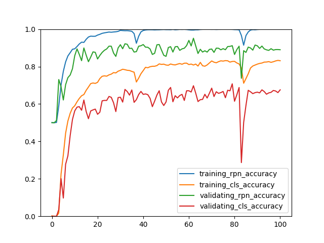

执行以下命令，再输入图片路径可以使用学习好的模型识别图片：

``` text
python3 example.py eval
```

以下是部分识别结果：

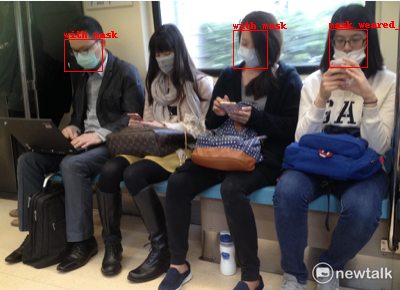

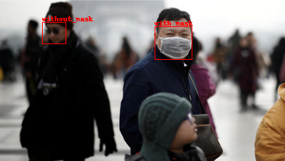

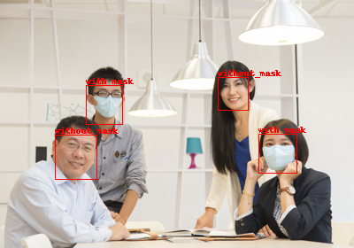

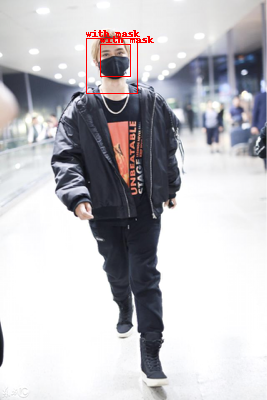

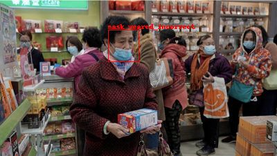

效果还行吧🤗，顺道一提每张图片的识别时间大约在 0.05 ~ 0.06 秒之间，相对于 Fast-RCNN 快了接近 10 倍，用在视频上大约可以支持 20fps 左右 (我机器配置比较低，4 核 CPU + GTX1650，高配机器可以更快🤒)。

## 写在最后

这篇介绍的 Faster-RCNN 效果明显比之前介绍的 RCNN 与 Fast-RCNN 更好，但还是有缺点的，如果对象相对于图片很小或者很大，那么对象与锚点的各个形状的重叠率都会比较低，导致无法识别出来。下一篇介绍的 YOLO 模型一定程度上改善了这个问题，但接下来一头半个月我估计都没时间写，想看的耐心等吧🤕。
