# 写给程序员的机器学习入门 (十二) - 脸部关键点检测

在前几篇文章中我们看到了怎样检测图片上的物体，例如人脸，那么把实现人脸识别的时候是不是可以把图片中的人脸截取出来再交给识别人脸的模型呢？下面的流程是可行的，但因为人脸的范围不够准确，截取出来的人脸并不在图片的正中心，对于识别人脸的模型来说，数据质量不够好就会导致识别的效果打折。

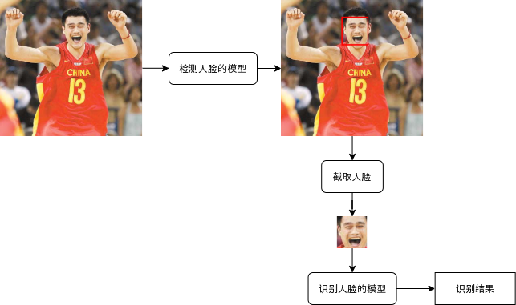

这一篇文章会介绍如何使用机器学习检测脸部关键点 (眼睛鼻子嘴巴的位置)，检测图片上的人脸以后，再检测脸部关键点，然后基于脸部关键点来调整人脸范围，再根据调整后的人脸范围截取人脸并交给后面的模型，即可提升数据质量改善识别效果。

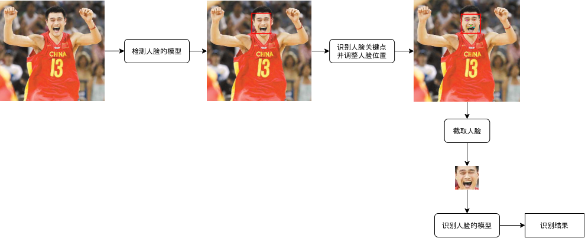

## 脸部关键点检测模型

脸部关键点检测模型其实就是普通的 CNN 模型，在[第八篇文章](https://www.cnblogs.com/zkweb/p/13354826.html)中已经介绍过🤒，第八篇文章中，输入是图片，输出是分类 (例如动物的分类，或者验证码中的字母分类)。而这一篇文章输入同样是图片，输出则是各个脸部关键点的坐标：

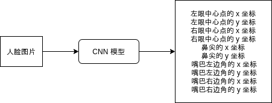

我们会让模型输出五个关键点 (左眼中心，右眼中心，鼻尖，嘴巴左边角，嘴巴右边角) 的 x 坐标与 y 坐标，合计一共 10 个输出。

模型输出的坐标值范围会落在 -1 ~ 1 之间，这是把图片左上角视为 -1,-1，右下角视为 1,1 以后正规化的坐标值。不使用绝对值的原因是机器学习模型并不适合处理较大的值，并且使用相对坐标可以让处理不同大小图片的逻辑更加简单。你可能会问为什么不像前一篇介绍的 YOLO 一样，让坐标值范围落在 0 ~ 1 之间，这是因为下面会使用仿射变换来增加人脸样本，而仿射变换要求相对坐标在 -1 ~ 1 之间，让坐标值范围落在 -1 ~ 1 之间可以省掉转换的步骤。

## 训练使用的数据集

准备数据集是机器学习中最头疼的部分，一般来说我们需要上百度搜索人脸的图片，然后一张一张的截取，再手动标记各个器官的位置，但这样太苦累了😭。这篇还是像之前的文章一样，从网上找一个现成的数据集来训练，偷个懒🤗。

使用的数据集：

https://www.kaggle.com/drgilermo/face-images-with-marked-landmark-points

下载回来以后可以看到以下的文件：

``` text
face_images.npz
facial_keypoints.csv
```

`face_images.npz` 是使用 zip 压缩后的 numpy 数据转储文件，把文件名改为 `face_images.zip` 以后再解压缩即可得到 `face_images.npy` 文件。

之后再执行 python 命令行，输入以下代码加载数据内容：

``` python
>>> import numpy
>>> data = numpy.load("face_images.npy")
>>> data.shape
(96, 96, 7049)
```

可以看到数据包含了 7049 张 96x96 的黑白人脸图片。

再输入以下代码保存第一章图片：

``` python
>>> import torch
>>> data = torch.from_numpy(data).float()
>>> data.shape
torch.Size([96, 96, 7049])
# 把通道放在最前面
>>> data = data.permute(2, 0, 1)
>>> data.shape
torch.Size([7049, 96, 96])
# 提取第一张图片的数据并保存
>>> from PIL import Image
>>> img = Image.fromarray(data[0].numpy()).convert("RGB")
>>> img.save("1.png")
```

这就是提取出来的图片：


对应以下的坐标，坐标的值可以在 `facial_keypoints.csv` 中找到：

``` text
left_eye_center_x,left_eye_center_y,right_eye_center_x,right_eye_center_y,left_eye_inner_corner_x,left_eye_inner_corner_y,left_eye_outer_corner_x,left_eye_outer_corner_y,right_eye_inner_corner_x,right_eye_inner_corner_y,right_eye_outer_corner_x,right_eye_outer_corner_y,left_eyebrow_inner_end_x,left_eyebrow_inner_end_y,left_eyebrow_outer_end_x,left_eyebrow_outer_end_y,right_eyebrow_inner_end_x,right_eyebrow_inner_end_y,right_eyebrow_outer_end_x,right_eyebrow_outer_end_y,nose_tip_x,nose_tip_y,mouth_left_corner_x,mouth_left_corner_y,mouth_right_corner_x,mouth_right_corner_y,mouth_center_top_lip_x,mouth_center_top_lip_y,mouth_center_bottom_lip_x,mouth_center_bottom_lip_y
66.0335639098,39.0022736842,30.2270075188,36.4216781955,59.582075188,39.6474225564,73.1303458647,39.9699969925,36.3565714286,37.3894015038,23.4528721805,37.3894015038,56.9532631579,29.0336481203,80.2271278195,32.2281383459,40.2276090226,29.0023218045,16.3563789474,29.6474706767,44.4205714286,57.0668030075,61.1953082707,79.9701654135,28.6144962406,77.3889924812,43.3126015038,72.9354586466,43.1307067669,84.4857744361
```

各个坐标对应 csv 中的字段如下：

- 左眼中心点的 x 坐标: left_eye_center_x
- 左眼中心点的 y 坐标: left_eye_center_y
- 右眼中心点的 x 坐标: right_eye_center_x
- 右眼中心点的 y 坐标: right_eye_center_y
- 鼻尖的 x 坐标: nose_tip_x
- 鼻尖的 y 坐标: nose_tip_y
- 嘴巴左边角的 x 坐标: mouth_left_corner_x
- 嘴巴左边角的 y 坐标: mouth_left_corner_y
- 嘴巴右边角的 x 坐标: mouth_right_corner_x
- 嘴巴右边角的 y 坐标: mouth_right_corner_y

csv 中还有更多的坐标但我们只使用这些🤒。

接下来定义一个在图片上标记关键点的函数：

``` python
from PIL import ImageDraw

DefaultPointColors = ["#FF0000", "#FF00FF", "#00FF00", "#00FFFF", "#FFFF00"]
def draw_points(img, points, colors = None, radius=1):
    """在图片上描画关键点"""
    draw = ImageDraw.Draw(img)
    colors = colors or DefaultPointColors
    for index, point in enumerate(points):
        x, y = point
        color = colors[index] if index < len(colors) else colors[0]
        draw.ellipse((x-radius, y-radius, x+radius, y+radius), fill=color, width=1)
```

再使用这个函数标记图片即可得到：

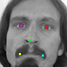

## 使用仿射变换增加人脸样本

仔细观察 csv 中的坐标值，你可能会发现里面的坐标大多都是很接近的，例如左眼中心点的 x 坐标大部分都落在 65 ~ 75 之间。这是因为数据中的人脸图片都是经过处理的，占比和位置比较标准。如果我们直接拿这个数据集来训练，那么模型只会输出学习过的区间的值，这是再拿一张占比和位置不标准的人脸图片给模型，模型就会输出错误的坐标。

解决这个问题我们可以随机旋转移动缩放人脸以增加数据量，在[第十篇文章](https://www.cnblogs.com/zkweb/p/14078501.html)我们学到怎样用仿射变换来提取图片中的某个区域并缩放到固定的大小，仿射变换还可以用来实现旋转移动和缩放，批量计算时的效率非常高。

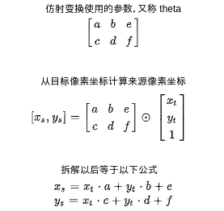

首先我们需要以下的变量：

- 弧度，范围是 -π ~ π，对应 -180°~ 180°
- 缩放比例，1 代表 100%
- 横向移动量：范围是 -1 ~ 1，把图片中心视为 0，左边视为 -1，右边视为 1
- 纵向移动量：范围是 -1 ~ 1，把图片中心视为 0，左边视为 -1，右边视为 1

根据这些变量生成仿射变换参数的公式如下：

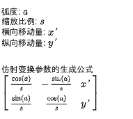

需要注意的是仿射变换参数用于转换 **目标坐标** 到 **来源坐标**，在处理图片的时候可以根据目标像素找到来源像素，然后设置来源像素的值到目标像素的值实现各种变形操作。上述的参数只能用于处理图片，如果我们想计算变形以后的图片对应的坐标，我们还需要一个转换 **来源坐标** 到 **目标坐标** 的仿射变换参数，计算相反的仿射变换参数的公式如下：

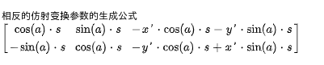

翻译到代码如下：

``` python
def generate_transform_theta(angle, scale, x_offset, y_offset, inverse=False):
    """
    计算变形参数
    angle: 范围 -math.pi ~ math.pi
    scale: 1 代表 100%
    x_offset: 范围 -1 ~ 1
    y_offset: 范围 -1 ~ 1
    inverse: 是否计算相反的变形参数 (默认计算把目标坐标转换为来源坐标的参数)
    """
    cos_a = math.cos(angle)
    sin_a = math.sin(angle)
    if inverse:
        return (
            ( cos_a * scale, sin_a * scale, -x_offset * cos_a * scale - y_offset * sin_a * scale),
            (-sin_a * scale, cos_a * scale, -y_offset * cos_a * scale + x_offset * sin_a * scale))
    else:
        return (
            (cos_a / scale, -sin_a / scale, x_offset),
            (sin_a / scale,  cos_a / scale, y_offset))
```

变形后的人脸样本如下，背景添加了随机颜色让模型更难作弊，具体代码参考后面的 `prepare` 函数吧😰：

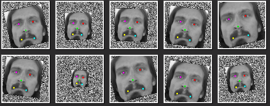

## 完整代码

完整代码的时间到了🥳，结构跟前面的文章一样，分为 `prepare`, `train`, `eval` 三步。

``` python
import os
import sys
import torch
import gzip
import itertools
import random
import numpy
import math
import json
import pandas
import torchvision
from PIL import Image, ImageDraw
from torch import nn
from matplotlib import pyplot
from collections import defaultdict

# 图片大小
IMAGE_SIZE = (96, 96)
# 训练使用的数据集路径
DATASET_PATH = "./dataset/face-images-with-marked-landmark-points/face_images.npy"
DATASET_CSV_PATH = "./dataset/face-images-with-marked-landmark-points/facial_keypoints.csv"
# 针对各张图片随机变形的数量
RANDOM_TRANSFORM_SAMPLES = 10

# 用于启用 GPU 支持
device = torch.device("cuda" if torch.cuda.is_available() else "cpu")

class FaceLandmarkModel(nn.Module):
    """
    检测脸部关键点的模型 (基于 ResNet-18)
    针对图片输出:
    - 左眼中心点的 x 坐标
    - 左眼中心点的 y 坐标
    - 右眼中心点的 x 坐标
    - 右眼中心点的 y 坐标
    - 鼻尖的 x 坐标
    - 鼻尖的 y 坐标
    - 嘴巴左边角的 x 坐标
    - 嘴巴左边角的 y 坐标
    - 嘴巴右边角的 x 坐标
    - 嘴巴右边角的 y 坐标
    以上坐标均在 0 ~ 1 的范围内，表示相对图片长宽的位置
    """

    def __init__(self):
        super().__init__()
        # Resnet 的实现
        self.resnet = torchvision.models.resnet18(num_classes=256)
        # 支持黑白图片
        self.resnet.conv1 = nn.Conv2d(1, 64, kernel_size=7, stride=2, padding=3, bias=False)
        # 最终输出关键点的线性模型
        # 因为 torchvision 的 resnet 最终会使用一个 Linear，这里省略掉第一个 Lienar
        self.linear = nn.Sequential(
            nn.ReLU(inplace=True),
            nn.Linear(256, 128),
            nn.ReLU(inplace=True),
            nn.Linear(128, 10))

    def forward(self, x):
        tmp = self.resnet(x)
        y = self.linear(tmp)
        return y

    def detect_landmarks(self, images):
        """检测给出图片的关键点"""
        tensor_in = torch.stack([ image_to_tensor(resize_image(img)) for img in images ])
        tensor_out = self.forward(tensor_in.to(device))
        tensor_out = tensor_out.reshape(len(images), -1, 2)
        # 转换 -1 ~ 1 的坐标回绝对坐标
        size = torch.tensor(IMAGE_SIZE, dtype=torch.float).to(device)
        tensor_out = (tensor_out + 1) / 2 * size
        result = []
        for image, points in zip(images, tensor_out):
            points_mapped = []
            for point in points:
                points_mapped.append(map_point_to_original_image(point.tolist(), *image.size))
            result.append(points_mapped)
        return result

def save_tensor(tensor, path):
    """保存 tensor 对象到文件"""
    torch.save(tensor, gzip.GzipFile(path, "wb"))

def load_tensor(path):
    """从文件读取 tensor 对象"""
    return torch.load(gzip.GzipFile(path, "rb"))

def calc_resize_parameters(sw, sh):
    """计算缩放图片的参数"""
    sw_new, sh_new = sw, sh
    dw, dh = IMAGE_SIZE
    pad_w, pad_h = 0, 0
    if sw / sh < dw / dh:
        sw_new = int(dw / dh * sh)
        pad_w = (sw_new - sw) // 2 # 填充左右
    else:
        sh_new = int(dh / dw * sw)
        pad_h = (sh_new - sh) // 2 # 填充上下
    return sw_new, sh_new, pad_w, pad_h

def resize_image(img):
    """缩放图片，比例不一致时填充"""
    sw, sh = img.size
    sw_new, sh_new, pad_w, pad_h = calc_resize_parameters(sw, sh)
    img_new = Image.new("RGB", (sw_new, sh_new))
    img_new.paste(img, (pad_w, pad_h))
    img_new = img_new.resize(IMAGE_SIZE)
    return img_new

def image_to_tensor(img):
    """缩放并转换图片对象到 tensor 对象 (黑白)"""
    img = img.convert("L") # 转换到黑白图片并缩放
    arr = numpy.asarray(img)
    t = torch.from_numpy(arr)
    t = t.unsqueeze(0) # 添加通道
    t = t / 255.0 # 正规化数值使得范围在 0 ~ 1
    return t

def map_point_to_original_image(point, sw, sh):
    """把缩放后的坐标转换到缩放前的坐标"""
    x, y = point
    sw_new, sh_new, pad_w, pad_h = calc_resize_parameters(sw, sh)
    scale = IMAGE_SIZE[0] / sw_new
    x = int(x / scale - pad_w)
    y = int(y / scale - pad_h)
    x = min(max(0, x), sw - 1)
    y = min(max(0, y), sh - 1)
    return x, y

DefaultPointColors = ["#FF0000", "#FF00FF", "#00FF00", "#00FFFF", "#FFFF00"]
def draw_points(img, points, colors = None, radius=1):
    """在图片上描画关键点"""
    draw = ImageDraw.Draw(img)
    colors = colors or DefaultPointColors
    for index, point in enumerate(points):
        x, y = point
        color = colors[index] if index < len(colors) else colors[0]
        draw.ellipse((x-radius, y-radius, x+radius, y+radius), fill=color, width=1)

def generate_transform_theta(angle, scale, x_offset, y_offset, inverse=False):
    """
    计算变形参数
    angle: 范围 -math.pi ~ math.pi
    scale: 1 代表 100%
    x_offset: 范围 -1 ~ 1
    y_offset: 范围 -1 ~ 1
    inverse: 是否计算相反的变形参数 (默认计算把目标坐标转换为来源坐标的参数)
    """
    cos_a = math.cos(angle)
    sin_a = math.sin(angle)
    if inverse:
        return (
            ( cos_a * scale, sin_a * scale, -x_offset * cos_a * scale - y_offset * sin_a * scale),
            (-sin_a * scale, cos_a * scale, -y_offset * cos_a * scale + x_offset * sin_a * scale))
    else:
        return (
            (cos_a / scale, -sin_a / scale, x_offset),
            (sin_a / scale,  cos_a / scale, y_offset))

def prepare_save_batch(batch, image_tensors, point_tensors):
    """准备训练 - 保存单个批次的数据"""
    # 连接所有数据
    # image_tensor 的维度会变为 数量,1,W,H
    # point_tensor 的维度会变为 数量,10 (10 = 5 个关键点的 x y 坐标)
    image_tensor = torch.cat(image_tensors, dim=0)
    image_tensor = image_tensor.unsqueeze(1)
    point_tensor = torch.cat(point_tensors, dim=0)
    point_tensor = point_tensor.reshape(point_tensor.shape[0], -1)

    # 切分训练集 (80%)，验证集 (10%) 和测试集 (10%)
    random_indices = torch.randperm(image_tensor.shape[0])
    training_indices = random_indices[:int(len(random_indices)*0.8)]
    validating_indices = random_indices[int(len(random_indices)*0.8):int(len(random_indices)*0.9):]
    testing_indices = random_indices[int(len(random_indices)*0.9):]
    training_set = (image_tensor[training_indices], point_tensor[training_indices])
    validating_set = (image_tensor[validating_indices], point_tensor[validating_indices])
    testing_set = (image_tensor[testing_indices], point_tensor[testing_indices])

    # 保存到硬盘
    save_tensor(training_set, f"data/training_set.{batch}.pt")
    save_tensor(validating_set, f"data/validating_set.{batch}.pt")
    save_tensor(testing_set, f"data/testing_set.{batch}.pt")
    print(f"batch {batch} saved")

def prepare():
    """准备训练"""
    # 数据集转换到 tensor 以后会保存在 data 文件夹下
    if not os.path.isdir("data"):
        os.makedirs("data")

    # 加载原始数据集
    images_data = torch.from_numpy(numpy.load(DATASET_PATH)).float()
    images_csv = pandas.read_csv(DATASET_CSV_PATH, usecols=(
        "left_eye_center_x",
        "left_eye_center_y",
        "right_eye_center_x",
        "right_eye_center_y",
        "nose_tip_x",
        "nose_tip_y",
        "mouth_left_corner_x",
        "mouth_left_corner_y",
        "mouth_right_corner_x",
        "mouth_right_corner_y"
    ))

    # 原始数据的维度是 (W, H, 图片数量)，需要转换为 (图片数量, W, H)
    images_data = images_data.permute(2, 0, 1)

    # 处理原始数据集
    batch = 0
    batch_size = 20 # 实际会添加 batch_size * (1 + RANDOM_TRANSFORM_SAMPLES) 到每个批次
    image_tensors = []
    point_tensors = []
    for image_data, image_row in zip(images_data, images_csv.values):
        # 读取图片参数
        w = image_data.shape[0]
        h = image_data.shape[1]
        assert w == IMAGE_SIZE[0]
        assert h == IMAGE_SIZE[1]
        size = torch.tensor((w, h), dtype=torch.float)
        points = torch.tensor(image_row, dtype=torch.float).reshape(-1, 2)
        points_std = points / size * 2 - 1 # 左上角 -1,-1 右下角 1,1
        # 正规化图片数据
        image_data = image_data / 255
        # 对图片进行随机变形
        thetas = []
        thetas_inverse = []
        for _ in range(RANDOM_TRANSFORM_SAMPLES):
            angle = math.pi * random.uniform(-0.1, 0.1)
            scale = random.uniform(0.30, 1.0)
            x_offset = random.uniform(-0.2, 0.2)
            y_offset = random.uniform(-0.2, 0.2)
            thetas.append(generate_transform_theta(angle, scale, x_offset, y_offset))
            thetas_inverse.append(generate_transform_theta(angle, scale, x_offset, y_offset, True))
        thetas_tensor = torch.tensor(thetas, dtype=torch.float)
        thetas_inverse_tensor = torch.tensor(thetas_inverse, dtype=torch.float)
        grid = nn.functional.affine_grid(
            thetas_tensor,
            torch.Size((RANDOM_TRANSFORM_SAMPLES, 1, w, h)),
            align_corners=False)
        images_transformed = nn.functional.grid_sample(
            image_data.repeat(RANDOM_TRANSFORM_SAMPLES, 1, 1)
                .reshape(RANDOM_TRANSFORM_SAMPLES, 1, w, h), grid)
        # 替换黑色的部分到随机颜色
        random_color = torch.rand(images_transformed.shape)
        zero_indices = images_transformed == 0
        images_transformed[zero_indices] = random_color[zero_indices]
        # 转换变形后的坐标
        points_std_with_one = torch.cat((points_std, torch.ones(points_std.shape[0], 1)), dim=1)
        points_std_transformed = points_std_with_one.matmul(thetas_inverse_tensor.permute(0, 2, 1))
        # 连接原图片和变形后的图片，原坐标和变形后的坐标
        images_cat = torch.cat((image_data.unsqueeze(0), images_transformed.squeeze(1)), dim=0)
        points_std_cat = torch.cat((points_std.unsqueeze(0), points_std_transformed), dim=0)
        points_cat = (points_std_cat + 1) / 2 * size
        # 测试变形后的图片与参数
        # for index, (img_data, points) in enumerate(zip(images_cat, points_cat)):
        #    img = Image.fromarray((img_data * 255).numpy()).convert("RGB")
        #    draw_points(img, points)
        #    img.save(f"test_{index}.png")
        # 保存批次
        image_tensors.append(images_cat)
        point_tensors.append(points_std_cat)
        if len(image_tensors) > batch_size:
            prepare_save_batch(batch, image_tensors, point_tensors)
            image_tensors.clear()
            point_tensors.clear()
            batch += 1
    # 保存剩余的批次
    if len(image_tensors) > 10:
        prepare_save_batch(batch, image_tensors, point_tensors)

def train():
    """开始训练"""
    # 创建模型实例
    model = FaceLandmarkModel().to(device)

    # 创建损失计算器
    def loss_function(predicted, actual):
        predicted_flatten = predicted.view(-1)
        actual_flatten = actual.view(-1)
        mask = torch.isnan(actual_flatten).logical_not() # 用于跳过缺损的值
        return nn.functional.mse_loss(predicted_flatten[mask], actual_flatten[mask])

    # 创建参数调整器
    optimizer = torch.optim.Adam(model.parameters())

    # 记录训练集和验证集的正确率变化
    training_accuracy_history = []
    validating_accuracy_history = []

    # 记录最高的验证集正确率
    validating_accuracy_highest = -1
    validating_accuracy_highest_epoch = 0

    # 读取批次的工具函数
    def read_batches(base_path):
        for batch in itertools.count():
            path = f"{base_path}.{batch}.pt"
            if not os.path.isfile(path):
                break
            images_tensor, points_tensor = load_tensor(path)
            yield images_tensor.to(device), points_tensor.to(device)

    # 计算正确率的工具函数
    def calc_accuracy(actual, predicted):
        predicted_flatten = predicted.view(-1)
        actual_flatten = actual.view(-1)
        mask = torch.isnan(actual_flatten).logical_not() # 用于跳过缺损的值
        diff = (predicted_flatten[mask] - actual_flatten[mask]).abs()
        return 1 - diff.mean().item()

    # 开始训练过程
    for epoch in range(1, 10000):
        print(f"epoch: {epoch}")

        # 根据训练集训练并修改参数
        # 切换模型到训练模式，将会启用自动微分，批次正规化 (BatchNorm) 与 Dropout
        model.train()
        training_accuracy_list = []
        for batch_index, batch in enumerate(read_batches("data/training_set")):
            # 划分输入和输出
            batch_x, batch_y = batch
            # 计算预测值
            predicted = model(batch_x)
            # 计算损失
            loss = loss_function(predicted, batch_y)
            # 从损失自动微分求导函数值
            loss.backward()
            # 使用参数调整器调整参数
            optimizer.step()
            # 清空导函数值
            optimizer.zero_grad()
            # 记录这一个批次的正确率，torch.no_grad 代表临时禁用自动微分功能
            with torch.no_grad():
                training_batch_accuracy = calc_accuracy(batch_y, predicted)
            training_accuracy_list.append(training_batch_accuracy)
            print(f"epoch: {epoch}, batch: {batch_index}: batch accuracy: {training_batch_accuracy}")
        training_accuracy = sum(training_accuracy_list) / len(training_accuracy_list)
        training_accuracy_history.append(training_accuracy)
        print(f"training accuracy: {training_accuracy}")

        # 检查验证集
        # 切换模型到验证模式，将会禁用自动微分，批次正规化 (BatchNorm) 与 Dropout
        model.eval()
        validating_accuracy_list = []
        for batch in read_batches("data/validating_set"):
            batch_x, batch_y = batch
            predicted = model(batch_x)
            validating_accuracy_list.append(calc_accuracy(batch_y, predicted))
            # 释放 predicted 占用的显存避免显存不足的错误
            predicted = None
        validating_accuracy = sum(validating_accuracy_list) / len(validating_accuracy_list)
        validating_accuracy_history.append(validating_accuracy)
        print(f"validating accuracy: {validating_accuracy}")

        # 记录最高的验证集正确率与当时的模型状态，判断是否在 20 次训练后仍然没有刷新记录
        if validating_accuracy > validating_accuracy_highest:
            validating_accuracy_highest = validating_accuracy
            validating_accuracy_highest_epoch = epoch
            save_tensor(model.state_dict(), "model.pt")
            print("highest validating accuracy updated")
        elif epoch - validating_accuracy_highest_epoch > 20:
            # 在 20 次训练后仍然没有刷新记录，结束训练
            print("stop training because highest validating accuracy not updated in 20 epoches")
            break

    # 使用达到最高正确率时的模型状态
    print(f"highest validating accuracy: {validating_accuracy_highest}",
        f"from epoch {validating_accuracy_highest_epoch}")
    model.load_state_dict(load_tensor("model.pt"))

    # 检查测试集
    testing_accuracy_list = []
    for batch in read_batches("data/testing_set"):
        batch_x, batch_y = batch
        predicted = model(batch_x)
        testing_accuracy_list.append(calc_accuracy(batch_y, predicted))
    testing_accuracy = sum(testing_accuracy_list) / len(testing_accuracy_list)
    print(f"testing accuracy: {testing_accuracy}")

    # 显示训练集和验证集的正确率变化
    pyplot.plot(training_accuracy_history, label="training")
    pyplot.plot(validating_accuracy_history, label="validing")
    pyplot.ylim(0, 1)
    pyplot.legend()
    pyplot.show()

def eval_model():
    """使用训练好的模型"""
    # 创建模型实例，加载训练好的状态，然后切换到验证模式
    model = FaceLandmarkModel().to(device)
    model.load_state_dict(load_tensor("model.pt"))
    model.eval()

    # 询问图片路径，并标记关键点
    while True:
        try:
            # 打开图片
            image_path = input("Image path: ")
            if not image_path:
                continue
            img = Image.open(image_path)
            # 检测关键点
            points = model.detect_landmarks([img])[0]
            for point in points:
                print(point)
            # 输出图片与关键点
            draw_points(img, points)
            img.save("img_output.png")
            print("saved to img_output.png")
            print()
        except Exception as e:
            print("error:", e)

def main():
    """主函数"""
    if len(sys.argv) < 2:
        print(f"Please run: {sys.argv[0]} prepare|train|eval")
        exit()

    # 给随机数生成器分配一个初始值，使得每次运行都可以生成相同的随机数
    # 这是为了让过程可重现，你也可以选择不这样做
    random.seed(0)
    torch.random.manual_seed(0)

    # 根据命令行参数选择操作
    operation = sys.argv[1]
    if operation == "prepare":
        prepare()
    elif operation == "train":
        train()
    elif operation == "eval":
        eval_model()
    else:
        raise ValueError(f"Unsupported operation: {operation}")

if __name__ == "__main__":
    main()
```

文章中的 Resnet 模型直接引用了 torchvision 中的实现，结构在[第八篇文章](https://www.cnblogs.com/zkweb/p/13354826.html)已经介绍过，为了支持黑白图片修改了 `conv1` 使得入通道数变为 1。

另外一个细节是部分关键点的数据是缺损的，例如只有左眼和右眼的坐标，但是没有鼻子和嘴巴的坐标，缺损数据在读取的时候会变为 `nan`，所以代码中计算损失和正确率的时候会排除掉值为 `nan` 的数据，这样即使同一数据的部分坐标缺损模型仍然可以学习没有缺损的坐标。

把代码保存到 `face_landmark.py`，然后按以下的文件夹结构放代码和数据集：

- dataset
    - face-images-with-marked-landmark-points
        - face_images.npy
        - facial_keypoints.csv
- face_landmark.py

再执行以下命令即可开始训练：

``` text
python3 face_landmark.py prepare
python3 face_landmark.py train
```

最终训练结果如下：

``` text
epoch: 52, batch: 333: batch accuracy: 0.9883924638852477
epoch: 52, batch: 334: batch accuracy: 0.986928996630013
epoch: 52, batch: 335: batch accuracy: 0.9883735300973058
training accuracy: 0.9855450947513982
validating accuracy: 0.973902036840584
stop training because highest validating accuracy not updated in 20 epoches
highest validating accuracy: 0.976565406219812 from epoch 31
testing accuracy: 0.976561392748928
```

坐标的偏差大约是 `(1 - 0.976565406219812) * 2` 即相对图片长宽的 4.68% 左右🤔。

再执行以下命令即可使用训练好的模型：

``` text
python3 face_landmark.py eval
```

以下是部分识别结果😤：

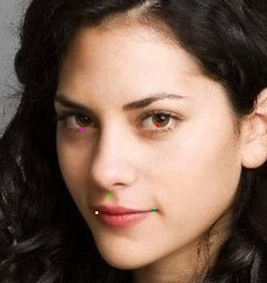

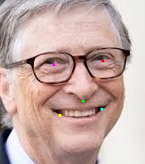

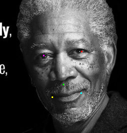

有一定误差，但是用来调整脸部范围是足够了。此外，训练出来的模型检测出来的鼻尖坐标会稍微偏下，这是因为训练数据中的大部分都是鼻子比较高的白人😡，我们看到新闻里面说人脸识别模型对于黑人识别率很低也是因为样本中绝大部分都是白人，数据的偏向会直接影响模型的检测结果🤒。

## 写在最后

这篇比较简单，下一篇将会介绍人脸识别模型，到时会像这篇最开始给出的图片一样结合三个模型实现。